# 11. Cloud & Kubernetes

> Status: **Documented**  -  MASTER reference depth for all sub-topics below.

[<- Back to master index](../README.md)

---

## Sub-topics

| # | Sub-topic | Status |
|---|-----------|--------|
| 11.1 | [IaaS](#111-iaas) | Done |
| 11.2 | [PaaS](#112-paas) | Done |
| 11.3 | [SaaS](#113-saas) | Done |
| 11.4 | [Serverless](#114-serverless) | Done |
| 11.5 | [Regions](#115-regions) | Done |
| 11.6 | [Availability Zones](#116-availability-zones) | Done |
| 11.7 | [Multi Region Deployment](#117-multi-region-deployment) | Done |
| 11.8 | [VPC](#118-vpc) | Done |
| 11.9 | [Cloud Networking](#119-cloud-networking) | Done |
| 11.10 | [Cloud Storage](#1110-cloud-storage) | Done |
| 11.11 | [Managed Databases](#1111-managed-databases) | Done |
| 11.12 | [Autoscaling](#1112-autoscaling) | Done |
| 11.13 | [Docker](#1113-docker) | Done |
| 11.14 | [Container Runtime](#1114-container-runtime) | Done |
| 11.15 | [Container Images](#1115-container-images) | Done |
| 11.16 | [Image Layers](#1116-image-layers) | Done |
| 11.17 | [Namespaces](#1117-namespaces) | Done |
| 11.18 | [cgroups](#1118-cgroups) | Done |
| 11.19 | [Kubernetes](#1119-kubernetes) | Done |
| 11.20 | [Pods](#1120-pods) | Done |
| 11.21 | [ReplicaSets](#1121-replicasets) | Done |
| 11.22 | [Deployments](#1122-deployments) | Done |
| 11.23 | [Services](#1123-services) | Done |
| 11.24 | [Ingress](#1124-ingress) | Done |
| 11.25 | [StatefulSets](#1125-statefulsets) | Done |
| 11.26 | [DaemonSets](#1126-daemonsets) | Done |
| 11.27 | [Jobs](#1127-jobs) | Done |
| 11.28 | [CronJobs](#1128-cronjobs) | Done |
| 11.29 | [ConfigMaps](#1129-configmaps) | Done |
| 11.30 | [Secrets](#1130-secrets) | Done |
| 11.31 | [Scheduler](#1131-scheduler) | Done |
| 11.32 | [etcd](#1132-etcd) | Done |
| 11.33 | [Operators](#1133-operators) | Done |
| 11.34 | [HPA](#1134-hpa) | Done |
| 11.35 | [Cluster Autoscaler](#1135-cluster-autoscaler) | Done |


---

## Overview

Cloud computing delivers on-demand compute, storage, and networking over the internet across service models (IaaS, PaaS, SaaS). Kubernetes orchestrates containers at scale - scheduling workloads, networking services, and automating rollouts across clusters spanning regions and availability zones.

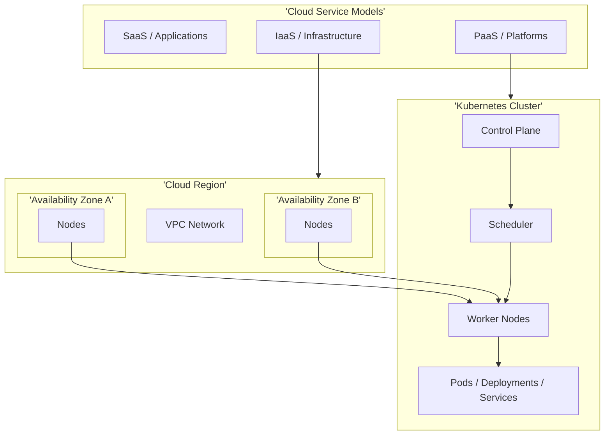

### Cloud Layers  -  IaaS / PaaS / SaaS

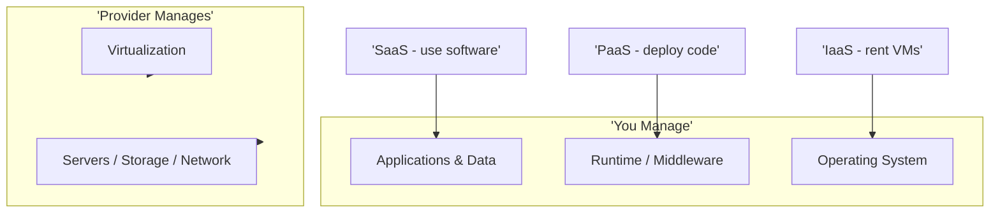

---


## Reading order

Sub-topics are sequenced for progressive learning: foundations first, then related concepts, then specialized topics.

| Group | Sections | Focus |
|-------|----------|-------|
| **1. Cloud models** | 11.1-11.4 | IaaS, PaaS, SaaS, serverless |
| **2. Cloud infrastructure** | 11.5-11.12 | Regions, VPC, storage, managed DB |
| **3. Containers** | 11.13-11.18 | Docker, images, namespaces, cgroups |
| **4. Kubernetes core** | 11.19-11.24 | K8s, pods, deployments, services, ingress |
| **5. K8s workloads and config** | 11.25-11.33 | StatefulSets, jobs, ConfigMaps, secrets, etcd |
| **6. Scaling** | 11.34-11.35 | HPA, cluster autoscaler |

---
---

## 11.1 IaaS


### What is it

**Infrastructure as a Service** - rent virtual machines, networks, block storage, and load balancers; you manage OS, runtime, and applications.

### Why it matters

Maximum control and portability for legacy or custom stacks without owning datacenters. Foundation for lift-and-shift migrations.

### How it works

Provider virtualizes hardware (hypervisor). You provision EC2/GCE/Azure VM, attach disks, configure VPC, install software. Pay per hour/second of resource use. You patch OS and scale instances manually or via autoscaling groups.

### Diagram

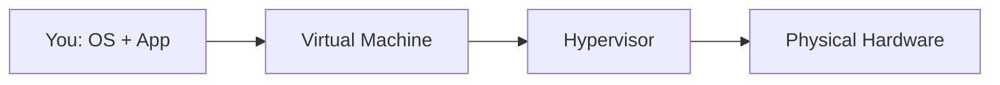

### Key details

- Examples: AWS EC2, GCP Compute Engine, Azure VMs
- Responsibilities: patching, scaling logic, HA design
- Combine with managed services (RDS) for hybrid control

### When to use

- Legacy apps needing full OS control
- Custom kernel or specialized hardware (GPU)
- Regulatory requirements for VM-level isolation

### Trade-offs

| Pros | Cons |
|------|------|
| Full control | Most ops burden on you |
| Portable patterns | Slower provisioning vs serverless |
| Predictable for steady workloads | Pay for idle capacity |

### References

- [NIST Cloud Definition](https://csrc.nist.gov/publications/detail/sp/800-145/final)

---


## 11.2 PaaS


### What is it

**Platform as a Service** - provider manages runtime, OS, and orchestration; you deploy application code and configuration.

### Why it matters

Faster delivery by eliminating server management. Kubernetes, Heroku, Cloud Run, and Elastic Beanstalk are PaaS patterns.

### How it works

Push code or container image; platform builds, deploys, scales, and routes traffic. Built-in logging, metrics, and rolling updates. Abstracts VMs and cluster operations.

### Diagram

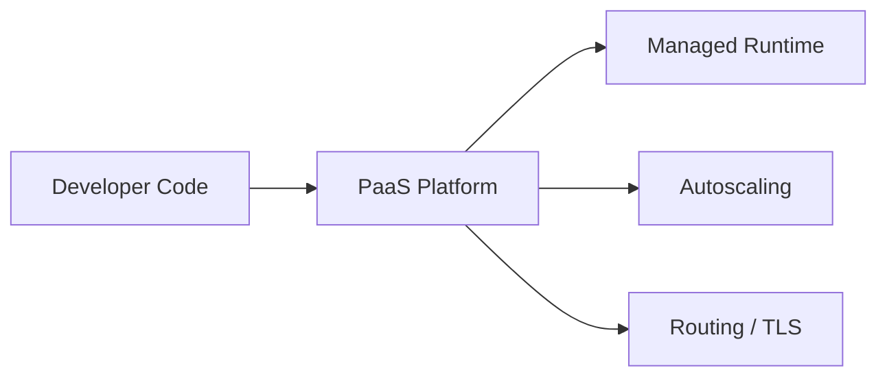

### Key details

- Examples: GKE, EKS, Heroku, Azure App Service, Cloud Run
- Trade control for velocity
- Lock-in varies by platform

### When to use

- Microservices and web APIs
- Teams without dedicated platform ops
- Standardized deployment pipelines

### Trade-offs

| Pros | Cons |
|------|------|
| Fast time to production | Less low-level control |
| Built-in scaling | Platform constraints |
| Reduced ops headcount | Vendor-specific features |

### References

- [AWS Elastic Beanstalk](https://aws.amazon.com/elasticbeanstalk/)

---


## 11.3 SaaS


### What is it

**Software as a Service** - complete applications delivered over the internet; provider manages everything including the application itself.

### Why it matters

Zero infrastructure management for commodity functions (email, CRM, monitoring). Multi-tenant efficiency drives cost down.

### How it works

Users access via browser or API. Provider runs shared or dedicated tenancy, handles upgrades, security, and SLAs. Subscription pricing per seat or usage.

### Diagram

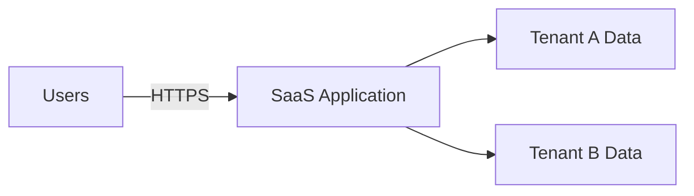

### Key details

- Examples: Salesforce, Slack, Datadog, GitHub
- Evaluate: data residency, SSO, API limits, SLA
- Integrate via webhooks and OAuth APIs

### When to use

- Non-differentiating capabilities
- Rapid adoption without build cost
- When expertise is in vendor's core product

### Trade-offs

| Pros | Cons |
|------|------|
| No ops at all | Limited customization |
| Fast onboarding | Data sovereignty concerns |
| Vendor handles security patches | Subscription cost at scale |

### References

- [SaaS vs PaaS vs IaaS](https://azure.microsoft.com/en-us/resources/cloud-computing-dictionary/what-is-iaas)

---


## 11.4 Serverless


### What is it

Event-driven compute where provider runs your function in response to triggers; you pay per invocation and duration, not idle servers.

### Why it matters

Eliminates capacity planning for spiky workloads. Scales to zero - no cost when idle.

### How it works

Deploy function (Lambda, Cloud Functions). Trigger on HTTP, queue, schedule, or storage event. Cold start loads runtime; warm invocations are fast. Provider manages scaling, patching, and availability.

### Diagram

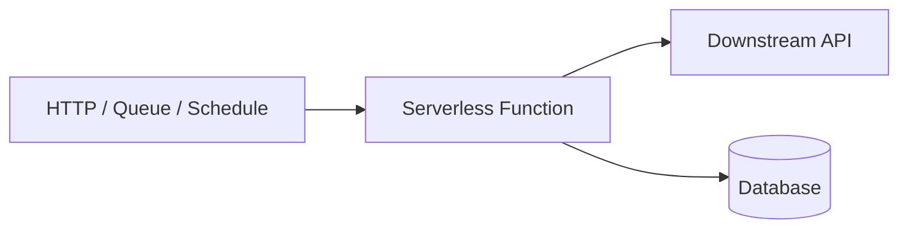

### Key details

- Cold start latency (JVM worst; Node/Python better)
- Execution time limits (15 min Lambda max)
- Stateless - externalize state to DB/cache
- FaaS + managed API Gateway pattern

### When to use

- Event processing, webhooks, ETL triggers
- Low-traffic APIs with unpredictable load
- Scheduled tasks replacing CronJobs

### Trade-offs

| Pros | Cons |
|------|------|
| No idle cost | Cold starts |
| Infinite scale (limits apply) | Vendor lock-in |
| No server patching | Debugging harder |

### References

- [AWS Lambda](https://docs.aws.amazon.com/lambda/latest/dg/welcome.html)

---


## 11.5 Regions


### What is it

Geographically separate cloud datacenter areas (e.g., `us-east-1`, `europe-west1`) with independent power, networking, and control planes.

### Why it matters

Regions enable data residency compliance, disaster recovery, and low-latency placement for global users.

### How it works

Each region is fully isolated failure domain. Resources are region-scoped unless explicitly global (IAM, Route53). Cross-region replication incurs latency and egress cost. Choose region based on users, compliance, and service availability.

### Diagram

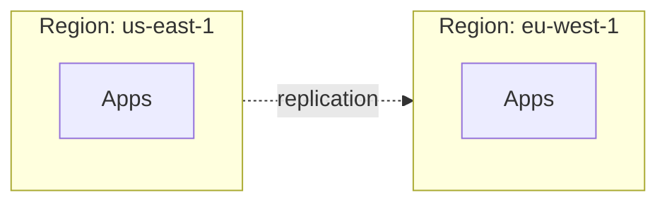

### Key details

- Not all services available in all regions
- Data sovereignty: EU data stays in EU regions
- Cross-region latency ~50 - 150ms typical
- Global services: DNS, CDN, IAM (varies by cloud)

### When to use

- Multi-region DR and active-active
- Regulatory data location requirements
- Serving geographically distributed users

### Trade-offs

| Pros | Cons |
|------|------|
| Isolation from regional outage | Cross-region complexity |
| Compliance placement | Egress costs |
| Local latency | Multi-region data consistency hard |

### References

- [AWS Global Infrastructure](https://aws.amazon.com/about-aws/global-infrastructure/)

---


## 11.6 Availability Zones


### What is it

Isolated datacenters within a region, connected by low-latency private fiber - typically 2 - 6 AZs per region.

### Why it matters

AZs are the unit of high availability within a region. Spread replicas across AZs to survive datacenter-level failure without multi-region cost.

### How it works

Deploy instances/pods in multiple AZ subnets. Load balancer distributes across AZs. Synchronous replication within region (RDS Multi-AZ) survives single AZ loss. AZ failure is rare but real (AWS us-east-1 events).

### Diagram

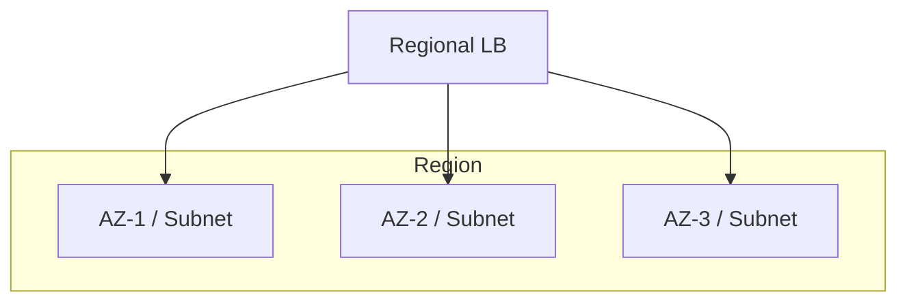

### Key details

- Latency between AZs < 2ms typically
- Design for N+1 across at least 2 AZs
- EBS/RDS AZ-specific; replicate across AZs
- K8s: pod topology spread constraints

### When to use

- Production HA within a region
- Stateful databases with multi-AZ option
- Kubernetes node pools per AZ

### Trade-offs

| Pros | Cons |
|------|------|
| Survives datacenter failure | Slightly higher cost than single AZ |
| Low inter-AZ latency | Not protection against full region loss |
| Standard HA pattern | Cross-AZ data transfer charges |

### References

- [AWS Availability Zones](https://aws.amazon.com/about-aws/global-infrastructure/regions_az/)

---


## 11.7 Multi Region Deployment


### What is it

Running application stacks in two or more cloud regions for DR, global performance, or regulatory requirements.

### Why it matters

Single-region architectures fail when entire region goes offline. Multi-region is the ultimate availability and latency strategy.

### How it works

Patterns: active-passive DR, active-active global serving, or data-local with global control plane. Global load balancer (Route53, Cloud CDN) routes users. Async/sync replication between regional databases. Independent deployments per region or GitOps fan-out.

### Diagram

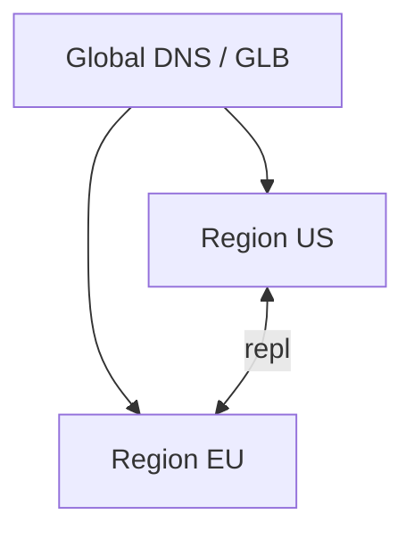

### Key details

- Resolve data consistency model first
- Automate regional failover runbooks
- Consider egress and cross-region API costs
- Compliance: data may not leave jurisdiction

### When to use

- Global user base
- Tier-0 DR requirements
- Regulatory multi-jurisdiction presence

### Trade-offs

| Pros | Cons |
|------|------|
| Region-level survivability | Highest complexity and cost |
| Local latency worldwide | Data sync challenges |
| Regulatory flexibility | Operational duplication |

### References

- [Google Cloud multi-region](https://cloud.google.com/architecture/dr-scenarios-planning-guide)

---


## 11.8 VPC


### What is it

**Virtual Private Cloud** - logically isolated virtual network in a cloud region where you define IP ranges, subnets, routing, and security boundaries.

### Why it matters

VPC is the security perimeter for cloud workloads - controlling what reaches the internet and what stays private.

### How it works

Define CIDR block (e.g., `10.0.0.0/16`). Create public subnets (IGW route) and private subnets (NAT for egress). Security groups (stateful firewall) and NACLs (stateless) control traffic. Peering and Transit Gateway connect VPCs.

### Diagram

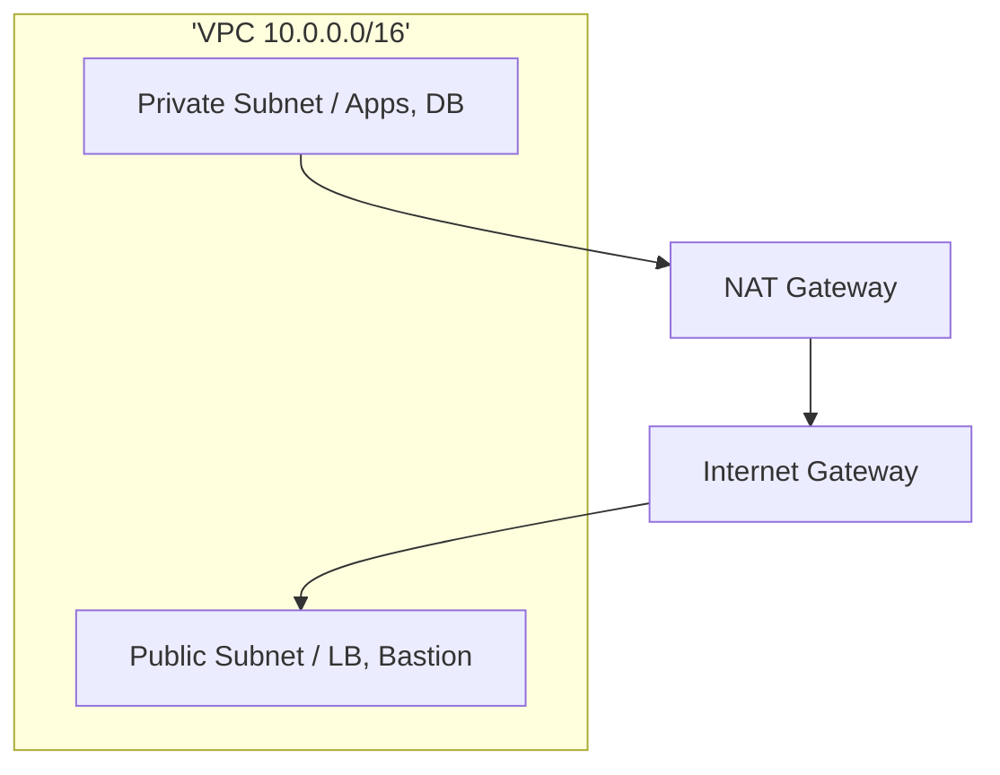

### Key details

- Private subnets for app and DB tiers
- Least-privilege security group rules
- VPC endpoints avoid internet for S3/DynamoDB
- Plan CIDR to avoid overlap for peering

### When to use

- Every cloud deployment
- Network segmentation and compliance
- Hybrid cloud via VPN/Direct Connect

### Trade-offs

| Pros | Cons |
|------|------|
| Strong isolation | CIDR planning mistakes are painful |
| Fine-grained control | NAT gateway cost |
| Hybrid connectivity | Complexity grows with peering mesh |

### References

- [AWS VPC documentation](https://docs.aws.amazon.com/vpc/latest/userguide/)

---


## 11.9 Cloud Networking


### What is it

Cloud-managed networking primitives - load balancers, DNS, CDN, VPN, private links - that connect workloads within and across VPCs and on-premises.

### Why it matters

Application availability and security depend on correct networking: public exposure, internal service mesh, and hybrid connectivity.

### How it works

ALB/NLB distribute traffic. Route53/Cloud DNS resolve names. CloudFront/CDN cache at edge. PrivateLink/ VPC endpoints keep traffic on provider backbone. VPN/Direct Connect link to corporate networks.

### Diagram

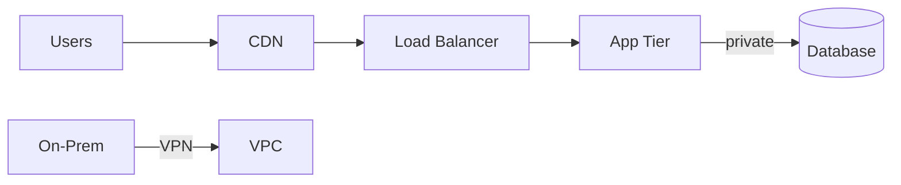

### Key details

- NLB for L4 TCP; ALB for L7 HTTP
- Health checks drive target routing
- DNS failover for DR
- Service mesh (Istio) for east-west mTLS

### When to use

- Any multi-tier architecture
- Global content delivery
- Hybrid enterprise integration

### Trade-offs

| Pros | Cons |
|------|------|
| Managed, scalable LBs | Per-hour and per-GB costs |
| Global DNS failover | DNS TTL delays failover |
| Private connectivity options | Cross-VPC complexity |

### References

- [AWS Networking overview](https://aws.amazon.com/products/networking/)

---


## 11.10 Cloud Storage


### What is it

Managed object, block, and file storage services - S3, GCS, EBS, EFS - durable and scalable without managing disks.

### Why it matters

Storage is the persistence layer for backups, static assets, data lakes, and application state. Cloud storage offers 11-nines durability for objects.

### How it works

**Object storage (S3):** buckets, keys, versioning, lifecycle policies. **Block (EBS):** volumes attached to VMs. **File (EFS/NFS):** shared POSIX. Tiering: hot, infrequent access, glacier/archive.

### Diagram

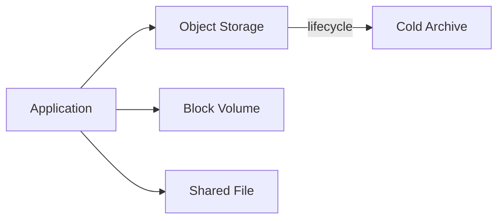

### Key details

- S3 versioning + MFA delete for ransomware defense
- Encryption at rest (SSE-S3, SSE-KMS)
- Lifecycle rules auto-tier to cheaper storage
- Consistency: S3 strong read-after-write for new objects

### When to use

- Static assets, backups, data lake (object)
- Database volumes (block)
- Shared config/content (file)

### Trade-offs

| Pros | Cons |
|------|------|
| Massive scale and durability | Egress costs |
| Pay per use | Latency vs local disk |
| Managed replication | API-specific semantics |

### References

- [AWS S3](https://docs.aws.amazon.com/AmazonS3/latest/userguide/Welcome.html)

---


## 11.11 Managed Databases


### What is it

Cloud-hosted databases (RDS, Aurora, Cloud SQL, DynamoDB) where provider handles patching, backups, replication, and failover.

### Why it matters

Operating databases is high-skill, high-risk work. Managed services reduce toil and improve reliability for most workloads.

### How it works

Choose engine (Postgres, MySQL, MongoDB). Provision instance size, storage, Multi-AZ. Automated backups and PITR. Read replicas for scale. Parameter groups tune configuration. IAM auth and VPC isolation secure access.

### Diagram

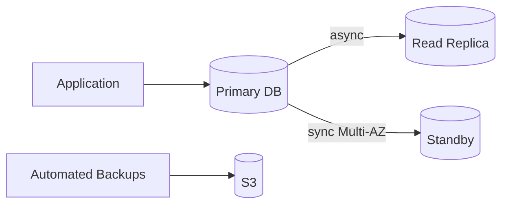

### Key details

- Multi-AZ for HA within region
- Cross-region read replicas for DR
- Connection pooling (RDS Proxy, PgBouncer)
- Monitor replication lag

### When to use

- Default choice unless custom engine needed
- Teams without dedicated DBAs
- Compliance needing automated patching

### Trade-offs

| Pros | Cons |
|------|------|
| Automated ops | Less tuning than self-managed |
| Built-in backup/HA | Vendor-specific features |
| Fast provisioning | Cost at scale vs self-hosted |

### References

- [AWS RDS](https://docs.aws.amazon.com/AmazonRDS/latest/UserGuide/Welcome.html)

---


## 11.12 Autoscaling


### What is it

Automatically adjusting compute capacity based on demand signals - CPU, queue depth, custom metrics - to match load without manual intervention.

### Why it matters

Right-sizes cost and maintains performance during traffic spikes. Core to cloud economics and SLO adherence.

### How it works

**Horizontal:** add/remove instances (HPA, ASG). **Vertical:** resize instance (less common). Policies define min/max, scale-out/in thresholds, cooldown periods. Predictive scaling uses ML on historical patterns.

### Diagram

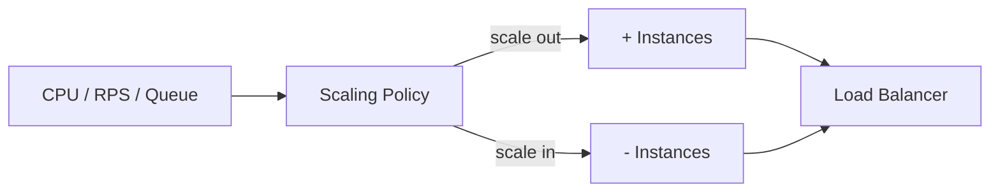

### Key details

- Scale on custom metrics (request rate, lag)
- Cooldown prevents flapping
- Combine HPA (pods) + Cluster Autoscaler (nodes)
- Pre-warm for known events (sales, launches)

### When to use

- Variable traffic web services
- Queue consumer workers
- Batch processing with backlog signals

### Trade-offs

| Pros | Cons |
|------|------|
| Cost efficiency | Scale-out lag during spikes |
| Handles unknown load | Misconfigured policies oscillate |
| Automated | Stateful apps harder to scale |

### References

- [Kubernetes HPA](https://kubernetes.io/docs/tasks/run-application/horizontal-pod-autoscale/)

---


## 11.13 Docker


### What is it

**Docker** is a platform for building, distributing, and running applications inside **containers** — lightweight, isolated processes that share the host kernel but have their own filesystem, network, and process view. The two core artifacts are:

| Concept | Definition | Lifecycle |
|---------|------------|-----------|
| **Image** | Immutable, layered read-only template (code + runtime + libs + config) | Built once, versioned, stored in a registry |
| **Container** | Runnable instance of an image — a live process with writable layer on top | Created, started, stopped, destroyed |

Containers are **not** lightweight VMs. They virtualize the **OS** (namespaces + cgroups), not hardware.

### Why it matters

Docker standardized the container workflow that underpins cloud-native delivery:

- **Build once, run anywhere** — same image from laptop → CI → staging → production
- **Reproducible environments** — eliminates "works on my machine"
- **Fast iteration** — seconds to start vs minutes for VMs
- **Foundation for Kubernetes** — K8s schedules containers; Docker (or containerd) builds and runs them locally

In system design interviews, Docker questions often pivot to: *images vs containers*, *containers vs VMs*, and *why you need orchestration (K8s) beyond Docker alone*.

### How it works

**Image build pipeline:**

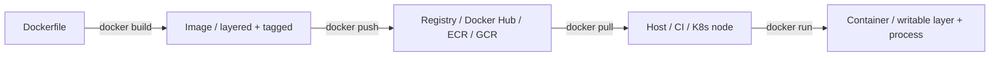

1. **Dockerfile** — declarative build recipe (`FROM`, `COPY`, `RUN`, `CMD`)
2. **`docker build`** — each instruction creates a cached layer; layers are content-addressable (SHA256)
3. **`docker push`** — uploads to registry; nodes pull only missing layers
4. **`docker run`** — creates container: mounts union filesystem, applies namespaces/cgroups, starts PID 1

**Docker daemon architecture (simplified):**

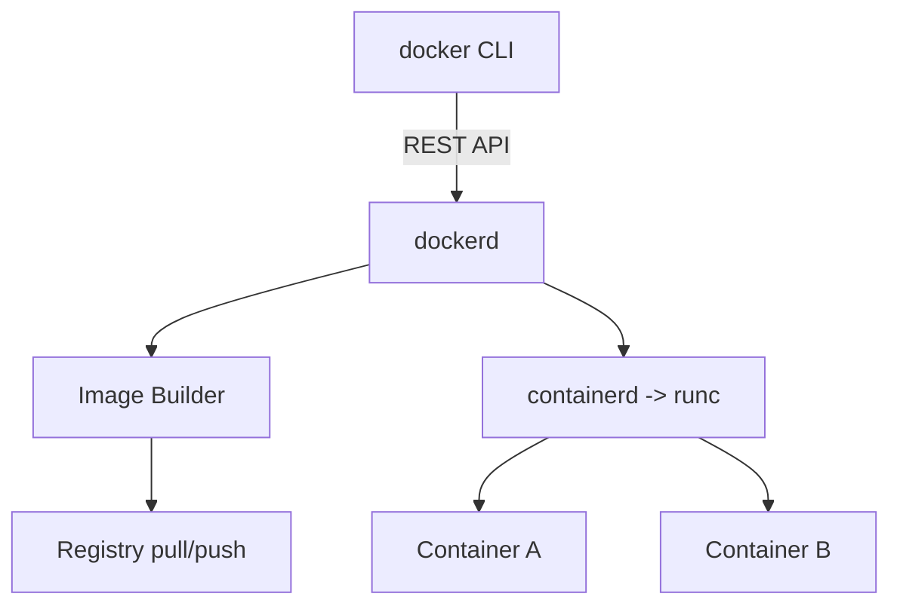

**Containers vs VMs — interview comparison:**

| Dimension | Container (Docker) | Virtual Machine |
|-----------|-------------------|-----------------|
| Isolation | Process-level (namespaces, cgroups); **shared kernel** | Hardware-level (hypervisor); **own kernel** |
| Boot time | Seconds (process start) | Minutes (full OS boot) |
| Size | MBs (image layers) | GBs (full OS disk) |
| Density | 10–100+ per host | Few per host |
| Security boundary | Weaker (kernel CVE affects all) | Stronger (hypervisor boundary) |
| Portability | OCI image, any Linux host with runtime | VM image tied to hypervisor |
| Use case | Microservices, CI, K8s workloads | Legacy monoliths, multi-OS, strong isolation |

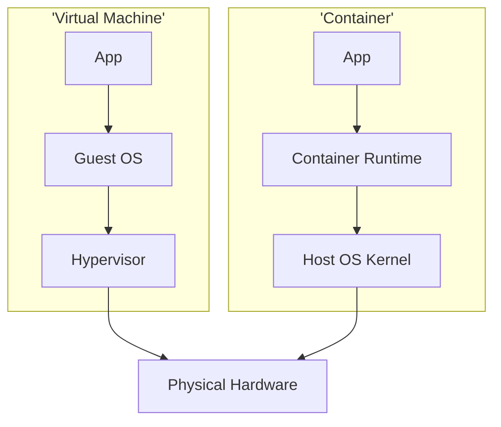

**Example — minimal Dockerfile and run:**

```dockerfile
FROM eclipse-temurin:21-jre-alpine
WORKDIR /app
COPY target/app.jar app.jar
EXPOSE 8080
USER 1000:1000
CMD ["java", "-jar", "app.jar"]
```

```bash
docker build -t myapp:1.2.3 .
docker run -d -p 8080:8080 --name api --memory=512m myapp:1.2.3
docker logs -f api
```

### Diagram

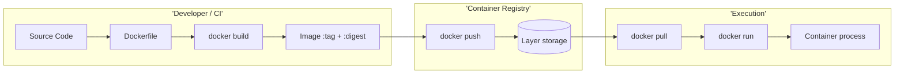

### Key details

| Topic | Detail |
|-------|--------|
| **Image immutability** | Never `docker exec` changes into prod image; rebuild + retag for fixes |
| **Tags vs digests** | Tag (`:1.2.3`) is mutable pointer; digest (`@sha256:abc…`) is immutable — use digests in prod |
| **Layer caching** | Order Dockerfile: stable layers (deps) first, volatile (app code) last |
| **Multi-stage builds** | Discard build tools; ship only runtime artifact (smaller, fewer CVEs) |
| **Docker Compose** | Local multi-container orchestration (networks, volumes, depends_on) — not for prod scale |
| **Rootless Docker** | Runs daemon as unprivileged user; reduces container escape blast radius |
| **Production gap** | Docker alone lacks HA scheduling, rolling updates, service discovery → use Kubernetes |

**Interview rapid-fire:**

| Question | Answer |
|----------|--------|
| Image vs container? | Image = blueprint (immutable); container = running instance (ephemeral writable layer) |
| Why faster than VM? | No guest OS boot; just fork/exec a process with isolated namespaces |
| What happens on `docker run`? | Pull layers → create writable layer → apply cgroups/limits → start PID 1 in new namespaces |
| Can containers run different OS? | Linux containers on Linux host only; Windows containers need Windows host |
| Docker vs Kubernetes? | Docker builds/runs containers; K8s orchestrates them at scale across a cluster |

### When to use

- **Local dev parity** — same image locally and in prod
- **CI/CD artifact** — build image in pipeline; deploy tag/digest to K8s
- **Legacy lift-and-shift** — containerize monolith before decomposing
- **Batch / sidecar patterns** — lightweight isolated processes

**Avoid Docker alone for:** multi-node HA, autoscaling across hosts, zero-downtime rollouts at scale.

### Trade-offs

| Pros | Cons |
|------|------|
| Portable, reproducible artifacts | Not a production orchestrator alone |
| Fast startup vs VMs (seconds) | Shared-kernel isolation weaker than VMs |
| Huge ecosystem (Hub, Compose, BuildKit) | Image CVEs require scanning (Trivy, Snyk) |
| Efficient resource density | `dockerd` runs as root by default (use rootless) |
| Layer caching speeds CI | Large images slow pull on cold nodes |

### References

- [Docker documentation](https://docs.docker.com/)
- [OCI Image Spec](https://github.com/opencontainers/image-spec)
- [Dockerfile best practices](https://docs.docker.com/build/building/best-practices/)

---


## 11.14 Container Runtime


### What is it

Low-level software that runs containers - implements OCI spec, manages image pull, container lifecycle, and cgroups/namespaces.

### Why it matters

Kubernetes delegates container execution to runtimes. Choice affects security (sandboxing), performance, and compatibility.

### How it works

Kubernetes CRI (Container Runtime Interface) talks to **containerd** or **CRI-O**, which invokes **runc** to create container process. Alternative: gVisor/Kata for VM-isolated sandboxes. Image pulled from registry; filesystem mounted from layers.

### Diagram

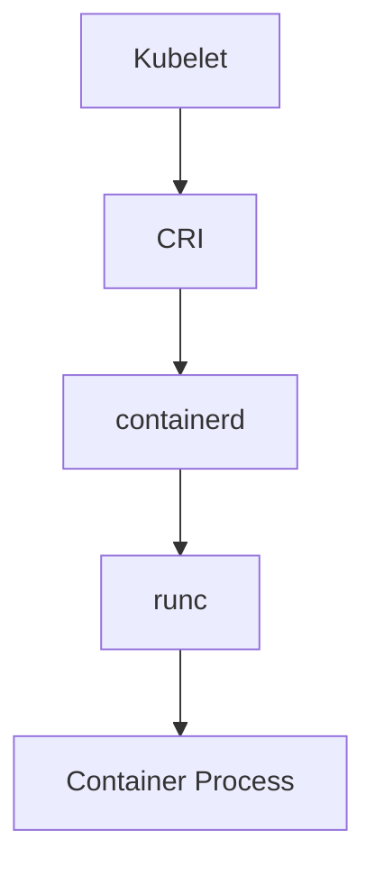

### Key details

- containerd: default in modern K8s (Docker deprecated as runtime)
- CRI-O: Red Hat/OpenShift preferred
- Sandbox runtimes for multi-tenant untrusted workloads

### When to use

- Implicit with Kubernetes (know what's under the hood)
- Security-sensitive: consider gVisor/Kata

### Trade-offs

| Pros | Cons |
|------|------|
| Standardized OCI | Abstraction hides debugging |
| Pluggable security | Sandbox runtimes add overhead |
| Lightweight vs VM | Shared kernel risk |

### References

- [Kubernetes container runtimes](https://kubernetes.io/docs/setup/production-environment/container-runtimes/)

---


## 11.15 Container Images


### What is it

Immutable, layered filesystem snapshots packaging application code, runtime, libraries, and config - the unit deployed to containers.

### Why it matters

Images are the deployable artifact in cloud-native pipelines. Immutability enables reproducible rollouts and rollbacks.

### How it works

Built from Dockerfile or buildpacks. Tagged with version (`myapp:1.2.3`) and digest (SHA256). Stored in registry. Pulled by nodes on schedule. Never mutate running image - build new tag for changes.

### Diagram

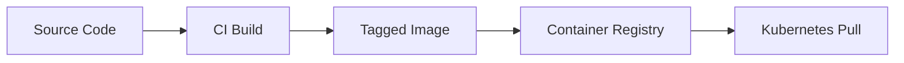

### Key details

- Semantic versioning + git SHA tags
- Scan images for CVEs (Trivy, Snyk)
- Minimal base images (distroless, alpine)
- Sign images (cosign, Notary)

### When to use

- Every containerized deployment
- GitOps: image tag is deployment trigger

### Trade-offs

| Pros | Cons |
|------|------|
| Immutable deployments | Large images slow pull |
| Versioned rollbacks | Layer cache invalidation |
| Shared base layers | Supply chain attack surface |

### References

- [OCI Image Spec](https://github.com/opencontainers/image-spec)

---


## 11.16 Image Layers


### What is it

Container images built as stacked read-only filesystem layers; each Dockerfile instruction creates a layer; layers are shared and cached across images.

### Why it matters

Layer caching speeds CI builds and reduces registry storage/pull time when base layers are shared.

### How it works

`FROM`, `RUN`, `COPY` each add layer with diff. Union filesystem presents merged view. Identical layers deduplicated in registry. Order Dockerfile: stable layers first (deps), volatile last (app code).

### Diagram

```mermaid
flowchart TB
    L1["Layer 1: Base OS"] --> L2["Layer 2: Runtime"]
    L2 --> L3["Layer 3: Dependencies"]
    L3 --> L4["Layer 4: App Code"]
    L4 --> Container[Union FS View]
```

### Key details

- Change top layer -> lower layers cache hit
- Multi-stage builds discard build-time layers
- `docker history` shows layer sizes
- Squashing reduces layers (loses cache benefit)

### When to use

- Optimizing CI build times
- Reducing image size and attack surface

### Trade-offs

| Pros | Cons |
|------|------|
| Fast rebuilds | Too many layers = metadata overhead |
| Storage deduplication | Layer order mistakes bust cache |
| Incremental pull | Large single RUN layers hard to cache |

### References

- [Docker layer caching](https://docs.docker.com/build/cache/)

---


## 11.17 Namespaces


### What is it

Linux kernel feature isolating process views of system resources - PID, network, mount, UTS - so containers see their own isolated environment.

### Why it matters

Namespaces are foundational to container isolation - process in container cannot see host processes or network stack.

### How it works

`clone()` syscalls create new namespaces. PID namespace: PID 1 in container. Network namespace: own interfaces and routing. Mount namespace: own filesystem root. User namespace: map root in container to unprivileged host user.

### Diagram

```mermaid
flowchart TB
    Host[Host Namespace] --> NS1[Container A / PID / Net / Mount]
    Host --> NS2[Container B / PID / Net / Mount]
```

### Key details

- K8s also uses "namespace" for API resource grouping (different concept)
- Share namespace: `hostNetwork`, `hostPID` (privileged, avoid)
- Network namespace per pod (default)

### When to use

- Implicit in all containers
- K8s Pod: shared network namespace between containers

### Trade-offs

| Pros | Cons |
|------|------|
| Lightweight isolation | Not as strong as VM |
| Fast creation | Shared kernel vulnerabilities |
| Composable | host* flags weaken isolation |

### References

- [Linux namespaces man page](https://man7.org/linux/man-pages/man7/namespaces.7.html)

---


## 11.18 cgroups


### What is it

**Control groups** - Linux kernel mechanism limiting and accounting CPU, memory, I/O, and process count for groups of processes.

### Why it matters

cgroups prevent one container from starving others - enforcing memory limits, CPU shares, and enabling fair scheduling on shared nodes.

### How it works

Processes assigned to cgroup hierarchy. Set `memory.max`, `cpu.weight`, `pids.max`. OOM killer terminates container exceeding memory limit. Kubernetes `resources.requests/limits` map to cgroup settings via kubelet.

### Diagram

```mermaid
flowchart LR
    Node[Physical Node] --> CG1["cgroup: Pod A / CPU 500m, Mem 512Mi"]
    Node --> CG2["cgroup: Pod B / CPU 1000m, Mem 1Gi"]
```

### Key details

- cgroup v2 unified hierarchy (modern distros)
- Exceed memory limit -> OOMKilled
- CPU limit -> throttling (CFS quota)
- Always set memory limits in production

### When to use

- Every production container workload
- Noisy neighbor prevention on shared nodes

### Trade-offs

| Pros | Cons |
|------|------|
| Resource fairness | Misconfigured limits cause OOM/throttle |
| Billing/chargeback unit | CPU limits can cause latency |
| Predictable capacity | JVM/apps need limit tuning |

### References

- [Kubernetes resource management](https://kubernetes.io/docs/concepts/configuration/manage-resources-containers/)

---


## 11.19 Kubernetes


### What is it

**Kubernetes (K8s)** is an open-source **container orchestration** platform that automates deploying, scaling, networking, and healing containerized workloads across a cluster of machines. It follows a **declarative, control-loop** model: you describe desired state in YAML; controllers continuously reconcile actual state toward that goal.

**Cluster anatomy — two planes:**

| Plane | Components | Role |
|-------|------------|------|
| **Control plane** | API server, etcd, scheduler, controller manager, cloud-controller-manager | Cluster brain — stores state, schedules pods, runs reconciliation loops |
| **Worker nodes** | kubelet, kube-proxy, container runtime (containerd/CRI-O) | Run workloads — start/stop containers, report health, route traffic |

### Why it matters

Kubernetes is the de facto standard for cloud-native microservices:

- **Self-healing** — restart crashed containers, reschedule failed pods, replace unhealthy nodes
- **Declarative ops** — GitOps-friendly; versioned manifests replace imperative SSH
- **Portable** — same APIs on EKS, GKE, AKS, on-prem
- **Ecosystem** — Ingress, HPA, Operators, service mesh integrations

Interview focus: explain **control plane components individually**, how a pod gets scheduled, and what happens when a node dies.

### How it works

**Control plane deep dive:**

| Component | Function | Interview one-liner |
|-----------|----------|---------------------|
| **API server** | Front door to cluster; validates, persists, serves REST; only component that talks to etcd | "All `kubectl` and controllers go through it; it's the single source of API truth" |
| **etcd** | Distributed key-value store; holds all cluster state (desired + observed) | "Raft quorum; lose quorum → cluster frozen" |
| **Scheduler** | Watches unscheduled pods; filters + scores nodes; binds pod to node | "Doesn't run containers — only picks the node" |
| **Controller manager** | Runs controllers (Deployment, ReplicaSet, Node, EndpointSlice, …) | "Each controller: compare desired vs actual → act" |
| **Cloud controller manager** | Cloud-specific loops (LB provisioning, node lifecycle, routes) | "Bridges K8s API to AWS/GCP/Azure APIs" |

**Worker node deep dive:**

| Component | Function |
|-----------|----------|
| **kubelet** | Agent on each node; receives pod specs from API server; instructs container runtime to start/stop containers; runs probes |
| **kube-proxy** | Maintains network rules (iptables/IPVS/eBPF) so Services reach backend pods |
| **Container runtime** | containerd → runc; pulls images, creates containers with cgroups/namespaces |

**End-to-end: `kubectl apply` → running pod**

```mermaid
sequenceDiagram
    participant U as "kubectl / User"
    participant API as API Server
    participant ETCD as etcd
    participant CM as Controller Manager
    participant SCH as Scheduler
    participant K as kubelet
    participant RT as "containerd/runc"

    U->>API: POST Deployment
    API->>ETCD: persist desired state
    CM->>API: watch Deployment
    CM->>API: create ReplicaSet + Pods (Pending)
    SCH->>API: watch unscheduled Pods
    SCH->>API: bind Pod -> Node X
    K->>API: watch Pods on Node X
    K->>RT: pull image, start containers
    RT-->>K: container running
    K->>API: update Pod status -> Running
```

**Scheduler overview (filter → score → bind):**

```mermaid
flowchart TB
    P[Pending Pod] --> SCH[Scheduler]
    SCH --> F[Filter Phase / CPU/mem fit, taints, affinity, PVC]
    F --> S[Score Phase / spread, least allocated, topology]
    S --> B[Bind to top node]
    B --> K[kubelet on node starts pod]
```

| Scheduler input | Effect |
|-----------------|--------|
| `resources.requests` | Must fit allocatable CPU/memory on node |
| `nodeSelector` / `affinity` | Hard/soft placement rules |
| `taints` + `tolerations` | Repel or allow pods on dedicated nodes |
| `topologySpreadConstraints` | Even distribution across AZs |
| `priorityClass` | Preemption of lower-priority pods |

### Diagram

```mermaid
flowchart TB
    subgraph CP['Control Plane (usually 3+ nodes for HA)']
        API[API Server / REST + auth + admission]
        ETCD[(etcd / cluster state)]
        SCH[Scheduler / pod -> node placement]
        CM[Controller Manager / reconciliation loops]
        CCM[Cloud Controller Manager]
        API <--> ETCD
        SCH & CM & CCM --> API
    end

    subgraph W1['Worker Node 1']
        K1[kubelet]
        KP1[kube-proxy]
        CR1[containerd]
        K1 --> CR1
        CR1 --> P1[Pods]
    end

    subgraph W2['Worker Node 2']
        K2[kubelet]
        KP2[kube-proxy]
        CR2[containerd]
        K2 --> CR2
        CR2 --> P2[Pods]
    end

    API --> K1 & K2
    User[kubectl / GitOps] --> API
```

### Key details

| Topic | Detail |
|-------|--------|
| **Declarative model** | Desired state in etcd; controllers close the gap — never "SSH and start app" |
| **Namespace** | API-level isolation (teams, envs) — different from Linux namespaces |
| **CNI** | Calico, Cilium, Flannel — assigns pod IPs and network policies |
| **Managed K8s** | EKS/GKE/AKS run control plane; you manage worker nodes (or serverless) |
| **High availability** | Control plane: multi-master API + etcd quorum; workers: spread pods across AZs |
| **API server load** | Watch-based; controllers react to events — not polling |

**Interview scenarios:**

| Scenario | What happens |
|----------|--------------|
| Node dies | Node controller marks `NotReady` after timeout; pods evicted/rescheduled elsewhere |
| API server down | No new changes; running pods continue; existing controllers may stall |
| etcd quorum lost | Cluster read-only or unavailable — catastrophic |
| Pod stuck Pending | Usually scheduler can't place: insufficient resources, taints, PVC unbound |
| `kubectl get pods` vs kubelet | API shows desired+status; kubelet is source of truth for local container state |

### When to use

- **Microservices at scale** — dozens to thousands of services
- **Multi-team platform** — namespaces + RBAC for self-service
- **HA rollouts + autoscaling** — Deployments, HPA, PDB
- **Hybrid / multi-cloud** — portable workload definitions

**Skip K8s when:** single monolith, tiny team, no ops capacity — use PaaS (Cloud Run, App Service) instead.

### Trade-offs

| Pros | Cons |
|------|------|
| Industry standard; huge talent pool | Steep learning curve (100+ resource types) |
| Self-healing, declarative, extensible (CRD/Operator) | Operational complexity (upgrades, etcd, networking) |
| Vendor-neutral portability | Overkill for simple apps |
| Rich autoscaling and rollout primitives | Misconfiguration → cascading failures |
| Strong ecosystem (Istio, ArgoCD, Prometheus) | Control plane HA is your problem on self-managed |

### References

- [Kubernetes documentation](https://kubernetes.io/docs/home/)
- [Kubernetes components](https://kubernetes.io/docs/concepts/overview/components/)
- [Scheduler framework](https://kubernetes.io/docs/concepts/scheduling-eviction/kube-scheduler/)

---


## 11.20 Pods


### What is it

Smallest deployable unit in Kubernetes - one or more containers sharing network namespace, storage volumes, and lifecycle context.

### Why it matters

Pods group tightly coupled containers (app + sidecar) and receive single IP address. Scheduler places pods, not individual containers.

### How it works

Pod spec defines containers, resources, volumes, probes. Scheduled to node; kubelet starts containers via runtime. Ephemeral - recreated on failure. Controllers (Deployment) manage pod replicas.

### Diagram  -  Pod Anatomy

```mermaid
flowchart TB
    subgraph Pod['Pod (shared network IP)']
        C1[App Container]
        C2[Sidecar Container]
        Vol[Shared Volumes]
    end
    Pod --> Node[Worker Node]
```

### Key details

- One pod per instance; scale by replica count
- `restartPolicy`: Always, OnFailure, Never
- Init containers run before app containers
- Avoid single-pod Deployments without controller

### When to use

- Always - everything runs in pods
- Sidecar pattern: logging, proxy, mesh

### Trade-offs

| Pros | Cons |
|------|------|
| Shared localhost networking | Ephemeral - don't store state in pod FS |
| Atomic scheduling unit | Multi-container pods harder to scale independently |

### References

- [Kubernetes Pods](https://kubernetes.io/docs/concepts/workloads/pods/)

---


## 11.21 ReplicaSets


### What is it

Controller ensuring a specified number of pod replicas with matching labels are running at all times.

### Why it matters

ReplicaSets are the mechanism Deployments use for scaling. Direct ReplicaSet use is rare - prefer Deployments for update semantics.

### How it works

Selector matches pod labels. Compares desired vs actual count; creates or deletes pods. Owned by Deployment which manages versioned ReplicaSets during rollouts.

### Diagram

```mermaid
flowchart LR
    RS["ReplicaSet / desired: 3"] -->|creates| Pods[Matching Pods]
    RS -->|deletes excess| X[Terminated Pods]
```

### Key details

- Label selector must be unique enough
- Deployment owns ReplicaSets - don't edit RS directly
- Old RS kept for rollback history (`revisionHistoryLimit`)

### When to use

- Indirectly via Deployment (normal case)
- Rarely: bare ReplicaSet without rollout needs

### Trade-offs

| Pros | Cons |
|------|------|
| Simple scaling logic | No built-in rolling update alone |
| Self-healing | Superseded by Deployment for most cases |

### References

- [Kubernetes ReplicaSet](https://kubernetes.io/docs/concepts/workloads/controllers/replicaset/)

---


## 11.22 Deployments


### What is it

A **Deployment** is the primary Kubernetes controller for **stateless** applications. It manages one or more **ReplicaSets** to ensure a declared number of **pod replicas** are running, and provides **rolling updates** and **rollbacks** when the pod template changes (e.g., new image tag).

| Concept | Role |
|---------|------|
| **Replicas** | Desired pod count (`spec.replicas`) — scale horizontally |
| **Pod template** | Container spec shared by all replicas (`spec.template`) |
| **ReplicaSet** | Deployment-owned controller that creates/deletes pods to match replica count |
| **Revision history** | Old ReplicaSets kept for rollback (`revisionHistoryLimit`, default 10) |

### Why it matters

Deployments are how production services ship code safely:

- **Zero-downtime rollouts** — replace pods incrementally, not all at once
- **Instant rollback** — revert to previous ReplicaSet in seconds
- **Horizontal scale** — `kubectl scale` or HPA adjusts replica count
- **Self-healing** — crashed pods replaced automatically

Interview staple: explain rolling update parameters, what happens during a failed rollout, and Deployment vs StatefulSet.

### How it works

**Object hierarchy:**

```mermaid
flowchart TB
    Dep["Deployment / replicas: 5 / strategy: RollingUpdate"] --> RSnew["ReplicaSet rev:3 / desired: 5"]
    Dep -.->|kept for rollback| RSold["ReplicaSet rev:2 / desired: 0"]
    RSnew --> P1[Pod]
    RSnew --> P2[Pod]
    RSnew --> P3[Pod]
    RSnew --> P4[Pod]
    RSnew --> P5[Pod]
```

**Rolling update flow** (default `strategy.type: RollingUpdate`):

```mermaid
sequenceDiagram
    participant U as "User / CI"
    participant D as Deployment Controller
    participant RS as New ReplicaSet
    participant P as Pods

    U->>D: change image tag v1 -> v2
    D->>RS: create new ReplicaSet (rev+1)
    loop Until all replicas on v2
        RS->>P: create new pod (v2)
        P-->>P: readiness probe passes
        RS->>P: terminate old pod (v1)
    end
    D->>D: scale old ReplicaSet to 0
```

**Rolling update tuning:**

| Field | Default | Meaning |
|-------|---------|---------|
| `maxSurge` | 25% | Extra pods above desired count during rollout (e.g., 5 replicas → up to 6–7 temporarily) |
| `maxUnavailable` | 25% | Pods that can be down during rollout (e.g., 5 replicas → min 4 available) |
| `minReadySeconds` | 0 | Pod must be Ready for N seconds before considered available |
| `progressDeadlineSeconds` | 600 | Rollout marked failed if no progress |

**Example manifest:**

```yaml
apiVersion: apps/v1
kind: Deployment
metadata:
  name: api
spec:
  replicas: 5
  revisionHistoryLimit: 5
  strategy:
    type: RollingUpdate
    rollingUpdate:
      maxSurge: 1
      maxUnavailable: 0        # never below 5 ready during rollout
  selector:
    matchLabels:
      app: api
  template:
    metadata:
      labels:
        app: api
    spec:
      containers:
      - name: api
        image: myregistry/api:2.1.0
        readinessProbe:
          httpGet: { path: /health, port: 8080 }
          periodSeconds: 5
        resources:
          requests: { cpu: 250m, memory: 256Mi }
          limits:   { memory: 512Mi }
```

**Rollback:**

```bash
kubectl rollout status deployment/api
kubectl rollout history deployment/api
kubectl rollout undo deployment/api                    # previous revision
kubectl rollout undo deployment/api --to-revision=3    # specific revision
```

```mermaid
flowchart LR
    V3["rev 3 : v2.1.0 / current"] -->|rollout undo| V2["rev 2 : v2.0.0 / restored"]
    V2 --> RS2[ReplicaSet scaled up]
    RS2 --> Pods[Pods on old image]
```

**Failed rollout behavior:**

| Condition | Result |
|-----------|--------|
| New pods fail readiness probe | Rollout stalls; old pods keep serving |
| `progressDeadlineSeconds` exceeded | Deployment condition `ProgressDeadlineExceeded` |
| Image pull error | `ImagePullBackOff`; rollout stuck until fixed or undone |
| Fix | `kubectl rollout undo` or fix manifest and re-apply |

**Replicas and scaling:**

| Method | Command / Mechanism |
|--------|---------------------|
| Manual | `kubectl scale deployment/api --replicas=10` |
| HPA | Scales Deployment based on CPU/custom metrics |
| GitOps | Change `replicas` in manifest; ArgoCD syncs |

### Diagram

```mermaid
flowchart TB
    subgraph Rollout['Rolling Update v1 -> v2']
        direction LR
        subgraph Before
            O1[v1] --- O2[v1] --- O3[v1]
        end
        subgraph During
            N1[v2 Ready] --- O4[v1] --- O5[v1]
        end
        subgraph After
            N2[v2] --- N3[v2] --- N4[v2]
        end
    end
    LB[Service / Ingress] --> Rollout
```

### Key details

| Topic | Detail |
|-------|--------|
| **Readiness vs liveness** | Readiness gates traffic during rollout; liveness restarts crashed containers |
| **PodDisruptionBudget** | Limits voluntary evictions during node drain — protects availability |
| **Recreate strategy** | Kill all old pods, then start new — brief downtime; used when two versions can't coexist |
| **Canary / blue-green** | Native rolling update is linear; advanced patterns use Argo Rollouts or multiple Deployments + traffic split |
| **Immutable fields** | `selector` can't change after creation — requires new Deployment |
| **Don't edit ReplicaSets** | Deployment owns them; edit Deployment template instead |

**Interview rapid-fire:**

| Question | Answer |
|----------|--------|
| Deployment vs ReplicaSet? | Deployment adds rollout/rollback; always use Deployment in practice |
| `maxUnavailable: 0`? | Never reduce below desired count — safest for prod, slower rollout |
| How does rollback work? | Scales previous ReplicaSet back up, scales current down |
| Stateful workload? | Use StatefulSet — stable identity + ordered rollout |
| Pause rollout? | `kubectl rollout pause deployment/api` — useful for canary analysis |

### When to use

- **Stateless HTTP APIs, gRPC services, queue workers**
- Any workload needing **rolling updates**, **scale**, or **rollback**
- Default choice unless you need stable pod names or per-pod storage

### Trade-offs

| Pros | Cons |
|------|------|
| Zero-downtime rolling updates (with probes) | No stable network identity per pod |
| One-command rollback | Not for databases or clustered stateful apps |
| HPA integration | Rolling update is all-or-nothing per pod — no traffic weighting without extra tooling |
| Self-healing replica management | Large replica counts + slow probes = long rollouts |
| GitOps-friendly declarative spec | `maxSurge`/`maxUnavailable` misconfig can cause brief overload or capacity dip |

### References

- [Kubernetes Deployments](https://kubernetes.io/docs/concepts/workloads/controllers/deployment/)
- [Rolling Update Deployment](https://kubernetes.io/docs/tutorials/kubernetes-basics/update/update-intro/)
- [kubectl rollout](https://kubernetes.io/docs/reference/kubectl/generated/kubectl_rollout/)

---


## 11.23 Services


### What is it

Stable network endpoint (ClusterIP, NodePort, LoadBalancer) exposing a set of pods via label selector - providing DNS name and load balancing.

### Why it matters

Pod IPs change on restart. Services provide constant `my-svc.namespace.svc.cluster.local` DNS and distribute traffic across healthy pods.

### How it works

Selector matches pod labels. kube-proxy or dataplane (eBPF/Cilium) routes to pod endpoints. Types: **ClusterIP** (internal), **NodePort** (host port), **LoadBalancer** (cloud LB), **Headless** (direct pod DNS for StatefulSet).

### Diagram  -  Service -> Pods

```mermaid
flowchart LR
    Client[Client Pod] --> SVC[Service ClusterIP]
    SVC --> P1[Pod A]
    SVC --> P2[Pod B]
    SVC --> P3[Pod C]
    Dep[Deployment] -.->|labels| P1 & P2 & P3
```

### Key details

- Session affinity optional (`sessionAffinity: ClientIP`)
- `targetPort` vs `port` mapping
- ExternalName for DNS CNAME alias
- Service mesh may bypass kube-proxy

### When to use

- Any pod accessed by other pods
- Exposing apps internally and via LoadBalancer

### Trade-offs

| Pros | Cons |
|------|------|
| Stable abstraction | kube-proxy iptables scale limits (use eBPF) |
| Built-in LB | LoadBalancer per service = cost |
| DNS integration | Headless needed for direct pod identity |

### References

- [Kubernetes Services](https://kubernetes.io/docs/concepts/services-networking/service/)

---


## 11.24 Ingress


### What is it

HTTP/HTTPS routing rules exposing services externally - host/path-based routing, TLS termination, and virtual hosts on a shared load balancer.

### Why it matters

One external IP/LB serves many services via path (`/api`, `/web`) and hostnames - reducing cost and simplifying edge configuration.

### How it works

Ingress resource defines rules; **Ingress Controller** (nginx, traefik, AWS ALB) implements them. Routes to backend Services. TLS via cert-manager + Let's Encrypt. Gateway API is modern successor.

### Diagram

```mermaid
flowchart LR
    Internet[Internet] --> IC[Ingress Controller]
    IC -->|/api| SvcA[API Service]
    IC -->|/web| SvcB[Web Service]
    IC --> TLS[TLS Certs]
```

### Key details

- Requires ingress controller installed
- Annotate for provider-specific behavior (ALB)
- Rate limiting and WAF often at ingress layer
- Consider Gateway API for new designs

### When to use

- HTTP services needing path/host routing
- TLS termination at cluster edge
- Multiple services on one LB

### Trade-offs

| Pros | Cons |
|------|------|
| Shared edge LB | Controller is separate install |
| Path-based routing | L7 only (NLB for TCP) |
| cert-manager automation | Annotation sprawl per controller |

### References

- [Kubernetes Ingress](https://kubernetes.io/docs/concepts/services-networking/ingress/)

---


## 11.25 StatefulSets


### What is it

Controller for **stateful** workloads requiring stable network identity, ordered deployment, and persistent storage per replica.

### Why it matters

Databases, Kafka brokers, and ZooKeeper need predictable pod names (`pod-0`, `pod-1`) and stable volumes - not random Deployment pod names.

### How it works

Ordered create/scale/delete (0, 1, 2 - ). Each pod gets persistent **volume claim template**. Headless Service provides stable DNS (`pod-0.svc`). Rolling update with partition for controlled rollout.

### Diagram

```mermaid
flowchart LR
    STS[StatefulSet] --> P0[pod-0 + PVC-0]
    STS --> P1[pod-1 + PVC-1]
    STS --> P2[pod-2 + PVC-2]
    HS[Headless Service] --> P0 & P1 & P2
```

### Key details

- `volumeClaimTemplates` per pod
- `podManagementPolicy`: OrderedReady vs Parallel
- Not a substitute for managed DB - often use RDS instead
- Backup PVCs with Velero

### When to use

- Self-managed clustered stateful apps
- Applications requiring stable hostname

### Trade-offs

| Pros | Cons |
|------|------|
| Stable identity + storage | Slower scale operations |
| Ordered rollout | Ops complexity vs managed DB |
| Correct for Kafka/etcd | PVC binding limits rescheduling |

### References

- [Kubernetes StatefulSets](https://kubernetes.io/docs/concepts/workloads/controllers/statefulset/)

---


## 11.26 DaemonSets


### What is it

Ensures one pod copy runs on every (or selected) node - typically for node-level agents.

### Why it matters

Cluster-wide daemons (log collectors, monitoring agents, CNI plugins) must run on every node without manual per-node deployment.

### How it works

Controller creates pod per matching node. New nodes automatically get daemon pod. `nodeSelector` or `tolerations` target subsets (GPU nodes, Windows). Updates roll through nodes.

### Diagram

```mermaid
flowchart TB
    DS[DaemonSet] --> N1[Node 1 -> Pod]
    DS --> N2[Node 2 -> Pod]
    DS --> N3[Node 3 -> Pod]
```

### Key details

- Examples: Fluent Bit, Datadog agent, node-exporter
- `hostNetwork`, `hostPID` common for system access
- Rolling update with `maxUnavailable`

### When to use

- Per-node logging/monitoring agents
- Storage or network plugins
- Security scanners

### Trade-offs

| Pros | Cons |
|------|------|
| Automatic per-node coverage | Resource use × node count |
| Survives node addition | Privileged access risk |

### References

- [Kubernetes DaemonSet](https://kubernetes.io/docs/concepts/workloads/controllers/daemonset/)

---


## 11.27 Jobs


### What is it

Controller running pods to **completion** - batch work that terminates successfully rather than running continuously.

### Why it matters

One-off and parallel batch tasks (migrations, ETL, report generation) need retry and completion tracking without pretending to be long-running services.

### How it works

Job creates pod(s); retries on failure up to `backoffLimit`. `completions` and `parallelism` for indexed/parallel work. Pod exits 0 -> Job complete. TTL controller cleans finished Jobs.

### Diagram

```mermaid
flowchart LR
    Job[Job] --> P1[Pod runs task]
    P1 -->|exit 0| Done[Completed]
    P1 -->|fail| Retry[Retry up to backoffLimit]
```

### Key details

- `restartPolicy: OnFailure` or Never
- Indexed Job for numbered parallel shards
- Suspend field pauses new pod creation

### When to use

- Database migrations, batch processing
- One-time administrative tasks
- Parallel compute to completion

### Trade-offs

| Pros | Cons |
|------|------|
| Built-in retry | Not for long-running services |
| Parallelism support | Completed Job objects accumulate |

### References

- [Kubernetes Jobs](https://kubernetes.io/docs/concepts/workloads/controllers/job/)

---


## 11.28 CronJobs


### What is it

Schedules Jobs on cron timetable - Kubernetes-native periodic batch execution.

### Why it matters

Replaces in-container crontab with cluster-managed, observable scheduled tasks with history and concurrency policies.

### How it works

`schedule: "0 2 * * *"` creates Job at 2 AM daily. `concurrencyPolicy`: Allow, Forbid, Replace. `startingDeadlineSeconds` handles missed schedules. Each run is a Job with pods.

### Diagram

```mermaid
flowchart LR
    CJ[CronJob / 0 2 * * *] -->|triggers| Job[Job]
    Job --> Pod[Pod executes]
```

### Key details

- Use UTC timezone in spec
- `successfulJobsHistoryLimit` limits clutter
- For complex workflows consider Argo Workflows
- Idempotent tasks - overlap if Allow concurrency

### When to use

- Nightly reports, cache warming, cleanup
- Periodic sync jobs
- Certificate renewal scripts

### Trade-offs

| Pros | Cons |
|------|------|
| Declarative scheduling | Cron syntax in UTC only |
| Job history | Missed runs if cluster down |
| Concurrency control | Less feature-rich than Airflow |

### References

- [Kubernetes CronJob](https://kubernetes.io/docs/concepts/workloads/controllers/cron-jobs/)

---


## 11.29 ConfigMaps


### What is it

API object storing non-sensitive configuration data as key-value pairs or files, injectable into pods as env vars or mounted volumes.

### Why it matters

Decouples configuration from container image - change config without rebuild. Supports twelve-factor app principles.

### How it works

Create ConfigMap with data. Reference in pod spec: `envFrom`, `valueFrom`, or `volumeMount`. Updates propagate to mounted volumes (with delay; relabel for env vars needs restart). Separate from Secrets for sensitive data.

### Diagram

```mermaid
flowchart LR
    CM[ConfigMap] -->|volumeMount| Pod[Pod]
    CM -->|env var| Pod
    Git[Git / CI] --> CM
```

### Key details

- Max 1 MiB per ConfigMap
- Hot-reload via mounted volume + app watch
- Helm/Kustomize generate ConfigMaps
- Don't store secrets in ConfigMaps

### When to use

- App settings, feature flags, config files
- Nginx config, application.yaml

### Trade-offs

| Pros | Cons |
|------|------|
| No image rebuild for config | Env vars need pod restart |
| Versionable in GitOps | Size limit 1 MiB |
| Plaintext OK for non-secrets | No encryption at rest by default |

### References

- [Kubernetes ConfigMaps](https://kubernetes.io/docs/concepts/configuration/configmap/)

---


## 11.30 Secrets


### What is it

Kubernetes object storing sensitive data (passwords, tokens, TLS keys) - base64 encoded, optionally encrypted at rest with KMS.

### Why it matters

Centralizes credential injection without baking secrets into images or plain ConfigMaps.

### How it works

Create Secret; mount or inject like ConfigMap. etcd encryption at rest via encryption provider config. RBAC restricts Secret read. For production: External Secrets Operator syncs from Vault/AWS SM.

### Diagram

```mermaid
flowchart LR
    Vault[External Vault] --> ESO[External Secrets Operator]
    ESO --> K8sSecret[K8s Secret]
    K8sSecret --> Pod[Pod]
```

### Key details

- Base64 ≠ encryption - enable etcd encryption
- Never commit Secrets to Git (use Sealed Secrets)
- Rotate credentials; short-lived tokens preferred
- Limit RBAC `get secrets` to necessary SAs

### When to use

- DB passwords, API keys, TLS certs in cluster
- Image pull secrets for private registry

### Trade-offs

| Pros | Cons |
|------|------|
| Native K8s integration | Weak default security |
| RBAC controllable | Visible to anyone with Secret read |
| ESO improves hygiene | etcd backup contains secrets |

### References

- [Kubernetes Secrets](https://kubernetes.io/docs/concepts/configuration/secret/)

---


## 11.31 Scheduler


### What is it

Control plane component assigning unscheduled pods to nodes based on resources, constraints, affinity, and taints/tolerations.

### Why it matters

Scheduling decisions affect performance, availability (AZ spread), cost (node utilization), and isolation (dedicated nodes).

### How it works

Filter phase: nodes meeting resource requests and constraints. Score phase: rank nodes (spread, affinity, least allocated). Bind pod to top node. kubelet then starts containers. Custom schedulers via scheduler framework plugins.

### Diagram

```mermaid
flowchart LR
    Pending[Pending Pod] --> Sched[Scheduler]
    Sched -->|filter + score| Node[Selected Node]
    Node --> Kubelet[kubelet starts pod]
```

### Key details

- `requests` required for scheduling; `limits` for cgroup
- Pod affinity/anti-affinity spread across AZs
- Taints repel pods; tolerations allow scheduling
- Topology spread constraints for even distribution

### When to use

- Implicit for every pod
- Tune for GPU nodes, spot instances, compliance

### Trade-offs

| Pros | Cons |
|------|------|
| Automated placement | Misconfigured affinity -> pending pods |
| Extensible plugins | Scheduling latency at scale |
| AZ spread built-in | Complex rules hard to debug |

### References

- [Kubernetes Scheduler](https://kubernetes.io/docs/concepts/scheduling-eviction/kube-scheduler/)

---


## 11.32 etcd


### What is it

Distributed consistent key-value store holding all Kubernetes cluster state - the source of truth for desired and actual configuration.

### Why it matters

etcd failure means control plane cannot serve API. Backup and HA etcd is critical for cluster survival.

### How it works

Raft consensus among etcd members (typically 3 or 5 for HA). API server is sole etcd client for cluster data. Watch API enables controllers to react to changes. Periodic snapshots + WAL for durability.

### Diagram

```mermaid
flowchart TB
    API[API Server] --> ETCD1[etcd member 1]
    API --> ETCD2[etcd member 2]
    API --> ETCD3[etcd member 3]
    ETCD1 <-->|Raft| ETCD2 & ETCD3
```

### Key details

- Odd member count (3, 5) for quorum
- Managed K8s hides etcd (EKS, GKE)
- Self-managed: etcd on dedicated nodes, regular backups
- Defragment and monitor db size

### When to use

- Understanding control plane failures
- Self-managed cluster operations
- Disaster recovery of cluster state

### Trade-offs

| Pros | Cons |
|------|------|
| Strong consistency | Latency sensitive to disk I/O |
| Proven (Raft) | Quorum loss halts cluster |
| Watch-based reactivity | Requires careful backup/restore |

### References

- [etcd documentation](https://etcd.io/docs/)

---


## 11.33 Operators


### What is it

Custom controller extending Kubernetes API via **CRDs** to automate complex application operations using domain knowledge (install, scale, backup, upgrade).

### Why it matters

Stateful and complex apps (Postgres, Kafka, Prometheus) need day-2 ops beyond native resources. Operators encode expert runbooks in software.

### How it works

Define CRD (e.g., `PostgresCluster`). Operator watches CR instances; reconciles desired state: create StatefulSets, Services, backups. Uses Helm charts or direct API calls. Operator SDK (Kubebuilder) accelerates development.

### Diagram

```mermaid
flowchart LR
    User[kubectl apply CR] --> API[API Server]
    Op[Operator Controller] -->|watch| API
    Op -->|reconcile| STS[StatefulSet]
    Op --> SVC[Service]
    Op --> BK[Backup Job]
```

### Key details

- Examples: Prometheus Operator, Strimzi (Kafka), CloudNativePG
- Prefer managed services when ops burden exceeds value
- Test operator upgrades in staging
- RBAC: operators often need broad permissions

### When to use

- Self-hosted complex stateful systems on K8s
- Repeated manual ops you can codify
- Platform teams offering DB-as-a-service internally

### Trade-offs

| Pros | Cons |
|------|------|
| Automates expert ops | Operator bugs are catastrophic |
| Native K8s UX | Another component to maintain |
| Repeatable DR/upgrade | Learning curve for CRD APIs |

### References

- [Operator pattern](https://kubernetes.io/docs/concepts/extend-kubernetes/operator/)

---


## 11.34 HPA


### What is it

The **Horizontal Pod Autoscaler (HPA)** automatically adjusts the **replica count** of a Deployment, StatefulSet, or ReplicaSet based on observed **metrics** — scaling pods in or out to match demand without manual `kubectl scale`.

HPA is **horizontal** (more pods), not vertical (bigger pods). It works within existing node capacity; pair with **Cluster Autoscaler** to add nodes when pods can't schedule.

### Why it matters

HPA is the core in-cluster autoscaling primitive:

- **Cost efficiency** — scale in during low traffic; scale out during peaks
- **SLO protection** — maintain target CPU/latency/queue depth automatically
- **Hands-off ops** — no on-call paging to manually scale for predictable patterns

Interview focus: metric types, replica formula, why CPU-only HPA fails, and scale-up/down behavior.

### How it works

**Control loop (every ~15 seconds):**

```mermaid
flowchart TB
    subgraph Metrics['Metrics Sources']
        MS[metrics-server / CPU / memory]
        PM[Prometheus Adapter / custom metrics]
        EM[External metrics / SQS lag, Pub/Sub]
    end
    MS & PM & EM --> API[Metrics API]
    API --> HPA[HPA Controller]
    HPA -->|desired replicas| Dep[Deployment / StatefulSet]
    Dep --> Pods[Pod count changes]
    HPA -->|reads current| Dep
```

**Replica calculation (resource metrics — simplified):**

```
desiredReplicas = ceil( currentReplicas × ( currentMetricValue / targetMetricValue ) )
```

| Example | Calculation | Result |
|---------|-------------|--------|
| 4 replicas, CPU 80%, target 50% | `ceil(4 × 80/50)` = `ceil(6.4)` | **7 replicas** |
| 10 replicas, CPU 20%, target 50% | `ceil(10 × 20/50)` = `ceil(4)` | **4 replicas** (scale in) |

Clamped by `minReplicas` and `maxReplicas`.

**Metrics-based autoscaling types:**

| Metric type | Source | Example use case |
|-------------|--------|------------------|
| **Resource** | metrics-server (kubelet cAdvisor) | CPU 70%, memory 80% of requests |
| **Pods** | Prometheus adapter / custom metrics API | Requests per second per pod |
| **Object** | External object metric | Ingress requests/sec across all pods |
| **External** | Cloud monitoring API | SQS queue depth, Kafka consumer lag |

**Example — CPU HPA:**

```yaml
apiVersion: autoscaling/v2
kind: HorizontalPodAutoscaler
metadata:
  name: api-hpa
spec:
  scaleTargetRef:
    apiVersion: apps/v1
    kind: Deployment
    name: api
  minReplicas: 3
  maxReplicas: 50
  metrics:
  - type: Resource
    resource:
      name: cpu
      target:
        type: Utilization
        averageUtilization: 70
  behavior:
    scaleUp:
      stabilizationWindowSeconds: 0
      policies:
      - type: Percent
        value: 100
        periodSeconds: 60
    scaleDown:
      stabilizationWindowSeconds: 300
      policies:
      - type: Percent
        value: 10
        periodSeconds: 60
```

**Example — custom metric (requests per second):**

```yaml
  metrics:
  - type: Pods
    pods:
      metric:
        name: http_requests_per_second
      target:
        type: AverageValue
        averageValue: "1000"
```

**Scale behavior (v2 API):**

```mermaid
flowchart LR
    subgraph ScaleUp['Scale Up (aggressive)']
        SU1[+100% pods / 60s]
        SU2[No stabilization window]
    end
    subgraph ScaleDown['Scale Down (conservative)']
        SD1[-10% pods / 60s]
        SD2[5 min stabilization window]
    end
```

| Behavior | Why |
|----------|-----|
| Fast scale-up | Traffic spikes need immediate capacity |
| Slow scale-down | Avoid flapping; let cooldown confirm trend |
| `stabilizationWindowSeconds` | Use max of recommendations in window — prevents oscillation |

### Diagram

```mermaid
flowchart TB
    Traffic[Traffic spike] --> Pods[Pods CPU rises]
    Pods --> MS[metrics-server]
    MS --> HPA["HPA: 70% > target 50%"]
    HPA -->|scale 5 -> 8| Dep[Deployment]
    Dep --> NewPods[New pods starting]
    NewPods -->|readiness OK| SVC[Service receives traffic]
    HPA -->|nodes full?| Pending[Pending pods]
    Pending --> CA[Cluster Autoscaler / adds nodes]
```

### Key details

| Topic | Detail |
|-------|--------|
| **Resource requests required** | HPA CPU % = usage / **requests**, not limits — missing requests → broken HPA |
| **metrics-server** | Required for resource metrics; install on all clusters |
| **Prometheus Adapter** | Exposes app metrics (RPS, latency, queue lag) to HPA |
| **KEDA** | Event-driven autoscaler; scale to zero on Kafka/SQS/Cron triggers |
| **Lag on spikes** | HPA reacts after metrics rise; cold pods need readiness time — pre-warm for known events |
| **Not a silver bullet** | CPU-only misses I/O-bound, memory leaks, or latency-driven load |

**HPA + Cluster Autoscaler stack:**

| Layer | Scales | Trigger |
|-------|--------|---------|
| HPA | Pods | CPU, memory, custom metrics |
| Cluster Autoscaler | Nodes | Pending pods (unschedulable) |
| VPA (optional) | Pod CPU/memory requests | Right-size requests over time |

**Interview rapid-fire:**

| Question | Answer |
|----------|--------|
| Why scale on custom metrics? | CPU idle while queue backs up — scale on lag/RPS |
| HPA vs VPA? | HPA = more pods; VPA = bigger pod resources |
| Scale to zero? | Native HPA minReplicas ≥ 1; KEDA supports zero |
| Flapping? | Tune `behavior.scaleDown.stabilizationWindowSeconds` |
| Pod pending after HPA scale? | Need Cluster Autoscaler or more nodes |

### When to use

- **Variable-load HTTP APIs, gRPC, workers** with measurable demand signal
- Any Deployment where manual scaling is reactive and error-prone
- Combined with **Cluster Autoscaler** for node-level capacity

**Avoid CPU-only HPA when:** workload is I/O-bound, event-driven (use KEDA), or latency-sensitive (add RPS/latency metrics).

### Trade-offs

| Pros | Cons |
|------|------|
| Native K8s primitive; no extra vendor | 15s+ reaction lag on sudden spikes |
| Supports resource + custom + external metrics | Requires metrics pipeline (metrics-server, Prometheus) |
| Tunable scale-up/down behavior | CPU-only often insufficient |
| Cost savings on scale-in | Misconfigured requests → wrong scaling decisions |
| Works with GitOps-declared min/max bounds | Doesn't add nodes — needs Cluster Autoscaler |

### References

- [Kubernetes HPA](https://kubernetes.io/docs/tasks/run-application/horizontal-pod-autoscale/)
- [HPA walkthrough](https://kubernetes.io/docs/tasks/run-application/horizontal-pod-autoscale-walkthrough/)
- [KEDA](https://keda.sh/)

---


## 11.35 Cluster Autoscaler


### What is it

Adds or removes **worker nodes** in the cluster node pool when pods cannot schedule (scale up) or nodes are underutilized (scale down).

### Why it matters

HPA scales pods; Cluster Autoscaler ensures nodes exist to run them - closing the loop on infrastructure autoscaling.

### How it works

Watches pending pods (unschedulable) -> triggers cloud ASG/MIG to add node. When nodes underutilized and pods can move elsewhere, cordons and drains node for removal. Respects min/max node pool size and pod disruption budgets.

### Diagram

```mermaid
flowchart TB
    Pending[Unschedulable Pods] --> CA[Cluster Autoscaler]
    CA -->|scale up| ASG[Node Pool +1]
    Under[Underused Node] --> CA
    CA -->|drain + scale down| ASG2[Node Pool -1]
    HPA[HPA adds pods] --> Pending
```

### Key details

- Cloud-specific: CA on EKS, GKE, AKS
- Pods need requests defined for scheduling signal
- `cluster-autoscaler.kubernetes.io/safe-to-evict` annotation
- Balance with HPA min replicas and node pool min

### When to use

- Managed node groups with variable workload
- Cost optimization (remove idle nodes)
- Pair with HPA for full stack autoscaling

### Trade-offs

| Pros | Cons |
|------|------|
| No manual node provisioning | Node add takes 2 - 5 minutes |
| Pay only for needed capacity | Scale-down can disrupt long jobs |
| Integrates with cloud ASG | Misconfig causes thrashing |

### References

- [Kubernetes Cluster Autoscaler](https://github.com/kubernetes/autoscaler/tree/master/cluster-autoscaler)

---


## Quick Reference

| # | Topic | Summary |
|---|-------|---------|
| 11.1 | IaaS | IaaS |
| 11.2 | PaaS | PaaS |
| 11.3 | SaaS | SaaS |
| 11.4 | Serverless | Serverless |
| 11.5 | Regions | Regions |
| 11.6 | Availability Zones | Availability Zones |
| 11.7 | Multi Region Deployment | Multi Region Deployment |
| 11.8 | VPC | VPC |
| 11.9 | Cloud Networking | Cloud Networking |
| 11.10 | Cloud Storage | Cloud Storage |
| 11.11 | Managed Databases | Managed Databases |
| 11.12 | Autoscaling | Autoscaling |
| 11.13 | Docker | Docker |
| 11.14 | Container Runtime | Container Runtime |
| 11.15 | Container Images | Container Images |
| 11.16 | Image Layers | Image Layers |
| 11.17 | Namespaces | Namespaces |
| 11.18 | cgroups | cgroups |
| 11.19 | Kubernetes | Kubernetes |
| 11.20 | Pods | Pods |
| 11.21 | ReplicaSets | ReplicaSets |
| 11.22 | Deployments | Deployments |
| 11.23 | Services | Services |
| 11.24 | Ingress | Ingress |
| 11.25 | StatefulSets | StatefulSets |
| 11.26 | DaemonSets | DaemonSets |
| 11.27 | Jobs | Jobs |
| 11.28 | CronJobs | CronJobs |
| 11.29 | ConfigMaps | ConfigMaps |
| 11.30 | Secrets | Secrets |
| 11.31 | Scheduler | Scheduler |
| 11.32 | etcd | etcd |
| 11.33 | Operators | Operators |
| 11.34 | HPA | HPA |
| 11.35 | Cluster Autoscaler | Cluster Autoscaler |

---

[â -  Back to master index](../README.md)
