# 11. Cloud & Kubernetes

[<- Back to master index](../README.md)

---

## Sub-topics

| # | Sub-topic |
|---|-----------|
| 11.1 | [IaaS](#111-iaas) |
| 11.2 | [PaaS](#112-paas) |
| 11.3 | [SaaS](#113-saas) |
| 11.4 | [Serverless](#114-serverless) |
| 11.5 | [Regions](#115-regions) |
| 11.6 | [Availability Zones](#116-availability-zones) |
| 11.7 | [Multi Region Deployment](#117-multi-region-deployment) |
| 11.8 | [VPC](#118-vpc) |
| 11.9 | [Cloud Networking](#119-cloud-networking) |
| 11.10 | [Cloud Storage](#1110-cloud-storage) |
| 11.11 | [Managed Databases](#1111-managed-databases) |
| 11.12 | [Autoscaling](#1112-autoscaling) |
| 11.13 | [Docker](#1113-docker) |
| 11.14 | [Container Runtime](#1114-container-runtime) |
| 11.15 | [Container Images](#1115-container-images) |
| 11.16 | [Image Layers](#1116-image-layers) |
| 11.17 | [Namespaces](#1117-namespaces) |
| 11.18 | [cgroups](#1118-cgroups) |
| 11.19 | [Kubernetes](#1119-kubernetes) |
| 11.20 | [Pods](#1120-pods) |
| 11.21 | [ReplicaSets](#1121-replicasets) |
| 11.22 | [Deployments](#1122-deployments) |
| 11.23 | [Services](#1123-services) |
| 11.24 | [Ingress](#1124-ingress) |
| 11.25 | [StatefulSets](#1125-statefulsets) |
| 11.26 | [DaemonSets](#1126-daemonsets) |
| 11.27 | [Jobs](#1127-jobs) |
| 11.28 | [CronJobs](#1128-cronjobs) |
| 11.29 | [ConfigMaps](#1129-configmaps) |
| 11.30 | [Secrets](#1130-secrets) |
| 11.31 | [Scheduler](#1131-scheduler) |
| 11.32 | [etcd](#1132-etcd) |
| 11.33 | [Operators](#1133-operators) |
| 11.34 | [HPA](#1134-hpa) |
| 11.35 | [Cluster Autoscaler](#1135-cluster-autoscaler) |

---

## 11.1 IaaS

### Overview

Consider renting a furnished apartment shell — walls, plumbing, and electricity are handled, but you bring the furniture, paint the walls, and fix the leaky faucet yourself. **Infrastructure as a Service (IaaS)** works the same way in the cloud: the provider runs the physical data centers and virtual machines; you install the operating system, middleware, and applications.

Technically, IaaS delivers compute, storage, and networking as on-demand resources over APIs. You manage everything from the guest OS upward — runtime, middleware, apps, data, and security configuration — while the provider owns hardware, virtualization, and facility operations. Examples include Amazon EC2, Google Compute Engine, and Azure Virtual Machines.

---

### What problem it fixes

Buying and operating physical servers is slow and capital-intensive:

- Hardware procurement takes weeks or months
- Capacity planning is guesswork — you over-provision or run out during spikes
- Data center operations (power, cooling, racking) distract engineering from product work
- Scaling down means sunk cost in idle machines

IaaS converts fixed infrastructure into elastic, metered capacity you can provision in minutes.

---

### What it does

IaaS gives you **virtual infrastructure** you control end to end above the hypervisor:

**Compute** — VMs with configurable CPU, memory, and disk.

**Storage** — block volumes and object/blob storage attached to instances.

**Networking** — virtual networks, public IPs, load balancers, and firewalls.

**Responsibility split** — provider manages physical servers, data centers, networking hardware, storage hardware, and the virtualization layer; you manage OS, runtime, middleware, applications, data, and security configuration.

---

### How it works — the architecture inside

#### Stack from user to provider

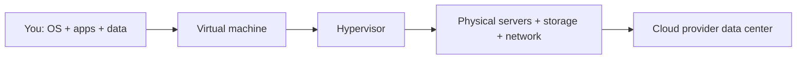

#### Provisioning flow

```text
1. Choose instance type (CPU, RAM, disk)
2. Select OS image (Linux, Windows)
3. API/UI creates VM on provider hypervisor
4. You SSH/RDP in, install runtime, deploy app
5. Scale: add instances or resize; pay for running hours + storage
```

#### Responsibility model

| Layer | IaaS — who manages |
|-------|-------------------|
| Applications, data | You |
| Runtime, middleware | You |
| Operating system | You |
| Virtualization | Provider |
| Physical hardware | Provider |

---

### Walkthrough: launching a web app on IaaS

1. Engineer provisions two `t3.medium` EC2 instances in a public subnet.
2. Installs Nginx, Node.js, and deploys the API from a CI pipeline.
3. Attaches an EBS volume for logs; configures security groups for ports 80 and 443.
4. Traffic spike → auto-scaling group adds four more instances behind an ALB.
5. Off-hours → scale in to two instances; storage and snapshots billed separately.

You retain full control over patches, kernel tuning, and runtime versions — and full responsibility for keeping them current.

---

### Pitfalls and design tips

- **IaaS is not "no ops"** — you patch the OS, harden SSH, manage AMIs, and tune security groups; the provider SLA covers the facility, not your misconfiguration.
- **When PaaS fits better** — standard HTTP APIs with no kernel modules; IaaS wins for UDP tuning, GPU drivers, or custom networking (game servers, HFT).
- **Instance type lock-in** — vertical resize often requires stop/start; prefer autoscaling groups over one oversized VM.
- **Cost surprise** — EBS, egress, NAT gateway, and idle Elastic IPs bill separately from compute hours.
- **Production:** EC2 + ASG + ALB, GCE MIG, Azure VMSS; golden AMIs via Packer or image pipelines.
- **Interview angle:** draw the responsibility split — guest OS and above is always yours on IaaS.

---

### Real-world example: Agones game servers on GKE

**Agones** (Google's open-source game-server orchestrator on Kubernetes) provisions dedicated game-server pods on GKE node pools — but the underlying pattern is IaaS: teams need custom UDP networking, kernel tuning, and per-match isolation. Studios such as Ubisoft and Supersonic have published GKE + Agones architectures where matchmakers scale node pools and game-server pods independently. IaaS (or Kubernetes on IaaS) wins over PaaS when you need non-standard network paths and OS-level control for real-time UDP.

---

## 11.2 PaaS

### Overview

Think of a fully equipped commercial kitchen — ovens, dishwashers, and health inspections are taken care of; you only bring recipes and cook. **Platform as a Service (PaaS)** gives developers a ready runtime and deployment pipeline so they write code and push it without provisioning servers or patching operating systems.

Technically, PaaS sits above IaaS: the provider manages servers, OS, runtime, middleware, scaling, and often load balancing. You supply application code, configuration, and data. Deployments target a managed platform — Google App Engine, Azure App Service, Heroku, or OpenShift — that abstracts infrastructure entirely.

---

### What problem it fixes

Teams building web apps and APIs spend too much time on undifferentiated ops:

- Provisioning VMs, OS patches, and runtime upgrades before every release
- Manual scaling and load-balancer wiring during traffic spikes
- Inconsistent dev/staging/prod environments slowing delivery
- Small teams lacking dedicated sysadmins

PaaS trades infrastructure control for faster time-to-production and lower maintenance burden.

---

### What it does

PaaS provides a **managed application platform**:

**Runtime environment** — language runtimes (Node, Python, Java, Go) pre-installed and versioned.

**Deployment** — `git push` or container deploy triggers build, test, and rollout.

**Scaling** — horizontal scaling and load balancing built into the platform.

**Integrated services** — managed databases, queues, and monitoring hooks.

You manage application code, app-level configuration, and data; the provider manages everything underneath.

---

### How it works — the architecture inside

#### Platform stack

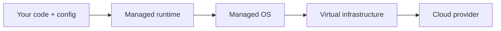

#### Deploy and scale flow

```text
Developer pushes code → platform builds artifact → deploys to runtime pool
Request arrives → platform routes to healthy instance → auto-scales replicas on load
```

#### PaaS vs IaaS responsibility

| Concern | IaaS | PaaS |
|---------|------|------|
| Server provisioning | You | Provider |
| OS patching | You | Provider |
| Runtime version | You | Provider |
| App code | You | You |
| Auto-scaling config | You (or scripts) | Built-in / declarative |

---

### Walkthrough: REST API on Heroku

1. Developer connects a GitHub repo to Heroku; `main` branch auto-deploys.
2. Platform detects a `package.json`, runs `npm install`, starts Node on a dyno.
3. Heroku assigns a public URL; SSL terminates at the platform edge.
4. Black Friday traffic doubles → engineer slides the dyno count from 2 to 10 in the dashboard.
5. Managed Postgres add-on provisions a database with backups — no VM to administer.

The team never SSHs into a server; all changes flow through code and platform config.

---

### Pitfalls and design tips

- **Platform constraints** — no custom kernel modules, limited background workers, capped request duration; read App Service / Heroku limits before committing.
- **Vendor coupling** — platform-specific bindings (Azure Storage SDK wired to App Service) complicate migration; prefer 12-factor config externalized to env vars.
- **When IaaS wins** — legacy monoliths, exotic runtimes, or compliance requiring full OS control.
- **Staging slots / preview apps** — use platform-native blue-green (App Service slots, Heroku pipelines) instead of hand-rolled VM swaps.
- **Production:** Azure App Service, Google App Engine, Heroku, Render; managed Postgres add-ons for small teams.
- **Hidden cost:** outbound bandwidth and add-on databases often exceed base dyno/compute pricing.

---

### Real-world example: internal tools on Azure App Service

An enterprise ships dozens of internal REST APIs on Azure App Service. Each API is a separate app with staging slots for blue-green deploys. Azure handles OS updates across the fleet overnight; developers only merge pull requests. They accept platform constraints — no custom kernel modules — in exchange for shipping features weekly instead of monthly.

---

## 11.3 SaaS

### Overview

Using Gmail or Zoom is like dining at a restaurant — you sit down, order, and eat; you do not own the kitchen, hire the chef, or fix the dishwasher. **Software as a Service (SaaS)** delivers complete applications over the internet: users open a browser or app and work immediately with no installation or server management.

Technically, SaaS is the highest layer of the cloud stack. The provider runs infrastructure, OS, runtime, application code, security patches, backups, and updates. Users manage accounts, permissions, and the data they create inside the product. Billing is typically per-seat or usage-based subscription.

---

### What problem it fixes

Running business software on-premises creates heavy overhead:

- License servers, install clients, and schedule upgrade windows across thousands of machines
- Security patches and backup jobs fall on internal IT
- Remote and mobile access requires VPNs and extra infrastructure
- Upfront license cost and slow rollout for new features

SaaS shifts software from a capital project to an operational subscription with continuous delivery from the vendor.

---

### What it does

SaaS delivers **ready-to-use software** as a multi-tenant cloud service:

**Access** — web UI, mobile apps, or APIs; no local install.

**Operations** — provider handles uptime, scaling, patching, and disaster recovery.

**Multi-tenancy** — one codebase serves many customers with logical data isolation.

**Subscription model** — predictable per-user or tiered pricing.

Users manage their data, account settings, and how they use the product; the provider manages everything else.

---

### How it works — the architecture inside

#### Request path

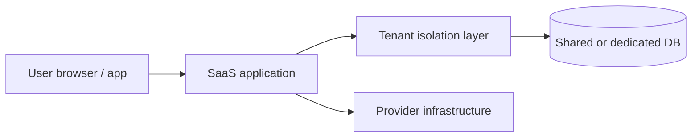

#### Tenant isolation (conceptual)

```text
Request → authenticate user → resolve tenant ID → route to tenant-scoped data partition
All tenants share app servers; data separated by tenant key, schema, or dedicated DB
```

---

### IaaS vs PaaS vs SaaS

| Feature | IaaS | PaaS | SaaS |
|---------|------|------|------|
| Infrastructure | You | Provider | Provider |
| Operating system | You | Provider | Provider |
| Runtime / middleware | You | Provider | Provider |
| Applications | You | You | Provider |
| Data | You | You | You (in-product) |
| Server management | Yes | No | No |
| Customization | High | Medium | Low |
| Ease of use | Low | Medium | High |

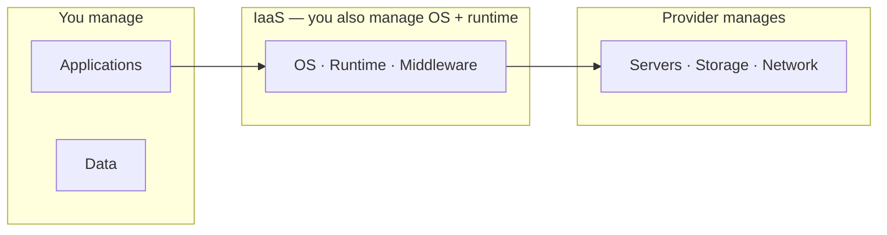

---

### Pitfalls and design tips

- **Data portability** — exporting years of CRM or ERP data at contract end is painful; negotiate API/export terms upfront.
- **Customization ceiling** — deep product logic belongs in your code, not forced into SaaS workflow hacks.
- **Shared fate** — vendor outages affect all tenants; read published status pages and SLAs, not assumed five-nines.
- **Compliance is shared** — GDPR/HIPAA obligations remain yours even when the vendor is "certified."
- **When not SaaS** — core differentiator, air-gapped environments, or sub-millisecond on-prem latency requirements.
- **Production:** Salesforce, Workday, Slack, Microsoft 365 — evaluate tenant isolation model (org ID vs dedicated instance).

---

### Real-world example: Salesforce multi-tenant CRM

Salesforce runs a **multi-tenant SaaS** CRM: each customer org shares the same application release train (three major seasonal updates per year documented on trust.salesforce.com). Admins configure objects, flows, and roles in Setup; end users access via browser or mobile with no on-prem install. Customer data is logically isolated per org ID in shared infrastructure — the trade-off is limited low-level customization versus zero server patching and global availability SLAs published by the vendor.

---

## 11.4 Serverless

### Overview

Imagine paying a taxi meter that runs only while you ride — no car payments, no garage, no oil changes. **Serverless computing** lets developers deploy functions or small services that run on demand; the cloud provider provisions servers, scales them, and tears them down when idle. Servers still exist — you simply never manage them.

Technically, serverless (often **Function as a Service**, FaaS) executes code in response to events — HTTP requests, queue messages, file uploads, schedules. Billing is per invocation and execution time, not per always-on VM. AWS Lambda, Azure Functions, Google Cloud Functions, and Cloudflare Workers are common platforms. Stateless design and short execution windows are core constraints.

---

### What problem it fixes

Always-on servers waste money and ops effort for spiky or intermittent workloads:

- Traffic at 2 AM needs one server; noon needs fifty — manual scaling lags demand
- Idle servers bill 24/7 even when code runs minutes per hour
- Patching, capacity planning, and load-balancer config distract from feature work
- Event-driven glue (resize image on upload, send SMS on DB change) does not justify a dedicated VM

Serverless matches cost and capacity to actual execution.

---

### What it does

Serverless platforms **run your code on events** with automatic operations:

**Event triggers** — HTTP, queues, storage events, cron, database changes, IoT messages.

**Auto-scaling** — concurrent instances spin up per demand; no capacity planning.

**Pay-per-use** — charged for invocations and GB-seconds, not idle time.

**Managed runtime** — provider handles OS, patching, and instance lifecycle.

You manage function code, business logic, configuration, and persistent data in external stores (databases, caches, object storage).

---

### How it works — the architecture inside

#### Execution lifecycle

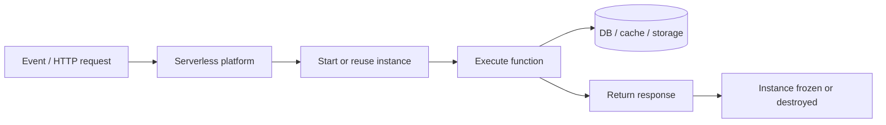

#### Cold start vs warm start

```text
Cold start:  no running instance → platform loads runtime + code → higher first-request latency
Warm start:  existing instance reused → execute immediately → lower latency
```

**How to calculate:** Lambda monthly compute (order-of-magnitude):

```text
Given: 10,000 invocations/month at peak, 200 ms average duration, 512 MB memory

GB-seconds per invoke = (512 / 1024) GB x 0.2 s = 0.1 GB-s
Monthly GB-seconds     = 10,000 x 0.1 = 1,000 GB-s

AWS Lambda compute (example tier): ~0.0000166667 USD per GB-s
Compute cost ~ 1,000 x 0.0000166667 ~ 0.017 USD/month (compute only)

Add: ~0.20 USD per 1M requests -> 10,000 requests ~ 0.002 USD
Total ~ 0.02 USD/month at this volume — compare to 2x t3.small 24/7 (~30+ USD/month each)
Sanity check: steady high traffic quickly makes reserved VMs cheaper than per-invocation pricing.
```

Functions should be **stateless** — no in-memory state carried between invocations; persist data externally.

#### Scaling comparison

| Aspect | Traditional server | Serverless |
|--------|-------------------|------------|
| Server management | You | Provider |
| Scaling | Manual / scripted | Automatic |
| Payment model | Per running hour | Per execution |
| Idle cost | Yes | No |
| Long-running workloads | Good fit | Poor fit (timeouts) |
| Unpredictable traffic | Over-provision or throttle | Scales to zero |

#### FaaS event chain example

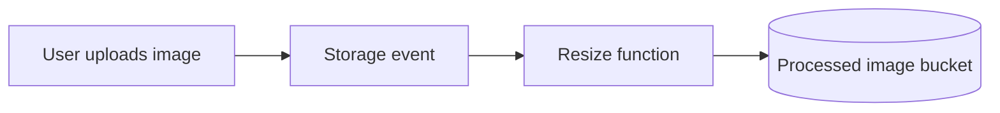

---

### Walkthrough: image thumbnail API

1. Mobile app uploads a photo to S3; an object-created event fires.
2. Lambda pulls the image, generates thumbnails, writes them to another bucket.
3. Zero uploads overnight → zero running functions → zero compute bill.
4. Viral spike → Lambda scales to thousands of concurrent executions automatically.
5. First request after idle period hits a cold start (~200 ms extra); subsequent requests on warm instances are fast.

Persistent metadata lives in DynamoDB; the function holds no local state between runs.

---

### Pitfalls and design tips

- **Cold starts** — idle functions pay latency on first invoke; provisioned concurrency or minimum instances trade cost for steady p99.
- **Timeout ceilings** — AWS Lambda max 15 minutes; long ETL belongs on Batch/Fargate, not FaaS.
- **VPC-attached Lambda** — adds ENI setup latency and NAT cost; use only when RDS/ElastiCache require private access.
- **When VMs win** — steady high QPS, WebSockets with long connections, or workloads needing local disk persistence.
- **Production:** AWS Lambda + API Gateway, Azure Functions, Google Cloud Functions, Cloudflare Workers (edge).
- **State externalized** — DynamoDB, S3, Redis; never rely on `/tmp` or memory between invocations.

---

### Real-world example: webhook processor on AWS Lambda

A fintech startup handles payment webhooks from Stripe via API Gateway → Lambda. Each webhook validates a signature, updates Postgres through RDS Proxy, and publishes to SNS. Average traffic is 50 invocations per minute; month-end peaks hit 10,000 per minute without pre-provisioned servers. The team pays roughly $40/month in Lambda compute versus an estimated $200/month for two always-on EC2 instances — and ships new handler logic with a single `terraform apply`.

---

## 11.5 Regions

### Overview

Think of a global retail chain opening warehouses in Mumbai, London, and São Paulo so customers get packages from the nearest building instead of waiting for overseas shipping. A **cloud region** is the provider's equivalent — a named geographic area (for example, `us-east-1`, `ap-south-1`) containing one or more data centers where you deploy resources close to users.

Technically, each region is an isolated footprint with its own control plane, networking, and service endpoints. Regions are physically separated — often hundreds of miles apart — to provide fault isolation, comply with data-residency laws, and reduce latency by serving users from the nearest location.

---

### What problem it fixes

Deploying everything in one distant data center creates predictable pain:

- Users in Asia hitting a US-only deployment see 200+ ms added latency
- A regional outage or natural disaster takes down the entire application
- GDPR and similar regulations require data to stay within national borders
- Single-region architecture limits disaster recovery options

Regions let you place workloads geographically and isolate large-scale failures.

---

### What it does

Regions provide **geographically scoped cloud capacity**:

**Isolation** — failure or maintenance in one region does not automatically affect others.

**Latency optimization** — route users to the nearest region via DNS or anycast.

**Compliance** — pin data and processing to approved jurisdictions.

**Service catalog** — not every service is available in every region; you choose based on features and proximity.

A region contains multiple **availability zones** ([11.6](#116-availability-zones)); multi-region strategies build on top ([11.7](#117-multi-region-deployment)).

---

### How it works — the architecture inside

#### Global footprint

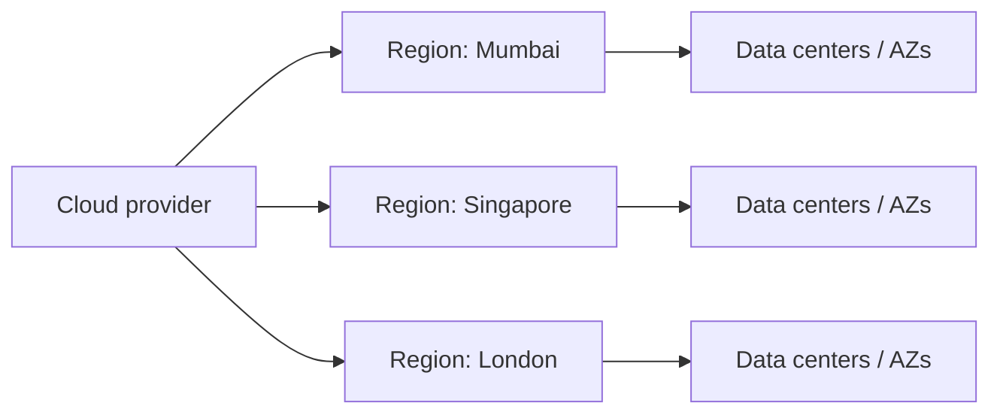

#### Request routing by proximity

```text
User in India  → ap-south-1 (Mumbai)  → app → database
User in Europe → eu-west-2 (London)   → app → database
```

#### Region failure and failover

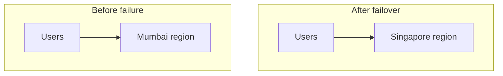

---

### Single region vs multi-region (preview)

| Deployment | Strengths | Trade-offs |
|------------|-----------|------------|
| Single region | Simple, lower cost, easier ops | Regional outage = full outage |
| Multi-region | HA, DR, global latency | Higher cost, data sync complexity |

---

### Pitfalls and design tips

- **Service availability varies** — new AWS services launch in `us-east-1` first; verify every dependency exists in your target region before architecture sign-off.
- **Cross-region egress is expensive** — replicate data deliberately; do not stream logs across regions by default.
- **Data residency** — region choice is a legal decision (GDPR, RBI, China) not only latency.
- **When single region suffices** — internal tools, early MVP, or users in one geography with multi-AZ HA.
- **Production:** pick primary + DR region early; document which resources are regional vs global (IAM, Route 53, CloudFront).
- **Failover needs rehearsal** — DNS TTL and health-check failover must be tested; "we have two regions" is not DR until proven.

---

### Real-world example: multi-region video origins

Netflix-style architectures place **origin storage** in multiple AWS regions (e.g. `us-east-1`, `eu-west-1`, `ap-northeast-1`) and front playback with a CDN (CloudFront/Akamai) that caches segments at edge PoPs. A user in Mumbai hits a local edge cache; cache misses pull from the nearest origin bucket in `ap-south-1` or `ap-southeast-1`. When `us-east-1` S3 API errors spiked during a 2021 regional event, European and Asian playback continued because origins and control planes are regional — only North American miss traffic needed rerouting to `us-west-2`.

---

## 11.6 Availability Zones

### Overview

Within one city, a hospital might have a main campus and a backup clinic on separate power grids — if one campus loses electricity, the other keeps running. **Availability zones (AZs)** are the cloud version: physically separate data centers (or groups of data centers) inside a single region, each with independent power, cooling, and networking, linked by low-latency private fiber.

Technically, an AZ is a failure domain smaller than a region. Deploying across two or three AZs in one region protects against data-center-level outages — rack fires, switch failures, or utility cuts — without the complexity and latency of cross-region replication.

---

### What problem it fixes

A single data center is a single point of failure:

- Power loss or cooling failure takes every server offline at once
- Network equipment failure isolates the entire deployment
- Maintenance on shared hardware causes unplanned downtime
- Regional compliance still met, but one building cannot survive a local incident

Multi-AZ design survives AZ-level failures while keeping replicas close enough for low-latency synchronous replication.

---

### What it does

Availability zones enable **high availability within a region**:

**Fault isolation** — AZs do not share power or core network paths.

**Low-latency links** — private interconnects between AZs (typically under 2 ms) support synchronous DB replication.

**Load distribution** — load balancers spread traffic across AZs.

**Automatic failover** — unhealthy AZ targets drain; traffic flows to surviving zones.

One region commonly offers three or more AZs (for example, Mumbai: `ap-south-1a`, `ap-south-1b`, `ap-south-1c`).

---

### How it works — the architecture inside

#### Region with multiple AZs

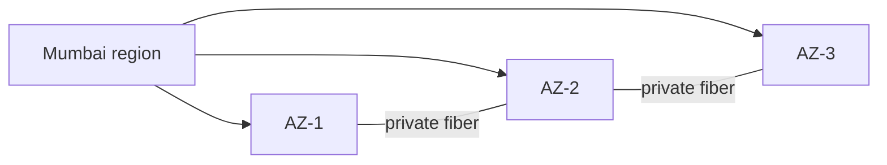

#### Multi-AZ application tier

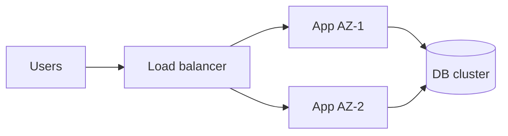

#### Database replication across AZs

```text
Primary DB in AZ-1 → synchronous replica in AZ-2
AZ-1 fails → promote replica in AZ-2 → applications reconnect via same regional endpoint
```

#### Single AZ vs multi-AZ

| | Single AZ | Multi-AZ |
|---|-----------|----------|
| Protects against | Nothing at DC level | AZ / DC failure |
| Cost | Lowest | Higher (duplicate capacity) |
| Complexity | Simple | Moderate |
| Cross-AZ latency | N/A | Low (same region) |

---

### Walkthrough: AZ failure with load balancer

1. Production API runs two instances per AZ across AZ-1 and AZ-2 behind an ALB.
2. AZ-1 loses power at 3:14 AM; health checks on AZ-1 targets fail within 10 seconds.
3. ALB stops routing to AZ-1; AZ-2 instances absorb full traffic.
4. RDS multi-AZ promotes the standby in AZ-2; DNS endpoint unchanged for apps.
5. Users experience brief errors during drain; service recovers without manual failover.

---

### Pitfalls and design tips

- **AZ labels are logical** — `1a` in two accounts may map to different physical buildings; spread across AZs, not just names.
- **Cross-AZ traffic bills** — RDS multi-AZ and Kafka replication incur per-GB charges in many clouds.
- **Quorum systems want 3 AZs** — etcd, ZooKeeper, and Raft clusters prefer odd counts across failure domains.
- **When single AZ is OK** — dev/test only; production databases and Kubernetes control planes should span AZs.
- **Production:** ALB/NLB with cross-zone load balancing; RDS Multi-AZ or Aurora with replicas in separate AZs.
- **Correlated failures happen** — software bugs and misconfigurations can take all AZs; multi-region still matters for region-wide events.

---

### Real-world example: Kubernetes across three AZs

A SaaS company runs an EKS cluster with node groups spread across three AZs in `eu-west-1`. The AWS Load Balancer Controller registers pod IPs in all zones. When `eu-west-1a` suffered a networking incident, Kubernetes rescheduled evicted pods onto nodes in `1b` and `1c`; the external ALB removed unhealthy targets automatically. Regional latency for European users stayed under 50 ms because all AZs sit within the same metro area.

---

## 11.7 Multi Region Deployment

### Overview

Imagine a airline operating hubs in New York and Frankfurt — if a snowstorm closes JFK, flights reroute through Frankfurt so passengers still reach their destinations. **Multi-region deployment** runs the same application in two or more cloud regions so regional disasters, outages, or latency walls do not take the whole service offline.

Technically, this architecture duplicates (or partitions) compute, storage, and networking across geographically separated regions — Mumbai and Singapore, for example. Traffic reaches the nearest or healthiest region via global DNS, anycast, or a geo-routing load balancer. Data consistency across regions is the hardest problem: synchronous replication adds latency; asynchronous replication allows brief divergence.

---

### What problem it fixes

Even multi-AZ deployments fail when the entire region is impaired:

- Regional control-plane outages block API calls and deployments
- Large-scale natural disasters or fiber cuts affect every AZ at once
- Global users suffer if all infrastructure sits in one continent
- Regulatory requirements may mandate in-country processing in multiple countries

Multi-region design survives **region-level** failures and serves a worldwide user base with acceptable latency.

---

### What it does

Multi-region deployment provides **geographic redundancy and global reach**:

**High availability** — one region can serve traffic while another is down.

**Disaster recovery** — pre-provisioned capacity in a secondary region reduces recovery time.

**Latency reduction** — users hit the closest active region.

**Data sovereignty** — store EU data in EU regions, APAC data in APAC regions.

Architectures are typically **active-passive** (one region serves, one standby) or **active-active** (all regions serve simultaneously).

---

### How it works — the architecture inside

#### Active-passive

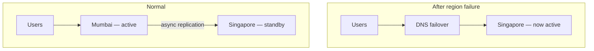

```text
Trade-off: simpler, lower cost; standby may be underutilized; failover takes minutes
```

#### Active-active

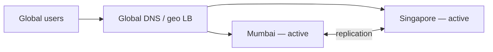

```text
Both regions serve traffic simultaneously
Trade-off: best performance and utilization; hardest data consistency and conflict resolution
```

#### Replication modes

| Mode | Write path | Consistency | Latency |
|------|------------|-------------|---------|
| Synchronous | Ack after all regions persist | Strong | Higher |
| Asynchronous | Ack after primary persists | Eventual | Lower |

```text
Sync:  Write → Region A → Region B → success response
Async: Write → Region A → success response (Region B catches up later)
```

#### Multi-AZ vs multi-region

| | Multi-AZ | Multi-region |
|---|----------|--------------|
| Scope | Same region | Multiple regions |
| Latency between nodes | Very low | Higher |
| Protects against | AZ failure | Region failure |
| Cost | Lower | Higher |
| Ops complexity | Moderate | High |

---

### Walkthrough: e-commerce failover

1. Storefront runs active-active in `us-east-1` and `eu-west-1` behind Route 53 latency-based routing.
2. Product catalog reads from regional Redis caches; writes go to a primary DB in us-east-1 with async replica in eu-west-1.
3. us-east-1 regional outage detected by health checks; Route 53 removes the US record set.
4. European and Asian traffic already hit eu-west-1; American users failover to eu-west-1 with slightly higher latency.
5. Orders placed during failover may lag cross-region sync — idempotency keys prevent duplicate charges on recovery.

---

### Pitfalls and design tips

- **Active-active is hard** — conflict resolution, cart merges, and idempotency keys are mandatory; do not assume "replicate and forget."
- **Async replication implies RPO > 0** — document acceptable data loss windows; synchronous cross-region writes add latency.
- **Split-brain risk** — use fencing, leader election, or single-write-region patterns during failover.
- **When multi-region is overkill** — single region + multi-AZ covers most AZ-level failures at lower cost.
- **Production:** Route 53 latency/failover routing, AWS Global Accelerator, Cloud CDN for static assets.
- **Global databases** — Spanner, DynamoDB Global Tables, CockroachDB trade cost and consistency models for simpler multi-region writes.

---

### Real-world example: multi-region payments with data residency

HSBC and similar global banks document **active-active or active-passive regions** per jurisdiction — EU payment traffic stays in EU regions (`eu-central-1`, `eu-west-1`) to satisfy GDPR, while US traffic uses `us-east-1`. Route 53 or Azure Traffic Manager health-checks regional API gateways; on regional impairment, DNS shifts to a pre-provisioned secondary region. Writes replicate asynchronously (typical RPO of seconds to minutes); read-only failover paths are tested in game days. Cross-region writes are avoided for accounts bound to a home region — routing is per-customer, not global anycast.

---

## 11.8 VPC

### Overview

Think of an office building inside a larger business park — you have your own locked floors, reception desk, and rules about who enters, even though the park shares outer walls and utilities with other tenants. A **Virtual Private Cloud (VPC)** is your private, isolated network segment inside a public cloud: you define IP ranges, subnets, and firewalls; other customers' resources cannot reach yours by default.

Technically, a VPC is a logically isolated software-defined network where you launch VMs, containers, databases, and load balancers. You control CIDR blocks, route tables, gateways, and security policies. Physical hardware is multi-tenant, but network isolation is enforced by the hypervisor and SDN control plane — AWS VPC, Azure Virtual Network, and GCP VPC are equivalent concepts.

---

### What problem it fixes

Dumping every resource into a flat public cloud network is risky and unmanageable:

- Databases exposed to the internet become attack targets
- No segmentation between web tier, app tier, and data tier
- Teams cannot enforce least-privilege network access
- Hybrid connectivity to on-premises data centers needs a private address space

A VPC gives you the control patterns of an on-premises LAN — subnets, routing, firewalls — provisioned in minutes.

---

### What it does

A VPC provides **isolated, configurable cloud networking**:

**Address space** — define a private CIDR (for example, `10.0.0.0/16`) for all resources.

**Subnets** — split the VPC into public (internet-facing) and private (internal-only) segments.

**Routing** — route tables direct traffic locally, to the internet, or through NAT.

**Access control** — security groups (per resource) and network ACLs (per subnet) filter traffic.

**Connectivity** — internet gateway for inbound/outbound public traffic; NAT gateway for private subnet outbound-only access.

---

### How it works — the architecture inside

#### Core components

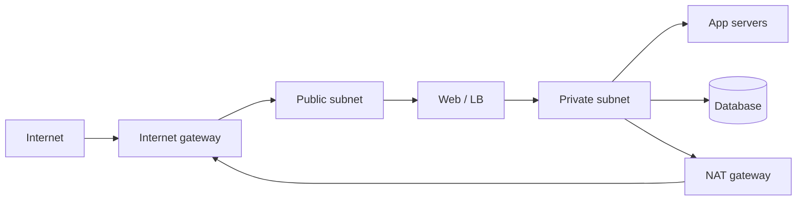

#### Typical three-tier layout

```text
Internet → IGW → public subnet (load balancer, bastion)
             → private subnet (application servers)
             → private subnet (database — no public IP, no direct internet inbound)
Private apps reach internet for patches/APIs via NAT gateway only
```

#### Key building blocks

| Component | Role |
|-----------|------|
| CIDR block | VPC IP range (e.g. `192.168.0.0/16`) |
| Subnet | Smaller range inside VPC (`192.168.1.0/24` public, `192.168.2.0/24` private) |
| Route table | Routes: local → local, `0.0.0.0/0` → IGW or NAT |
| Internet gateway | Bidirectional internet access for public subnets |
| NAT gateway | Outbound-only internet for private subnets |
| Security group | Stateful firewall on a VM or ENI |
| Network ACL | Stateless subnet-level allow/deny rules |

#### Traffic paths

```text
Public web server:  Internet → IGW → public subnet → web server
Private database:   Internet ✗ (blocked); app server → private IP → database
Outbound patch:     private VM → NAT gateway → IGW → internet
```

---

### VPC vs traditional on-premises network

| | Traditional network | VPC |
|---|---------------------|-----|
| Infrastructure | Physical switches and routers | Software-defined, API-driven |
| Provisioning | Weeks (hardware lead time) | Minutes |
| Scaling | Fixed capacity | Elastic |
| Location | On-premises | Cloud provider |

---

### Walkthrough: securing a web application VPC

1. Engineer creates VPC `10.0.0.0/16` with public subnet `10.0.1.0/24` and private subnet `10.0.2.0/24`.
2. ALB in public subnet receives HTTPS; security group allows 443 from `0.0.0.0/0`.
3. App servers in private subnet accept traffic only from the ALB security group on port 8080.
4. RDS Postgres in a second private subnet accepts port 5432 only from the app security group.
5. App servers pull Docker images via NAT gateway; no inbound internet path to apps or database.

**How to calculate:** usable host addresses in a subnet:

```text
Given: VPC 10.0.0.0/16, private subnet 10.0.2.0/24

Hosts in a /24 = 2^(32-24) - 2 (network + broadcast in classic model) = 254 usable IPs
AWS reserves 5 addresses per subnet (first four + last) -> plan ~251 assignable in a /24

A /16 VPC has 2^(32-16) = 65,536 addresses — enough for large fleets
If you expect 500 pods + 50 nodes on VPC CNI, budget >=550 IPs in the pod subnet, not a /28
Sanity check: carve /20 or larger per AZ for busy Kubernetes pod subnets.
```

A misconfigured security group is the most common exposure vector — not the VPC boundary itself.

---

### Pitfalls and design tips

- **IP exhaustion on VPC CNI** — one IP per pod; a `/24` pod subnet holds ~251 assignable addresses, not thousands of pods.
- **NAT gateway cost** — one NAT per AZ for HA adds hundreds of dollars/month plus egress; consider VPC endpoints for S3/DynamoDB.
- **Security groups are stateful; NACLs are stateless** — debugging "works one way" often means missing return path on NACL.
- **Peering is non-transitive** — A↔B and B↔C does not connect A↔C; use Transit Gateway or mesh for many VPCs.
- **When default VPC is OK** — experiments only; production deserves explicit CIDR planning and private subnets.
- **Production:** three-tier layout (public LB, private app, private DB); no IGW route on database subnets.

---

### Real-world example: EKS cluster in a private VPC

A fintech runs Kubernetes worker nodes entirely in private subnets across three AZs. The ALB ingress controller sits in public subnets; API servers are reachable only via VPN and a bastion host. Pod networking uses the VPC CNI so each pod gets a VPC-routable IP. Compliance auditors verify that database subnets have no IGW route and no public IPs — all east-west traffic stays inside the VPC unless explicitly NATed outbound.

---

## 11.9 Cloud Networking

### Overview

Think of cloud networking as the roads, gates, and address system inside a city that only exists in software. Your web servers, databases, and storage all need to reach each other — and sometimes the public internet — without every service being exposed to the world. Cloud networking draws those roads on demand: private lanes for internal traffic, controlled entry points for users, and rules that decide who may talk to whom.

Technically, **cloud networking** is software-defined networking (SDN) inside a cloud provider's virtual infrastructure. Resources live in logically isolated **virtual networks** (VPC, VNet, VCN) divided into **subnets** with **private** and **public** IP addresses, **route tables**, **internet gateways**, **NAT gateways**, **load balancers**, **DNS**, and layered firewalls (**security groups** at the instance level, **network ACLs** at the subnet level). Traffic flows are configured through APIs rather than physical switches, making networks scalable, repeatable, and tightly coupled to compute and storage.

---

### What problem it fixes

Traditional data-center networking requires buying hardware, cabling racks, and manually configuring routers and firewalls — slow to change and hard to scale. In the cloud, teams spin up dozens of services that must communicate securely: a web tier talks to an app tier, which talks to a database that must never be reachable from the internet.

Without structured cloud networking:

- Internal services might be accidentally exposed to the public internet.
- There is no clean separation between public-facing and private components.
- Scaling out servers does not automatically integrate with traffic distribution.
- Hybrid and multi-cloud connectivity becomes ad hoc and fragile.

Cloud networking fixes this by giving every deployment a programmable, isolated network fabric with explicit ingress/egress controls and on-demand connectivity.

---

### What it does

Cloud networking provides:

- **Virtual networks** — logically isolated address spaces for cloud resources.
- **Subnets** — smaller network segments (often public vs private) inside a virtual network.
- **IP addressing** — private IPs for internal communication; public IPs where internet access is required.
- **Routing** — route tables forward traffic locally, to an internet gateway, or through a NAT gateway.
- **Internet connectivity** — internet gateways for inbound/outbound public traffic; NAT gateways for outbound-only private access.
- **Load balancing** — distributes user requests across multiple servers for performance and availability.
- **DNS** — maps human-readable domain names to IP addresses.
- **Firewalls** — security groups (per-resource) and network ACLs (per-subnet) filter allowed traffic.

Together these pieces let applications communicate privately inside the cloud while exposing only what must face the internet.

---

### How it works — the architecture inside

A typical three-tier cloud network stacks components from the internet inward:

```text
Internet → internet gateway → load balancer → public subnet (web)
                                            → private subnet (app)
                                            → private subnet (database)
                                            → storage (private endpoint)
```

**Virtual network and CIDR.** The VPC receives an IP range such as `10.0.0.0/16`. Subnets carve out smaller ranges — e.g. `10.0.1.0/24` for web servers, `10.0.2.0/24` for databases.

**Public vs private subnets.** A public subnet has a route to an internet gateway. Resources with public IPs can receive traffic from the internet. A private subnet has no direct inbound internet route; its resources use private IPs only.

**NAT gateway.** Private servers that need to download patches or call external APIs send outbound traffic through a NAT gateway, which translates private IPs to a public address — without allowing inbound connections from the internet.

**Security layers.** Security groups act as virtual firewalls on individual instances (allow HTTP, HTTPS, SSH as needed). Network ACLs add subnet-level rules as a second line of defense.

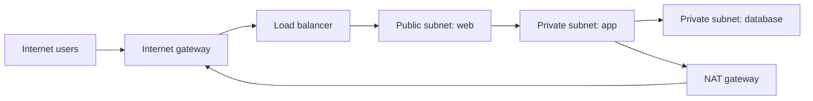

**Traffic flow example:**

```text
User → internet → load balancer → web server (10.0.1.5)
     → application server (10.0.2.10) → database (10.0.3.8, no public IP)
```

Only the load balancer and web tier are directly internet-facing; the database is reachable only from inside the VPC.

---

### Walkthrough: cloud networking vs traditional networking

| | Cloud networking | Traditional networking |
|---|------------------|------------------------|
| **Model** | Software-defined | Hardware-based |
| **Infrastructure** | Virtual | Physical routers, switches |
| **Scalability** | API-driven, elastic | Limited by hardware capacity |
| **Provisioning** | Minutes, on demand | Weeks, manual procurement |
| **Management** | Cloud console and APIs | Physical device configuration |
| **Isolation** | VPCs and security groups | VLANs, physical segmentation |

**Address assignment walkthrough:**

```text
Web server:    private 10.0.1.5 · public 34.x.x.x
App server:    private 10.0.2.10 · no public IP
Database:      private 10.0.3.8 · no public IP
```

The web server needs a public IP (or sits behind a load balancer with one). The database never receives a public IP — application servers reach it over private addresses inside the VPC.

---

### Pitfalls and design tips

- **Public subnet ≠ must have public IP** — route to IGW enables outbound; assign public IPs only where needed.
- **PrivateLink vs peering** — PrivateLink exposes a service without full VPC routing mesh; peering shares entire CIDRs.
- **DNS split-horizon** — Route 53 private hosted zones resolve internal names only inside the VPC.
- **LB idle timeout vs app keep-alive** — ALB default 60s can clip long HTTP connections; align with server timeouts.
- **Production:** ALB in public subnets, apps in private, AWS VPC endpoints for S3/ECR to avoid NAT hairpin.
- **IPv6 dual-stack** — plan early if mobile clients or regulators expect v6; subnet and SG rules must match.

---

### Real-world example

An e-commerce company runs its storefront on AWS. The architecture uses a **VPC** with three subnets across two availability zones:

- **Public subnets** host an Application Load Balancer and a small fleet of web servers.
- **Private subnets** host the order-processing API and a managed PostgreSQL database.
- A **NAT gateway** in each AZ lets private servers pull container images and security patches without public inbound exposure.
- **Security groups** allow the load balancer to reach web servers on port 443, web servers to reach the API on port 8080, and the API to reach the database on port 5432 — nothing else.

During a flash sale, the team adds more web and API instances in the same subnets. The load balancer automatically registers new targets. The database subnet never changes its exposure model — it remains unreachable from the internet throughout the traffic spike.

---

## 11.10 Cloud Storage

### Overview

Cloud storage is like renting a warehouse with unlimited shelves that you can reach from anywhere with an internet connection. You upload files, videos, backups, or database disks; the provider keeps copies safe, grows capacity as you need it, and charges you for what you actually store and retrieve instead of buying racks of drives upfront.

Technically, **cloud storage** is provider-managed durable storage accessed over APIs or mounted as virtual disks. It comes in three main forms: **object storage** (flat, API-addressable blobs for unstructured data), **block storage** (fixed-size blocks for high-performance workloads like VM disks and databases), and **file storage** (hierarchical folders for shared file access). Providers replicate data across multiple nodes and offer **storage classes** (hot, warm, cold) tuned to access frequency and cost.

---

### What problem it fixes

On-premises storage forces teams to forecast capacity years ahead, buy hardware, manage RAID arrays, plan backup tapes, and worry about a single data-center failure wiping out data. Growing beyond purchased capacity means another procurement cycle.

Cloud storage fixes:

- **Capacity planning** — scale from gigabytes to petabytes without buying new hardware.
- **Durability** — automatic replication across multiple physical nodes and regions.
- **Access anywhere** — applications and users retrieve data over the internet or private endpoints.
- **Cost alignment** — pay per gigabyte stored and per request, with cheaper tiers for archival data.
- **Disaster recovery** — geo-replicated copies survive site failures.

---

### What it does

Cloud storage services provide:

- **Object storage** — stores data as objects (file + metadata + unique ID). Highly scalable, API-driven, ideal for images, videos, logs, backups, and data lakes.
- **Block storage** — presents fixed-size blocks that applications assemble into volumes. Low latency, random read/write, suited to VMs and databases.
- **File storage** — directory-tree file systems (NFS/SMB-style) for shared team folders and legacy applications expecting a POSIX path.
- **Storage classes** — hot (frequent access, fast), warm (occasional access), cold/archive (rare access, cheaper storage, higher retrieval latency).
- **Replication and durability** — multiple copies across servers; providers target 99.999999999% (11 nines) durability for object storage.
- **Lifecycle policies** — automatically transition objects to cheaper tiers or delete them after a retention period.

---

### How it works — the architecture inside

Data flows from users or applications through the provider's storage service to replicated backend nodes:

```text
User → internet → cloud storage API → storage node A + storage node B → replicated copies
```

**Object storage internals.** An upload sends the object body and metadata to the service. The provider hashes the object, assigns a key (e.g. `s3://bucket/photo.jpg`), and writes replicas to independent nodes. Retrieval uses the key via HTTP API — there is no traditional directory tree at the storage layer.

**Block storage internals.** A volume is provisioned with a size (e.g. 500 GB) and attached to a VM as `/dev/sdf`. The hypervisor maps block reads/writes to the provider's distributed block backend. Snapshots capture point-in-time volume state for backup.

**File storage internals.** A managed file server exports a mount point (e.g. `fs-abc123:/share`). Multiple VMs mount the same share concurrently for collaborative workloads.

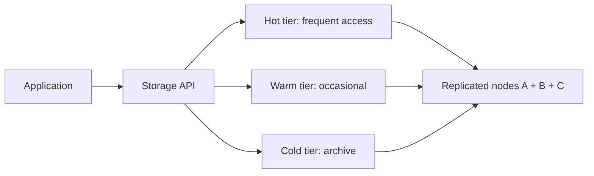

**Upload flow:**

```text
User → upload file → storage service → write replicas → confirm stored
```

**Durability model:**

```text
Copy 1 (server A) + Copy 2 (server B) + Copy 3 (server C)
→ if server A fails, copies on B and C remain available
```

---

### Walkthrough: object vs block vs file storage

| Feature | Object storage | Block storage | File storage |
|---------|----------------|---------------|--------------|
| **Storage unit** | Object (blob + metadata) | Fixed-size block | File in directory tree |
| **Structure** | Flat namespace (keys) | Raw blocks | Hierarchical folders |
| **Performance** | Medium; optimized for throughput | High; low latency | Medium |
| **Scalability** | Virtually unlimited | High per volume | Moderate |
| **Access method** | REST API | Mounted disk | NFS/SMB mount |
| **Best for** | Media, backups, logs, static sites | VM disks, databases | Shared team drives |

**Storage class walkthrough:**

| Class | Access pattern | Cost profile | Example data |
|-------|----------------|--------------|--------------|
| **Hot** | Daily reads/writes | Higher storage, lower access cost | Website assets, active app data |
| **Warm** | Monthly access | Moderate | Quarterly reports |
| **Cold** | Yearly or rare | Low storage, higher retrieval | Compliance archives, old backups |

---

### Pitfalls and design tips

- **Egress dominates at scale** — serving video from S3 cross-region costs more than storage; put CloudFront or regional origins close to users.
- **Block volumes are AZ-local** — EBS attaches only in the same AZ; snapshots restore to any AZ but take time.
- **Object LIST is not instantaneous** — massive buckets need prefix design; do not treat S3 like a POSIX directory tree.
- **11 nines durability ≠ backup** — accidental deletes and ransomware need versioning, Object Lock, or cross-account replication.
- **When object vs block** — media/logs/backups → object; database/VM disk → block; shared POSIX → managed file (EFS, Filestore).
- **Production:** S3 Intelligent-Tiering or lifecycle rules; gp3 EBS; monitor request rate throttling on hot prefixes.

---

### Real-world example

A video streaming startup stores uploaded content in **object storage** (e.g. S3). Original uploads land in a hot bucket. A lifecycle rule moves files older than 90 days to a warm tier and originals older than one year to cold archive — cutting storage costs by 60% without manual intervention.

Each streaming edge server reads video segments via the object API. VM instances running the transcoding pipeline attach **block storage** volumes for fast scratch space during encoding. The editorial team shares project files through a **managed file storage** mount so multiple editors work on the same timeline files concurrently.

When one availability zone experiences an outage, replicated object copies in another zone keep playback running. The team never manages physical drives — they manage policies, keys, and access permissions.

---

## 11.11 Managed Databases

### Overview

A managed database is like hiring a building manager for your data store. You decide what data goes in and what queries to run; someone else handles installing the database software, patching it, backing it up, watching for failures, and spinning up a replacement if the primary server dies.

Technically, a **managed database** is a cloud service where the provider operates the database infrastructure: provisioning, OS updates, database patching, automated backups, monitoring, scaling, replication, and failover. The customer owns the schema, data, queries, indexes, and application connection logic. Common offerings include managed MySQL, PostgreSQL, Redis, MongoDB, and DynamoDB.

---

### What problem it fixes

Self-managed databases demand significant operational skill:

```text
User → install DB → configure → schedule backups → apply updates → monitor → handle failures
```

A missed backup window, delayed security patch, or slow failover can cause data loss or prolonged outages. Teams running applications often want to focus on features, not database administration.

Managed databases fix:

- **Operational overhead** — no server provisioning or database software installation.
- **Backup gaps** — automated, point-in-time recovery built in.
- **Patch lag** — provider applies security and minor version updates.
- **High-availability complexity** — primary/standby failover configured by default.
- **Scaling friction** — resize instances or add read replicas through a console or API.

---

### What it does

**Provider responsibilities:**

- Database and OS installation
- Automated backups and retention
- Software patching and minor upgrades
- Storage management and monitoring
- Scaling compute and storage
- Replication and failover
- Failure detection and recovery

**Customer responsibilities:**

- Schema design and migrations
- SQL queries and application logic
- Index tuning
- Data content
- User permissions and access control
- Application integration (connection strings, pooling)

**Core capabilities:**

- **High availability** — primary database with a hot or warm standby; automatic promotion on failure.
- **Read replicas** — offload read traffic to one or more replicas while writes go to the primary.
- **Automatic scaling** — increase storage or compute when thresholds are met.
- **Monitoring dashboards** — CPU, memory, storage, connections, slow queries.

---

### How it works — the architecture inside

Applications connect to a stable **database endpoint** (DNS name), not directly to a physical server IP that might change during failover:

```text
Application → database endpoint → managed database service → primary DB + standby/replicas
```

**Failover flow:**

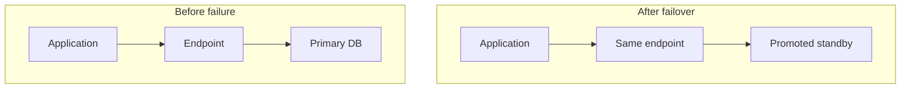

Primary failure is detected by health checks; the endpoint DNS record updates to the new primary — applications reconnect without config changes.

**Read scaling:**

```text
Write requests:  application → primary database
Read requests:   application → read replica 1 + read replica 2
```

Replicas apply changes from the primary asynchronously (or synchronously depending on configuration), spreading read load.

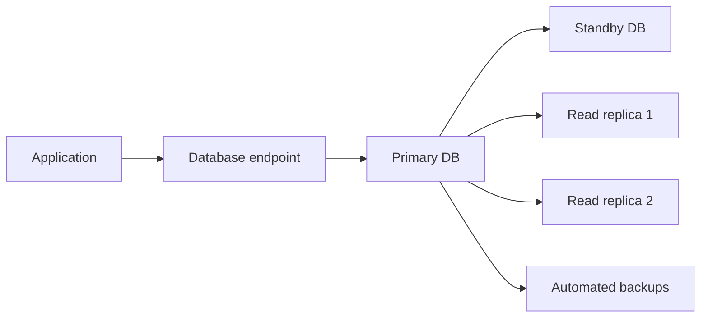

**Backup flow:**

```text
Application writes data → managed service → scheduled snapshots + transaction logs
→ retained for point-in-time recovery (e.g. restore to any second in last 7 days)
```

---

### Walkthrough: managed vs self-managed

| Feature | Managed database | Self-managed database |
|---------|------------------|----------------------|
| **Installation** | Provider | User |
| **Backups** | Automatic, scheduled | User configures |
| **Software updates** | Provider applies | User schedules |
| **Monitoring** | Built-in dashboards | User sets up |
| **Scaling** | API/console resize | Manual provisioning |
| **High availability** | Built-in failover | User configures replication |
| **Infrastructure control** | Limited (no OS shell) | Full root access |
| **Cost** | Higher per-hour, lower ops labor | Lower compute cost, higher ops cost |

**Scaling walkthrough:**

```text
Low traffic:   small instance (2 vCPU, 8 GB RAM, 100 GB storage)
Traffic grows: console resize → larger instance (8 vCPU, 32 GB RAM)
               or add read replicas for read-heavy workload
```

Some engines support storage auto-scaling when disk usage crosses a threshold.

---

### Pitfalls and design tips

- **Connection storms** — RDS max_connections is finite; use RDS Proxy, PgBouncer, or application pooling.
- **Failover blip** — DNS endpoint updates in seconds but apps must retry; set TCP keepalive and pool validation queries.
- **Replica lag** — async read replicas serve stale data; route only read-tolerant queries to replicas.
- **Vendor extensions** — Aurora, AlloyDB, Cosmos APIs differ from vanilla Postgres/MySQL; migration cost is real.
- **When self-managed** — exotic extensions, kernel tuning, or license constraints the managed service blocks.
- **Production:** RDS Multi-AZ, Cloud SQL HA, read replicas for reporting; test restore from backup quarterly.

---

### Real-world example

A SaaS company runs its multi-tenant application on **Amazon RDS for PostgreSQL**. Developers define schemas and run migrations through their CI pipeline. They connect via a connection pooler to the RDS endpoint.

At 2 AM, the primary instance suffers a hardware failure. RDS promotes the standby in another availability zone within minutes. The endpoint DNS updates; the application's connection pool retries and resumes — most users notice nothing.

During a product launch, read traffic triples. The team adds two read replicas and routes reporting queries to them, keeping the primary free for writes. Automated daily snapshots plus continuous transaction log archiving let them restore a single tenant's data to a specific timestamp after an accidental bulk delete.

The team never SSHs into a database server. They spend engineering time on application features instead of `pg_dump` cron jobs and kernel patching.

---

## 11.12 Autoscaling

### Overview

Autoscaling is the cloud equivalent of a restaurant that opens extra tables when a rush of customers arrives and closes them when the dining room empties — automatically, without the manager making phone calls. Your application gets more servers when demand rises and sheds them when demand falls, so performance stays steady and you do not pay for idle capacity.

Technically, **autoscaling** is a cloud service that monitors workload metrics (CPU, memory, request rate, queue depth, custom signals) and automatically adds or removes compute instances — or resizes existing ones — according to defined policies. It works alongside load balancers: autoscaling adjusts **capacity**, load balancers distribute **traffic** across whatever capacity exists.

---

### What problem it fixes

**Without autoscaling:**

```text
Normal traffic:  users → one application server (works fine)
Traffic spike:   users → same one server → CPU overloaded → slow responses → failures
```

Teams either over-provision year-round (wasting money) or under-provision and fail during peaks. Manual scaling is too slow for sudden spikes — by the time someone provisions servers, the moment may have passed.

Autoscaling fixes:

- **Traffic spikes** — new instances launch within minutes of threshold breach.
- **Cost waste** — excess instances terminate when load drops.
- **Manual toil** — no on-call engineer resizing fleets at 3 AM.
- **Availability** — unhealthy instances are replaced automatically.

---

### What it does

Autoscaling provides:

- **Scale out** — add more instances (horizontal scaling).
- **Scale in** — remove unneeded instances to save cost.
- **Scale up / scale down** — increase or decrease resources on a single instance (vertical scaling), where supported.
- **Policy-driven decisions** — rules such as "if average CPU > 70% for 5 minutes, add 2 instances."
- **Min/max bounds** — always keep at least N instances running; never exceed M instances.
- **Cooldown periods** — wait after a scaling action before evaluating again, preventing flapping.
- **Health checks** — replace instances that fail health probes.

In Kubernetes, the **Horizontal Pod Autoscaler (HPA)** scales pod replicas; the **Cluster Autoscaler** adds worker nodes when pods cannot be scheduled.

---

### How it works — the architecture inside

The autoscaling service watches metrics and instructs the compute layer to change instance count. A load balancer registers and deregisters instances as they come and go:

```text
Users → load balancer → Server 1 + Server 2 + Server 3
                              ↑
                    autoscaling service (monitors CPU, requests, etc.)
```

**Scaling workflow:**

```text
1. Traffic increases → CPU rises above threshold
2. Autoscaling policy triggers → launch new instances
3. New instances pass health checks → register with load balancer
4. Load balancer distributes traffic → performance stabilizes
5. Traffic decreases → CPU drops below scale-in threshold
6. After cooldown → terminate excess instances
```

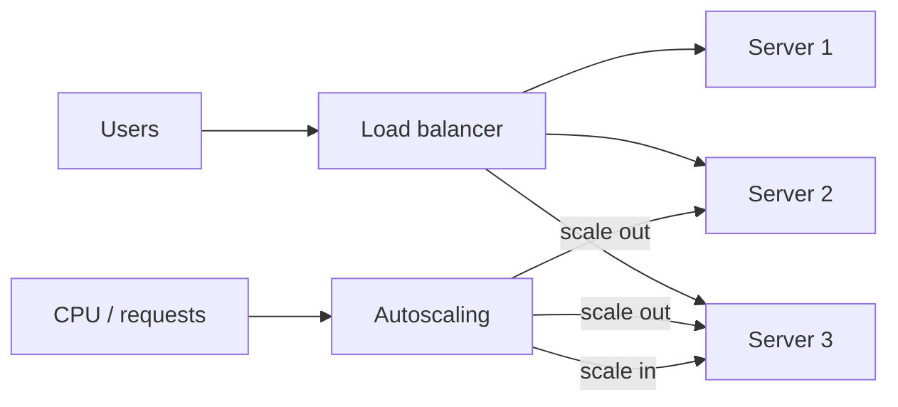

**Policy example:**

```text
Scale out: if average CPU > 70% for 5 min → add 2 instances (max 20)
Scale in:  if average CPU < 30% for 10 min → remove 1 instance (min 2)
Cooldown:  300 seconds after each action
```

**Traffic over a day:**

| Time | Users | Instances |
|------|-------|-----------|
| Morning | 100 | 1 |
| Afternoon sale | 5,000 | 5 |
| Night | 200 | 1 |

---

### Walkthrough: horizontal vs vertical scaling

| Feature | Horizontal (scale out/in) | Vertical (scale up/down) |
|---------|---------------------------|--------------------------|
| **Method** | Add or remove servers | Bigger or smaller single server |
| **Limit** | Very high (dozens to thousands) | Hardware ceiling per instance |
| **Downtime** | Usually none | Often requires restart |
| **Fault tolerance** | High (multiple nodes) | Lower (single point of failure) |
| **Best for** | Stateless web APIs, microservices | Databases, legacy monoliths |

**Autoscaling vs load balancer:**

| | Autoscaling | Load balancer |
|---|-------------|---------------|
| **Role** | Adjusts number of servers | Distributes requests across servers |
| **Trigger** | Metrics (CPU, queue length) | Every incoming request |
| **Output** | More or fewer instances | Even traffic spread |

They are complementary — neither replaces the other.

**How to calculate:** instances needed for target CPU:

```text
Given: 4 instances at 85% average CPU, target 60%, min 2, max 20

Desired instances ~ current x (current CPU / target CPU)
                 ~ 4 x (85 / 60) ~ 4 x 1.42 ~ 5.7 -> round up to 6 instances

After scale-out, expect CPU ~ 4 x 85% / 6 ~ 57% if load is unchanged
Sanity check: if CPU stays high after adding nodes, the bottleneck is DB or locks — not CPU.
```

---

### Pitfalls and design tips

- **Scale-in terminates instances** — use connection draining on ALB and graceful shutdown hooks so in-flight requests finish.
- **CPU-only policies miss queue depth** — add custom metrics (SQS depth, request rate) for worker tiers.
- **Cooldown vs responsiveness** — short cooldown reacts fast but flaps; long cooldown saves money but lags spikes.
- **Minimum size sets floor cost** — `min=2` means two instances 24/7 even at midnight.
- **Production:** target tracking scaling on ALB request count per target; pair ASG with scheduled scaling for known events.
- **HPA + Cluster Autoscaler** — application autoscaling and node autoscaling are complementary layers ([11.34](#1134-hpa), [11.35](#1135-cluster-autoscaler)).

---

### Real-world example: Ticketmaster-style on-sale

High-traffic ticket on-sales are a documented use case for AWS Auto Scaling behind an ALB. Baseline policy: `min=2`, `max=50`, scale out when average CPU > 60% for 3 minutes (or on ALB `RequestCountPerTarget`). When a major on-sale opens, request rate can jump orders of magnitude in minutes — ASG launches instances; ALB registers them after health checks pass. AWS case studies describe staying under ~200 ms p95 during these spikes when pre-warmed AMIs and RDS read capacity are aligned. After the sale, scale-in cooldown (e.g. 10 minutes) removes excess instances so the fleet does not run at peak size overnight.

---

## 11.13 Docker

### Overview

Docker is like shipping your application in a standardized container box that runs the same whether it sits in a developer's laptop, a test server, or a production cloud cluster. Everything the app needs — code, runtime, libraries, config — travels together, so "it worked on my machine" stops being an excuse.

Technically, **Docker** is an open-source platform for building, packaging, distributing, and running applications in **containers**. A **Dockerfile** defines build steps that produce an immutable **image**. The **Docker engine** (daemon) runs **containers** as isolated processes on the host kernel. Images are stored and shared through a **registry** (Docker Hub, ECR, GCR). Docker handles networking between containers and **volumes** for persistent data.

---

### What problem it fixes

Before containers, environments diverged at every stage:

```text
Developer machine (works) → test server (missing library, fails) → production (different OS, fails)
```

Dependencies, OS versions, and configuration drift caused deployment failures. Virtual machines added consistency but were heavy — each VM carried a full OS, took minutes to boot, and consumed significant RAM.

Docker fixes:

- **Environment inconsistency** — same image runs everywhere.
- **Slow deployments** — containers start in seconds.
- **Resource waste** — containers share the host kernel, using far less memory than VMs.
- **Distribution friction** — push an image to a registry; any host pulls and runs it.

---

### What it does

Docker provides:

- **Docker client** — CLI (`docker build`, `docker run`, `docker pull`, `docker push`) that talks to the engine.
- **Docker engine** — builds images, creates/starts/stops containers, manages networking and storage.
- **Images** — read-only templates containing application code, runtime, libraries, and configuration.
- **Containers** — running instances of images; multiple containers can share one image.
- **Dockerfile** — declarative build recipe (FROM, RUN, COPY, CMD, etc.).
- **Registry** — central store for images with version tags.
- **Networking** — virtual networks so containers communicate by name.
- **Volumes** — persistent storage that survives container deletion.

---

### How it works — the architecture inside

```text
Docker client → Docker engine → images + containers + networks + volumes → host OS kernel
```

**Build-to-run pipeline:**

```text
Source code → Dockerfile → docker build → image → docker push → registry
           → docker pull → docker run → running container → application
```

**Container lifecycle:**

```text
Image → create container → start → running → stop → remove
```

Writable changes during runtime live in a thin writable layer on top of the read-only image layers. Deleting the container removes that writable layer unless data was stored in a volume.

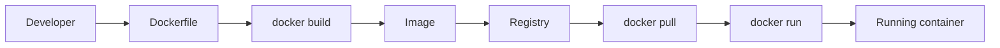

**Docker vs virtual machine:**

| | Docker container | Virtual machine |
|---|------------------|-------------------|
| **OS** | Shares host kernel | Full guest OS per VM |
| **Startup** | Seconds | Minutes |
| **Size** | Megabytes | Gigabytes |
| **Isolation** | Process-level (namespaces + cgroups) | Hardware-level hypervisor |
| **Density** | Hundreds per host | Dozens per host |

**Docker and Kubernetes:**

| | Docker | Kubernetes |
|---|--------|------------|
| **Scope** | Single host | Cluster of many hosts |
| **Focus** | Build and run containers | Orchestrate, scale, heal, route traffic |
| **Relationship** | Creates images; runs containers locally | Pulls images from registry; schedules pods |

---

### Walkthrough: image vs container

| | Docker image | Docker container |
|---|--------------|------------------|
| **State** | Read-only template | Running (or stopped) instance |
| **Execution** | Cannot run by itself | Executes the application |
| **Creation** | Built from Dockerfile | Created from image via `docker run` |
| **Mutability** | Immutable (new build = new image) | Writable layer at runtime |

```text
One image → Container A (running web) + Container B (running worker)
```

Both containers share the same read-only image layers but have separate writable layers and process spaces.

---

### Pitfalls and design tips

- **Docker Desktop ≠ production runtime** — EKS/GKE nodes run containerd; test images against containerd in CI.
- **Root in container ≈ root on host** — run as non-root `USER`, drop capabilities, read-only root filesystem where possible.
- **`:latest` tag drift** — pin digests or immutable version tags in Kubernetes manifests.
- **When VMs still win** — Windows workloads without container support, hardware dongles, or strict per-VM licensing.
- **Production:** BuildKit cache mounts, multi-stage builds, scan images in CI (Trivy, ECR scanning).
- **Compose for dev, Kubernetes for prod** — do not run Compose in production without an orchestration story.

---

### Real-world example

A fintech team develops a payment API. The developer writes a `Dockerfile`:

```dockerfile
FROM node:20-alpine
WORKDIR /app
COPY package*.json ./
RUN npm ci --production
COPY . .
CMD ["node", "server.js"]
```

Locally, `docker build -t payment-api:1.4.0 .` and `docker run` verify the service. CI pushes `payment-api:1.4.0` to a private registry. Staging pulls the same tag and deploys it. Production pulls the identical tag — no manual dependency installation on servers.

When a security patch is needed, the developer updates the base image line to `node:20-alpine3.19`, rebuilds, tags `1.4.1`, and rolls out. Rollback means running `1.4.0` again from the registry, not reconstructing a server environment from memory.

---

## 11.14 Container Runtime

### Overview

If a container image is a blueprint, the container runtime is the construction crew that reads the blueprint and actually builds the house. Without it, an image is just inert files on disk — the runtime creates the isolated process, wires up networking, attaches storage, and enforces resource limits.

Technically, a **container runtime** is low-level software that pulls images, creates container processes, and manages their lifecycle (start, stop, restart, remove). It interfaces directly with the Linux kernel — using **namespaces** for isolation and **cgroups** for resource limits. Kubernetes talks to runtimes through the **Container Runtime Interface (CRI)**; common runtimes include **containerd**, **CRI-O**, and historically Docker Engine via dockershim.

---

### What problem it fixes

Higher-level tools (Docker CLI, Kubernetes) should not embed OS-specific process management. Someone must translate "run this image with 2 GB RAM and its own network stack" into kernel syscalls.

Without a dedicated runtime:

- Every orchestrator would reimplement container creation logic.
- Switching runtimes would require rewriting orchestration code.
- Resource enforcement and isolation would be inconsistent.

The runtime fixes this by providing a stable execution layer between images and the kernel.

---

### What it does

A container runtime:

- **Pulls and stores images** from registries.
- **Creates containers** from image layers plus a writable layer.
- **Starts and stops processes** inside isolated namespaces.
- **Allocates resources** — CPU, memory, disk I/O via cgroups.
- **Configures networking** — assigns interfaces, IP addresses, port mappings.
- **Mounts volumes** — attaches persistent or ephemeral storage.
- **Enforces security** — user namespaces, seccomp profiles, capabilities dropping (when configured).

In Kubernetes: `kubelet → CRI → container runtime → container inside pod`.

---

### How it works — the architecture inside

```text
Container image → container runtime → namespaces + cgroups → OS kernel → hardware
```

**Container start sequence:**

```text
1. Pull image (if not cached locally)
2. Unpack image layers → prepare root filesystem
3. Create namespaces (PID, network, mount, UTS, IPC, user)
4. Configure cgroups (CPU, memory limits)
5. Set up network interface and routes
6. Mount volumes
7. Execute entrypoint process (PID 1 inside container)
```

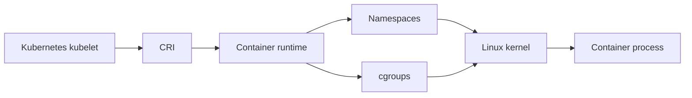

**Container Runtime Interface (CRI):**

```text
Kubernetes → CRI API → containerd | CRI-O | other runtime
```

CRI decouples Kubernetes from any single runtime implementation. The kubelet calls gRPC methods like `RunPodSandbox` and `CreateContainer`; the runtime fulfills them.

**Common runtimes:**

| Runtime | Notes |
|---------|-------|
| **containerd** | Industry default for Kubernetes; lightweight, CRI-native |
| **CRI-O** | Purpose-built for Kubernetes, minimal surface area |
| **Docker Engine** | Full developer platform; older K8s versions used dockershim bridge |
| **Podman** | Daemonless; common for rootless local development |

---

### Walkthrough: runtime vs image vs orchestrator

| Layer | Role | Example |
|-------|------|---------|
| **Image** | Read-only package defining what to run | `nginx:1.25` |
| **Container runtime** | Executes the image as an isolated process | containerd |
| **Container platform** | Developer UX for build/run (optional) | Docker Desktop |
| **Orchestrator** | Schedules containers across many hosts | Kubernetes |

```text
Registry → pull image → runtime creates container → single host running
Registry → pull image → kubelet tells runtime → pod on cluster node
```

---

### Pitfalls and design tips

- **dockershim removed** — Kubernetes 1.24+ requires CRI-native runtimes (containerd, CRI-O); do not depend on Docker inside kubelet.
- **CRI is the contract** — kubelet talks CRI; swapping runtimes should not require app changes.
- **RuntimeClass** — select gVisor/Kata for untrusted multi-tenant workloads needing stronger isolation than namespaces alone.
- **OOM at cgroup limit** — kernel kills the container process; Kubernetes restarts the pod — fix memory limits, not just JVM heap.
- **Production:** containerd on EKS/GKE/AKS; `crictl` for node debugging, not `docker` on workers.
- **Image pull policy `IfNotPresent` vs `Always`** — stale local cache on `:latest` causes mysterious version skew.

---

### Real-world example

A Kubernetes cluster on AWS EKS uses **containerd** as its runtime on every worker node. When a deployment rolls out a new version:

1. The kubelet receives a pod spec with image `inventory-svc:2.3.0` and resource limits (500m CPU, 512 Mi memory).
2. Via CRI, it asks containerd to pull the image from ECR if not present.
3. containerd creates a pod sandbox (network namespace) and starts the application container inside it.
4. cgroups enforce the 512 Mi memory cap; if the process exceeds it, the kernel OOM-kills it and Kubernetes restarts the pod.
5. When the deployment updates to `2.3.1`, the kubelet stops the old container and starts a new one from the new image — the runtime handles teardown and creation.

Developers still use Docker locally to build images, but production nodes never run the Docker daemon — only containerd, reducing attack surface and resource overhead.

---

## 11.15 Container Images

### Overview

A container image is a sealed, portable box that holds everything your application needs to run — the code, the language runtime, system libraries, and default configuration. You ship the box to any server; whoever opens it gets the exact same contents, every time.

Technically, a **container image** is an immutable, read-only filesystem assembled from stacked **layers**. It is built from a **Dockerfile** (or equivalent) and identified by a **tag** (e.g. `myapp:2.1.0`). Images live in a **registry** and are pulled to hosts before a **container runtime** creates a running container. Images do not execute on their own — they are templates.

---

### What problem it fixes

Shipping applications traditionally meant installing dependencies on each server, hoping versions match, and fearing that a manual change on one machine will never be reproduced elsewhere.

Container images fix:

- **"Works on my machine"** — the image *is* the environment.
- **Configuration drift** — images are immutable; changes require a new build and tag.
- **Slow rollouts** — pull a pre-built image instead of running install scripts on every host.
- **Version chaos** — tags (`v1`, `v2`, `sha-abc123`) make deployments and rollbacks explicit.

---

### What it does

A container image packages:

- **Application code** — binaries, scripts, static assets.
- **Runtime** — Node.js, Python, JVM, etc.
- **Libraries and dependencies** — packages installed at build time.
- **Configuration defaults** — environment variables, config files baked in (secrets should come from external stores at runtime).
- **Metadata** — entrypoint command, exposed ports, default user.

Key properties:

- **Immutable** — once pushed, contents do not change; updates produce a new image.
- **Layered** — each Dockerfile instruction adds a layer; unchanged layers cache and reuse.
- **Versioned** — tags identify releases; digests (content hashes) guarantee exact content.
- **Portable** — run on any host with a compatible runtime and architecture.

---

### How it works — the architecture inside

```text
Application code + runtime + libraries + base OS layer → stacked read-only layers → image
```

**Build pipeline:**

```text
Source code → Dockerfile → docker build → image → push to registry
         → docker pull (on target host) → docker run → container
```

**Image structure (bottom to top):**

```text
Layer 1: base image (e.g. alpine:3.19)
Layer 2: install runtime (e.g. OpenJDK 17)
Layer 3: install dependencies
Layer 4: copy application JAR
Layer 5: set CMD / ENTRYPOINT
```

Each layer is a filesystem diff. The final image is the union of all layers, mounted read-only at container start.

```mermaid
flowchart LR
    Src[Source code] --> DF[Dockerfile]
    DF --> Build[docker build]
    Build --> Layers[Layered image]
    Layers --> Reg[Registry]
    Reg --> Pull[docker pull]
    Pull --> Run[Container runtime]
    Run --> Ctr[Running container]
```

**Immutability in practice:**

```text
Old image myapp:1.0 (unchanged in registry)
Bug fix → edit code → docker build → myapp:1.1 (new image)
Deploy 1.1; rollback = redeploy 1.0 (still available)
```

**Size optimization techniques** (folded into build practice):

- Use small base images (`alpine`, `distroless`).
- Multi-stage builds — compile in a fat image, copy only artifacts to a slim final image.
- Combine related `RUN` instructions to reduce layer count.
- Use `.dockerignore` to exclude unnecessary files from the build context.

---

### Walkthrough: image vs container vs VM image

| | Container image | Running container | VM image |
|---|-----------------|-------------------|----------|
| **Contents** | App + runtime + libs (no full OS kernel) | Executing process from image | Full OS + apps |
| **Size** | Megabytes to low GB | Adds writable layer at runtime | Gigabytes |
| **Startup** | Seconds (when pulled) | Seconds | Minutes |
| **Mutability** | Immutable | Writable layer for runtime changes | Mutable or templated |
| **Kernel** | Shares host kernel | Shares host kernel | Includes/boots own kernel |

---

### Pitfalls and design tips

- **Secrets baked into layers** — remain in registry history forever; use runtime Secrets or build-args only for non-secret build metadata.
- **Digest pinning** — `image@sha256:...` guarantees deploy content; tags can be overwritten.
- **Multi-arch manifests** — build `linux/amd64` and `arm64` for Graviton/Apple Silicon nodes with `docker buildx`.
- **When to use distroless/scratch** — smaller attack surface; no shell for debugging — sidecar debug tools instead.
- **Production:** private registry (ECR, GCR, Harbor) with retention and vulnerability scanning policies.
- **SBOM in CI** — supply-chain audits expect SPDX/CycloneDX attached to released images.

---

### Real-world example

A machine-learning team packages its inference service as a container image. The `Dockerfile` uses a multi-stage build:

1. **Build stage** — `python:3.11` image installs dependencies and downloads model weights.
2. **Runtime stage** — `python:3.11-slim` copies only the inference script, required packages, and model file.

The final image is 400 MB instead of 2 GB. CI builds and pushes `inference:2024-06-15` and `inference:latest` to the company registry.

Production Kubernetes pulls `inference@sha256:abc123...` (digest pinning) so no one accidentally deploys a moved tag. Data scientists test locally with the same digest. When a new model ships, CI produces `inference:2024-06-20`; the cluster rolling-updates pods. If latency regresses, they roll back to the previous digest in one command — because the old image still exists, unchanged, in the registry.

---

## 11.16 Image Layers

### Overview

Image layers are like transparent slides stacked on a projector — each slide adds something new (a library, a config file, your app code), and the final picture is the combination of all of them. When you change only the top slide, you do not redraw the slides below; you reuse them as-is.

Technically, **image layers** are read-only filesystem diffs produced by each instruction in a Dockerfile (`FROM`, `RUN`, `COPY`, etc.). Layers stack to form the complete image root filesystem. The build engine **caches** unchanged layers, so rebuilds skip work below the first changed instruction. At runtime, the container adds a thin **writable layer** on top for ephemeral changes.

---

### What problem it fixes

Rebuilding an entire operating system and dependency tree on every code commit would make CI unbearably slow and waste bandwidth pushing full images to registries.

Layers fix:

- **Slow builds** — cache hit on unchanged instructions skips rebuild.
- **Storage bloat** — identical layers across images are stored once on the host (layer sharing).
- **Slow pulls** — only new or changed layers download on deploy.
- **Redundant work** — ten microservices on the same base image share that base layer on disk.

---

### What it does

Each Dockerfile instruction creates one layer:

```text
FROM ubuntu:22.04        → Layer 1 (base)
RUN apt-get install -y java-17-jdk  → Layer 2 (JDK)
COPY app.jar /app/       → Layer 3 (application)
CMD ["java", "-jar", "/app/app.jar"]  → Layer 4 (metadata)
```

Layers are:

- **Read-only** in the image.
- **Content-addressed** — identified by hash; identical content = same layer ID.
- **Cached** — if instruction and inputs match a previous build, reuse the cached layer.
- **Compressed** when pushed to registries for efficient transfer.

When a container starts, all image layers are mounted read-only; a **writable container layer** captures runtime changes (logs, temp files). Removing the container deletes the writable layer.

---

### How it works — the architecture inside

**Stack model:**

```text
┌─────────────────────────┐
│  Writable layer (runtime)│  ← created at container start
├─────────────────────────┤
│  Layer 4: CMD metadata   │
│  Layer 3: application    │
│  Layer 2: libraries      │
│  Layer 1: base image     │  ← bottom
└─────────────────────────┘
```

**Cache behavior:**

```text
Build 1: Layer 1 created · Layer 2 created · Layer 3 created
Build 2 (only app.jar changed): Layer 1 cached · Layer 2 cached · Layer 3 rebuilt
```

**Layer sharing across images:**

```text
Image A: Ubuntu + Java + App-A
Image B: Ubuntu + Java + App-B
         └──── shared ────┘       only the app layer differs
```

```mermaid
flowchart LR
    DF[Dockerfile instructions] --> L1[Layer 1: base]
    L1 --> L2[Layer 2: runtime]
    L2 --> L3[Layer 3: deps]
    L3 --> L4[Layer 4: app code]
    L4 --> Img[Final image]
    Img --> WL[Writable layer at run]
    WL --> Ctr[Container]
```

**Layer order matters.** Put rarely changing content low in the Dockerfile; put frequently changing content (application code) last:

```text
Good:  base → runtime → dependencies → app code
Bad:   COPY app code → install dependencies (app change invalidates dep layer cache)
```

**Important caveat:** deleting a file in a later `RUN` instruction does not remove it from earlier layers — the bytes remain in the image size. Install and clean up in the *same* `RUN` step to keep layers small.

---

### Walkthrough: layer reuse across versions

**Image v1.0:**

```text
Layer 1 (Ubuntu base) + Layer 2 (Java runtime) + Layer 3 (app v1.0)
```

**Image v1.1** (only application code changed):

```text
Layer 1 (reused) + Layer 2 (reused) + Layer 3 (app v1.1 — new layer)
```

Registry and host store Layer 1 and Layer 2 once. Pulling v1.1 downloads only the new application layer.

| | Image layers | Writable layer |
|---|--------------|----------------|
| **When created** | At `docker build` | At `docker run` |
| **Access** | Read-only | Read-write |
| **Shared?** | Yes, across containers from same image | No, unique per container |
| **Lifetime** | Permanent in registry | Deleted with container |

---

### Pitfalls and design tips

- **Instruction order drives cache** — copy `package.json` and install deps before `COPY . .` so code edits do not bust dependency layers.
- **Large single RUN layers** — invalidate cache on any line change; group apt installs, clean caches in same layer.
- **Layer sharing breaks** — divergent base tags (`node:20` vs `node:20-alpine`) duplicate storage on nodes.
- **Writable layer grows unbounded** — logs in container FS fill disk; log to stdout or volumes.
- **Production:** `.dockerignore` excludes `node_modules`, `.git`; use BuildKit `--mount=type=cache` for package managers.
- **Squash sparingly** — loses layer sharing across images; prefer multi-stage slim finals.

---

### Real-world example

A CI pipeline builds twenty microservices, all `FROM eclipse-temurin:17-jre-alpine`. Each service Dockerfile copies its JAR as the final layer. The base JRE layer is identical across all twenty images.

On a Kubernetes node running twelve of these services, disk stores the shared base layer once — not twelve times. When developers push code to the order service, CI rebuilds only from the `COPY` instruction downward; the Java base layer cache hit completes in milliseconds.

The platform team notices image bloat from a `RUN apt-get update && apt-get install` layer followed by a separate `RUN apt-get clean` — the cleaned files still occupy the install layer. They refactor to a single `RUN` that installs and cleans in one step, shrinking each image by 80 MB. Pull times during deployments drop noticeably.

---

## 11.17 Namespaces

### Overview

Namespaces are how Linux lets many containers live on one machine while each one feels like it has its own private world — its own process list, network, hostname, and filesystem view. Container A does not see Container B's processes, even though both run on the same kernel.

Technically, **namespaces** are a Linux kernel feature that scopes system resources so a process (or group of processes) sees an isolated instance of global resources. Container runtimes create a set of namespaces per container: **PID** (process IDs), **network** (interfaces, routes, ports), **mount** (filesystem tree), **UTS** (hostname), **IPC** (shared memory, semaphores), and **user** (UID/GID mapping). Namespaces answer **what a container can see**; they do not cap CPU or memory — that is **cgroups** (next section).

---

### What problem it fixes

Without namespaces, all processes on a host share one global process table, one network stack, and one filesystem mount tree. A process inside an application could see and signal other applications' processes. Port bindings would collide. File path changes could affect unrelated workloads.

Namespaces fix:

- **Process visibility** — container sees only its own PID tree (PID 1 is the container entrypoint).
- **Network collisions** — each container gets its own interfaces, IP addresses, and port namespace.
- **Filesystem interference** — mount namespace isolates `/` root and mount points.
- **Hostname confusion** — each container can have a distinct hostname.
- **Security boundaries** — user namespaces map container root to an unprivileged host UID.

---

### What it does

For each container, the runtime creates:

| Namespace | Isolates |
|-----------|----------|
| **PID** | Process IDs — container has its own PID 1, 2, 3… |
| **Network** | Network devices, IPs, routing tables, firewall rules, ports |
| **Mount** | Filesystem mount points — changes do not leak to host or other containers |
| **UTS** | Hostname and domain name |
| **IPC** | Inter-process communication objects (shared memory, message queues) |
| **User** | User and group IDs — container root can map to non-root on host |

```text
Container A: PID ns · net ns · mount ns · UTS ns · IPC ns · user ns
Container B: separate set of all the above
```

Neither container can directly observe the other's processes, network stack, or mounts.

---

### How it works — the architecture inside

```text
Application → container runtime → create namespace set → start process in namespaces → isolated container
```

**Host view vs container view:**

```text
Host kernel
├── Container A namespaces → processes 1, 2, 3 · IP 10.0.0.2 · hostname web
└── Container B namespaces → processes 1, 2 · IP 10.0.0.3 · hostname db
```

Both containers can have a process with PID 1 — their PID namespaces are independent.

```mermaid
flowchart LR
    RT[Container runtime] --> PID[PID namespace]
    RT --> Net[Network namespace]
    RT --> Mnt[Mount namespace]
    RT --> UTS[UTS namespace]
    RT --> IPC[IPC namespace]
    RT --> User[User namespace]
    PID --> Kern[Linux kernel]
    Net --> Kern
    Mnt --> Kern
    UTS --> Kern
    IPC --> Kern
    User --> Kern
    Kern --> App[Container application]
```

**PID namespace example:**

```text
Host:       PID 4521 = container A init · PID 4588 = container B init
Container A view: PID 1 = app server · PID 2 = worker
Container B view: PID 1 = database process
```

**Network namespace example:**

```text
Container A: eth0 = 172.17.0.2, port 80 listening
Container B: eth0 = 172.17.0.3, port 5432 listening
→ both can bind "port 80" in their own namespace without conflict
```

**Creation sequence:**

```text
Runtime → unshare/create PID ns → network ns → mount ns → UTS ns → IPC ns → user ns → exec entrypoint
```

---

### Walkthrough: namespaces vs virtual machines

| | Linux namespaces (containers) | Virtual machines |
|---|-------------------------------|------------------|
| **Kernel** | Shared host kernel | Separate guest kernel per VM |
| **Isolation strength** | Process and view isolation | Full hardware virtualization |
| **Startup** | Sub-second | Tens of seconds to minutes |
| **Overhead** | Minimal | Hypervisor + full OS RAM |
| **Kernel exploit impact** | Can affect all containers on host | Contained within guest (mostly) |

Namespaces isolate **visibility**; they do not limit **resource consumption**. A container with no cgroup limits can still use 100% CPU — it just cannot see other containers while doing so.

---

### Pitfalls and design tips

- **Namespaces do not network-isolate by default** — add NetworkPolicy (Calico/Cilium) for east-west firewalling.
- **ResourceQuota without LimitRange** — pods with no requests slip through and starve neighbors.
- **Cluster-scoped objects** — Nodes, PersistentVolumes, ClusterRoles are not namespace-bound; RBAC still applies.
- **When one namespace is OK** — small dev clusters; production usually splits by team, env, or tenant.
- **Production:** `kube-system` for platform addons only; avoid running app workloads there.
- **`kube-public` / `default`** — do not treat `default` as production; explicit namespaces per service.

---

### Real-world example

A Kubernetes pod on a shared worker node runs two containers: a web proxy and an app server. Kubernetes creates one **network namespace per pod** (containers in the same pod share localhost) and separate **PID namespaces** per container depending on configuration.

The app container's `ps` lists only its own processes — not the kubelet, not neighboring pods. The database pod on the same node has its own network namespace with a cluster-internal IP assigned by the CNI plugin. When the app connects to the database Service IP, kube-proxy or eBPF routes traffic to the database pod's network namespace — the app container never sees the database's network interfaces directly.

A security audit confirms that user namespaces map container root (UID 0 inside) to UID 65534 (nobody) on the host, so even a container breakout yielding "root" inside does not yield host root privileges.

---

## 11.18 cgroups

### Overview

If namespaces decide what a container can *see*, cgroups decide how much it can *use*. They are the kernel's way of saying "this container gets at most two CPU cores and four gigabytes of RAM" so one runaway process cannot starve everything else on the server.

Technically, **cgroups (control groups)** are a Linux kernel feature that groups processes and applies limits, priorities, and accounting on CPU, memory, block I/O, network bandwidth, and process count. Container runtimes configure cgroups when starting a container. Kubernetes **requests** and **limits** on pods translate into cgroup settings enforced by the runtime on the node.

---

### What problem it fixes

On a shared host, an unconstrained container can monopolize resources:

```text
Without cgroups: Container A uses 95% CPU · Container B gets 5% → B times out
With cgroups:    Container A capped at 50% · Container B capped at 50% → fair scheduling
```

Without cgroups:

- One memory leak consumes all host RAM, triggering kernel OOM kills of unrelated processes.
- A fork bomb exhausts the process table.
- Disk-heavy workloads saturate I/O and slow every other service.

cgroups fix resource starvation, enable fair sharing, and give operators measurable quotas for capacity planning.

---

### What it does

cgroups control and monitor:

| Resource | What cgroup enforces | Example limit |
|----------|----------------------|---------------|
| **CPU** | CPU time shares or hard caps | Max 2 cores |
| **Memory** | RAM and swap usage | Max 4 GiB |
| **Block I/O** | Read/write bandwidth to disks | Max 100 MB/s |
| **Network** | Egress/ingress prioritization (via classifiers) | Traffic shaping |
| **Process count (pids)** | Maximum number of processes | Max 200 PIDs |

Capabilities:

- **Hard limits** — process cannot exceed the cap (memory over-limit → OOM kill inside cgroup).
- **Proportional sharing** — when contended, CPU time divides by weight.
- **Accounting** — expose usage metrics for monitoring (used by Prometheus node exporters, `kubectl top`).

---

### How it works — the architecture inside

```text
Container runtime → configure cgroup → attach container processes → kernel enforces limits
```

**Host layout:**

```text
Linux kernel
├── cgroup: container A → CPU max 2 · memory max 2 GiB
└── cgroup: container B → CPU max 4 · memory max 8 GiB
```

When a container process tries to allocate beyond its memory limit, the kernel's OOM killer terminates processes *within that cgroup* — protecting the host and other containers.

```mermaid
flowchart LR
    RT[Container runtime] --> CG[cgroups]
    NS[Namespaces] --> Ctr[Container]
    CG --> Ctr
    CG --> CPU[CPU limit]
    CG --> Mem[Memory limit]
    CG --> IO[Disk I/O limit]
    CG --> PIDs[Process count limit]
    CPU --> Kern[Linux kernel scheduler]
    Mem --> Kern
    IO --> Kern
    PIDs --> Kern
```

**Memory enforcement example:**

```text
Container memory limit: 2 GiB
Application allocates 2.5 GiB → kernel OOM-kills container process → runtime may restart container
Host and other containers unaffected
```

**Kubernetes integration:**

```text
Pod spec:  resources.requests.memory: 512Mi · limits.memory: 1Gi
         → kubelet → CRI → runtime sets cgroup memory limit ≈ 1 GiB
```

Requests influence scheduling (which node has capacity); limits are enforced at runtime by cgroups.

---

### Walkthrough: namespaces vs cgroups

Namespaces and cgroups are complementary — neither alone makes a secure, well-behaved container.

| | Namespaces | cgroups |
|---|------------|---------|
| **Question answered** | What can this process see? | How much can this process use? |
| **Controls** | PIDs, network, mounts, hostname, IPC, users | CPU, memory, disk I/O, process count |
| **Analogy** | Separate office rooms | Electricity budget per room |
| **Alone** | Isolated view but can consume all CPU/RAM | Limits resources but processes see entire host |

```text
Together:
  Namespaces → container sees only its own processes and network
  cgroups    → container capped at 2 CPU cores and 4 GiB RAM
```

**CPU limit walkthrough:**

```text
Without limit: one container saturates all 16 host cores
With limit:    cgroup cpu quota → container throttled at 2 cores equivalent
               remaining 14 cores available for other workloads
```

---

### Pitfalls and design tips

- **requests ≠ limits** — Burstable QoS can be CPU-throttled to limits; Guaranteed QoS needs requests = limits.
- **CPU limits cause latency cliffs** — CFS quota throttling shows up as tail latency; consider requests without tight CPU caps for latency-sensitive apps.
- **Memory limit OOM kills the whole container** — JVM and Go runtimes need headroom above heap settings.
- **`pids.max`** — fork bombs hit cgroup process limits before node PID exhaustion — set explicitly for untrusted code.
- **Production:** always set requests and limits; validate with `kubectl top pod` vs cgroup metrics.
- **cgroup v2** — modern distros unify hierarchy; memory and IO controllers behave differently than v1 — test upgrades.

---

### Real-world example

A multi-tenant SaaS platform runs customer workloads on shared Kubernetes nodes. Each customer's deployment specifies:

```yaml
resources:
  requests:
    cpu: "500m"
    memory: "512Mi"
  limits:
    cpu: "2000m"
    memory: "2Gi"
```

The container runtime creates cgroups enforcing the 2 GiB memory hard limit. When a customer's buggy release leaks memory, their pod is OOM-killed and restarted — neighboring tenants on the same node see no impact. `kubectl top pod` reads cgroup accounting to show live CPU and memory usage.

During a batch job spike, the platform's cluster autoscaler adds nodes, but cgroups ensure that even before new nodes arrive, existing workloads cannot steal each other's reserved CPU shares. Platform engineers tune weights so critical payment pods get higher CPU shares than best-effort analytics jobs.

A post-mortem on a pre-cgroup bare-metal era outage noted one tenant's fork bomb exhausted the host PID table. Today, `pids.max` in the cgroup stops the bomb at 200 processes, leaving the node healthy for everyone else.

## 11.19 Kubernetes

### Overview

Consider a shipping port where hundreds of containers arrive daily. Without a port authority, each crane operator would manually decide where to place containers, how many copies of each shipment to keep, and what to do when one falls off a truck. **Kubernetes (K8s)** is that port authority for software containers — it decides where workloads run, keeps the right number running, and replaces anything that breaks.

Technically, Kubernetes is an open-source **container orchestration platform**. You declare desired state (images, replica counts, networking rules) in YAML; the **control plane** stores that state in **etcd** and **controllers** reconcile reality to match. **Worker nodes** run **kubelet**, a container runtime, and **kube-proxy**; pods are scheduled onto nodes by the **Scheduler**. Docker (or containerd) builds and runs individual containers; Kubernetes manages them across many machines with self-healing, rolling updates, autoscaling (**HPA**, **Cluster Autoscaler**), and portable abstractions (Pods, Deployments, Services, Ingress).

---

### What problem it fixes

Running containers by hand on a few servers breaks down quickly:

- **Manual deployment** — SSH into each host to start or update containers
- **Manual scaling** — add machines and copy configs when load spikes
- **Manual recovery** — someone must notice a crash and restart the process
- **Fragile networking** — pod IPs change; apps hard-code endpoints
- **Risky updates** — big-bang deploys cause downtime

Without orchestration, every failure and every release becomes an operational incident. Kubernetes trades **declarative configuration** and **automation** for higher setup complexity — you describe what you want; the cluster continuously works to keep it true.

---

### What it does

Kubernetes provides a **cluster** — a set of machines acting as one system:

**Control plane** — API Server (all `kubectl` and automation traffic), Scheduler (pod → node placement), Controller Manager (ReplicaSets, Deployments, etc.), etcd (cluster state).

**Worker nodes** — run application pods via kubelet and the container runtime; kube-proxy implements Service networking.

**Core resources** — Pod (smallest unit), ReplicaSet (N identical pods), Deployment (updates + rollbacks), Service (stable endpoint), Ingress (HTTP routing), StatefulSet (stable identity), DaemonSet (one pod per node), Job (run-to-completion), plus ConfigMap, Secret, and Namespace for config and isolation.

It does **not** replace your application code, container images, or observability stack — it orchestrates where and how they run.

---

### How it works — the architecture inside

#### Cluster layout

```mermaid
flowchart LR
    User[kubectl / CI] --> API[API Server]
    API <--> ETCD[(etcd)]
    API --> Sched[Scheduler]
    API --> CM[Controller Manager]
    Sched --> K1[Worker node 1]
    Sched --> K2[Worker node 2]
    K1 --> P1[Pods]
    K2 --> P2[Pods]
```

#### Declarative reconciliation

```text
Desired state (YAML) → API Server → etcd
Controllers compare desired vs actual → create/update/delete objects until they match
```

**Self-healing:** a failed pod is recreated by its controller (ReplicaSet, Deployment, etc.).

**Rolling updates:** Deployments replace pods gradually so the app stays available.

**Scaling:** HPA changes pod count from metrics; Cluster Autoscaler adds nodes when pods cannot be scheduled.

#### End-to-end traffic path

```mermaid
flowchart LR
    Users[Users] --> Ing[Ingress]
    Ing --> Svc[Service]
    Svc --> P1[Pod]
    Svc --> P2[Pod]
```

#### Cluster vs node

| | Cluster | Node |
|---|---------|------|
| **Scope** | Collection of nodes + control plane | Single machine |
| **Management** | Managed as one unit | Runs pods |
| **Components** | API Server, Scheduler, etcd | kubelet, runtime, kube-proxy |

---

### Walkthrough: deploying a new application version

```mermaid
flowchart LR
    Dev[Developer] --> Build[Build image]
    Build --> Reg[Push to registry]
    Reg --> Apply[kubectl apply]
    Apply --> API[API Server]
    API --> Ctrl[Controllers / Scheduler]
    Ctrl --> Node[Worker node]
    Node --> Run[Pod running]
```

1. Developer builds a container image and pushes it to a registry.
2. `kubectl apply -f deployment.yaml` sends desired state to the API Server.
3. The Deployment controller creates or updates a ReplicaSet; the Scheduler assigns new pods to nodes with enough CPU and memory.
4. kubelet pulls the image and starts containers; kube-proxy registers the Service endpoints.
5. Ingress rules route external HTTP traffic to the Service; users hit the new version as old pods are replaced one at a time.

---

### Pitfalls and design tips

- **Complexity tax** — small teams may drown in YAML sprawl; GitOps (Flux, Argo CD) and managed control planes reduce toil.
- **Not every workload belongs** — stateful legacy, Windows GUI apps, or hard real-time may stay on VMs.
- **Control plane HA** — run etcd/API server across AZs or use EKS/GKE managed control plane.
- **When Compose suffices** — single-host dev; Kubernetes pays off at multi-service, multi-node scale.
- **Production:** EKS, GKE, AKS; pin Kubernetes versions; test upgrades in non-prod quarterly.
- **Platform team** — RBAC, quotas, NetworkPolicy, and admission webhooks are day-one concerns, not afterthoughts.

---

### Real-world example: multi-service API on EKS

A fintech team runs three microservices on **Amazon EKS**. Each service is a **Deployment** with three replicas, a **ClusterIP Service** for internal calls, and an **Ingress** with TLS termination for public HTTPS. CI pushes images to ECR; Argo CD applies manifests to the cluster. When an instance fails, the Deployment recreates the pod within seconds. **HPA** scales the payment service from 3 to 12 pods during peak hours; **Cluster Autoscaler** adds worker nodes when pending pods cannot be placed. One Ingress and one cloud load balancer front all services instead of a load balancer per microservice.

---

## 11.20 Pods

### Overview

Think of a pod as a shared apartment for containers that must work as a team — they share one address (IP), one hallway (localhost ports), and one storage closet (volumes). You rarely rent a single room; you rent the whole unit. A **Pod** is Kubernetes' smallest deployable unit: one or more containers that are scheduled, networked, and restarted together.

Technically, a pod wraps one or more containers in a single scheduling boundary. All containers in a pod share a **network namespace** (one IP, shared port space — `localhost` between containers) and can mount the same **volumes**. The **kubelet** on a worker node runs the pod; the **Scheduler** picks the node. Pods are **ephemeral** — when deleted, replacements get new IPs and possibly new nodes. Production workloads almost always run pods indirectly via Deployments or StatefulSets, not as bare Pod objects.

---

### What problem it fixes

Containers are great isolation units, but many real workloads need tighter coupling:

- A main app plus a **sidecar** (log shipper, proxy, config watcher) must share files and localhost
- Two processes must communicate without crossing the network boundary
- Kubernetes needs a **scheduling atom** — something to place on a node with resource requests/limits

Without pods, you would either pack unrelated apps into one container (bad isolation) or manage pairwise networking between loosely related containers on every host. Pods group **co-located, co-scheduled** containers while keeping each container's filesystem and process space separate.

---

### What it does

A pod provides:

**Containers** — usually one application container; sometimes multiple (sidecar pattern).

**Shared network** — one pod IP (e.g. `10.244.1.10`); containers reach each other via `localhost`.

**Shared storage** — volumes mounted into one or more containers in the pod.

**Lifecycle** — Pending → Running → Succeeded/Failed; kubelet restarts crashed containers inside the pod.

**Resource limits** — per-container CPU/memory requests and limits enforced via cgroups.

It does **not** guarantee a stable IP across restarts, self-heal after the whole pod is deleted (controllers do that), or persist data without volumes.

---

### How it works — the architecture inside

#### Single-container pod (most common)

```mermaid
flowchart LR
    Node[Worker node] --> Pod[Pod]
    Pod --> C1[Application container]
```

#### Multi-container pod (sidecar)

```mermaid
flowchart LR
    Pod[Pod] --> App[App container]
    Pod --> Side[Logging sidecar]
    Pod --> Vol[Shared volume]
    App --> Vol
    Side --> Vol
```

#### Pod lifecycle

```text
Create → Pending → Container starting → Running → Succeeded or Failed
```

Container crash → kubelet restarts the container. Entire pod deleted → Deployment/ReplicaSet creates a replacement (new IP, possibly new node).

#### Networking between pods

```mermaid
flowchart LR
    PodA[Pod A 10.244.1.5] --> Net[Cluster network]
    Net --> PodB[Pod B 10.244.2.7]
    Svc[Service] --> PodA
    Svc --> PodB
```

Pods talk by IP or, preferably, through a **Service** DNS name.

#### Ephemeral vs persistent data

| | Without volume | With PersistentVolume |
|---|----------------|----------------------|
| **Pod deleted** | Data lost | Data preserved |
| **Use case** | Stateless apps | Databases, uploads |

---

### Walkthrough: sidecar log collection

```mermaid
flowchart LR
    Apply[kubectl apply] --> API[API Server]
    API --> Sched[Scheduler]
    Sched --> Node[Worker node]
    Node --> Pod[Pod created]
    Pod --> App[App writes logs to volume]
    Pod --> Side[Sidecar tails volume → ships to aggregator]
```

1. Deployment manifest defines a pod template with two containers and a shared `emptyDir` or volume.
2. Scheduler places the pod on a node with sufficient resources.
3. The app container writes logs to `/var/log/app`; the sidecar reads the same path and forwards to Elasticsearch or CloudWatch.
4. Both containers share the pod IP; the sidecar never needs a separate Service.
5. If the app container crashes, kubelet restarts it; if the whole pod is evicted, the Deployment creates a new pod — log buffer on `emptyDir` is lost unless you use a persistent volume.

---

### Pitfalls and design tips

- **Do not deploy bare Pods** — use Deployments/StatefulSets so controllers recreate failed pods.
- **Sidecar pattern cost** — every sidecar multiplies resources per pod; avoid packing too many containers in one pod.
- **Shared network namespace** — port conflicts between containers; coordinate `localhost` bindings.
- **Pod IP is ephemeral** — clients must use Services, not pod IPs.
- **Production:** one main app container per pod unless true sidecar (proxy, log shipper, mesh).
- **PodDisruptionBudget** — protect voluntary evictions during node drains and cluster upgrades.

---

### Real-world example: service mesh proxy

An e-commerce API runs one container per pod in production. After adopting **Istio**, each pod template gains an **Envoy sidecar** container. App traffic to `payment-service` goes through localhost to Envoy, which handles mTLS, retries, and metrics. Because both containers share the network namespace, no extra Service is needed for app→proxy traffic. Resource requests are set on **both** containers so the Scheduler reserves enough CPU and memory for the pair.

---

## 11.21 ReplicaSets

### Overview

Imagine a concert venue that must always have exactly three ticket scanners running. If one scanner breaks, a supervisor immediately rolls out a replacement — not four scanners, not two, always three. A **ReplicaSet** is that supervisor for pods: it keeps a fixed number of identical copies running.

Technically, a ReplicaSet is a **controller** that watches pods matching a **label selector** and creates or deletes pods until `current replicas == spec.replicas`. If a pod crashes or is deleted, the ReplicaSet creates a new one. It supports horizontal scaling (change replica count) and self-healing but **does not** perform rolling updates or maintain revision history — **Deployments** own that in production.

---

### What problem it fixes

A single pod is a single point of failure:

- One crash → full outage for that workload
- No easy way to run multiple copies behind a load balancer
- Manual intervention to replace dead processes

Running N identical pods by hand means constantly counting processes across nodes and fixing drift. ReplicaSets encode **"always run N of this pod template"** as declarative state the cluster enforces automatically.

---

### What it does

ReplicaSets:

**Maintain replica count** — desired vs actual; create or remove pods to match.

**Select pods by labels** — e.g. `app=web` ties pods to the controller.

**Self-heal** — deleted or failed pods are replaced (new pod, possibly new IP/node).

**Scale** — increase replicas from 3 to 5 → two new pods; decrease → extras terminated.

They do **not** roll out new image versions safely (use Deployment), manage stable pod names (use StatefulSet), or run one pod per node (use DaemonSet).

---

### How it works — the architecture inside

#### Control loop

```mermaid
flowchart LR
    RS[ReplicaSet desired=3] --> Watch[Watch matching pods]
    Watch --> Count{Count = 3?}
    Count -->|No| Create[Create or delete pod]
    Create --> Watch
    Count -->|Yes| Idle[Steady state]
```

```text
Desired: 3 pods → Actual: 2 → ReplicaSet creates 1 pod → Actual: 3
```

#### Labels and selectors

```text
ReplicaSet selector: app=web
Manages: Pod-1 (app=web), Pod-2 (app=web)
Ignores: Pod-3 (app=database)
```

#### Production hierarchy

```mermaid
flowchart LR
    Dep[Deployment] --> RS[ReplicaSet]
    RS --> P1[Pod]
    RS --> P2[Pod]
    RS --> P3[Pod]
```

Developers interact with **Deployments**; Deployments create and manage ReplicaSets.

#### ReplicaSet vs ReplicationController

| | ReplicaSet | ReplicationController |
|---|------------|-------------------------|
| **Selectors** | Full label set support | Limited |
| **Status** | Current standard | Legacy |
| **Usage** | Via Deployments | Rarely used |

---

### Walkthrough: pod failure and recovery

```mermaid
flowchart LR
    RS[ReplicaSet replicas=3] --> P1[Pod 1]
    RS --> P2[Pod 2]
    RS --> P3[Pod 3]
    P2 -->|crashes| Gone[Pod 2 gone]
    Gone --> RS
    RS --> P2new[New Pod 2]
```

1. ReplicaSet runs three `app=web` pods across worker nodes.
2. Pod 2's node loses power; the pod enters Failed/Unknown.
3. ReplicaSet sees only two healthy matching pods.
4. Scheduler places a new pod; within seconds, three replicas run again.
5. The Service's endpoints update to include the new pod IP — clients using the Service see no config change.

---

### Pitfalls and design tips

- **No rolling updates** — changing pod template in-place does not safely roll; use Deployments.
- **Selector is immutable** — changing labels requires a new ReplicaSet object.
- **Orphan pods** — pods with matching labels but not owned by RS cause confusing counts.
- **When raw ReplicaSet** — learning/dev only; production always goes through Deployment.
- **Production:** `kubectl scale deployment`, not `replicaset`; revision history lives on Deployment.
- **Interview angle:** ReplicaSet maintains count; Deployment owns rollout strategy and history.

---

### Real-world example: legacy controller before Deployment

An internal tool still applied raw ReplicaSet YAML in a dev cluster: `replicas: 2`, `image: tool:v1`. When a developer scaled to `replicas: 5`, two pods became five within a minute. Updating the image required manually deleting the ReplicaSet and creating a new one — brief downtime. The team migrated to **Deployments** so `kubectl set image` triggers rolling updates and `kubectl rollout undo` restores the previous ReplicaSet. ReplicaSets still exist in the cluster; they are just managed by Deployments rather than edited directly.

---

## 11.22 Deployments

### Overview

A Deployment is like a restaurant manager who not only keeps three cooks on shift but also swaps in new recipes one cook at a time so the kitchen never closes. You tell the manager the menu version and head count; they handle hiring, firing, and gradual recipe changes. A **Deployment** is the primary production object for **stateless** apps in Kubernetes.

Technically, a Deployment manages **ReplicaSets**, which manage **pods**. You update `spec.template` (image, env, resources); the Deployment creates a new ReplicaSet and performs a **rolling update** — incrementing new pods while decrementing old ones. **Revision history** enables **rollbacks**. Strategies include **RollingUpdate** (default, zero-downtime goal) and **Recreate** (tear down all, then bring up new — brief downtime).

---

### What problem it fixes

ReplicaSets keep pod count steady but cannot safely change the pod template:

- New image version → manual delete/recreate → outage or capacity dip
- No built-in rollback when a release is bad
- No record of which ReplicaSet corresponds to which version

Teams need **versioned, gradual rollouts** and **one command to undo**. Deployments add deployment strategy, revision history, and pause/resume — the standard interface for CI/CD pipelines (`kubectl apply`, Helm, Argo CD).

---

### What it does

Deployments provide:

**Replica management** — desired count via underlying ReplicaSet.

**Rolling updates** — replace pods gradually per `maxSurge` / `maxUnavailable`.

**Rollbacks** — `kubectl rollout undo` reactivates a previous ReplicaSet.

**Scaling** — `kubectl scale deployment` or HPA changes replica count.

**Self-healing** — failed pods recreated by the active ReplicaSet.

**Pod template** — image, env vars, volumes, labels, probes, resource limits shared by every pod.

Best for **stateless** workloads (web APIs, workers that don't store local state). Stateful apps use **StatefulSets**.

---

### How it works — the architecture inside

#### Object hierarchy

```mermaid
flowchart LR
    Dep[Deployment] --> RS[ReplicaSet]
    RS --> P1[Pod]
    RS --> P2[Pod]
    P1 --> C1[Container]
    P2 --> C2[Container]
```

#### Rolling update flow

```mermaid
flowchart LR
    V1[ReplicaSet v1 three pods] --> Mix[One v1 pod replaced]
    Mix --> V2[ReplicaSet v2 grows]
    V2 --> Done[All pods on v2]
```

Old ReplicaSet scaled to zero remains for rollback.

#### Deployment strategies

| Strategy | Behavior | Downtime |
|----------|----------|----------|
| **RollingUpdate** | New pods up before old down (tunable) | Usually none |
| **Recreate** | Kill all old, then start new | Yes, brief |

#### Revision history

```text
Revision 1 (image:v1) → Revision 2 (image:v2) → Revision 3 (image:v3)
Rollback → reactivate Revision 2's ReplicaSet
```

---

### Walkthrough: CI/CD rolling deploy

```mermaid
flowchart LR
    CI[CI pushes image v2] --> Apply[kubectl apply]
    Apply --> Dep[Deployment]
    Dep --> NewRS[New ReplicaSet v2]
    NewRS --> PodNew[New pod]
    Dep --> OldRS[Old ReplicaSet v1]
    OldRS --> PodOld[Old pod terminated]
```

1. Pipeline builds `myapi:v2` and updates the Deployment manifest image field.
2. Deployment creates ReplicaSet for v2 with `replicas: 0`, then gradually increases v2 while decreasing v1.
3. Readiness probes gate traffic — new pods receive requests only when healthy.
4. If error rate spikes, `kubectl rollout undo deployment/myapi` shifts traffic back to v1 pods.
5. Old ReplicaSet stays at `replicas: 0` for quick rollback or history cleanup.

---

### Pitfalls and design tips

- **`maxUnavailable` / `maxSurge` trade-offs** — zero `maxUnavailable` needs spare capacity; high `maxSurge` speeds deploy but spikes resource use.
- **Readiness ≠ liveness** — readiness removes pod from Service endpoints; liveness restarts container — misconfigured liveness causes restart loops.
- **Rollout stuck** — failing readiness on new pods pauses rollout; `kubectl rollout status` and events are first debug steps.
- **Recreate strategy** — brief downtime acceptable for schema migrations that break old/new coexistence.
- **Production:** RollingUpdate default; set `revisionHistoryLimit`; use `kubectl rollout undo` tested in staging.
- **Immutable fields** — some pod spec changes require new ReplicaSet; changing only env may still trigger full roll.

---

### Real-world example: stateless REST API

A SaaS company runs `user-api` as a Deployment with 6 replicas, CPU/memory requests, liveness and readiness HTTP probes on `/health`, and a **RollingUpdate** with `maxUnavailable: 1`. GitHub Actions pushes to GCR; Flux updates the cluster. During deploy, at most one pod is unavailable; the Service load-balances across the rest. **HPA** scales 6→20 replicas on CPU > 70%. Session state lives in Redis — pods are interchangeable. A bad release (panic on startup) fails readiness checks; rollout stalls; on-call runs `rollout undo` and the previous ReplicaSet serves traffic within two minutes.

---

## 11.23 Services

### Overview

Pods are like hotel guests who check out and get a new room number every night. If you want to send them mail, you need a permanent front desk address that always forwards to whoever is currently in the right room. A **Service** is that stable front desk — a fixed DNS name and virtual IP that load-balances to the right pods even as they come and go.

Technically, a Service is a Kubernetes object that exposes a **stable virtual IP (ClusterIP)** and **DNS name** (`my-svc.namespace.svc.cluster.local`) backed by **Endpoints** (or **EndpointSlices**) listing the current pod IPs that match a **label selector**. **kube-proxy** (or an eBPF dataplane such as Cilium) programs load balancing on each node. The `type` field controls **how** traffic reaches that VIP — internal only (**ClusterIP**), via every node's IP (**NodePort**), via a cloud load balancer (**LoadBalancer**), or as a DNS alias (**ExternalName**). **Headless** Services (`clusterIP: None`) skip the VIP and return pod DNS records directly for StatefulSets and client-side discovery.

---

### What problem it fixes

Pods are ephemeral; their IPs change on restart:

```text
App → Pod 10.244.1.8 → pod dies → new pod 10.244.2.15 → hard-coded IP breaks
```

Microservices need:

- A **stable endpoint** that outlives any single pod
- **Load balancing** across replicas
- **Discovery** without configuration churn

Without Services, every client would need dynamic endpoint lists and constant updates. Services decouple **who you call** (Service name) from **who answers** (current pod set).

---

### What it does

Services:

**Stable VIP and DNS** — cluster-internal name resolves to the Service IP.

**Label-based routing** — selector `app=web` → only matching pods receive traffic.

**Load balancing** — default round-robin across ready endpoints (session affinity optional).

**Abstraction over pod churn** — endpoints update automatically when pods are replaced.

**Exposure tiers** — ClusterIP (internal), NodePort, LoadBalancer, ExternalName, Headless.

They do **not** route by HTTP host/path (use **Ingress** or **Gateway API**), terminate TLS for multiple hosts by themselves, or guarantee sticky sessions unless `sessionAffinity` is set.

---

### Compared to the alternative

**Calling pod IPs directly:**

```text
Frontend → 10.244.1.8:8080   (pod restarts → IP changes → outage)
```

**Calling a Service by name:**

```text
Frontend → http://backend-svc:8080   (DNS → stable VIP → any ready pod)
```

| | Pod IP | Service (ClusterIP) | NodePort | LoadBalancer | Ingress + ClusterIP |
|---|--------|---------------------|----------|--------------|---------------------|
| **Stable address** | No | Yes (VIP + DNS) | Yes (node IP + port) | Yes (cloud IP) | Yes (one host/path router) |
| **Reachable from internet** | No | No | Yes (if nodes/firewall allow) | Yes | Yes (HTTP/HTTPS) |
| **Cost** | Free | Free | Free (no cloud LB) | $ per LB | One LB for many apps |
| **Best for** | Debugging only | East-west microservices | Dev, bare metal edge | Public TCP/UDP, single service | Many HTTP apps on one IP |

Use **ClusterIP** for almost all in-cluster traffic. Use **LoadBalancer** or **Ingress** for north-south exposure — not raw pod IPs.

---

### How it works — the architecture inside

#### Core mechanism — VIP, endpoints, kube-proxy

Every Service (except ExternalName and Headless) gets a **cluster-internal virtual IP**. Traffic to that IP is distributed to **ready** pod IPs in the Endpoints object:

```mermaid
flowchart LR
    Client[Client pod] --> DNS[CoreDNS]
    DNS --> Svc[Service ClusterIP]
    Svc --> EP[Endpoints]
    EP --> P1[Pod 1]
    EP --> P2[Pod 2]
```

```text
1. You create Service with selector app=backend
2. Deployment pods with label app=backend register as endpoints
3. kube-proxy on each node programs rules: VIP:port → pod IP:port
4. Pod dies → Endpoints update → same Service name still works
```

**Readiness matters:** only pods passing **readiness** probes appear in Endpoints.

---

#### ClusterIP (default)

`type: ClusterIP` — **internal only**. The VIP is routable only inside the cluster. Use for **east-west** traffic: `orders-api` → `inventory-svc`.

```yaml
apiVersion: v1
kind: Service
metadata:
  name: inventory-svc
spec:
  type: ClusterIP          # default if omitted
  selector:
    app: inventory
  ports:
    - port: 8080           # port on the Service VIP
      targetPort: 8080     # port on the pod
```

```text
Caller uses:  http://inventory-svc.default.svc.cluster.local:8080
```

**When to use:** microservices that must **not** be reached from the public internet.

**When not to use alone:** exposing a public website — add NodePort, LoadBalancer, or Ingress.

---

#### NodePort

`type: NodePort` — opens the same **high port** (default **30000–32767**) on **every node's IP**. Traffic: `NodeIP:NodePort` → Service → pods.

```yaml
spec:
  type: NodePort
  ports:
    - port: 80
      targetPort: 8080
      nodePort: 30080
```

```mermaid
flowchart LR
    User[External client] --> NIP[Node IP :30080]
    NIP --> NP[NodePort Service]
    NP --> Pods[Backend pods]
```

**When to use:** local dev/demos, bare-metal without cloud LB, debugging before Ingress.

**When not to use in production (usually):** many public HTTP services (use Ingress), or when cloud LoadBalancer is available.

**Note:** `LoadBalancer` Services often create a NodePort automatically under the hood.

---

#### LoadBalancer

`type: LoadBalancer` — cloud controller (AWS, GCP, Azure, MetalLB) provisions an **external load balancer** forwarding to the Service.

```yaml
spec:
  type: LoadBalancer
  ports:
    - port: 443
      targetPort: 8443
```

```mermaid
flowchart LR
    Internet[Internet] --> CLB[Cloud load balancer]
    CLB --> Svc[LoadBalancer Service]
    Svc --> Pods[Pods]
```

**When to use:** one **public TCP/UDP** service (game servers, MQTT, non-HTTP TLS), or a single simple public API.

**When not to use:** many HTTP microservices — cost of one LB per Service; prefer **Ingress** + ClusterIP backends.

---

#### ExternalName

`type: ExternalName` — Kubernetes DNS returns a **CNAME** to an external hostname (no proxy, no Endpoints).

```yaml
spec:
  type: ExternalName
  externalName: payments.saas-provider.com
```

**When to use:** stable in-cluster DNS alias for external SaaS.

**Limitations:** DNS only — no port remapping, no TLS, no health checks.

---

#### Headless Service (`clusterIP: None`)

No virtual IP. DNS returns **A records per ready pod** (StatefulSets: `pod-0.my-svc`).

```yaml
spec:
  clusterIP: None
  selector:
    app: kafka
```

**When to use:** StatefulSets, Kafka/Cassandra client discovery, client-side load balancing.

**When not to use:** standard stateless Deployments — ClusterIP is simpler.

---

#### Choosing a Service type

```text
Caller inside the cluster?  → ClusterIP
Public HTTP/HTTPS, many routes?  → Ingress or Gateway API → ClusterIP backends
Public TCP/UDP, one service?  → LoadBalancer
External hostname alias only?  → ExternalName
StatefulSet per-pod DNS?  → Headless
```

| Scenario | Recommended type | Why |
|----------|-------------------|-----|
| Microservice A calls B | **ClusterIP** | Stable internal DNS |
| 3 public web apps on different hostnames | **ClusterIP** + **Ingress** | One LB, shared TLS |
| Public REST API (single service) | **LoadBalancer** or Ingress | L4 vs L7 needs |
| Mobile game UDP server | **LoadBalancer** | Ingress is HTTP-only |
| External Stripe API alias | **ExternalName** | CNAME in cluster DNS |
| Kafka StatefulSet | **Headless** | Per-broker DNS |
| Minikube local test | **NodePort** or port-forward | No cloud LB |

---

#### Endpoint updates on pod replacement

```text
Before: Service inventory-svc → Pod A, Pod B
Pod A fails → Service → Pod C, Pod B (same Service DNS/IP)
```

---

#### Worked example — frontend calling backend

```mermaid
flowchart LR
    FE[Frontend pod] --> DNS[DNS backend-svc]
    DNS --> Svc[ClusterIP Service]
    Svc --> BE1[Backend pod 1]
    Svc --> BE2[Backend pod 2]
```

1. Backend Deployment runs 3 replicas with label `app=backend`.
2. Service `backend-svc` selects `app=backend`, type ClusterIP.
3. Frontend uses env `BACKEND_URL=http://backend-svc.default.svc.cluster.local:8080`.
4. CoreDNS resolves the name to the Service VIP; kube-proxy forwards to one of three endpoints.
5. One backend pod is killed during a rollout; Endpoints drop it and add the new pod — frontend needs no change.

---

### Pitfalls and design tips

#### When to use (and when not to)

- **Default to ClusterIP** for every Deployment — expose north-south only at Ingress/Gateway/LB.
- **One LoadBalancer per microservice** does not scale on cost — reserve it for L4 public endpoints.
- **NodePort for internet production** — awkward; prefer Ingress or cloud LB.
- **ExternalName** for DNS aliases only — not TCP proxying.

#### Common mistakes

- **Selector mismatch** — empty Endpoints → black hole; run `kubectl get endpoints`.
- **ClusterIP for external users** — internet cannot reach ClusterIP VIPs.
- **Headless + stateless Deployment** — clients get all pod IPs; use ClusterIP for kube-proxy LB.
- **Ingress without controller** — Ingress resource alone does nothing.

#### Production notes

- **East-west:** ClusterIP + NetworkPolicy.
- **North-south HTTP:** Ingress or Gateway API → ClusterIP backends.
- **North-south TCP/UDP:** LoadBalancer or Gateway.
- **kube-proxy:** iptables vs IPVS vs eBPF (Cilium) at scale.
- **MetalLB:** LoadBalancer semantics on bare metal.

---

### Real-world example: internal microservice mesh

**Problem:** A video platform must accept public uploads while internal workers stay private and scale independently.

**Naive failure:** Every service gets `type: LoadBalancer` — three cloud LBs, high cost, no shared TLS.

**How Services fixed it:** `upload-api` uses **LoadBalancer** (or Ingress) for public ingress. `transcode-worker` and `metadata-svc` use **ClusterIP** only — internal DNS calls. Workers scale 0–50 via HPA; queue Service reaches whichever pods are ready.

**Outcome:** One paid edge path for users; no LB cost for east-west traffic. Fixing a misconfigured selector restored routing without redeploying clients.

---

## 11.24 Ingress

### Overview

Imagine a hotel concierge at the only public entrance who hears each guest's destination — spa, ballroom, room 402 — and points them the right way instead of every floor posting its own street door. **Ingress** is that single front door for HTTP/HTTPS traffic entering a Kubernetes cluster — one entry point, many internal destinations.

Technically, an **Ingress** resource defines host-based and path-based routing rules to **Services** (never directly to pods). An **Ingress Controller** (NGINX, Traefik, AWS Load Balancer Controller, etc.) watches Ingress objects and configures the actual proxy or cloud load balancer. Ingress supports **TLS termination**, reducing the number of external load balancers compared to one LoadBalancer Service per app.

---

### What problem it fixes

Exposing many services externally without Ingress:

```text
Internet → LB 1 → Service A
        → LB 2 → Service B
        → LB 3 → Service C
```

Problems: cost (one cloud LB per service), no shared TLS cert management, no host/path routing on a single IP. **NodePort** on every service exposes awkward high ports on all nodes. Ingress centralizes **L7 routing** — `api.example.com` vs `shop.example.com`, `/api` vs `/static` — on one controlled entry.

---

### What it does

Ingress provides:

**Single HTTP/HTTPS entry** — one address fronts multiple Services.

**Host-based routing** — `api.example.com` → API Service, `www.example.com` → web Service.

**Path-based routing** — `/api` → backend, `/images` → asset Service.

**TLS termination** — HTTPS at the edge; optional HTTP to Services inside the cluster.

**Load balancing** — via the backend Service to pods.

It supports **only HTTP and HTTPS** (not raw TCP/UDP — use Service LoadBalancer or Gateway API). The Ingress **resource alone does nothing** — you must install an **Ingress Controller**.

---

### How it works — the architecture inside

#### Components

```mermaid
flowchart LR
    Net[Internet] --> IC[Ingress Controller]
    IC --> Rules[Ingress rules]
    Rules --> SA[Service A]
    Rules --> SB[Service B]
    SA --> PA[Pods]
    SB --> PB[Pods]
```

#### Host-based routing

```mermaid
flowchart LR
    Net[Internet] --> Ing[Ingress]
    Ing -->|api.example.com| API[API Service]
    Ing -->|shop.example.com| Shop[Shop Service]
```

#### Path-based routing

```mermaid
flowchart LR
    Net[Internet] --> Ing[Ingress]
    Ing -->|/api| API[API Service]
    Ing -->|/images| Img[Image Service]
```

#### HTTPS

```text
Client --HTTPS--> Ingress Controller (decrypt) --HTTP--> Service --> Pods
```

#### Ingress vs LoadBalancer Service

| | Ingress | LoadBalancer per Service |
|---|---------|--------------------------|
| **Entry points** | One (per Ingress) | One per Service |
| **Routing** | Host and path rules | No L7 routing |
| **Cost** | Lower at scale | Higher at scale |

---

### Walkthrough: two apps, one load balancer

```mermaid
flowchart LR
    User[User] --> IC[NGINX Ingress Controller]
    IC --> Ing[Ingress resource]
    Ing -->|app.example.com| WebSvc[web Service]
    Ing -->|api.example.com| APISvc[api Service]
    WebSvc --> WebPods[Web pods]
    APISvc --> APIPods[API pods]
```

1. Cluster runs NGINX Ingress Controller with a cloud LoadBalancer Service for the controller itself.
2. Ingress rules: host `app.example.com` → `web-svc:80`, host `api.example.com` → `api-svc:8080`.
3. TLS cert from cert-manager stored in a Secret; Ingress references it for HTTPS.
4. User requests `https://api.example.com/v1/users` → controller → `api-svc` → one of several API pods.
5. Adding a third app means adding a rule and Service — not provisioning another external LB.

---

### Pitfalls and design tips

- **Ingress resource alone does nothing** — you must install an Ingress Controller (nginx, Traefik, AWS LBC).
- **Classic Ingress is HTTP/S only** — TCP/UDP needs NLB Service or Gateway API `TCPRoute`.
- **Annotation sprawl** — nginx vs AWS LBC annotations differ; standardize on one controller per cluster.
- **TLS** — cert-manager + Let's Encrypt automates renewal; do not commit private keys to Git.
- **Production:** AWS Load Balancer Controller on EKS; nginx-ingress on bare metal; consider Gateway API for new clusters.
- **One Ingress per hostname class** — reduces blast radius vs monolithic mega-Ingress YAML.

---

### Real-world example: multi-tenant SaaS hostnames

A B2B platform gives each customer a subdomain: `acme.app.com`, `globex.app.com`. One Ingress uses a wildcard TLS cert (`*.app.com`) and routes all hosts to the same `tenant-router` Service, which resolves tenant from the `Host` header. Static assets use path rule `/assets` → `cdn-svc`. The team migrated from three separate LoadBalancer Services (saving ~$60/month per LB on AWS) to one ALB via the AWS Load Balancer Controller. Non-HTTP workloads (gRPC over TCP, Redis) stay on ClusterIP or dedicated NLBs — not through Ingress.

---

## 11.25 StatefulSets

### Overview

Most Kubernetes pods are interchangeable waiters — if one quits, a replacement with a new name can take their tables. Database servers are head chefs with personal recipe binders: they need a fixed name tag, the same locker every day, and coworkers must know exactly who is `chef-0` vs `chef-1`. A **StatefulSet** runs **stateful** workloads where each replica has **stable identity** and **dedicated storage**.

Technically, a StatefulSet assigns predictable pod names (`database-0`, `database-1`), stable DNS via a **Headless Service** (`database-0.database.default.svc.cluster.local`), and **PersistentVolumeClaims** per pod via volume claim templates. Pods are created, scaled, and updated **in order** (0, then 1, then 2). When `database-1` is recreated, it rebinds to the same PVC and hostname.

---

### What problem it fixes

Deployments treat pods as fungible:

```text
Pod database-7a3f dies → new pod database-x9k2 — different name, different disk, broken cluster identity
```

Stateful systems require:

- **Stable network identity** — peers address each other by fixed hostname
- **Stable storage** — data survives pod restart on the same ordinal
- **Ordered operations** — bootstrap replica 0 before replica 1 in clustered databases

Running Postgres, Kafka, or Elasticsearch as a Deployment leads to split brains, lost data, and broken discovery. StatefulSets match how these systems expect to be operated.

---

### What it does

StatefulSets provide:

**Stable pod names** — `name-0`, `name-1`, … for the life of the StatefulSet.

**Stable DNS** — each pod gets a records via Headless Service (`clusterIP: None`).

**Per-pod persistent storage** — volumeClaimTemplates provision one PVC per ordinal.

**Ordered deployment** — pod N+1 starts after pod N is Ready.

**Ordered scale-down and rolling update** — reverse ordinal on shrink; controlled update order.

They are **slower and more complex** than Deployments — use only when the app requires stable identity or local persistent state.

---

### How it works — the architecture inside

#### Architecture

```mermaid
flowchart LR
    SS[StatefulSet] --> P0[database-0 + PVC-0]
    SS --> P1[database-1 + PVC-1]
    SS --> P2[database-2 + PVC-2]
    HS[Headless Service] --> P0
    HS --> P1
    HS --> P2
```

#### Ordered creation

```mermaid
flowchart LR
    S[StatefulSet] --> P0[database-0]
    P0 -->|Ready| P1[database-1]
    P1 -->|Ready| P2[database-2]
```

#### Pod recovery

```text
database-1 fails → StatefulSet recreates database-1 → same PVC, same DNS name
```

#### StatefulSet vs Deployment

| | StatefulSet | Deployment |
|---|-------------|------------|
| **Pod names** | Stable ordinals | Random suffixes |
| **Storage** | Dedicated PVC per pod | Typically shared or none |
| **Scale / update** | Ordered | Parallel (rolling) |
| **Workload** | Databases, brokers, quorum systems | Stateless APIs |

---

### Walkthrough: three-node MongoDB replica set

```mermaid
flowchart LR
    Client[Client] --> HS[Headless Service mongodb]
    HS --> M0[mongodb-0]
    HS --> M1[mongodb-1]
    HS --> M2[mongodb-2]
    M0 --> PV0[PVC-0]
    M1 --> PV1[PVC-1]
    M2 --> PV2[PVC-2]
```

1. StatefulSet `mongodb` with `replicas: 3` and volumeClaimTemplate `10Gi`.
2. Headless Service `mongodb` selects the same labels; DNS returns all pod IPs for discovery.
3. `mongodb-0` starts first; init script configures it as primary candidate.
4. `mongodb-1` and `mongodb-2` join using fixed hostnames `mongodb-0.mongodb`, etc.
5. `mongodb-1` node drains → pod reschedules → same name and PVC reattach → replica set heals.

---

### Pitfalls and design tips

- **PVC binds to AZ** — pod reschedule after node loss must stay in same AZ or volume cannot attach.
- **Ordered rollout is slow** — `pod-0` must be Ready before `pod-1` starts; plan maintenance windows.
- **Not all stateful apps belong** — managed RDS/Kafka often beats self-hosted StatefulSet for ops-heavy data stores.
- **Deleting StatefulSet does not delete PVCs** — orphaned disks bill silently; use `persistentVolumeClaimRetentionPolicy`.
- **Production:** headless Service + `volumeClaimTemplates`; Operators (Strimzi, Zalando Postgres) for day-2 ops.
- **Stable network ID** — `pod-name.service-name` DNS; apps must use this, not pod IP.

---

### Real-world example: Kafka on Kubernetes

A streaming team runs Apache Kafka with a StatefulSet (or Strimzi operator, which creates StatefulSets). Each broker is `kafka-0`, `kafka-1`, `kafka-2` with a 500Gi PVC on fast SSD. Clients and other brokers connect to `kafka-1.kafka-headless.kafka.svc:9092`. Rolling updates set `partition` and `podManagementPolicy` carefully so brokers restart one at a time. Attempting Kafka as a Deployment failed in their POC — broker IDs and log directories did not survive rescheduling; StatefulSet plus PVCs fixed data locality and rack awareness labels.

---

## 11.26 DaemonSets

### Overview

Some jobs must happen on **every** floor of a building — fire extinguishers, security cameras, cleaning crews — not "three cameras somewhere in the tower." A **DaemonSet** ensures one copy of a pod runs on **each eligible worker node**, automatically adding a pod when a node joins and removing it when the node leaves.

Technically, a DaemonSet controller watches nodes (and optional **node selectors** / **taints and tolerations**) and schedules exactly one pod per matching node. Unlike a Deployment with `replicas: N`, replica count **follows node count**. Updates roll through nodes one at a time. Typical workloads: log collectors (**Fluent Bit**), metrics (**node-exporter**, **Datadog agent**), CNI/storage plugins, and security scanners.

---

### What problem it fixes

Cluster-wide node agents are painful to manage manually:

- New node joins → someone must SSH and install the log agent
- Node removed → orphaned agent config
- Deployment with `replicas: 5` does **not** guarantee one agent per node — you might have zero on one node and two on another

DaemonSets encode **"one pod per node"** as declarative policy, aligned with how observability and networking daemons actually need to run.

---

### What it does

DaemonSets:

**One pod per eligible node** — automatically maintained as the cluster scales.

**Node-aware placement** — optional filters (OS, GPU, region label).

**Lifecycle tied to nodes** — node gone → pod gone; node added → pod created.

**Controlled updates** — rolling update strategy per node.

They are **not** for user-facing APIs (use Deployment), stateful databases (StatefulSet), or batch work (Job). They consume resources on **every** node — misconfiguration hits the whole fleet.

---

### How it works — the architecture inside

#### One pod per node

```mermaid
flowchart LR
    DS[DaemonSet] --> N1[Node 1 pod]
    DS --> N2[Node 2 pod]
    DS --> N3[Node 3 pod]
```

#### Node join and leave

```mermaid
flowchart LR
    Cluster[Cluster 2 nodes] --> Add[Node 3 joins]
    Add --> DS[DaemonSet creates pod on Node 3]
    Cluster --> Rem[Node 3 removed]
    Rem --> Gone[Pod on Node 3 removed]
```

#### Node selection

```text
nodeSelector: kubernetes.io/os=linux
Linux nodes → run pod | Windows nodes → skip
```

#### DaemonSet vs Deployment

| | DaemonSet | Deployment |
|---|-----------|------------|
| **Count** | One per matching node | User-defined replicas |
| **Scales with** | Node count | Replica field / HPA |
| **Use** | Node agents, CNI | Application workloads |

---

### Walkthrough: cluster-wide logging

```mermaid
flowchart LR
    DS[fluent-bit DaemonSet] --> N1[Node 1 Fluent Bit]
    DS --> N2[Node 2 Fluent Bit]
    DS --> N3[Node 3 Fluent Bit]
    N1 --> Agg[Log aggregator]
    N2 --> Agg
    N3 --> Agg
```

1. Platform team deploys Fluent Bit as a DaemonSet with tolerations so it runs on tainted system nodes too.
2. Each pod mounts `/var/log` and the container runtime log path on its host.
3. Cluster Autoscaler adds a fourth worker for pending app pods → DaemonSet immediately schedules Fluent Bit there.
4. A node is drained and removed → its Fluent Bit pod terminates with the node.
5. Rolling update to Fluent Bit v2 replaces pods node by node without a central "replicas" setting.

---

### Pitfalls and design tips

- **Runs on every node** — including control plane nodes unless taints block; use tolerations deliberately.
- **Bad DaemonSet image** — affects entire fleet; canary node pool before rolling DaemonSet updates.
- **Resource limits mandatory** — log agents without limits have caused node-wide CPU starvation.
- **When Deployment is wrong** — per-node agents (logs, metrics, CNI) need DaemonSet, not `replicas: N`.
- **Production:** Fluent Bit/Fluentd, node-exporter, Datadog agent, Cilium/Calico agents as DaemonSets.
- **Cluster Autoscaler interaction** — new nodes automatically get DaemonSet pods scheduled.

---

### Real-world example: Datadog node agent

An infrastructure team runs the Datadog agent as a DaemonSet in every cluster (EKS, GKE, on-prem). The agent collects host metrics, container stats, and APM traces from all pods on that node. `replicas: 100` Deployment would not cover nodes with zero scheduled app pods and might stack multiple agents on one busy node. DaemonSet guarantees uniform coverage; node labels restrict GPU nodes to a variant manifest with GPU monitoring enabled. A bad agent image caused CPU spike on **all** nodes — they added resource limits and a canary node pool before fleet-wide rollout.

---

## 11.27 Jobs

### Overview

Not every task should run forever. Backing up a database, migrating a million rows, or rendering a report is a **job** — start it, finish it, and stop. A Kubernetes **Job** creates one or more pods that run until the work **completes successfully**, then stops. If a pod fails, the Job retries until success or a retry limit.

Technically, a Job controller creates pod(s) from a template and tracks **completions** (how many successful runs required) and **parallelism** (how many pods at once). Unlike a Deployment, completed pods are not restarted — the Job reaches `Complete` or `Failed`. **CronJob** wraps Jobs on a schedule (see 11.28). Jobs suit batch ETL, backups, migrations, and one-off admin tasks.

---

### What problem it fixes

Long-running controllers (Deployments) keep pods alive even after work finishes:

- Backup script exits → Deployment restarts it → endless backup loop
- Batch of 10,000 files needs 10 parallel workers with "done when all 10,000 succeed"
- Transient failures should retry without human intervention

Running batch work as bare pods loses **completion tracking** and **retry policy**. Jobs add **run-to-completion semantics** with configurable parallelism — the right abstraction for finite work.

---

### What it does

Jobs:

**Run until complete** — pod exits 0 → counts toward completions; Job ends when quota met.

**Retry on failure** — `backoffLimit` creates replacement pods after crashes.

**Parallel batch** — `completions: 10`, `parallelism: 3` → up to 3 pods at a time until 10 successes.

**Indexed jobs** — optional fixed completion index per pod for partitioned work.

They do **not** keep services running (Deployment), schedule recurring runs (CronJob), or provide stable network identity (StatefulSet). Completed Job pods remain until TTL or manual cleanup unless `ttlSecondsAfterFinished` is set.

---

### How it works — the architecture inside

#### Single-completion Job

```mermaid
flowchart LR
    Job[Job] --> Pod[Pod]
    Pod --> Task[Run task]
    Task -->|exit 0| Done[Job Complete]
    Task -->|fail| Retry[New pod retry]
```

#### Parallel Job

```mermaid
flowchart LR
    Job[Job completions=10 parallelism=3] --> P1[Pod]
    Job --> P2[Pod]
    Job --> P3[Pod]
    P1 --> Work[Work queue]
    P2 --> Work
    P3 --> Work
```

#### Lifecycle

```text
Create → Pending → Running → Succeeded or Failed
```

#### Job vs Deployment

| | Job | Deployment |
|---|-----|------------|
| **Goal** | Task completes | Pods always running |
| **Pod restart** | Retry until limit | Always restart |
| **End state** | Complete / Failed | Continuous |

#### Job vs CronJob

| | Job | CronJob |
|---|-----|---------|
| **Trigger** | Manual / CI once | Schedule (cron) |
| **Runs** | Once per Job object | Repeated Job creation |

---

### Walkthrough: nightly data export

```mermaid
flowchart LR
    CI[CI triggers Job] --> API[API Server]
    API --> Ctrl[Job controller]
    Ctrl --> Sched[Scheduler]
    Sched --> Pod[Pod on worker]
    Pod --> DB[(Read database)]
    Pod --> S3[Write export to S3]
    S3 -->|success| Complete[Job Succeeded]
```

1. Pipeline creates `export-job` with `completions: 1`, `backoffLimit: 3`.
2. Job controller creates a pod; Scheduler places it on a node with spare memory.
3. Container runs `pg_dump`, uploads to S3, exits 0.
4. Job status → `Complete`; pod remains for log inspection.
5. If the pod OOMs, Job creates a new pod; after three failures, status → `Failed` and alerts fire.

---

### Pitfalls and design tips

- **Completed pods clutter etcd** — set `ttlSecondsAfterFinished` or periodic Job cleanup CronJob.
- **`completions` vs `parallelism`** — parallel workers must coordinate work (queue, indexed job) to avoid duplicate processing.
- **Indexed Jobs** — `completionIndex` partitions work deterministically across pods.
- **When CronJob instead** — recurring schedule; Job for one-off or CI-triggered batch.
- **Production:** `backoffLimit`, `activeDeadlineSeconds`, `restartPolicy: OnFailure` on pod template.
- **Do not use Job for long-running servers** — Deployment keeps pods alive; Job exits on success.

---

### Real-world example: image thumbnail batch

A media company processes uploaded images with a Job: `completions: 50`, `parallelism: 10`, each pod pulling item IDs from a Redis queue until the queue is empty. Fifty successful pod exits mark the Job complete; HPA is irrelevant — throughput is bounded by parallelism and worker count. They use **CronJob** for hourly small batches and one-off **Job** manifests for large backfills after a product launch. Failed Jobs with `ttlSecondsAfterFinished: 86400` auto-clean pods after one day to avoid etcd clutter. User-facing `thumbnail-api` stays a Deployment; only the batch processor is a Job.

---

## 11.28 CronJobs

### Overview

Imagine a night watchman who patrols on a fixed schedule without anyone calling them — the rounds are built in. A **CronJob** is Kubernetes' version of that: it runs batch work on a timetable (backups, cleanups, reports) by creating a new **Job** each time the clock hits the cron expression.

Technically, a CronJob is a controller that watches a cron schedule and spawns **Job** objects at each tick. Each Job creates one or more pods, runs the task to completion, and exits. Concurrency policies (`Allow`, `Forbid`, `Replace`) control whether overlapping runs are permitted when a previous Job is still running.

---

### What problem it fixes

Without CronJobs, recurring tasks depend on humans or external cron daemons on individual servers:

- Database backups forgotten or run on inconsistent schedules
- Log rotation scripts tied to one VM — not portable across a cluster
- Report jobs that fail silently with no Kubernetes-native retry or history

CronJobs move scheduled batch work into the cluster control plane: same image, same retry semantics as Jobs, observable through `kubectl` and cluster monitoring.

---

### What it does

A CronJob:

**Defines a schedule** — standard cron syntax (`minute hour day month weekday`), e.g. `0 2 * * *` for daily 02:00.

**Creates Jobs on each tick** — every scheduled time produces a fresh Job; the Job controller manages pod lifecycle and retries.

**Enforces concurrency rules** — `Allow` runs overlapping Jobs; `Forbid` skips a tick if the prior Job is still running; `Replace` terminates the old Job and starts the new one.

**Handles missed schedules** — if the cluster was down at the scheduled time, the controller may start a catch-up Job after recovery (configurable via `startingDeadlineSeconds`).

**Delegates retries to Jobs** — pod failures trigger Job-level retries; the CronJob itself only orchestrates timing.

---

### How it works — the architecture inside

```mermaid
flowchart LR
    Dev[Developer] --> CJ[CronJob]
    CJ -->|schedule tick| Job[Job]
    Job --> Pod[Pod]
    Pod --> Task[Run task]
    Task --> Done[Complete]
    Done --> CJ
```

#### Cron schedule to pod

```mermaid
flowchart LR
    Clock[Scheduled time] --> Ctrl[CronJob controller]
    Ctrl --> NewJob[Create Job]
    NewJob --> Sched[Scheduler]
    Sched --> Node[Worker node]
    Node --> Pod[Pod runs task]
```

#### Concurrency policies

| Policy | Behavior when previous Job still running |
|--------|------------------------------------------|
| **Allow** (default) | Start new Job — both run in parallel |
| **Forbid** | Skip this tick — no new Job created |
| **Replace** | Kill previous Job — start new Job |

#### CronJob vs Job vs Deployment

| | CronJob | Job | Deployment |
|---|---------|-----|------------|
| **Trigger** | Cron schedule | Manual / one-shot | Continuous |
| **Creates** | Jobs | Pods directly | ReplicaSets → pods |
| **Pod lifetime** | Temporary per tick | Until completion | Long-running |
| **Use** | Recurring batch | One-time batch | Always-on services |

---

### Walkthrough: nightly database backup

```mermaid
flowchart LR
    CJ[CronJob 0 2 star star star] -->|02:00| J1[Job backup-28471]
    J1 --> P1[Pod pg-dump]
    P1 --> S3[(Object storage)]
    CJ -->|next day 02:00| J2[Job backup-28472]
```

1. Platform engineer applies a CronJob with schedule `0 2 * * *` and `concurrencyPolicy: Forbid`.
2. At 02:00, the CronJob controller creates Job `backup-28471`; the Job spawns a pod running `pg_dump`.
3. The pod uploads the dump to object storage and exits with status `Succeeded`; the Job is marked complete.
4. A pod crash triggers Job retries (e.g. `backoffLimit: 3`) before the Job is marked `Failed`.
5. Next day at 02:00, a new Job is created — previous Job history remains for audit.

---

### Pitfalls and design tips

- **Schedules are UTC by default** — document timezone explicitly (`CRON_TZ` or UTC conversion) for on-call handoffs.
- **`concurrencyPolicy: Forbid`** — skips overlapping runs; right for backups that must not stack.
- **`startingDeadlineSeconds`** — controls catch-up after control plane downtime; too large causes surprise duplicate runs.
- **Suspend field** — pause CronJob during migrations without deleting the schedule definition.
- **Production:** backup CronJobs with Forbid; export metrics on last successful Job timestamp.
- **Not for complex DAGs** — Airflow, Argo Workflows, or Step Functions for multi-step dependencies.

---

### Real-world example: SaaS log retention

A multi-tenant SaaS platform runs a CronJob every six hours that deletes log partitions older than 90 days. `concurrencyPolicy: Forbid` prevents two cleanup Jobs from competing for the same tables. `successfulJobsHistoryLimit: 3` keeps recent Job records for debugging without cluttering etcd. Alerts fire on `CronJob` → `Job` → `Failed` so on-call knows a scheduled maintenance window was missed.

---

## 11.29 ConfigMaps

### Overview

Think of a restaurant menu printed separately from the kitchen recipes — you can change today's specials without rewriting every recipe card. A **ConfigMap** stores non-sensitive application settings (URLs, ports, feature flags, config files) outside the container image so the same image runs in dev, staging, and production with different configuration.

Technically, a ConfigMap is a Kubernetes API object holding key-value pairs or file fragments. Pods consume ConfigMaps as **environment variables** or **mounted volumes**. Updating the ConfigMap changes what future pods see; running pods may need a restart to pick up env-var changes, while mounted files can refresh on a delay depending on kubelet sync.

---

### What problem it fixes

Hardcoding configuration inside images creates painful workflows:

- Change a database hostname → rebuild image → redeploy every environment
- Same artifact cannot promote cleanly from staging to production
- Ops teams cannot tune log levels or feature flags without a developer release

ConfigMaps decouple **what runs** (image) from **how it is configured** (cluster object), enabling twelve-factor style externalized config.

---

### What it does

A ConfigMap:

**Stores plain-text configuration** — database hosts, API endpoints, `application.properties`, nginx configs, command-line args.

**Injects into pods two ways** — as environment variables (`envFrom` / `valueFrom`) or as files in a volume mount (`/etc/config/app.yaml`).

**Supports sharing** — one ConfigMap can feed multiple Deployments (shared logging config, common service URLs).

**Updates without image rebuild** — edit the ConfigMap, roll pods to pick up changes.

**Stays non-sensitive** — passwords and keys belong in **Secrets** ([11.30](#1130-secrets)), not ConfigMaps; ConfigMap data is stored unencrypted in etcd by default.

---

### How it works — the architecture inside

```mermaid
flowchart LR
    Dev[Developer] --> CM[ConfigMap]
    CM --> API[API Server]
    API --> ETCD[(etcd)]
    CM -->|env vars| Pod[Pod]
    CM -->|volume mount| Pod
    Pod --> App[Application]
```

#### Injection paths

```mermaid
flowchart LR
    CM[ConfigMap keys] --> Env[Environment variables]
    CM --> Vol[Volume files]
    Env --> Container[Container process]
    Vol --> Container
```

#### ConfigMap vs Secret vs baked-in config

| | ConfigMap | Secret | Baked into image |
|---|-----------|--------|------------------|
| **Data** | Non-sensitive settings | Passwords, tokens, certs | Anything |
| **Update** | Edit object, restart pods | Edit object, restart pods | Rebuild image |
| **Storage** | Plain text in etcd | Base64-encoded in etcd (not encryption alone) | Immutable in image layers |

---

### Walkthrough: environment-specific API URL

```mermaid
flowchart LR
    CMdev[ConfigMap dev] --> DepDev[Deployment dev]
    CMprod[ConfigMap prod] --> DepProd[Deployment prod]
    Img[Same container image] --> DepDev
    Img --> DepProd
```

1. The app image reads `API_BASE_URL` from the environment — no URL is compiled into the binary.
2. Dev namespace ConfigMap sets `API_BASE_URL=https://api.dev.example.com`.
3. Production ConfigMap sets `API_BASE_URL=https://api.example.com`.
4. CI pushes one image tag; each environment applies its own ConfigMap reference.
5. To change the staging URL, an operator patches the ConfigMap and rolls the Deployment — no rebuild.

---

### Pitfalls and design tips

- **Not for secrets** — passwords in ConfigMap are visible in etcd plain text; use Secret or External Secrets.
- **Updates do not hot-reload** — mounted ConfigMaps sync eventually (~minutes); env vars need pod restart.
- **1 MiB size limit** — split large configs or use init containers + volumes.
- **When volume vs env** — files allow app-side reload watchers; env is simpler but static until restart.
- **Production:** `kubectl rollout restart` after ConfigMap change; Helm values → ConfigMap templates.
- **Immutable ConfigMaps** — `immutable: true` prevents accidental key deletion and improves kubelet sync performance.

---

### Real-world example: feature flags for a checkout service

An e-commerce team stores `ENABLE_BNPL=true` and `CART_TIMEOUT_SECONDS=900` in a ConfigMap mounted as `/config/features.env`. Product toggles BNPL for a holiday sale by editing the ConfigMap and running `kubectl rollout restart`. Because flags are not secrets, ConfigMap is the right object; payment-provider API keys live in a separate Secret.

---

## 11.30 Secrets

### Overview

A hotel gives guests a room key card instead of engraving the door code into the room itself — credentials stay separate and can be revoked without rebuilding the room. A **Secret** is Kubernetes' object for sensitive data: database passwords, API keys, TLS certificates, and registry pull credentials, injected into pods at runtime like ConfigMaps but intended for confidential values.

Technically, Secrets are API objects with typed variants (`Opaque`, `kubernetes.io/tls`, `kubernetes.io/dockerconfigjson`). Data is base64-encoded in the manifest and stored in etcd; production clusters pair Secrets with **encryption at rest**, **RBAC**, and often external secret managers (Vault, AWS Secrets Manager) synced by operators.

---

### What problem it fixes

Embedding credentials in images or Git repos creates security and operations risk:

- Password in source control → leaked in history forever
- Rotating an API key requires a full image rebuild and redeploy
- Different environments need different credentials but the same application binary

Secrets externalize sensitive values so credentials rotate independently of application releases and access can be restricted by namespace and role.

---

### What it does

A Secret:

**Stores sensitive key-value data** — passwords, OAuth tokens, TLS cert/key pairs, `.dockerconfigjson` for private registries.

**Injects like ConfigMaps** — environment variables or mounted files (e.g. `/etc/secrets/db-password`).

**Supports typed Secrets** — `Opaque` for arbitrary data; `kubernetes.io/tls` for HTTPS certs; `kubernetes.io/dockerconfigjson` for image pull auth.

**Enables rotation workflows** — update the Secret, restart affected pods; paired with operators for zero-downtime cert renewal.

**Requires access control** — RBAC limits who can read Secrets; they are not a substitute for encryption at rest or a dedicated secret store at scale.

---

### How it works — the architecture inside

```mermaid
flowchart LR
    Admin[Administrator] --> Sec[Secret]
    Sec --> API[API Server]
    API --> ETCD[(etcd)]
    Sec -->|mount| Pod[Pod]
    Pod --> App[Application reads credential]
```

#### Secret types

| Type | Purpose |
|------|---------|
| **Opaque** | Generic key-value secrets |
| **kubernetes.io/tls** | TLS certificate and private key |
| **kubernetes.io/dockerconfigjson** | Private container registry credentials |
| **kubernetes.io/service-account-token** | Legacy service account tokens |

#### ConfigMap vs Secret

| | ConfigMap | Secret |
|---|-----------|--------|
| **Content** | Ports, URLs, feature flags | Passwords, keys, certs |
| **Risk if exposed** | Misconfiguration | Credential compromise |
| **Injection** | Env vars or volume | Env vars or volume |

---

### Walkthrough: TLS for an Ingress backend

```mermaid
flowchart LR
    CertMgr[Cert manager] --> Sec[Secret tls-cert]
    Sec --> Ing[Ingress]
    Ing --> Svc[Service]
    Svc --> Pod[Pod]
```

1. cert-manager obtains a Let's Encrypt certificate and writes `tls.crt` / `tls.key` into Secret `tls-cert`.
2. The Ingress references `secretName: tls-cert` for HTTPS termination.
3. Before expiry, cert-manager renews and updates the Secret; the Ingress controller reloads certs.
4. Application database credentials live in a separate `Opaque` Secret mounted only to the app Deployment.

---

### Pitfalls and design tips

- **Base64 is not encryption** — anyone with etcd or API read access sees values; enable encryption at rest.
- **Env vars leak** — visible in `/proc` and crash dumps; prefer volume mounts for credentials.
- **Rotation requires restart** — unless app watches mounted files; plan rolling restarts into rotation runbooks.
- **When External Secrets** — Vault, AWS Secrets Manager, GCP Secret Manager synced by ESO operator at scale.
- **Production:** Sealed Secrets or SOPS for Git-stored manifests; RBAC least privilege on `get secrets`.
- **docker-registry Secret** — `imagePullSecrets` on ServiceAccount for private ECR/GCR without node-wide creds.

---

### Real-world example: multi-tenant API keys

A B2B API platform stores each customer's webhook signing secret in a dedicated Secret per namespace. The Deployment mounts secrets as files; the app reads `/var/secrets/signing-key` at startup. RBAC grants only the platform namespace's service account `get` on Secrets in that namespace. Quarterly rotation updates the Secret object and triggers a rolling restart — no image change, no credential in the container registry.

---

## 11.31 Scheduler

### Overview

Imagine an airport gate agent assigning each arriving flight to a runway that has enough fuel, staff, and clearance — not every gate fits every plane. The **Kubernetes Scheduler** is that agent for pods: when a new pod is created and unbound to a node, the Scheduler picks the best worker node among those that *can* run it.

Technically, the Scheduler is a control-plane component (not on worker nodes). It performs **filtering** (remove nodes that lack CPU, memory, taints, or affinity rules) then **scoring** (rank remaining nodes by utilization, spread, and preferences). It writes a **binding** to the API server; the chosen node's **kubelet** actually starts the containers.

---

### What problem it fixes

Without automated scheduling, operators would manually assign every pod to a node:

- Uneven load — some nodes saturated while others idle
- GPU workloads landing on CPU-only nodes
- Replicas stacked on one machine, defeating high availability

The Scheduler enforces resource requests, topology spread, and policy (taints, affinity) consistently across hundreds or thousands of pods.

---

### What it does

The Scheduler:

**Watches unscheduled pods** — pods with empty `spec.nodeName` enter the scheduling queue.

**Filters ineligible nodes** — insufficient CPU/memory, node selector mismatch, taint without toleration, volume topology constraints, pod anti-affinity violations.

**Scores eligible nodes** — prefers balanced resource use, honors `preferredDuringScheduling` affinity, spreads replicas across zones when configured.

**Binds the pod** — assigns `spec.nodeName`; kubelet on that node pulls images and starts containers.

**Leaves pods Pending** — if no node fits, the pod stays Pending until capacity appears (possibly after Cluster Autoscaler adds a node — [11.35](#1135-cluster-autoscaler)).

---

### How it works — the architecture inside

```mermaid
flowchart LR
    Pod[Pending pod] --> Sched[Scheduler]
    Sched --> Filter[Filter nodes]
    Filter --> Score[Score nodes]
    Score --> Bind[Bind to best node]
    Bind --> Kubelet[kubelet starts pod]
```

#### Filtering and scoring

```mermaid
flowchart LR
    N1[Node 1 enough CPU] --> Score[Score]
    N2[Node 2 disk pressure] -->|filtered out| X[Excluded]
    N3[Node 3 enough CPU] --> Score
    Score --> Winner[Highest score wins]
```

#### Scheduling controls

| Mechanism | Effect |
|-----------|--------|
| **Resource requests/limits** | Scheduler accounts for CPU and memory claims |
| **Node selector / affinity** | Require or prefer nodes with specific labels |
| **Taints and tolerations** | Repel or admit pods onto specialized nodes |
| **Pod anti-affinity** | Spread replicas across nodes or zones |

#### Scheduler vs kubelet vs Deployment

| | Scheduler | kubelet | Deployment |
|---|-----------|---------|------------|
| **Runs on** | Control plane | Each worker node | N/A (API object) |
| **Job** | Pick a node | Run containers on that node | Maintain desired replica count |
| **Creates pods** | No | No (starts assigned pods) | Yes (via ReplicaSet) |

---

### Walkthrough: spreading web replicas across zones

```mermaid
flowchart LR
    Dep[Deployment 3 replicas] --> P1[Pod replica-1]
    Dep --> P2[Pod replica-2]
    Dep --> P3[Pod replica-3]
    Sched[Scheduler] --> P1
    Sched --> P2
    Sched --> P3
    P1 --> ZA[Zone A]
    P2 --> ZB[Zone B]
    P3 --> ZC[Zone C]
```

1. Deployment requests three replicas with `podAntiAffinity` requiring different `topology.kubernetes.io/zone` values.
2. Scheduler filters nodes in zones without capacity, then scores for even spread.
3. Each pod binds to a node in a distinct zone — one zone failure leaves two replicas serving traffic.
4. A new pod with a 4 CPU request stays Pending until a node with 4 free CPUs exists or Cluster Autoscaler provisions one.

---

### Pitfalls and design tips

- **Pending ≠ always need nodes** — check taints, affinity, resource requests, and PVC topology before scaling cluster.
- **Requests drive scheduling** — pods with no CPU/memory requests pack optimistically and then get OOM-throttled.
- **Topology spread** — `topologySpreadConstraints` beat naive anti-affinity for zone balance.
- **Custom schedulers** — GPU sharing (NVIDIA device plugin), batch (Volcano), or bin-packing plugins for special cases.
- **Production:** pod priority and preemption for critical tiers; Descheduler evicts mis-placed pods over time.
- **Manual `nodeName`** — debugging only; bypasses scheduler filters.

---

### Real-world example: GPU training jobs

A machine-learning platform taints GPU nodes with `nvidia.com/gpu=true:NoSchedule`. Only pods carrying the matching toleration and requesting `nvidia.com/gpu: 1` pass the filter stage. The Scheduler scores GPU nodes with fewest running jobs to balance thermal and memory headroom. CPU-only microservices never land on expensive GPU hardware.

---

## 11.32 etcd

### Overview

Think of etcd as the cluster's shared notebook — every component reads and writes the current truth about what *should* exist and what *does* exist. **etcd** is a distributed, consistent key-value store that holds all Kubernetes object data: pods, services, ConfigMaps, lease information, and more.

Technically, only the **API Server** talks to etcd directly. Controllers, the Scheduler, and `kubectl` go through the API. etcd clusters (typically three or five members) use the **Raft** consensus algorithm: one leader accepts writes, replicates to followers, and commits after a majority acknowledges — giving strong consistency for control-plane state.

---

### What problem it fixes

A distributed orchestrator needs a single, reliable source of truth:

- Which pods should be running, and on which nodes?
- What is the current Service endpoints list?
- What generation of a Deployment is active?

Without etcd (or an equivalent store), control-plane components could disagree on cluster state, leading to lost objects, duplicate scheduling, or impossible recovery after control-plane restarts.

---

### What it does

etcd:

**Persists all Kubernetes API objects** — Deployments, Secrets, ConfigMaps, node status, RBAC rules, Custom Resources.

**Serves reads and writes through the API Server** — clients never connect to etcd directly in normal operation.

**Replicates data across members** — HA etcd clusters survive loss of a minority of nodes.

**Elects a Raft leader** — one member handles writes; followers stay in sync.

**Supports watch streams** — API Server watches etcd keys so controllers react immediately to changes.

**Requires backup discipline** — snapshot restore is the primary disaster-recovery path for control-plane data.

---

### How it works — the architecture inside

```mermaid
flowchart LR
    Kubectl[kubectl] --> API[API Server]
    API <-->|read write| ETCD[(etcd cluster)]
    CM[Controller Manager] --> API
    Sched[Scheduler] --> API
```

#### Raft write path

```mermaid
flowchart LR
    Write[Write request] --> Leader[etcd Leader]
    Leader --> F1[Follower]
    Leader --> F2[Follower]
    F1 --> Quorum[Majority ack]
    F2 --> Quorum
    Quorum --> Committed[Committed]
```

#### Desired vs actual state

```mermaid
flowchart LR
    User[Desired 3 replicas] --> ETCD[(etcd)]
    ETCD --> CM[Controller Manager]
    CM -->|sees 2 running| Action[Create 1 pod]
    Action --> API[API Server]
    API --> ETCD
```

---

### Walkthrough: applying a Deployment

```mermaid
flowchart LR
    Apply[kubectl apply] --> API[API Server]
    API --> ETCD[(Store Deployment spec)]
    ETCD --> CM[Deployment controller]
    CM --> RS[Create ReplicaSet]
    RS --> API
    API --> ETCD
    ETCD --> Sched[Scheduler reads new pod]
```

1. Engineer applies a Deployment; API Server validates and persists it to etcd.
2. Deployment controller watches etcd, sees desired replicas = 3, creates a ReplicaSet — also stored in etcd.
3. ReplicaSet controller creates pod objects; each pod entry lands in etcd as `Pending`.
4. Scheduler binds pods to nodes; kubelet reports status back through API Server → etcd.
5. If the control-plane leader etcd member fails, followers elect a new leader; cluster operations continue if quorum holds.

---

### Walkthrough: etcd vs application database

| | etcd | Application database (Postgres, etc.) |
|---|------|---------------------------------------|
| **Stores** | Cluster metadata and object specs | Business / user data |
| **Access** | API Server only | Application pods directly |
| **Consistency** | Strong (Raft) | Depends on DB configuration |
| **Backup focus** | Cluster disaster recovery | Application RPO/RTO |

---

### Pitfalls and design tips

- **Odd member count** — etcd quorum needs 3 or 5 members; 2-node etcd loses quorum on any failure.
- **Latency sensitive** — SSD/NVMe, low RTT between members; do not put etcd on burstable instances.
- **Backup before upgrade** — snapshot etcd (`etcdctl snapshot save`) before Kubernetes minor version bumps.
- **When managed control plane** — EKS/GKE/AKS operate etcd; customers do not SSH to masters.
- **Defrag and compaction** — large event rates bloat etcd; monitor `etcd_db_total_size_in_bytes`.
- **Never run app pods on control plane nodes** — taint `node-role.kubernetes.io/control-plane:NoSchedule` exists for a reason.

---

### Real-world example: control-plane HA on AWS EKS

A production EKS cluster runs etcd as managed control plane (AWS operates the Raft cluster). The customer's responsibility is backing up application data and understanding that rebuilding the control plane without etcd snapshots means recreating all object definitions from Git (GitOps). Platform engineers store every manifest in a repo so etcd content is reproducible even though AWS handles etcd availability and encryption at rest.

---

## 11.33 Operators

### Overview

Deploying a database on Kubernetes is more than "run a container" — you need replication, failover, backups, and version upgrades. An **Operator** is software that encodes that operational expertise: it watches a **Custom Resource** (your declarative intent) and continuously reconciles real cluster state to match, like a human DBA in a control loop.

Technically, an Operator combines a **Custom Resource Definition (CRD)** — a new API type such as `PostgresCluster` — with a **controller** that implements domain logic. It uses the same reconcile pattern as built-in controllers (compare desired vs actual, act, repeat) but understands application-specific tasks: rolling upgrades, backup sidecars, certificate rotation.

---

### What problem it fixes

Built-in controllers manage generic workloads well but not complex stateful systems:

- A StatefulSet gives stable pod identity but not automated backups or failover orchestration
- Manual runbooks for "upgrade MongoDB 5 → 6" do not scale across dozens of clusters
- Day-2 operations (scaling storage, re-seeding replicas) require deep product knowledge every time

Operators package that knowledge into cluster-native automation triggered by `kubectl apply` on a Custom Resource.

---

### What it does

An Operator:

**Defines a CRD** — extends the Kubernetes API with domain objects (`KafkaCluster`, `RedisFailover`).

**Watches Custom Resources** — each CR instance describes desired version, replicas, storage size, backup schedule.

**Creates and owns child resources** — Deployments, StatefulSets, Services, ConfigMaps, Secrets, PVCs as needed.

**Runs reconciliation loops** — detect drift (pod crashed, disk full, version behind) and correct it.

**Automates day-2 tasks** — backup to object storage, restore from snapshot, rolling upgrades, certificate renewal.

**Exposes status** — CR `.status` fields surface health, current version, and backup timestamps to `kubectl` and monitoring.

---

### How it works — the architecture inside

```mermaid
flowchart LR
    User[User] --> CR[Custom Resource]
    CR --> API[API Server]
    API --> Op[Operator controller]
    Op --> SS[StatefulSet]
    Op --> Svc[Service]
    Op --> PVC[PVCs]
    SS --> Pods[Pods]
```

#### Reconciliation loop

```mermaid
flowchart LR
    Desired[Desired state in CR] --> Op[Operator]
    Op --> Actual[Observe actual state]
    Actual -->|drift| Act[Create update or delete]
    Act --> Actual
```

#### Operator vs built-in controllers

| | Operator | Deployment / StatefulSet |
|---|----------|--------------------------|
| **Scope** | Full application lifecycle | Pod replica management |
| **API** | Custom Resources (CRD) | Standard resources |
| **Logic** | Domain-specific (DB failover) | Generic (keep N pods running) |
| **Backups / upgrades** | Often built in | Not provided |

---

### Walkthrough: managed PostgreSQL cluster

```mermaid
flowchart LR
    CR[PostgresCluster 3 nodes] --> Op[Postgres Operator]
    Op --> SS[StatefulSet]
    Op --> Svc[Primary Service]
    Op --> Bak[Backup CronJob]
    SS --> P0[Primary pod]
    SS --> P1[Replica pod]
    SS --> P2[Replica pod]
```

1. DBA applies `PostgresCluster` with `instances: 3`, `storage: 100Gi`, `version: "16"`.
2. Operator creates StatefulSets, Services (primary vs read-only), Secrets for credentials, and PVCs.
3. Primary fails health check; Operator promotes a replica and updates Service endpoints.
4. User patches `version: "17"`; Operator runs rolling upgrade procedure validated by the vendor.
5. Nightly backup Custom Resource field triggers backup Job; status shows last successful snapshot ID.

---

### Pitfalls and design tips

- **Operator bugs are cluster-wide** — test Operator upgrades in staging; pin Operator version like cluster version.
- **CRD versioning** — `v1alpha1` → `v1` migrations need conversion webhooks or manual object edits.
- **When Helm is enough** — stateless apps without day-2 reconciliation loops do not need an Operator.
- **Webhook failures block API** — validating/mutating webhooks for CRDs must be HA; failurePolicy matters.
- **Production:** cert-manager, prometheus-operator, Strimzi (Kafka), Crossplane; leader-elected Operator replicas.
- **Level-triggered reconciliation** — Operator watches desired CR state and fixes drift continuously, unlike one-shot Helm hooks.

---

### Real-world example: Strimzi Kafka Operator

An event-streaming team installs the Strimzi Operator and declares a `Kafka` CR with three brokers and ZooKeeper (or KRaft) settings. The Operator generates StatefulSets, listeners, TLS certificates, and `KafkaTopic` CRs for topic management. When broker pod `kafka-1` is deleted, the Operator recreates it with the same persistent volume. Topic partition rebalancing and rolling broker updates are handled by the Operator rather than a runbook.

---

## 11.34 HPA

### Overview

Imagine a call center that opens extra phone stations when hold times climb and closes them when queues drain — automatically, without a manager refreshing dashboards every minute. The **Horizontal Pod Autoscaler (HPA)** does that for pods: it raises or lowers replica count based on metrics like CPU, memory, or custom request rate.

Technically, HPA is a controller that periodically compares current metrics (from **Metrics Server** or custom metrics APIs) against targets you define. It patches the `replicas` field on a Deployment, StatefulSet, or other scale target. It respects `minReplicas` and `maxReplicas` bounds and applies stabilization windows to avoid flapping.

---

### What problem it fixes

Fixed replica counts waste money or fail under load:

- Black Friday traffic overwhelms three static pods → errors and lost revenue
- Overnight idle capacity runs ten pods at 5% CPU → unnecessary cloud spend
- Manual `kubectl scale` reacts too slowly and does not scale down when traffic drops

HPA closes the loop between observed load and replica count without human intervention.

---

### What it does

HPA:

**Monitors metrics** — default CPU utilization; also memory, custom app metrics (queue depth), or external metrics (Pub/Sub lag).

**Calculates desired replicas** — e.g. target 60% CPU; if current average is 90% across two pods, scale toward three.

**Updates scale targets** — writes new replica count to Deployment → ReplicaSet creates or terminates pods.

**Enforces bounds** — never below `minReplicas` or above `maxReplicas`.

**Waits before acting** — scale-up and scale-down stabilization windows prevent thrashing on brief spikes.

**How to calculate:** HPA desired replicas (CPU):

```text
Given: currentReplicas = 2, average CPU utilization = 90%, target = 60%

desiredReplicas = ceil(2 x (90 / 60)) = ceil(2 x 1.5) = ceil(3.0) = 3

HPA patches Deployment to 3 replicas; expect average CPU ~ 90% x 2/3 ~ 60% if load is flat
Respect minReplicas and maxReplicas — result is clamped to that range
Sanity check: if metrics show 90% but pods are throttled by low limits, fix limits before trusting HPA.
```

**Does not add nodes** — if the cluster lacks capacity, new pods stay Pending until Cluster Autoscaler ([11.35](#1135-cluster-autoscaler)) provisions nodes.

---

### How it works — the architecture inside

```mermaid
flowchart LR
    MS[Metrics Server] --> HPA[HPA controller]
    HPA -->|adjust replicas| Dep[Deployment]
    Dep --> RS[ReplicaSet]
    RS --> Pods[Pods]
```

#### HPA with Cluster Autoscaler

```mermaid
flowchart LR
    Traffic[Traffic spike] --> HPA[HPA scale up pods]
    HPA --> Pending[Pods Pending]
    Pending --> CA[Cluster Autoscaler]
    CA --> Nodes[New worker nodes]
    Nodes --> Sched[Scheduler places pods]
```

#### HPA vs VPA vs manual scale

| | HPA | VPA | Manual `kubectl scale` |
|---|-----|-----|------------------------|
| **Changes** | Pod count | CPU/memory per pod | Pod count |
| **Trigger** | Metrics | Resource usage analysis | Human |
| **Best for** | Variable traffic | Right-sizing requests | Fixed workloads |

---

### Walkthrough: API tier during a traffic spike

```mermaid
flowchart LR
    Users[Users] --> Ing[Ingress]
    Ing --> Svc[Service]
    Svc --> P1[Pod]
    Svc --> P2[Pod]
    MS[Metrics Server] --> HPA[HPA target CPU 60%]
    HPA --> Dep[Deployment replicas]
```

1. Deployment runs `minReplicas: 2`, `maxReplicas: 20`; HPA targets 60% average CPU.
2. Morning traffic holds CPU at 25% — HPA leaves two pods running.
3. A marketing push drives CPU to 85%; HPA calculates need for ~5 pods and patches the Deployment.
4. ReplicaSet creates three additional pods; if nodes are full, pods Pending trigger Cluster Autoscaler.
5. Traffic subsides; after the scale-down stabilization window, HPA reduces replicas toward the minimum.

---

### Pitfalls and design tips

- **Metrics Server required** — CPU/memory HPA needs metrics-server or equivalent; custom metrics need Prometheus Adapter or KEDA.
- **Unset limits break CPU %** — HPA CPU utilization is `% of request`; missing requests make metrics meaningless.
- **Does not add nodes** — Pending pods after HPA scale-up need Cluster Autoscaler ([11.35](#1135-cluster-autoscaler)).
- **When KEDA** — scale on queue length, Kafka lag, or cloud metrics; supports scale-to-zero patterns.
- **Production:** configure `behavior` scale-up/down stabilization; avoid scaling on memory unless app is memory-bound.
- **Flapping** — too-aggressive scale-down kills pods still draining; use `minReplicas` floor for HA.

---

### Real-world example: HPA with Prometheus Adapter

The **Kubernetes Prometheus Adapter** exposes custom metrics (e.g. `http_requests_per_second`) to the HPA API. Retailers often run `minReplicas: 4` across zones for HA and `maxReplicas: 80` for sale events, with `behavior.scaleUp.stabilizationWindowSeconds: 0` for fast scale-out and `scaleDown: 300` to avoid flapping. The HPA formula still applies to custom metrics the same way as CPU — current replicas times (current metric / target metric), clamped to min/max.

---

## 11.35 Cluster Autoscaler

### Overview

HPA adds more pods, but pods need somewhere to run — like hiring extra staff (pods) when busy, but also opening another branch (worker node) when the building is full. **Cluster Autoscaler** adjusts the number of worker nodes in the cluster: it asks the cloud provider (or equivalent) to add VMs when pods cannot be scheduled, and removes underused nodes when safe.

Technically, Cluster Autoscaler watches for pods stuck in `Pending` because of insufficient CPU, memory, or other schedulable resources — not because of affinity or taints they can never satisfy. It increases the node group's desired size via the cloud API. For scale-down, it evicts pods from mostly idle nodes and deletes the VM after drains complete.

---

### What problem it fixes

Static node pools create two painful extremes:

- **Under-provisioned** — HPA creates pods but Scheduler cannot place them; users see errors until someone manually adds nodes
- **Over-provisioned** — teams pay 24/7 for peak-capacity nodes that sit empty most nights

Cluster Autoscaler ties infrastructure size to actual schedulable demand, complementing HPA's application-level scaling.

---

### What it does

Cluster Autoscaler:

**Scales up node groups** — when unschedulable pods exist and the autoscaler determines adding a node would help, it increases the managed group's target size.

**Scales down idle nodes** — identifies nodes whose pods can move elsewhere, cordons, drains, and deletes the instance.

**Respects constraints** — honors `min`/`max` node group sizes, budgets, and labels; skips scale-down for pods with local storage or certain annotations.

**Integrates with cloud providers** — AWS Auto Scaling Groups, GKE node pools, Azure VMSS — not applicable on bare metal without similar machinery.

**Works with Scheduler** — does not assign pods; adds capacity so Scheduler can bind Pending pods.

**Takes minutes** — new nodes must boot, join the cluster, and pass readiness before scheduling completes.

---

### How it works — the architecture inside

```mermaid
flowchart LR
    Pod[Unschedulable pod] --> Sched[Scheduler]
    Sched --> Pending[Pending]
    Pending --> CA[Cluster Autoscaler]
    CA --> Cloud[Cloud API]
    Cloud --> Node[New worker node]
    Node --> Sched
    Sched --> Running[Pod running]
```

#### Scale-down path

```mermaid
flowchart LR
    CA[Cluster Autoscaler] --> Idle[Detect underused node]
    Idle --> Cordon[Cordon and drain]
    Cordon --> Delete[Delete VM]
    Delete --> Pool[Smaller node pool]
```

#### HPA vs Cluster Autoscaler

| | HPA | Cluster Autoscaler |
|---|-----|-------------------|
| **Scales** | Pod replicas | Worker nodes |
| **Signal** | CPU, memory, custom metrics | Pending pods / node utilization |
| **Layer** | Application | Infrastructure |
| **Speed** | Seconds to tens of seconds | Often 2–5+ minutes |

#### Cluster Autoscaler vs Scheduler

| | Cluster Autoscaler | Scheduler |
|---|-------------------|-----------|
| **Action** | Add or remove nodes | Assign pod to existing node |
| **Trigger** | Unschedulable pods, idle nodes | New unbound pod |

---

### Walkthrough: end-to-end scaling event

```mermaid
flowchart LR
    Traffic[Traffic surge] --> HPA[HPA adds pods]
    HPA --> Pending[Pods Pending no CPU]
    Pending --> CA[Cluster Autoscaler]
    CA --> ASG[Auto Scaling Group plus 2 nodes]
    ASG --> Join[Nodes join cluster]
    Join --> Sched[Scheduler binds pods]
    Sched --> OK[All pods Running]
```

1. HPA increases Deployment from 10 to 25 replicas during a flash sale.
2. Fifteen new pods stay Pending — each requests 500m CPU; existing nodes have no room.
3. Cluster Autoscaler detects unschedulable pods and increases the node group from 5 to 8.
4. Cloud launches three VMs; kubelets register; Scheduler places Pending pods over ~3 minutes.
5. After the sale, HPA scales pods down; Cluster Autoscaler eventually removes empty nodes, respecting scale-down delay settings.

---

### Pitfalls and design tips

- **Ignores affinity-only Pending** — CA scales on resource deficit, not when pod demands GPU node that does not exist.
- **Scale-down is slow** — cordon, drain, pod rescheduling take minutes; do not expect instant node removal.
- **`min` node group size** — sets cost floor; rightsizing instance types matters as much as node count.
- **Local storage blocks eviction** — pods with `emptyDir` or local PV may pin nodes; annotate safe-to-evict where appropriate.
- **Production:** align node pool instance types with pod resource histogram; separate pools for system vs workload.
- **Over-provisioned pools fight CA** — manual `desiredSize` changes conflict with autoscaler; let CA own desired count.

---

### Real-world example: GKE Cluster Autoscaler node pools

Google documents **GKE Cluster Autoscaler** resizing node pools when pods are unschedulable due to insufficient CPU/memory. A typical SaaS setup uses separate pools (`general` vs `compute-optimized`); HPA scales API Deployments; pending pods trigger CA to grow the matching pool. Scale-down respects PodDisruptionBudgets and skips nodes with local storage. The `cluster-autoscaler.kubernetes.io/safe-to-evict: "true"` annotation on short-lived pods helps CA consolidate workloads before removing nodes.

---

[<- Back to master index](../README.md)
