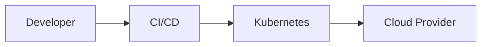

# 11. Cloud & Kubernetes

> Status: **Done** — concise notes for all sub-topics below.

[← Back to master index](../README.md)

---

## At a glance

---

## Sub-topics

| # | Sub-topic |
|---|-----------|
| 11.1 | [IaaS](#111-iaas) |
| 11.2 | [PaaS](#112-paas) |
| 11.3 | [SaaS](#113-saas) |
| 11.4 | [Serverless](#114-serverless) |
| 11.5 | [Autoscaling](#115-autoscaling) |
| 11.6 | [Regions](#116-regions) |
| 11.7 | [Availability Zones](#117-availability-zones) |
| 11.8 | [Multi Region Deployment](#118-multi-region-deployment) |
| 11.9 | [VPC](#119-vpc) |
| 11.10 | [Cloud Networking](#1110-cloud-networking) |
| 11.11 | [Cloud Storage](#1111-cloud-storage) |
| 11.12 | [Managed Databases](#1112-managed-databases) |
| 11.13 | [Docker](#1113-docker) |
| 11.14 | [Container Runtime](#1114-container-runtime) |
| 11.15 | [Container Images](#1115-container-images) |
| 11.16 | [Image Layers](#1116-image-layers) |
| 11.17 | [Namespaces](#1117-namespaces) |
| 11.18 | [cgroups](#1118-cgroups) |
| 11.19 | [Kubernetes](#1119-kubernetes) |
| 11.20 | [Pods](#1120-pods) |
| 11.21 | [Deployments](#1121-deployments) |
| 11.22 | [ReplicaSets](#1122-replicasets) |
| 11.23 | [Services](#1123-services) |
| 11.24 | [Ingress](#1124-ingress) |
| 11.25 | [StatefulSets](#1125-statefulsets) |
| 11.26 | [DaemonSets](#1126-daemonsets) |
| 11.27 | [Jobs](#1127-jobs) |
| 11.28 | [CronJobs](#1128-cronjobs) |
| 11.29 | [ConfigMaps](#1129-configmaps) |
| 11.30 | [Secrets](#1130-secrets) |
| 11.31 | [Scheduler](#1131-scheduler) |
| 11.32 | [etcd](#1132-etcd) |
| 11.33 | [Operators](#1133-operators) |
| 11.34 | [HPA](#1134-hpa) |
| 11.35 | [Cluster Autoscaler](#1135-cluster-autoscaler) |

---

## 11.1 IaaS

**Summary:** Infrastructure as a Service — rent VMs, networks, and storage; you manage OS, runtime, and apps.

- You control the full stack from the OS upward; cloud provider runs physical hardware
- Examples: AWS EC2, Azure VMs, GCP Compute Engine
- Trade-off: maximum flexibility vs operational burden (patching, scaling, HA)

**References:** _None yet._

---

## 11.2 PaaS

**Summary:** Platform as a Service — deploy code; provider manages OS, runtime, and infrastructure.

- Focus on application logic; no server patching or capacity planning at VM level
- Examples: Heroku, AWS Elastic Beanstalk, Google App Engine
- Trade-off: faster delivery vs less control over runtime and networking

**References:** _None yet._

---

## 11.3 SaaS

**Summary:** Software as a Service — fully managed application accessed over the internet.

- Multi-tenant by default; upgrades and maintenance handled by vendor
- Examples: Gmail, Salesforce, Slack
- Trade-off: zero ops for users vs limited customization and data residency constraints

**References:** _None yet._

---

## 11.4 Serverless

**Summary:** Event-driven compute where you pay per invocation; no servers to provision or manage.

- Functions scale to zero; cold starts add latency on first request
- Examples: AWS Lambda, Azure Functions, Cloud Functions
- Best for sporadic workloads, webhooks, and glue logic — not long-running processes

**References:** _None yet._

---

## 11.5 Autoscaling

**Summary:** Automatically adjust resource count based on metrics (CPU, queue depth, custom signals).

- Horizontal: add/remove instances; Vertical: resize existing instances
- Requires health checks, cooldown periods, and min/max bounds to avoid thrashing
- Pair with load balancers and stateless services for clean scale-out

**References:** _None yet._

---

## 11.6 Regions

**Summary:** Geographically isolated cloud data-center areas with independent power, networking, and services.

- Choose regions for latency to users and data sovereignty/compliance
- Cross-region traffic costs money and adds latency
- Disaster recovery often spans multiple regions

**References:** _None yet._

---

## 11.7 Availability Zones

**Summary:** Isolated data centers within a region, connected by low-latency private links.

- Deploy across 2+ AZs for high availability within a region
- AZ failure should not take down the whole application
- Synchronous replication within region; async across regions

**References:** _None yet._

---

## 11.8 Multi Region Deployment

**Summary:** Running active or standby workloads in more than one geographic region.

- Active-active: users routed to nearest region; requires data replication strategy
- Active-passive: DR failover to secondary region with defined RTO/RPO
- Challenges: consistency, conflict resolution, and cross-region cost

**References:** _None yet._

---

## 11.9 VPC

**Summary:** Virtual Private Cloud — isolated network within a public cloud, like a private data center.

- Subnets (public/private), route tables, security groups, and NACLs control traffic
- Private subnets hide backends; public subnets expose load balancers/NAT
- Foundation for all cloud networking and peering

**References:** _None yet._

---

## 11.10 Cloud Networking

**Summary:** VPC primitives — subnets, gateways, peering, VPN, and load balancers that connect services.

- NAT Gateway lets private subnets reach the internet without inbound exposure
- VPC peering and transit gateways connect multiple networks
- DNS (Route 53, Cloud DNS) maps names to endpoints across regions

**References:** _None yet._

---

## 11.11 Cloud Storage

**Summary:** Object, block, and file storage services with durability and tiering built in.

- Object (S3, GCS): cheap, durable blobs; block (EBS): attached disk for VMs
- Lifecycle policies move cold data to cheaper tiers automatically
- Design for 11 nines durability via replication — still need backup strategy

**References:** _None yet._

---

## 11.12 Managed Databases

**Summary:** Cloud-hosted databases where the provider handles backups, patching, and failover.

- RDS, Cloud SQL, Aurora — automated backups, read replicas, Multi-AZ failover
- Trade managed convenience vs vendor lock-in and tuning limits
- Still your job: schema design, query optimization, and connection pooling

**References:** _None yet._

---

## 11.13 Docker

**Summary:** Platform to build, ship, and run applications in lightweight, portable containers.

- Packages app + dependencies into an image; runs consistently anywhere
- `Dockerfile` defines build steps; `docker run` starts isolated processes
- Foundation for CI/CD and Kubernetes workloads

**References:** _None yet._

---

## 11.14 Container Runtime

**Summary:** Low-level engine that runs containers — pulls images, creates namespaces, starts processes.

- containerd and CRI-O are common runtimes behind Kubernetes
- Implements OCI (Open Container Initiative) image and runtime specs
- Kubernetes talks to runtime via CRI (Container Runtime Interface)

**References:** _None yet._

---

## 11.15 Container Images

**Summary:** Immutable, read-only template containing filesystem layers and metadata to run a container.

- Stored in registries (Docker Hub, ECR, GCR); tagged with version or digest
- Immutable tags enable reproducible deploys; scan images for vulnerabilities
- Multi-stage builds keep production images small and secure

**References:** _None yet._

---

## 11.16 Image Layers

**Summary:** Images are stacked read-only layers; each Dockerfile instruction often creates one layer.

- Layer caching speeds rebuilds — order instructions from least to most changing
- Shared layers reduce storage and pull time across images
- Union filesystem merges layers into a single view at runtime

**References:** _None yet._

---

## 11.17 Namespaces

**Summary:** Linux kernel feature isolating process IDs, mount points, network, and users.

- Each container gets its own PID namespace — processes can't see host processes
- Foundation of container isolation alongside cgroups
- Kubernetes also uses "Namespaces" for cluster resource grouping (different concept)

**References:** _None yet._

---

## 11.18 cgroups

**Summary:** Control groups limit and account CPU, memory, disk I/O, and network for process groups.

- Prevents one container from starving others on the same host
- Kubernetes `requests` and `limits` map to cgroup constraints
- OOM killer terminates containers exceeding memory limits

**References:** _None yet._

---

## 11.19 Kubernetes

**Summary:** Container orchestrator that automates deploy, scale, and heal of containerized apps.

- Declarative desired state — you define YAML; controllers reconcile reality
- Control plane (API server, scheduler, etcd) + worker nodes (kubelet, kube-proxy)
- Industry standard for running microservices at scale

**References:** _None yet._

---

## 11.20 Pods

**Summary:** Smallest deployable unit in Kubernetes — one or more containers sharing network and storage.

- Containers in a pod share `localhost` and volumes
- Ephemeral by default — state belongs in StatefulSets or external stores
- Sidecar pattern: helper container alongside main app (logging, proxy)

**References:** _None yet._

---

## 11.21 Deployments

**Summary:** Declarative controller managing ReplicaSets for stateless app rollouts and rollbacks.

- Rolling updates replace pods gradually with zero-downtime strategy
- `kubectl rollout undo` reverts to previous revision
- Use for web APIs, workers without stable identity

**References:** _None yet._

---

## 11.22 ReplicaSets

**Summary:** Ensures a specified number of pod replicas are running at all times.

- Deployments own ReplicaSets; you rarely create ReplicaSets directly
- If a pod dies, ReplicaSet creates a replacement
- Label selectors tie ReplicaSet to its pods

**References:** _None yet._

---

## 11.23 Services

**Summary:** Stable network endpoint exposing a set of pods via ClusterIP, NodePort, or LoadBalancer.

- ClusterIP: internal only; LoadBalancer: cloud LB with public IP
- kube-proxy routes traffic to healthy pod endpoints
- Headless Service (`clusterIP: None`) for direct pod DNS (StatefulSets)

**References:** _None yet._

---

## 11.24 Ingress

**Summary:** HTTP/HTTPS routing into the cluster — host/path rules, TLS termination, and load balancing.

- Requires an Ingress Controller (nginx, Traefik, AWS ALB)
- One entry point for many services vs one LoadBalancer per service
- Supports canary routing and cert management (cert-manager)

**References:** _None yet._

---

## 11.25 StatefulSets

**Summary:** Controller for stateful apps needing stable network IDs and persistent storage.

- Pods get ordered names (`app-0`, `app-1`) and stable DNS
- Each pod can bind its own PersistentVolumeClaim
- Use for databases, Kafka, ZooKeeper — not general web tiers

**References:** _None yet._

---

## 11.26 DaemonSets

**Summary:** Ensures one pod copy runs on every (or selected) node in the cluster.

- Use for node-level agents: log collectors, monitoring, CNI plugins
- Automatically schedules on new nodes as they join
- Replaces manual per-node daemon installation

**References:** _None yet._

---

## 11.27 Jobs

**Summary:** Runs pods to completion — batch work, one-off tasks, or parallel processing.

- `completions` and `parallelism` control batch size
- Retries failed pods up to `backoffLimit`
- Pod deleted after success; use for migrations, ETL, report generation

**References:** _None yet._

---

## 11.28 CronJobs

**Summary:** Schedules Jobs on a cron timetable — periodic batch and maintenance tasks.

- Kubernetes CronJob creates Job objects on schedule
- Watch for missed runs if cluster was down (`startingDeadlineSeconds`)
- Prefer external schedulers for complex DAG workflows

**References:** _None yet._

---

## 11.29 ConfigMaps

**Summary:** Stores non-sensitive configuration as key-value pairs mounted into pods.

- Decouple config from image — change config without rebuild
- Mount as env vars or files in a volume
- Not encrypted at rest by default — use Secrets for sensitive data

**References:** _None yet._

---

## 11.30 Secrets

**Summary:** Kubernetes object for sensitive data — passwords, tokens, TLS certs.

- Base64 encoded, not encrypted by default; enable encryption at rest in etcd
- Mount like ConfigMaps or expose as env vars
- Integrate with external secret managers (Vault, AWS Secrets Manager) in production

**References:** _None yet._

---

## 11.31 Scheduler

**Summary:** Control-plane component assigning pods to nodes based on resources, affinity, and taints.

- Filters nodes that can't fit pod (CPU, memory, GPU, ports)
- Scores remaining nodes for optimal placement
- Custom schedulers or scheduling gates for specialized workloads

**References:** _None yet._

---

## 11.32 etcd

**Summary:** Distributed key-value store holding all Kubernetes cluster state and configuration.

- Strong consistency via Raft consensus — quorum required for writes
- Backup etcd regularly; cluster breaks without it
- Typically runs 3 or 5 nodes for HA on control plane

**References:** _None yet._

---

## 11.33 Operators

**Summary:** Custom controller extending Kubernetes to manage complex stateful applications.

- Encodes operational knowledge (install, upgrade, backup) in code
- Uses Custom Resource Definitions (CRDs) for domain-specific APIs
- Examples: Prometheus Operator, Postgres Operator

**References:** _None yet._

---

## 11.34 HPA

**Summary:** Horizontal Pod Autoscaler scales pod count based on CPU, memory, or custom metrics.

- Targets Deployments/ReplicaSets; adjusts replicas between min and max
- Needs metrics-server or Prometheus adapter for custom metrics
- Cooldown prevents rapid scale oscillation

**References:** _None yet._

---

## 11.35 Cluster Autoscaler

**Summary:** Adds or removes worker nodes when pods can't be scheduled or nodes are underutilized.

- Works with cloud auto-scaling groups (ASG, MIG, VMSS)
- Scale-up when pods are Pending; scale-down when nodes are empty
- Pair with HPA: HPA scales pods, Cluster Autoscaler scales nodes

**References:** _None yet._

---

## Quick Reference

| Sub-topic | One-liner | When to use |
|-----------|-----------|-------------|
| **IaaS / PaaS / SaaS** | Cloud responsibility split | Match ops appetite to model |
| **Serverless** | Pay-per-invocation compute | Event-driven, bursty workloads |
| **Autoscaling / HPA / Cluster Autoscaler** | Match capacity to demand | Variable traffic |
| **Regions / AZs / Multi-region** | Geographic isolation & DR | HA and compliance |
| **VPC / Cloud Networking** | Private cloud network | Every production deployment |
| **Cloud Storage / Managed DB** | Managed persistence | Offload ops, not design |
| **Docker / Runtime / Images / Layers** | Portable packaging | CI/CD and K8s foundation |
| **Namespaces / cgroups** | Container isolation | Understand limits and security |
| **Kubernetes / Pods** | Orchestration unit | Run containers at scale |
| **Deployments / ReplicaSets** | Stateless rollouts | Web apps, APIs |
| **Services / Ingress** | Stable networking & HTTP routing | Expose workloads |
| **StatefulSets / DaemonSets / Jobs / CronJobs** | Specialized pod lifecycles | DBs, agents, batch |
| **ConfigMaps / Secrets** | Config & credentials | Decouple from images |
| **Scheduler / etcd** | Placement & cluster brain | Troubleshoot scheduling |
| **Operators** | Day-2 ops as code | Complex stateful software |

---

[← Back to master index](../README.md)
