# 12. Reliability Engineering

[<- Back to master index](../README.md)

---

## Sub-topics

| # | Sub-topic |
|---|-----------|
| 12.1 | [High Availability](#121-high-availability) |
| 12.2 | [Failure Detection](#122-failure-detection) |
| 12.3 | [Active-Active & Active-Passive](#123-active-active-active-passive) |
| 12.4 | [Backup, Restore, RPO, RTO & Disaster Recovery](#124-backup-restore-rpo-rto-disaster-recovery) |
| 12.5 | [Chaos Engineering & Fault Injection](#125-chaos-engineering-fault-injection) |

---

## 12.1 High Availability

### Overview

Picture a hospital that cannot afford to lose power during surgery — so it runs on two independent electrical feeds and switches automatically if one fails. **High availability (HA)** is the same idea for software: when a server, disk, or network link fails, users should barely notice because spare capacity takes over.

Technically, HA means eliminating **single points of failure (SPOFs)** through **redundancy**, detecting failures quickly ([12.2](#122-failure-detection)), and **failing over** to healthy components — often in seconds. It targets **component-level** outages inside a site; catastrophic regional loss needs disaster recovery ([12.4 — Disaster recovery](#disaster-recovery)). Common patterns are **active-active** ([12.3](#123-active-active-active-passive)) and **active-passive** ([12.3 — Active-passive](#active-passive)).

---

### What problem it fixes

A single server, database, or network path is a bottleneck and a liability:

- One app server crash → entire service down
- One database host failure → all reads and writes stop
- One load balancer → no path for traffic

Without HA, every hardware fault becomes a customer-facing outage. Revenue stops, support tickets spike, and trust erodes. HA trades extra infrastructure cost for **automatic continuity** when individual parts break.

---

### What it does

HA keeps a service **reachable and correct** during common failures by:

**Redundancy** — multiple copies of critical components (servers, DB replicas, network paths).

**Failure detection** — health checks and heartbeats mark unhealthy instances ([12.2](#122-failure-detection)).

**Failover** — traffic or leadership moves to a standby without manual intervention.

**Failback** — restored primary rejoins after repair (automatic or manual).

It does **not** guarantee zero downtime (that is **fault tolerance**) and does **not** replace backups or DR for site-wide disasters.

---

### Compared to the alternative

| | High availability | Fault tolerance | Disaster recovery |
|---|-------------------|-----------------|-------------------|
| **Scope** | Component failure in one site | Hardware fault with no user-visible gap | Entire site or region lost |
| **Downtime** | Seconds to minutes possible | Effectively none | Minutes to hours |
| **Cost** | Moderate | High (duplicate hardware) | Varies by cold/warm/hot site |
| **Example** | Failover to DB replica | Dual CPUs executing same work | Failover to second data center |

---

### How it works — the architecture inside

#### Single point of failure

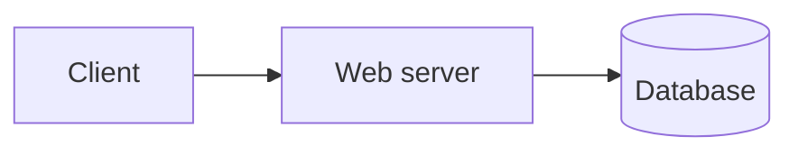

If the database dies, the app is down. HA adds redundancy at **every layer** that can fail.

#### Redundancy and load balancing

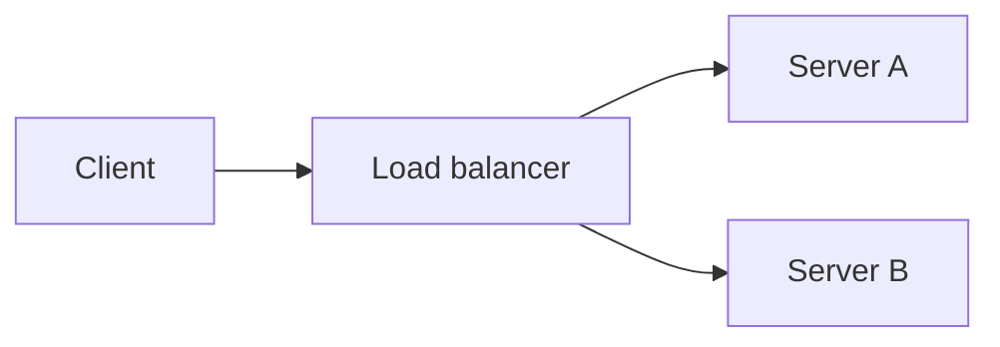

The load balancer sends traffic only to servers that pass health checks. Server A fails → Server B continues.

#### Database failover

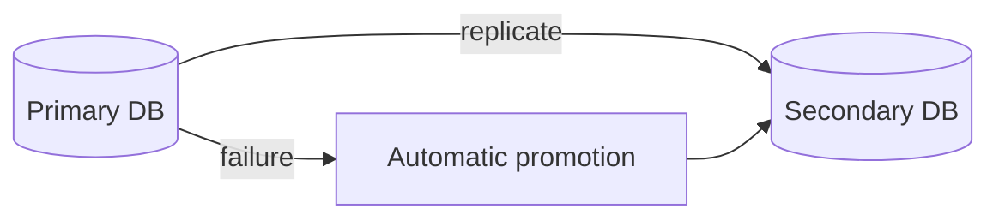

**Other layers:** RAID and replicated storage · dual network paths · UPS and generator power.

#### Failover vs failback

```text
Normal:     primary serves traffic, secondary syncs
Failure:    primary unhealthy → secondary promoted
Repaired:   old primary rejoins as standby (failback)
```

#### Worked example — e-commerce web tier failure

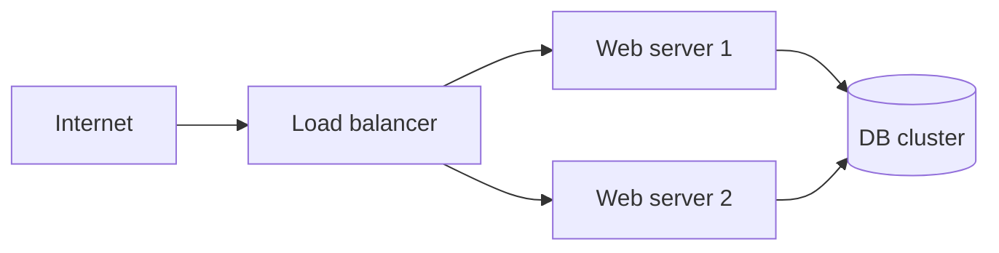

1. Users hit the load balancer; traffic splits across two web servers.
2. Web server 1 crashes at 2:00 PM.
3. Health check fails within seconds; LB removes server 1 from the pool.
4. Server 2 handles all requests — brief capacity drop, no full outage.
5. Server 1 repaired and rejoins after passing health checks.

---

### Pitfalls and design tips

#### When to use (and when not to)

- **Default for production services** — any tier with revenue or SLA exposure needs redundancy at compute, data, and network layers.
- **HA ≠ fault tolerance** — HA accepts brief blips (seconds); fault tolerance masks hardware faults with duplicate execution (Tandem, Stratus). Interviewers often conflate them.
- **HA does not replace DR** — multi-AZ survives AZ failure, not regional outage or ransomware; pair HA with backups and DR ([12.4 — Disaster recovery](#disaster-recovery)).
- **N+1 for stateless tiers** — run at least one extra instance so losing one node does not drop below required capacity; size for peak load on N−1 nodes.

#### Common mistakes

- **The load balancer is a SPOF** — use redundant LBs (active/passive pair), DNS round-robin to multiple LBs, or cloud-managed LBs with built-in redundancy.
- **Redundant app servers do not fix a single DB** — every stateful tier (database, cache, message broker) needs its own replication and failover path.
- **Failover without drills rots** — config, credentials, and DNS TTLs change; quarterly game days catch stale runbooks before customers do.

#### Production notes

- AWS ALB + Auto Scaling Group, Kubernetes `replicas` + PodDisruptionBudget, Postgres with Patroni or RDS Multi-AZ, Redis Sentinel or ElastiCache Multi-AZ.

---

### Real-world example: Stripe-style payment API tier

**Problem:** A payment API must stay available when individual instances or an AZ fail — downtime directly blocks revenue and merchant trust.

**Naive failure:** A single app server behind one load balancer with a single Postgres host. One instance crash or DB disk failure takes the entire API offline until manual intervention.

**How HA fixed it:** Stripe's public architecture docs describe stateless API nodes behind load balancers, with databases replicated for durability. The pattern maps directly: three or more stateless app instances behind an ALB; Postgres primary with synchronous standby in a second AZ; session or idempotency keys in Redis (not local memory). When one instance fails, the ALB drains connections and routes to survivors. When the primary DB fails, automated promotion targets under 30 seconds.

**Outcome:** Component failures become brief capacity dips or sub-minute failovers instead of full outages — **every layer** (compute, LB, DB, cache) has an automated recovery path.

---

## 12.2 Failure Detection

### Overview

Imagine a factory line where a sensor must notice a jam before the whole belt backs up. In distributed systems, **failure detection** is that sensor: it decides whether a server, database, or region is healthy enough to receive traffic — fast enough that users never queue behind a dead node.

Technically, monitors **probe** components on a schedule (HTTP `/health`, TCP port, DB query) or watch **heartbeats** (periodic "I'm alive" signals). Failed probes mark an instance **unhealthy**; load balancers, Kubernetes, and failover controllers remove it and trigger recovery ([12.1](#121-high-availability)). The hard part is balancing **speed** (fail fast) against **false positives** (flapping).

---

### What problem it fixes

Without detection, redundancy is useless:

- Load balancer keeps sending requests to a crashed server → timeouts and 502 errors
- Active-passive standby never promotes because it thinks the primary is fine
- Orchestrator schedules new pods on a node that is actually wedged

Detection is the **trigger** for every automated recovery path in this chapter.

---

### What it does

Continuously answers: **"Is this component fit to serve?"**

**Health checks** — active probes from outside (LB, K8s kubelet, synthetic monitoring).

**Heartbeats** — passive signals from the component to a peer or coordinator.

**Outcomes:**

- Healthy → keep in rotation
- Unhealthy → remove from pool, alert, optionally failover
- Degraded → alert but may still serve (policy-dependent)

---

### Compared to the alternative

| | No health checks (blind routing) | Health-checked routing |
|---|----------------------------------|------------------------|
| **Dead node behavior** | LB keeps sending traffic → timeouts, 502s | Dead node removed from pool within probe interval |
| **User impact** | Every request to dead node fails | Traffic shifts to healthy peers |
| **Failover trigger** | Manual or never | Automatic promotion / replacement |
| **Cost** | None (but outages are expensive) | Probe overhead + tuning effort |
| **Example** | Static DNS round-robin to crashed server | AWS ALB target health checks, K8s readiness probes |

---

### How it works — probes, heartbeats, and thresholds

#### Health check flow

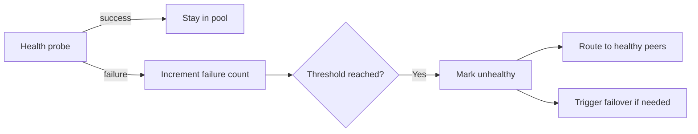

#### Liveness vs readiness

| Probe | Question | Example failure |
|-------|----------|-----------------|
| **Liveness** | Is the process running? | Dead JVM → restart pod |
| **Readiness** | Can it serve traffic now? | DB connection pool exhausted → remove from LB, don't restart |

A service can be **alive** but **not ready** — returning 200 on `/health` while dependencies are down is a common mistake.

#### Heartbeat in active-passive pairs

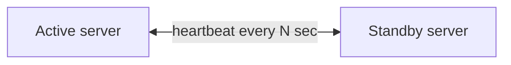

If heartbeats stop, standby promotes — but without **fencing** (isolating the failed primary), both nodes may write (split-brain).

#### Detection to recovery flow

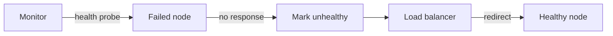

**Tuning:** aggressive timeouts → faster failover, more false positives. Lenient timeouts → slower failover, users wait longer on dead nodes.

#### Worked example — Kubernetes pod failure

1. Pod passes liveness and readiness probes → receives Service traffic.
2. App deadlocks; liveness probe fails 3 times in a row.
3. Kubelet kills the container; scheduler starts a replacement.
4. New pod fails readiness until DB connection succeeds.
5. Only after readiness passes does the Service endpoint list include the new pod.

Users see errors only during the gap between failure and ready replacement.

---

### Pitfalls and design tips

#### When to use (and when not to)

- **Required whenever redundancy exists** — without detection, spare capacity never takes over automatically.
- Use **readiness** to drain traffic from degraded instances; use **liveness** only to restart truly dead processes.
- **Heartbeat failover** needs **fencing** (STONITH, lease-based leadership) — promotion without isolation risks split-brain.

#### Common mistakes

- **Liveness vs readiness confusion** — restarting a pod whose DB is down (liveness passes, readiness fails) causes a crash loop; use readiness to drain traffic, liveness only for deadlocks.
- **`/health` always returns 200** — hides dead dependencies; readiness must probe DB, cache, and disk (e.g. `SELECT 1`, Redis `PING`).
- **No fencing on heartbeat failover** — isolated primary keeps writing while standby promotes → split-brain; use STONITH, lease-based leadership (etcd), or cloud API stop-instance.
- **Flapping** — node repeatedly added/removed from pool; add hysteresis (require N consecutive failures, longer success threshold before re-adding).

#### Production notes

- Kubernetes `livenessProbe` / `readinessProbe`, AWS ALB target health checks, Consul health checks, PagerDuty/Opsgenie on sustained unhealthy counts.
- **Monitoring the monitors** — if the probe agent dies silently, you are blind; meta-alert on probe-agent health and synthetic checks from outside the cluster.

---

### Real-world example: AWS ALB multi-AZ health checks

**Problem:** A multi-AZ API must stop routing to failed targets within seconds, not minutes — users behind a dead AZ should not see sustained 502 errors.

**Naive failure:** Static target lists or lenient health checks keep sending traffic to instances in a partitioned AZ. Users hit timeouts until someone manually removes targets.

**How health-checked routing fixed it:** An ALB health-checks `GET /ready` every 5 seconds; 2 consecutive failures mark a target unhealthy. With targets in three AZs, an AZ network partition removes unhealthy targets in ~10 seconds (2 × 5s interval) and traffic flows to surviving AZs.

**Outcome:** PagerDuty fires on sustained unhealthy count **before** customer SLO breach — detection is the first line, alerting is the safety net.

---

## 12.3 Active-Active & Active-Passive

### Overview

Think of a restaurant with three identical kitchens — every order goes to whichever kitchen has capacity right now. If one kitchen closes for a fire alarm, the other two absorb the load. **Active-active** means **all nodes serve traffic at once**; none sit idle waiting for disaster.

Technically, multiple identical servers run behind a **load balancer** that distributes requests ([12.2](#122-failure-detection) removes failed nodes). All nodes read and write shared state — database, cache, object storage — so any node can handle any request. Higher throughput and utilization than active-passive; more complexity around **sessions**, **write conflicts**, and **replication lag**.

---

### What problem it fixes

One server cannot handle peak traffic and is a single point of failure. Active-active provides:

- **Horizontal scale** — add nodes for more capacity
- **Resilience** — one node loss reduces capacity but does not stop the service
- **Rolling maintenance** — drain one node, upgrade, rejoin

Suited for high-traffic APIs, e-commerce, streaming, and any stateless or shared-state tier.

---

### What it does

All servers in the pool **actively process requests** simultaneously.

**Load distribution** — round robin, least connections, weighted, or consistent hash.

**On failure** — LB stops routing to dead node; survivors take its share.

**On recovery** — healthy node re-enters the pool.

Requires **shared or partitioned data** so requests are not tied to one machine's local disk.

---

### Compared to the alternative

| | Active-active | Active-passive |
|---|---------------|----------------|
| **Nodes serving** | All | One active, others standby |
| **Utilization** | High | Standby mostly idle |
| **Failover** | Redistribute load | Promote standby (brief gap) |
| **Data writes** | Multiple writers — need coordination | Single writer — simpler |
| **Complexity** | Higher | Lower |
| **Best for** | Scale + resilience | Simpler HA, strong consistency |

Active-passive is covered in [12.3 — Active-passive](#active-passive). Active-active does **not** replace backups ([12.4](#124-backup-restore-rpo-rto-disaster-recovery)).

---

### How it works — traffic flow and shared state

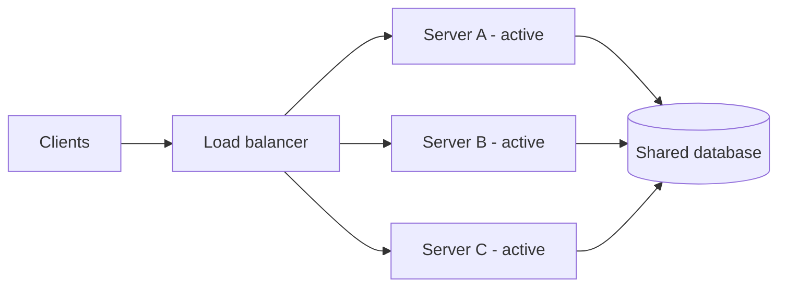

#### Request distribution

```text
Request 1 → A    Request 2 → B    Request 3 → C
Request 4 → A    Request 5 → B
```

**Round robin** — cycle through nodes.

**Least connections** — send to the least busy node.

**Weighted** — powerful machines get more share.

#### Session handling

Users may hit different servers on each request. Options:

| Approach | How it works |
|----------|--------------|
| **External session store** (Redis) | All nodes read/write session keys |
| **Stateless JWT** | No server-side session; token in cookie/header |
| **Sticky sessions** | LB pins user to one node — fragile if that node dies |

#### Failure scenario

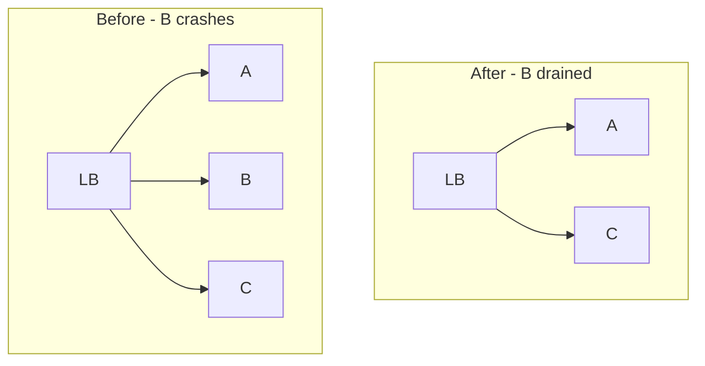

#### Worked example — three-node API cluster

An API runs three identical pods behind nginx. Traffic splits ~33% each. Pod B OOM-kills during a traffic spike:

1. Readiness probe fails; nginx marks B down within 10 seconds.
2. Requests redistribute ~50/50 to A and C — latency rises slightly, no hard outage.
3. HPA may add a fourth pod if CPU SLO threatened.
4. B restarts; passes readiness; returns to rotation.

---

### Pitfalls and design tips

#### When to use (and when not to)

- **Default for new stateless APIs:** active-active behind LB + shared DB; avoid sticky sessions unless legacy constraint forces it.
- Use when you need **horizontal scale and resilience** together — one node loss should not stop the service.
- Prefer **active-passive** ([12.3 — Active-passive](#active-passive)) when single-writer consistency is simpler than coordinating multiple live writers.

#### Common mistakes

- **Sticky sessions are fragile** — if the pinned node dies, users lose session state; prefer external session store (Redis) or stateless JWT.
- **Multiple writers need coordination** — two app servers writing the same row without transactions or optimistic locking causes lost updates; single-writer DB or conflict resolution required.
- **Replication lag = stale reads** — async replica may serve data seconds behind primary; route critical reads to primary or use sync replication for those paths.
- **Capacity headroom on N−1** — losing one of three nodes jumps load ~50%; size clusters so survivors stay under CPU/memory SLO at N−1.

#### Production notes

- nginx/K8s Service round-robin, DynamoDB or Redis for session state, HPA for auto-scale on survivor overload.

---

### Real-world example: Netflix API gateway (Zuul)

**Problem:** Netflix's edge must serve millions of requests with no single instance as a bottleneck — any one gateway node must be disposable without customer impact.

**Naive failure:** A single gateway with local session state. Terminating that instance logs out users and drops in-flight requests until manual recovery.

**How active-active fixed it:** Netflix's Zuul API gateway runs as a fleet of stateless instances behind Eureka service discovery. Every instance handles traffic; no node is "standby." Session state lives in external stores, not local memory. When an instance is terminated (including by Chaos Monkey — see [12.5](#125-chaos-engineering-fault-injection)), Eureka deregisters it within one heartbeat interval and remaining instances absorb the load.

**Outcome:** Instance loss becomes a capacity blip, not an outage — the canonical active-active pattern: **stateless compute + externalized state**.

---

### Active-passive

#### Overview

Picture a pilot and co-pilot: one flies, the other monitors instruments and takes the controls instantly if the pilot becomes incapacitated. **Active-passive** HA assigns **one node to serve all traffic** while a **standby** stays synchronized and ready to promote on failure.

Technically, the active node handles reads and writes; the passive replica receives **continuous replication** (DB streaming, file sync, config push). **Failure detection** ([12.2](#122-failure-detection)) via health checks or heartbeat triggers **failover** — the passive becomes active. Simpler consistency than active-active (single writer) at the cost of **idle standby hardware** and a **short interruption** during promotion.

---

#### What problem it fixes

You need HA without coordinating writes across multiple live nodes:

- Banking cores where one authoritative writer reduces conflict risk
- Legacy apps that assume single-node semantics
- Database primaries with hot standby replicas

Acceptable when failover takes seconds (not milliseconds) and standby capacity sitting idle is affordable.

---

#### What it does

**Normal operation** — all traffic → active node; passive stays in sync.

**Replication** — database WAL shipping, storage mirroring, or periodic state copy.

**Failover** — active fails → passive promoted → traffic redirected.

**Failback** — repaired old primary re-syncs and becomes passive again.

---

#### Compared to the alternative

| | Active-passive | Active-active |
|---|----------------|---------------|
| **Write path** | Single primary | Multiple nodes (coordination needed) |
| **Standby use** | Idle until failover | Always serving |
| **Failover gap** | Seconds typical | Near zero (redistribute) |
| **Split-brain risk** | High without fencing | Lower for reads; writes need care |
| **Cost efficiency** | Lower (idle standby) | Higher utilization |

---

#### How it works — replication and promotion


#### Failover sequence

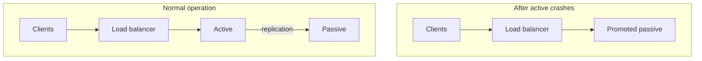

```text
1. Health check / heartbeat detects active failure
2. LB or cluster manager stops routing to active
3. Passive promoted (may require fencing old active)
4. DNS/LB points to new active
5. Clients retry; service resumes (RTO window)
```

Replication lag at failover moment defines actual **RPO** ([12.4 — RPO](#rpo)).

#### Worked example — Postgres primary with standby

1. Primary serves reads/writes; synchronous standby in another AZ.
2. Primary AZ network partition at 14:00 — primary isolated but still running.
3. **Fencing** (STONITH or cloud API stop) kills isolated primary to prevent split-brain.
4. Standby promotes at 14:01; application connection string updates via DNS or service discovery.
5. Users see ~60 seconds of errors; business RTO target is 5 minutes — met.
6. Old primary rejoins as replica after partition heals.

---

#### Pitfalls and design tips

#### When to use (and when not to)

- Use when **single-writer consistency** matters more than maximizing utilization — banking cores, legacy single-node apps, database primaries.
- **Idle standby is real cost** — you pay for a machine that does no work until disaster; justify with simpler consistency and lower split-brain risk.
- **Synchronous replication trades latency for RPO** — sync standby gives RPO ≈ 0 but adds write latency; async is faster but laggy.

#### Common mistakes

- **Split-brain without fencing** — network partition leaves both primary and standby writing; always fence the old primary (STONITH, `pg_ctl promote` + revoke old primary's write access).
- **Replication lag = actual RPO** — at failover, anything not yet replicated is lost; monitor `pg_stat_replication.replay_lag` or equivalent as an SLO.
- **Failover gap consumes RTO** — detection time + promotion + DNS TTL + app reconnect = your RTO budget; measure end-to-end in drills.

#### Production notes

- Postgres Patroni + etcd, AWS RDS Multi-AZ, SQL Server Always On Availability Groups, MySQL Group Replication with single-writer mode.

---

#### Real-world example: Postgres Patroni failover

**Problem:** A Postgres primary can fail from disk corruption, AZ outage, or OOM — the database must promote a standby without manual DBA intervention.

**Naive failure:** Manual promotion scripts, no fencing. A network partition leaves both primary and standby accepting writes — split-brain corrupts data.

**How active-passive fixed it:** Patroni manages Postgres primary/standby pairs with etcd for leader election. On primary failure, Patroni detects missed heartbeats, fences the old primary via callback (often cloud API `StopInstances`), and promotes the standby. AWS RDS Multi-AZ uses the same pattern internally: automatic failover typically completes in 60–120 seconds.

**Outcome:** A documented disk-corruption incident on the primary promoted the standby in ~4 minutes with 12 seconds of WAL lag — actual RPO = 12 seconds, actual RTO = 4 minutes.

---

## 12.4 Backup, Restore, RPO, RTO & Disaster Recovery

### Overview

Everyone knows to photocopy important documents before a meeting — if the original coffee-spills, the copy saves the day. A **backup strategy** is the IT version: planned copies of data, stored safely, kept long enough, and **tested** so you can actually get them back ([12.4 — Restore](#restore-strategy)).

Technically, it defines **what** to copy (databases, files, configs), **how** (full, incremental, differential), **where** (local, remote, cloud), **how often**, and **retention**. Backup frequency caps your **RPO** ([12.4 — RPO](#rpo)) — hourly backups mean up to an hour of data loss unless replication also runs.

---

### What problem it fixes

Data loss sources are everywhere:

- Hardware failure, accidental `DELETE`, bad deploy, ransomware, site disaster
- "We had backups" that were never restorable

Without a strategy, recovery is ad hoc, slow, and often impossible. With one, recovery becomes a **repeatable procedure** with known time and data-loss bounds.

---

### What it does

Creates **point-in-time copies** of data independent of the primary system.

**Schedules** automated backup jobs.

**Retains** copies per policy (30 daily, 4 weekly, 12 monthly fulls, etc.).

**Protects** copies (encryption, immutability, off-site separation).

Does **not** by itself restore service — that is [12.4 — Restore strategy](#restore-strategy).

---

### How it works — backup types and the 3-2-1 rule

#### Full, incremental, differential

| Type | What is copied | Backup speed | Restore chain |
|------|----------------|--------------|---------------|
| **Full** | Everything | Slowest, largest | Single backup |
| **Incremental** | Changes since last backup of any type | Fastest, smallest | Full + every incremental since |
| **Differential** | Changes since last full | Medium | Full + latest differential only |

```text
Monday:    FULL
Tuesday:   INCR (since Mon)
Wednesday: INCR (since Tue)
Thursday:  INCR (since Wed)

Restore Thu: FULL + Mon_incr + Tue_incr + Wed_incr

---
Monday:    FULL
Tue–Thu:   DIFF (all changes since Monday)

Restore Thu: FULL + Thu_diff only
```

#### 3-2-1 rule

```text
3 copies of data (1 production + 2 backups)
2 different media types (e.g. disk + object storage)
1 copy off-site (different building or cloud region)
```

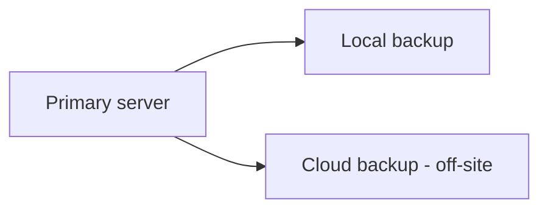

#### Storage locations

| Location | Pros | Cons |
|----------|------|------|
| **Local NAS / disk** | Fast backup and restore | Lost in same fire/flood as primary |
| **Remote site** | Geographic separation | Network-dependent restore |
| **Cloud object storage** | Durable, scalable, cheap | Egress cost; needs internet |

Encrypt backups at rest and in transit; use **immutable** storage (WORM, S3 Object Lock) against ransomware.

#### Worked example — e-commerce database schedule

```text
Sunday 02:00  — FULL backup to S3
Hourly        — INCREMENTAL to S3
Daily         — sync copy to second cloud region (off-site)
Retention     — 7 daily, 4 weekly, 12 monthly fulls
```

Monday 11:00 corruption discovered:

- Latest full: Sunday 02:00
- Latest incremental: Monday 10:00
- **Worst-case data loss if restored to 10:00 incr:** 1 hour (drives RPO discussion in [12.4 — RPO](#rpo))

#### Backup type comparison

| | Full | Incremental | Differential |
|---|------|-------------|--------------|
| **Storage growth** | High per job | Lowest | Grows until next full |
| **Restore time** | Fastest | Slowest (long chain) | Medium |
| **Typical use** | Weekly anchor | Frequent small deltas | Middle ground |

**How to calculate — backup storage growth (incremental chain):**

```text
Goal:  Estimate weekly backup storage for an incremental chain and the RPO ceiling from backup interval alone

Given:
  Full backup size     = 500 GB
  Daily incremental    = 20 GB/day (avg)
  Retention            = 7 daily incrementals between fulls

Week 1 storage (before next full):
  Full          = 500 GB
  7 incrementals = 7 × 20 = 140 GB
  Total         = 640 GB

Designed RPO ceiling (backup-only, no replication):
  Backup interval = 1 hour → worst-case data loss = 1 hour of writes
  If write rate = 5 GB/hour → up to 5 GB unrecoverable without WAL/PITR

Interpretation: Incremental chains minimize backup I/O but grow storage linearly with retention;
  backup interval alone sets the RPO ceiling unless WAL archiving or replication narrows it.

Sanity check: If designed RPO is 5 minutes, hourly backups alone cannot meet it — add WAL archiving or continuous replication.
```

---

### Pitfalls and design tips

#### When to use (and when not to)

- **Every production data store** needs a defined backup strategy — databases, object storage, configs, and IaC state.
- **Backup frequency sets RPO ceiling** — nightly full alone → RPO up to 24 hours; tighten with hourly incrementals + WAL/PITR.
- Backups complement but do not replace **replication** — replication gives low RPO; backups protect against logical corruption and ransomware.

#### Common mistakes

- **Backup job success ≠ restorable backup** — corrupted dumps, wrong permissions, and missing WAL segments surface only at restore time; test monthly ([12.4 — Restore](#restore-strategy)).
- **Incremental chains are fragile** — one missing incremental breaks the entire chain; monitor chain integrity and alert on gaps.
- **Local-only backups die with the site** — 3-2-1 rule: at least one copy off-site and on different media.
- **Ransomware encrypts local backups** — use S3 Object Lock (WORM), Azure Immutable Blob Storage, or tape with offline rotation.

#### Production notes

- Postgres `pg_basebackup` + WAL archiving to S3, AWS RDS automated backups + snapshots, Veeam/Commvault for VMs, `restic`/`borg` for file-level.

---

### Real-world example: Postgres PITR with WAL archiving

**Problem:** A SaaS team needs point-in-time recovery after accidental deletes, bad migrations, or ransomware — nightly full backups alone lose up to 24 hours of data.

**Naive failure:** Weekly full backups only. A noon corruption forces restore to last Sunday — a full business day of orders lost.

**How backup strategy fixed it:** Postgres with nightly `pg_basebackup` to S3 and continuous WAL archiving (`archive_mode = on`, `archive_command` pushes WAL to S3). Recovery playbook: spin a clean instance, restore latest base backup, replay WAL to one minute before the incident (`recovery_target_time`). Ransomware variant: restore from S3 Object Lock immutable copy.

**Outcome:** Monthly drill restores to staging and runs row-count validation — backup metrics alone are insufficient; practiced PITR cuts RPO from 24 hours to minutes.

---

### Restore strategy

#### Overview

Having a fire extinguisher is not the same as knowing how to use it under smoke and stress. A **restore strategy** is the practiced playbook for turning backups ([12.4](#124-backup-restore-rpo-rto-disaster-recovery)) back into a running system — who does what, in what order, with what verification — so recovery time is predictable.

Technically, it covers **restore type** (full system, file-level, database PITR, bare metal), **restore chain** (which backups to apply in sequence), and **validation** before resuming traffic. Restore duration directly bounds **RTO** ([12.4 — RTO](#rto)); the age of the restored data bounds **RPO** ([12.4 — RPO](#rpo)).

---

#### What problem it fixes

Untested backups fail when needed:

- Incrementals restored out of order → corrupt database
- Team discovers restore takes 8 hours, not the assumed 30 minutes
- Production traffic resumes before data integrity checks complete

A restore strategy turns "we have backups" into "we can recover within RTO to a point within RPO."

---

#### What it does

**Identifies** the correct backup set for the failure.

**Restores** data and configuration to a clean target (same or new hardware).

**Verifies** integrity — row counts, checksums, app smoke tests.

**Resumes** operations or fails over DNS/traffic to the recovered environment.

---

#### How it works — restore types and chains

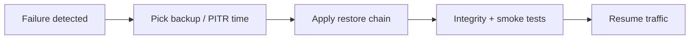

#### Restore types

| Type | Scope | When |
|------|-------|------|
| **Full system** | OS + apps + data | Total server loss |
| **File-level** | Selected files/folders | Accidental delete |
| **Database** | Whole DB or tables | Corruption, bad migration |
| **Bare metal** | Image to new hardware | Dead machine |
| **PITR** | DB to exact timestamp | Need minimal data loss |

#### Incremental restore chain

```text
Failure: Wednesday 10:00

Restore order:
  1. Sunday FULL
  2. Monday INCREMENTAL
  3. Tuesday INCREMENTAL
  4. Wednesday INCREMENTAL (if exists before 10:00)

Skip none. Order matters.
```

#### Differential restore chain

```text
  1. Sunday FULL
  2. Latest DIFFERENTIAL (Wednesday AM)
```

#### Worked example — banking DB corruption on Wednesday

```text
10:00 AM — DBA notices corrupted index on primary DB
10:05 AM — incident declared; writes stopped
10:10 AM — restore to staging: Sunday full + Mon/Tue/Wed incrementals
10:35 AM — consistency checks pass; row counts match expectations
10:45 AM — application pointed to restored DB; read-only verification
11:00 AM — full traffic resumed

Total downtime: 60 minutes (compare to RTO target)
Data loss: changes between 09:00 incremental and 10:00 failure = 1 hour (actual RPO)
```

**How to calculate — restore time estimate:**

```text
Goal:  Estimate the restore-only component of RTO for a full + incremental chain

Given:
  Full backup size       = 500 GB
  3 incrementals × 20 GB = 60 GB
  Restore throughput     = 200 MB/s (network + disk)
  Integrity check        = 10 minutes
  Smoke tests            = 5 minutes

Step 1 — data transfer:
  Total data = 500 + 60 = 560 GB = 573,440 MB
  Transfer time = 573,440 / 200 ≈ 2,867 seconds ≈ 48 minutes

Step 2 — apply incrementals (sequential):
  Apply overhead ≈ 5 minutes

Step 3 — validation:
  10 + 5 = 15 minutes

Estimated RTO component (restore only) ≈ 48 + 5 + 15 = 68 minutes

Interpretation: Transfer dominates restore time; validation is non-negotiable before cutover.
  Total RTO always exceeds restore-only — add detection, DNS, and staff response.

Sanity check: Add detection time, DNS cutover, and staff response — total RTO is always longer than restore transfer alone.
```

#### Factors that affect restore time

Backup size · storage I/O · network bandwidth · number of incremental layers · integrity checks · whether runbooks are current · staff familiarity from drills

---

#### Pitfalls and design tips

#### When to use (and when not to)

- **Every backup strategy needs a matching restore strategy** — backups without a practiced restore path are inventory, not insurance.
- **PITR beats full+incremental for RPO** — Postgres `recovery_target_time` can recover to minutes before failure; nightly full alone loses a full business day.
- **Restore to a clean target** — never restore over a running corrupted instance; use a side instance, validate, then swap DNS.

#### Common mistakes

- **Restore chain order is not negotiable** — applying incrementals out of sequence corrupts the database; document exact order in the runbook.
- **"Restored" ≠ "verified"** — row counts, checksums, and app smoke tests must pass before resuming traffic; skipping validation ships bad data.
- **Runbook rot** — decommissioned servers, rotated credentials, and changed S3 bucket names break restores; drill quarterly.

#### Production notes

- Postgres PITR (`pg_restore` + WAL replay), AWS RDS point-in-time restore, Veeam instant recovery, Terraform to provision clean restore environment.

---

#### Real-world example: Postgres PITR after accidental `DROP TABLE`

**Problem:** An engineer runs `DROP TABLE orders` on production — writes must stop immediately and orders must be recovered with minimal data loss.

**Naive failure:** Restore from last night's full backup only. RPO = 24 hours — a full business day of orders gone.

**How restore strategy fixed it:** Within 5 minutes writes freeze. Team uses Postgres PITR: restore base backup to a side instance, replay WAL to 2 minutes before the drop, validate `SELECT COUNT(*) FROM orders` matches pre-incident count, swap connection string.

**Outcome:** Total outage: 22 minutes. PITR recovered to 2 minutes before the drop instead of losing 24 hours.

---

### RPO

#### Overview

If your laptop crashes, the question is: "How much work since my last save can I afford to lose?" **Recovery Point Objective (RPO)** is that question at company scale — the **maximum acceptable data loss**, measured as time: "We can lose at most 5 minutes of writes."

Technically, RPO is a **business target**, not a backup feature. It drives architecture: RPO of 24 hours → daily backups may suffice. RPO of 5 minutes → hourly backups are insufficient; you need continuous replication or WAL archiving. RPO answers *how far back* you recover; **RTO** ([12.4 — RTO](#rto)) answers *how long users wait*.

---

#### What problem it fixes

Teams argue about backup frequency without a shared goal. Executives say "we cannot lose data"; engineering hears "run backups nightly" — a mismatch.

RPO makes the trade-off explicit:

- Tighter RPO → more replication, more cost, more complexity
- Looser RPO → cheaper, simpler, more loss acceptable

It aligns product, legal, and infrastructure on one number per service tier.

---

#### What it means

```text
RPO = maximum acceptable age of data at recovery time
```

**Not** "how often we backup" — that is a *means* to achieve RPO.

**Not** RTO — downtime is separate.

If RPO = 1 hour and the last recoverable point is 45 minutes before failure, you met RPO for that incident.

---

#### How to achieve it — techniques by target

| Target RPO | Typical techniques |
|------------|-------------------|
| **24 hours** | Daily full backups ([12.4](#124-backup-restore-rpo-rto-disaster-recovery)) |
| **1 hour** | Hourly incrementals or snapshots |
| **5 minutes** | Frequent snapshots + WAL/log shipping |
| **Near zero** | Synchronous replication to standby |

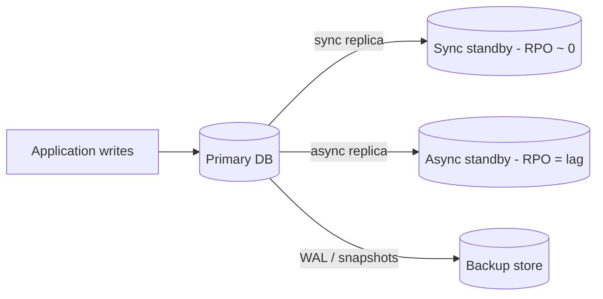

**Replication lag** is the operational metric for async RPO. Monitor it as an SLO.

#### Worked example — hourly backup vs actual crash

```text
09:00 AM — backup completes
10:00 AM — backup completes
10:30 AM — server crash

Latest recoverable point: 10:00 AM backup
Data lost: 10:00 → 10:30 = 30 minutes

If business RPO = 1 hour  → incident met target
If business RPO = 5 minutes → failed; need continuous replication
```

**Designed RPO vs actual loss:** the backup schedule sets the *designed* ceiling; replication lag sets the *actual* ceiling for async setups.

**How to calculate — actual data loss (RPO):**

```text
Goal:  Measure actual data loss at failure and compare to the business RPO target

Given:
  Last successful backup/replay point = 10:00 AM
  Failure detected at                = 10:30 AM
  Write rate during gap              = 2,000 orders/minute

Step 1 — time-based RPO:
  Actual RPO = 10:30 − 10:00 = 30 minutes of writes lost

Step 2 — volume-based impact (optional):
  Lost records ≈ 30 min × 2,000/min = 60,000 orders

Step 3 — compare to target:
  Business RPO target = 5 minutes → FAILED (30 > 5)
  Business RPO target = 1 hour    → MET (30 < 60)

Interpretation: Backup interval sets the designed ceiling; async replication lag sets the actual ceiling at failure.
  Volume impact helps executives understand business cost beyond the time metric.

Sanity check: With async replication, actual RPO = replication lag at failure moment (e.g. 12 seconds), not backup interval.
```

#### RPO by system tier

| System | Typical RPO | Why |
|--------|-------------|-----|
| **Core banking ledger** | ~0 (sync replication) | Transactions cannot vanish |
| **E-commerce orders** | 1–5 minutes | Recent orders have revenue impact |
| **Social feed** | 15–60 minutes | Regenerable / eventually consistent |
| **Analytics warehouse** | 24 hours | Rebuildable from sources |

Define RPO **per tier**, not one number for the whole company.

#### RPO vs RTO

| | RPO | RTO |
|---|-----|-----|
| **Measures** | Data loss (time) | Downtime (time) |
| **Question** | How far back? | How long until up? |
| **Driven by** | Backup/replication design | HA, restore speed, DR ([12.4 — Disaster recovery](#disaster-recovery)) |
| **Independent?** | Yes — low RPO + high RTO is common | Yes |

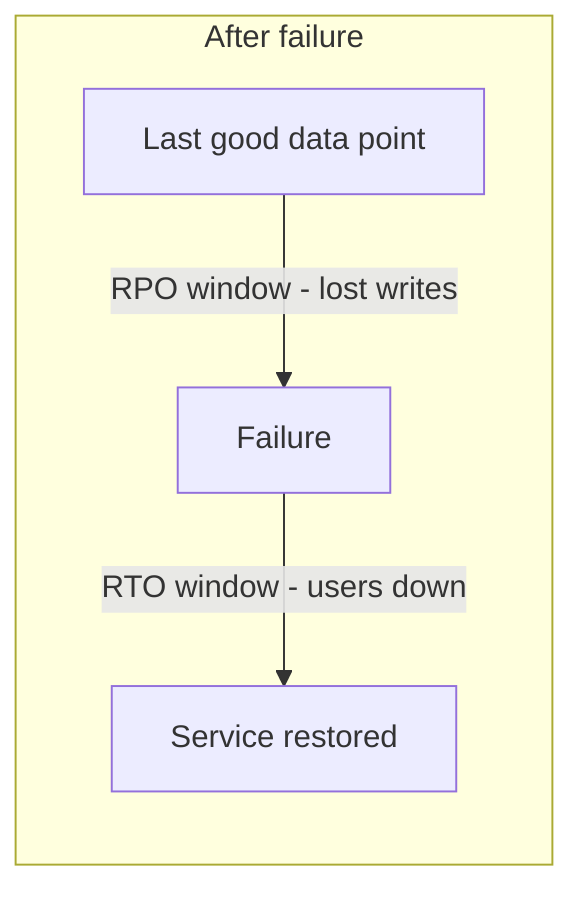

---

#### Pitfalls and design tips

#### When to use (and when not to)

- **RPO is a business number, not a backup schedule** — "we backup hourly" is a means; the question is "how many minutes of orders can we lose?"
- Define RPO **per tier**, not one number for the whole company — ledger needs RPO ≈ 0; analytics can tolerate 24 hours.
- **Interview angle:** RPO and RTO are independent — you can have RPO = 0 (sync replica) and RTO = 4 hours (slow restore from replica).

#### Common mistakes

- **Designed RPO ≠ actual RPO** — backup interval sets the ceiling; replication lag, failed backup jobs, and WAL gaps set the floor in practice.
- **Async replication lag spikes during load** — monitor `replay_lag` as an SLO; page before lag exceeds RPO target.

#### Production notes

- Postgres sync standby (`synchronous_commit = on`), AWS RDS cross-region read replica with monitored lag, S3 versioning + PITR for object data.

---

#### Real-world example: tiered RPO in a fintech stack

**Problem:** A fintech handles ledger, audit, and reporting data with different loss tolerance — one RPO for the whole stack misaligns cost and risk.

**Naive failure:** Single nightly backup policy for all databases. A ledger outage with 12 hours of replication lag would breach regulatory requirements.

**How tiered RPO fixed it:** Ledger on sync replica in a second AZ (RPO ≈ 0), audit logs on async replication + S3 (RPO = replication lag, target 15 minutes), reporting DB on nightly export (RPO = 24 hours).

**Outcome:** When async replica lag spiked to 20 minutes, the audit tier breached its RPO target — automated page fired before any customer-facing impact.

---

### RTO

#### Overview

RPO asks how much data you can lose; **Recovery Time Objective (RTO)** asks how long customers can wait before the service is back. If your store is offline, every minute costs money and reputation — RTO is the agreed ceiling: "We must be live again within 30 minutes."

Technically, RTO is the **maximum acceptable downtime** after a failure. It drives investment in HA ([12.1](#121-high-availability)), automated failover ([12.3 — Active-passive](#active-passive)), restore automation ([12.4 — Restore](#restore-strategy)), and DR site warmth ([12.4 — Disaster recovery](#disaster-recovery)). Meeting RTO requires measuring **end-to-end** recovery in drills, not summing optimistic step estimates.

---

#### What problem it fixes

Without RTO, teams discover recovery takes hours only during a real outage. Sales promises "always on"; ops has never tested promotion under load.

RTO forces:

- Documented runbooks with time budgets
- Automation instead of manual heroics
- Regular drills that clock wall-clock recovery

---

#### What it means

```text
RTO = maximum acceptable time from failure to restored service
```

Clock starts when users are impacted (or failure detected — define this in your policy).

Clock stops when the service meets SLO again (not merely when the first process starts).

---

#### How to achieve it — techniques by target

| Target RTO | Typical techniques |
|------------|-------------------|
| **< 1 minute** | Active-active + auto LB drain, multi-AZ |
| **1–15 minutes** | Active-passive auto-promotion, health-checked failover |
| **1–4 hours** | Warm standby DR, scripted restore |
| **24+ hours** | Cold site, restore from backup tapes/cloud |

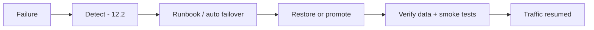

Each step consumes part of the RTO budget.

#### Worked example — active-passive banking failover

```text
Business RTO: 10 minutes

10:00:00 — primary app server fails
10:00:15 — health check marks unhealthy (3 × 5s probes)
10:00:30 — LB stops routing to primary
10:01:00 — standby promoted, app starts on passive
10:04:00 — smoke tests pass (login, balance read)
10:05:00 — DNS TTL expired; all clients on new active

Total: 5 minutes — RTO met
```

If smoke tests had been skipped and bad data served, "recovery" would be a false pass.

**How to calculate — RTO budget breakdown:**

```text
Goal:  Sum every phase of recovery and compare to the business RTO target

Given:
  Detection (3 × 5s probes)     = 15 seconds
  LB drain + stop routing       = 15 seconds
  Standby promotion + app start = 60 seconds
  Smoke tests                   = 180 seconds
  DNS TTL (worst case)          = 300 seconds

Step 1 — sum phases:
  RTO estimate = 15 + 15 + 60 + 180 + 300 = 570 seconds ≈ 9.5 minutes

Step 2 — compare to target:
  Business RTO = 10 minutes → MET (with 30s margin)
  Business RTO = 5 minutes  → FAILED (DNS TTL alone exceeds budget)

Interpretation: DNS TTL is often the hidden RTO killer — lower TTL before planned failovers.
  Clock stops when SLO is met, not when the first process starts.

Sanity check: Lower DNS TTL (60s) before failover-critical cutovers; pre-warm connection pools on standby.
```

#### RTO by system tier

| System | Typical RTO | Why |
|--------|-------------|-----|
| **Payment API** | 1–5 minutes | Direct revenue loss per minute |
| **E-commerce storefront** | 15–60 minutes | High cost; some buffer exists |
| **Internal HR portal** | 4–24 hours | Lower customer visibility |
| **Batch reporting** | Next business day | Not real-time |

---

#### Pitfalls and design tips

#### When to use (and when not to)

- **Every customer-facing service needs a defined RTO** — without it, teams optimize for cost until a real outage exposes hours-long recovery.
- Match **site warmth to RTO** — cold DR cannot meet 15-minute RTO; hot multi-region can.

#### Common mistakes

- **Runbook never drilled → 3× longer in real incidents** — muscle memory and discovered blockers only come from timed drills.
- **"Up" ≠ recovered** — process started but users still see errors until data is verified and traffic resumes; clock stops at SLO met, not at `systemctl start`.
- **DNS TTL eats RTO** — 5-minute RTO with 5-minute TTL means some clients wait 10 minutes; lower TTL before planned failover.
- **Restore-from-backup RTO includes download + apply** — not just failover; a 500 GB restore at 200 MB/s is ~42 minutes before validation even starts.
- **Count every phase** — detection + decision + recovery + validation + traffic cutover; optimistic single-step estimates always fail audits.

#### Production notes

- Route 53 health-check failover, Patroni automated promotion, pre-scripted Terraform for DR environment spin-up.

---

#### Real-world example: Route 53 health-check failover

**Problem:** A multi-region SaaS must shift traffic to a secondary region when the primary region fails — customers cannot wait for manual DNS edits.

**Naive failure:** Long DNS TTL (300s+), hardcoded primary-region webhook URLs, cold secondary with no pre-warmed capacity. Failover takes 15+ minutes and breaks payment callbacks.

**How automated failover fixed it:** Primary region fails; Route 53 health checks on the primary endpoint fail after 2 consecutive 30-second intervals (~60 seconds). Traffic shifts to the secondary region's ALB by ~3 minutes total. Secondary runs at reduced capacity (warm standby); autoscaler adds capacity over the next 7 minutes.

**Outcome:** RTO target: 5 minutes — met. Post-drill finding: payment webhook URLs hardcoded to primary region — fixed before the next drill.

---

### Disaster recovery

#### Overview

High availability is like spare tires — you fix a flat and keep driving. **Disaster recovery (DR)** is the plan for when the whole car is totaled: fire, flood, ransomware encryption, or an entire cloud region offline for hours. You need a second place to run and data copies that survived the disaster.

Technically, DR restores **applications, data, and infrastructure** after catastrophic failure, within **RPO** ([12.4 — RPO](#rpo)) and **RTO** ([12.4 — RTO](#rto)) targets. It complements HA ([12.1](#121-high-availability)): HA handles a dead server; DR handles a dead data center. Strategies range from **backup-and-restore** (cheap, slow) to **hot multi-region** (expensive, fast).

---

#### What problem it fixes

HA in one building does not help when:

- The building floods or burns
- A regional cloud provider has a prolonged outage
- Ransomware encrypts production and local backups
- Operator error wipes an entire environment

DR provides **geographic separation** and **tested recovery** at another site.

---

#### What it does

**Detects** site-level failure (not just one host).

**Activates** a DR plan — manual declaration or automated failover.

**Restores or fails over** to a secondary site with recoverable data.

**Redirects** users (DNS, global load balancer, BGP).

**Validates** RPO/RTO before declaring "recovered."

---

#### Compared to the alternative

| | HA | DR |
|---|-----|-----|
| **Failure scope** | Server, disk, rack | Site, region, cyber event |
| **Recovery** | Seconds–minutes | Minutes–hours (strategy-dependent) |
| **Location** | Same site / AZ | Different site / region |
| **Cost** | Moderate redundancy | Significant duplicate infra |

You need **both** for production-grade reliability.

---

#### How it works — sites, strategies, and recovery paths

#### DR site warmth

| Site type | What runs normally | Typical RTO | Cost |
|-----------|-------------------|-------------|------|
| **Cold** | Empty racks / restore on demand | Days | Lowest |
| **Warm** | Partial infra + replicated data | Hours | Medium |
| **Hot** | Full parallel stack, sync/async replication | Minutes | Highest |

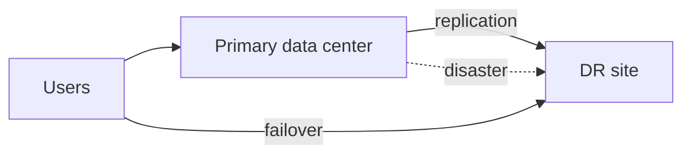

#### Common DR strategies

| Strategy | Idea | RTO / RPO trade-off |
|----------|------|---------------------|
| **Backup and restore** | Restore backups at DR site | Loosest RTO/RPO |
| **Pilot light** | Minimal core always on (DB replica); scale apps on disaster | Medium |
| **Warm standby** | Reduced capacity stack always running | Faster RTO |
| **Hot site / multi-region** | Full active stack in two regions | Tightest RTO/RPO |
| **Cloud DR** | Cross-region replication, managed snapshots | Flexible, ops-heavy |

#### Recovery paths

**From replication:**

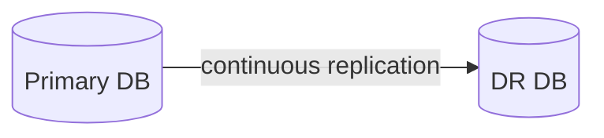

RPO = replication lag; RTO = DNS + app startup at DR.

**From backups:**

```text
Off-site backup store → restore to DR hardware → validate → cutover
```

RPO = backup age; RTO = restore duration ([12.4 — Restore](#restore-strategy)).

**How to calculate — DR RPO and RTO from strategy:**

```text
Goal:  Estimate RPO and RTO for two DR strategies and validate site warmth matches targets

Given (hot standby with async replication):
  Replication lag at failure  = 2 minutes
  DNS failover time           = 3 minutes
  App cold-start at DR        = 2 minutes
  Smoke test                  = 5 minutes

RPO = replication lag = 2 minutes (lost writes not yet replicated)
RTO = 3 + 2 + 5 = 10 minutes (detection assumed instant)

Given (backup-and-restore to cold site):
  Last off-site backup age    = 18 hours
  Provision hardware          = 4 hours
  Restore 500 GB at 100 MB/s  = ~83 minutes
  Validation                  = 30 minutes

RPO = 18 hours (backup age)
RTO = 4h + 1.4h + 0.5h ≈ 6 hours (optimistic; add staff response)

Interpretation: Hot standby trades infra cost for minutes-level RTO/RPO; cold site is cheap but measured in hours.
  Match declared RTO to site warmth — do not sell cold DR as 5-minute RTO.

Sanity check: Cold-site RTO is almost always measured in hours/days, not minutes — do not sell cold DR as 5-minute RTO.
```

#### Worked example — data center fire

```text
Normal:     users → primary DC; async replication to DR DC 200 km away

02:00 AM — fire destroys primary DC
02:05 AM — monitoring loses all primary heartbeats
02:10 AM — incident commander declares disaster
02:15 AM — promote DR database; scale DR app tier
02:25 AM — global LB points to DR region
02:40 AM — smoke tests pass; customer comms sent

RTO achieved: 40 minutes (target 60)
RPO: 2 minutes replication lag at failure (target 5)
```

---

#### Pitfalls and design tips

#### When to use (and when not to)

- **HA does not replace DR** — multi-AZ survives AZ failure, not regional outage or ransomware that encrypts all AZs' shared control plane dependencies.
- You need **both** HA and DR for production-grade reliability.
- **Cold DR with tight RTO is a lie** — provisioning hardware + restore from tape cannot meet 15-minute RTO; match site warmth to RTO target.

#### Common mistakes

- **DR site with hardcoded primary URLs breaks failover** — webhooks, OAuth callbacks, and internal service discovery must use region-agnostic endpoints or config that swaps on DR.
- **Ransomware DR needs immutable backups** — replication copies encrypted malware too; restore from Object Lock / offline backup, not live replica.
- **DR drills find what HA drills miss** — DNS, certificate SANs, license keys tied to hostname, and third-party IP allowlists break only at region failover.

#### Production notes

- AWS multi-region with Route 53 failover, Azure Site Recovery, GCP cross-region GKE, pilot-light pattern (RDS cross-region replica + scaled-down ECS).

---

#### Real-world example: AWS pilot-light DR

**Problem:** A checkout API in `us-east-1` must survive a full regional outage without rebuilding infrastructure from scratch during the incident.

**Naive failure:** Backups only in the primary region. Region isolation means no runnable stack, no promoted database, and hours to provision DR hardware.

**How pilot-light DR fixed it:** AWS documents the **pilot-light** pattern: a minimal core (e.g. RDS cross-region read replica, AMIs pre-built) runs continuously in the DR region; app tier scales from zero on disaster declaration. Team keeps a read replica in `us-west-2` and a launch template ready. Annual drill: simulate region isolation with Security Group deny rules, promote replica, scale ECS from 0 → 10 tasks, shift Route 53.

**Outcome:** Last drill: RTO 8 minutes, RPO 0 with sync replication enabled — but found payment webhook URLs still pointed at `us-east-1` ALB; fixed before the next drill.

---

## 12.5 Chaos Engineering & Fault Injection

### Overview

Pilots train in simulators before real emergencies. **Chaos engineering** is the production reliability simulator: you **deliberately break things on purpose** — kill a server, add latency, isolate a zone — to learn whether the system actually survives before customers find out the hard way.

Technically, it is a disciplined experiment loop: define **steady state** (latency, error rate, throughput), form a **hypothesis** ("if one pod dies, SLO holds"), **inject** a controlled fault, **observe**, and **fix** gaps. Pioneered at Netflix (Chaos Monkey); tools include AWS FIS, Gremlin, Litmus. Distinct from ad-hoc fault injection ([12.5 — Fault injection](#fault-injection)) in scope — chaos tests **system-level** resilience; fault injection targets **specific components**.

---

### What problem it fixes

Redundant architecture on paper often fails in practice:

- Standby never promoted in a drill → fails in production
- Timeouts not tuned → cascading failure under latency
- DR runbook references decommissioned servers

Chaos finds **unknown unknowns** — dependency failures, alert gaps, runbook rot — in controlled conditions with blast-radius limits.

---

### What it does

Runs **controlled failure experiments** against production or production-like environments.

**Validates** HA, detection, failover, DR, and monitoring.

**Produces evidence** that recovery works — or tickets to fix what does not.

Does **not** replace unit tests, backups, or DR planning — it **stress-tests** them.

---

### Compared to the alternative

| | Traditional testing | Chaos engineering |
|---|---------------------|-------------------|
| **Environment** | Staging, scripted cases | Often production, realistic load |
| **Failures** | Expected paths | Surprising combinations |
| **Goal** | Features correct | System survives faults |
| **Audience** | QA sign-off | SRE confidence |

---

### How it works — the experiment loop

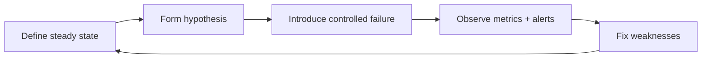

#### Step-by-step

```text
1. Steady state: p99 latency < 200ms, error rate < 0.1%
2. Hypothesis: "Killing one of three API pods keeps SLO"
3. Experiment: terminate random pod during business hours
4. Observe: LB drains in 8s; error spike 0.05% for 12s; SLO held
5. Improve: none — or file ticket if SLO breached
```

#### Blast radius controls

- Start in staging; graduate to prod with small scope
- Run during low-traffic windows initially
- **Abort conditions** — auto-stop if error rate > 5%
- One fault at a time until maturity increases

#### Worked example — server failure experiment

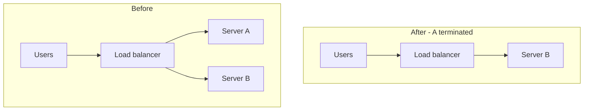

**Experiment:** terminate Server A.

**Expected:** detection ([12.2](#122-failure-detection)) removes A within probe interval; B absorbs traffic; no SLO breach.

**Observed failure mode (example):** sticky sessions tied to A → 15% users logged out. **Fix:** externalize sessions to Redis.

---

### Pitfalls and design tips

#### When to use (and when not to)

- **Start in staging, graduate to prod** — blast radius in production affects real customers; begin with one pod, one AZ, low-traffic window.
- **Chaos ≠ load testing** — chaos validates failure recovery under realistic load, not peak capacity; run load tests separately.
- **Steering committee / blast-radius approval** — Netflix runs Chaos Monkey during business hours *because* teams fixed their services; do not copy that on day one.

#### Common mistakes

- **Define abort conditions before injecting** — auto-stop if error rate > 5% or p99 > 2× baseline; manual kill switch for the experiment runner.
- **One fault at a time until mature** — killing a pod + adding latency + partitioning network simultaneously makes root-cause analysis impossible.

#### Production notes

- Netflix Chaos Monkey / Simian Army, AWS Fault Injection Simulator (FIS), Gremlin, Litmus Chaos (Kubernetes), Chaos Mesh.

---

### Real-world example: Netflix Chaos Monkey

**Problem:** At Netflix scale, individual EC2 instances fail constantly — services must survive random instance loss without manual intervention or customer-visible outages.

**Naive failure:** Stateful services with local session data and manual failover runbooks. A random instance termination causes user logouts and paging on-call until someone manually replaces capacity.

**How chaos engineering fixed it:** Netflix open-sourced **Chaos Monkey**, which randomly terminates production EC2 instances during business hours. The design intent: if your service cannot survive random instance loss without manual intervention, it is not production-ready.

**Outcome:** Over years: stateless services, externalized state, automated replacement via Auto Scaling Groups, and a culture aligned with "everything fails all the time" (their resilience engineering philosophy).

---

### Fault injection

#### Overview

Chaos engineering kicks the whole system to see if it wobbles. **Fault injection** is the precision tool — you break **one specific thing**: delay database responses by 500ms, return HTTP 503 from one dependency, fill a disk to 99%. It answers "does *this* retry policy work?" not "does the whole datacenter survive?"

Technically, fault injection introduces **defined, scoped faults** (network, CPU, disk, process kill, API error) via tools (iptables, toxiproxy, eBPF, service meshes) or frameworks (Chaos Mesh fault types). It validates **error handling, timeouts, circuit breakers, and failover triggers** at component level. Pairs with chaos engineering ([12.5](#125-chaos-engineering-fault-injection)): injection tests building blocks; chaos tests the assembled system.

---

#### What problem it fixes

Code paths for failure are rarely exercised:

- Retry logic never tested under real latency
- Circuit breaker never opens because dependency never "failed" in test
- Failover script works on paper but not when DB port is blocked

Injection forces those paths to run in controlled conditions.

---

#### What it does

**Defines** a fault (what, where, how long).

**Predicts** expected behavior (alert fires, retry 3×, then fail gracefully).

**Injects** the fault in staging or scoped production.

**Monitors** metrics, logs, traces during the window.

**Analyzes** pass/fail against prediction; files fixes.

---

#### Compared to the alternative

| | Fault injection | Chaos engineering |
|---|-----------------|-------------------|
| **Scope** | Single component / fault type | Whole system / random failures |
| **Control** | Precise, repeatable | Broader, exploratory |
| **Example** | Add 200ms to Redis | Kill random AZ |
| **Best for** | Libraries, timeouts, breakers | Architecture, DR, culture |

Use both: injection during development and CI; chaos in staging/prod for holistic confidence.

---

#### How it works — injection workflow

```mermaid
flowchart LR
    Define[Define fault] --> Predict[Expected behavior]
    Predict --> Inject[Inject fault]
    Inject --> Monitor[Monitor SLOs]
    Monitor --> Analyze[Compare to prediction]
    Analyze --> Fix[Fix or document gap]
```

#### Fault categories

| Category | Examples | What you learn |
|----------|----------|----------------|
| **Network** | 500ms latency, 10% packet loss, partition | Timeout and retry tuning |
| **Process** | `kill -9`, OOM | Supervisor and LB behavior |
| **Storage** | Disk full, slow I/O | Graceful degradation |
| **Dependency** | DB connection refused, 503 from API | Circuit breaker, fallbacks |
| **Infrastructure** | CPU throttle, DNS failure | Autoscaling, caching |

#### Worked example — database latency injection

```text
Hypothesis: "If Postgres p99 > 300ms for 60s, API returns 503
             and does NOT retry unbounded"

Setup:    toxiproxy adds 400ms latency to DB port on staging
Inject:   enable toxic for 2 minutes
Observe:  p99 API latency rises; circuit opens at 300ms;
          error rate 12%; no thread pool exhaustion
Result:   PASS — tune alert threshold from 500ms to 350ms
```

---

#### Pitfalls and design tips

#### When to use (and when not to)

- **Inject in staging first, scoped prod later** — same blast-radius discipline as chaos; one fault type, one dependency, timed window.
- Use for **libraries, timeouts, circuit breakers** — precise, repeatable validation of error-handling paths.
- Pair with chaos engineering ([12.5](#125-chaos-engineering-fault-injection)): injection tests building blocks; chaos tests the assembled system.

#### Common mistakes

- **Define expected behavior before injecting** — "circuit opens at 300ms, error rate < 15%, no thread exhaustion" — otherwise you cannot pass/fail the experiment.
- **Regression in CI** — automate injection tests (e.g. fraud API 100% failure) so timeout fixes do not rot between releases.

#### Production notes

- Toxiproxy, Chaos Mesh `NetworkChaos` / `HTTPChaos`, AWS FIS single-action faults, `tc netem` for Linux latency.
- **Service mesh fault injection (Istio/Linkerd)** — HTTP 503, delay, and abort on specific routes; good for microservice dependency testing.

---

#### Real-world example: checkout dependency timeout (Toxiproxy)

**Problem:** A checkout flow depends on a fraud-scoring API — if that dependency hangs, checkout must fail fast with a clear user message, not hold connection pool slots.

**Naive failure:** HTTP client had no timeout on the fraud API. Staging tests never exercised dependency failure — the path looked fine in happy-path QA.

**How fault injection fixed it:** Before launch, team injects 100% failure on the fraud-scoring API in staging using Toxiproxy's `timeout` toxic on the upstream connection. Expected: checkout declines safely with a user-visible message within 2 seconds. Observed: requests hung 30 seconds and held connection pool slots.

**Outcome:** Fixed before production; the same Toxiproxy scenario runs in CI on every release branch.

---

[<- Back to master index](../README.md)
