# 12. Reliability Engineering

[<- Back to master index](../README.md)

---

## Sub-topics

| # | Sub-topic |
|---|-----------|
| 12.1 | [High Availability](#121-high-availability) |
| 12.2 | [Failure Detection](#122-failure-detection) |
| 12.3 | [Active Active](#123-active-active) |
| 12.4 | [Active Passive](#124-active-passive) |
| 12.5 | [Backup Strategy](#125-backup-strategy) |
| 12.6 | [Restore Strategy](#126-restore-strategy) |
| 12.7 | [RPO](#127-rpo) |
| 12.8 | [RTO](#128-rto) |
| 12.9 | [Disaster Recovery](#129-disaster-recovery) |
| 12.10 | [Chaos Engineering](#1210-chaos-engineering) |
| 12.11 | [Fault Injection](#1211-fault-injection) |

---

## 12.1 High Availability

### Overview

Picture a hospital that cannot afford to lose power during surgery — so it runs on two independent electrical feeds and switches automatically if one fails. **High availability (HA)** is the same idea for software: when a server, disk, or network link fails, users should barely notice because spare capacity takes over.

Technically, HA means eliminating **single points of failure (SPOFs)** through **redundancy**, detecting failures quickly ([12.2](#122-failure-detection)), and **failing over** to healthy components — often in seconds. It targets **component-level** outages inside a site; catastrophic regional loss needs disaster recovery ([12.9](#129-disaster-recovery)). Common patterns are **active-active** ([12.3](#123-active-active)) and **active-passive** ([12.4](#124-active-passive)).

---

### What problem it fixes

A single server, database, or network path is a bottleneck and a liability:

- One app server crash → entire service down
- One database host failure → all reads and writes stop
- One load balancer → no path for traffic

Without HA, every hardware fault becomes a customer-facing outage. Revenue stops, support tickets spike, and trust erodes. HA trades extra infrastructure cost for **automatic continuity** when individual parts break.

---

### What it does

HA keeps a service **reachable and correct** during common failures by:

**Redundancy** — multiple copies of critical components (servers, DB replicas, network paths).

**Failure detection** — health checks and heartbeats mark unhealthy instances ([12.2](#122-failure-detection)).

**Failover** — traffic or leadership moves to a standby without manual intervention.

**Failback** — restored primary rejoins after repair (automatic or manual).

It does **not** guarantee zero downtime (that is **fault tolerance**) and does **not** replace backups or DR for site-wide disasters.

---

### How it works — the architecture inside

#### Single point of failure

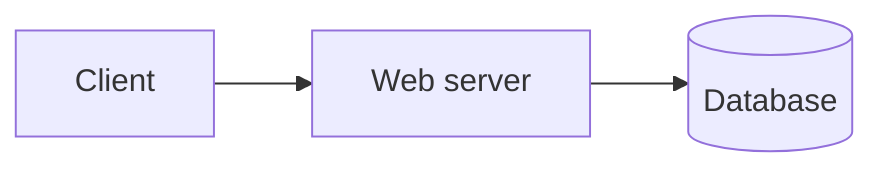

If the database dies, the app is down. HA adds redundancy at **every layer** that can fail.

#### Redundancy and load balancing

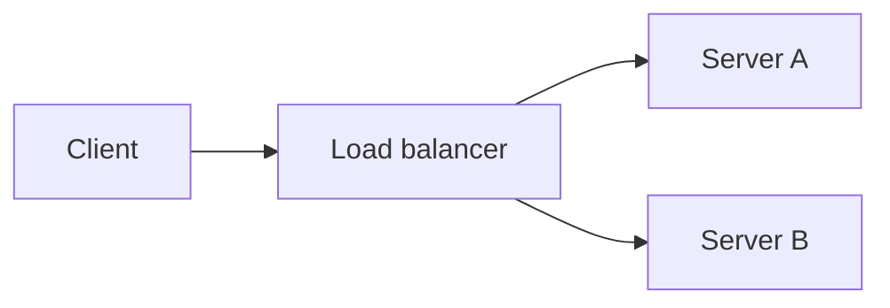

The load balancer sends traffic only to servers that pass health checks. Server A fails → Server B continues.

#### Database failover

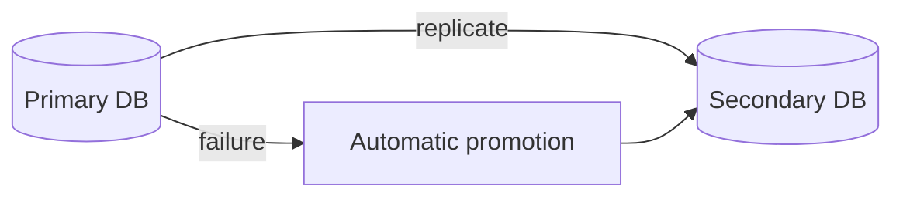

**Other layers:** RAID and replicated storage · dual network paths · UPS and generator power.

#### Failover vs failback

```text
Normal:     primary serves traffic, secondary syncs
Failure:    primary unhealthy → secondary promoted
Repaired:   old primary rejoins as standby (failback)
```

---

### Walkthrough: e-commerce web tier failure

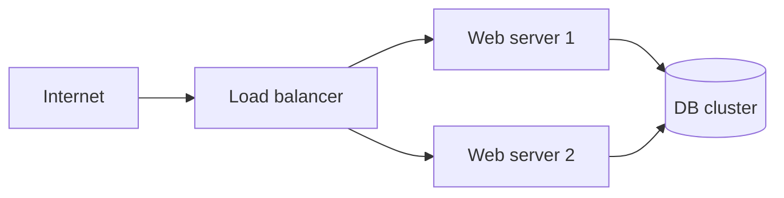

1. Users hit the load balancer; traffic splits across two web servers.
2. Web server 1 crashes at 2:00 PM.
3. Health check fails within seconds; LB removes server 1 from the pool.
4. Server 2 handles all requests — brief capacity drop, no full outage.
5. Server 1 repaired and rejoins after passing health checks.

---

### HA vs fault tolerance vs disaster recovery

| | High availability | Fault tolerance | Disaster recovery |
|---|-------------------|-----------------|-------------------|
| **Scope** | Component failure in one site | Hardware fault with no user-visible gap | Entire site or region lost |
| **Downtime** | Seconds to minutes possible | Effectively none | Minutes to hours |
| **Cost** | Moderate | High (duplicate hardware) | Varies by cold/warm/hot site |
| **Example** | Failover to DB replica | Dual CPUs executing same work | Failover to second data center |

---

### Real-world example: payment API tier

A fintech API runs three stateless app instances behind an ALB, a primary Postgres with synchronous standby in the same region, and Redis for session state. When one instance fails, the ALB drains connections and routes to survivors. When the primary DB fails, the standby promotes in under 30 seconds. Quarterly **game days** ([12.10](#1210-chaos-engineering)) kill random instances to prove failover still works.

---


## 12.2 Failure Detection

### Overview

Imagine a factory line where a sensor must notice a jam before the whole belt backs up. In distributed systems, **failure detection** is that sensor: it decides whether a server, database, or region is healthy enough to receive traffic — fast enough that users never queue behind a dead node.

Technically, monitors **probe** components on a schedule (HTTP `/health`, TCP port, DB query) or watch **heartbeats** (periodic "I'm alive" signals). Failed probes mark an instance **unhealthy**; load balancers, Kubernetes, and failover controllers remove it and trigger recovery ([12.1](#121-high-availability)). The hard part is balancing **speed** (fail fast) against **false positives** (flapping).

---

### What problem it fixes

Without detection, redundancy is useless:

- Load balancer keeps sending requests to a crashed server → timeouts and 502 errors
- Active-passive standby never promotes because it thinks the primary is fine
- Orchestrator schedules new pods on a node that is actually wedged

Detection is the **trigger** for every automated recovery path in this chapter.

---

### What it does

Continuously answers: **"Is this component fit to serve?"**

**Health checks** — active probes from outside (LB, K8s kubelet, synthetic monitoring).

**Heartbeats** — passive signals from the component to a peer or coordinator.

**Outcomes:**

- Healthy → keep in rotation
- Unhealthy → remove from pool, alert, optionally failover
- Degraded → alert but may still serve (policy-dependent)

---

### How it works — probes, heartbeats, and thresholds

#### Health check flow

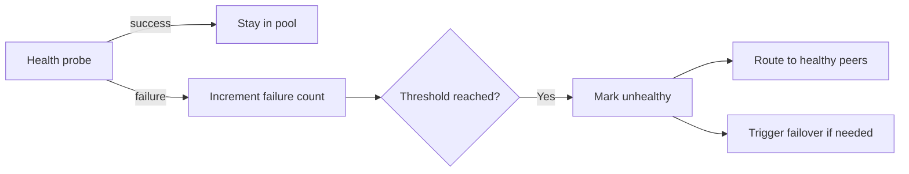

#### Liveness vs readiness

| Probe | Question | Example failure |
|-------|----------|-----------------|
| **Liveness** | Is the process running? | Dead JVM → restart pod |
| **Readiness** | Can it serve traffic now? | DB connection pool exhausted → remove from LB, don't restart |

A service can be **alive** but **not ready** — returning 200 on `/health` while dependencies are down is a common mistake.

#### Heartbeat in active-passive pairs

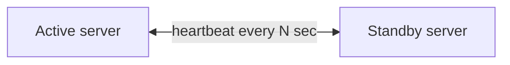

If heartbeats stop, standby promotes — but without **fencing** (isolating the failed primary), both nodes may write (split-brain).

#### Detection to recovery sequence

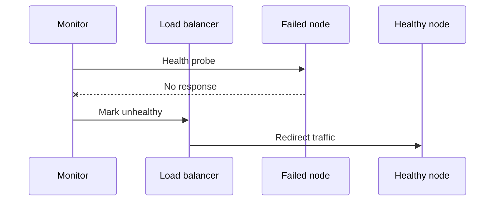

**Tuning:** aggressive timeouts → faster failover, more false positives. Lenient timeouts → slower failover, users wait longer on dead nodes.

---

### Walkthrough: Kubernetes pod failure

1. Pod passes liveness and readiness probes → receives Service traffic.
2. App deadlocks; liveness probe fails 3 times in a row.
3. Kubelet kills the container; scheduler starts a replacement.
4. New pod fails readiness until DB connection succeeds.
5. Only after readiness passes does the Service endpoint list include the new pod.

Users see errors only during the gap between failure and ready replacement.

---

### Common pitfalls

| Pitfall | Why it hurts | Fix |
|---------|--------------|-----|
| `/health` always returns 200 | Dead dependencies hidden | Check DB, cache, disk in readiness |
| No fencing on heartbeat failover | Split-brain writes | STONITH, lease-based leadership |
| Flapping | Node repeatedly added/removed | Hysteresis, consecutive failure thresholds |
| Monitoring the monitors | Silent blind spots | Meta-alerts on probe agent health |

---

### Real-world example: multi-AZ load balancer

An AWS ALB health-checks `/ready` every 5 seconds; 2 consecutive failures mark unhealthy. Targets in three AZs; when one AZ network partitions, unhealthy targets drain in ~10 seconds and traffic flows to surviving AZs. PagerDuty fires on sustained unhealthy count before customer SLO breach.

---


## 12.3 Active Active

### Overview

Think of a restaurant with three identical kitchens — every order goes to whichever kitchen has capacity right now. If one kitchen closes for a fire alarm, the other two absorb the load. **Active-active** means **all nodes serve traffic at once**; none sit idle waiting for disaster.

Technically, multiple identical servers run behind a **load balancer** that distributes requests ([12.2](#122-failure-detection) removes failed nodes). All nodes read and write shared state — database, cache, object storage — so any node can handle any request. Higher throughput and utilization than active-passive; more complexity around **sessions**, **write conflicts**, and **replication lag**.

---

### What problem it fixes

One server cannot handle peak traffic and is a single point of failure. Active-active provides:

- **Horizontal scale** — add nodes for more capacity
- **Resilience** — one node loss reduces capacity but does not stop the service
- **Rolling maintenance** — drain one node, upgrade, rejoin

Suited for high-traffic APIs, e-commerce, streaming, and any stateless or shared-state tier.

---

### What it does

All servers in the pool **actively process requests** simultaneously.

**Load distribution** — round robin, least connections, weighted, or consistent hash.

**On failure** — LB stops routing to dead node; survivors take its share.

**On recovery** — healthy node re-enters the pool.

Requires **shared or partitioned data** so requests are not tied to one machine's local disk.

---

### How it works — traffic flow and shared state

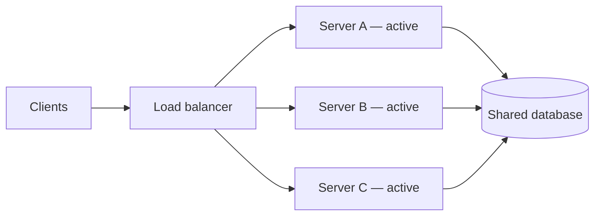

#### Request distribution

```text
Request 1 → A    Request 2 → B    Request 3 → C
Request 4 → A    Request 5 → B
```

**Round robin** — cycle through nodes.

**Least connections** — send to the least busy node.

**Weighted** — powerful machines get more share.

#### Session handling

Users may hit different servers on each request. Options:

| Approach | How it works |
|----------|--------------|
| **External session store** (Redis) | All nodes read/write session keys |
| **Stateless JWT** | No server-side session; token in cookie/header |
| **Sticky sessions** | LB pins user to one node — fragile if that node dies |

#### Failure scenario

```text
Before:  LB → A, B, C  (all serving)
B crashes → health check fails → LB → A, C only
After repair: B rejoins → LB → A, B, C again
```

---

### Walkthrough: three-node API cluster

An API runs three identical pods behind nginx. Traffic splits ~33% each. Pod B OOM-kills during a traffic spike:

1. Readiness probe fails; nginx marks B down within 10 seconds.
2. Requests redistribute ~50/50 to A and C — latency rises slightly, no hard outage.
3. HPA may add a fourth pod if CPU SLO threatened.
4. B restarts; passes readiness; returns to rotation.

---

### Active-active vs active-passive

| | Active-active | Active-passive |
|---|---------------|----------------|
| **Nodes serving** | All | One active, others standby |
| **Utilization** | High | Standby mostly idle |
| **Failover** | Redistribute load | Promote standby (brief gap) |
| **Data writes** | Multiple writers — need coordination | Single writer — simpler |
| **Complexity** | Higher | Lower |
| **Best for** | Scale + resilience | Simpler HA, strong consistency |

Active-passive is covered in [12.4](#124-active-passive). Active-active does **not** replace backups ([12.5](#125-backup-strategy)).

---

### Real-world example: global CDN origin

A video platform runs six origin servers across two AZs. Edge caches miss → origin load balances round-robin. Session state lives in DynamoDB; servers are stateless. AZ failure removes three origins; remaining three handle 2× load until HPA scales. Chaos tests monthly kill one origin pod during peak hours.

---


## 12.4 Active Passive

### Overview

Picture a pilot and co-pilot: one flies, the other monitors instruments and takes the controls instantly if the pilot becomes incapacitated. **Active-passive** HA assigns **one node to serve all traffic** while a **standby** stays synchronized and ready to promote on failure.

Technically, the active node handles reads and writes; the passive replica receives **continuous replication** (DB streaming, file sync, config push). **Failure detection** ([12.2](#122-failure-detection)) via health checks or heartbeat triggers **failover** — the passive becomes active. Simpler consistency than active-active (single writer) at the cost of **idle standby hardware** and a **short interruption** during promotion.

---

### What problem it fixes

You need HA without coordinating writes across multiple live nodes:

- Banking cores where one authoritative writer reduces conflict risk
- Legacy apps that assume single-node semantics
- Database primaries with hot standby replicas

Acceptable when failover takes seconds (not milliseconds) and standby capacity sitting idle is affordable.

---

### What it does

**Normal operation** — all traffic → active node; passive stays in sync.

**Replication** — database WAL shipping, storage mirroring, or periodic state copy.

**Failover** — active fails → passive promoted → traffic redirected.

**Failback** — repaired old primary re-syncs and becomes passive again.

---

### How it works — replication and promotion


#### Failover sequence

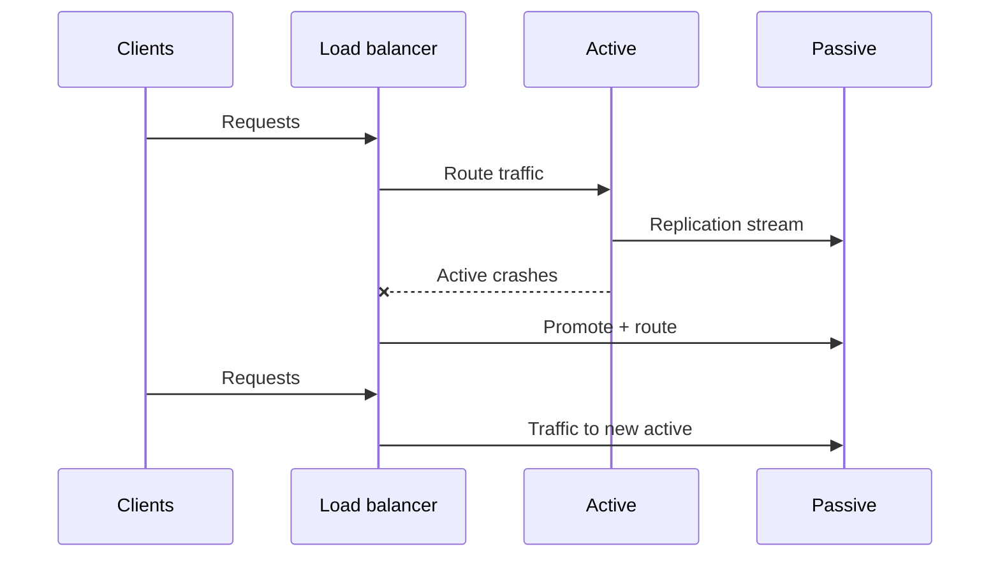

```text
1. Health check / heartbeat detects active failure
2. LB or cluster manager stops routing to active
3. Passive promoted (may require fencing old active)
4. DNS/LB points to new active
5. Clients retry; service resumes (RTO window)
```

Replication lag at failover moment defines actual **RPO** ([12.7](#127-rpo)).

---

### Walkthrough: Postgres primary with standby

1. Primary serves reads/writes; synchronous standby in another AZ.
2. Primary AZ network partition at 14:00 — primary isolated but still running.
3. **Fencing** (STONITH or cloud API stop) kills isolated primary to prevent split-brain.
4. Standby promotes at 14:01; application connection string updates via DNS or service discovery.
5. Users see ~60 seconds of errors; business RTO target is 5 minutes — met.
6. Old primary rejoins as replica after partition heals.

---

### Active-passive vs active-active

| | Active-passive | Active-active |
|---|----------------|---------------|
| **Write path** | Single primary | Multiple nodes (coordination needed) |
| **Standby use** | Idle until failover | Always serving |
| **Failover gap** | Seconds typical | Near zero (redistribute) |
| **Split-brain risk** | High without fencing | Lower for reads; writes need care |
| **Cost efficiency** | Lower (idle standby) | Higher utilization |

---

### Real-world example: internal ERP on active-passive VMs

A company runs its ERP on two VMs: active in DC1, passive in DC2 with hourly storage replication plus continuous DB log shipping. Quarterly failover drill promotes DC2, runs smoke tests, fails back. Last real failure: disk corruption on active; promotion completed in 4 minutes; RPO was 12 seconds of log lag.

---


## 12.5 Backup Strategy

### Overview

Everyone knows to photocopy important documents before a meeting — if the original coffee-spills, the copy saves the day. A **backup strategy** is the IT version: planned copies of data, stored safely, kept long enough, and **tested** so you can actually get them back ([12.6](#126-restore-strategy)).

Technically, it defines **what** to copy (databases, files, configs), **how** (full, incremental, differential), **where** (local, remote, cloud), **how often**, and **retention**. Backup frequency caps your **RPO** ([12.7](#127-rpo)) — hourly backups mean up to an hour of data loss unless replication also runs.

---

### What problem it fixes

Data loss sources are everywhere:

- Hardware failure, accidental `DELETE`, bad deploy, ransomware, site disaster
- "We had backups" that were never restorable

Without a strategy, recovery is ad hoc, slow, and often impossible. With one, recovery becomes a **repeatable procedure** with known time and data-loss bounds.

---

### What it does

Creates **point-in-time copies** of data independent of the primary system.

**Schedules** automated backup jobs.

**Retains** copies per policy (30 daily, 12 monthly, etc.).

**Protects** copies (encryption, immutability, off-site separation).

Does **not** by itself restore service — that is [12.6 Restore Strategy](#126-restore-strategy).

---

### How it works — backup types and the 3-2-1 rule

#### Full, incremental, differential

| Type | What is copied | Backup speed | Restore chain |
|------|----------------|--------------|---------------|
| **Full** | Everything | Slowest, largest | Single backup |
| **Incremental** | Changes since last backup of any type | Fastest, smallest | Full + every incremental since |
| **Differential** | Changes since last full | Medium | Full + latest differential only |

```text
Monday:    FULL
Tuesday:   INCR (since Mon)
Wednesday: INCR (since Tue)
Thursday:  INCR (since Wed)

Restore Thu: FULL + Mon_incr + Tue_incr + Wed_incr

---
Monday:    FULL
Tue–Thu:   DIFF (all changes since Monday)

Restore Thu: FULL + Thu_diff only
```

#### 3-2-1 rule

```text
3 copies of data (1 production + 2 backups)
2 different media types (e.g. disk + object storage)
1 copy off-site (different building or cloud region)
```

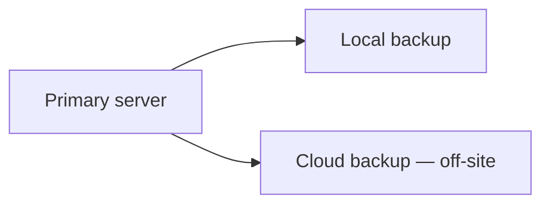

#### Storage locations

| Location | Pros | Cons |
|----------|------|------|
| **Local NAS / disk** | Fast backup and restore | Lost in same fire/flood as primary |
| **Remote site** | Geographic separation | Network-dependent restore |
| **Cloud object storage** | Durable, scalable, cheap | Egress cost; needs internet |

Encrypt backups at rest and in transit; use **immutable** storage (WORM, S3 Object Lock) against ransomware.

---

### Walkthrough: e-commerce database schedule

```text
Sunday 02:00  — FULL backup to S3
Hourly        — INCREMENTAL to S3
Daily         — sync copy to second cloud region (off-site)
Retention     — 7 daily, 4 weekly, 12 monthly fulls
```

Monday 11:00 corruption discovered:

- Latest full: Sunday 02:00
- Latest incremental: Monday 10:00
- **Worst-case data loss if restored to 10:00 incr:** 1 hour (drives RPO discussion in [12.7](#127-rpo))

---

### Backup type comparison

| | Full | Incremental | Differential |
|---|------|-------------|--------------|
| **Storage growth** | High per job | Lowest | Grows until next full |
| **Restore time** | Fastest | Slowest (long chain) | Medium |
| **Typical use** | Weekly anchor | Frequent small deltas | Middle ground |

---

### Real-world example: SaaS tenant data

A multi-tenant SaaS runs Postgres with nightly full pg_dump to S3, continuous WAL archiving for point-in-time recovery (PITR), and cross-region replication of the WAL bucket. Ransomware playbook: restore from immutable S3 copy to a clean VPC; PITR to one minute before attack. Restore drill runs monthly — not just backup job success metrics.

---


## 12.6 Restore Strategy

### Overview

Having a fire extinguisher is not the same as knowing how to use it under smoke and stress. A **restore strategy** is the practiced playbook for turning backups ([12.5](#125-backup-strategy)) back into a running system — who does what, in what order, with what verification — so recovery time is predictable.

Technically, it covers **restore type** (full system, file-level, database PITR, bare metal), **restore chain** (which backups to apply in sequence), and **validation** before resuming traffic. Restore duration directly bounds **RTO** ([12.8](#128-rto)); the age of the restored data bounds **RPO** ([12.7](#127-rpo)).

---

### What problem it fixes

Untested backups fail when needed:

- Incrementals restored out of order → corrupt database
- Team discovers restore takes 8 hours, not the assumed 30 minutes
- Production traffic resumes before data integrity checks complete

A restore strategy turns "we have backups" into "we can recover within RTO to a point within RPO."

---

### What it does

**Identifies** the correct backup set for the failure.

**Restores** data and configuration to a clean target (same or new hardware).

**Verifies** integrity — row counts, checksums, app smoke tests.

**Resumes** operations or fails over DNS/traffic to the recovered environment.

---

### How it works — restore types and chains

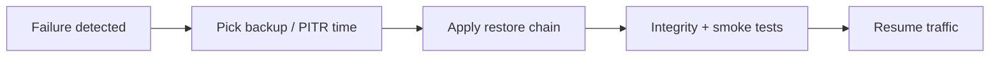

#### Restore types

| Type | Scope | When |
|------|-------|------|
| **Full system** | OS + apps + data | Total server loss |
| **File-level** | Selected files/folders | Accidental delete |
| **Database** | Whole DB or tables | Corruption, bad migration |
| **Bare metal** | Image to new hardware | Dead machine |
| **PITR** | DB to exact timestamp | Need minimal data loss |

#### Incremental restore chain

```text
Failure: Wednesday 10:00

Restore order:
  1. Sunday FULL
  2. Monday INCREMENTAL
  3. Tuesday INCREMENTAL
  4. Wednesday INCREMENTAL (if exists before 10:00)

Skip none. Order matters.
```

#### Differential restore chain

```text
  1. Sunday FULL
  2. Latest DIFFERENTIAL (Wednesday AM)
```

---

### Walkthrough: banking DB corruption on Wednesday

```text
10:00 AM — DBA notices corrupted index on primary DB
10:05 AM — incident declared; writes stopped
10:10 AM — restore to staging: Sunday full + Mon/Tue/Wed incrementals
10:35 AM — consistency checks pass; row counts match expectations
10:45 AM — application pointed to restored DB; read-only verification
11:00 AM — full traffic resumed

Total downtime: 60 minutes (compare to RTO target)
Data loss: changes between 09:00 incremental and 10:00 failure = 1 hour (actual RPO)
```

---

### Factors that affect restore time

Backup size · storage I/O · network bandwidth · number of incremental layers · integrity checks · whether runbooks are current · staff familiarity from drills

---

### Real-world example: accidental table drop

Engineer runs `DROP TABLE orders` on production. Within 5 minutes writes freeze. Team uses Postgres PITR to 2 minutes before the drop — restores to a side instance, validates row count, swaps DNS. Total outage: 22 minutes. Without PITR, last night's full backup would have lost a full business day (RPO = 24 hours).

---

## 12.7 RPO

### Overview

If your laptop crashes, the question is: "How much work since my last save can I afford to lose?" **Recovery Point Objective (RPO)** is that question at company scale — the **maximum acceptable data loss**, measured as time: "We can lose at most 5 minutes of writes."

Technically, RPO is a **business target**, not a backup feature. It drives architecture: RPO of 24 hours → daily backups may suffice. RPO of 5 minutes → hourly backups are insufficient; you need continuous replication or WAL archiving. RPO answers *how far back* you recover; **RTO** ([12.8](#128-rto)) answers *how long users wait*.

---

### What problem it fixes

Teams argue about backup frequency without a shared goal. Executives say "we cannot lose data"; engineering hears "run backups nightly" — a mismatch.

RPO makes the trade-off explicit:

- Tighter RPO → more replication, more cost, more complexity
- Looser RPO → cheaper, simpler, more loss acceptable

It aligns product, legal, and infrastructure on one number per service tier.

---

### What it means

```text
RPO = maximum acceptable age of data at recovery time
```

**Not** "how often we backup" — that is a *means* to achieve RPO.

**Not** RTO — downtime is separate.

If RPO = 1 hour and the last recoverable point is 45 minutes before failure, you met RPO for that incident.

---

### How to achieve it — techniques by target

| Target RPO | Typical techniques |
|------------|-------------------|
| **24 hours** | Daily full backups ([12.5](#125-backup-strategy)) |
| **1 hour** | Hourly incrementals or snapshots |
| **5 minutes** | Frequent snapshots + WAL/log shipping |
| **Near zero** | Synchronous replication to standby |

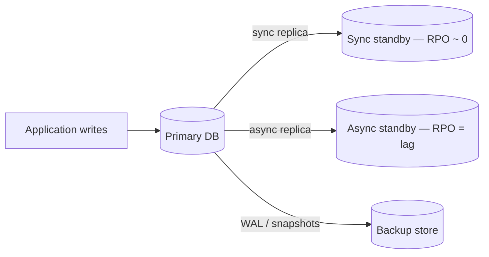

**Replication lag** is the operational metric for async RPO. Monitor it as an SLO.

---

### Walkthrough: hourly backup vs actual crash

```text
09:00 AM — backup completes
10:00 AM — backup completes
10:30 AM — server crash

Latest recoverable point: 10:00 AM backup
Data lost: 10:00 → 10:30 = 30 minutes

If business RPO = 1 hour  → incident met target
If business RPO = 5 minutes → failed; need continuous replication
```

**Designed RPO vs actual loss:** the backup schedule sets the *designed* ceiling; replication lag sets the *actual* ceiling for async setups.

---

### RPO by system tier

| System | Typical RPO | Why |
|--------|-------------|-----|
| **Core banking ledger** | ~0 (sync replication) | Transactions cannot vanish |
| **E-commerce orders** | 1–5 minutes | Recent orders have revenue impact |
| **Social feed** | 15–60 minutes | Regenerable / eventually consistent |
| **Analytics warehouse** | 24 hours | Rebuildable from sources |

Define RPO **per tier**, not one number for the whole company.

---

### RPO vs RTO

| | RPO | RTO |
|---|-----|-----|
| **Measures** | Data loss (time) | Downtime (time) |
| **Question** | How far back? | How long until up? |
| **Driven by** | Backup/replication design | HA, restore speed, DR ([12.9](#129-disaster-recovery)) |
| **Independent?** | Yes — low RPO + high RTO is common | Yes |

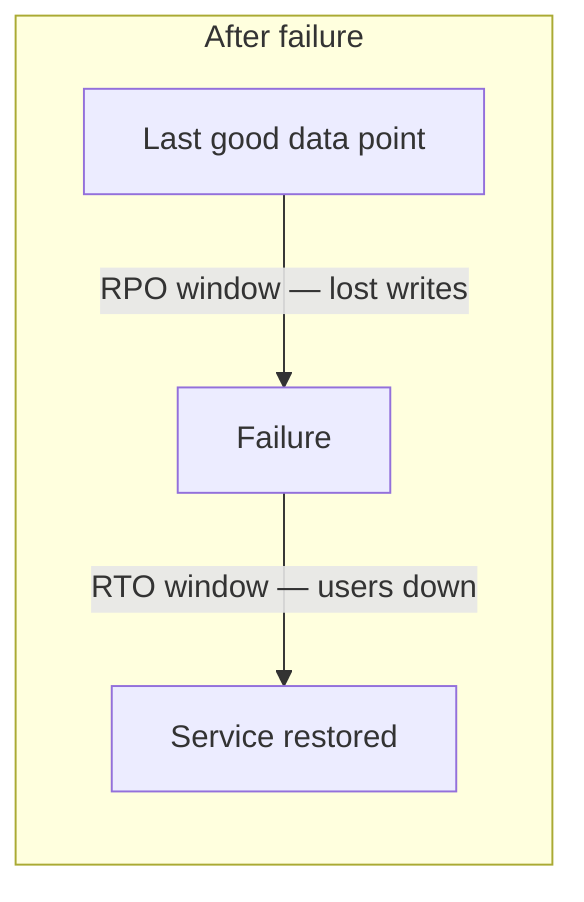

---

### Real-world example: payment service tiering

A fintech sets RPO = 0 for the ledger (sync replica in second AZ), RPO = 15 minutes for audit logs (async + S3), RPO = 24 hours for reporting DB (nightly export). Incident: async replica lag spiked to 20 minutes — audit tier breached RPO; automated page fired before customer impact.

---


## 12.8 RTO

### Overview

RPO asks how much data you can lose; **Recovery Time Objective (RTO)** asks how long customers can wait before the service is back. If your store is offline, every minute costs money and reputation — RTO is the agreed ceiling: "We must be live again within 30 minutes."

Technically, RTO is the **maximum acceptable downtime** after a failure. It drives investment in HA ([12.1](#121-high-availability)), automated failover ([12.4](#124-active-passive)), restore automation ([12.6](#126-restore-strategy)), and DR site warmth ([12.9](#129-disaster-recovery)). Meeting RTO requires measuring **end-to-end** recovery in drills, not summing optimistic step estimates.

---

### What problem it fixes

Without RTO, teams discover recovery takes hours only during a real outage. Sales promises "always on"; ops has never tested promotion under load.

RTO forces:

- Documented runbooks with time budgets
- Automation instead of manual heroics
- Regular drills that clock wall-clock recovery

---

### What it means

```text
RTO = maximum acceptable time from failure to restored service
```

Clock starts when users are impacted (or failure detected — define this in your policy).

Clock stops when the service meets SLO again (not merely when the first process starts).

---

### How to achieve it — techniques by target

| Target RTO | Typical techniques |
|------------|-------------------|
| **< 1 minute** | Active-active + auto LB drain, multi-AZ |
| **1–15 minutes** | Active-passive auto-promotion, health-checked failover |
| **1–4 hours** | Warm standby DR, scripted restore |
| **24+ hours** | Cold site, restore from backup tapes/cloud |

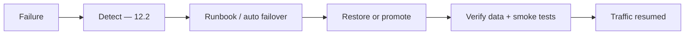

Each step consumes part of the RTO budget.

---

### Walkthrough: active-passive banking failover

```text
Business RTO: 10 minutes

10:00:00 — primary app server fails
10:00:15 — health check marks unhealthy (3 × 5s probes)
10:00:30 — LB stops routing to primary
10:01:00 — standby promoted, app starts on passive
10:04:00 — smoke tests pass (login, balance read)
10:05:00 — DNS TTL expired; all clients on new active

Total: 5 minutes — RTO met
```

If smoke tests had been skipped and bad data served, "recovery" would be a false pass.

---

### RTO by system tier

| System | Typical RTO | Why |
|--------|-------------|-----|
| **Payment API** | 1–5 minutes | Direct revenue loss per minute |
| **E-commerce storefront** | 15–60 minutes | High cost; some buffer exists |
| **Internal HR portal** | 4–24 hours | Lower customer visibility |
| **Batch reporting** | Next business day | Not real-time |

---

### Common RTO mistakes

| Mistake | Reality |
|---------|---------|
| Runbook never drilled | First real failover takes 3× longer |
| "Up" = process started | Users still see errors until data verified |
| Ignoring DNS TTL | 5-minute RTO + 5-minute TTL = 10 minutes for some clients |
| Counting only failover | Restore-from-backup RTO includes download + apply time |

---

### Real-world example: regional cloud outage

Multi-region SaaS with hot standby in second region. Primary region fails at 16:00. Route 53 health checks fail at 16:01; traffic shifts to secondary by 16:03. RTO target: 5 minutes — met. Secondary was running at reduced capacity (warm standby); autoscaler adds capacity by 16:10. Post-incident: drill confirmed DNS and connection pool warmup were on the critical path.

---


## 12.9 Disaster Recovery

### Overview

High availability is like spare tires — you fix a flat and keep driving. **Disaster recovery (DR)** is the plan for when the whole car is totaled: fire, flood, ransomware encryption, or an entire cloud region offline for hours. You need a second place to run and data copies that survived the disaster.

Technically, DR restores **applications, data, and infrastructure** after catastrophic failure, within **RPO** ([12.7](#127-rpo)) and **RTO** ([12.8](#128-rto)) targets. It complements HA ([12.1](#121-high-availability)): HA handles a dead server; DR handles a dead data center. Strategies range from **backup-and-restore** (cheap, slow) to **hot multi-region** (expensive, fast).

---

### What problem it fixes

HA in one building does not help when:

- The building floods or burns
- A regional cloud provider has a prolonged outage
- Ransomware encrypts production and local backups
- Operator error wipes an entire environment

DR provides **geographic separation** and **tested recovery** at another site.

---

### What it does

**Detects** site-level failure (not just one host).

**Activates** a DR plan — manual declaration or automated failover.

**Restores or fails over** to a secondary site with recoverable data.

**Redirects** users (DNS, global load balancer, BGP).

**Validates** RPO/RTO before declaring "recovered."

---

### How it works — sites, strategies, and recovery paths

#### DR site warmth

| Site type | What runs normally | Typical RTO | Cost |
|-----------|-------------------|-------------|------|
| **Cold** | Empty racks / restore on demand | Days | Lowest |
| **Warm** | Partial infra + replicated data | Hours | Medium |
| **Hot** | Full parallel stack, sync/async replication | Minutes | Highest |

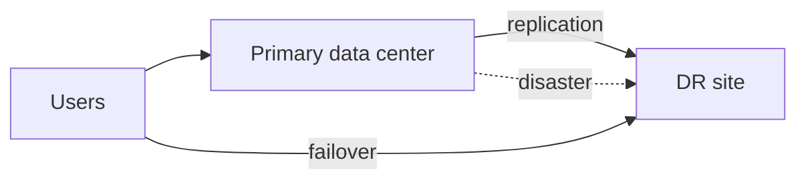

#### Common DR strategies

| Strategy | Idea | RTO / RPO trade-off |
|----------|------|---------------------|
| **Backup and restore** | Restore backups at DR site | Loosest RTO/RPO |
| **Pilot light** | Minimal core always on (DB replica); scale apps on disaster | Medium |
| **Warm standby** | Reduced capacity stack always running | Faster RTO |
| **Hot site / multi-region** | Full active stack in two regions | Tightest RTO/RPO |
| **Cloud DR** | Cross-region replication, managed snapshots | Flexible, ops-heavy |

#### Recovery paths

**From replication:**

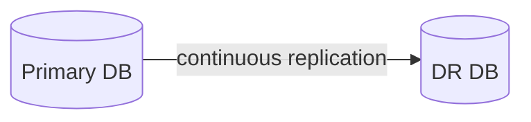

RPO = replication lag; RTO = DNS + app startup at DR.

**From backups:**

```text
Off-site backup store → restore to DR hardware → validate → cutover
```

RPO = backup age; RTO = restore duration ([12.6](#126-restore-strategy)).

---

### Walkthrough: data center fire

```text
Normal:     users → primary DC; async replication to DR DC 200 km away

02:00 AM — fire destroys primary DC
02:05 AM — monitoring loses all primary heartbeats
02:10 AM — incident commander declares disaster
02:15 AM — promote DR database; scale DR app tier
02:25 AM — global LB points to DR region
02:40 AM — smoke tests pass; customer comms sent

RTO achieved: 40 minutes (target 60)
RPO: 2 minutes replication lag at failure (target 5)
```

---

### HA vs disaster recovery

| | HA | DR |
|---|-----|-----|
| **Failure scope** | Server, disk, rack | Site, region, cyber event |
| **Recovery** | Seconds–minutes | Minutes–hours (strategy-dependent) |
| **Location** | Same site / AZ | Different site / region |
| **Cost** | Moderate redundancy | Significant duplicate infra |

You need **both** for production-grade reliability.

---

### Real-world example: retailer black Friday DR drill

Retailer runs hot standby in second AWS region for checkout API. Annual drill: simulate primary region isolation with fault injection ([12.11](#1211-fault-injection)), fail over Route 53, run synthetic purchases against DR. Last drill: RTO 8 minutes, RPO 0 (sync replication). Found bug: payment webhook URLs hardcoded to primary region — fixed before real season.

---


## 12.10 Chaos Engineering

### Overview

Pilots train in simulators before real emergencies. **Chaos engineering** is the production reliability simulator: you **deliberately break things on purpose** — kill a server, add latency, isolate a zone — to learn whether the system actually survives before customers find out the hard way.

Technically, it is a disciplined experiment loop: define **steady state** (latency, error rate, throughput), form a **hypothesis** ("if one pod dies, SLO holds"), **inject** a controlled fault, **observe**, and **fix** gaps. Pioneered at Netflix (Chaos Monkey); tools include AWS FIS, Gremlin, Litmus. Distinct from ad-hoc fault injection ([12.11](#1211-fault-injection)) in scope — chaos tests **system-level** resilience; fault injection targets **specific components**.

---

### What problem it fixes

Redundant architecture on paper often fails in practice:

- Standby never promoted in a drill → fails in production
- Timeouts not tuned → cascading failure under latency
- DR runbook references decommissioned servers

Chaos finds **unknown unknowns** — dependency failures, alert gaps, runbook rot — in controlled conditions with blast-radius limits.

---

### What it does

Runs **controlled failure experiments** against production or production-like environments.

**Validates** HA, detection, failover, DR, and monitoring.

**Produces evidence** that recovery works — or tickets to fix what does not.

Does **not** replace unit tests, backups, or DR planning — it **stress-tests** them.

---

### How it works — the experiment loop

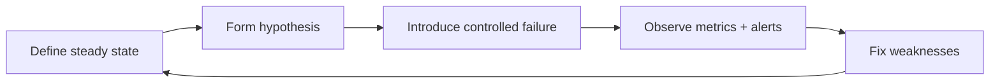

#### Step-by-step

```text
1. Steady state: p99 latency < 200ms, error rate < 0.1%
2. Hypothesis: "Killing one of three API pods keeps SLO"
3. Experiment: terminate random pod during business hours
4. Observe: LB drains in 8s; error spike 0.05% for 12s; SLO held
5. Improve: none — or file ticket if SLO breached
```

#### Blast radius controls

- Start in staging; graduate to prod with small scope
- Run during low-traffic windows initially
- **Abort conditions** — auto-stop if error rate > 5%
- One fault at a time until maturity increases

---

### Walkthrough: server failure experiment

**Before:**

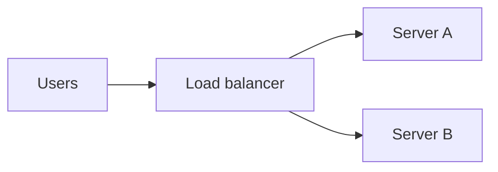

**Experiment:** terminate Server A.

**Expected:** detection ([12.2](#122-failure-detection)) removes A within probe interval; B absorbs traffic; no SLO breach.

**Observed failure mode (example):** sticky sessions tied to A → 15% users logged out. **Fix:** externalize sessions to Redis.

---

### Chaos engineering vs traditional testing

| | Traditional testing | Chaos engineering |
|---|---------------------|-------------------|
| **Environment** | Staging, scripted cases | Often production, realistic load |
| **Failures** | Expected paths | Surprising combinations |
| **Goal** | Features correct | System survives faults |
| **Audience** | QA sign-off | SRE confidence |

---

### Real-world example: Netflix Chaos Monkey

Chaos Monkey randomly terminates production instances during business hours. Teams must build services that survive instance loss without manual intervention. Outcome: forced stateless apps, redundant dependencies, and automated replacement — culture of "everything fails all the time."

---

## 12.11 Fault Injection

### Overview

Chaos engineering kicks the whole system to see if it wobbles. **Fault injection** is the precision tool — you break **one specific thing**: delay database responses by 500ms, return HTTP 503 from one dependency, fill a disk to 99%. It answers "does *this* retry policy work?" not "does the whole datacenter survive?"

Technically, fault injection introduces **defined, scoped faults** (network, CPU, disk, process kill, API error) via tools (iptables, toxiproxy, eBPF, service meshes) or frameworks (Chaos Mesh fault types). It validates **error handling, timeouts, circuit breakers, and failover triggers** at component level. Pairs with chaos engineering ([12.10](#1210-chaos-engineering)): injection tests building blocks; chaos tests the assembled system.

---

### What problem it fixes

Code paths for failure are rarely exercised:

- Retry logic never tested under real latency
- Circuit breaker never opens because dependency never "failed" in test
- Failover script works on paper but not when DB port is blocked

Injection forces those paths to run in controlled conditions.

---

### What it does

**Defines** a fault (what, where, how long).

**Predicts** expected behavior (alert fires, retry 3×, then fail gracefully).

**Injects** the fault in staging or scoped production.

**Monitors** metrics, logs, traces during the window.

**Analyzes** pass/fail against prediction; files fixes.

---

### How it works — injection workflow

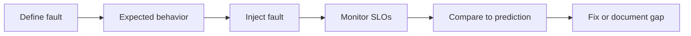

#### Fault categories

| Category | Examples | What you learn |
|----------|----------|----------------|
| **Network** | 500ms latency, 10% packet loss, partition | Timeout and retry tuning |
| **Process** | `kill -9`, OOM | Supervisor and LB behavior |
| **Storage** | Disk full, slow I/O | Graceful degradation |
| **Dependency** | DB connection refused, 503 from API | Circuit breaker, fallbacks |
| **Infrastructure** | CPU throttle, DNS failure | Autoscaling, caching |

---

### Walkthrough: database latency injection

```text
Hypothesis: "If Postgres p99 > 300ms for 60s, API returns 503
             and does NOT retry unbounded"

Setup:    toxiproxy adds 400ms latency to DB port on staging
Inject:   enable toxic for 2 minutes
Observe:  p99 API latency rises; circuit opens at 300ms;
          error rate 12%; no thread pool exhaustion
Result:   PASS — tune alert threshold from 500ms to 350ms
```

---

### Fault injection vs chaos engineering

| | Fault injection | Chaos engineering |
|---|-----------------|-------------------|
| **Scope** | Single component / fault type | Whole system / random failures |
| **Control** | Precise, repeatable | Broader, exploratory |
| **Example** | Add 200ms to Redis | Kill random AZ |
| **Best for** | Libraries, timeouts, breakers | Architecture, DR, culture |

Use both: injection during development and CI; chaos in staging/prod for holistic confidence.

---

### Real-world example: payment dependency drill

Before launch, team injects 100% failure on the fraud-scoring API in staging. Checkout should decline safely with user message, not hang or double-charge. Injection reveals missing timeout on HTTP client — 30s hang instead of 2s fail. Fixed before production; monthly regression injection in CI pipeline.

---

[<- Back to master index](../README.md)
