# 12. Reliability Engineering

> Status: **Documented**  -  MASTER reference depth for all sub-topics below.

[<- Back to master index](../README.md)

---

## Sub-topics

| # | Sub-topic | Status |
|---|-----------|--------|
| 12.1 | [High Availability](#121-high-availability) | Done |
| 12.2 | [Active Active](#122-active-active) | Done |
| 12.3 | [Active Passive](#123-active-passive) | Done |
| 12.4 | [RPO](#124-rpo) | Done |
| 12.5 | [RTO](#125-rto) | Done |
| 12.6 | [Disaster Recovery](#126-disaster-recovery) | Done |
| 12.7 | [Backup Strategy](#127-backup-strategy) | Done |
| 12.8 | [Restore Strategy](#128-restore-strategy) | Done |
| 12.9 | [Chaos Engineering](#129-chaos-engineering) | Done |
| 12.10 | [Fault Injection](#1210-fault-injection) | Done |


## Overview

Reliability engineering builds systems that survive failures - hardware, software, human, and regional - through redundancy, tested recovery paths, and deliberate experimentation. It connects business continuity (RPO/RTO) with operational practice (backups, failover, chaos).

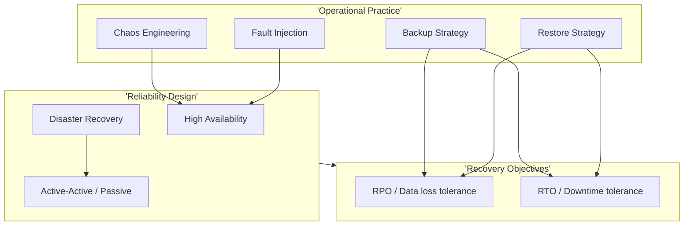

---


---

## 12.1 High Availability


### What is it

**High Availability (HA)** is an architecture that eliminates **single points of failure (SPOF)** so a service continues operating when individual components fail — through **redundancy**, **health checks**, and **automatic failover**.

HA is measured in **nines** — the percentage of uptime in a year:

| Availability | Downtime / year | Downtime / month | Typical tier |
|--------------|-----------------|------------------|--------------|
| **99%** (2 nines) | 3.65 days | 7.2 hours | Dev / internal tools |
| **99.9%** (3 nines) | 8.76 hours | 43.8 minutes | Standard SaaS |
| **99.95%** | 4.38 hours | 21.9 minutes | Business-critical |
| **99.99%** (4 nines) | 52.6 minutes | 4.4 minutes | Payments, core platform |
| **99.999%** (5 nines) | 5.26 minutes | 26 seconds | Telco, mission-critical |

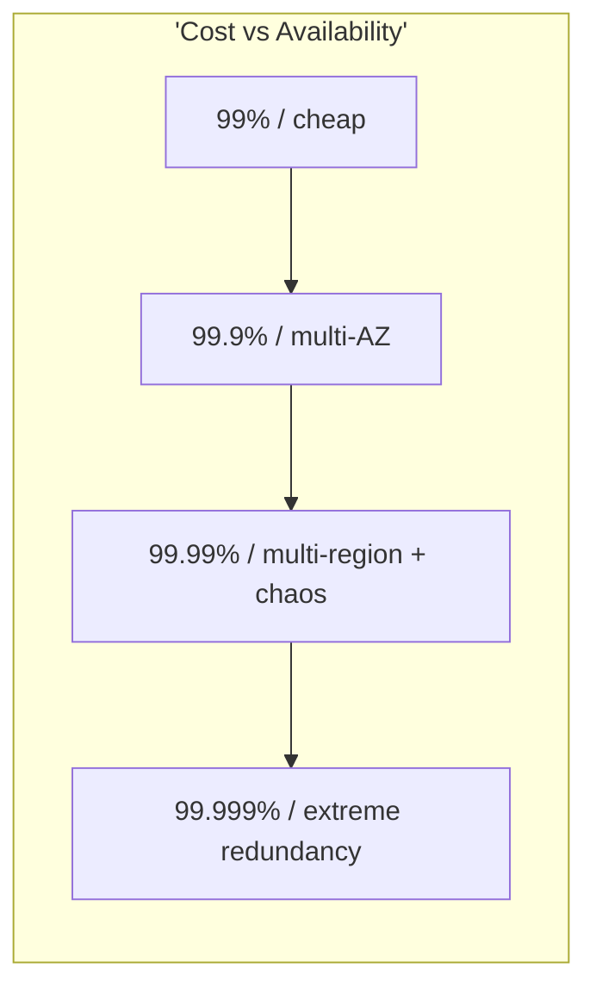

**HA ≠ Disaster Recovery:** HA survives *component* failure (server, AZ, pod); DR survives *catastrophic* failure (region loss, ransomware).

### Why it matters

Users and contracts expect near-continuous availability. Every minute of downtime has direct revenue and trust cost:

- **SLO contracts** — enterprise deals specify 99.9%+ with financial penalties
- **Cascading failures** — one SPOF can take down an entire dependency graph
- **Competitive trust** — reliability is a product feature, not an afterthought

Interview focus: calculate nines, identify SPOFs, and explain redundancy patterns (N+1, active-passive, quorum).

### How it works

**Eliminate SPOFs at every layer:**

| Layer | SPOF risk | HA pattern |
|-------|-----------|------------|
| **Compute** | Single server | N+1 instances behind load balancer |
| **Load balancer** | Single LB | Multi-AZ managed LB (ALB, GLB) |
| **Database** | Single primary | Primary + sync/async replica; automatic failover |
| **Cache** | Single Redis node | Redis Sentinel or Cluster mode |
| **Message broker** | Single broker | Kafka 3+ brokers, RabbitMQ quorum queues |
| **DNS** | Single provider | Secondary DNS, low TTL for failover |
| **AZ / datacenter** | Single AZ | Replicas spread across 2–3 availability zones |
| **Region** | Single region | Multi-region DR (active-passive or active-active) |

**Redundancy models:**

| Model | Description | Example |
|-------|-------------|---------|
| **N+1** | N units needed + 1 spare | 3 app servers need 2 → run 3 |
| **N+2** | Tolerate 2 simultaneous failures | Critical payment path |
| **2N** | Full duplicate stack | Active-active dual region |
| **Quorum** | Majority must agree (avoid split-brain) | etcd 3 nodes (tolerate 1 loss), Kafka ISR |

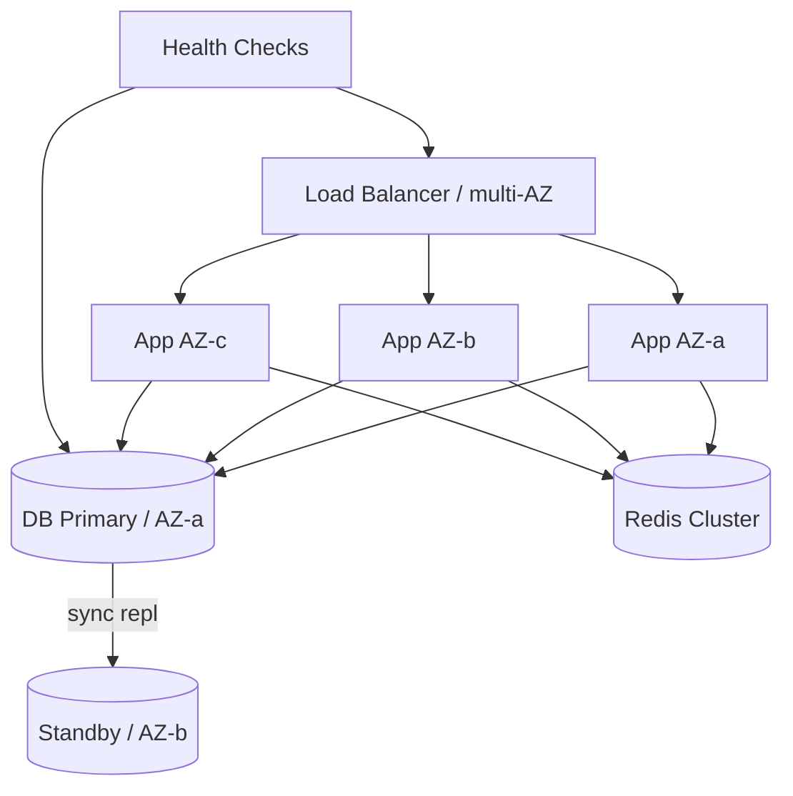

**Health check driven failover:**

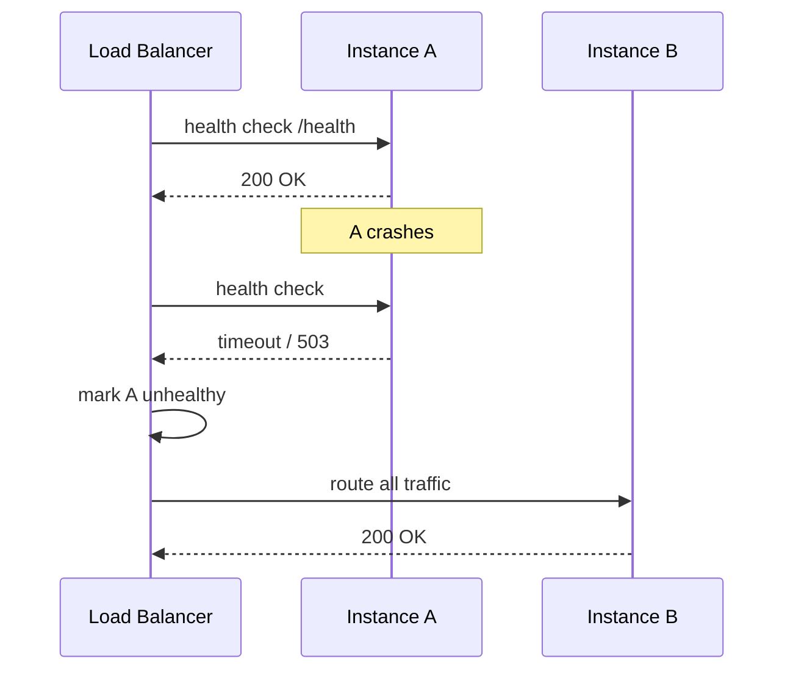

**SPOF audit checklist:**

| Question | If "yes" → SPOF |
|----------|-----------------|
| Only one instance of this service? | ✓ |
| Only one AZ for all replicas? | ✓ |
| Single database with no replica? | ✓ |
| Shared config store with no backup? | ✓ |
| One person holds all prod access? | ✓ (operational SPOF) |

### Diagram

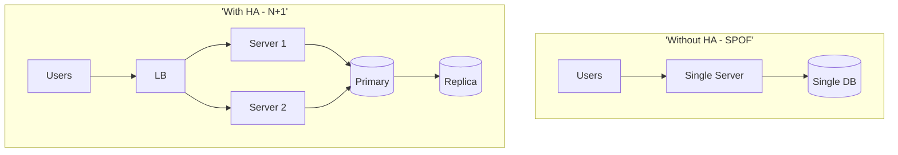

### Key details

| Topic | Detail |
|-------|--------|
| **Nines math** | 99.99% allows ~52 min downtime/year — budget error budget accordingly |
| **Error budget** | SRE: 100% − SLO = budget for releases, experiments, incidents |
| **Split-brain** | Two primaries without quorum → data corruption; use fencing/STONITH |
| **Cold standby** | Cheaper but higher RTO; warm/hot for lower RTO |
| **Chaos testing** | Regularly kill AZ/instance to prove HA works — not just on paper |
| **Stateful HA** | Harder than stateless; needs replication + leader election (Raft, Paxos) |

**Interview rapid-fire:**

| Question | Answer |
|----------|--------|
| 99.9% vs 99.99% downtime difference? | 8.76 hr/yr vs 52 min/yr — 10× stricter |
| What is a SPOF? | Component whose failure halts the entire service |
| How achieve 4 nines? | Multi-AZ, no SPOF, automated failover, tested runbooks, chaos engineering |
| HA vs DR? | HA = component failure; DR = region/catastrophe |
| Why quorum (3 nodes)? | Tolerate 1 failure while maintaining consensus majority |

### When to use

- **All production user-facing services** — default expectation
- **Stateful tiers** — DB, cache, queue with replication
- **Internal critical dependencies** — auth, payment, config services
- **Tiered approach** — not everything needs 5 nines; match nines to business impact

### Trade-offs

| Pros | Cons |
|------|------|
| Graceful component failure invisible to users | 2–3× resource cost for N+1 redundancy |
| Meets SLO/contractual commitments | Distributed state complexity (consistency, split-brain) |
| Builds user and stakeholder trust | Each redundancy layer adds operational surface |
| Enables safe deployments (rolling updates) | Diminishing returns above 4 nines — cost explodes |
| Foundation for chaos validation | Misconfigured failover can cause worse outages |

### References

- [AWS Well-Architected — Reliability](https://docs.aws.amazon.com/wellarchitected/latest/reliability-pillar/welcome.html)
- [Google SRE — Embracing Risk](https://sre.google/sre-book/embracing-risk/)
- [Availability calculator](https://uptime.is/)

---


2.2 Active Active


### What is it

Multiple sites or regions simultaneously serving live traffic with read-write capability - no idle standby waiting for failover.

### Why it matters

Active-active minimizes RTO (traffic already routed) and can place users near nearest region. Required for global low-latency and highest availability tiers.

### How it works

Global load balancer geo-routes users. Data replicated multi-master or partitioned by region. Conflict resolution for concurrent writes (CRDTs, LWW, application merge). Each region runs full stack. Failure of one region sheds traffic to others automatically.

### Diagram  -  Active-Active

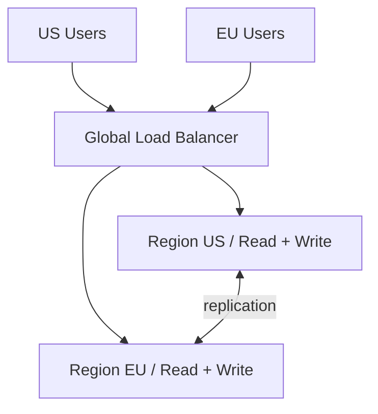

### Key details

- Data consistency is the hard problem
- Prefer partition-by-region over multi-master when possible
- DNS/global anycast for fast traffic shift
- Test partial region failure, not only full outage

### When to use

- Global products needing local latency
- RTO near zero requirements
- Scale beyond single-region capacity

### Trade-offs

| Pros | Cons |
|------|------|
| Lowest RTO/RPO potential | Write conflict complexity |
| Geographic performance | 2×+ operational cost |
| No cold standby waste | Hard to debug cross-region |

### References

- [Martin Kleppmann  -  multi-datacenter](https://martin.kleppmann.com/2015/05/11/please-stop-calling-databases-cp-or-ap.html)

---


2.3 Active Passive


### What is it

Primary site handles all production traffic; secondary (passive) site stands ready with replicated data, activated only on primary failure.

### Why it matters

Simpler than active-active with lower cost than full dual-live stacks. Common DR pattern for enterprise tiers with minutes-to-hours RTO.

### How it works

Primary serves traffic; async replication to standby. On failure, promote replica, start standby apps, update DNS/LB to passive site. Variants: **cold** (provision on fail), **warm** (apps running, no traffic), **hot standby** (sync repl, fast promote).

### Diagram  -  Active-Passive

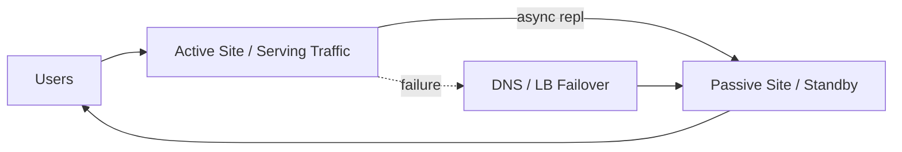

### Key details

- Replication lag = RPO
- Failover time = RTO (DNS TTL matters)
- Regular failover drills; passive drift is common
- Split-brain prevention: fencing, STONITH

### When to use

- DR with moderate RTO (15 min  -  4 hr)
- Cost-sensitive HA across regions
- Legacy apps not designed multi-active

### Trade-offs

| Pros | Cons |
|------|------|
| Simpler consistency | Standby resources idle |
| Lower cost than active-active | Failover event causes blip |
| Well-understood pattern | Replication lag data loss |

### References

- [AWS DR patterns](https://docs.aws.amazon.com/whitepapers/latest/disaster-recovery-workloads-on-aws/disaster-recovery-options-in-the-cloud.html)

---


2.4 RPO


### What is it

**Recovery Point Objective (RPO)** is the maximum acceptable **data loss** measured in time — "how far back in time can we rewind after a failure?"

| RPO target | Meaning | Data loss on failure |
|------------|---------|----------------------|
| **RPO = 0** | Zero data loss | No committed writes lost |
| **RPO = 15 min** | Lose at most 15 min of writes | Restore to state ≤ 15 min ago |
| **RPO = 24 hr** | Daily backup tolerance | Lose up to 1 day of changes |

RPO answers: *"If the database dies right now, how much data are we willing to lose?"*

It is a **business decision** that engineering implements through replication, backups, and durability architecture.

### Why it matters

RPO drives infrastructure cost and complexity:

| Lower RPO | Engineering requirement | Cost impact |
|-----------|------------------------|-------------|
| **0** | Synchronous replication, quorum writes | Highest latency + infra cost |
| **< 1 min** | Async replication with sub-minute lag monitoring | Dedicated replicas, cross-AZ fiber |
| **15–60 min** | Frequent WAL shipping / incremental backups | Moderate |
| **24 hr** | Daily snapshots | Cheapest |

Misaligned RPO causes either **over-engineering** (paying for sync repl on analytics) or **unacceptable data loss** (daily backups on payment ledger).

### How it works

**RPO timeline — failure visualization:**

```mermaid
timeline
    title RPO = 15 minutes (async replication)
    section Normal operation
        Last durable snapshot : 10:00
        Continuous writes : 10:01 - 10:14
    section Failure at 10:15
        Unreplicated writes LOST : 10:00 - 10:15 window
        Recoverable data : up to 10:00 snapshot + partial WAL
```

**How architecture maps to RPO:**

| Mechanism | Typical RPO | How it works |
|-----------|-------------|--------------|
| **Synchronous replication** | 0 | Primary waits for replica ACK before commit |
| **Async replication** | Replication lag (seconds–minutes) | Commits locally; replicates after |
| **WAL / binlog shipping** | Shipping interval | Ship transaction log every N seconds |
| **Point-in-time recovery (PITR)** | Backup frequency + log retention | Restore snapshot + replay logs to timestamp |
| **Hourly snapshots** | Up to 1 hour | Crash-consistent image every hour |
| **Daily backups** | Up to 24 hours | Batch backup job overnight |

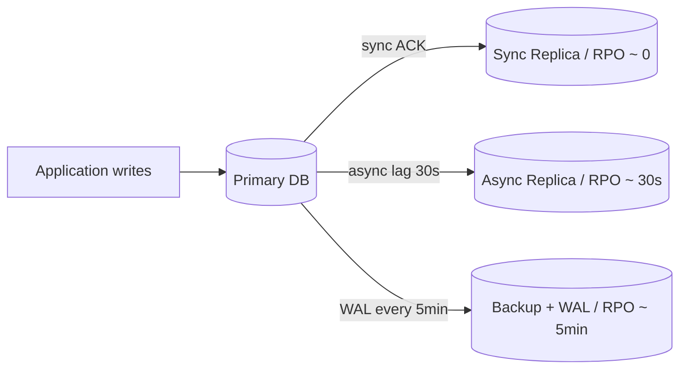

**Measuring actual RPO (not just target):**

| Metric | Alert when |
|--------|------------|
| `replication_lag_seconds` | Lag > 50% of RPO target |
| `last_successful_backup_timestamp` | Age > RPO target |
| `wal_archive_gap` | Missing WAL segments |

**Example — tiered RPO by service:**

| Service | Tier | RPO | Implementation |
|---------|------|-----|----------------|
| Payment ledger | Tier 1 | 0 | Sync repl + multi-AZ RDS |
| User profiles | Tier 2 | 15 min | Async repl + PITR |
| Analytics warehouse | Tier 3 | 24 hr | Daily snapshot to S3 |
| Session cache | Tier 4 | N/A (ephemeral) | Rebuild from source |

### Diagram

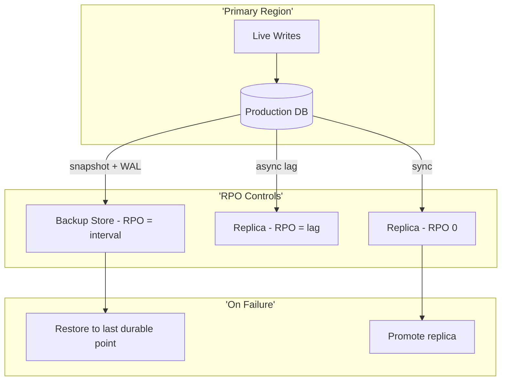

### Key details

| Topic | Detail |
|-------|--------|
| **RPO ≠ backup frequency alone** | Need replication + PITR for low RPO; backups alone have restore-time gap |
| **Async lag = practical RPO** | Monitor lag continuously; failover at lag=10min means 10min data loss |
| **Logical corruption** | Ransomware/bug may require restore to *older* point — retain multiple PITR windows |
| **Per-service RPO** | Document in service catalog; not one-size-fits-all |
| **RPO + RTO together** | Low RPO with slow restore still hurts users — optimize both |
| **Cross-region** | Async cross-region repl adds lag → higher RPO unless sync (latency cost) |

**Interview rapid-fire:**

| Question | Answer |
|----------|--------|
| RPO vs RTO? | RPO = data loss tolerance (time); RTO = downtime tolerance (time) |
| RPO = 0 how? | Sync replication; write not ack'd until replica confirms |
| Daily backup RPO? | Up to 24 hours of lost writes since last backup |
| Does caching affect RPO? | Ephemeral cache loss is acceptable if rebuilt; don't count as durable data |
| Replication lag 5 min, RPO 1 min? | **Non-compliant** — actual RPO is 5 min; alert and fix |

### When to use

- **DR architecture decisions** — choose sync vs async replication
- **SLA / contract negotiations** — translate business risk to numbers
- **Backup policy design** — snapshot frequency, WAL retention
- **Incident classification** — "we lost 20 min of data" → measure against RPO

### Trade-offs

| Lower RPO | Higher RPO |
|-----------|------------|
| Minimal data loss on failure | Cheaper, simpler architecture |
| Sync repl adds write latency | Acceptable for non-critical data |
| Multi-region replication cost | Single-region may suffice |
| Complex monitoring and failover | Larger data loss window on disaster |
| Required for financial/regulated data | Fine for derived/rebuildable data |

### References

- [IBM RPO/RTO explainer](https://www.ibm.com/topics/rpo-rto)
- [AWS DR whitepaper — RPO/RTO](https://docs.aws.amazon.com/whitepapers/latest/disaster-recovery-workloads-on-aws/disaster-recovery-options-in-the-cloud.html)
- [Google SRE — Data Integrity](https://sre.google/sre-book/data-integrity/)

---


2.5 RTO


### What is it

**Recovery Time Objective (RTO)** is the maximum acceptable **downtime** — the time from failure detection until the service is restored to an operational level that can handle production traffic.

| RTO target | Meaning | Typical architecture |
|------------|---------|----------------------|
| **RTO ≈ 0** | Near-instant failover | Active-active multi-region |
| **RTO < 5 min** | Minutes of outage | Hot standby, automated DNS failover |
| **RTO < 1 hr** | Hour of outage | Warm standby, scripted runbooks |
| **RTO < 4 hr** | Half-day recovery | Cold standby, manual restore |
| **RTO < 24 hr** | Next-day recovery | Backup-restore from snapshots |

RTO answers: *"How long can users be without the service?"*

**RPO vs RTO — interview distinction:**

| Metric | Measures | Question answered |
|--------|----------|-------------------|
| **RPO** | Data loss window | "How much data can we lose?" |
| **RTO** | Downtime window | "How long until we're back online?" |

A system can have **RPO = 0** (no data loss) but **RTO = 2 hr** (slow failover). Both must be designed independently.

### Why it matters

RTO determines standby investment and automation depth:

| RTO requirement | What you must build |
|-----------------|---------------------|
| Minutes | Pre-provisioned infra, automated failover, health-checked cutover |
| Hours | Warm standby, documented runbooks, on-call trained on restore |
| Days | Cold DR site, backup tapes, manual provisioning acceptable |

Underestimating RTO leads to **contract breaches**, **revenue loss**, and **incident escalation** when manual recovery takes longer than promised.

### How it works

**RTO budget breakdown — every minute counts:**

```mermaid
gantt
    title RTO Budget Example (target: 60 minutes)
    dateFormat X
    axisFormat %M min

    section Detect
    Monitoring alert fires     :0, 3
    On-call acknowledges       :3, 5
    section Decide
    Triage + declare incident  :5, 10
    Choose failover vs restore :10, 15
    section Recover
    Provision infra (if needed):15, 20
    Restore database from repl :20, 35
    Deploy application tier    :35, 50
    section Validate
    Smoke tests + canary       :50, 58
    DNS / LB cutover           :58, 60
```

**RTO phases and optimization:**

| Phase | Typical duration | How to shrink RTO |
|-------|------------------|-------------------|
| **Detection** | 1–15 min | Better alerting, SLO burn alerts, synthetic probes |
| **Triage** | 5–30 min | Runbooks, severity matrix, pre-authorized failover |
| **Decision** | 5–60 min | Pre-defined failover triggers; avoid debate during outage |
| **Provision** | 0–120 min | IaC (Terraform), warm standby eliminates this |
| **Data restore** | 10 min–hours | Hot replica promotion vs cold backup restore |
| **App deploy** | 5–30 min | Pre-built images, GitOps, immutable infra |
| **Validation** | 5–15 min | Automated smoke tests, health check gates |
| **Cutover** | 1–60 min | Low DNS TTL, pre-staged LB rules |

**Architecture patterns by RTO:**

| Pattern | RTO range | How it works |
|---------|-----------|--------------|
| **Active-active** | ~0 | Traffic already on multiple regions; shed failed region |
| **Hot standby** | 1–5 min | Standby apps running; promote DB replica; flip DNS |
| **Warm standby** | 15–60 min | Minimal infra running; scale up on failover |
| **Pilot light** | 1–4 hr | Core DB replicated; apps provisioned on demand |
| **Backup-restore** | 4–24+ hr | Restore snapshots to fresh infra |

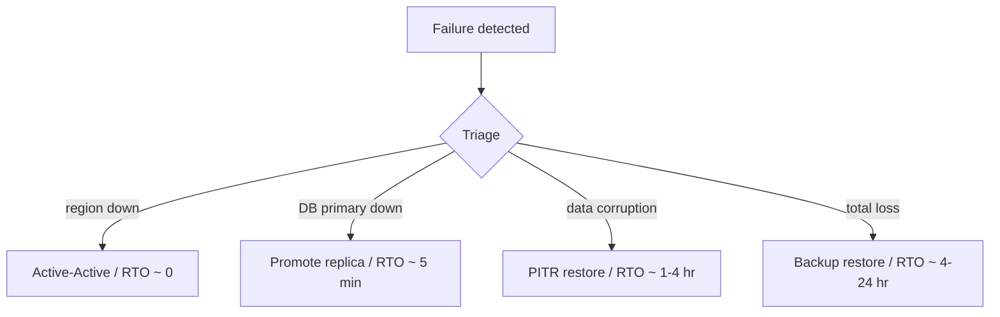

**Example — payment service RTO = 5 min:**

| Step | Automation | Time |
|------|------------|------|
| RDS Multi-AZ failover | Automatic | ~60–120 sec |
| App pods reschedule | Kubernetes | ~30 sec |
| Health checks pass | ALB | ~30 sec |
| Status page update | PagerDuty workflow | ~60 sec |
| **Total** | | **~3–5 min** |

### Diagram

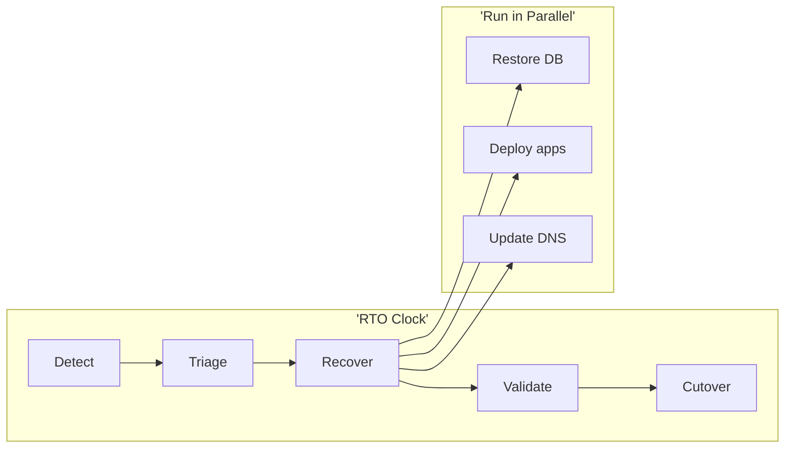

### Key details

| Topic | Detail |
|-------|--------|
| **Include detection time** | RTO starts at failure, not when someone notices — monitoring is part of RTO |
| **DNS TTL impact** | TTL=300s adds 5 min to cutover; use low TTL for failover domains |
| **Runbook parallelism** | DB restore + app deploy simultaneously, not sequentially |
| **Game days** | Measure actual RTO quarterly; paper RTO ≠ real RTO |
| **Communication** | Status updates to stakeholders are part of incident clock |
| **Dependency chain** | RTO of service = sum of slowest critical dependency restore |

**Interview rapid-fire:**

| Question | Answer |
|----------|--------|
| RPO=0, RTO=2hr possible? | Yes — no data loss (sync repl) but slow manual failover |
| Fastest RTO pattern? | Active-active with global LB |
| DNS impact on RTO? | High TTL delays traffic shift; pre-lower TTL before maintenance |
| How measure RTO? | Game day: inject failure, stopwatch to restored SLO |
| RTO vs MTTR? | RTO = target/budget; MTTR = actual measured recovery time |

### When to use

- **DR tier classification** — Tier 1 (minutes) vs Tier 3 (hours)
- **Choosing active-passive vs active-active** — RTO near zero needs active-active
- **Incident severity definitions** — SEV1 when RTO budget at risk
- **Capacity planning for on-call** — short RTO needs 24/7 staffed response

### Trade-offs

| Lower RTO | Higher RTO |
|-----------|------------|
| Better user experience | Lower infra and ops cost |
| Hot/warm standby expense | Manual recovery acceptable |
| Automation investment (IaC, failover scripts) | Longer outages tolerated |
| Requires regular game-day validation | Simpler architecture |
| Active-active complexity | Backup-restore may suffice |

### References

- [Google SRE — Disaster Recovery Planning](https://sre.google/sre-book/addressing-cascading-failures/)
- [AWS DR patterns and RTO](https://docs.aws.amazon.com/whitepapers/latest/disaster-recovery-workloads-on-aws/disaster-recovery-options-in-the-cloud.html)
- [IBM RPO/RTO explainer](https://www.ibm.com/topics/rpo-rto)

---


## 12.6 Disaster Recovery


### What is it?

**Disaster Recovery (DR)** is the planned capability to restore IT systems after **catastrophic** failures — entire region loss, ransomware, datacenter fire, operator error at scale — meeting defined **RPO** (how much data you can lose) and **RTO** (how fast you're back).

DR is not HA: HA survives a pod or AZ; DR survives losing a **region** or needing to **rebuild from backups**.

### Why it matters

```text
us-east-1 regional outage (real events: 2017, 2021)
→ every service in one region down simultaneously
→ HA within region does not help

Ransomware encrypts production DB
→ replicas are encrypted too
→ only immutable offsite backup saves you
```

Without tested DR, RPO/RTO numbers on slide decks are fiction.

### How it works

**Step 1 — Tier your workloads:**

| Tier | RTO | RPO | Example | Pattern |
|------|-----|-----|---------|---------|
| **Tier 0** | ~0 | ~0 | Payments auth | Active-active multi-region |
| **Tier 1** | < 15 min | < 1 min | Core API | Hot standby + sync/async repl |
| **Tier 2** | < 4 hr | < 1 hr | Internal admin | Warm standby / pilot light |
| **Tier 3** | < 24 hr | < 24 hr | Analytics | Backup-restore |

**Step 2 — Choose DR pattern (AWS terminology):**

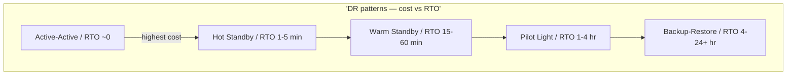

| Pattern | What's running in DR | RTO | Cost |
|---------|---------------------|-----|------|
| **Backup-restore** | Nothing; restore from S3 | Hours–days | $ |
| **Pilot light** | DB replica only; apps on demand | 1–4 hr | $$ |
| **Warm standby** | Scaled-down apps + DB | 15–60 min | $$$ |
| **Hot standby** | Full stack at reduced traffic | 1–5 min | $$$$ |
| **Active-active** | Full traffic both regions | ~0 | $$$$$ |

**Step 3 — Regional failover runbook:**

```text
1. DECLARE disaster (SEV1) — who can authorize failover?
2. ASSESS scope (region? AZ? data corruption?)
3. STOP writes to primary (prevent split-brain)
4. PROMOTE DR database replica (or restore from backup)
5. SCALE DR application tier
6. UPDATE DNS / Global LB (Route53 health check, Cloudflare)
7. VALIDATE smoke tests (login, checkout, payment)
8. COMMUNICATE status page + internal channels
9. POSTMORTEM + decide when to fail back
```

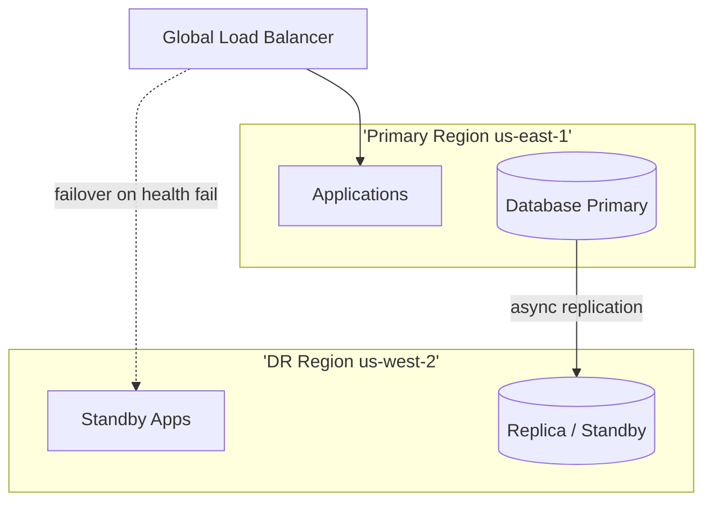

### Key details

#### Game day checklist (quarterly)

```text
□ Failover to DR region in isolated exercise (not prod traffic first time)
□ Measure actual RTO vs target
□ Measure actual RPO (data gap after promote)
□ Verify secrets, IAM roles, DNS exist in DR region
□ Verify third-party webhooks point to DR endpoints
□ Run smoke test suite against DR
□ Document gaps; assign owners
```

#### Common DR gaps

| Gap | Incident outcome |
|-----|------------------|
| Backups exist but never restored | Restore fails — wrong version, missing permissions |
| DR region missing secrets | Apps boot-loop after failover |
| Hardcoded region in SDK | DR apps still call us-east-1 |
| Async repl lag not monitored | Promote → lose last 30 min of orders |
| No write-stop procedure | Split-brain — two primaries |
| Runbook is someone's head | 2 hr debate during outage |

#### Ransomware-specific DR

```text
1. Isolate infected systems (disconnect network)
2. Do NOT pay without legal/compliance review
3. Restore from IMMUTABLE backup (S3 Object Lock, air-gapped)
4. Rebuild infra from IaC (don't restore compromised VMs)
5. Rotate ALL credentials before cutover
```

### When to use

- Any business beyond "we can be down a day"
- Regulatory requirements (finance, healthcare)
- Contractual SLA with financial penalties
- Protection against cloud regional failures

### Trade-offs / Pitfalls

| Pitfall | Consequence | Fix |
|---------|-------------|-----|
| DR never tested | RTO 4× worse than planned | Quarterly game days |
| Active-active without conflict handling | Duplicate writes, data merge hell | CRDT, idempotency, or single-writer region |
| Async repl only, RPO=0 claimed | Data loss on failover | Honest RPO or sync repl |
| DR drift | DR apps 3 versions behind | Automated sync deploys |
| Failback untested | Stuck in DR for weeks | Document failback runbook |

### References

- [AWS Disaster Recovery whitepaper](https://docs.aws.amazon.com/whitepapers/latest/disaster-recovery-workloads-on-aws/disaster-recovery-workloads-on-aws.html)
- See [12.4 RPO](#124-rpo), [12.5 RTO](#125-rto), [12.7 Backup](#127-backup-strategy)

---


## 12.7 Backup Strategy


### What is it?

A **backup strategy** defines **what** to back up, **how often**, **where** copies live, **how long** to retain them, and **who** can restore — covering databases, object storage, configs, secrets metadata, and IaC.

Backups are insurance. A strategy without **tested restores** is a receipt for false confidence.

### Why it matters

```text
Operator runs DELETE FROM orders WHERE 1=1 (wrong env)
Ransomware encrypts RDS + replicas
Bad deploy corrupts 40% of rows

Only backups with point-in-time recovery (PITR) bring you back
```

### How it works

**The 3-2-1 rule:**

```text
3 copies of data
2 different storage media/types
1 copy offsite (different region/account)
```

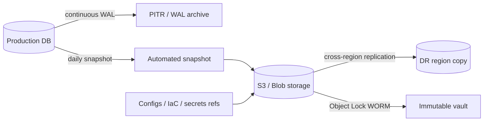

**Backup types:**

| Type | Consistency | RPO | Use |
|------|-------------|-----|-----|
| **Crash-consistent snapshot** | Disk as-is | Minutes–hours | VMs, fast snapshots |
| **Application-consistent** | Quiesced app + DB | Minutes | RDS, quiesced MySQL |
| **Continuous WAL/binlog** | Transaction log stream | Seconds | PITR to any point in time |
| **Logical dump** | `pg_dump`, `mysqldump` | Hours | Portability, selective restore |

**GFS retention (Grandfather-Father-Son):**

| Tier | Frequency | Retention |
|------|-----------|-----------|
| **Son (daily)** | Every day | 7–14 days |
| **Father (weekly)** | Weekly | 4–8 weeks |
| **Grandfather (monthly)** | Monthly | 6–12 months |
| **Yearly** | Annual | 7+ years (compliance) |

**Production checklist:**

```text
□ Automated backups — no manual cron on one engineer's laptop
□ Alert on backup job FAILURE (not just success logs)
□ Cross-region copy for regional disaster
□ Immutable / WORM for ransomware (S3 Object Lock, Azure Immutable)
□ Encrypt at rest + in transit; separate KMS keys from prod
□ Backup credentials in separate account (ransomware can't delete)
□ Include: DB, Redis RDB (if stateful), Kafka tiered storage, Terraform state
□ Document RPO achieved per system
```

### Key details

| Topic | Production detail |
|-------|-------------------|
| **PITR window** | RDS default 7 days; extend to 35 for critical DBs |
| **Backup window load** | Schedule off-peak; use replica for logical dumps |
| **Large tables** | Tablespace-level or incremental; avoid locking prod |
| **K8s** | Velero for PV snapshots + resource manifests |
| **Compliance** | GDPR right-to-erasure vs backup retention — legal hold process |

### When to use

- All stateful systems (always)
- Before schema migrations and major releases
- Ransomware defense layer
- Regulatory audit evidence

### Trade-offs / Pitfalls

| Pitfall | Consequence | Fix |
|---------|-------------|-----|
| Backups never restored | Discover corrupt backup at incident | Quarterly restore drills (12.8) |
| Replica = backup | Logical delete replicates; ransomware hits replica | Immutable offsite copy |
| Same account credentials | Attacker deletes backups too | Separate backup account |
| Crash-consistent only | Restored DB won't start clean | App-consistent or WAL |
| No monitoring | Silent backup failure for weeks | Pager on failed jobs |

### References

- [Google SRE — Data Integrity](https://sre.google/sre-book/data-integrity/)
- See [12.8 Restore Strategy](#128-restore-strategy), [12.6 Disaster Recovery](#126-disaster-recovery)

---


## 12.8 Restore Strategy


### What is it?

A **restore strategy** is the documented, **tested** procedure to recover systems from backups to a known-good state within **RTO** — including infrastructure provisioning, data restore, validation, traffic cutover, and communication.

> *"Everybody has backups. Nobody has restores."* — every SRE who's been paged at 3am

### Why it matters

During an incident, untested restores fail because:

```text
- Backup is encrypted with key that rotated 6 months ago
- Restored DB version doesn't match app version
- Restore to wrong VPC — no route to apps
- 800 GB restore takes 6 hours — RTO was "1 hour"
```

### How it works

**Restore order (dependency-aware):**

```text
1. Network / VPC / security groups (IaC)
2. Secrets (from vault — NOT from compromised backup)
3. Database restore (longest pole)
4. Message broker / cache (may rebuild from empty)
5. Application deploy (version pinned to data epoch)
6. Background workers
7. DNS / traffic cutover
8. Smoke tests → open traffic
```

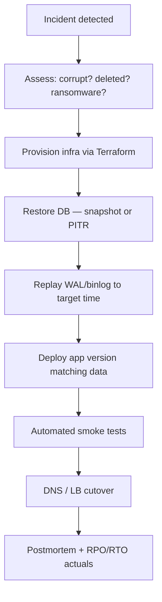

**PITR restore example (PostgreSQL mental model):**

```text
1. Restore base backup from Sunday 00:00
2. Replay WAL archives Sunday 00:00 → Tuesday 14:32:00 (before bad deploy)
3. Promote restored instance
4. Deploy app commit from Tuesday 14:00 (matches schema)
5. Validate: row count, checksum sample, test checkout
```

**Game day exercise (quarterly):**

| Step | Success criteria |
|------|------------------|
| Pick random backup | Not the newest — simulate unknown age |
| Restore to isolated env | No prod traffic risk |
| Stopwatch RTO | Compare to target |
| Run smoke suite | Login, read, write, payment sandbox |
| Document gaps | Update runbook same week |

### Key details

#### Ransomware restore

```text
1. Do NOT restore into compromised network
2. Build clean VPC from IaC
3. Restore from IMMUTABLE backup predating infection
4. Rotate ALL secrets before any traffic
5. Forensics on infected systems — don't rush wipe
```

#### Parallelism

```text
Sequential (bad):  DB 4hr → then apps 30min → RTO 4.5hr
Parallel (good):   DB restore + app deploy to staging simultaneously
                   → RTO dominated by DB only
```

#### Data epoch mismatch

| Mistake | Symptom |
|---------|---------|
| New app + old DB | Migration errors, missing columns |
| Old app + new DB | App crash on unknown schema |
| Restored cache with stale keys | Phantom reads |

**Rule:** tag backups with `app_version` and `schema_migration_id`.

### When to use

- Immediately after defining backup strategy
- After any failed restore test
- Before major version upgrades (rollback plan)
- Annual ransomware tabletop

### Trade-offs / Pitfalls

| Pitfall | Consequence | Fix |
|---------|-------------|-----|
| No isolated restore env | Test corrupts prod | Dedicated restore VPC |
| Runbook without commands | Improvise under pressure | Copy-paste CLI in runbook |
| Ignore DNS TTL | "Restored" but users still on broken region | Pre-lower TTL |
| Skip communication plan | Support flooded; executives blind | Pre-written status templates |
| Restore without validation | Bad data goes live | Automated smoke + manual spot check |

### References

- [AWS Backup restore testing](https://docs.aws.amazon.com/aws-backup/latest/devguide/restore-testing.html)
- See [12.7 Backup Strategy](#127-backup-strategy), [12.5 RTO](#125-rto)

---


## 12.9 Chaos Engineering


### What is it

**Chaos engineering** is the disciplined practice of **experimenting on production-like systems** by injecting controlled failures to discover weaknesses *before* real outages expose them.

> *"Chaos engineering is the discipline of experimenting on a system in order to build confidence in the system's capability to withstand turbulent conditions in production."* — [Principles of Chaos](https://principlesofchaos.org/)

It is not random breakage — it follows a **scientific method**: hypothesis → experiment → observe → fix → automate.

### Why it matters

Distributed systems have **emergent failure modes** no design review catches:

- Failover that works in docs but not under load
- Retry storms that amplify outages
- Cascading dependencies that bypass circuit breakers
- Runbooks that haven't been tested in a year

Chaos engineering converts unknown-unknowns into known-knowns and validates that **HA, DR, and RPO/RTO** targets are achievable in practice.

### How it works

**The chaos engineering loop:**

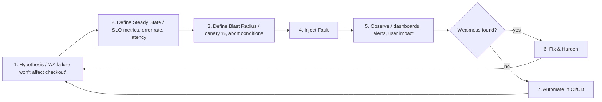

**Principles of Chaos Engineering:**

| # | Principle | Practice |
|---|-----------|----------|
| 1 | **Build hypothesis around steady state** | Define normal: p99 < 200ms, error rate < 0.1% |
| 2 | **Vary real-world events** | Kill pods, add latency, partition network, fill disk |
| 3 | **Run in production** | Staging misses prod traffic patterns, config drift, scale |
| 4 | **Automate experiments** | Manual game days first; then continuous chaos in pipeline |
| 5 | **Minimize blast radius** | Start with 1 pod, 1 AZ canary; abort on SLO breach |

**Fault injection examples:**

| Fault | Tool | What it tests |
|-------|------|---------------|
| Kill random pod | Chaos Monkey, K8s `kubectl delete pod` | Self-healing, replica count, HPA |
| AZ/network partition | AWS FIS, Gremlin, Litmus | Multi-AZ HA, quorum, split-brain |
| Latency injection (+500ms) | Toxiproxy, Istio fault rules | Timeouts, circuit breakers, cascading slowness |
| CPU / memory pressure | stress-ng, Litmus | OOM handling, cgroup limits, eviction |
| DNS failure | `/etc/hosts` override, Toxiproxy | Dependency resolution, fallback endpoints |
| Certificate expiry | Rotate to expired cert in staging | Monitoring alerts, renewal automation |

**Tools landscape:**

| Tool | Type | Best for |
|------|------|----------|
| **Chaos Monkey** (Netflix) | Random instance termination | AWS ASG resilience |
| **Litmus** | K8s-native chaos | Pod/node/network chaos in Kubernetes |
| **Chaos Mesh** | K8s-native chaos | CNCF; IO/network/kernel faults |
| **Gremlin** | SaaS chaos platform | Enterprise game days, blast radius control |
| **AWS FIS** | Cloud fault injection | EC2, RDS, AZ-level AWS faults |
| **Toxiproxy** | Network proxy | Latency, timeout, partition between services |
| **Istio fault injection** | Service mesh | HTTP abort/delay between microservices |
| **PowerfulSeal** | K8s chaos | Node-level failure automation |
| **Jepsen** | Formal testing | Database consistency under partition |

```mermaid
flowchart TB
    subgraph Staging['Phase 1 - Staging']
        S1[Single pod kill]
        S2[Dependency timeout]
    end
    subgraph Canary['Phase 2 - Prod Canary']
        C1[1% traffic AZ shift]
        C2[Kill pod in canary pool]
    end
    subgraph Prod['Phase 3 - Prod (controlled)']
        P1[AZ failure simulation]
        P2[Regional failover drill]
    end
    Staging --> Canary --> Prod
```

**Game days — structured chaos exercises:**

| Element | Description |
|---------|-------------|
| **Objective** | "Validate RTO < 15 min for regional failover" |
| **Participants** | SRE, backend, DBA, product, comms |
| **Scenario** | "Region us-east-1 is unreachable" |
| **Inject** | Block traffic via security group or FIS |
| **Observe** | Does GLB shift? Does DR region serve? What's actual RTO? |
| **Debrief** | Blameless postmortem; file fixes as tickets |
| **Frequency** | Quarterly for Tier 1; annually minimum |

**Example game day timeline:**

```mermaid
gantt
    title Game Day - AZ Failure Drill
    dateFormat HH:mm
    axisFormat %H:%M

    section Prep
    Briefing + roles assigned    :09:00, 30m
    section Inject
    Isolate AZ-b (FIS)           :09:30, 5m
    section Observe
    Monitor SLOs + runbooks      :09:35, 45m
    section Recover
    Restore AZ-b                 :10:20, 15m
    section Debrief
    Blameless review             :10:35, 60m
```

**Abort conditions (mandatory):**

| Signal | Action |
|--------|--------|
| Error rate > 2× steady state | Abort experiment immediately |
| p99 latency > SLO breach | Abort |
| Customer-facing revenue impact | Abort |
| On-call can't reach decision maker | Abort |
| Experiment exceeds time box | Abort + rollback |

### Diagram

```mermaid
flowchart TB
    subgraph Hypothesis["Hypothesis: Multi-AZ survives node loss"]
        SS[Steady State / 99.9% success, p99 < 100ms]
    end
    subgraph Experiment['Controlled Experiment']
        FI["Inject: drain node in AZ-b"]
        MON["Monitor: Grafana, PagerDuty"]
    end
    subgraph Outcome['Outcomes']
        OK[OK Traffic rerouted - hypothesis confirmed]
        FAIL[NO 500 errors for 3 min - fix PDB + probe]
    end
    SS --> FI --> MON --> OK & FAIL
```

### Key details

| Topic | Detail |
|-------|--------|
| **Start small** | Single pod kill in staging before AZ failure in prod |
| **Never without observability** | No chaos if you can't measure impact — you'll cause blind outages |
| **Integrate with error budgets** | Chaos during healthy budget; pause when budget exhausted |
| **Automate winning experiments** | One-off game day findings → Litmus ChaosSchedule in CI |
| **Not a substitute for design** | Chaos validates design; it doesn't replace redundancy |
| **Cultural buy-in** | Leadership must support intentional failure injection |
| **Blast radius** | `terminationGracePeriodSeconds`, PDB, maxUnavailable protect rollouts |

**Interview rapid-fire:**

| Question | Answer |
|----------|--------|
| Chaos vs testing? | Testing verifies known paths; chaos discovers unknown failure modes |
| Why prod, not just staging? | Prod has real traffic, scale, config drift, and dependency graph |
| Chaos Monkey does what? | Randomly terminates instances to force redundancy validation |
| What is a game day? | Scheduled, cross-team failure drill with hypothesis and debrief |
| When NOT to do chaos? | No monitoring, no runbooks, during active incident, budget exhausted |

### When to use

- **Mature microservices** with observability (metrics, traces, logs)
- **After major architecture changes** — new region, new DB, mesh rollout
- **Pre-launch HA validation** — prove multi-AZ before GA
- **Before peak traffic events** — validate autoscaling and failover under load
- **Quarterly game days** for Tier 1 services

**Skip chaos when:** no redundancy exists (will just cause outage), no monitoring, immature org culture.

### Trade-offs

| Pros | Cons |
|------|------|
| Discovers real weaknesses before customers do | Can cause real outages if reckless |
| Validates HA/DR/RTO claims with evidence | Requires observability investment first |
| Improves runbooks and on-call readiness | Cultural resistance ("don't break prod") |
| Builds organizational confidence in resilience | Time-consuming to run properly |
| Automatable in CI/CD for regression | Not substitute for sound architecture |
| Reduces MTTR over time via practiced response | Blast radius misconfig → SEV1 |

### References

- [Principles of Chaos Engineering](https://principlesofchaos.org/)
- [Netflix Chaos Monkey](https://github.com/Netflix/chaosmonkey)
- [Litmus Chaos](https://litmuschaos.io/)
- [Gremlin — Chaos Engineering](https://www.gremlin.com/community/tutorials/what-is-chaos-engineering)
- [AWS Fault Injection Simulator](https://docs.aws.amazon.com/fis/latest/userguide/what-is.html)

---


## 12.10 Fault Injection


### What is it

Deliberately introducing errors - latency, HTTP 500, packet loss, resource exhaustion - into a system to test resilience mechanisms.

### Why it matters

Fault injection proves circuit breakers, retries, bulkheads, and fallbacks work. It is the tactical tool inside chaos engineering experiments.

### How it works

At code level (fault injection library), network level (iptables, toxiproxy), or infrastructure level (kill pod, drain node). Inject with scope limits and automatic rollback. Measure error rate, latency, and user journeys during injection.

### Diagram

```mermaid
flowchart LR
    subgraph Normal
        C[Client] --> S[Service]
        S --> D[Dependency]
    end
    subgraph Injected
        C2[Client] --> S2[Service]
        S2 -->|timeout/500| D2[Dependency + Fault]
    end
```

### Key details

- Toxiproxy, Istio fault rules, AWS FIS, Jepsen
- Test: dependency timeout, slow DB, certificate expiry
- Combine with load tests for realistic saturation
- Always have abort switch and blast radius control

### When to use

- Validating new resilience patterns (circuit breaker)
- Pre-production staging environments
- Chaos engineering game days

### Trade-offs

| Pros | Cons |
|------|------|
| Targeted, repeatable tests | Can leak to prod if misconfigured |
| Fast feedback in CI | Not all faults easily injectable |
| Improves code paths | False confidence if scope too narrow |

### References

- [Istio fault injection](https://istio.io/latest/docs/tasks/traffic-management/fault-injection/)
- [Netflix Simian Army](https://github.com/Netflix/SimianArmy)

---

[<- Back to master index](../README.md)
