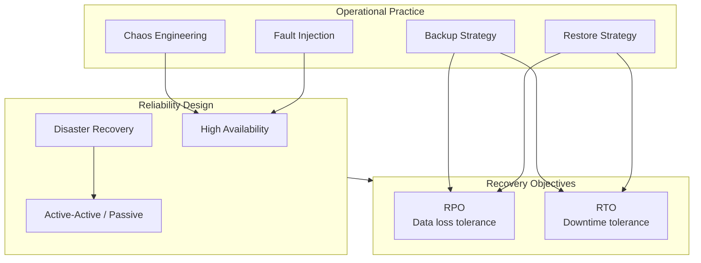
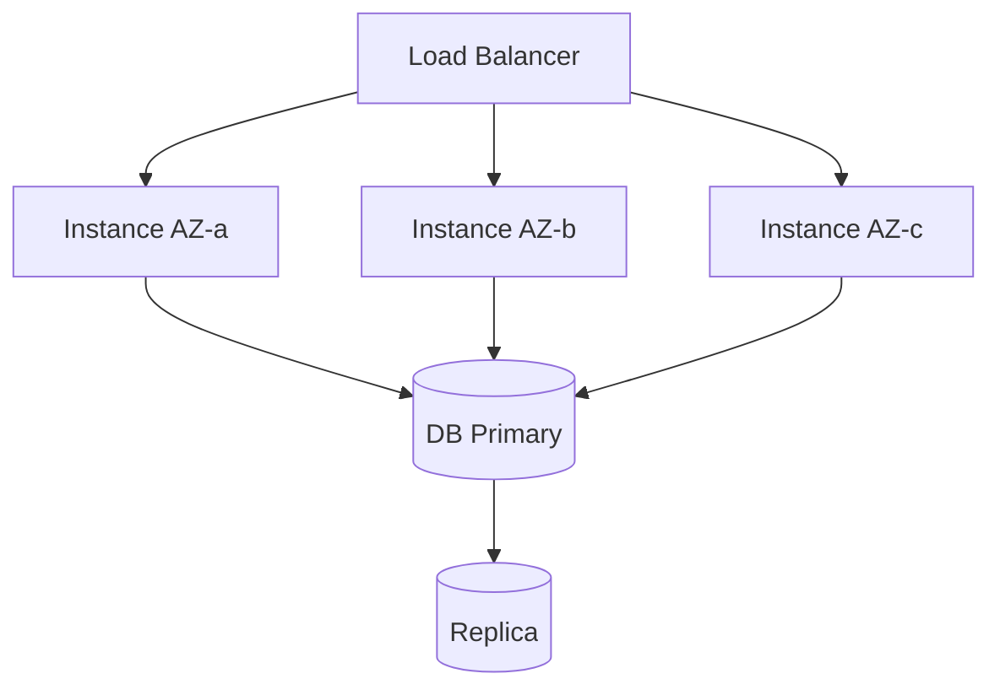
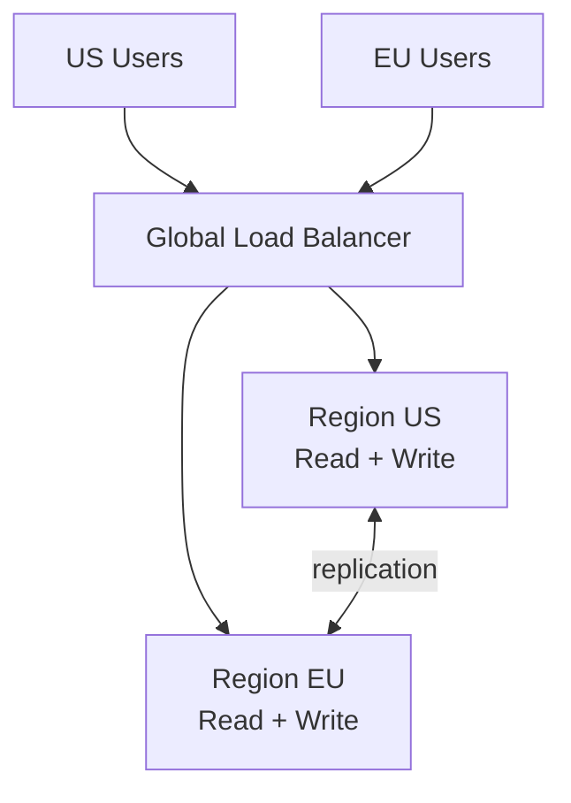
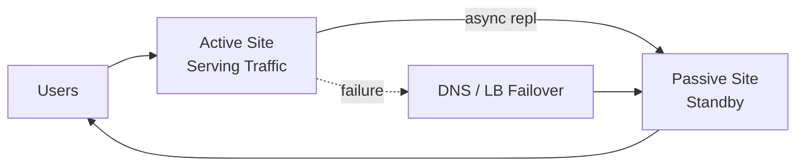
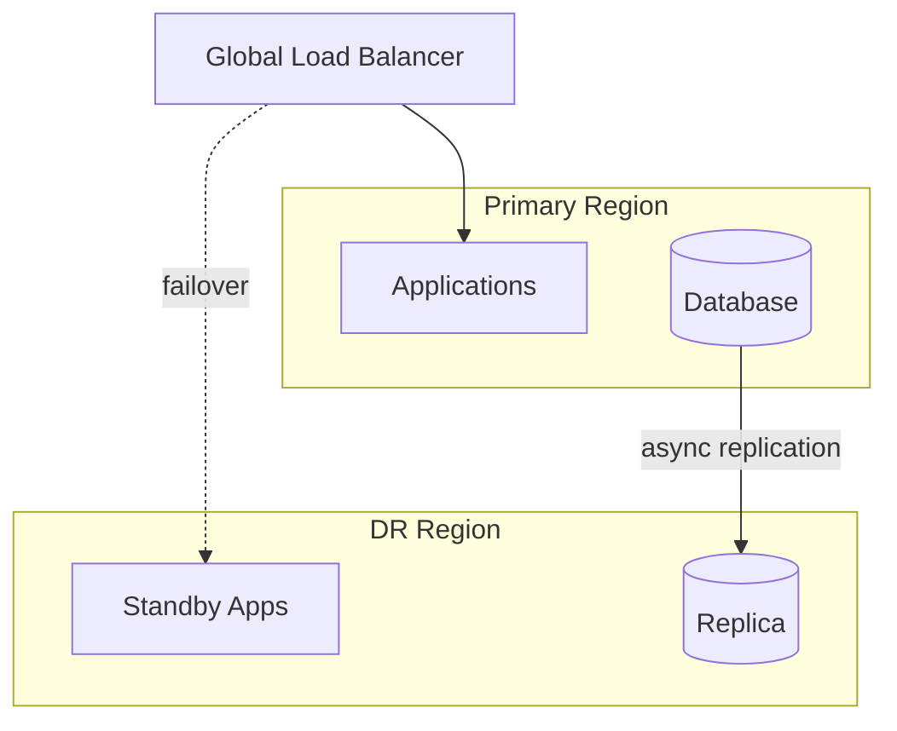
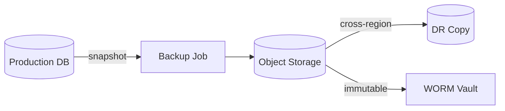
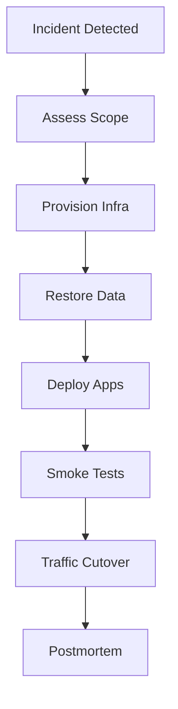
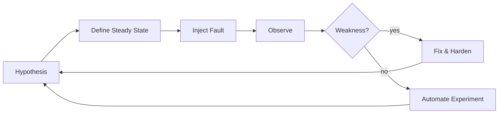
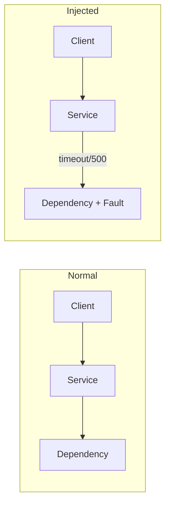

# 12. Reliability Engineering

> Status: **Documented**  -  MASTER reference depth for all sub-topics below.

[<- Back to master index](../README.md)

---

## Sub-topics

| # | Sub-topic | Status |
|---|-----------|--------|
| 12.1 | [High Availability](#121-high-availability) | Done |
| 12.2 | [Active Active](#122-active-active) | Done |
| 12.3 | [Active Passive](#123-active-passive) | Done |
| 12.4 | [RPO](#124-rpo) | Done |
| 12.5 | [RTO](#125-rto) | Done |
| 12.6 | [Disaster Recovery](#126-disaster-recovery) | Done |
| 12.7 | [Backup Strategy](#127-backup-strategy) | Done |
| 12.8 | [Restore Strategy](#128-restore-strategy) | Done |
| 12.9 | [Chaos Engineering](#129-chaos-engineering) | Done |
| 12.10 | [Fault Injection](#1210-fault-injection) | Done |


---

## Overview

Reliability engineering builds systems that survive failures - hardware, software, human, and regional - through redundancy, tested recovery paths, and deliberate experimentation. It connects business continuity (RPO/RTO) with operational practice (backups, failover, chaos).



---


## Reading order

Sub-topics are sequenced for progressive learning: foundations first, then related concepts, then specialized topics.

| Group | Sections | Focus |
|-------|----------|-------|
| **1. Availability patterns** | 12.1-12.3 | HA, active-active, active-passive |
| **2. Recovery objectives** | 12.4-12.5 | RPO, RTO |
| **3. Disaster recovery** | 12.6-12.8 | DR, backup, restore |
| **4. Testing resilience** | 12.9-12.10 | Chaos engineering, fault injection |

---
---

## 12.1 High Availability


### What is it

Architecture eliminating single points of failure so service continues during component failures - via redundancy, health checks, and automatic failover.

### Why it matters

Users expect near-continuous availability. HA converts inevitable component failures from outages into invisible blips.

### How it works

Run N+1 or N+2 redundant instances across AZs. Load balancer routes around unhealthy targets. Stateful systems use replication with automatic leader election. Health checks drive failover. No single shared resource without backup.

### Diagram



### Key details

- HA ≠ DR (survives component failure, not region loss)
- Target: 99.9% (8.7h/yr) to 99.99% (52m/yr)
- Eliminate SPOF: LB, DB, cache, message broker
- Chaos-test AZ failure regularly

### When to use

- All production user-facing services
- Stateful tiers with replication
- Internal critical dependencies

### Trade-offs

| Pros | Cons |
|------|------|
| Graceful component failure | 2 - 3× resource cost |
| Better SLO achievement | Complexity of distributed state |
| User trust | Split-brain risks without quorum |

### References

- [AWS Well-Architected  -  Reliability](https://docs.aws.amazon.com/wellarchitected/latest/reliability-pillar/welcome.html)

---


## 12.2 Active Active


### What is it

Multiple sites or regions simultaneously serving live traffic with read-write capability - no idle standby waiting for failover.

### Why it matters

Active-active minimizes RTO (traffic already routed) and can place users near nearest region. Required for global low-latency and highest availability tiers.

### How it works

Global load balancer geo-routes users. Data replicated multi-master or partitioned by region. Conflict resolution for concurrent writes (CRDTs, LWW, application merge). Each region runs full stack. Failure of one region sheds traffic to others automatically.

### Diagram  -  Active-Active



### Key details

- Data consistency is the hard problem
- Prefer partition-by-region over multi-master when possible
- DNS/global anycast for fast traffic shift
- Test partial region failure, not only full outage

### When to use

- Global products needing local latency
- RTO near zero requirements
- Scale beyond single-region capacity

### Trade-offs

| Pros | Cons |
|------|------|
| Lowest RTO/RPO potential | Write conflict complexity |
| Geographic performance | 2×+ operational cost |
| No cold standby waste | Hard to debug cross-region |

### References

- [Martin Kleppmann  -  multi-datacenter](https://martin.kleppmann.com/2015/05/11/please-stop-calling-databases-cp-or-ap.html)

---


## 12.3 Active Passive


### What is it

Primary site handles all production traffic; secondary (passive) site stands ready with replicated data, activated only on primary failure.

### Why it matters

Simpler than active-active with lower cost than full dual-live stacks. Common DR pattern for enterprise tiers with minutes-to-hours RTO.

### How it works

Primary serves traffic; async replication to standby. On failure, promote replica, start standby apps, update DNS/LB to passive site. Variants: **cold** (provision on fail), **warm** (apps running, no traffic), **hot standby** (sync repl, fast promote).

### Diagram  -  Active-Passive



### Key details

- Replication lag = RPO
- Failover time = RTO (DNS TTL matters)
- Regular failover drills; passive drift is common
- Split-brain prevention: fencing, STONITH

### When to use

- DR with moderate RTO (15 min  -  4 hr)
- Cost-sensitive HA across regions
- Legacy apps not designed multi-active

### Trade-offs

| Pros | Cons |
|------|------|
| Simpler consistency | Standby resources idle |
| Lower cost than active-active | Failover event causes blip |
| Well-understood pattern | Replication lag data loss |

### References

- [AWS DR patterns](https://docs.aws.amazon.com/whitepapers/latest/disaster-recovery-workloads-on-aws/disaster-recovery-options-in-the-cloud.html)

---


## 12.4 RPO


### What is it

**Recovery Point Objective** - the maximum acceptable **data loss** measured in time (e.g., "lose at most 15 minutes of writes").

### Why it matters

RPO drives replication frequency, backup intervals, and cost. A 24-hour RPO tolerates daily backups; zero RPO requires synchronous replication.

### How it works

Business defines tolerance for lost transactions. Engineering maps to replication lag, snapshot frequency, and WAL shipping. Async replication lag = practical RPO. Measure actual lag in monitoring; alert when approaching limit.

### Diagram  -  RPO Timeline

```mermaid
timeline
    title RPO = 15 minutes
    section Normal
        Last Backup : 10:00
        Live Writes : 10:01 - 10:14
    section Failure at 10:15
        Lost Data : 10:00 - 10:15 (15 min)
        Restored To : 10:00 backup
```

### Key details

- Tier-1 payments: RPO near zero (sync repl)
- Analytics: RPO hours acceptable
- RPO ≠ backup frequency alone (need replication + PITR)
- Document per service tier

### When to use

- DR architecture decisions
- SLA/contract negotiations
- Choosing sync vs async replication

### Trade-offs

| Lower RPO | Higher RPO |
|-----------|------------|
| Less data loss | Cheaper, simpler |
| Sync repl latency/cost | More loss on failure |
| Complex multi-region | Single-region OK |

### References

- [IBM RPO/RTO explainer](https://www.ibm.com/topics/rpo-rto)

---


## 12.5 RTO


### What is it

**Recovery Time Objective** - the maximum acceptable **downtime** before service is restored to operational level.

### Why it matters

RTO determines standby capacity (cold vs warm), automation investment, and on-call staffing. A 4-hour RTO allows manual restore; 5-minute RTO requires hot standby.

### How it works

From failure detection to validated recovery, measure each phase: detect, decide, provision, restore data, deploy, validate, cutover. Automate slow steps. Pre-provisioned warm standby shrinks RTO dramatically.

### Diagram  -  RTO Timeline

```mermaid
gantt
    title RTO Budget (target 1 hour)
    dateFormat X
    axisFormat %M min

    section Incident
    Detect           :0, 5
    Triage           :5, 15
    section Recovery
    Provision        :15, 25
    Restore DB       :25, 45
    Deploy Apps      :45, 55
    Validate         :55, 60
```



### Key details

- Include detection time - not just restore clock
- Automate DNS failover and IaC provisioning
- Runbooks with parallel workstreams
- Communicate status to stakeholders during clock

### When to use

- DR tier classification
- Choosing active-passive vs active-active
- Incident severity definitions

### Trade-offs

| Lower RTO | Higher RTO |
|-----------|------------|
| Better UX | Lower infra cost |
| Hot/warm standby expense | Manual recovery OK |
| Automation investment | Longer outages tolerated |

### References

- [Google SRE  -  Disaster Recovery Planning](https://sre.google/sre-book/addressing-cascading-failures/)

---


## 12.6 Disaster Recovery


### What is it

Planned capability to restore IT systems and data after catastrophic events - region loss, ransomware, datacenter fire - meeting defined RPO and RTO targets.

### Why it matters

Without DR, a single regional outage or corruption event can end the business. DR translates risk appetite into architecture (warm standby, pilot light) and tested procedures.

### How it works

Classify tiers by criticality. Choose DR pattern (backup-restore, pilot light, warm standby, active-active). Replicate data cross-region. Document runbooks; test restores quarterly. DNS/global load balancer shifts traffic to DR site.

### Diagram



### Key details

- DR tiers: Tier 1 (minutes RTO) vs Tier 3 (days)
- Patterns: backup-restore, pilot light, warm standby, multi-site active
- Test failover, not just backup existence
- Include runbooks for DNS, secrets, and dependencies

### When to use

- Any business requiring continuity beyond single-AZ HA
- Regulatory and contractual uptime commitments
- Protection against regional cloud failures

### Trade-offs

| Pros | Cons |
|------|------|
| Business survival | Cost of standby infrastructure |
| Regulatory compliance | Complexity of multi-region ops |
| Customer trust | Drift between primary and DR |

### References

- [AWS Disaster Recovery whitepaper](https://docs.aws.amazon.com/whitepapers/latest/disaster-recovery-workloads-on-aws/disaster-recovery-workloads-on-aws.html)

---


## 12.7 Backup Strategy


### What is it

Systematic policies for what to backup, how often, where to store copies, and how long to retain them - covering databases, configs, and stateful workloads.

### Why it matters

Backups are the last line against data loss from bugs, ransomware, and operator error. A strategy without tested restores is wishful thinking.

### How it works

Identify critical data sources. Schedule snapshots (hourly incremental, daily full). Store offsite/immutable (S3 Object Lock, vault). Encrypt backups. Version retention (GFS: grandfather-father-son). Monitor backup job success; alert on failure.

### Diagram



### Key details

- 3-2-1 rule: 3 copies, 2 media types, 1 offsite
- Application-consistent vs crash-consistent snapshots
- Separate backup credentials from production
- Backup configs, IaC, and secrets metadata too

### When to use

- All stateful systems
- Before schema migrations and major releases
- Ransomware defense (immutable backups)

### Trade-offs

| Pros | Cons |
|------|------|
| Recovery from logical errors | Storage cost |
| Point-in-time recovery | Backup window load on DB |
| Compliance evidence | Restore untested backups fail |

### References

- [Google SRE  -  Data Integrity](https://sre.google/sre-book/data-integrity/)

---


## 12.8 Restore Strategy


### What is it

Documented, tested procedures to recover systems from backups to a known-good state within RTO -  including validation steps and communication plans.

### Why it matters

Backups without restore drills are unknown liabilities. During incidents, untested restores fail under pressure when every minute counts.

### How it works

Define restore order (DNS -> DB -> apps -> cache). Provision infrastructure (IaC). Restore DB from snapshot/PITR. Replay binlogs to target time. Deploy application version matching data epoch. Run smoke tests. Cut traffic via DNS/LB.

### Diagram



### Key details

- Quarterly game-day restores to isolated environment
- Document RPO achieved vs target after restore
- Tabletop exercises for ransomware scenarios
- Maintain runbook with exact commands and contacts

### When to use

- After defining backup strategy
- Following any failed restore test
- Major version upgrades (rollback plan)

### Trade-offs

| Pros | Cons |
|------|------|
| Proven RTO | Time-consuming drills |
| Reduces panic in incidents | Test environments cost money |
| Finds backup gaps early | Data epoch mismatch risks |

### References

- [AWS Backup restore testing](https://docs.aws.amazon.com/aws-backup/latest/devguide/restore-testing.html)

---


## 12.9 Chaos Engineering


### What is it

Disciplined experimentation on production-like systems by injecting controlled failures to discover weaknesses before real outages expose them.

### Why it matters

Distributed systems have emergent failure modes no design review catches. Chaos engineering validates that redundancy, failover, and runbooks actually work under stress.

### How it works

Form a hypothesis ("zone failure won't affect checkout"). Define blast radius and abort conditions. Inject fault (kill pod, latency, partition). Observe metrics and user impact. Fix gaps; automate experiment in CI/CD. Tools: Chaos Monkey, Litmus, Gremlin, AWS FIS.

### Diagram  -  Chaos Engineering Loop



### Key details

- Start small: single pod kill in staging, then prod canary
- Game days with cross-team participation
- Integrate with SLOs and error budgets
- Never chaos without monitoring and rollback

### When to use

- Mature microservices with observability
- After major architecture changes
- Pre-launch validation of HA design

### Trade-offs

| Pros | Cons |
|------|------|
| Finds real weaknesses | Can cause outages if reckless |
| Builds confidence in DR | Requires cultural buy-in |
| Improves runbooks | Not substitute for design review |

### References

- [Principles of Chaos Engineering](https://principlesofchaos.org/)
- [Netflix Chaos Monkey](https://github.com/Netflix/chaosmonkey)

---


## 12.10 Fault Injection


### What is it

Deliberately introducing errors - latency, HTTP 500, packet loss, resource exhaustion - into a system to test resilience mechanisms.

### Why it matters

Fault injection proves circuit breakers, retries, bulkheads, and fallbacks work. It is the tactical tool inside chaos engineering experiments.

### How it works

At code level (fault injection library), network level (iptables, toxiproxy), or infrastructure level (kill pod, drain node). Inject with scope limits and automatic rollback. Measure error rate, latency, and user journeys during injection.

### Diagram



### Key details

- Toxiproxy, Istio fault rules, AWS FIS, Jepsen
- Test: dependency timeout, slow DB, certificate expiry
- Combine with load tests for realistic saturation
- Always have abort switch and blast radius control

### When to use

- Validating new resilience patterns (circuit breaker)
- Pre-production staging environments
- Chaos engineering game days

### Trade-offs

| Pros | Cons |
|------|------|
| Targeted, repeatable tests | Can leak to prod if misconfigured |
| Fast feedback in CI | Not all faults easily injectable |
| Improves code paths | False confidence if scope too narrow |

### References

- [Istio fault injection](https://istio.io/latest/docs/tasks/traffic-management/fault-injection/)
- [Netflix Simian Army](https://github.com/Netflix/SimianArmy)

---


## Quick Reference

| # | Topic | Summary |
|---|-------|---------|
| 12.1 | High Availability | High Availability |
| 12.2 | Active Active | Active Active |
| 12.3 | Active Passive | Active Passive |
| 12.4 | RPO | RPO |
| 12.5 | RTO | RTO |
| 12.6 | Disaster Recovery | Disaster Recovery |
| 12.7 | Backup Strategy | Backup Strategy |
| 12.8 | Restore Strategy | Restore Strategy |
| 12.9 | Chaos Engineering | Chaos Engineering |
| 12.10 | Fault Injection | Fault Injection |

---

[â -  Back to master index](../README.md)
