# 12. Reliability Engineering

[<- Back to master index](../README.md)

---

## Overview

**System reliability** is the ability of a distributed system to continue serving users correctly despite hardware faults, software bugs, network partitions, operator mistakes, and regional disasters. Reliability engineering connects business requirements (how much downtime and data loss are acceptable) with operational practice: redundancy, failure detection, backups, restore drills, disaster recovery sites, and deliberate experimentation.

This chapter progresses from foundational concepts through availability targets, high-availability architectures, data protection, recovery objectives, disaster recovery, and resilience testing. Each section builds on ideas introduced earlier; later sections reference earlier explanations instead of repeating them.

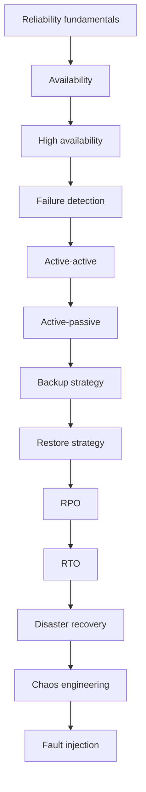

### Reliability fundamentals

A reliable system is **available** (users can reach it), **durable** (data is not lost), and **correct** (responses match expectations even under stress). In practice, reliability work spans:

- **Preventing** failures — redundancy, health monitoring, capacity planning
- **Detecting** failures — health checks, heartbeats, alerting
- **Recovering** from failures — failover, backup restore, disaster recovery
- **Learning** from failures — postmortems, chaos engineering, fault injection

Reliability is not binary. Teams define measurable targets (availability percentages, RPO, RTO) and design architecture, processes, and tooling to meet them within budget.

### Availability

**Availability** is the fraction of time a system is operational and accessible to users.

```text
Availability = Uptime / (Uptime + Downtime)
```

**Example:**

```text
Uptime = 364 days · Downtime = 1 day
Availability = 364 / 365 = 99.73%
```

Higher percentage means better availability. Moving from one "nine" to the next usually requires significantly more engineering effort and infrastructure cost.

### Availability levels

| Availability | Downtime / year | Notes |
|--------------|-----------------|-------|
| **99%** (2 nines) | ~3.65 days | Basic production |
| **99.9%** (3 nines) | ~8.76 hours | Standard SaaS |
| **99.99%** (4 nines) | ~52.5 minutes | Business-critical |
| **99.999%** (5 nines) | ~5.26 minutes | Mission-critical |


Availability targets drive architecture choices covered in the sections that follow — especially high availability, backup/restore, and disaster recovery.

---

## Sub-topics

| # | Sub-topic |
|---|-----------|
| 12.1 | [High Availability](#121-high-availability) |
| 12.2 | [Failure Detection](#122-failure-detection) |
| 12.3 | [Active Active](#123-active-active) |
| 12.4 | [Active Passive](#124-active-passive) |
| 12.5 | [Backup Strategy](#125-backup-strategy) |
| 12.6 | [Restore Strategy](#126-restore-strategy) |
| 12.7 | [RPO](#127-rpo) |
| 12.8 | [RTO](#128-rto) |
| 12.9 | [Disaster Recovery](#129-disaster-recovery) |
| 12.10 | [Chaos Engineering](#1210-chaos-engineering) |
| 12.11 | [Fault Injection](#1211-fault-injection) |

---


## 12.1 High Availability

### Definition

**High Availability (HA)** is the ability of a system to remain operational and accessible when hardware, software, or network components fail.

The goal is to minimize downtime by eliminating single points of failure and automatically recovering from failures.

**Example:** a banking application should remain available even if one application server crashes.

### Why it exists

**Without HA:**

- A single server failure causes a complete outage
- Users cannot access the application
- Business operations stop; revenue and trust are affected

**With HA:**

- Backup components take over automatically
- Users experience little or no interruption
- The system continues serving requests

### How it works

HA combines **redundancy** (spare capacity), **failure detection** (covered in [12.2](#122-failure-detection)), and **failover** (automatic switch to healthy components).

### Single point of failure (SPOF)

A **single point of failure** is a component whose failure brings down the entire system.

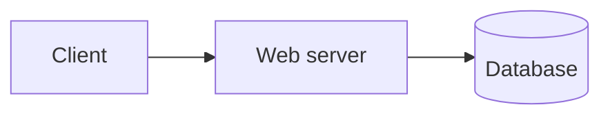

If the database crashes, the application becomes unavailable. HA design removes every SPOF through redundancy at each layer.

### Redundancy

**Redundancy** means multiple copies of important components so if one fails, another continues the work.

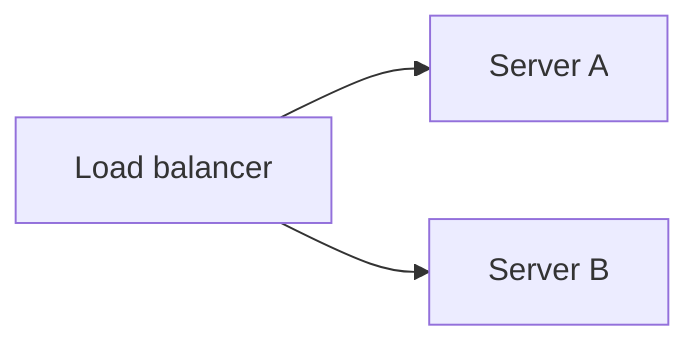

If Server A fails, Server B continues serving requests.

**Types:** server · database · network · storage · power

### Failover and failback

**Failover** is automatic switching from a failed component to a healthy one.

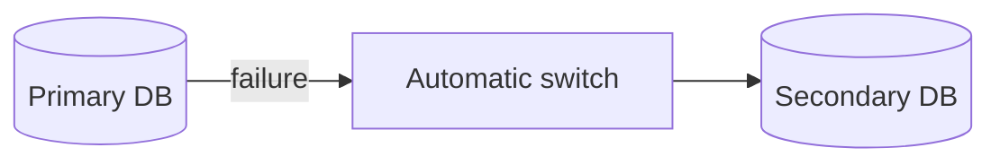

Users continue without manual intervention.

**Failback** returns traffic to the original primary after it has been repaired. Failback may be automatic or manual:

```text
Secondary serving traffic → primary repaired → traffic returns to primary
```

### HA architecture patterns

Two common patterns distribute redundant capacity differently:

- **Active-active** — all nodes serve traffic simultaneously ([12.3](#123-active-active))
- **Active-passive** — one node serves traffic; others stand by ([12.4](#124-active-passive))

Both rely on failure detection and load balancing; the choice trades complexity, cost, and utilization.

### Load balancing

The load balancer distributes requests among healthy servers and removes failed nodes from the pool once failure detection reports them unhealthy.

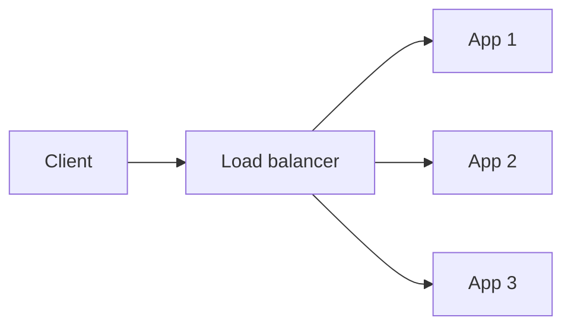

**Benefits:** avoids overloaded servers · improves availability · supports failover · increases scalability

### Database, storage, network, and power HA

**Database** — replication with automatic promotion of a secondary when the primary fails:

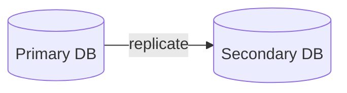

**Storage** — RAID, replication, distributed storage, NAS, storage clusters

**Network** — multiple routers, switches, paths, and internet connections:

```text
Internet → Switch A → application | Internet → Switch B → application
```

**Power** — dual power supplies, UPS, backup generators, multiple circuits

### Fault tolerance vs high availability

| | Fault tolerance | High availability |
|---|-----------------|-------------------|
| **Downtime** | Continues without interruption | Small interruption may occur |
| **Cost** | Usually expensive | Less expensive than fault tolerance |
| **Recovery** | No noticeable downtime | Automatic recovery |
| **Example** | Dual processors run same task | Failover to standby replica |

### HA vs disaster recovery

HA handles **component-level** failures (server, disk, network) with recovery in seconds or minutes. **Disaster recovery** ([12.9](#129-disaster-recovery)) handles **catastrophic** events (data center loss, fire, regional outage) and may take minutes to hours. Both are complementary; HA alone does not protect against every disaster.

### Techniques for achieving HA

- Redundant servers and databases
- Data replication
- Automatic failover
- Health monitoring and heartbeat (see [12.2](#122-failure-detection))
- Load balancing
- Geographic deployment
- Redundant networking and storage
- Automatic scaling and continuous monitoring

### Advantages

- Reduced downtime and improved user experience
- Automatic recovery without manual intervention
- Better resilience to common component failures

### Disadvantages

- Higher infrastructure and operational cost
- Data synchronization complexity
- Split-brain and failover-testing challenges
- Network latency between replicas

### Real-world example — e-commerce

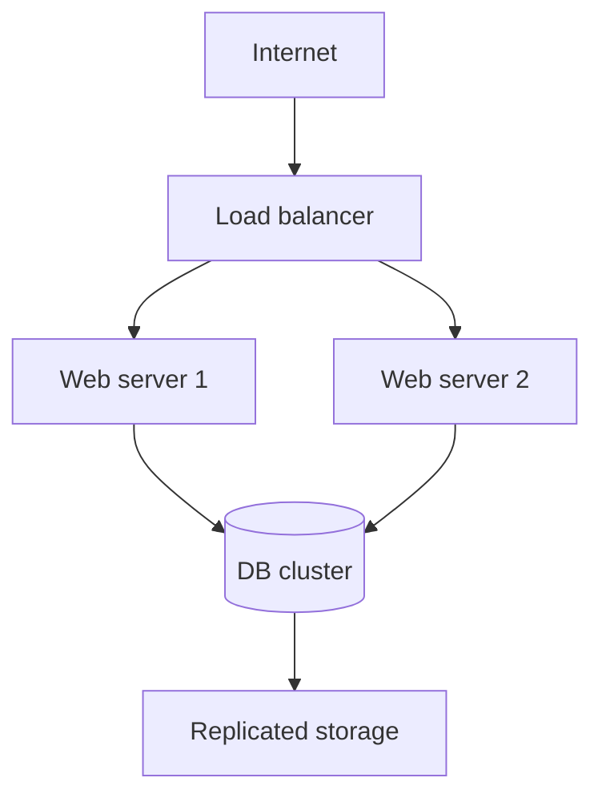

**Workflow:**

1. Users send requests; load balancer distributes traffic
2. One web server crashes
3. Health check detects failure; failed server is removed from the pool
4. Remaining server continues serving users
5. After repair, the failed server rejoins the cluster

Users experience little or no downtime.

### Best practices

- Eliminate SPOFs at every layer
- Automate failover; document and test failback
- Monitor replication lag and health continuously
- Run game days and chaos experiments ([12.10](#1210-chaos-engineering))

### Common mistakes

- HA without tested failover (standby never promoted in practice)
- Ignoring split-brain during network partitions
- Treating HA as a substitute for backups and disaster recovery

### Summary

```text
HA = minimize downtime by removing SPOFs; redundancy + failover + failure detection
Active-active and active-passive are the two main patterns; HA handles component failure, DR handles catastrophes
```

---


## 12.2 Failure Detection

### Definition

**Failure detection** is the process of determining whether a component, service, or node is healthy enough to serve traffic. HA architectures depend on fast, accurate detection so load balancers and orchestrators can remove failed instances and trigger failover.

### Why it exists

Without timely detection:

- Traffic continues routing to failed nodes
- Users see errors or timeouts instead of automatic recovery
- Failover never starts; standby nodes remain idle

### How it works

Monitors probe components on a schedule or receive periodic signals from them. When probes fail or signals stop, the component is marked unhealthy and removed from the serving pool.


### Health checks

**Health checks** continuously verify whether services are functioning correctly.

**Common check types:**

- HTTP endpoint (returns 200 when ready)
- TCP connection (port open)
- Database query (can read/write)
- Resource thresholds (memory, CPU, disk usage)

Load balancers, Kubernetes, and cloud auto-scaling groups all use health checks to decide which instances receive traffic.

### Heartbeat

A **heartbeat** is a periodic signal between components indicating they are alive.

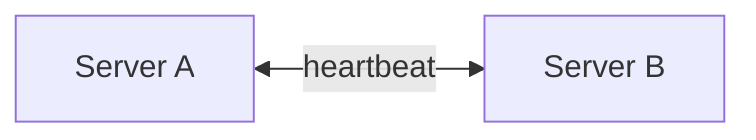

If heartbeat messages stop, the peer is considered failed and failover begins. Heartbeats are common in active-passive pairs ([12.4](#124-active-passive)) where a standby must know when to promote itself.

### Workflow — detection to recovery

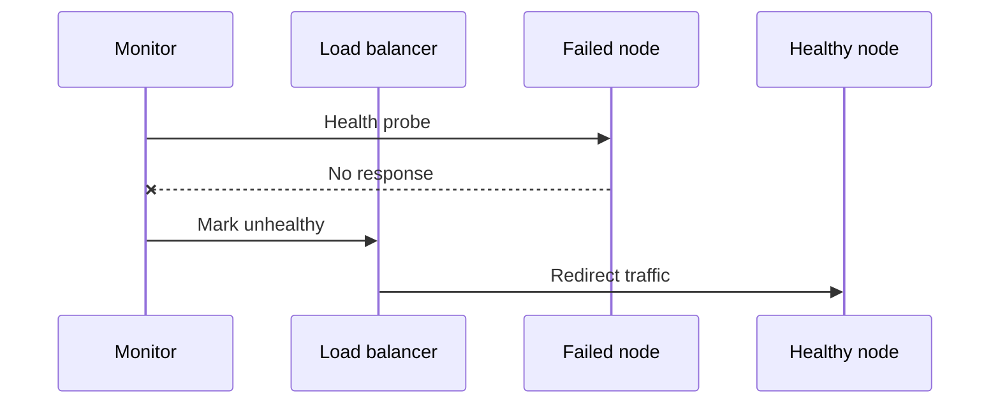

1. Monitor probes the component
2. Probe fails or heartbeat stops
3. Component marked unhealthy
4. Load balancer stops sending traffic
5. Failover promotes standby or redistributes load (patterns in [12.3](#123-active-active) and [12.4](#124-active-passive))

### Advantages

- Enables automatic failover without human intervention
- Reduces user-visible errors when combined with redundancy
- Provides early warning through alerting before total outage

### Disadvantages

- False positives can remove healthy nodes (flapping)
- Probe design must distinguish "alive" from "ready to serve"
- Aggressive timeouts increase false positives; lenient timeouts slow failover

### Best practices

- Separate **liveness** (process running) from **readiness** (can serve traffic)
- Use multiple probe types for critical services
- Tune timeouts and failure thresholds to avoid flapping
- Alert on repeated probe failures before automatic removal when appropriate

### Common mistakes

- Health endpoint returns 200 even when dependencies (database) are down
- Heartbeat without fencing — both nodes think the other failed (split-brain)
- No monitoring of the monitors themselves

### Summary

```text
Failure detection = health checks + heartbeats → mark unhealthy → remove from pool → failover
Foundation for HA, active-active redistribution, and active-passive promotion
```

---


## 12.3 Active Active

### Definition

**Active-active** is a high availability architecture in which two or more servers run simultaneously and all actively handle user requests.

Instead of keeping one server idle, every server participates in serving traffic. This improves both availability and performance.

### Why it exists

When traffic and availability requirements exceed what a single node can provide, active-active spreads load across redundant nodes. A single node failure reduces capacity but does not stop the service — remaining nodes absorb traffic after failure detection ([12.2](#122-failure-detection)) removes the failed instance.

### Basic architecture

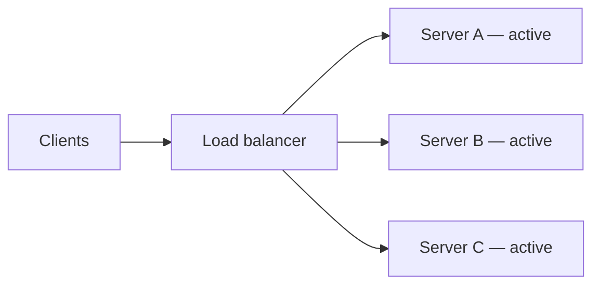

All servers process requests simultaneously.

### How it works

**Step 1 — Users send requests:**

```text
Client → HTTP request → load balancer
```

**Step 2 — Load balancer distributes among active servers:**

```text
Request 1 → Server A | Request 2 → Server B | Request 3 → Server C
Request 4 → Server A | Request 5 → Server B
```

**Step 3 — Each server processes work and returns the response.**

### Failure scenario

**Before failure:**

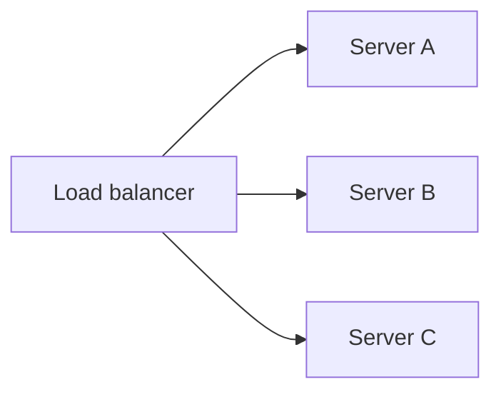

**Server B crashes:**

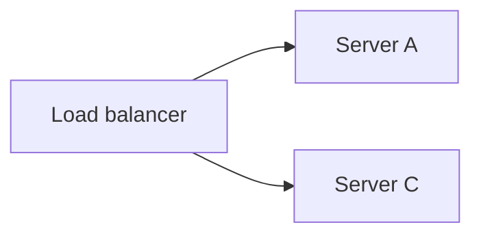

The load balancer detects Server B is unavailable (see [12.2](#122-failure-detection)) and stops sending requests to it. Users continue with little or no interruption.

### Server recovery

Once Server B is repaired:

1. Health check reports Server B is healthy
2. Load balancer adds it back to the pool
3. Traffic is shared among all servers again

### Load distribution methods

**Round robin** — requests sent one after another:

```text
Request 1 → A · Request 2 → B · Request 3 → C · Request 4 → A
```

**Least connections** — server with fewest active connections gets the next request:

```text
Server A: 40 · Server B: 15 · Server C: 22 → next request goes to Server B
```

**Weighted distribution** — traffic by server capacity:

```text
Server A (powerful): 60% · Server B: 20% · Server C: 20%
```

### Shared data and session management

Multiple servers need shared application data.

**Common approaches:** shared database · distributed cache · database replication · distributed file storage

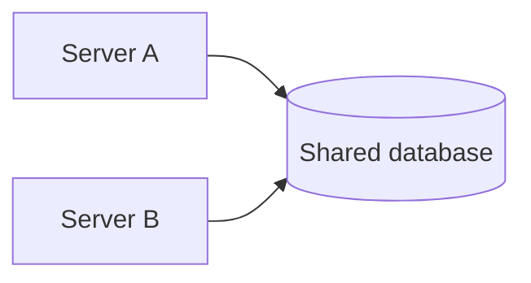

Requests can reach different servers, so session data should not live only in server memory.

**Option 1 — shared cache (e.g. Redis):**

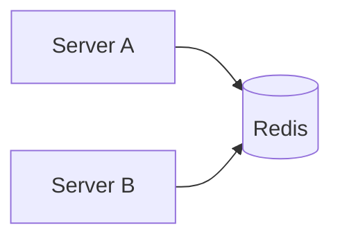

**Option 2 — stateless authentication** such as JWT (no server-side session affinity required).

### Advantages

- High availability and better resource utilization
- Higher throughput and improved scalability
- No idle standby server; maintenance often possible with minimal downtime

### Disadvantages

- More complex architecture and data synchronization
- Requires load balancer and careful session management
- Higher infrastructure cost than single-server setup

### When to use

E-commerce, banking, video streaming, social media, cloud APIs, online gaming, and large enterprise applications with heavy traffic.

### Real-world example

An online shopping website has three application servers behind a load balancer. Customer requests distribute across all three. When Server C crashes, remaining servers handle new requests. The website continues operating.

### Best practices

- Design for statelessness or externalize session state
- Monitor replication lag on shared data stores
- Test node failure regularly with chaos experiments ([12.10](#1210-chaos-engineering))

### Common mistakes

- Sticky sessions without failover plan for the session store
- Write conflicts when multiple nodes write the same records without coordination
- Assuming active-active removes the need for backups ([12.5](#125-backup-strategy))

### Summary

```text
Active-active = all servers live behind load balancer; failed nodes removed, recovered nodes rejoin
Share data (DB/cache) and sessions (Redis/JWT); compare with active-passive in 12.4
```

---


## 12.4 Active Passive

### Definition

**Active-passive** is a high availability architecture in which one server (**active**) handles all user requests while another server (**passive**) remains on standby.

The passive server does not normally process traffic. It stays ready to take over if the active server fails.

### Why it exists

Active-passive provides HA with simpler data consistency than active-active — only one node writes at a time. It suits workloads where standby capacity is acceptable and failover delay of seconds is tolerable.

### Basic architecture

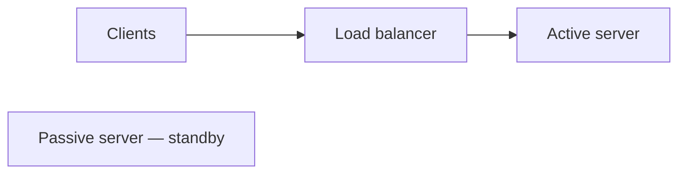

Only the active server handles requests. The passive server waits in standby mode.

### How it works

**Normal operation:**

```text
Client → HTTP request → load balancer → active server
```

The passive server remains idle but stays synchronized with the active server.

**Data synchronization** — important data is regularly copied from active to passive:

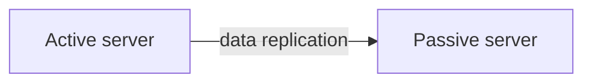

Synchronization may include application data, database changes, configuration files, and session information if required.

### Failure and failover

When the active server crashes, failure detection ([12.2](#122-failure-detection)) via health checks or heartbeat triggers automatic failover:

1. Active server marked unhealthy
2. Traffic to the failed server stops
3. Passive server becomes the new active server
4. Users continue accessing the application


### Server recovery

After the failed server is repaired:

1. Server starts again; data synchronization resumes
2. Server enters standby mode as the new passive node
3. Failback may be automatic or manual ([12.1](#121-high-availability))

### Advantages

- Simple architecture; easy to configure and troubleshoot
- Automatic failover; reduced risk of write conflicts
- Consistent request processing on a single active node

### Disadvantages

- Passive server mostly unused — lower hardware utilization
- Short interruption during failover
- Limited scalability — only one server handles requests at a time

### When to use

Banking applications, database servers, enterprise and legacy systems, internal business systems, and critical services where simplicity outweighs throughput scaling.

### Active-active vs active-passive

| | Active-active | Active-passive |
|---|---------------|----------------|
| **Servers** | All active | One active, one standby |
| **Traffic** | All handle requests | Backup waits until failover |
| **Utilization** | Better resource use | Some resources idle |
| **Scalability** | Higher | Lower |
| **Complexity** | More synchronization | Simpler architecture |
| **Failover** | Traffic redistributed | Small interruption; standby promotes |

### Real-world example

An online banking application uses two application servers. All customer requests route to the active server. If the active server crashes, health checks detect failure, the passive server promotes, and customers continue without manual intervention.

### Best practices

- Keep replication lag within acceptable RPO ([12.7](#127-rpo))
- Test failover and failback on a schedule
- Use fencing to prevent split-brain during network partitions

### Common mistakes

- Standby never tested — promotion fails when needed
- Session state only on active node without replication
- Confusing active-passive HA with disaster recovery ([12.9](#129-disaster-recovery))

### Summary

```text
Active-passive = one active + one standby; data replicated continuously; heartbeat/health checks trigger failover
Simpler than active-active; lower utilization; canonical comparison table above
```

---


## 12.5 Backup Strategy

### Definition

A **backup strategy** is a planned approach for creating, storing, managing, and retaining copies of data to protect against loss from hardware failures, software issues, accidental deletion, cyberattacks, or natural disasters.

### Why it exists

**Without backups:**

- Lost data may be impossible to recover
- Hardware failures and accidental deletion become permanent
- Recovery after ransomware becomes difficult

**With backups:**

- Data can be restored; business continuity improves
- Recovery from failures becomes repeatable and testable

### How backup works


If original data is lost, restore from backup storage back to the system. The restore process is covered in [12.6 Restore Strategy](#126-restore-strategy).

### Types of backup

**1. Full backup** — copies all selected data every time.

```text
Monday: all files → backup
```

| Advantages | Disadvantages |
|------------|---------------|
| Simple recovery · complete copy | Large storage · longer backup time |

**2. Incremental backup** — copies only data changed since the last backup of any type.

```text
Monday: full · Tuesday: changes since Monday · Wednesday: changes since Tuesday
```

| Advantages | Disadvantages |
|------------|---------------|
| Fast backup · small storage | Slower recovery — multiple backups needed |

**3. Differential backup** — copies all data changed since the last full backup.

```text
Monday: full · Tue/Wed/Thu: all changes since Monday
```

| Advantages | Disadvantages |
|------------|---------------|
| Faster recovery than incremental · simpler restore chain | Backup size grows until next full backup |

### Comparison of backup types

| Type | Copies | Size | Backup time | Recovery speed |
|------|--------|------|-------------|----------------|
| **Full** | All data | Largest | Longest | Fastest |
| **Incremental** | Changes since last backup | Smallest | Fastest | Slowest |
| **Differential** | Changes since last full | Medium | Medium | Medium |

How to chain these during restore is detailed in [12.6](#126-restore-strategy).

### Backup storage locations

| Location | Advantages | Disadvantages |
|----------|------------|---------------|
| **Local** (external drive, NAS) | Fast backup and recovery | Vulnerable to fire, theft, disasters |
| **Remote** (another site) | Geographic redundancy | Slower recovery (network-dependent) |
| **Cloud** | Scalable · off-site · high durability | Internet required · ongoing cost |

### Backup frequency and retention

Frequency depends on how often data changes:

| Data type | Frequency |
|-----------|-----------|
| Critical database | Every few minutes |
| Business applications | Every hour |
| Office documents | Daily |
| Archive data | Weekly or monthly |

**Retention policy** defines how long backups are kept:

```text
Daily backups — keep 30 days · Weekly — keep 3 months · Monthly — keep 1 year
```

### 3-2-1 backup rule

```text
3 copies: 1 original + 2 backups
2 different storage media (e.g. local disk + cloud)
1 copy off-site
```

```mermaid
flowchart LR
    Primary[Primary server] --> Local[Local backup]
    Primary --> Cloud[Cloud backup — off-site]
```

### Verification and encryption

Creating backups is not enough — test restores regularly ([12.6](#126-restore-strategy)). Verify integrity via restore tests, log checks, and monitoring backup job success.

Encrypt backups containing sensitive data to protect against unauthorized access during storage and transmission.

### Relationship to RPO

Backup frequency directly bounds **RPO** ([12.7](#127-rpo)) — the maximum acceptable data loss. Hourly backups imply up to one hour of lost data unless continuous replication is also used.

### Best practices

- Automate backup jobs; use the 3-2-1 rule
- Encrypt backup data; define retention policies
- Monitor success and failures; test restoration regularly
- Store backups in multiple geographic locations

### Common mistakes

- Backups that are never restored in tests
- Only local backups (lost in same disaster as primary)
- Incremental chains with missing intermediate backups

### Real-world example

Online shopping application — customer orders in a primary database:

```mermaid
flowchart LR
    DB[(Primary DB)] -->|full — Sunday| Cloud[Cloud storage]
    DB -->|incremental — hourly| Cloud
```

If the database is corrupted on Monday, recovery follows the restore chain in [12.6](#126-restore-strategy).

### Summary

```text
Backup strategy = what, when, where, how long to keep copies; full / incremental / differential
3-2-1 rule; verify and encrypt; frequency and retention match RPO; test restores, don't just backup
```

---


## 12.6 Restore Strategy

### Definition

A **restore strategy** is a planned process for recovering data, applications, or entire systems from backups after data loss, corruption, hardware failure, software failure, or disasters.

It builds on the backup types defined in [12.5 Backup Strategy](#125-backup-strategy).

### Why it exists

**Without a restore strategy:**

- Backups exist but cannot be restored efficiently
- Recovery takes longer; incorrect steps cause data inconsistency

**With a restore strategy:**

- Recovery is faster; downtime is reduced
- Data consistency is maintained; business continuity improves

### How restore works

```mermaid
flowchart LR
    Fail[Failure] --> Identify[Identify correct backup]
    Identify --> Restore[Restore data]
    Restore --> Verify[Verify integrity]
    Verify --> Resume[Resume operations]
```

The system returns to the last recoverable backup state.

### Types of restore

| Type | Scope | Used when |
|------|-------|-----------|
| **Full restore** | Complete system or all backed-up data | Complete system failure · disaster recovery |
| **File-level restore** | Selected files or folders | Accidental deletion · few corrupted files |
| **Database restore** | Entire database or selected tables | DB corruption · failed upgrades |
| **Bare metal restore** | Entire OS, apps, config, and data on new machine | Server hardware completely fails |

### Restore chains by backup type

**Full backup restore** — only one backup required:

```text
Sunday: full backup → failure → restore Sunday's backup (simple and fast)
```

**Incremental backup restore** — requires last full + every incremental after it:

```text
Sunday: full · Mon/Tue/Wed: incrementals → restore order:
1. Sunday full → 2. Monday incr → 3. Tuesday incr → 4. Wednesday incr
```

**Differential backup restore** — requires last full + latest differential:

```text
Sunday: full · Mon/Tue/Wed: differentials → restore order:
1. Sunday full → 2. Wednesday differential
```

### Restore timeline

```text
10:00 AM — database failure · 10:05 AM — identified · 10:10 AM — restore begins
10:25 AM — restore completed · 10:30 AM — users resume access
Total recovery time: 30 minutes
```

Restore duration directly affects **RTO** ([12.8](#128-rto)). Data age at restore point affects **RPO** ([12.7](#127-rpo)).

### Restore verification

After restoration, verify:

- Data completeness and absence of corruption
- Database consistency
- Application functionality
- User access

### Factors affecting restore time

Backup size · storage and hardware performance · network speed · backup type · integrity checks · recovery procedures

### Best practices

- Test restore procedures regularly (not just backup creation)
- Document restore steps; automate where possible
- Maintain multiple backup copies; prioritize critical systems first
- Review restore logs after every recovery

### Common mistakes

- Restoring incrementals out of order
- Skipping verification before resuming production traffic
- Restore runbooks that reference obsolete backup locations

### Real-world example

Online banking application: full backup every Sunday, incremental every hour. Database corrupted on Wednesday:

1. Restore Sunday's full backup
2. Restore every incremental backup after Sunday in order
3. Verify database consistency; restart banking services

Business operations resume with data loss bounded by the last successful incremental (RPO).

### Summary

```text
Restore strategy = documented, tested path from backup to running system
Match restore type to failure; chain incrementals correctly; verify after restore; align with RTO and RPO
```

---


## 12.7 RPO

### Definition

**Recovery Point Objective (RPO)** is the maximum amount of data loss an organization can tolerate after a failure or disaster.

It answers: *"How much data can we afford to lose?"*

RPO is measured in time: seconds · minutes · hours · days

### Why it exists

Business and regulatory requirements define how much historical data can disappear before impact is unacceptable. RPO drives backup frequency, replication design, and budget — tighter RPO costs more.

### Understanding RPO

Suppose a database is backed up every hour:

```text
09:00 AM — backup · 10:00 AM — backup · 10:30 AM — server crash
```

Latest backup: 10:00 AM. Data lost: 10:00 AM → 10:30 AM. **RPO = 30 minutes** (actual loss in this incident).

**Example — daily backup:**

```text
Day 1 — backup · Day 2 — system failure
All work after last backup is lost → RPO = 24 hours (by design)
```

### Low vs high RPO

**Low RPO** (e.g. 5 minutes) — very little data loss acceptable. Requires frequent backups, continuous replication, or real-time synchronization.

**High RPO** (e.g. 24 hours) — more data loss acceptable. Daily backups may suffice; lower cost and complexity.

| | Small RPO | Large RPO |
|---|-----------|-----------|
| **Advantages** | Less data loss · better continuity | Lower cost · simpler strategy |
| **Disadvantages** | Higher cost · complex replication | More data loss · greater business impact |

### How RPO is achieved

Techniques introduced in [12.5 Backup Strategy](#125-backup-strategy) and replication:

- Scheduled, incremental, and differential backups
- Database replication (sync or async)
- Continuous data replication, snapshots, log shipping

```mermaid
flowchart LR
    App[Application writes] --> Primary[(Primary DB)]
    Primary -->|sync| SyncRep[(Sync replica — RPO ~ 0)]
    Primary -->|async| AsyncRep[(Async replica — RPO = lag)]
    Primary -->|WAL / snapshots| Backup[(Backup store)]
```

### RPO in different systems

| System | Expected RPO | Reason |
|--------|--------------|--------|
| **Banking** | Near zero | Financial transactions cannot be lost |
| **E-commerce** | Few minutes | Recent orders and payments must be preserved |
| **Social media** | Several minutes | Small data loss may be acceptable |
| **Archive** | Hours or one day | Data changes infrequently |

### Factors affecting RPO

Backup frequency · replication method · storage and network reliability · business requirements · cost

### Relationship to RTO

RPO measures **data loss** (how far back in time you recover). **RTO** ([12.8](#128-rto)) measures **downtime** (how long until service is back). They are independent — a system can have RPO = 5 minutes and RTO = 4 hours, or the reverse.

### Real-world example

Online shopping application:

```text
10:00 AM — backup · 10:30 AM — orders placed · 10:45 AM — payments · 11:00 AM — failure
Latest backup: 10:00 AM — orders/payments from 10:00–11:00 AM are lost
RPO = 1 hour (actual loss); business may require RPO = 5 minutes → need continuous replication
```

### Best practices

- Define RPO per service tier, not one number for everything
- Match backup and replication design to RPO; test that restore delivers it ([12.6](#126-restore-strategy))
- Monitor replication lag as an operational SLO

### Common mistakes

- Confusing RPO with RTO
- Declaring RPO = 0 without synchronous replication and understanding latency trade-offs
- Hourly backups while claiming RPO = 5 minutes

### Summary

```text
RPO = max acceptable data loss measured in time; lower RPO = less loss, higher cost
Achieved via backups and replication; distinct from RTO (downtime, not data loss)
```

---


## 12.8 RTO

### Definition

**Recovery Time Objective (RTO)** is the maximum amount of time a system, application, or service can remain unavailable after a failure or disaster before it must be restored.

It answers: *"How quickly must the system be back online?"*

RTO is measured in time: seconds · minutes · hours · days

### Why it exists

Every hour of downtime has business cost. RTO defines the target recovery window and drives investments in HA ([12.1](#121-high-availability)), automation, and disaster recovery ([12.9](#129-disaster-recovery)).

### Understanding RTO

```text
Server crashes at 10:00 AM · Business requires availability by 10:30 AM
Maximum acceptable downtime: 30 minutes → RTO = 30 minutes
```

**Timeline example:**

```text
10:00 AM — failure · 10:10 AM — recovery starts · 10:25 AM — system restored
Total recovery time: 25 minutes (within 30-minute RTO — achieved)
```

### Low vs high RTO

**Low RTO** (e.g. 5 minutes) — requires automatic failover, redundant servers, HA, and fast restore procedures.

**High RTO** (e.g. 24 hours) — manual restoration from backups may suffice; lower architecture cost.

| | Small RTO | Large RTO |
|---|-----------|-----------|
| **Advantages** | Less downtime · better UX | Lower cost · simpler process |
| **Disadvantages** | Higher cost · complex architecture | Longer outages · revenue risk |

### How RTO is achieved

- High availability and automatic failover ([12.1](#121-high-availability), [12.4](#124-active-passive))
- Fast restore procedures ([12.6](#126-restore-strategy))
- Disaster recovery sites ([12.9](#129-disaster-recovery))
- Automated recovery scripts and regular testing

```mermaid
flowchart LR
    Fail[Failure] --> Detect[Detect]
    Detect --> Recover[Recover]
    Recover --> Validate[Validate]
    Validate --> Online[System operational]
```

### RPO and RTO on a single timeline

RPO and RTO measure different dimensions. Together they define the recovery window:

```mermaid
flowchart LR
    subgraph timeline [Failure timeline]
        LastGood[Last recoverable state] -->|RPO window — data loss| Failure[Failure occurs]
        Failure -->|RTO window — downtime| Restored[Service restored]
    end
```

- **RPO** — how far back the recovered data may be ([12.7](#127-rpo))
- **RTO** — how long users wait until service is available again

### RTO in different systems

| System | Expected RTO | Reason |
|--------|--------------|--------|
| **Banking** | A few minutes | Customers expect near-continuous availability |
| **E-commerce** | Minutes to one hour | Long outages lead to lost sales |
| **Social media** | Minutes to few hours | Short downtime may be acceptable |
| **Archive** | Hours or one day | Not used continuously |

### Factors affecting RTO

Recovery procedures · hardware availability · restore speed ([12.6](#126-restore-strategy)) · network connectivity · DR planning · automation · staff readiness

### Real-world example

Online banking application with active-passive failover:

```mermaid
sequenceDiagram
    participant Sys as System
    participant Mon as Monitoring
    participant FB as Failover
    participant Users as Users
    Sys->>Mon: 10:00 failure
    Mon->>FB: 10:02 detected
    FB->>FB: 10:03 failover begins
    FB->>Users: 10:07 users access app again
```

Total downtime: 7 minutes. If business requirement is RTO = 10 minutes, recovery succeeds.

### Best practices

- Measure end-to-end recovery time in drills, not individual step estimates
- Automate detection and failover; document manual steps that remain
- Align restore runbooks with RTO targets

### Common mistakes

- RTO met in theory but restore drills take hours
- Counting "service up" before data verification completes
- Ignoring DNS and client propagation delay in RTO calculations

### Summary

```text
RTO = max acceptable downtime after failure; lower RTO = faster recovery required
HA, failover, restore speed, and DR sites reduce RTO; distinct from RPO (data loss, not downtime)
```

---


## 12.9 Disaster Recovery

### Definition

**Disaster Recovery (DR)** is the process of restoring applications, services, infrastructure, and data after a major failure or disaster that HA alone cannot handle.

The goal is to minimize business disruption and restore normal operations as quickly as possible within RPO and RTO targets ([12.7](#127-rpo), [12.8](#128-rto)).

### Why it exists

**Disasters may include:** data center failure · fire · flood · earthquake · cyberattack · regional outage · human error

HA ([12.1](#121-high-availability)) handles component failures inside a site. DR handles events that take an entire site or region offline.

### Disaster recovery workflow

```mermaid
flowchart LR
    D[Disaster occurs] --> Detect[Failure detected]
    Detect --> Decide[Assess scope — HA or DR?]
    Decide --> Start[Recovery starts]
    Start --> Restore[Restore at DR site / from backup]
    Restore --> Validate[Validate RPO and RTO]
    Validate --> Users[Users reconnect]
```

1. Disaster occurs at the primary site
2. Monitoring detects outage ([12.2](#122-failure-detection))
3. Team or automation activates DR procedures
4. Applications and data restored from replicas or backups ([12.5](#125-backup-strategy), [12.6](#126-restore-strategy))
5. Traffic redirects to recovered environment; users reconnect

### Basic DR architecture

```mermaid
flowchart LR
    Users[Users] --> Primary[Primary data center]
    Primary -->|replication| DR[DR site]
```

**Normal:** primary serves users; DR site stays synchronized

**During disaster:** traffic redirects to the DR site

### Disaster recovery sites

A **DR site** is a secondary location where applications and data can run if the primary site is unavailable. Physical separation reduces correlated failure risk.

| Type | Characteristics |
|------|-----------------|
| **Cold site** | Basic infrastructure only; no running servers or current data · lowest cost · longest recovery · restore from backups |
| **Warm site** | Partially configured infra with some replicated data · moderate cost · faster than cold |
| **Hot site** | Fully operational copy of primary · highest cost · fastest recovery · near-real-time replication · minimal downtime |

### Recovery methods

**Backup recovery** — restore from backups at DR site (longer RTO; RPO depends on backup frequency):

```text
Backup storage → restore data → application
```

**Replication recovery** — data continuously copied to DR site (faster RTO; RPO depends on replication lag):

```mermaid
flowchart LR
    Primary[(Primary DB)] -->|continuous replication| Secondary[(DR DB)]
```

### DR strategies

- **Backup and restore** — periodic backups, restore after failure
- **Pilot light** — minimal DR environment always running; scale up on disaster
- **Warm standby** — reduced capacity DR environment running continuously
- **Hot site / multi-region** — full capacity in second region; fastest failover
- **Cloud DR** — cross-region replication, automated snapshots, managed backup services

### HA vs disaster recovery

| | High availability (HA) | Disaster recovery (DR) |
|---|------------------------|--------------------------|
| **Purpose** | Prevent interruption during normal failures | Recover from large-scale disasters |
| **Handles** | Server, disk, network failure | Data center loss, fire, flood, cyberattack |
| **Recovery time** | Usually seconds or minutes | Minutes to hours (strategy-dependent) |
| **Scope** | Single site, component level | Cross-site or cross-region |

### Challenges

- Backup consistency and replication delays
- Infrastructure cost and regular DR testing
- Recovery automation, network latency, security during recovery
- Large backup storage requirements

### Best practices

- Define RPO and RTO per tier; test recovery frequently
- Replicate critical data; store backups in separate geographic locations
- Automate failover where possible; keep runbooks current
- Run full DR drills, not just backup verification

### Real-world example

An online shopping company has two data centers with continuous replication.

**Normal:** users access primary; data replicated continuously

**Disaster:** fire damages primary; monitoring detects outage; traffic redirects to DR site; business resumes within RTO with data loss bounded by RPO

### Summary

```text
DR = restore apps, data, and infra after catastrophic failure; complements HA, does not replace it
Cold/warm/hot sites trade cost vs speed; align with RPO and RTO; test regularly
```

---


## 12.10 Chaos Engineering

### Definition

**Chaos engineering** is the practice of intentionally introducing failures into a system — often in production under controlled conditions — to verify it continues operating correctly under unexpected conditions.

The goal is to discover weaknesses before real failures affect customers.

### Why it exists

**Without chaos engineering:**

- Hidden failures and untested recovery paths remain undiscovered
- Weaknesses surface during real incidents instead of controlled experiments

**With chaos engineering:**

- System weaknesses are identified early
- Recovery mechanisms, monitoring, and DR plans are validated
- Confidence in production reliability increases

### How it works — experiment loop

**1. Define normal behavior** — steady state: response time, error rate, throughput, resource usage

**2. Form a hypothesis** — e.g. *"If one application server fails, users should still access the application."*

**3. Introduce controlled failure** — stop a server, disconnect network, increase latency, simulate disk failure

**4. Observe the system** — availability, latency, errors, logs, alerts

**5. Improve** — fix weaknesses; repeat experiment

```mermaid
flowchart LR
    Normal[Define normal] --> Hyp[Form hypothesis]
    Hyp --> Inject[Introduce failure]
    Inject --> Observe[Observe system]
    Observe --> Improve[Improve system]
    Improve --> Normal
```

### Example — server failure experiment

**Normal:**

```mermaid
flowchart LR
    Users[Users] --> LB[Load balancer]
    LB --> SA[Server A]
    LB --> SB[Server B]
```

**Experiment — stop Server A:**

```mermaid
flowchart LR
    Users[Users] --> LB[Load balancer]
    LB --> SB[Server B]
```

**Expected:** failure detection ([12.2](#122-failure-detection)) removes Server A; Server B handles traffic; no major outage.

### Common chaos experiments

| Experiment | Action | Validates |
|------------|--------|-----------|
| **Server failure** | Stop one app server | Active-active redistribution ([12.3](#123-active-active)) |
| **Database failure** | Stop primary DB | Failover and replication |
| **Network latency** | Inject delay | Timeouts and retries |
| **Region failure** | Isolate a region | DR failover ([12.9](#129-disaster-recovery)) |

For **component-level, targeted faults** (kill process, corrupt response, fill disk), see [12.11 Fault Injection](#1211-fault-injection).

### Chaos engineering vs traditional testing

| | Traditional testing | Chaos engineering |
|---|---------------------|-------------------|
| **Scope** | Expected scenarios in test environments | Unexpected failures, often in production (controlled) |
| **Goal** | Features work correctly | System stays reliable during failures |

### Best practices

- Start small; define clear success criteria and abort conditions
- Monitor continuously; run during low-risk periods initially
- Test one failure at a time; document results
- Stop immediately if severe issues or SLO breach occurs

### Common mistakes

- Chaos in production without blast-radius controls or rollback
- Experiments without hypothesis — observing without learning
- Running chaos instead of fixing known gaps (backups untested, etc.)

### Real-world example

Video streaming platform with three application servers. Experiment: shut down Server B. Health checks detect failure; load balancer routes to Servers A and C; users continue with little interruption — confirms HA and failure detection work.

### Summary

```text
Chaos engineering = controlled failures to find weaknesses before customers do
Hypothesis → inject → observe → fix; start small, monitor always, abort if SLO breached
Component-level faults: see 12.11 Fault Injection
```

---


## 12.11 Fault Injection

### Definition

**Fault injection** is the technique of deliberately introducing specific faults or errors into a system to observe how it behaves and verify it can detect, handle, and recover from failures correctly.

Unlike accidental failures, fault injection is planned, scoped, and measured.

### Why it exists

Fault injection validates **individual failure modes** — error handling, retries, circuit breakers, failover triggers — that chaos engineering may explore at broader system scope ([12.10](#1210-chaos-engineering)).

### How fault injection works

```mermaid
flowchart LR
    Define[Define fault] --> Predict[Predict behavior]
    Predict --> Inject[Inject fault]
    Inject --> Monitor[Monitor system]
    Monitor --> Analyze[Analyze results]
    Analyze --> Fix[Fix issues]
```

1. **Define the fault** — e.g. disconnect the database, add 500ms latency
2. **Predict expected behavior** — e.g. app shows friendly error and retries
3. **Inject the fault** in a controlled environment or scoped production blast radius
4. **Monitor** — availability, logs, alerts, latency, error rate, recovery time
5. **Analyze and fix** identified issues

### Types of faults

| Category | Examples |
|----------|----------|
| **Hardware** | Disk failure · memory failure · power loss |
| **Software** | Application crash · memory leak · configuration errors |
| **Network** | Packet loss · high latency · partition · timeout |
| **Storage** | Disk full · read/write failure · data corruption |
| **Database** | Shutdown · slow queries · connection failure · replication lag |

### Common fault injection experiments

| Experiment | Expected result |
|------------|-----------------|
| **Server crash** | Failure detection removes node; traffic moves to healthy servers ([12.2](#122-failure-detection)) |
| **Database failure** | Replica promoted; applications reconnect |
| **Network latency** | Timeouts and retries behave correctly |
| **Disk full** | Graceful errors; monitoring alerts |
| **Memory exhaustion** | Service restarts or alerts; no silent data corruption |

### Fault injection vs chaos engineering

| | Fault injection | Chaos engineering |
|---|-----------------|-------------------|
| **Purpose** | Test specific faults and component behavior | Test overall system resilience under controlled failures |
| **Examples** | Kill a process · disconnect DB · fill disk · network delay | Shut down servers · region failures · multi-component scenarios |
| **Focus** | Individual components and error-handling paths | End-to-end system reliability and recovery |

Both practices complement each other: fault injection validates building blocks; chaos engineering validates the assembled system.

### Best practices

- Begin with small, controlled faults; define expected outcomes first
- Monitor all critical metrics; automate repeatable injections
- Test recovery after each experiment; document findings
- Stop if critical business services are impacted

### Common mistakes

- Injecting faults without monitoring — cannot tell if behavior was correct
- Production fault injection without blast-radius limits
- Conflating a passed experiment with comprehensive resilience

### Real-world example

Online banking application with active-passive pair ([12.4](#124-active-passive)). Experiment: stop Server A. Health check detects failure; load balancer routes to Server B; customers continue — confirms failover works.

### Summary

```text
Fault injection = controlled, planned faults to validate detect/handle/recover behavior
Hardware, software, network, storage, DB faults; monitor throughout
Complements chaos engineering (12.10) at component level
```

---
