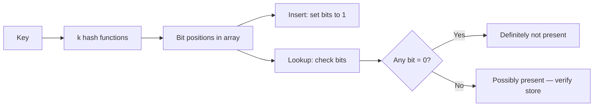
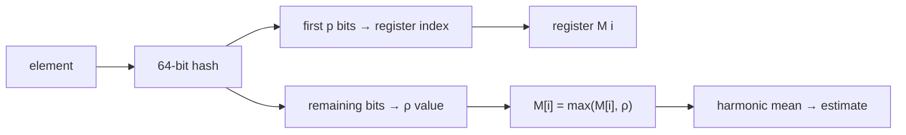
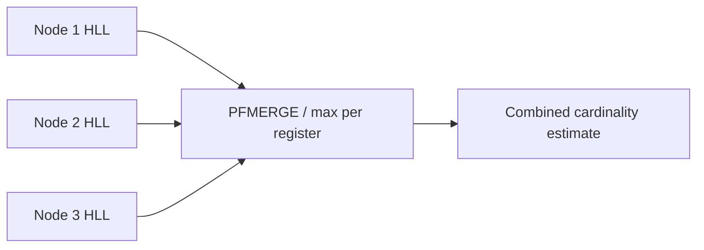
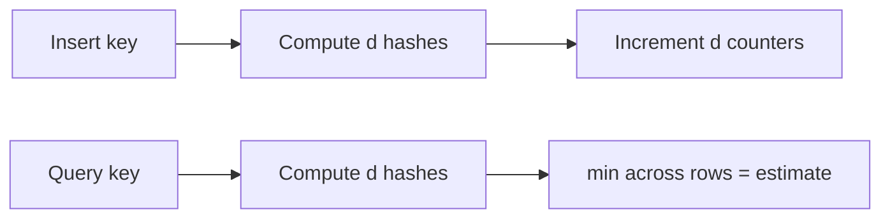
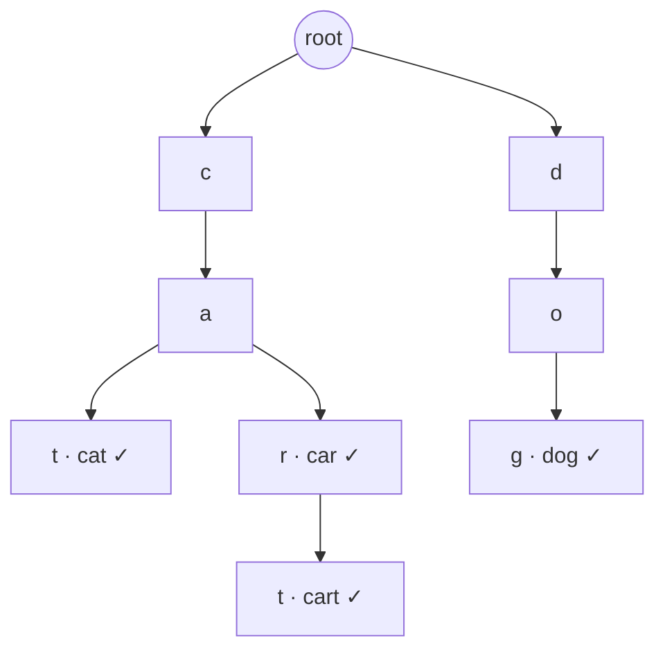
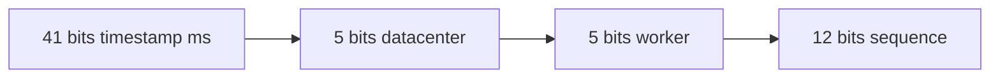
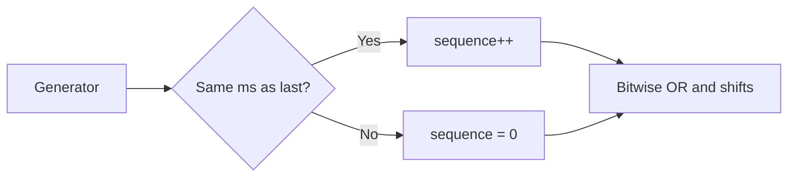
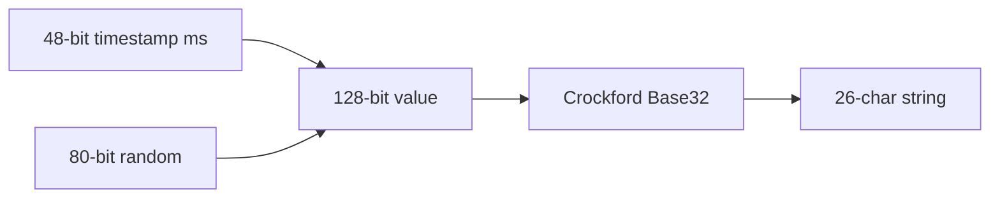

# 13. Advanced Topics

[<- Back to master index](../README.md)

---

## Sub-topics

| # | Sub-topic |
|---|-----------|
| 13.1 | [Bloom Filters](#131-bloom-filters) |
| 13.2 | [HyperLogLog](#132-hyperloglog) |
| 13.3 | [Count Min Sketch](#133-count-min-sketch) |
| 13.4 | [Trie](#134-trie) |
| 13.5 | [Skip Lists](#135-skip-lists) |
| 13.6 | [Merkle Trees](#136-merkle-trees) |
| 13.7 | [Distributed Hash Tables](#137-distributed-hash-tables) |
| 13.8 | [UUID](#138-uuid) |
| 13.9 | [Snowflake IDs](#139-snowflake-ids) |
| 13.10 | [ULID](#1310-ulid) |
| 13.11 | [KSUID](#1311-ksuid) |

---


## 13.1 Bloom Filters

### Overview

Picture a library with a billion books and no card catalogue. Every time someone asks for a title, a librarian walks every aisle. That is what happens when a large system hits a database or disk for every key — costly and mostly wasteful, because most lookups are for things that were **never stored**. A Bloom filter is the **quick first question** before the expensive one: it cannot replace the database, but it can stop you from asking thousands of times per second for keys you already know do not exist.

Technically, a **Bloom filter** is a tiny bit array plus `k` hash functions that answers “might this key exist?” in O(k) time. Invented by Burton Bloom in 1970, it does not store actual keys — only a compact pattern of bits built from them. It **never** wrongly clears a real member (no false negatives on a standard filter), but may occasionally send you to the database for a key that was never there (a **false positive**). Size it with bit array length `m`, expected element count `n`, and hash count `k` for your target error rate; treat “possibly present” as a hint and always confirm with the real store.

---

### What problem it fixes

Large systems repeatedly ask membership questions:

- Does this user ID exist?
- Have we crawled this URL before?
- Is this product ID in our cache?
- Could this key be on disk in this SSTable?

Storing every key in a hash set works but consumes enormous RAM — billions of URLs at ~50 bytes each can mean tens of gigabytes. Querying the database or disk on every miss is even worse when attackers or bugs send millions of requests for keys that **never existed** (cache penetration).

The Bloom filter fixes this trade-off:

```text
Bloom says "definitely NOT here"  →  skip the expensive lookup (safe)
Bloom says "MAYBE here"         →  check the real store to confirm
```

It accepts a small, tunable rate of **false positives** (saying “maybe” when the key was never inserted) in exchange for huge memory savings and speed. It **never** gives a false negative on a standard filter — if something was inserted, it will not say “definitely not here.”

---

### What it does

A Bloom filter supports two operations on a set of keys:

**Insert** — record that a key was seen (set bits in the array).

**Lookup (membership test)** — answer one of two things only:

1. **Definitely not present** — this key was never inserted.
2. **Possibly present** — this key might exist; go verify with the authoritative source (database, disk, cache).

It does **not** tell you how many items are stored, list members, or delete keys in the standard form. It is a **probabilistic set membership sketch**, not a full database.

---

### Compared to the alternative

**Hash set (exact membership):**

```text
Store every key + metadata        Memory = O(n) per distinct key (~tens of bytes each)
Lookup: exact present / absent    Billions of keys → impractical RAM
```

**Bloom filter (approximate membership):**

```text
Fixed bit array (e.g. ~1 MB)      Memory = O(m) bits — size set at build time
Lookup: definitely NOT or MAYBE   False positives possible; false negatives never (standard filter)
```

Bloom wins as a **cheap guard** in front of disk or DB (“skip read if definitely absent”). Hash sets win when you need **exact membership** or enumeration.

---

### How it works — the algorithm inside

#### Step 1 — Hash the key to spread bits uniformly

Each key passes through hash functions that map to indices `0 … m − 1`. Real implementations often use **double hashing** — one base hash plus offsets — to simulate `k` independent positions cheaply:

```text
h_i(key) = (h1(key) + i × h2(key)) mod m     for i = 0 … k−1
```

Uniform spread matters: clustered hashes inflate false positives because unrelated keys collide on the same bits.

#### Step 2 — Insert: set k bits (never clear)

```text
function insert(key):
    for i = 1 to k:
        bit_array[hash_i(key)] = 1
```

Setting a bit that is already `1` is a no-op. Overlaps between keys are expected — that is how memory stays small, and also how false positives arise.

#### Step 3 — Lookup: one zero means definite absence

```text
function lookup(key):
    for i = 1 to k:
        if bit_array[hash_i(key)] == 0:
            return DEFINITELY_NOT_PRESENT
    return POSSIBLY_PRESENT
```

If **any** probed bit is `0`, the key was **never** inserted (no false negatives on standard filters). All `k` bits `1` → **maybe** — confirm with the authoritative store.

#### Step 4 — False positives and sizing trade-off

Collisions accumulate as `n` grows toward `m`. Size `m` and `k` from target error rate `p` (see calculation block below). More bits → fewer false positives; more hash functions → sharper discrimination up to an optimum, then diminishing returns.

#### Step 5 — Mini state after two inserts (toy m = 10, k = 3)

Use the fruit walkthrough below for a worked bitmap — after `"Apple"` and `"Banana"`, `"Orange"` may still read as **possibly present** when bits 2, 5, 7 were set only by other keys.



| Operation | Complexity | Notes |
|-----------|------------|-------|
| Insert | O(k) | k fixed at design time (~7 for 1% p) |
| Lookup | O(k) | No dependence on n inserted |
| Memory | O(m) bits | Fixed; does not store keys |

---

### Walkthrough: inserting and looking up fruit names

Use a toy bit array of size 10 and three hash functions.

**Start:** all zeros.

```text
Index:  0  1  2  3  4  5  6  7  8  9
Bits:   0  0  0  0  0  0  0  0  0  0
```

**Insert `"Apple"`** — hashes land at positions 2, 5, 8:

```text
Hash1(Apple) = 2    Hash2(Apple) = 5    Hash3(Apple) = 8

Result:  0  0  1  0  0  1  0  0  1  0
```

**Insert `"Banana"`** — positions 1, 5, 7. Position 5 was already 1 from Apple; that overlap is normal.

```text
Hash1(Banana) = 1    Hash2(Banana) = 5    Hash3(Banana) = 7

Result:  0  1  1  0  0  1  0  1  1  0
```

**Lookup `"Apple"`** — check 2, 5, 8 → all 1 → **possibly present** (and it really is).

**Lookup `"Orange"`** — hashes to 0, 4, 9. Bit 4 is still 0 → **definitely not present**. No need to hit the database.

This is the filter doing its best work: a cheap, certain rejection.

---

### False positives — when the filter is wrong (in one direction only)

A **false positive** means the filter says “possibly present” for a key that was **never** inserted.

Continuing the fruit example — suppose `"Orange"` hashes to positions 2, 5, and 7. All three are already 1 because of Apple and Banana, even though Orange was never added:

```text
Apple  →  bits 2, 5, 8
Banana →  bits 1, 5, 7
Orange →  bits 2, 5, 7   (never inserted, but all bits are 1)
```

The filter cannot tell Orange apart from a real member without checking the real store. That extra DB read is the price of sharing bits.

A **false negative** (saying “not present” when the key **was** inserted) does **not** happen in a standard Bloom filter, as long as bits are never cleared and the key was inserted correctly. Every inserted key leaves all its bits set to 1 permanently.

False positives rise when:

- Too many keys are packed into too small an array.
- Too few or too many hash functions are used.
- Hash functions cluster keys on the same bits.

They fall when you allocate more bits per expected key and choose `k` using the sizing formulas below.

---

### Sizing the filter — choosing `m`, `k`, and acceptable error

Before deployment you decide:

- `n` — how many keys you expect to insert.
- `p` — maximum false-positive rate you can tolerate (e.g. 1%).

**Optimal number of hash functions:**

```text
k = (m / n) × ln(2)     ≈ 0.693 × (m / n)
```

**Approximate false-positive probability:**

```text
p ≈ (1 − e^(−kn/m))^k
```

**Bits needed for target `p` and `n`:**

```text
m ≈ −(n · ln p) / (ln 2)²
```

**Example:** 1 million keys, 1% false-positive target:

**How to calculate:**

```text
Given:  n = 1,000,000 keys,  p = 0.01 (1% false-positive rate)

Step 1 — bits needed (m):
  ln(p) = ln(0.01) ≈ −4.605
  (ln 2)² ≈ 0.480
  m = −(n × ln p) / (ln 2)²
    = (1,000,000 × 4.605) / 0.480
    ≈ 9,600,000 bits
    ≈ 1.2 MB  (divide by 8 for bytes, then ÷ 1024² for MB)

Step 2 — hash functions (k):
  k = (m / n) × ln(2)
    ≈ (9.6 × 0.693)
    ≈ 6.6  →  round to 7 hash functions

Step 3 — sanity check false-positive rate:
  p ≈ (1 − e^(−kn/m))^k
    ≈ (1 − e^(−7×1M/9.6M))^7
    ≈ 1%  ✓
```

Rule of thumb: about **10 bits per element** gives roughly **1%** false positives. Double the bit array size to quarter the error rate.

Compared to storing 1 billion URLs in a hash set (~50 GB), a Bloom filter for the same membership checks might use **hundreds of megabytes** — orders of magnitude less, with a known false-positive rate you size upfront.

---

### Variants worth knowing

| Variant | What it adds |
|---------|--------------|
| **Counting Bloom filter** | Small counters per slot instead of single bits — supports safe delete (increment on insert, decrement on delete). |
| **Scalable Bloom filter** | Stack a new filter when the current one fills — unbounded growth with controlled error. |
| **Blocked / partitioned** | Cache-friendly layouts for high-QPS systems like RocksDB. |

Standard Bloom filters **cannot delete** by clearing a bit — another key may share that bit:

```text
Apple and Banana both set bit 5.
Clearing bit 5 to "remove Apple" would break Banana.
```

---

### Bloom filter vs hash set

| | Hash set | Bloom filter |
|---|----------|--------------|
| Stores actual keys | Yes | No — bits only |
| Memory | High (O(n)) | Very low (fixed `m`) |
| Lookup | O(1) average | O(k) |
| False positives | Never | Yes — tunable |
| False negatives | Never | Never (standard) |
| Delete / list members | Yes | No (standard) |

Use a hash set when you need exact membership and enumeration. Use a Bloom filter when you need a **cheap pre-filter** in front of something expensive.

---

### Pitfalls and design tips

- **Standard Bloom cannot delete** — clearing a bit breaks other keys; use a **counting Bloom filter**, **cuckoo filter**, or periodic full rebuild when membership shrinks.
- **Simulate `k` hashes cheaply** with double hashing: `g_i(x) = h1(x) + i × h2(x) mod m` — one pass, fewer hash calls.
- **Size for peak `n`** — once the filter is overfilled, false-positive rate climbs fast; monitor FP rate or rebuild when key count grows past the design target.
- **Not for cardinality** — “how many unique keys?” is HyperLogLog ([13.2](#132-hyperloglog)), not Bloom.
- **Production:** RedisBloom (`BF.ADD` / `BF.EXISTS`), Guava `BloomFilter`, RocksDB/LevelDB per-SSTable filters.
- **Union of filters** (same `m`, `k`, hash seeds): bitwise OR of bit arrays — useful when merging shard-level filters.

---

### Real-world example: stopping cache penetration

A product API caches details by `product_id`. Attackers (or bugs) request random IDs that were never issued — every cache miss hits the database (**cache penetration**).

**Setup (sized using the calculation above):**

```text
n = 1,000,000 valid product IDs
p = 1% acceptable false-positive rate
→ m ≈ 1.2 MB Bloom filter in memory
```

**Request path:**

```text
Request for product_id K
  → Bloom.contains(K)?
      NO  → return 404 immediately (safe — key never issued)
      YES → check cache → on miss, query DB (rare false positive = one extra DB read)
```

**Where this appears in production:** **RocksDB** and **LevelDB** attach a Bloom filter to each SSTable file so the engine skips disk reads when a key is **definitely not** in that file. **RedisBloom** (`BF.ADD` / `BF.EXISTS`) uses the same pattern in front of a cache or database.

---

## 13.2 HyperLogLog

### Overview

Imagine a music festival trying to count **how many different people** attended — not total ticket scans (the same person can enter many times), but **unique visitors**. Writing down every name in a notebook works for hundreds of guests but fails at millions. You need a rough headcount without storing every identity.

Technically, **HyperLogLog (HLL)** estimates **cardinality** — the number of **distinct** elements in a stream — using **fixed memory** (~12 KB for billions of uniques). It never stores the elements themselves. It hashes each item, watches patterns in the hash bits (especially leading zeros), and combines small **registers** into an approximate count with ~1–2% error. Sketches **merge** across nodes by taking the max per register (`PFMERGE` in Redis).

---

### What problem it fixes

Systems constantly need “how many **unique** X”:

- Unique visitors today
- Distinct IP addresses in logs
- Distinct search queries
- Unique devices in an ad campaign

A **hash set** of every value uses O(n) memory — billions of IDs is impractical. `COUNT DISTINCT` in a database over billions of rows is slow and expensive. HLL gives a **streaming, fixed-size** approximate answer you can update per event and merge across data centers.

---

### What it does

**Insert (add)** — process one element; update internal registers. O(1) per element.

**Query (estimate)** — return approximate distinct count from current registers.

It does **not** tell you which items were seen, whether a specific item was seen (that is a Bloom filter), or exact counts. It answers **one question**: “about how many unique values have passed through?”

---

### Compared to the alternative

**Hash set / `COUNT DISTINCT` (exact):**

```text
Each unique value stored once     Memory = O(n) — grows with every new distinct ID
Query: exact cardinality          Billions of uniques → GB of RAM or heavy DB scan
```

**HyperLogLog (approximate):**

```text
Fixed register array (~12 KB)     Memory = O(1) — same size at 1K or 1B uniques
Query: estimated cardinality      ~1–2% error; merge across nodes with PFMERGE
```

HLL wins when you need **streaming distinct counts at scale** and can tolerate small error. Exact sets win for **billing, compliance, or small cardinalities** where wrong counts are unacceptable.

---

### How it works — the algorithm inside

#### Step 1 — Hash every element

Each incoming value is passed through a hash function that produces a long, pseudo-random bit string. The same input always produces the same hash; different inputs spread evenly across all possible bit patterns.

```text
"apple"  → 1011001010010110...
"banana" → 0000100110101101...
"orange" → 1100010101010010...
```

Hashing turns arbitrary strings (user IDs, IPs, URLs) into uniform random-looking bits. Without that, the leading-zero trick in the next steps would not work.

---

#### Step 2 — Pick a register from the first bits

The hash is split in two. The **first `p` bits** choose which register to update. The **remaining bits** are used in Step 3.

```text
Hash:  1010 000101101001...
       │───│
         ↓
Register index = 1010₂ = 10   (register R10)

Remaining bits: 000101101001...
                ↑ used next
```

If precision `p = 14`, there are **m = 2¹⁴ = 16,384 registers**. The first 14 bits of every hash pick one of those buckets. Think of it as dealing each element to one of 16,384 mail slots — many elements land in the same slot, but that is expected.

---

#### Step 3 — Count leading zeros in the remaining bits

After the index bits, scan the rest of the hash from left to right and count how many **0** bits appear before the first **1**.

```text
Remaining bits:  000101101...
                 ^^^
Leading zeros = 3

Stored value ρ = 4   (position of the first 1, counting from 1)
```

**Why leading zeros?** In a fair random bit string, long runs of zeros are rare. The more **distinct** elements you hash, the more chances you get to see unusually long zero runs somewhere in the register array.

| Leading zeros before first 1 | Approximate probability |
|------------------------------|-------------------------|
| 0 | 1/2 |
| 1 | 1/4 |
| 2 | 1/8 |
| 3 | 1/16 |
| k | 1 / 2^(k+1) |

A register that has seen many different hashes is more likely to have recorded a large ρ value — a signal that this bucket has been "busy."

---

#### Step 4 — Update the register (keep the maximum)

Each register stores only **one number**: the largest ρ value ever observed for that bucket. New elements either raise the max or are ignored.

```text
Register M[10] currently = 4
New element hashes to ρ = 6

M[10] = max(4, 6) = 6
```

Registers **never decrease**. Duplicates that hash to the same register with the same or smaller ρ change nothing — which is why re-adding `"apple"` does not inflate the distinct count.

```text
function add(element):
    h   = hash(element)                    // e.g. 64-bit hash
    i   = first_p_bits(h)                  // register index
    rho = position_of_first_one(h, after_p) // leading zeros + 1
    M[i] = max(M[i], rho)
```

---

#### Step 5 — Estimate cardinality from all registers

After processing the stream, every register holds a small integer. HyperLogLog combines them with a **harmonic mean** formula (plus bias correction in **HLL++** for small sets):

```text
E ≈ α_m × m² / Σ(2^−M[i])
```

`α_m` is a constant that depends on `m`. You do not need to implement this by hand — Redis, BigQuery, and other libraries handle it. The intuition: if many registers hold large values, the stream probably contained many unique elements; if most registers are still near zero, the distinct count is probably small. **HLL++** adds bias correction when the true count is small (roughly under ~1,000).



---

#### Worked example — four registers

Start with all registers at zero:

```text
R0 = 0    R1 = 0    R2 = 0    R3 = 0
```

**Process `"apple"`**

```text
Hash:  00 000101...
       ││
       R0

Leading zeros in remainder = 3  →  ρ = 4

R0 = 4    R1 = 0    R2 = 0    R3 = 0
```

**Process `"orange"`**

```text
Hash:  00 0000001...
       ││
       R0   (same bucket as apple — possible when m is small)

Leading zeros in remainder = 6  →  ρ = 7

R0 = max(4, 7) = 7    R1 = 0    R2 = 0    R3 = 0
```

**Process `"apple"` again** — duplicate. Same hash, same register, same ρ. Register stays at 7.

Only the **strongest signal per bucket** is kept. After millions of distinct IDs, the pattern of register values feeds the estimator.

---

#### Merging two sketches

Each server (or shard) can maintain its own HyperLogLog. To combine them, take the **element-wise maximum** — the same rule as a single register update, applied across the whole array:

```text
Server A:  [3, 6, 2, 5]
Server B:  [4, 2, 7, 3]
                    ↓
Merged:    [4, 6, 7, 5]   = max per position
```

```text
M_merged[i] = max(M_A[i], M_B[i])   for every register i
```

No raw events need to be shipped — only a few kilobytes per node. Redis exposes this as `PFMERGE`.



Each edge server counts locally; a central job merges sketches without shipping raw IPs.

---

#### Complexity

| Operation | Complexity | Notes |
|-----------|------------|-------|
| Add one element | O(1) | One hash + one register update |
| Merge two HLLs | O(m) | `m` = number of registers |
| Estimate count | O(m) | Scan all registers once |
| Memory | O(m) | Fixed — typically a few KB |

Typical production config: `p = 14` → **m = 16,384 registers** → **~12 KB** per sketch, standard error ≈ **0.8%**.

**How to calculate memory and error:**

```text
Given:  precision p = 14

Step 1 — number of registers:
  m = 2^p = 2^14 = 16,384 registers

Step 2 — memory (Redis HLL uses 6 bits per register):
  16,384 × 6 bits = 98,304 bits ≈ 12 KB

Step 3 — standard error (approximate):
  error ≈ 1.04 / √m
        ≈ 1.04 / 128
        ≈ 0.008  →  about 0.8% relative error
```

---

### HyperLogLog vs exact distinct count

| | Hash set / exact | HyperLogLog |
|---|------------------|-------------|
| Memory | O(n) | O(1) fixed ~12 KB |
| Accuracy | Exact | ~1–2% error |
| List members | Yes | No |
| Merge shards | Ship all keys | Max registers |

Do not use HLL for billing or compliance requiring exact counts. Do not confuse with Bloom filter (membership) or Count-Min Sketch (per-key frequency).

---

### Pitfalls and design tips

- **Sketches must share the same precision** (`p`, register count) to merge — mixing precisions invalidates `PFMERGE`.
- **Duplicates do not increase the count** — only distinct values matter; re-adding the same user ID is a no-op.
- **Small sets are biased** — use **HLL++** bias correction, or exact counting below ~1,000 uniques then switch to HLL.
- **Not membership** — HLL cannot answer “have we seen this IP before?” (Bloom filter or hash set).
- **Production:** Redis `PFADD` / `PFCOUNT` / `PFMERGE`, BigQuery `APPROX_COUNT_DISTINCT`, Elasticsearch `cardinality`, Postgres `hyperloglog` extension, Druid HyperUnique.
- **Interview angle:** explain why max-per-register merge works — each register tracks the “longest zero run” seen for its bucket; union of streams takes the max across nodes.

---

### Real-world example: daily unique visitors (Redis HyperLogLog)

A web app needs “how many **distinct** client IPs visited today?” without storing every IP in a hash set.

**Per-server counting:**

```text
# Each app server increments the same Redis key with each new request IP
PFADD visitors:2025-06-24 "203.0.113.10"
PFADD visitors:2025-06-24 "198.51.100.5"
PFADD visitors:2025-06-24 "203.0.113.10"   # duplicate — count stays ~2, not 3

PFCOUNT visitors:2025-06-24
→ approximate distinct IP count (e.g. 48,231)
```

**At scale:** the entire sketch for a day fits in ~12 KB per Redis key; many app servers can `PFADD` the same key concurrently without shipping raw IPs to a central counter.

---


## 13.3 Count Min Sketch

### Overview

Picture a busy API gateway that must know whether a client is **hammering the same endpoint** thousands of times per minute — but there are millions of possible API keys and you cannot store a counter for every key in RAM. You need “about how many times did key X call us” without a full hash map.

Technically, a **Count-Min Sketch (CMS)** is a `d × w` matrix of counters updated by `d` hash functions. Each event increments `d` cells; querying a key returns the **minimum** across those cells as the frequency estimate. Memory is **fixed** O(d × w). Estimates **never underestimate** (only overestimate) — safe for rate limits where missing abuse is worse than a false alarm.

---

### What problem it fixes

Streaming systems need **per-key frequency**:

- Requests per API key
- Packets per source IP
- Clicks per ad ID
- Search queries per keyword

Exact counting needs a hash map `key → count` that grows with distinct keys — untenable at billions of keys. CMS trades exactness for a bounded `d × w` matrix (see comparison below).

---

### What it does

**Update (insert)** — increment `d` counters for key `x`.

**Query** — return `min(CMS[i][h_i(x)])` as estimated frequency of `x`.

It does not list keys, delete counts (standard CMS), or give exact billing numbers. It is a **frequency sketch**, not a database.

---

### Compared to the alternative

**HashMap (exact per-key counts):**

```text
Input stream          HashMap                    Memory grows
─────────────         ───────                    with distinct keys
Apple                 Apple  → 3
Banana                Banana → 2
Apple                 Orange → 1
Orange
Apple
Banana

Search / update = O(1) per key    Counts exact
```

**Count-Min Sketch (approximate frequencies):**

```text
Input stream          Small 2D counter table     Fixed memory
─────────────         (d rows × w columns)       (~KB, not GB)
Apple                      ↓
Banana                Estimated counts:
Apple                 Apple  ≈ 3
Orange                Banana ≈ 2
Apple                 Orange ≈ 1
Banana

Update / query = O(d)             May overcount; never undercounts
```

CMS wins for **fixed-memory per-key frequency** on unbounded streams. Hash maps win for **exact counts** and when distinct key count fits in RAM.

---

### How it works — the algorithm inside

#### Step 1 — Create the counter matrix

CMS is a **`d × w` array** — `d` rows (one hash function each), `w` columns (counter buckets).

Example: **3 hash functions**, **5 counters per row**:

```text
           C0  C1  C2  C3  C4
H1  -->    0   0   0   0   0
H2  -->    0   0   0   0   0
H3  -->    0   0   0   0   0
```

Each row uses a **different** hash function so a collision in one row is unlikely to repeat in all rows.

---

#### Step 2 — Hash the element

For every insert or query, map the key to one column index **per row**:

```text
"apple"  →  H1(apple) = 2
            H2(apple) = 4
            H3(apple) = 1
```

Hashing spreads keys across columns uniformly. Without that, a few hot columns would dominate every estimate.

---

#### Step 3 — Increment counters on insert

Each insertion adds `+1` (or `+count`) to **one counter in every row** — the column chosen by that row's hash (Step 2).

```text
function update(key, count = 1):
    for i = 1 to d:
        j = hash_i(key)
        CMS[i][j] += count
```

See the **worked example** below for table state after each insert.

---

#### Step 4 — Query: take the minimum across rows

1. Hash the key with all `d` functions.
2. Read the `d` counter values.
3. Return **`min(...)`** — the smallest value is the estimate.



---

#### Why the minimum? (collisions only inflate)

Counters are **shared**. If `"banana"` hashes to the same bucket as `"apple"` in row 2, that cell counts **both** keys:

```text
"apple" inserted 5 times; "banana" collides in row H2

H1 → 5
H2 → 8   ← inflated by banana's hits
H3 → 5

max(5, 8, 5) = 8   ✗ overcounts apple
avg(5, 8, 5) = 6   ✗ still high
min(5, 8, 5) = 5   ✓ closest to true count for apple
```

Collisions **add** to counters — they never subtract. So CMS **never underestimates** a key's frequency; it may **overestimate** when other keys share buckets. The minimum across independent rows is the least contaminated estimate.

---

#### Worked example — `"apple"` twice

Using the empty **3 × 5** matrix from Step 1. Hashes: `H1→C2`, `H2→C4`, `H3→C1`.

**After first `"apple"`:**

```text
           C0  C1  C2  C3  C4
H1  -->    0   0   1   0   0
H2  -->    0   0   0   0   1
H3  -->    0   1   0   0   0
```

**After second `"apple"`** (`+1` on the same three cells):

```text
           C0  C1  C2  C3  C4
H1  -->    0   0   2   0   0
H2  -->    0   0   0   0   2
H3  -->    0   2   0   0   0
```

**Query `"apple"`:** `min(2, 2, 2) = 2` ✓

---

#### Merging sketches

Two CMS instances with the **same `d`, `w`, and hash seeds** merge by **adding** matrices cell-wise — same idea as unioning two streams' event counts:

```text
Sketch A[i][j] + Sketch B[i][j]  →  Merged[i][j]
```

Useful when each edge node counts locally and a central job combines without replaying raw events.

---

#### Complexity

| Operation | Complexity | Notes |
|-----------|------------|-------|
| Add element | O(d) | `d` hash + increment |
| Query count | O(d) | `d` hash + min |
| Merge sketches | O(d × w) | Element-wise add |
| Memory | O(d × w) | Fixed — `w` = width, `d` = depth (hash rows) |

---

### Sizing — choosing `w` and `d`

With probability `(1 − δ)`:

```text
error ≤ ε × N     where N = total events in stream
ε ≈ 1/w           δ ≈ e^(−d)

w = ⌈e / ε⌉
d = ⌈ln(1 / δ)⌉
```

**How to calculate:**

```text
Given:  ε = 0.01 (1% error bound),  δ = 0.001 (0.1% failure probability)

Step 1 — columns (w):
  w = ⌈e / ε⌉ = ⌈2.718 / 0.01⌉ = ⌈271.8⌉ = 272

Step 2 — rows (d):
  d = ⌈ln(1 / δ)⌉ = ⌈ln(1000)⌉ = ⌈6.91⌉ = 7

Step 3 — memory (32-bit counters):
  w × d × 4 bytes = 272 × 7 × 4 = 7,616 bytes ≈ 7.4 KB per sketch

Step 4 — what the guarantee means:
  With probability 99.9%, estimated count for any key is within
  ε × N of the true count, where N = total events in the stream.
  (Heavy keys are estimated more tightly in practice.)
```

---

### Pitfalls and design tips

- **Only overestimates, never under** — safe for rate limits and “top talkers”; wrong for exact billing without a promotion path to exact counters.
- **Point queries only** — estimates frequency of a **known key**; CMS does not list all keys or do range counts without extra structures.
- **Count-Min vs Count-Median Sketch** — CMS is simpler and one-sided; Count Sketch can underestimate (median of rows) but tighter on some distributions.
- **Decay / windows** — standard CMS has no time window; use sliding windows (array of sketches), **exponential decay**, or rotate sketches hourly for “requests in last 5 minutes.”
- **Production:** Apache DataSketches, Redis Stack CMS (where available), stream processors (Flink approximate aggregations). Pair with a heap for **heavy hitters** — promote keys above threshold to exact counters.

#### Probabilistic sketches — how they differ

| Question | Structure | Section |
|----------|-----------|---------|
| “Might this key exist?” | Bloom filter | [13.1](#131-bloom-filters) |
| “How many **unique** values?” | HyperLogLog | [13.2](#132-hyperloglog) |
| “How many times did **this key** appear?” | Count-Min Sketch | [13.3](#133-count-min-sketch) |

---

### Real-world example: per-key request counting at scale

A streaming analytics job tracks “how many events did **this user ID** emit?” across millions of users — storing a hash map `user_id → count` for every user is too large.

**Sketch setup (from calculation above):** `w = 272`, `d = 7` → ~7.4 KB fixed memory, regardless of how many distinct user IDs appear.

**Processing loop:**

```text
on event(user_id):
    CMS.update(user_id, +1)

on check(user_id):
    if CMS.estimate(user_id) > THRESHOLD:
        promote to exact per-user counter   // optional, for billing
```

**Why CMS fits:** estimates **never undercount** — safe for abuse detection where missing a heavy sender is worse than a false alarm.

**Note:** managed API gateways more often use **token buckets** or **Redis INCR** for known clients; CMS shines when key cardinality is huge and you only need approximate per-key counts.

---


## 13.4 Trie

### Overview

When you type in a search box and suggestions appear after each letter — `sys` → `system design`, `systemctl` — something is matching **prefixes** fast. A plain list of millions of strings would require scanning everything on each keystroke.

Technically, a **trie** (prefix tree) stores strings as character paths from a root. Shared prefixes share nodes — `cat`, `car`, and `cart` all traverse `c → a` before branching. Insert, search, and prefix queries run in **O(L)** where L is string length, independent of how many total words are stored.

---

### What problem it fixes

- **Autocomplete** and type-ahead
- **Spell checking** against a dictionary
- **IP routing** — longest prefix match for CIDR blocks
- **Phone/contact search** by prefix

A **hash map** gives O(1) exact lookup but cannot answer “all keys starting with `sys`” without scanning all keys. **Binary search** on a sorted list is O(log n) per prefix query and awkward for incremental typing.

---

### What it does

**Insert** — walk/create character nodes; mark end-of-word.

**Search** — walk characters; check path exists and end-of-word flag if full word needed.

**Prefix search** — walk to prefix node; collect all descendant end-of-word nodes.

Each node holds `children: map<char, Node>` and `isEndOfWord: boolean`.

---

### How it works — the algorithm inside

Words: `cat`, `car`, `cart`, `dog`



#### Insert algorithm

```text
function insert(word):
    node = root
    for each char c in word:
        if c not in node.children:
            node.children[c] = new Node()
        node = node.children[c]
    node.isEndOfWord = true
```

#### Search algorithm

```text
function search(word):
    node = walk(root, word)
    return node exists and node.isEndOfWord
```

#### Prefix search

```text
function prefix_search(prefix):
    node = walk(root, prefix)
    if node is null: return []
    return DFS collect all isEndOfWord under node
```

| Operation | Time |
|-----------|------|
| Insert / search | O(L) |
| Prefix query | O(L + K), K = results |

**How to calculate — trie memory (approximate):**

```text
Given:  500,000 unique English words in autocomplete dictionary
        Average word length L = 8 characters
        26 lowercase children per node (array of pointers) — naive implementation
        Pointer size = 8 bytes, plus 1 byte isEndOfWord flag (padded to alignment)

Step 1 — upper bound (no prefix sharing — worst case):
  nodes ≈ 500,000 × 8 chars = 4,000,000 nodes
  per node ≈ 26 × 8 B pointers + overhead ≈ 208 B
  memory ≈ 4M × 208 B ≈ 832 MB  (pessimistic)

Step 2 — realistic with prefix sharing (English corpus):
  Shared prefixes ("inter", "pre", "un") collapse paths
  Empirical rule: ~0.3–0.6 × naive node count → ~1.2M–2.4M nodes
  memory ≈ 1.5M × 208 B ≈ 312 MB

Step 3 — compact map-based children (production tries):
  Only store existing child edges (map<char, Node*>) → ~50–150 B per node average
  1.5M nodes × 100 B ≈ 150 MB

Step 4 — radix tree compression (single-child chains merged):
  Often 2–5× reduction vs naive trie → ~30–80 MB for this dictionary size

Result: plan ~150–300 MB RAM for 500k-word autocomplete trie (map children);
        naive 26-array nodes can exceed 800 MB — use radix trees or external stores (Elasticsearch).

Sanity check: 10M URLs with little shared prefix → memory approaches naive bound; IP radix trees
              compress better because addresses share high-order bits.
```

---

### Walkthrough: insert and prefix query

Insert `"cat"`, `"car"`, `"cart"`, `"dog"` as in the diagram.

Prefix `"ca"` → traverse `c → a` → descendants yield `cat`, `car`, `cart` without scanning `dog`.

Delete `"car"` → unmark end on `r`; keep nodes because `"cart"` still uses `c → a → r → t`.

---

### Variants and trade-offs

| Variant | Use when |
|---------|----------|
| **Radix tree** | Compress single-child chains into multi-char edges |
| **Patricia trie** | IP addresses — binary trie on bits |
| **DAWG** | Static dictionaries — merge identical suffixes |

| | Hash map | Trie |
|---|----------|------|
| Exact lookup | O(1) avg | O(L) |
| Prefix queries | Poor | Natural |
| Memory | Lower for sparse exact keys | Pointer-heavy |

---

### Pitfalls and design tips

- **Memory can explode** — one node per character per distinct prefix path; sparse dictionaries with long shared prefixes help; **radix trees** compress single-child chains.
- **Unicode** — one logical character may be multiple bytes; normalize (NFC) and index by code points or graphemes, not raw UTF-8 bytes, for correct prefix behavior.
- **Ranking autocomplete** — trie returns candidates; production systems attach **frequency scores** at terminal nodes and sort top-K (not just DFS order).
- **IP routing** uses **Patricia/radix tries** on bits for longest-prefix match — same idea, binary branches per bit.
- **Production:** Elasticsearch completion suggester, Redis lacks native trie but uses other structures; Linux kernel FIB (routing) uses radix trees.

---

### Real-world example: search query autocomplete

A search product stores past queries in a trie. When the user types `sys`:

```text
1. Walk root → s → y → s          (O(length) — 3 steps)
2. From that node, collect all words with isEndOfWord = true
3. Rank by historical frequency     (trie stores or joins frequency scores)
4. Return top 5: "system design", "systemctl", …
```

Each keystroke repeats from the root (or from a cached node for incremental UI). No scan of millions of unrelated queries — only the subtree under the current prefix.

**Why not a hash map?** A hash map finds exact keys in O(1) but cannot list “all keys starting with `sys`” without scanning every entry.

---


## 13.5 Skip Lists

### Overview

Finding a name in a phone book sorted A–Z, you do not read every page — you jump to the right section, then narrow down. A plain sorted linked list forces you to check every entry one by one.

Technically, a **skip list** is a probabilistic layered linked list. The bottom level is a full sorted list; higher levels are “express lanes” with fewer nodes. Search starts at the top, moves right while the next value is smaller, then drops down — **average O(log n)** search, insert, and delete. Simpler than balanced trees (no rotations), popular for concurrent structures (**Redis sorted sets**).

---

### What problem it fixes

You need a **sorted** in-memory structure with:

- Fast search, insert, delete
- Range scans and rank queries
- Reasonable concurrency without tree rotation complexity

Sorted arrays are slow to insert. Plain linked lists are O(n) search. AVL/red-black trees work but are harder to implement lock-free.

---

### What it does

Maintains a sorted set with multiple forward-pointer levels per node. Supports search, insert, delete, and ordered traversal in **O(log n)** average time.

---

### Compared to the alternative

**Sorted linked list:**

```text
10 → 20 → 30 → 40 → 50 → 60 → 70

Find 70: visit every node     Search = O(n)
Insert: O(1) if you have the predecessor
```

**Skip list:**

```text
Level 2:  10 -----------------> 50 -----------------> 70

Level 1:  10 --------> 30 --------> 50 --------> 70

Level 0:  10 → 20 → 30 → 40 → 50 → 60 → 70

Find 70: express lanes + drop down     Search ≈ O(log n) average
```

Skip lists win for **in-memory sorted maps** with simple concurrent updates (Redis `ZSET`). Balanced trees win when you need **worst-case O(log n)** guarantees; arrays win for **read-heavy, rarely updated** sorted data.

---

### How it works — the algorithm inside

#### Step 1 — Base level (Level 0)

Every inserted element is linked into **Level 0** — a sorted singly linked list:

```text
Level 0:  10 → 20 → 30 → 40 → 50 → 60 → 70
```

---

#### Step 2 — Randomly promote nodes

After linking at Level 0, flip a coin (typically **p = ½**): on heads, add the node to the next level up and flip again; on tails, stop.

```text
Level 2:  10 -----------------> 50 -----------------> 70

Level 1:  10 --------> 30 --------> 50 --------> 70

Level 0:  10 → 20 → 30 → 40 → 50 → 60 → 70
```

Higher levels contain **fewer** nodes. Each level is a subsequence of the level below — express pointers only forward, never backward.

---

#### Step 3 — Search: start high, go right, then down

To find **60**, begin at the **head of the top level**:

```text
Level 2:  10 -----------------> 50 -----------------> 70
                              ↑ at 50; next is 70, and 70 > 60 → drop down
```

**Level 1:** move right while `next ≤ target`, else drop.

```text
Level 1:  50 --------> 70        (70 > 60 → drop)
```

**Level 0:** same rule — land on **60**.

```text
Level 0:  50 → 60 → 70           FOUND
```

**Rule:** at each level, walk forward while `forward[key] < target`; if `forward[key] == target`, done; if `forward[key] > target` or null, **drop one level**. Never visit every node on Level 0.

```text
function search(target):
    level = max_level
    node = head
    while level >= 0:
        while node.forward[level] != null
              and node.forward[level].key < target:
            node = node.forward[level]
        if node.forward[level] != null
           and node.forward[level].key == target:
            return found
        level--
    return not found
```

---

#### Worked example — search for **40**

Using the structure above:

```text
Level 2:  10 → 50        (50 > 40 → down)
Level 1:  10 → 30 → 50   (50 > 40 → down)
Level 0:  30 → 40        FOUND
```

Three pointer hops instead of scanning from `10` through `20` and `30` on the bottom list alone.

---

#### Insert — example **45**

1. **Search** for the insert position (predecessors at each level).
2. **Splice** `45` into Level 0:

```text
Level 0:  10 → 20 → 30 → 40 → 45 → 50 → 60 → 70
```

3. **Coin flip** — suppose one heads, then tails:

```text
Level 1:  10 --------> 30 --------> 45 --------> 50 --------> 70
Level 0:  10 → 20 → 30 → 40 → 45 → 50 → 60 → 70
```

Each level promotion is an **independent** coin flip. Update forward pointers at every level the node reaches.

---

#### Delete — example **50**

Find `50`, then unlink it from **every level** where it appears:

**Before:**

```text
Level 2:  10 -----------------> 50 -----------------> 70
Level 1:  10 --------> 30 --------> 50 --------> 70
Level 0:  10 → 20 → 30 → 40 → 50 → 60 → 70
```

**After:**

```text
Level 2:  10 ------------------------------------> 70
Level 1:  10 --------> 30 ----------------------> 70
Level 0:  10 → 20 → 30 → 40 → 60 → 70
```

Bridge each predecessor's forward pointer across the removed node at every level.

---

#### Why random promotion? (not rotations)

If every node sat on one level, the structure collapses to a linked list — **O(n)** search. Random promotion spreads express lanes **without AVL/red-black rotations**.

With **p = ½**:

| Level | Share of nodes (expected) |
|-------|---------------------------|
| ≥ 1 | 100% |
| ≥ 2 | 50% |
| ≥ 3 | 25% |
| ≥ 4 | 12.5% |
| ≥ i | (½)^(i−1) |

Expected tower height per node = **1 / (1 − p)** = 2 levels when p = ½.

**How to calculate — expected levels and search cost:**

```text
Given:  n = 1,000,000 keys in sorted skip list
        Promotion probability p = 0.5 (coin flip per level)

Step 1 — expected level of a new node:
  P(level ≥ 1) = 1
  P(level ≥ 2) = p = 0.5
  P(level ≥ 3) = p² = 0.25
  P(level ≥ i) = p^(i−1)
  Expected level count per node = 1 / (1 − p) = 1 / 0.5 = 2 levels (including level 1)

Step 2 — expected nodes at each express level (geometric distribution):
  Level 1: n = 1,000,000
  Level 2: n × p = 500,000
  Level 3: n × p² = 250,000
  Level i: n × p^(i−1)

Step 3 — expected max level in structure:
  L_max ≈ log_{1/p}(n) = log₂(1,000,000) ≈ 20 levels (typical upper express lane)

Step 4 — search path length (average):
  O(log_{1/p} n) = O(log₂ n) ≈ 20 pointer hops average for n = 1M

Result: with p = 0.5 and 1M keys, expect ~20-level max tower, ~2 forward pointers per node on average;
        p = 0.25 → fewer pointers per node, taller towers (~log₄ n ≈ 10 hops).

Sanity check: Redis ZSET uses p ≈ 0.25 in some implementations — less memory, slightly longer searches;
              worst-case O(n) if every coin flip promotes to max level (probability 2^(−n) tiny).
```

---

#### Complexity

| Operation | Average | Worst |
|-----------|---------|-------|
| Search | O(log n) | O(n) |
| Insert | O(log n) | O(n) |
| Delete | O(log n) | O(n) |
| Space | O(n) | O(n) extra forward pointers |

---

### Skip list vs balanced tree

| | AVL / red-black | Skip list |
|---|-----------------|-----------|
| Balancing | Deterministic rotations | Random coin flips |
| Implementation | Complex | Simpler |
| Concurrency | Harder lock-free | Easier lock-free |
| Worst case | O(log n) guaranteed | O(n) possible |

**Redis `ZSET`:** skip list for rank/range (`ZRANK`, `ZRANGE`) + hash table for O(1) score lookup (`ZSCORE`).

---

### Pitfalls and design tips

- **Worst case O(n)** if random levels are unlucky — probability vanishingly small at scale; not acceptable for hard real-time guarantees (use balanced tree).
- **`p = 1/2` vs `p = 1/4`** — lower promotion probability = fewer express lanes, less memory overhead, slightly taller expected search path.
- **Why Redis uses skip lists** — simpler **lock-free concurrent** insert/delete than red-black tree rotations; William Pugh (1989) designed them as a simpler AVL alternative.
- **Duplicate keys** — sorted multiset needs tie-breaking by member name (Redis stores unique member per score).
- **Disk-backed data** — B-trees win on disk (page locality); skip lists target **in-memory** indexes.

---

### Real-world example: Redis sorted-set leaderboard

Redis **`ZSET`** uses a **skip list** plus a **hash table** internally:

```text
ZADD leaderboard 9850 "player42"    # insert into skip list by score; hash table maps name → score
ZRANGE leaderboard 0 9              # top 10 players — walk skip list in score order, O(log N + 10)
ZSCORE leaderboard "player42"       # O(1) via hash table — no skip list walk needed
ZRANK leaderboard "player42"        # rank by score — skip list traversal
```

**Why a skip list here:** inserting a new score is O(log N) average with simple pointer updates — easier to implement concurrently than red-black tree rotations. A game with 1 million players can update and fetch top-10 leaderboards in milliseconds in memory.

---


## 13.6 Merkle Trees

### Overview

When you download a large file, how do you know it was not corrupted in transit? Checking every byte against a copy on the server is slow. Instead, the publisher gives you one **fingerprint** (hash) of the whole file — if your copy's fingerprint matches, the file is intact.

Technically, a **Merkle tree** hashes leaf data blocks, then hashes pairs of child hashes up to a single **Merkle root**. Change any leaf → root changes completely. Prove one element belongs with only **O(log N)** sibling hashes (a **Merkle proof**), not the full dataset.

---

### What problem it fixes

- **Integrity verification** of large datasets (downloads, replicas, blockchains)
- **Efficient sync** — compare roots first; bisect only divergent subtrees
- **Inclusion proofs** — show one transaction belongs in a block without downloading all transactions

`hash(entire_file)` gives one fingerprint but cannot prove a single chunk without rehashing everything.

---

### What it does

**Build** — construct tree from data leaves; publish root hash.

**Verify inclusion** — given element + Merkle proof + known root, confirm element is in the tree.

**Compare replicas** — exchange roots; if different, walk tree to find minimal differing ranges.

Not a search index — proves integrity/membership, not arbitrary key lookup.

---

### Compared to the alternative

**Without a Merkle tree** — two servers must compare every block to prove files match:

```text
Server A          Server B
Block1            Block1
Block2            Block2
Block3            Block3
Block4            Block4

Compare all n blocks     Time = O(n)
```

**With a Merkle tree** — compare one fingerprint:

```text
Server A                    Server B
Merkle Root = ABC123        Merkle Root = ABC123

Roots match  →  entire dataset identical (under same hash rules)
Roots differ →  at least one block changed; bisect subtrees to localize
```

| | `hash(entire file)` | Merkle tree |
|---|---------------------|-------------|
| One fingerprint | Yes | Yes (root) |
| Prove one block | Rehash everything | O(log n) proof hashes |
| Localize which block changed | No | Walk divergent subtrees |

---

### How it works — the algorithm inside

#### Step 1 — Divide data into blocks

Split the dataset into fixed-size chunks (file blocks, DB rows, transactions):

```text
Block A    Block B    Block C    Block D
```

---

#### Step 2 — Hash every block (leaf hashes)

Hash each block independently. These are **leaf nodes**:

```text
A  →  H1 = Hash(A)
B  →  H2 = Hash(B)
C  →  H3 = Hash(C)
D  →  H4 = Hash(D)
```

Use a strong hash (SHA-256 in production). Any byte change in a block changes its leaf hash.

---

#### Step 3 — Pair and hash upward

Concatenate **neighboring** child hashes (fixed left-then-right order) and hash again:

```text
H12 = Hash(H1 || H2)
H34 = Hash(H3 || H4)
```

```text
        H12              H34
       /    \            /    \
     H1     H2         H3     H4
```

**Odd leaf count:** duplicate the last leaf or promote it unpaired — all builders and verifiers must use the **same rule**.

---

#### Step 4 — Compute the Merkle root

Hash the two parent nodes to produce a single **Merkle root** — one hash representing the whole dataset:

```text
Root = Hash(H12 || H34)
```

```text
             Root
            /    \
         H12      H34
        /  \      /  \
      H1   H2   H3   H4
```

Publish `Root`; clients and replicas store or compare it.

---

#### Step 5 — Verify one block (Merkle proof)

To prove **block C** is in the tree, you do **not** need all blocks — only **C** plus **sibling hashes** on the path to the root.

For block C you need:

```text
Block C
Sibling at leaf level     = H4
Sibling at parent level   = H12
```

**Verification path:**

```text
Hash(C)  →  must equal H3
Hash(H3 || H4)  →  H34
Hash(H12 || H34)  →  Root'

Root' == published Root  →  C is authentic
```

```text
function verify(block, proof_siblings[], known_root):
    h = Hash(block)
    for each sibling on path from leaf to root:
        h = Hash(ordered_pair(h, sibling))   // left/right rule fixed
    return h == known_root
```

Proof size = **one sibling per tree level** = O(log n) hashes.

**How to calculate proof size:**

```text
Given:  N = 1,048,576 leaf blocks (= 2^20)

Step 1 — tree height:
  height = log₂(N) = 20 levels

Step 2 — hashes in one proof:
  one sibling per level → 20 hashes

Step 3 — bytes (SHA-256):
  20 × 32 bytes = 640 bytes per proof

Sanity check: N = 4 leaves → height 2 → proof needs H4 + H12 only (2 hashes), matching Step 5 walkthrough.
```

---

#### Step 6 — What happens when data changes

Modify one byte in **block C**:

```text
H3  →  H3'   (leaf changes)

H34 →  H34'  (parent changes)

Root → Root' (root changes — entirely different hash)
```

Comparing **roots alone** detects tampering without reading every block. To find **which** block changed, exchange subtrees and bisect (Cassandra repair, sync protocols).

---

#### Complexity

| Operation | Complexity |
|-----------|------------|
| Build tree | O(n) |
| Verify one block (with proof) | O(log n) |
| Update one block | O(log n) hashes recomputed to root |
| Proof size | O(log n) hashes |
| Space | O(n) hashes stored (or O(1) root only if leaves kept elsewhere) |

---

### Variants worth knowing

| Variant | Use |
|---------|-----|
| **Merkle Patricia tree** | Ethereum state — trie + hashing |
| **Sparse Merkle tree** | Full key space for ZK proofs |

---

### Pitfalls and design tips

- **Hash order matters** — `hash(left || right)` vs `hash(right || left)` must be fixed everywhere; Bitcoin uses ordered pairs.
- **Odd leaf count** — duplicate last leaf or promote unpaired hash; all verifiers must use the same rule.
- **Proof size** — O(log N) sibling hashes (~640 bytes for 1M leaves with SHA-256); see calculation in Step 5.
- **Not a key-value store** — proves “this chunk is in the set at this root”; lookup by arbitrary key needs a separate index.
- **Rebuilding cost** — updating one leaf recomputes O(log n) ancestors; batch updates or background rebuild for hot paths.
- **Production:** Git objects, Cassandra **anti-entropy repair**, Certificate Transparency logs, IPFS/MerkleDAG, Bitcoin/Ethereum block headers.
- **Interview angle:** comparing two replica roots localizes differing subtrees without full table scan — binary search on the tree.

---

### Real-world example: Cassandra anti-entropy repair

Cassandra replicas can drift (missed writes, disk issues). **Anti-entropy repair** syncs them without copying entire tables:

```text
1. Replica A and Replica B each build a Merkle tree over the same partition's rows
2. Exchange root hashes
   → roots match?  partition is in sync — done
   → roots differ? walk tree level by level to find divergent sub-ranges
3. Stream only the differing SSTable ranges from the up-to-date replica
```

**Why Merkle trees:** comparing one root hash is O(1); bisecting the tree localizes **which slice** of data differs — like a binary search on the dataset — instead of comparing every row.

---


## 13.7 Distributed Hash Tables

### Overview

Imagine a peer-to-peer file-sharing network with no central server listing who has which file. Each computer must know where to route a lookup — “who stores `hash(key)`” — among thousands of peers.

Technically, a **Distributed Hash Table (DHT)** spreads key-value pairs across nodes on a **logical ring** using **consistent hashing**. `put(key)` and `get(key)` hash the key, find the responsible node (clockwise successor), and route there. Structured DHTs (**Chord**, **Kademlia**) maintain routing tables for **O(log N)** hops instead of walking the ring.

---

### What problem it fixes

Centralized key-value stores hit limits:

- Single point of failure
- Bottleneck under load
- Cannot scale storage horizontally

Naive `hash(key) % N` reshuffles almost all keys when N changes — breaking caches and overloading nodes during cluster resize.

---

### What it does

Provides a **decentralized** key-value abstraction:

```text
put(key, value)  →  hash(key)  →  route to owner node  →  store
get(key)         →  hash(key)  →  route to owner node  →  return
```

No central coordinator for lookup routing (though production systems like Cassandra add ops tooling on top of the same ring idea).

---

### Compared to the alternative

**Centralized HashMap (single server):**

```text
Server

Apple  → Red
Banana → Yellow
Mango  → Green
Orange → Orange

Problems: limited storage, single point of failure, cannot scale horizontally
```

**Distributed Hash Table:**

```text
        Node A
       /      \
   Node D ---- Node B
       \      /
        Node C

Each node stores only keys that hash to its ring segment
```

| | `hash(key) % N` (naive sharding) | Consistent hashing (DHT ring) |
|---|----------------------------------|-------------------------------|
| Add one node | Almost **every** key remaps | Only **~K/N** keys move |
| Lookup | O(1) to known shard | O(log N) hops (structured DHT) |
| Coordinator | Often needed for shard map | Routing table on each peer |

DHT wins for **horizontal scale-out** and **peer-to-peer** systems. Central KV wins for **simplicity** and **strong consistency** on a small cluster.

---

### How it works — the algorithm inside

#### Step 1 — Hash the key

Map every key into a large integer space (same range as node IDs):

```text
Apple   → 23
Banana  → 67
Orange  → 91
Mango   → 40
```

The hash determines **where** on the ring the key belongs — not which machine by name.

---

#### Step 2 — Place nodes on the hash ring

Each node gets an ID on the same ring (hash of hostname/IP or assigned token):

```text
Node A → 20
Node B → 45
Node C → 70
Node D → 95
```

Arrange clockwise on a **hash ring** (conceptually 0 … 2^160−1 for SHA-1-style rings):

```text
          20 (A)
        /        \
   95 (D)        45 (B)
        \        /
          70 (C)
```

---

#### Step 3 — Assign keys to the successor node

Store each key on the **first node clockwise** whose ID is **≥ key hash** (the **successor**). Wrap around: if the hash is past the last node, the first node owns it.

**Apple** (hash 23): between 20 (A) and 45 (B) → **Node B**

```text
20 (A)  →  23  →  45 (B)     owner = B
```

**Orange** (hash 91): between 70 (C) and 95 (D) → **Node D**

```text
70 (C)  →  91  →  95 (D)     owner = D
```

```text
function owner(key):
    h = hash(key)
    return first node on ring where node.id >= h   // clockwise, wrap at end
```

---

#### Step 4 — Retrieve a key

Same rule as insert — no central directory:

```text
get("Apple"):
  h = 23
  start at any node → route clockwise → land on Node B → return value
```

Structured DHTs (**Chord**, **Kademlia**) use **routing tables** (finger table / k-buckets) so each hop skips many nodes — **O(log N)** hops instead of walking the ring one node at a time.

```text
Chord:  node stores fingers to successors at +1, +2, +4, +8, … on the ring
Kademlia:  XOR distance buckets — used in BitTorrent DHT, IPFS, Ethereum peer discovery
```

---

#### Worked example — four keys on four nodes

```text
Nodes:  20(A)   45(B)   70(C)   95(D)

Keys:   Apple→23   Mango→40   Banana→67   Orange→91

Assignment:
  Apple   → B   (23 ∈ (20, 45])
  Mango   → B   (40 ∈ (20, 45])
  Banana  → C   (67 ∈ (45, 70])
  Orange  → D   (91 ∈ (70, 95])
```

Each physical node holds only its segment's key-value pairs.

---

#### Step 5 — New node joins

Add **Node E** at ID **60**:

```text
Before:  20(A) — 45(B) — 70(C) — 95(D)

After:   20(A) — 45(B) — 60(E) — 70(C) — 95(D)
```

Only keys that hashed into the range now owned by **E** — roughly **(45, 60]** — migrate from B to E. Keys on A, C, D stay put.

```text
Before:  45(B) ----------------> 70(C)
After:   45(B) ----> 60(E) ----> 70(C)
```

**How to calculate keys moved on join:**

```text
Given:  K = total keys on ring,  N = nodes before join = 4

Keys migrating to new node ≈ K / N   (one segment of width ~1/N of the ring)

Example: 400 GB total, add 5th node → new node receives ~400/4 = ~100 GB
         (vnodes and skew can shift exact share)

Sanity check: naive hash % N would remap ~100% of keys — why DHT uses consistent hashing.
```

---

#### Step 6 — Node failure and replication

If **Node C** (70) fails, its keys are served by the **next clockwise** node (D at 95) until C returns or data is re-replicated.

Production DHTs store **replicas** on the next **k** successors so one failure does not lose data:

```text
Primary: successor node
Replicas: next k nodes clockwise on the ring
```

**Virtual nodes (vnodes):** one physical host claims many ring positions (e.g. 256 tokens in Cassandra) so load stays balanced when key hashes are skewed.

---

#### Complexity

| Operation | Complexity |
|-----------|------------|
| Insert / search / delete (structured DHT) | O(log N) hops |
| Add / remove node | O(log N) routing update + **~K/N** key migration |
| Space per node | O(K/N) keys (+ replicas) |

**How to calculate — lookup hop count (Chord / Kademlia):**

```text
Given:  N = 1,024 nodes on the ring
        Finger table / k-buckets route at distances 2^i (Chord) or XOR buckets (Kademlia)

Step 1 — worst-case hops:
  hops ≈ log₂(N) = log₂(1024) = 10

Step 2 — trace (simplified Chord):
  Start node 10, key hashes to ID 900
  Hop 1: finger to ≥ 10 + 2^9 = 522
  Hop 2: finger to ≥ 522 + 2^8 = 778
  … each hop halves remaining distance → ≤ 10 hops

Step 3 — at N = 1,000,000:
  hops ≈ log₂(1,000,000) ≈ 20

Step 4 — latency (rough):
  10 hops × 2 ms WAN RTT ≈ 20 ms routing overhead per get(key)
  same hops × 0.1 ms LAN ≈ 1 ms

Sanity check: unstructured flooding is O(N); DHT log N is why BitTorrent/IPFS use Kademlia.
```

Typically **eventual consistency** during join/leave — quorum protocols (Cassandra tunable consistency) sit on top of the ring.

---

### Pitfalls and design tips

- **Hot spots on the ring** — without **virtual nodes (vnodes)**, a few physical machines can own disproportionate key ranges; Cassandra commonly uses 256 vnodes per host.
- **Not instant consistency** — DHT routing is **eventually consistent**; reads during node join/leave may miss or return stale values until stabilization.
- **Chord vs Kademlia:** Chord uses finger tables on a numeric ring; **Kademlia** uses XOR metric + k-buckets — better for peer churn (BitTorrent, IPFS).
- **Production:** Cassandra, Dynamo, Riak (ring + tokens); BitTorrent DHT, IPFS, Ethereum peer discovery (Kademlia).
- **Naive `hash % N` still appears** — in caches with fixed shard count; use **consistent hashing with virtual nodes** when N changes often.
- **Interview angle:** explain why only ~K/N keys move when a node joins — keys belong to successor on the ring, not modulo slot index.

---

### Real-world example: adding a node to a Cassandra ring

Cassandra places data on a **token ring** (consistent hashing with **vnodes**). When you add a 4th node to a 3-node cluster:

```text
Before: 3 nodes → each owns ~33% of partitions
After:  4 nodes → each owns ~25% of partitions

New node takes one ring segment → receives ~25% of total data
Existing nodes each give up ~8% (33% → 25%)

Only ~K/N keys move — not a full reshuffle (unlike hash % N)
```

**Operational flow:** Cassandra streams partitions to the new node in the background; reads/writes continue with tunable consistency during the move.

---


## 13.8 UUID

### Overview

Every order, user, and message in a distributed app needs an ID. Auto-increment (`1, 2, 3…`) from one database breaks when many services or offline clients mint IDs independently — and exposes how many records exist. You want identifiers any laptop or microservice can create **without calling a central server**.

Technically, a **UUID (Universally Unique Identifier)** is a **128-bit** value (RFC 9562), usually shown as `550e8400-e29b-41d4-a716-446655440000`. Collisions are negligible for practical systems (~2^122 random bits in v4). **v4** is random and opaque; **v7** prefixes a millisecond timestamp for sortable database keys. Store as `BINARY(16)`, not `CHAR(36)`.

---

### What problem it fixes

- **Central ID authority** — auto-increment requires one database to hand out the next integer
- **Cross-database collisions** — two shards both issuing `1, 2, 3…` cannot merge safely
- **Distributed generation** — microservices, mobile clients, and batch jobs need IDs before talking to a coordinator
- **Opaque identifiers** — random UUIDs do not reveal row count or creation order (v4)

---

### What it does

Mints a **128-bit globally unique identifier** on any machine:

```text
generate_uuid()  →  128 bits  →  optional string formatting (8-4-4-4-12 hex)
```

No registry lookup at generation time. Versions differ in how the 128 bits are filled (timestamp, randomness, MAC, hash).

---

### Compared to the alternative

**Auto-increment ID (single database):**

```text
Database

ID  Name
---------
1   Alice
2   Bob
3   Charlie

Problems: central bottleneck, collisions across shards, hard to merge replicas
```

**UUID (generated anywhere):**

```text
Alice   → 550e8400-e29b-41d4-a716-446655440000
Bob     → 7f4d8c9a-18b7-4e3d-bf66-9c3d4f8e1122
Charlie → a1d93d60-2f51-47e8-bf84-67c9c1ab4567

No coordinator — each machine mints its own ID
```

| | Auto-increment | UUID |
|---|----------------|------|
| Central database | Required | Not required |
| Order | Sequential | Random (v4) or time-ordered (v7) |
| Guessability | Easy (`user/42`) | Hard (opaque) |
| Merge distributed DBs | Painful | Natural |
| Index locality | Excellent | Poor for v4; good for v7 |
| Size | 4–8 bytes | 16 bytes |
| Best fit | Single DB, low volume | Microservices, distributed systems |

UUID wins when **many writers** need IDs **without coordination**. Auto-increment wins for **one database**, **compact numeric keys**, and **perfect B-tree locality**.

For **sortable** distributed IDs without a 128-bit string, see **13.9 Snowflake**, **13.10 ULID**, and **13.11 KSUID**.

---

### How it works — the algorithm inside

#### Step 1 — 128-bit layout and string format

A UUID is **128 bits (16 bytes)**. Canonical display: **32 hex digits** in groups **8-4-4-4-12**:

```text
550e8400-e29b-41d4-a716-446655440000

550e8400 | e29b | 41d4 | a716 | 446655440000
   8        4      4      4         12
```

Bits 48–51 encode the **version**; bits 64–65 encode the **variant** (RFC 9562).

---

#### Step 2 — Pick a version

Different versions fill the 128 bits differently. The ones you will see in production:

| Version | How bits are filled |
|---------|---------------------|
| **v1** | Timestamp + MAC address + clock sequence |
| **v4** | 122 random bits |
| **v7** | 48-bit Unix ms timestamp + random suffix |

---

#### Step 3 — UUID v1 (timestamp + machine)

```text
Current timestamp
+ Machine ID (often MAC)
+ Clock sequence (uniqueness if clock repeats)

↓ pack into 128 bits, set version = 1

UUID v1
```

Mostly time-ordered; very low collision rate when clocks are sane. **Downside:** leaks creation time and can expose hardware identity — avoid for client-visible IDs.

---

#### Step 4 — UUID v4 (random)

Most widely deployed. **122 bits** are cryptographically random; version and variant nibbles are fixed:

```text
function uuid_v4():
    bits = 122 random bits
    set version nibble = 4
    set variant bits per RFC 9562
    return format as 8-4-4-4-12 hex string
```

Simple, no machine metadata, no timestamp leakage. **Downside:** random insert order hurts clustered B-tree indexes on primary keys.

---

#### Step 5 — UUID v7 (time-ordered)

RFC 9562 **v7** puts a **48-bit millisecond timestamp** in the high bits and fills the rest with randomness:

```text
function uuid_v7():
    timestamp_ms = 48 bits (Unix ms)
    random_suffix = remaining bits
    set version = 7
    return format as hex string
```

```text
2026-06-26 10:30:00.123  +  random bits  →  UUID v7 (sortable by creation time)
```

Better index locality than v4; still no central coordinator. **Default for new database primary keys** when you want UUID semantics.

---

#### Worked example — three servers, no coordination

```text
Server A  →  550e8400-e29b-41d4-a716-446655440000
Server B  →  9e6b87d0-7b82-4e8b-b93d-c53d76f0c221
Server C  →  f85d42e9-5f90-4cb4-9b11-78efec2b8815
```

All three mint user IDs at the same instant — no shared counter — and collisions are negligible.

---

#### Why collisions are ignored (v4)

UUID v4 exposes **122 random bits**:

```text
Possible values ≈ 2^122 ≈ 5.3 × 10^36
```

**How to calculate — UUID v4 collision odds (birthday bound):**

```text
Given:  UUID v4 has 122 random bits (RFC 9562)
        Generate n IDs, ask P(at least one collision)

Step 1 — approximate collision probability (birthday paradox):
  P(collision) ≈ 1 − e^(−n² / (2 × 2^122))
  Space size M = 2^122 ≈ 5.3 × 10^36

Step 2 — n = 1 billion IDs (10^9):
  n² = 10^18
  n² / (2M) ≈ 10^18 / (2 × 5.3 × 10^36) ≈ 9.4 × 10^−19
  P(collision) ≈ negligible (≈ 10^−18)

Step 3 — n = 1 trillion IDs (10^12) — extreme lifetime:
  n² = 10^24
  P(collision) ≈ 10^24 / (2 × 5.3 × 10^36) ≈ 9 × 10^−14  →  still negligible

Step 4 — rule of thumb (50% collision chance):
  Need n ≈ √(2M × ln 2) ≈ 2.71 × 10^18 IDs — billions of billions

Result: for any realistic system (< 10^12 IDs), v4 collision risk is ignored; use v7 for sortable PKs, not collision fear.

Sanity check: if you generate 1 billion IDs/sec for 100 years you still won't approach birthday threshold;
              operational risk is duplicate generation bugs, not random collision.
```

---

#### Complexity

| Operation | Complexity |
|-----------|------------|
| Generate UUID | O(1) |
| Compare UUIDs | O(1) |
| Storage | 16 bytes (`BINARY(16)`) |

---

### Pitfalls and design tips

| Version | Best for |
|---------|----------|
| **v1** | Legacy systems that already depend on timestamp ordering — avoid for new public IDs (MAC leak) |
| **v4** | Opaque tokens — request IDs, session IDs, correlation IDs |
| **v7** | **Modern DB primary keys** — time-sortable without a central allocator |
| **v3/v5** | Deterministic IDs from namespace + name (idempotent imports) |

- **Store as `BINARY(16)`** in databases — `CHAR(36)` wastes space and slows indexes; convert to string only at API boundaries.
- **UUID v1 leaks MAC address** — privacy risk; avoid for client-visible IDs; prefer v4/v7.
- **v3/v5 are deterministic** — same namespace + name → same UUID; great for idempotent imports, dangerous if you expected randomness.
- **v4 primary keys fragment B-trees** — random insertion scatters index pages; **v7**, ULID, or Snowflake improve write locality on clustered indexes.
- **Nil UUID** (`00000000-0000-0000-0000-000000000000`) — valid sentinel for “unset” in some schemas; do not generate randomly.
- **Default for new systems:** **UUID v7** (RFC 9562) unless you need 64-bit numeric IDs (Snowflake, §13.9) or URL-safe strings (ULID, §13.10).

---

### Real-world example: microservice entity IDs

A user-registration service generates IDs locally — no call to a central ID server:

```text
user_id  = uuid_v7()    # 128-bit, time-sortable — good for Postgres PK
order_id = uuid_v7()    # same pattern in a separate orders service

Database:  store as BINARY(16)  — 16 bytes per row
API JSON:  expose as canonical hex string "018f3e12-..."
Tracing:   X-Request-ID: uuid_v4()  — opaque, no sort needed
```

**Why v7 for PKs:** millisecond timestamp in the high bits keeps B-tree inserts mostly sequential (unlike random v4). **Why v4 for request IDs:** one-off correlation tokens with no ordering requirement.

Common surfaces: database primary keys, event IDs, transaction IDs, file handles, session IDs, and `X-Request-ID` / trace IDs in APIs.

---


## 13.9 Snowflake IDs

### Overview

Twitter needed tweet IDs that were unique across thousands of machines, sortable by time, and compact — without a central database handing out the next integer on every post. Think of a timestamp stamped on each ID, plus a machine number, plus a per-millisecond counter.

Technically, **Snowflake** packs **41-bit millisecond timestamp + 10-bit worker ID + 12-bit sequence** into one **64-bit integer**. ~4,096 IDs per millisecond per node. Time-ordered and B-tree friendly. Requires **unique worker IDs** and **reliable clocks** (NTP).

---

### What problem it fixes

- High-throughput distributed ID generation
- Sortable numeric PKs smaller than 128-bit UUID
- No central ID database bottleneck

UUID v4 is random (bad index locality). Auto-increment does not scale across shards.

---

### What it does

Generates a unique, roughly time-sorted **int64** per call. IDs increase with creation time (within clock precision). Reveals approximate creation time.

---

### How it works — the algorithm inside

```text
| 0 | timestamp (41) | datacenter (5) | worker (5) | sequence (12) |
```



```text
id = (timestamp << 22) | (datacenter_id << 17) | (worker_id << 12) | sequence
```

#### Generation algorithm



```text
now = currentTimeMs()
if now < lastTimestamp: wait until caught up    // clock went backward
if now == lastTimestamp:
    sequence = (sequence + 1) & 4095
    if sequence == 0: wait next ms
else:
    sequence = 0
lastTimestamp = now
return pack(timestamp, worker_id, sequence)
```

Uniqueness: time + worker + sequence. ~4M IDs/sec per node.

**How to calculate throughput per worker:**

```text
sequence field = 12 bits → 2^12 = 4,096 IDs per millisecond per worker

Per worker per second:  4,096 × 1,000 ms = 4,096,000 IDs/sec (theoretical max)

If sequence overflows within the same ms → generator waits for next millisecond
```

---

### Snowflake vs alternatives

| | Auto-increment | UUID v4 | Snowflake |
|---|----------------|---------|-----------|
| Size | 4–8 bytes | 16 bytes | 8 bytes |
| Coordination | Central DB | None | Worker registry |
| Sortable | Yes | No | Yes (ms) |
| Clock dependency | No | No (v4) | Yes |

**Pitfalls:** duplicate worker IDs; NTP step backward without blocking.

---

### Pitfalls and design tips

- **Worker ID registry is mandatory** — duplicate `(worker_id, timestamp, sequence)` pairs cause ID collisions; use ZooKeeper, etcd, or cloud instance metadata for unique worker IDs.
- **Clock goes backward** — generator must **block or spin** until `now ≥ lastTimestamp`; never emit IDs with a regressed clock.
- **41-bit timestamp ms** — Twitter epoch; custom epochs (Sonyflake) extend range; know your layout’s **overflow year**.
- **~4,096 IDs/ms per worker** — sequence rolls over → wait for next millisecond; burst beyond that stalls the generator.
- **Sortable but not gapless** — deleted tweets leave holes; do not use Snowflake as a contiguous sequence counter.
- **Open-source variants:** Twitter Snowflake (archived), **Sonyflake**, **Baidu uid-generator**, Instagram’s custom layouts — same bit-packing idea, different field widths.

---

### Real-world example: Twitter and Discord snowflake IDs

Twitter open-sourced the **Snowflake** scheme for tweet IDs: a single 64-bit integer encodes timestamp + machine ID + sequence — sortable and unique without a central database round-trip per tweet. **Discord** message IDs follow the same pattern (timestamp in the high bits, worker/shard ID, increment).

**Why integers, not UUID v4:** feeds and chats sort by ID ≈ sort by creation time, and B-tree indexes on numeric PKs stay sequential (better write locality than random UUIDs).

**Operational requirement:** each generator machine must have a **unique worker ID** from a registry; duplicate worker IDs at the same millisecond risk collisions.

---


## 13.10 ULID

### Overview

You want IDs that sort like timestamps when written as strings — useful in URLs, logs, and databases — but UUID v4 is random gibberish that scatters index pages. You also do not want to register worker IDs like Snowflake requires.

Technically, **ULID** is **128 bits**: **48-bit millisecond timestamp + 80-bit random**, encoded as **26-character Crockford Base32** (`01ARZ3NDEKTSV4RRFFQ69G5FAV`). Lexicographic string sort ≈ creation-time sort. Same size as UUID, shorter string, case-insensitive, URL-safe.

---

### What problem it fixes

- Sortable string IDs without central coordination
- Better B-tree locality than UUID v4
- Compact, URL-safe representation vs 36-char hex UUID

---

### What it does

Generates a unique, time-ordered string ID. **Monotonic ULID** variants increment randomness within the same millisecond for strict single-process ordering.

---

### How it works — the algorithm inside

```text
function ulid():
    timestamp_ms = 48 bits (Unix epoch)
    random = 80 cryptographically secure bits
    value = combine(timestamp_ms, random)
    return crockford_base32_encode(value)   // 26 chars
```



Store `BINARY(16)` internally; expose Base32 at API boundaries.

---

### ULID vs UUID v4 vs Snowflake

| | UUID v4 | ULID | Snowflake |
|---|---------|------|-----------|
| Form | 36-char hex | 26-char Base32 | int64 |
| Sortable | No | Yes (ms) | Yes (ms) |
| Worker IDs | No | No | Yes |

Prefer **UUID v7** when RFC standard compliance matters.

---

### Pitfalls and design tips

- **Monotonic ULID** — for strict ordering within the same millisecond on one machine, increment the random component (monotonic factory); plain ULIDs in the same ms are unordered.
- **Crockford Base32** — excludes `I`, `L`, `O`, `U` to avoid human transcription errors; case-insensitive on decode.
- **80-bit random** — collision probability is negligible for most apps; not as heavy as KSUID’s 128-bit tail for same-second bursts at extreme QPS.
- **Lexicographic sort = time sort** only when IDs share the same length and encoding — do not mix ULID with UUID strings in one sorted index.
- **Libraries:** `ulid` (npm, Go, Python); store 16 raw bytes in DB, render Base32 in JSON APIs.

---

### Real-world example: event IDs in logs and databases

An event pipeline assigns each message a ULID at publish time:

```text
event_id = "01ARZ3NDEKTSV4RRFFQ69G5FAV"   # 26-char Crockford Base32

Stored as BINARY(16) in Postgres; rendered as string in JSON APIs.
```

**Why ULID here:** log files and database indexes sorted by `event_id` are **roughly time-ordered** — a range query `WHERE event_id BETWEEN '01ARZ3...' AND '01ARZ4...'` approximates a time window without a separate timestamp index. No worker-ID registry needed (unlike Snowflake).

**Caveat:** ULIDs in the **same millisecond** are not strictly ordered unless you use a **monotonic ULID** factory on a single process.

---


## 13.11 KSUID

### Overview

Segment built analytics pipelines that needed sortable, URL-safe IDs with **very high randomness** — more than ULID's 80-bit random suffix — while still grouping roughly by time. Second-level precision was enough; millisecond ordering was not required.

Technically, **KSUID** is **160 bits**: **32-bit second timestamp + 128-bit random**, encoded as **27-character Base62** (`0ujtsYcgvSTl8PAuAdqWYSMnLOv`). Larger than ULID; stronger collision resistance per time window; coarser time ordering.

---

### What problem it fixes

- Cross-service unique event IDs with high entropy
- Lexicographic sort by second for log partitioning
- URL-safe strings without worker ID coordination

---

### What it does

Generates a fixed-length 27-char Base62 ID. Sortable at **second** granularity; order within the same second follows random payload, not strict creation order.

---

### How it works — the algorithm inside

```text
function ksuid():
    timestamp_sec = 32 bits (Unix seconds)
    payload = 128 random bits
    raw = combine(timestamp_sec, payload)   // 20 bytes
    return base62_encode(raw)               // 27 chars
```


Base62 is **case-sensitive** — normalize comparison carefully.

---

### KSUID vs ULID

| | ULID | KSUID |
|---|------|-------|
| Size | 128 bits | 160 bits |
| Time precision | Millisecond | Second |
| Random entropy | 80 bits | 128 bits |
| Encoding | Base32 (case-insensitive) | Base62 |

Choose KSUID when collision resistance beats millisecond ordering. Choose ULID or UUID v7 when ms ordering matters.

---

### Pitfalls and design tips

- **Second-level granularity** — many IDs in the same second sort by random payload, not creation order; use ULID/Snowflake if you need ms ordering.
- **Base62 is case-sensitive** — normalize to one case before compare; URLs may be lowercased by clients.
- **160 bits (20 bytes)** — slightly larger than UUID/ULID; plan column width and index size accordingly.
- **Custom epoch** — KSUID timestamp is offset from a fixed epoch (not always Unix); check library docs when decoding time from prefix.
- **When KSUID shines:** high-volume event streams (Segment-style analytics) where 128-bit randomness per second bucket avoids coordination without worker IDs.

---

### Real-world example: Segment-style event IDs

**KSUID** was created at Segment for analytics event IDs: 32-bit second timestamp + 128-bit random, encoded as a 27-character Base62 string.

```text
event_id = "0ujtsYcgvSTl8PAuAdqWYSMnLOv"

Properties used in production:
  • URL-safe, no coordination between writers (no worker ID registry)
  • Prefix sorts by second — useful for partitioning logs by time bucket
  • 128-bit random tail — very low collision risk when many events share the same second
```

**Trade-off vs ULID:** coarser time sort (seconds, not milliseconds) in exchange for more randomness per time bucket.

---

[<- Back to master index](../README.md)
