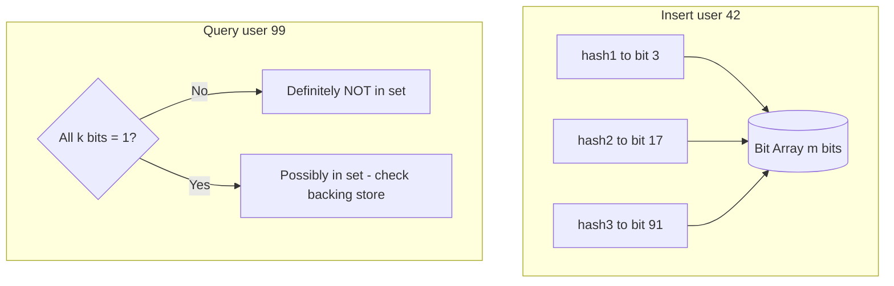
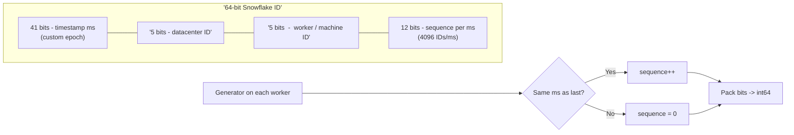

# 13. Advanced Topics

> Status: **Documented**  -  self-contained master reference for probabilistic structures, specialized data structures, distributed routing, and ID generation.

[<- Back to master index](../README.md)

---

## Sub-topics

| # | Sub-topic | Status |
|---|-----------|--------|
| 13.1 | [Bloom Filters](#131-bloom-filters) | Done |
| 13.2 | [HyperLogLog](#132-hyperloglog) | Done |
| 13.3 | [Count Min Sketch](#133-count-min-sketch) | Done |
| 13.4 | [Trie](#134-trie) | Done |
| 13.5 | [Skip Lists](#135-skip-lists) | Done |
| 13.6 | [Merkle Trees](#136-merkle-trees) | Done |
| 13.7 | [Distributed Hash Tables](#137-distributed-hash-tables) | Done |
| 13.8 | [UUID](#138-uuid) | Done |
| 13.9 | [Snowflake IDs](#139-snowflake-ids) | Done |
| 13.10 | [ULID](#1310-ulid) | Done |
| 13.11 | [KSUID](#1311-ksuid) | Done |


---

## 13.1 Bloom Filters


### What is it

A **Bloom filter** is a space-efficient probabilistic data structure that tests set membership. It answers *"possibly in set"* or *"definitely not in set"*  -  never a false negative, but false positives are possible.

### Why it matters

At scale, storing every key in a hash set is expensive. Bloom filters let you skip costly lookups (disk I/O, network RPC, DB queries) with a tiny fixed memory footprint  -  critical for CDNs, databases, and caches.

### How it works

1. Allocate a bit array of size `m`, all bits set to 0.
2. Choose `k` independent hash functions mapping strings -> bit positions.
3. **Add:** hash the element with all `k` functions; set those `k` bits to 1.
4. **Query:** hash the element; if **any** bit is 0 -> definitely not present; if **all** bits are 1 -> possibly present.



### Key details

#### False-positive math

Given bit array size `m`, `k` hash functions, and `n` inserted elements:

| Formula | Meaning |
|---------|---------|
| `k ≈ (m/n) · ln 2` | Optimal hash count minimizing false positives for fixed `m`, `n` |
| `p ≈ (1 − e^(−kn/m))^k` | Approximate false-positive probability |
| `m ≈ −(n · ln p) / (ln 2)²` | Bits needed for target `p` and expected `n` |

**Worked example:** `n = 1,000,000` keys, target `p = 0.01` (1%):

```text
m ≈ −(10⁶ × ln 0.01) / (ln 2)² ≈ 9.6M bits ≈ 1.2 MB
k ≈ (9.6M / 10⁶) × 0.693 ≈ 7 hash functions
```

At `n` elements, **false negatives never occur** — if any of the `k` bits is 0, the key was definitely never inserted. False positives mean "maybe present" → confirm with backing store.

| `n` (at capacity) | `m` (bits) | `k` | Approx `p` |
|-------------------|------------|-----|------------|
| 1M | 1.2 MB | 7 | 1% |
| 10M | 12 MB | 7 | 1% |
| 1M | 600 KB | 7 | ~10% (undersized) |

**Sizing rule of thumb:** allocate ~10 bits per element for ~1% FP rate; double `m` to quarter `p`.

- **Cannot delete** from a standard Bloom filter (use **counting Bloom filter** with small counters per bit).
- **Cannot enumerate** members  -  membership test only.

#### Use cases — cache and database

| Layer | Pattern | What Bloom filter does |
|-------|---------|------------------------|
| **Cache** | Negative lookup guard | Before Redis/Memcached GET, Bloom says "definitely not cached" → skip network RTT on known misses |
| **Cache** | Penetration protection | Block repeated lookups for non-existent keys (attack or buggy client) that would miss cache and hammer DB |
| **DB** | RocksDB/LevelDB SSTable filter | Per-SSTable Bloom: "key not in this file" → skip disk read on LSM lookup |
| **DB** | Cassandra partition filter | `BloomFilter` on SSTable row keys; reduces I/O on wide partitions |
| **DB** | HBase / Bigtable | Same LSM pattern — filter before block fetch |
| **App** | Chrome Safe Browsing | Compact URL hash set; false positive → extra safe-list check |
| **App** | Medium duplicate detection | "Have we seen this article URL?" before expensive dedup store |

**Cache flow:**

```text
Request key K
  → Bloom.contains(K)?
      NO  → return 404 / cache miss (skip DB)
      YES → GET cache → on miss, query DB (1% FP may cause extra DB hit)
```

**Trade-off:** Bloom saves **definite miss** paths; false positives add occasional redundant lookups — acceptable when DB/cache lookup cost >> Bloom check cost (nanoseconds in RAM).

### When to use

- Pre-filter before expensive storage lookups (cache penetration guard, "does this URL exist?").
- Spell-check dictionaries, crawler URL deduplication, distributed join existence checks.
- Anywhere a small false-positive rate is acceptable and negatives must be exact.

### Trade-offs

| Pros | Cons |
|------|------|
| O(k) insert/query; fixed memory | False positives require confirmation |
| No false negatives | No delete (without counting variant) |
| Cache-friendly, mergeable (OR bits) | Cannot list members; tuning needed for `p` |

### References

- _Add links from [System Design Fundamentals.xlsx](../System%20Design%20Fundamentals.xlsx) as you collect them._

---


3.2 HyperLogLog


### What is it

**HyperLogLog (HLL)** is a probabilistic algorithm that estimates the **cardinality** (count of distinct elements) in a multiset using ~12 KB of memory with ~2% standard error, regardless of stream size.

### Why it matters

Exact distinct counts require O(n) memory. Analytics ("unique visitors today", "distinct IPs per second") at billions of events/day need sub-linear memory  -  HLL is the standard answer in Redis, BigQuery, and observability pipelines.

### How it works

1. Hash each element to a value; count leading zeros in the binary representation.
2. Partition hash space into `m` registers (typically 2^14); each register stores the max leading-zero count seen.
3. Estimate cardinality from the harmonic mean of register values  -  rare long zero-runs imply a large distinct set.
4. **HLL++** adds bias correction and sparse representation for small sets.

### Key details

- **Mergeable:** union of two HLL sketches ≈ distinct count of combined streams (critical for distributed aggregation).
- Redis: `PFADD`, `PFCOUNT`, `PFMERGE`.
- Error is relative (~1 - 2%), not absolute  -  bad for small cardinalities (< ~1000) without sparse mode.
- Not suitable when you need exact counts or to list distinct values.

### When to use

- Unique visitors, unique search terms, unique device IDs in metrics.
- Distributed log aggregation where shards each maintain an HLL and merge at query time.
- Any "how many unique X?" where ~2% error is acceptable.

### Trade-offs

| Pros | Cons |
|------|------|
| Fixed ~12 KB per sketch | Approximate only |
| O(1) per element | Cannot retrieve individual members |
| Mergeable across nodes | Underestimates with very high collision on hash |

### References

- _Add links from [System Design Fundamentals.xlsx](../System%20Design%20Fundamentals.xlsx) as you collect them._

---


3.3 Count Min Sketch


### What is it

A **Count-Min Sketch** is a probabilistic data structure that estimates **frequency** (how many times an item appeared) in a data stream using sub-linear memory.

### Why it matters

Finding "top K heavy hitters" in a firehose (network packets, API calls, trending hashtags) without storing every counter is a classic big-data problem. CMS gives fixed-memory frequency estimates with one-sided error.

### How it works

1. Maintain `d` rows × `w` columns of counters (a 2D array).
2. Each row uses a different hash function; `hash_i(x)` selects a column in row `i`.
3. **Increment:** on item `x`, increment counter at `(i, hash_i(x))` for all rows.
4. **Estimate frequency:** return the **minimum** across all `d` counters for `x` (overestimates are possible; minimum reduces bias).

### Key details

- **Overestimates, never underestimates** (with proper parameters)  -  safe for rate limiting thresholds.
- Width `w` and depth `d` trade memory for accuracy; `ε` error bound with probability `1−δ`.
- Variants: **Count-Min-Log** for heavy tail distributions; **Conservative update** reduces overcounting.
- Used in network monitoring (DDoS detection), CDN cache admission, streaming analytics.

### When to use

- Heavy hitter / top-K detection in unbounded streams.
- Approximate per-key counters when exact per-key maps are too large.
- Distributed rate limiting with mergeable sketches.

### Trade-offs

| Pros | Cons |
|------|------|
| Fixed memory, stream-friendly | Frequencies are approximate |
| Fast O(d) updates | Cold keys can be noisy |
| Mergeable across shards | Not suitable for exact billing |

### References

- _Add links from [System Design Fundamentals.xlsx](../System%20Design%20Fundamentals.xlsx) as you collect them._

---


3.4 Trie


### What is it

A **trie** (prefix tree) is a tree where each edge represents a character; paths from root to node spell keys. Shared prefixes share nodes  -  efficient for prefix operations.

### Why it matters

Autocomplete, IP routing tables (CIDR longest-prefix match), spell checkers, and phone directories all rely on prefix structures. Tries turn prefix queries into tree walks instead of full scans.

### How it works

1. Insert `"cat"`, `"car"`, `"card"`  -  `'c'` -> `'a'` branches to `'t'` (word end) and `'r'` -> `'d'` (word end).
2. **Search:** follow characters; word exists if terminal flag set at final node.
3. **Prefix search:** descend to prefix node, DFS/BFS collect all terminal descendants.
4. **Compressed trie (radix tree):** merge single-child chains to save space.

### Key details

- **Longest Prefix Match** in routers uses trie-like structures for CIDR tables.
- **DAWG / minimal DAWG** compress tries for static dictionaries (spell check).
- Space can explode with sparse alphabets  -  use compressed/radix variants.
- Contrast with **hash table:** trie wins on prefix/range; hash wins on exact key lookup.

### When to use

- Autocomplete and type-ahead suggestions.
- IP routing, dictionary word validation, phone contact search.
- Any domain where keys share long common prefixes.

### Trade-offs

| Pros | Cons |
|------|------|
| O(L) lookup, L = key length | Memory-heavy for sparse keys |
| Natural prefix/range queries | Pointer chasing  -  cache misses |
| No hash collisions | Rebalance not needed but deep trees possible |

### References

- _Add links from [System Design Fundamentals.xlsx](../System%20Design%20Fundamentals.xlsx) as you collect them._

---


3.5 Skip Lists


### What is it

A **skip list** is a probabilistic layered linked list that provides O(log n) average search, insert, and delete  -  a simpler alternative to balanced trees (red-black, AVT).

### Why it matters

Redis sorted sets (`ZSET`) are implemented as skip lists. They offer tree-like performance with easier concurrent lock-free implementations  -  popular in in-memory stores and concurrent maps.

### How it works

1. Base level: sorted singly linked list of all elements.
2. Randomly promote each inserted element to higher levels with probability `p` (often ½).
3. **Search:** start at top level, move right while next < target, then drop down; repeat until found or bottom.
4. Expected levels ≈ log_{1/p}(n); expected pointers per node ≈ 1/(1−p).

### Key details

- **Deterministic variants** exist but probabilistic is standard.
- Easier to implement **lock-free concurrency** than rebalancing trees.
- Memory overhead: ~1/(1−p) pointers per element on average.
- Redis uses skip list + hash table dual index for O(1) member lookup + O(log n) rank/range.

### When to use

- In-memory ordered sets with range queries and rank operations.
- Concurrent priority queues / ordered maps where tree rebalancing complexity is undesirable.
- Interview alternative when asked "design a sorted dictionary."

### Trade-offs

| Pros | Cons |
|------|------|
| Simpler than balanced BST | Probabilistic  -  worst case O(n) unlikely but possible |
| Good concurrent performance | Higher memory than arrays |
| O(log n) average ops | Not cache-optimal vs B-trees on disk |

### References

- _Add links from [System Design Fundamentals.xlsx](../System%20Design%20Fundamentals.xlsx) as you collect them._

---


3.6 Merkle Trees


### What is it

A **Merkle tree** (hash tree) is a binary tree where each leaf is a hash of a data block and each internal node is a hash of its children. The **root hash** commits to the entire dataset.

### Why it matters

Comparing two multi-terabyte datasets byte-by-byte is impractical. Merkle roots let systems detect divergence in O(1) and localize differences in O(log n)  -  foundational for Git, blockchains, Cassandra repair, and certificate transparency.

### How it works

1. Hash each data chunk -> leaf nodes.
2. Pair leaves; parent = `hash(left || right)`; repeat until one root.
3. **Verify membership:** provide a **Merkle proof**  -  sibling hashes along the path from leaf to root; verifier recomputes root.
4. **Compare replicas:** exchange roots; if different, bisect the tree to find divergent subtrees.

### Key details

- **Git** stores tree objects as Merkle structures  -  `git diff` leverages this.
- **Cassandra** uses Merkle trees for anti-entropy repair between replicas.
- **Certificate Transparency** logs use Merkle trees for auditable TLS cert issuance.
- Sorted-leaf variants enable efficient range proofs.

### When to use

- Integrity verification of large replicated datasets.
- Sync protocols (Bitcoin SPV light clients, IPFS, Dynamo-style reconciliation).
- Any system needing "prove this record was in snapshot S at time T."

### Trade-offs

| Pros | Cons |
|------|------|
| O(log n) proof size | Rebuilding tree on every update (use incremental trees) |
| Fast root comparison | Not a search structure |
| Tamper-evident | Hash function choice matters (use SHA-256+) |

### References

- _Add links from [System Design Fundamentals.xlsx](../System%20Design%20Fundamentals.xlsx) as you collect them._

---


3.7 Distributed Hash Tables


### What is it

A **Distributed Hash Table (DHT)** is a decentralized key-value overlay where nodes collectively store `(key -> value)` pairs. Each node is responsible for a portion of the hash ring; lookups route to the owner in O(log N) hops.

### Why it matters

DHTs power peer-to-peer systems (BitTorrent, IPFS, Cassandra ring), distributed caches, and object stores. **Consistent hashing** minimizes data movement when nodes join or leave  -  essential for elastic clusters.

### How it works

1. Hash keys and node IDs onto a ring (0  -  2^160−1 for SHA-1 style).
2. Key `K` is owned by the **first node clockwise** from `hash(K)` (successor).
3. **Virtual nodes (vnodes):** each physical node claims multiple ring positions  -  smoother load distribution.
4. **Lookup:** maintain finger table (Chord) or replica set (Cassandra) to find successor in log N steps.

```mermaid
flowchart TB
    subgraph Ring['Consistent Hash Ring']
        direction LR
        N1((Node A))
        N2((Node B))
        N3((Node C))
        N4((Node D))
        N1 --- N2 --- N3 --- N4 --- N1
    end
    K['key K -> hash(K)'] --> Succ[First node clockwise]
    Succ --> N2
    N2 --> Replica[Replicate to N+1, N+2 successors]
```

### Key details

- **Chord:** finger table routing; **Kademlia:** XOR metric, used in IPFS/Ethereum.
- **Cassandra:** consistent hashing + vnode + configurable replication factor (RF).
- Adding a node moves only **K/N** keys on average (vs nearly all keys with `hash mod N`).
- **Rendezvous hashing (HRW):** alternative when ring management is complex  -  highest `hash(node, key)` wins.

### When to use

- Horizontally scaled caches and KV stores without a central coordinator.
- P2P file sharing, distributed object placement, sharded service discovery.
- Any cluster that grows/shrinks frequently and must minimize resharding cost.

### Trade-offs

| Pros | Cons |
|------|------|
| Minimal data movement on topology change | Hot spots if keys skew (mitigate with vnodes) |
| Decentralized, no single coordinator | Eventual consistency in replica sync |
| O(log N) lookup in structured DHTs | Operational complexity (gossip, failure detection) |

### References

- _Add links from [System Design Fundamentals.xlsx](../System%20Design%20Fundamentals.xlsx) as you collect them._

---


3.8 UUID


### What is it

A **UUID** (Universally Unique Identifier) is a 128-bit identifier standardized in RFC 9562. Versions 1 (time+MAC), 3/5 (name-based hash), and 4 (random) are common; version 7 (time-ordered random) is the modern default for databases.

### Why it matters

UUIDs provide globally unique IDs without a central allocator  -  essential for distributed systems, client-generated IDs, and public opaque identifiers. Understanding versions matters for index locality and privacy.

### How it works

- **UUID v4:** 122 random bits + 6 version/variant bits  -  no ordering, no coordination.
- **UUID v1:** timestamp + clock sequence + MAC address  -  sortable-ish but leaks hardware info.
- **UUID v7:** 48-bit Unix ms timestamp + random  -  **time-sortable**, better B-tree locality than v4.
- String form: `8-4-4-4-12` hex (36 chars with hyphens).

### Key details

- **Index fragmentation:** random UUIDs (v4) cause random inserts in B-tree indexes  -  use v7, ULID, or Snowflake for write-heavy tables.
- **Collision probability:** negligible at 2^122 random bits; birthday paradox irrelevant at application scale.
- Stored as `CHAR(36)`, `BINARY(16)`, or native `UUID` type  -  binary saves space and comparison cost.

### When to use

- Public resource IDs, offline-first client ID generation, merge-friendly replication.
- When global uniqueness matters more than sortability (v4) or when v7/ULID gives both.

### Trade-offs

| Pros | Cons |
|------|------|
| No coordination; 128-bit space | 16 bytes vs 8-byte integer |
| Standard, library support everywhere | v4 hurts DB insert locality |
| Opaque, non-guessable (v4/v7) | v1 leaks MAC; string storage bloat |

### References

- _Add links from [System Design Fundamentals.xlsx](../System%20Design%20Fundamentals.xlsx) as you collect them._

---


3.9 Snowflake IDs


### What is it

**Snowflake IDs** (popularized by Twitter) are 64-bit, time-ordered, globally unique integers composed of timestamp, datacenter/machine ID, and per-ms sequence  -  generated without coordination beyond local counters.

### Why it matters

Auto-increment IDs don't scale across shards; random UUIDs fragment indexes. Snowflake gives **monotonic, roughly time-sorted** 64-bit integers ideal for primary keys, tweet IDs, and distributed ordering at millions of IDs/sec per machine.

### How it works



1. On each ID request: read current time (ms since custom epoch).
2. If same ms as last tick: increment 12-bit sequence (max 4096/ms); else reset sequence.
3. If sequence overflows within same ms: **spin-wait** until next millisecond.
4. Concatenate: `(timestamp << 22) | (datacenter << 17) | (worker << 12) | sequence`.

### Key details

#### 64-bit layout (Twitter Snowflake)

```text
| 1 bit (unused/sign) | 41 bits timestamp | 5 bits DC | 5 bits worker | 12 bits sequence |
|         0           |   ms since epoch  |  0-31     |    0-31       |    0-4095        |
```

| Field | Bits | Range | Notes |
|-------|------|-------|-------|
| **Timestamp** | 41 | ~69 years from custom epoch | Twitter epoch: 2010-11-04; sortable by time |
| **Datacenter ID** | 5 | 32 DCs | Provisioned at deploy; avoids cross-DC collision |
| **Worker ID** | 5 | 32 machines per DC | 1,024 total generators (32 × 32) |
| **Sequence** | 12 | 4,096 IDs/ms per worker | Overflow → spin-wait for next ms |

**Assembly:** `id = (timestamp << 22) | (dc << 17) | (worker << 12) | sequence`

**Capacity:** 4,096 × 1,000 IDs/sec ≈ **4M IDs/sec per worker**; cluster scales with worker count.

**Variants:** Sonyflake (39+8+8+16), Instagram shard id, Discord snowflake — same idea, different bit splits.

#### Clock drift and backward jumps

Snowflake assumes **monotonic millisecond clock** per worker. Real clocks drift and NTP steps backward.

| Scenario | Risk | Mitigation |
|----------|------|------------|
| Clock runs fast | IDs slightly in future | Usually harmless; monitor skew |
| **NTP step backward** | Same `(timestamp, worker)` → **duplicate IDs** if sequence resets | **Wait** until clock catches up to last timestamp; or use sequence buffer |
| Clock skew across workers | Out-of-order IDs globally | Acceptable for sortable PK; not a total order guarantee |
| Leap second / VM pause | Burst or gap in timestamp | Sequence absorbs within ms; long pause may need wait |

**Production pattern (backward jump):**

```text
now = currentTimeMs()
if now < lastTimestamp:
    wait until now >= lastTimestamp   # block ID generation
if now == lastTimestamp:
    sequence = (sequence + 1) & 4095
    if sequence == 0: wait next ms
else:
    sequence = 0
lastTimestamp = now
```

Run **chrony** or **ntpd** with slew (not step) on ID-generating hosts; alert on clock offset > 50 ms.

#### Snowflake vs UUID

| | Snowflake (int64) | UUID v4 | UUID v7 |
|---|-------------------|---------|---------|
| **Size** | 8 bytes | 16 bytes | 16 bytes |
| **Sortable** | Yes (time prefix) | No (random) | Yes (time prefix) |
| **Coordination** | Worker/DC IDs required | None | None |
| **Clock dependency** | Yes (NTP) | No | Yes (ms timestamp) |
| **B-tree insert** | Sequential (good) | Random (page splits) | Sequential (good) |
| **URL-friendly** | Numeric only | 36-char string | 36-char string |
| **Privacy** | Leaks rough creation time | Opaque | Leaks rough creation time |
| **Collision** | Per-worker sequence | ~negligible (122 random bits) | ~negligible |

**Choose Snowflake** when: compact numeric PK, high insert rate, time-range queries, internal IDs.

**Choose UUID v7/ULID** when: no worker registry, client-generated IDs, string APIs, multi-language interop.

**Choose UUID v4** when: opacity matters more than index locality; low write volume.

### When to use

- High-throughput distributed systems needing compact, sortable numeric PKs.
- Public APIs exposing numeric IDs (URLs, cursors) where UUID string length is undesirable.
- Event ordering and sharding by time prefix.

### Trade-offs

| Pros | Cons |
|------|------|
| 8 bytes; B-tree friendly | Clock dependency (NTP) |
| ~4096 IDs/ms per worker | Machine ID provisioning required |
| Time-sortable, no DB round-trip | Not standard  -  custom bit layout per org |
| Numeric  -  human-shorter than UUID | Reveals approximate creation time |

### References

- _Add links from [System Design Fundamentals.xlsx](../System%20Design%20Fundamentals.xlsx) as you collect them._

---


3.10 ULID


### What is it

**ULID** (Universally Unique Lexicographically Sortable Identifier) is a 128-bit identifier: 48-bit millisecond timestamp + 80 bits of randomness, encoded as **26-character Crockford Base32** (case-insensitive, URL-safe).

### Why it matters

ULID combines UUID's uniqueness with **lexicographic sortability** and compact string representation  -  popular in logs, event IDs, and APIs where humans and systems both read IDs.

### How it works

1. First 10 characters encode timestamp (ms precision).
2. Last 16 characters encode 80 random bits.
3. Sorting strings lexicographically ≈ sorting by creation time (within same ms, random order).
4. Monotonic ULID variant: increment random portion within same ms for strict ordering in single process.

### Key details

- 26 chars vs UUID's 36  -  more compact in URLs and logs.
- Crockford Base32 avoids ambiguous `I/L/O/U`.
- Same index-locality benefits as UUID v7 / Snowflake for recent inserts.
- Libraries in most languages; no central registry for machine IDs (unlike Snowflake).

### When to use

- Event sourcing event IDs, distributed logs, API resource identifiers.
- When you want sortable string IDs without managing worker/datacenter bits.
- Filename-safe, case-insensitive unique keys.

### Trade-offs

| Pros | Cons |
|------|------|
| Lexicographically sortable | 128 bits  -  larger than Snowflake int64 |
| Shorter than UUID string | 80-bit random  -  still negligible collision risk |
| URL-safe Base32 | Less ubiquitous than UUID in databases |
| No machine ID coordination | Timestamp leaks creation time |

### References

- _Add links from [System Design Fundamentals.xlsx](../System%20Design%20Fundamentals.xlsx) as you collect them._

---


3.11 KSUID


### What is it

**KSUID** (K-Sortable Unique IDentifier) is a 160-bit identifier: 32-bit seconds timestamp + 128-bit random payload, encoded as **27-character Base62** string. Created by Segment for sortable, high-entropy IDs.

### Why it matters

KSUID offers stronger randomness (128 bits) than ULID's 80 bits while remaining sortable by time  -  useful when collision resistance across many services matters and string compactness is valued.

### How it works

1. Take Unix timestamp in seconds (4 bytes)  -  coarser than ULID/Snowflake ms precision.
2. Append 128 cryptographically random bytes.
3. Encode entire 20-byte payload as 27-char Base62.
4. Lexicographic sort correlates with creation time at **second** granularity.

### Key details

- **Second** granularity means many IDs per second sort randomly among themselves.
- 27 chars Base62  -  slightly longer than ULID but more entropy.
- Segment open-sourced spec; used in analytics pipelines and multi-tenant SaaS.
- Compare: Snowflake (64-bit int, ms), ULID (128-bit, ms), KSUID (160-bit, seconds).

### When to use

- Analytics IDs, message IDs, cross-service correlation where high entropy + rough time order suffice.
- Systems already using Segment-style event pipelines.
- When second-level time bucketing is acceptable for ordering.

### Trade-offs

| Pros | Cons |
|------|------|
| 128-bit random  -  very low collision | Second precision only  -  not ms-orderable |
| Sortable by time (coarse) | 27 chars; not a standard DB type |
| Compact Base62 string | Less common than UUID/ULID in interviews |
| No coordination | Reveals creation second publicly |

### References

- _Add links from [System Design Fundamentals.xlsx](../System%20Design%20Fundamentals.xlsx) as you collect them._

---


## Quick Reference

| # | Topic | Summary |
|---|-------|---------|
| 13.1 | Bloom Filters | Bloom Filters |
| 13.2 | HyperLogLog | HyperLogLog |
| 13.3 | Count Min Sketch | Count Min Sketch |
| 13.4 | Trie | Trie |
| 13.5 | Skip Lists | Skip Lists |
| 13.6 | Merkle Trees | Merkle Trees |
| 13.7 | Distributed Hash Tables | Distributed Hash Tables |
| 13.8 | UUID | UUID |
| 13.9 | Snowflake IDs | Snowflake IDs |
| 13.10 | ULID | ULID |
| 13.11 | KSUID | KSUID |

---

[â -  Back to master index](../README.md)
