# 13. Advanced Topics

[<- Back to master index](../README.md)

---

## Sub-topics

| # | Sub-topic |
|---|-----------|
| 13.1 | [Bloom Filters](#131-bloom-filters) |
| 13.2 | [HyperLogLog](#132-hyperloglog) |
| 13.3 | [Count Min Sketch](#133-count-min-sketch) |
| 13.4 | [Trie](#134-trie) |
| 13.5 | [Skip Lists](#135-skip-lists) |
| 13.6 | [Merkle Trees](#136-merkle-trees) |
| 13.7 | [Distributed Hash Tables](#137-distributed-hash-tables) |
| 13.8 | [UUID](#138-uuid) |
| 13.9 | [Snowflake IDs](#139-snowflake-ids) |
| 13.10 | [ULID](#1310-ulid) |
| 13.11 | [KSUID](#1311-ksuid) |

---


## 13.1 Bloom Filters

### Overview

A **Bloom filter** is a tiny bit array plus `k` hash functions that answers “might this key exist?” in constant time. Invented by Burton Bloom in 1970, it does not store actual keys — only a compact pattern of bits built from them. It **never** wrongly clears a real member, but may occasionally send you to the database for a key that was never there. Size it with `m`, `n`, and `k` for your target error rate, treat “possibly present” as a hint, and always confirm with the real store.

Picture a library with a billion books and no card catalogue. Every time someone asks for a title, a librarian walks every aisle. That is what happens when a large system hits a database or disk for every key — costly and mostly wasteful, because most lookups are for things that were **never stored**. A Bloom filter is the **quick first question** before the expensive one: it cannot replace the database, but it can stop you from asking thousands of times per second for keys you already know do not exist — like rejecting signup attempts for emails that were never registered without touching the users table.

---

### What problem it fixes

Large systems repeatedly ask membership questions:

- Does this user ID exist?
- Have we crawled this URL before?
- Is this product ID in our cache?
- Could this key be on disk in this SSTable?

Storing every key in a hash set works but consumes enormous RAM — billions of URLs at ~50 bytes each can mean tens of gigabytes. Querying the database or disk on every miss is even worse when attackers or bugs send millions of requests for keys that **never existed** (cache penetration).

The Bloom filter fixes this trade-off:

```text
Bloom says "definitely NOT here"  →  skip the expensive lookup (safe)
Bloom says "MAYBE here"         →  check the real store to confirm
```

It accepts a small, tunable rate of **false positives** (saying “maybe” when the key was never inserted) in exchange for huge memory savings and speed. It **never** gives a false negative on a standard filter — if something was inserted, it will not say “definitely not here.”

---

### A simple analogy: “Is this email already registered?”

When you sign up on a large site, the backend must answer: **does `alice@example.com` already exist in our users table?**

A naive approach loads every registered email into memory, or runs `SELECT 1 FROM users WHERE email = ?` on **every** signup attempt and typo. With 500 million accounts, that is slow, expensive, and easy to abuse — bots can hammer random emails and force millions of database reads.

A Bloom filter sits **in front of** the database as a lightweight gate:

1. **When a user registers successfully**, the system hashes the email and sets a few bits in a shared bit array — “we have seen something that maps here.”
2. **When someone tries to sign up**, the system hashes the new email and checks those same bit positions.
3. If **any bit is 0** → that email was **never registered** → return “available” immediately, **no database query**.
4. If **all bits are 1** → email **might** already exist → run the real `SELECT` on the users table to confirm.

```text
POST /signup  { "email": "bob@newdomain.com" }
  → Bloom.contains("bob@newdomain.com")?
      bit check → one position is 0
      → "Email available" (DB never touched)

POST /signup  { "email": "alice@example.com" }
  → Bloom.contains("alice@example.com")?
      all bits are 1 (alice was registered; bits may overlap with others)
      → SELECT from users WHERE email = 'alice@example.com'
      → "Email already taken"
```

The filter does not store `alice@example.com` — only a fingerprint of bits. Two different emails can accidentally flip the same bits (like two users sharing one locker combination by chance). That overlap is a **false positive**: the filter says “maybe taken,” you query the database, and find the email is actually free. Rare, but acceptable if you sized the filter for ~1% error.

| Signup flow step | Bloom filter role |
|------------------|-------------------|
| User registers `alice@example.com` | `insert(email)` — set k bit positions |
| New signup for `bob@newdomain.com` | `lookup` → any 0 → **definitely not registered** |
| New signup for `alice@example.com` | `lookup` → all 1 → **maybe registered** → confirm in DB |
| Bot tries 10,000 random emails/sec | Most get rejected in RAM; DB sees only “maybe” cases |

The bit array might be ~1 MB for a million emails instead of gigabytes to hold every address string. The trade-off: occasional extra database lookups when the filter says “maybe” for an email that was never registered — far cheaper than querying the database for every attempt.

---

### What it does

A Bloom filter supports two operations on a set of keys:

**Insert** — record that a key was seen (set bits in the array).

**Lookup (membership test)** — answer one of two things only:

1. **Definitely not present** — this key was never inserted.
2. **Possibly present** — this key might exist; go verify with the authoritative source (database, disk, cache).

It does **not** tell you how many items are stored, list members, or delete keys in the standard form. It is a **probabilistic set membership sketch**, not a full database.

---

### How it works — the algorithm inside

Internally, a Bloom filter is just two things:

1. A **bit array** of size `m`, all zeros at the start.
2. **`k` independent hash functions**, each mapping a key to an index from `0` to `m − 1`.

Hash functions spread keys pseudo-randomly across the array. Using **multiple** hashes reduces the chance that unrelated keys accidentally line up on the same bits.

#### Insert algorithm

```text
function insert(key):
    for i = 1 to k:
        index = hash_i(key)
        bit_array[index] = 1    // set to 1; already-1 stays 1
```

#### Lookup algorithm

```text
function lookup(key):
    for i = 1 to k:
        index = hash_i(key)
        if bit_array[index] == 0:
            return DEFINITELY_NOT_PRESENT
    return POSSIBLY_PRESENT    // all k bits are 1 — confirm downstream
```

Both operations run in **O(k)** time — constant with respect to how many keys were inserted, because `k` is fixed at design time (often around 7 for a 1% false-positive target).

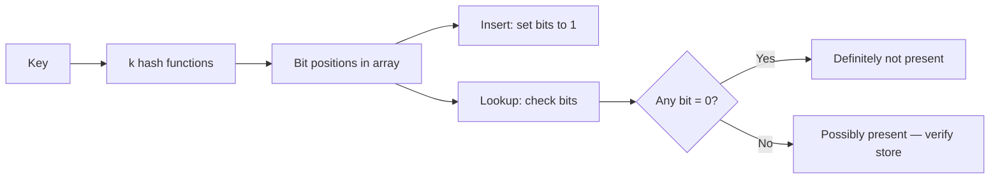

---

### Walkthrough: inserting and looking up fruit names

Use a toy bit array of size 10 and three hash functions.

**Start:** all zeros.

```text
Index:  0  1  2  3  4  5  6  7  8  9
Bits:   0  0  0  0  0  0  0  0  0  0
```

**Insert `"Apple"`** — hashes land at positions 2, 5, 8:

```text
Hash1(Apple) = 2    Hash2(Apple) = 5    Hash3(Apple) = 8

Result:  0  0  1  0  0  1  0  0  1  0
```

**Insert `"Banana"`** — positions 1, 5, 7. Position 5 was already 1 from Apple; that overlap is normal.

```text
Hash1(Banana) = 1    Hash2(Banana) = 5    Hash3(Banana) = 7

Result:  0  1  1  0  0  1  0  1  1  0
```

**Lookup `"Apple"`** — check 2, 5, 8 → all 1 → **possibly present** (and it really is).

**Lookup `"Orange"`** — hashes to 0, 4, 9. Bit 4 is still 0 → **definitely not present**. No need to hit the database.

This is the filter doing its best work: a cheap, certain rejection.

---

### False positives — when the filter is wrong (in one direction only)

A **false positive** means the filter says “possibly present” for a key that was **never** inserted.

Continuing the fruit example — suppose `"Orange"` hashes to positions 2, 5, and 7. All three are already 1 because of Apple and Banana, even though Orange was never added:

```text
Apple  →  bits 2, 5, 8
Banana →  bits 1, 5, 7
Orange →  bits 2, 5, 7   (never inserted, but all bits are 1)
```

The filter cannot tell Orange apart from a real member without checking the real store. That extra DB read is the price of sharing bits.

A **false negative** (saying “not present” when the key **was** inserted) does **not** happen in a standard Bloom filter, as long as bits are never cleared and the key was inserted correctly. Every inserted key leaves all its bits set to 1 permanently.

False positives rise when:

- Too many keys are packed into too small an array.
- Too few or too many hash functions are used.
- Hash functions cluster keys on the same bits.

They fall when you allocate more bits per expected key and choose `k` using the sizing formulas below.

---

### Sizing the filter — choosing `m`, `k`, and acceptable error

Before deployment you decide:

- `n` — how many keys you expect to insert.
- `p` — maximum false-positive rate you can tolerate (e.g. 1%).

**Optimal number of hash functions:**

```text
k = (m / n) × ln(2)     ≈ 0.693 × (m / n)
```

**Approximate false-positive probability:**

```text
p ≈ (1 − e^(−kn/m))^k
```

**Bits needed for target `p` and `n`:**

```text
m ≈ −(n · ln p) / (ln 2)²
```

**Example:** 1 million keys, 1% false-positive target:

```text
m ≈ 9.6 million bits  ≈  1.2 MB
k ≈ 7 hash functions
```

Rule of thumb: about **10 bits per element** gives roughly **1%** false positives. Double the bit array size to quarter the error rate.

Compared to storing 1 billion URLs in a hash set (~50 GB), a Bloom filter for the same membership checks might use **hundreds of megabytes** — orders of magnitude less, with a known false-positive rate you size upfront.

---

### Variants worth knowing

| Variant | What it adds |
|---------|--------------|
| **Counting Bloom filter** | Small counters per slot instead of single bits — supports safe delete (increment on insert, decrement on delete). |
| **Scalable Bloom filter** | Stack a new filter when the current one fills — unbounded growth with controlled error. |
| **Blocked / partitioned** | Cache-friendly layouts for high-QPS systems like RocksDB. |

Standard Bloom filters **cannot delete** by clearing a bit — another key may share that bit:

```text
Apple and Banana both set bit 5.
Clearing bit 5 to "remove Apple" would break Banana.
```

---

### Bloom filter vs hash set

| | Hash set | Bloom filter |
|---|----------|--------------|
| Stores actual keys | Yes | No — bits only |
| Memory | High (O(n)) | Very low (fixed `m`) |
| Lookup | O(1) average | O(k) |
| False positives | Never | Yes — tunable |
| False negatives | Never | Never (standard) |
| Delete / list members | Yes | No (standard) |

Use a hash set when you need exact membership and enumeration. Use a Bloom filter when you need a **cheap pre-filter** in front of something expensive.

---

### Real-world example: stopping cache penetration

An e-commerce API caches product details by `product_id`. Attackers send millions of requests for random IDs that do not exist. Without protection, every miss goes to the database — the cache is useless.

**With a Bloom filter in front of the cache:**

1. On startup (or periodically), load all valid product IDs into a Bloom filter — ~1.2 MB for a million products at 1% FP.
2. On each request, check the filter first.
3. Filter says **not present** → return 404 immediately; database never touched.
4. Filter says **possibly present** → check cache; on miss, query database.

```text
Request for product_id K
  → Bloom.contains(K)?
      NO  → 404 / skip DB
      YES → cache → DB on miss (rare false positive causes one extra DB read)
```

The same pattern appears in **RocksDB** and **LevelDB**: each SSTable file carries a Bloom filter so the engine skips disk reads when a key **definitely** is not in that file. **Cassandra** and **HBase** use similar filters before remote or disk lookups.

---


## 13.2 HyperLogLog

### Definition

**HyperLogLog (HLL)** is a probabilistic data structure that estimates the number of **distinct elements** (cardinality) in a very large dataset using very small, fixed memory.

It does **not** store elements. It only answers:

```text
→ "How many unique items have we seen?"
```

### Problem it solves

Suppose you have:

- 1 billion user IDs
- 10 billion log events
- 100 million web pages
- Massive real-time event streams

You need the **count of unique items** (cardinality).

**Naive approaches:**

| Approach | Issue |
|----------|-------|
| **Hash set** | Store every element — accurate but very high memory O(n) |
| **Sort / DB aggregation** | Expensive and slow at scale |

HyperLogLog solves this with **fixed memory**, **approximate result**, and **extremely fast** streaming updates.

### Core idea

HyperLogLog is based on a statistical observation: if you hash random values, the probability of seeing long runs of **leading zeros** is related to how many unique elements exist.

```text
More unique elements  →  higher chance of hashes like 0000001, 00000001, 0000000001
Fewer elements        →  only short runs of zeros
```

### Key intuition

We do **not** count elements directly. We observe patterns in hashed values:

```text
→ position of first 1-bit (leading zeros)
```

This pattern encodes information about cardinality.

### Step 1 — Hashing

Every input element is hashed into a binary string (typically 64 bits). Hash output is treated as pseudo-random.

```text
UserID "alice"  →  hash: 101100101010...
UserID "bob"    →  hash: 000001001111...
```

### Step 2 — Split hash

Each hash splits into two parts:

**1. Register index (bucket selection)** — first `p` bits select a register.

```text
hash = 1011001010...
first 4 bits → 1011 → register 11

If p = 4  →  2^4 = 16 registers
```

**2. Remaining bits** — used to compute **ρ(x)** = position of first 1-bit (number of leading zeros + 1).

```text
remaining: 000001010...
ρ(x) = 6
```

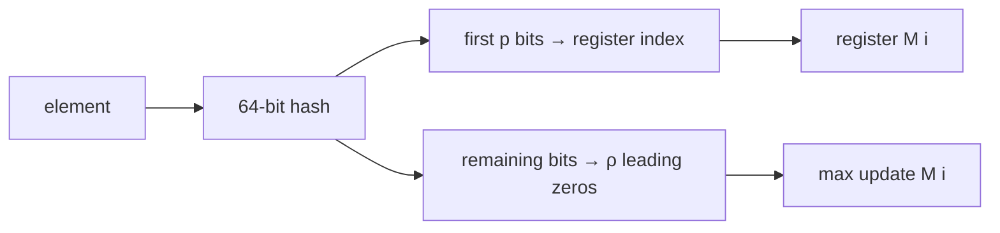

### Registers

Maintain an array of registers:

```text
M[0], M[1], M[2], ... M[2^p − 1]
```

Each register stores the **maximum** ρ(x) observed for hashes mapping to that bucket.

Typical configuration: `p = 14` → `m = 2^14 = 16,384` registers → ~12 KB total.

### Step 3 — Insertion

For each element:

1. Hash it
2. Determine register index from first `p` bits
3. Compute leading-zero count ρ(x)
4. Update register: `M[i] = max(M[i], ρ(x))`

**Example** — registers initially `M = [0, 0, 0, 0]`:

```text
Insert "A":  hash(A) → index = 2, ρ = 3   →  M[2] = 3
Insert "B":  hash(B) → index = 2, ρ = 5   →  M[2] = max(3, 5) = 5
```

### Step 4 — Estimation

After processing all elements, compute the harmonic mean of register values.

**Formula (standard HLL):**

```text
E ≈ α_m × m² / Σ(2^−M[i])
```

Where:

- `m` = number of registers (`2^p`)
- `M[i]` = value stored in register `i`
- `α_m` = bias correction constant (depends on `m`)

**Intuition:** higher register values mean more leading zeros were observed → more unique elements likely exist. The estimator combines all registers to reduce variance.

### Why it works

Probability that a random binary string has `k` leading zeros:

```text
P(k leading zeros) ≈ 1 / 2^k
```

If we observe large `k`, many samples were likely drawn. HLL measures **statistical patterns in randomness** to infer how many unique items exist — it does not count elements directly.

### Memory efficiency

| Configuration | Typical memory | Handles |
|---------------|----------------|---------|
| `p = 14` (16,384 registers) | ~12 KB | Millions to billions of distinct elements |
| Smaller `p` | 1–2 KB | Lower accuracy, less memory |

Memory is **fixed** regardless of how many elements stream through — O(1) space.

### Accuracy

Standard error rate:

```text
Error ≈ 1.04 / √m
```

Where `m` = number of registers. More registers → better accuracy → more memory.

| Registers `m` | Approx standard error |
|---------------|----------------------|
| 2^10 = 1,024 | ~3.25% |
| 2^14 = 16,384 | ~0.81% (~1–2% in practice with corrections) |

**HLL++** adds bias correction and sparse representation for small cardinalities (< ~1000).

### Properties

1. Fixed memory usage — does not grow with stream size
2. No raw data storage — cannot list members
3. Fast O(1) updates per element
4. **Mergeable** across systems and shards
5. Highly scalable for distributed aggregation

### Merge property

HyperLogLog sketches merge by taking the max per register:

```text
Given HLL1 and HLL2:
  M_merged[i] = max(M1[i], M2[i])

Result ≈ cardinality of the union of both streams
```

This makes HLL ideal for distributed systems — each node maintains a local sketch; central aggregator merges without shipping raw events.

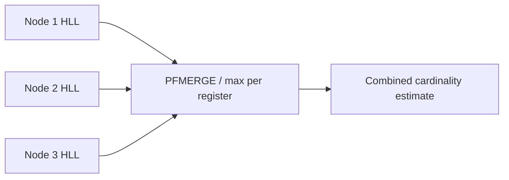

### Exact count vs HyperLogLog

| | Exact count (hash set) | HyperLogLog |
|---|------------------------|-------------|
| **Stores** | All items | Registers only |
| **Accuracy** | Exact | Approximate (~1–2%) |
| **Memory** | O(n) | O(1) — fixed |
| **List members** | Yes | No |
| **Merge across nodes** | Expensive (ship all keys) | Cheap (max registers) |

### Workflow summary

**Insert:**

```text
Element  →  Hash  →  Split hash  →  Select register  →  Compute ρ  →  Update max register value
```

**Query:**

```text
Aggregate registers  →  Apply estimator formula  →  Return approximate cardinality
```


### Use cases

1. Unique visitors on websites
2. Unique IP addresses in logs
3. Distinct query counting in search engines
4. Network traffic analysis
5. Database analytics (`COUNT DISTINCT` approximations)
6. Real-time event streams
7. Fraud detection (unique pattern estimation)
8. Distributed telemetry aggregation

### Real-world systems

| System | API / feature |
|--------|----------------|
| **Redis** | `PFADD`, `PFCOUNT`, `PFMERGE` |
| **Google BigQuery** | `APPROX_COUNT_DISTINCT` |
| **Apache Druid** | HyperUnique aggregator |
| **Elasticsearch** | `cardinality` aggregation |
| **Amazon Redshift** | `APPROXIMATE COUNT(DISTINCT)` |

**Redis example:**

```text
PFADD visitors "alice"
PFADD visitors "bob"
PFCOUNT visitors  →  approximate distinct count (internally HyperLogLog)
```

### Real-world example

A CDN logs billions of requests per day. Each edge node maintains an HLL per customer for unique client IPs. Central aggregator `PFMERGE`s sketches hourly to report "unique visitors" without storing every IP.

### Advantages

- Extremely memory efficient; handles massive datasets
- Constant memory usage regardless of stream size
- Mergeable across nodes for distributed counting
- Fast streaming updates

### Limitations

- Approximate only — not suitable when exact count is required
- Cannot list elements or answer membership queries
- Cannot delete individual elements easily
- Sensitive to hash quality
- Small error margin always present; poor for tiny sets without HLL++ sparse mode

### Best practices

- Use HLL++ implementations (Redis 3.2+, modern libraries) for small-set accuracy.
- Merge sketches at query time instead of shipping raw events.
- Do not use HLL for billing or compliance counts requiring exactness.
- Size `p` (register count) for target error: more registers → lower error → more memory.

### Common mistakes

- Expecting exact counts from HLL
- Using HLL for tiny sets (< 100 elements) without sparse representation
- Merging sketches built with different hash functions or parameters
- Confusing HLL (cardinality) with Bloom filter (membership)

### Summary

```text
HyperLogLog = fixed-memory approximate distinct count via leading-zero patterns in hashes
Split hash → register index + ρ → max update → harmonic mean estimate; ~1–2% error at 12 KB
Mergeable (max per register); Redis PFADD/PFCOUNT/PFMERGE; does not store elements
```

---


## 13.3 Count Min Sketch

### Definition

A **Count-Min Sketch (CMS)** is a probabilistic data structure used to estimate the **frequency** of elements in a data stream using sub-linear, fixed memory.

It answers:

```text
→ "How many times has this item appeared?"
```

Results are **approximate** — space-efficient but not exact.

### Problem it solves

In large-scale streaming systems — click logs, search queries, network packets, product views, event streams — you need frequency counts for items like `user_id`, `ip_address`, `url`, or `keyword`.

**Exact counting** requires a hash map storing every key → too much memory for billions of distinct keys.

Count-Min Sketch provides:

- Approximate frequency
- Fixed memory usage O(d × w)
- Fast O(d) updates per element

### Core idea

Instead of storing exact counts for every key, CMS uses a **2D array of shared counters**:

```text
        w columns
     +-----------------+
d 1  |  . . . . . . .  |
d 2  |  . . . . . . .  |
d 3  |  . . . . . . .  |
     +-----------------+

d = depth (number of hash functions / rows)
w = width (buckets per row)
```

Memory does not grow with the number of distinct elements in the stream.

### Components

**1. Hash functions** — `d` independent hash functions `h₁(x), h₂(x), …, h_d(x)`. Each maps an element to a column index `0` to `w−1`.

**2. Counter matrix** — 2D array `CMS[d][w]`, all initialized to 0.

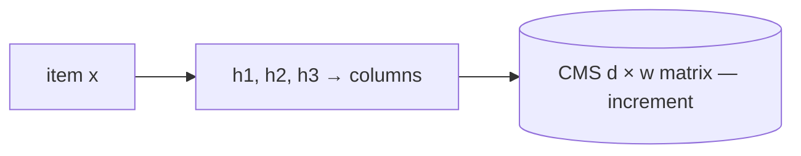

### Insertion (update operation)

To insert (or count) an element `x`, for each row `i`:

1. Compute `h_i(x)`
2. Increment `CMS[i][h_i(x)]`

**Example** — `d = 3` rows, `w = 5` columns. Insert `"apple"`:

```text
h1(apple) = 1    h2(apple) = 3    h3(apple) = 0

Row 1, col 1 → +1
Row 2, col 3 → +1
Row 3, col 0 → +1
```

Insert `"apple"` again — same positions increment again. Counts accumulate.

### Query (frequency estimation)

To estimate frequency of `x`:

1. Compute all `d` hash positions
2. Read all `d` counters
3. Return the **minimum** value

```text
estimate(x) = min( CMS[i][h_i(x)] )   for i = 1..d
```

### Why MIN?

Counters may have **collisions** — different elements map to the same cell. Some rows may be inflated by other keys. The **minimum** across rows is the least overestimated and closest to the true count.

**Example query** for `"apple"`:

```text
Positions:  Row 1 → col 1    Row 2 → col 3    Row 3 → col 0

Values:     CMS[1][1] = 5    CMS[2][3] = 4    CMS[3][0] = 5

Estimate:   min(5, 4, 5) = 4

True count might be 3 — estimate is slightly over.
```

### Why overestimation happens

Collisions inflate counters:

```text
"apple" and "banana" both increment the same cell in row 2
→ that cell counts both items
→ query for "apple" may read inflated value
```

### Key property

Count-Min Sketch **never underestimates** frequency (with standard parameters). Estimate is always **exact or higher** — overestimate only. This makes CMS safe for rate-limiting thresholds where undercounting would miss abuse.

### Memory efficiency

```text
Memory = O(d × w)   — fixed regardless of stream size or number of distinct keys
```

1 million distinct elements and 1 billion events both use the same sketch size.

### Accuracy trade-off

| Parameter | Effect |
|-----------|--------|
| **Larger width `w`** | Fewer collisions per row → better accuracy |
| **More depth `d`** | Better confidence; minimum across more rows |

### Error bound

With probability `(1 − δ)`:

```text
error ≤ ε × N
```

Where:

- `N` = total stream size (sum of all counts)
- `ε` = error factor ≈ `1 / w`
- `δ` = failure probability ≈ `e^(−d)`

```text
w controls error magnitude
d controls confidence
```

### Parameter selection

Typical sizing:

```text
w = ⌈e / ε⌉
d = ⌈ln(1 / δ)⌉
```

**Example:** `ε = 0.01` (1% error factor), `δ = 0.001` (99.9% confidence):

```text
w ≈ ⌈e / 0.01⌉ ≈ 272
d ≈ ⌈ln(1000)⌉ ≈ 7
```

### Comparison — hash map vs CMS

| | Hash map | Count-Min Sketch |
|---|----------|------------------|
| **Counts** | Exact | Approximate |
| **Memory** | O(distinct keys) | O(d × w) fixed |
| **Updates** | O(1) | O(d) |
| **Stores keys** | Yes | No |
| **Undercount** | No | Never (overestimate only) |

Bloom filter (membership) and HyperLogLog (distinct count) solve different streaming problems — see sections **13.1** and **13.2**.

### Variants

**Conservative update CMS** — only increments the minimum necessary counters to reduce overestimation.

**Count Sketch** — uses +1 / −1 updates (signed counters) to reduce bias; can underestimate in some variants.

**Conservative Count-Min Sketch** — minimizes unnecessary increments when collisions are detected.

### Heavy hitters problem

CMS is commonly used to find the **most frequent elements** in a stream:

1. Maintain a CMS over the stream
2. Query frequencies for candidate keys
3. Track top-K elements in a separate heap

Popular keys surface with high estimates; exact counters can be promoted for confirmed heavy hitters only.

### Workflow summary

**Insert:**

```text
Element  →  Compute d hashes  →  Increment d counters
```

**Query:**

```text
Element  →  Compute d hashes  →  Fetch d counters  →  Take minimum  →  Estimated frequency
```

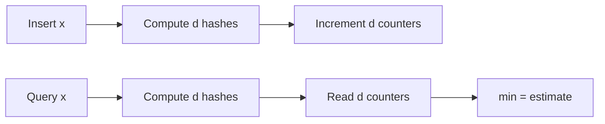

### Use cases

1. **Network traffic analysis** — packet frequency per IP
2. **Search engines** — query frequency tracking
3. **Distributed systems** — event counting across nodes (mergeable by adding matrices)
4. **Fraud detection** — repeated patterns or spikes
5. **Database analytics** — approximate `GROUP BY` counts
6. **AdTech** — impression counts per user/ad
7. **Logging systems** — log level frequency tracking

### Real-world systems

- Apache Storm / Apache Flink — streaming aggregations
- Redis modules — approximate counters
- Twitter — heavy-hitter analysis
- Network intrusion detection — DDoS and anomaly signals

### Real-world example

An API gateway tracks per-API-key request counts in a CMS instead of a full hash map with millions of keys. Keys whose sketch estimate exceeds a threshold trigger exact counters or throttling — catching abuse with fixed memory.

### Advantages

- Extremely memory efficient for unbounded key spaces
- Fast streaming updates O(d) per event
- Never underestimates — safe for rate limits
- Mergeable across shards (add counter matrices element-wise)

### Limitations

- Overestimates counts — cannot correct downward
- No deletion support in standard CMS (unless modified variants)
- Collisions affect accuracy on skewed distributions
- Cannot retrieve original keys or list all items
- Not suitable for exact billing

### Best practices

- Size `w` and `d` from target `ε` and `δ` before deployment.
- Use conservative updates when overcounting causes unnecessary throttling.
- Pair CMS with a small exact counter map for confirmed heavy hitters.
- Merge sketches from edge nodes for global frequency views.

### Common mistakes

- Using CMS for exact per-key billing
- Too few rows (`d`) → high variance in estimates
- Confusing CMS frequency with Bloom membership or HLL distinct count
- Querying keys never inserted — estimate may reflect collision noise from other keys

### Summary

```text
Count-Min Sketch = d × w counter matrix; d hashes per insert; query = min across rows
Never underestimates (overestimate only); fixed memory; heavy hitters and rate limiting
w = e/ε, d = ln(1/δ)
```

---


## 13.4 Trie

### Definition

A **trie** (prefix tree) is a tree-based data structure used to store strings in a way that allows efficient **prefix-based** operations.

Each node represents a character; paths from root to nodes represent prefixes or complete words.

Also called:

- **Prefix tree**
- **Digital tree**
- **Radix tree** (compressed form)

### Core idea

Instead of storing whole words as separate entities, a trie **shares common prefixes**.

```text
Words:  cat, car, cart, dog

Shared structure:

c → a → t          (cat)
      → r          (car)
         → t       (cart)
d → o → g          (dog)
```

### Structure

Each trie node contains:

1. **Children map** — `char → node`
2. **End-of-word flag** — marks a complete word

```text
Node {
  children: map<char, Node>
  isEndOfWord: boolean
}
```

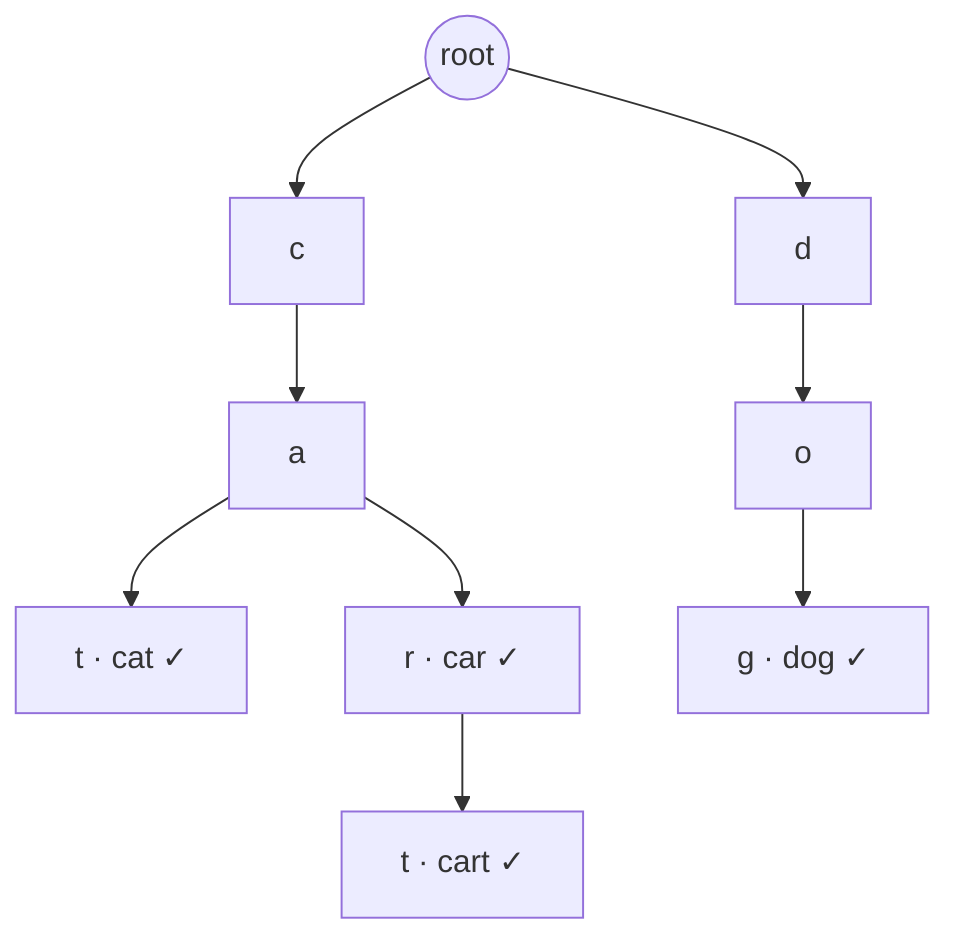

### Insertion

**Insert `"cat"`:**

```text
Root → c (create) → a (create) → t (create) → isEndOfWord = true
```

**Insert `"car"`:**

```text
Root → c → a (already exists) → r (create) → isEndOfWord = true
```

**Insert `"cart"`** — extends existing `c → a → r` path with `t` and marks end.

**Insert `"dog"`** — new branch from root: `d → o → g`.

### Search operation

**Search `"car"`:**

```text
root → c → a → r → exists, isEndOfWord = true  →  FOUND
```

**Search `"ca"`:**

```text
root → c → a → exists, isEndOfWord = false  →  NOT a complete word
(but valid prefix exists)
```

### Prefix search

Tries are extremely efficient for prefix queries.

**Find all words starting with `"ca"`:**

1. Traverse `c → a`
2. From node `a`, explore all descendants collecting terminal nodes

```text
Result: cat, car, cart
```

No full-dataset scan required — only the subtree under the prefix.

### Time complexity

| Operation | Complexity | Notes |
|-----------|------------|-------|
| **Insert** | O(L) | L = string length |
| **Search** | O(L) | L = string length |
| **Prefix query** | O(L + K) | K = number of matched results |

### Memory usage

Trie stores one node per character along each path.

```text
Worst case:  O(total characters in all words)
Best case:   much less when words share long prefixes
```

Pointer-heavy structure — not cache-friendly unless compressed.

### Trie node variants

**1. Array-based trie** — `children[26]` for lowercase English letters. Fast traversal but memory-heavy for sparse alphabets.

**2. HashMap-based trie** — `children: map<char, Node>`. More memory-efficient; slightly slower per step.

**3. Compressed trie (radix tree)** — compress single-child chains.

```text
Instead of:  c → a → t  (three nodes)
Store:      "cat" on one edge  (one node)
```

**4. Ternary search trie** — each node has left, middle, right pointers. Used for memory optimization in some dictionaries.

### Deletion

1. Traverse to the word's final node
2. Unmark `isEndOfWord`
3. Remove nodes only if they have no children **and** are not the end of another word

**Example** — trie contains `cat`, `car`, `cart`. Delete `"car"`:

```text
c → a → r  →  unmark isEndOfWord on r
Nodes remain because "cart" still uses c → a → r → t
```

### Space optimization techniques

| Technique | Idea |
|-----------|------|
| **Compressed trie / radix tree** | Merge single-child chains into multi-char edges |
| **Ternary trie** | Three-way branching per node |
| **DAWG** | Directed Acyclic Word Graph — merge identical suffixes |
| **Patricia trie** | Binary trie on bit strings; used for IP routing |

**DAWG** merges identical suffixes — common in advanced dictionaries and NLP systems for static word sets.

### Longest prefix matching

Used in **IP routing**. Given IP `192.168.1.10`, find the most specific route prefix (e.g. `192.168.1.0/24`). Trie-style structures walk bits of the address to find the longest matching prefix efficiently.

### Trie vs hash map

| | Hash map | Trie |
|---|----------|------|
| **Lookup** | O(1) average | O(L) |
| **Prefix support** | No | Yes |
| **Stores** | Full keys | Character paths |
| **Best for** | Exact key lookup | String prefixes, autocomplete |

### Trie vs binary search

| | Binary search | Trie |
|---|---------------|------|
| **Requires** | Sorted list | No sorting |
| **Lookup** | O(log N) | O(L) |
| **Prefix queries** | Poor (scan or multiple searches) | Natural O(L + K) |

### Applications

1. **Autocomplete** — search engines, IDE code suggestions
2. **Spell checkers** — dictionary word validation
3. **IP routing** — longest prefix match in routers
4. **Contact search** — phone directories
5. **Word games** — Scrabble, Boggle solvers
6. **Text processing** — prefix matching in NLP

### Real-world example

A search box autocomplete stores millions of queries in a trie. When the user types `"sys"`, the engine walks to the `"sys"` node and returns all descendant terminal strings ranked by popularity — without scanning the full dictionary.

### Advantages

- Fast prefix search and efficient autocomplete
- No hashing required; predictable O(L) lookup
- Natural dictionary representation; shared prefixes save space when keys overlap

### Disadvantages

- High memory usage (pointer-heavy) for sparse datasets
- Not cache-friendly compared to flat arrays
- More overhead than hash maps for simple exact-key lookup only

### Best practices

- Use radix trees or DAWGs when the dictionary is static and large.
- Store popularity scores at terminal nodes for ranked autocomplete.
- For IP routing, use Patricia/radix multi-bit tries for CIDR blocks.
- Prefer HashMap-based children when alphabet is large or sparse.

### Common mistakes

- Plain trie on huge sparse key spaces without compression
- Confusing trie prefix search with fuzzy edit-distance matching (different algorithms)
- Deleting nodes that are still needed by other words
- Using trie when only exact O(1) lookup is needed (hash map is simpler)

### Summary

```text
Trie = prefix tree; nodes per character; isEndOfWord marks complete words
O(L) insert/search; O(L+K) prefix query; shares prefixes across words
Radix/DAWG/Patricia compress space; autocomplete, spell check, IP LPM
```

---


## 13.5 Skip Lists

### Definition

A **skip list** is a probabilistic data structure that supports fast **search**, **insertion**, and **deletion** in a sorted sequence.

It works like a layered linked list with **express lanes** that skip over elements. Performance is similar to balanced trees (AVL, red-black) but the implementation is simpler.

### Core idea

A normal sorted linked list:

```text
Head → 1 → 3 → 5 → 7 → 9 → NULL
```

Search is **O(n)** — walk every node.

A skip list adds multiple levels with fewer nodes at each higher level:

```text
Level 2 (express):  Head → 1 --------→ 5 --------→ 9 → NULL
Level 1 (full):     Head → 1 → 3 → 5 → 7 → 9 → NULL
```

Higher levels let you skip large sections before dropping down to finer levels.

### Structure

A skip list consists of multiple layers:

```text
Level 3: sparse
Level 2: medium
Level 1: dense (full sorted list)
```

Each node contains:

1. **Value**
2. **Forward pointers** — one per level the node participates in

```text
Node {
  value
  forward[levels]
}
```

### Visualization

```text
Level 3:        1 ----------------- 9
Level 2:        1 -------- 5 ------ 9
Level 1:        1 - 3 - 5 - 7 - 9
```


**Key property:** higher levels contain fewer nodes. Each higher level acts as an express highway.

### How levels are assigned

When inserting a node, its level is chosen **randomly** — typically a coin-flip with probability `p` (commonly `0.5`):

```text
Level increases while coin = heads

Example assignments:
  1 → level 3
  3 → level 1
  5 → level 2
```

**Probability model:**

```text
P(level ≥ i) = p^(i−1)

With p = 0.5, higher levels become exponentially rare.
```

### Search operation

To search for a value, start at the **top-left** (head at highest level):

1. Move **right** while next value < target
2. If next value > target, go **down** one level
3. Repeat until bottom level

**Example — search for 7:**

```text
Level 3:  1 → 9        (9 > 7, stop at 1, go down)
Level 2:  1 → 5 → 9    (9 > 7, stop at 5, go down)
Level 1:  5 → 7        FOUND
```

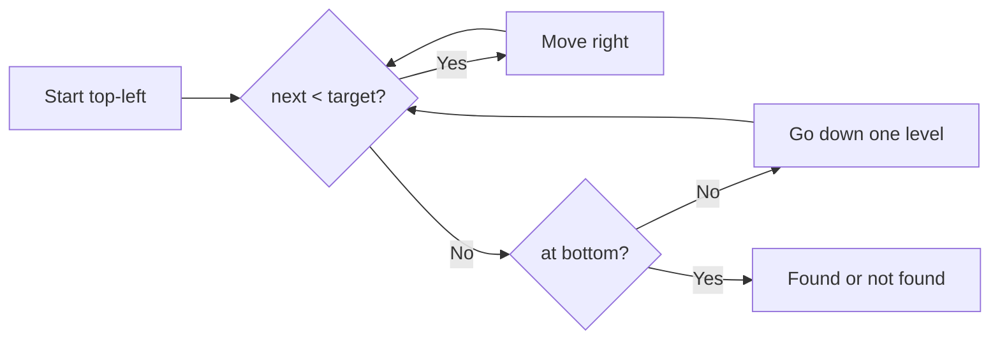

### Why logarithmic?

Each higher level skips about half the nodes (with `p = 0.5`):

```text
Level 1: n nodes
Level 2: n/2
Level 3: n/4
...
Height ≈ log n
```

| Operation | Average | Worst case |
|-----------|---------|------------|
| **Search** | O(log n) | O(n) |
| **Insert** | O(log n) | O(n) |
| **Delete** | O(log n) | O(n) |

### Insertion

1. Find position using search logic (track predecessors at each level)
2. Randomly decide node level
3. Insert node at all chosen levels
4. Update forward pointers

**Example — insert 6:**

```text
Find position between 5 and 7
Random level = 2

Level 2:  5 → 6 → 7
Level 1:  5 → 6 → 7
```

### Deletion

1. Search for the node at all levels where it appears
2. Remove forward pointers referencing the node
3. Adjust links at each level
4. Free the node

### Space complexity

Expected **O(n)** total pointers. Each node may appear in multiple levels, but expected pointer count per node ≈ `1 / (1 − p)` — linear overall with `p = 0.5`.

### Skip list vs balanced tree

| | Balanced tree (AVL / red-black) | Skip list |
|---|--------------------------------|-----------|
| **Balancing** | Strict deterministic rules | Probabilistic |
| **Rotations** | Required | None |
| **Implementation** | Complex | Simpler |
| **Concurrency** | Harder lock-free | Easier lock-free |
| **Worst case** | O(log n) guaranteed | O(n) possible |

### Performance intuition

Think of a skip list as a road network:

```text
Level 3: highways     — few stops, long jumps
Level 2: main roads   — medium granularity
Level 1: local streets — every node
```

You travel **highway → main road → local street** instead of walking every node.

### Applications

1. **In-memory databases** — sorted indexes
2. **Key-value stores** — Redis sorted sets (`ZSET`) use skip lists for rank/range
3. **Distributed systems** — fast ordered lookup tables
4. **Concurrent data structures** — lock-free skip lists
5. **File systems** — indexing metadata

### Why used in real systems

Skip lists are preferred when:

- Simplicity matters more than worst-case guarantees
- Concurrency is required without tree rotation complexity
- Predictable **average** O(log n) performance is sufficient

**Redis** combines skip list + hash table: O(1) member → score lookup via hash; O(log n) rank and range via skip list.

### Real-world example

Redis `ZADD leaderboard 100 "player42"` stores members in a skip list by score. `ZRANK` and `ZRANGE` walk the skip list; `ZSCORE` hits the hash table directly.

### Advantages

- Simple to implement; no rotation logic
- Efficient average search, insert, delete
- Supports ordered operations (range scan, rank)
- Good fit for concurrent / lock-free designs

### Disadvantages

- Worst-case O(n) if randomization produces a degenerate structure
- Randomization quality matters
- Slightly more memory than a flat array
- Not cache-optimal on disk — B-trees preferred for disk-backed indexes

### Best practices

- Use `p = 0.5` and cap max level at `log₂(n)` for expected balance.
- For disk-backed ordered stores, prefer B-trees; skip lists shine in memory.
- Combine with a hash map when you need both O(1) key lookup and ordered traversal.

### Common mistakes

- Using skip lists on disk where B-trees are standard
- Assuming worst-case O(log n) — only average case
- Implementing concurrency without careful lock ordering on level updates
- Poor random number source → unbalanced levels → degraded performance

### Summary

```text
Skip list = layered linked list with express lanes; coin-flip level assignment
Search: go right while < target, go down when ≥ target; O(log n) average
Simpler than balanced trees; Redis ZSET; highway → main road → local street intuition
```

---


## 13.6 Merkle Trees

### Definition

A **Merkle tree** (hash tree) is a cryptographic tree data structure used to efficiently and securely verify the **integrity** of large datasets.

Leaf nodes contain hashes of data blocks; parent nodes contain hashes of their children. The top node is the **Merkle root** — a single fingerprint for the entire dataset.

### Core idea

Instead of verifying all data items individually, repeatedly hash pairs until one root hash remains.

```text
Root represents entire dataset
Any change in underlying data → completely different root
```

### Structure — building the tree

**Example dataset:** A, B, C, D

**Step 1 — leaf hashes:**

```text
H(A)   H(B)   H(C)   H(D)
```

**Step 2 — pairwise hashing:**

```text
H(AB) = hash(H(A) || H(B))
H(CD) = hash(H(C) || H(D))
```

**Step 3 — root:**

```text
Root = H(ABCD) = hash(H(AB) || H(CD))
```

```text
            Root
          /      \
      H(AB)      H(CD)
      /   \      /   \
   H(A) H(B)  H(C) H(D)
```

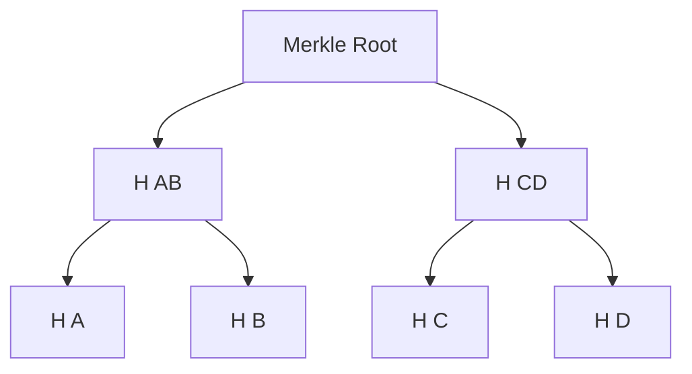

### Merkle root

The single hash at the top summarizes all data. Even a tiny change in any leaf completely changes the root hash — making tampering detectable.

### Hash function requirements

Must be:

- **Deterministic** — same input → same hash
- **Fast** — practical for large datasets
- **Collision-resistant** — infeasible to find two inputs with same hash

Common choices: **SHA-256**, **SHA-3**. Avoid deprecated algorithms (MD5, SHA-1 for security-critical use).

### Verification concept

Instead of downloading or comparing an entire dataset, verify integrity using only:

- The **root hash** (known good reference)
- A small subset of hashes along a **proof path** — O(log N) hashes

### Merkle proof

A Merkle proof verifies a **specific element** without the full tree.

**Example — verify block B:**

Need sibling hashes along the path to root:

```text
H(A)     — sibling of H(B)
H(CD)    — sibling of H(AB)
Root     — expected root
```

**Steps:**

1. Compute `H(B)`
2. Compute `H(AB) = hash(H(A) || H(B))`
3. Compute `hash(H(AB) || H(CD))`
4. Compare with known root — if match, B is valid

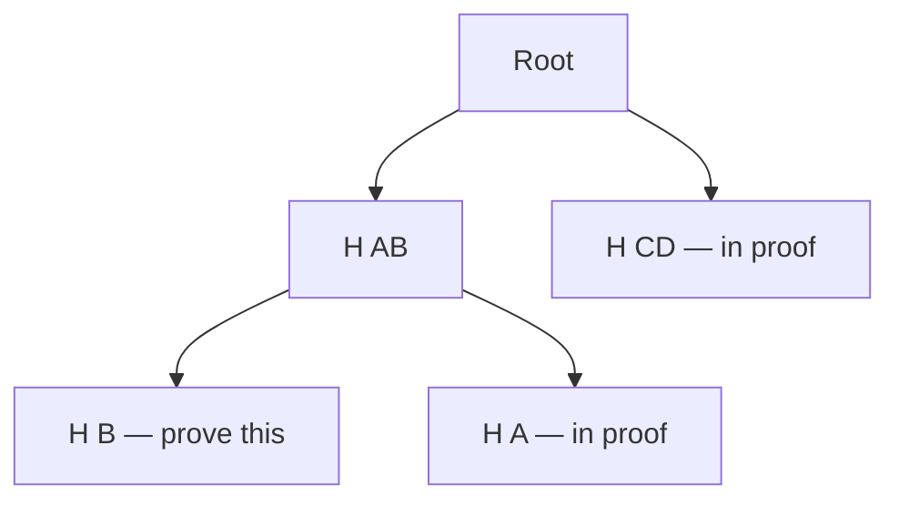

### Why it works

Hash functions are **one-way** and **collision-resistant**. Any change in data → changes leaf hash → propagates through all parent hashes → changes root.

### Efficiency and complexity

| | Complexity |
|---|------------|
| **Tree height** | O(log N) — each level halves nodes |
| **Construction** | O(N) — hash each node once per level |
| **Space** | O(N) nodes |
| **Proof verification** | O(log N) hashes — vs O(N) for full dataset compare |

Instead of verifying N items, verify only **O(log N)** hashes.

### Balanced tree property

Merkle trees are usually **binary and balanced**. If an odd number of nodes at a level, the last node is **duplicated** or carried forward before hashing — convention must be consistent between prover and verifier.

### Comparison with simple hashing

| | `hash(all data)` | Merkle tree |
|---|------------------|-------------|
| **Single fingerprint** | Yes | Yes (root) |
| **Prove one element** | No — must rehash everything | Yes — O(log N) proof |
| **Localize changes** | No | Yes — bisect divergent subtrees |
| **Scalable verification** | No | Yes |

### Variants

**1. Binary Merkle tree** — standard form described above.

**2. Merkle Patricia tree** — combines trie structure with cryptographic hashing. Used in **Ethereum** for account balances, contract state, and key-value storage.

**3. Sparse Merkle tree** — represents entire key space (including empty slots). Useful for zero-knowledge proofs and audit systems.

### Use cases

**Data integrity** — file downloads, software updates, cloud storage. If root hash matches → data is intact.

**Distributed systems** — nodes agree on dataset state without byte-by-byte comparison:

- **Git** — tree objects are Merkle structures; `git diff` localizes changes
- **Cassandra** — anti-entropy repair exchanges roots, bisects to find divergent SSTable ranges
- **Certificate Transparency** — auditable TLS certificate logs
- **IPFS** — content-addressed blocks linked by hashes

**Blockchain** — each block contains transactions and a Merkle root of those transactions:

- Efficient per-transaction verification
- Lightweight **SPV (Simplified Payment Verification)** clients

### SPV — simplified payment verification

A lightweight blockchain node does **not** download the full blockchain. It downloads block headers and uses Merkle proofs to verify specific transactions belong in a block.

**To prove transaction X exists:**

```text
Provide:  H(X)  +  sibling hashes along path to root
Verifier recomputes root → if match, transaction is valid
```

### Security property

If even one transaction (or data block) changes:

```text
leaf hash changes → parent hashes change → root changes
```

Tampering is detectable by comparing roots alone.

### Real-world example

Two Cassandra replicas exchange Merkle tree roots for a partition. Roots differ → walk divergent branches to find exact SSTable ranges that disagree → stream only those ranges for repair instead of full table comparison.

### Advantages

- Efficient integrity verification with O(log N) proofs
- Minimal data transfer for inclusion proofs
- Tamper detection via root comparison
- Scales to very large datasets
- Supports distributed verification across replicas

### Limitations

- Tree maintenance overhead on frequent updates (use incremental Merkle trees)
- Extra computation vs storing raw data alone
- Dynamic datasets require rebuild or incremental update strategies
- Proof must be generated for each inclusion query
- Not a search structure — proves membership/integrity, not arbitrary lookup

### Best practices

- Use SHA-256 or stronger; document hash concatenation order (`left || right`).
- Exchange roots before bulk sync; bisect on mismatch to minimize transfer.
- Use incremental Merkle trees when data changes frequently.
- For range proofs, use sorted-leaf variants.

### Common mistakes

- Rebuilding the full tree on every small update
- Inconsistent odd-node handling (duplicate vs promote) between implementations
- Treating Merkle trees as indexes for key lookup
- Using weak hash functions for security-critical proofs

### Summary

```text
Merkle tree = hash pairs up to root; root = cryptographic fingerprint of all data
Merkle proof = O(log N) sibling hashes verify one element; tamper changes root
Git, Cassandra repair, blockchain SPV, Ethereum Patricia tree; not a search index
```

---


## 13.7 Distributed Hash Tables

### Definition

A **Distributed Hash Table (DHT)** is a decentralized key-value store where data is distributed across multiple nodes, and each node is responsible for a portion of the keyspace.

It provides:

- Scalable storage
- Decentralized lookup
- Fault tolerance

There is **no central server**.

### Core idea

Instead of storing all key-value pairs on one machine:

- Split the key space across nodes
- Assign each node responsibility for a segment
- Route requests to the correct node using hashing

```text
put(key, value)  →  hash(key)  →  mapped to node  →  stored there
get(key)         →  hash(key)  →  routed to owner  →  retrieved
```

### Why DHT is needed

**Centralized hash table problems:**

- Single point of failure
- Limited scalability
- Bottleneck under load

**DHT solves:**

- Horizontal scalability
- Fault tolerance
- Distributed storage without a coordinator

### Key component — hash function

A consistent hash function maps keys into a fixed identifier space:

```text
hash(key) → position on ring / node_id
```

Example: `hash("file1") = 65` → stored on the node responsible for that range.

### Node ring (conceptual model)

Most DHTs use a **logical ring** structure.

```text
Node IDs on ring (example 0–255 space):

  10 → Node A
  50 → Node B
 120 → Node C
 200 → Node D

Ring wraps: 0 → 255 → back to 0
```

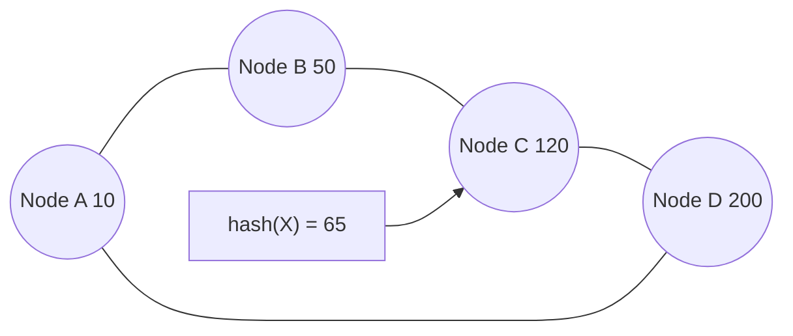

### Key assignment rule — consistent hashing

A key is stored on the **first node whose ID ≥ hash(key)** (clockwise successor on the ring).

If no node has a higher ID, **wrap around** to the first node.

**Example:**

```text
Nodes: 10, 50, 120, 200
hash("X") = 65  →  stored at Node 120 (next highest)
```

Adding a node moves only **K/N** keys on average — vs nearly all keys with naive `hash(key) % N`.

### Lookup process

1. Hash the key
2. Determine the responsible node (successor)
3. Route request to that node via overlay routing
4. Retrieve or store the value

### Routing challenge

Nodes do **not** know full system state. Structured DHTs maintain:

- Routing tables (finger tables, k-buckets)
- Neighbor pointers (successor, predecessor)
- Overlay network for O(log N) hops

Naive linear walk around the ring is **O(N)** — too slow at scale.

### Chord DHT

Chord organizes nodes in a ring. Each node maintains:

- **Successor** — next node clockwise
- **Finger table** — skip pointers for fast lookup

**Finger table** — instead of stepping one node at a time, store shortcuts:

```text
node → node + 2^0
node → node + 2^1
node → node + 2^2
node → node + 2^3
...
```

Enables **O(log N)** lookup.

**Lookup example** — search for key owned near node 120, start at node 10:

```text
10 → 50 → 120   (jump via finger table, not 10 → 11 → 12 → ...)
```

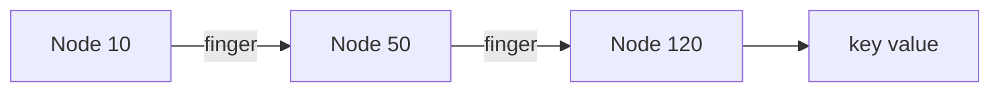

### Time complexity

| Operation | Structured DHT (Chord, Kademlia) |
|-----------|----------------------------------|
| **Lookup** | O(log N) |
| **Insert** | O(log N) |
| **Delete** | O(log N) |

### Replication

To improve fault tolerance, each key is stored on multiple nodes:

```text
Primary:   node responsible for hash(key)
Replicas:  next k successor nodes on the ring
```

Example: key at Node 50 → replicas at successors 120, 200.

**Cassandra** uses consistent hashing + vnode + configurable replication factor (RF ≥ 3).

### Failure handling

If a node fails:

- Successor takes over the key range
- Replicas serve reads/writes until rebalancing completes
- System **self-heals** as routing tables update

### Node join

1. New node claims a position on the ring
2. Takes part of the key range from its predecessor
3. Keys transfer to the new node
4. Routing tables (finger tables / k-buckets) update across peers

### Node leave

1. Keys reassigned to successor nodes
2. Replicas ensure no data loss during graceful or detected failure
3. Neighbor pointers and routing tables adjust

### Load balancing and virtual nodes

Hashing aims for uniform key distribution, but physical nodes can still become unevenly loaded.

**Virtual nodes (vnodes)** — each physical machine owns multiple positions on the ring:

```text
Node A → positions 10, 110, 210
Node B → positions 30, 130, 230
```

Benefits: better load distribution, smoother scaling when nodes join or leave.

### CAP considerations

DHT systems typically operate under network partitions. Most prioritize:

```text
Availability + Partition tolerance
```

over strong consistency — especially in wide-area P2P networks.

### Consistency model

Typically **eventual consistency** — not strong consistency. Updates propagate asynchronously between replicas; readers may see stale values briefly.

### Kademlia (important variant)

Uses **XOR distance** metric:

```text
distance(a, b) = a XOR b
```

Nodes store **k-buckets** of peers at varying XOR distances. Used in **BitTorrent** (DHT), **Ethereum** node discovery, **IPFS**.

Advantages: faster routing table updates, efficient lookup, robust against churn (frequent join/leave).

### Other real systems

| System | Notes |
|--------|-------|
| **Chord** | Finger table ring; foundational academic DHT |
| **Kademlia** | XOR metric; BitTorrent, Ethereum |
| **Pastry** | Prefix-based routing |
| **CAN** | Content Addressable Network — multi-dimensional space |
| **Cassandra** | Ring + vnode + RF; not pure DHT but same hashing model |

**Rendezvous hashing (HRW)** — alternative when ring management is complex: `hash(node, key)` highest wins.

### Applications

1. **Peer-to-peer networks** — BitTorrent trackerless DHT
2. **Distributed storage** — IPFS content routing
3. **Blockchain** — node discovery (Ethereum Kademlia)
4. **Content delivery** — decentralized caching
5. **Cloud storage** — scalable object lookup (Cassandra-style rings)

### Real-world example

A Cassandra cluster adds a fourth node. With consistent hashing and vnodes, only ~25% of partitions migrate to the new node. With naive `hash(key) % N`, nearly all keys would reshuffle — breaking caches and overloading the cluster.

### Advantages

- Horizontal scalability without central coordinator
- O(log N) lookup in structured DHTs
- Minimal key movement on topology change (consistent hashing)
- Fault tolerance via replication and self-healing

### Limitations

- Eventual consistency — not suitable for all workloads without extra coordination
- Hot spots if keys skew (mitigate with vnodes and application sharding)
- Operational complexity — gossip, failure detection, ring rebalancing
- Churn (rapid join/leave) stresses routing table maintenance

### Best practices

- Use vnodes (e.g. 256 per physical node) for even load distribution.
- Pair consistent hashing with replication factor ≥ 3.
- Monitor ring imbalance and hot partitions.
- Prefer Kademlia-style designs for high-churn P2P environments.

### Common mistakes

- `hash(key) % num_nodes` when cluster size changes frequently
- Too few vnodes → uneven partition sizes
- Ignoring skewed access patterns that bypass uniform hashing
- Expecting strong consistency without quorum reads/writes (Cassandra tunable consistency is separate)

### Key insight

A DHT turns a collection of independent nodes into a **single logical hash table** by using consistent hashing and distributed routing, enabling scalable and fault-tolerant key-value storage without any central coordinator.

### Summary

```text
DHT = decentralized KV store; consistent hashing assigns keys to ring segments
Chord finger tables / Kademlia XOR → O(log N) lookup; replication + self-healing
Vnodes balance load; eventual consistency; BitTorrent, IPFS, Cassandra, Ethereum
```

---


## 13.8 UUID

### Definition

A **UUID** (Universally Unique Identifier) is a 128-bit identifier used to uniquely identify information in distributed systems **without central coordination**.

It is designed to be globally unique across space and time. UUID is not about absolute uniqueness — it makes collisions so improbable they can be ignored in real-world systems.

### Core idea

Instead of sequential IDs (`1, 2, 3…`) that require a central allocator:

```text
UUIDs are:
  → extremely unlikely to collide
  → independent across machines
  → safe in distributed / offline generation
```

**Example:**

```text
550e8400-e29b-41d4-a716-446655440000
```

### Structure

UUID = **128 bits** (16 bytes), typically shown as **8-4-4-4-12** hexadecimal:

```text
xxxxxxxx-xxxx-Mxxx-Nxxx-xxxxxxxxxxxx

550e8400 - e29b - 41d4 - a716 - 446655440000
```

**Field meaning:**

- **M** (version nibble) — UUID generation version (1, 3, 4, 5, 7, …)
- **N** (variant bits) — layout scheme per RFC 9562

Store as `BINARY(16)` or native `UUID` type in databases — not `CHAR(36)` — for space and comparison speed.

### UUID versions

| Version | Method | Properties |
|---------|--------|------------|
| **v1** | Timestamp + MAC/node ID + clock sequence | Sortable by time; **privacy risk** (MAC leakage) |
| **v2** | DCE security — adds POSIX UID/GID | Rarely used |
| **v3** | Namespace + name → **MD5** hash | Deterministic: same input → same UUID |
| **v4** | **Random** (122 bits) | Most common; opaque; poor DB index locality |
| **v5** | Namespace + name → **SHA-1** hash | Deterministic; more secure than v3 |
| **v7** | 48-bit Unix ms timestamp + random | **Modern default** for DB PKs; time-ordered |

#### Version 1 — time-based

Uses timestamp, MAC address (or random node ID), and clock sequence. Partially sortable but may expose hardware identity.

#### Version 4 — random (most common)

Generated from random or cryptographically secure random bits. Widely used when opacity and zero coordination matter.

**Generation process:**

1. Generate 122 random bits
2. Set version bits = 4
3. Set variant bits per RFC
4. Format as hexadecimal string

#### Version 3 / 5 — name-based

```text
UUID = hash(namespace UUID + name)

v3 → MD5    v5 → SHA-1
Same namespace + name always produces the same UUID (deterministic).
```

#### Version 7 — time-ordered (RFC 9562)

48-bit millisecond timestamp prefix + random bits. Sortable like ULID/Snowflake; better B-tree insert locality than v4. Preferred for new write-heavy database primary keys.

### Collision probability

UUID v4 has **122 random bits** (6 bits reserved for version + variant).

```text
Total possibilities ≈ 2^122 ≈ 5.3 × 10^36
```

Even generating billions per second for years, collision probability remains **practically negligible**. Billions of devices over long periods remain safe.

**Why 122 bits, not 128?** Version and variant fields are fixed — usable randomness is reduced.

### Database impact

Using **UUID v4** as a primary key causes problems:

- Random insertion order → **B-tree fragmentation**
- Slower writes and larger indexes vs sequential integers

**Mitigations:**

- Use **UUID v7** (time-ordered)
- Use **ULID** or **Snowflake** (see sections 13.9–13.11)

### UUID vs auto-increment ID

| | Auto-increment | UUID |
|---|----------------|------|
| **Example** | 1, 2, 3, 4 | `550e8400-e29b-…` |
| **Size** | Small (4–8 bytes) | 16 bytes |
| **Ordering** | Sequential | v4: none; v7: time-ordered |
| **Global uniqueness** | No — per database | Yes |
| **Coordination** | Central DB sequence | None (v4/v7) |
| **Indexing** | Fast sequential inserts | v4: fragmented; v7: better |

### ID schemes — canonical comparison

Use this table when choosing between distributed ID options. Sections **13.9–13.11** expand Snowflake, ULID, and KSUID without repeating the full matrix.

| | UUID v4 | UUID v7 | Snowflake | ULID | KSUID |
|---|---------|---------|-----------|------|-------|
| **Size** | 16 bytes | 16 bytes | 8 bytes | 16 bytes (26 char) | 20 bytes (27 char) |
| **Sortable** | No | Yes (ms) | Yes (ms) | Yes (ms) | Yes (seconds) |
| **Coordination** | None | None | Worker/DC IDs | None | None |
| **Clock dependency** | No | Yes | Yes | Yes | Yes |
| **B-tree locality** | Poor | Good | Good | Good | Good |
| **String form** | 36 chars | 36 chars | Numeric | 26 chars Base32 | 27 chars Base62 |
| **Entropy** | 122 bits | ~74 bits random | Per-ms sequence | 80 bits random | 128 bits random |

**Choose UUID v7** when: standard format, sortable, no worker registry, client-generated IDs.

**Choose Snowflake** (13.9) when: compact 64-bit numeric PK, high insert rate.

**Choose ULID** (13.10) or **KSUID** (13.11) when: URL-safe string IDs with lexicographic sort — KSUID trades ms precision for 128-bit randomness.

**Choose UUID v4** when: opacity matters more than index locality; low write volume.

### Use cases

1. **Distributed systems** — microservice entity IDs
2. **Databases** — primary keys in sharded / replicated tables
3. **File systems** — object identifiers
4. **Messaging** — message and correlation IDs
5. **APIs** — request tracing (`X-Request-ID`)
6. **Logs / events** — opaque event identifiers

### Advantages

- Globally unique without central coordination
- Works across distributed and offline clients
- Easy to generate; library support everywhere
- v4 opaque and non-guessable; v3/v5 deterministic when needed

### Disadvantages

- Large (128-bit) vs 64-bit integers
- Not human-friendly (36-char string)
- v4 poor index locality → fragmented B-trees
- v1 leaks MAC address (privacy)

### Best practices

- Default to **UUID v7** for new write-heavy database primary keys.
- Store as `BINARY(16)`, not `CHAR(36)`.
- Do not use v1 in public-facing contexts.
- Use v3/v5 only when deterministic IDs from namespace+name are required.

### Common mistakes

- UUID v4 as PK on high-write tables → index fragmentation
- Storing as string in every index column → wasted space
- Assuming v4 is sortable by creation time
- Ignoring v7 monotonic collision risk at same millisecond without extra random bits

### Summary

```text
UUID = 128-bit RFC 9562 ID; v4 random (122 bits), v7 time-ordered (preferred for DBs)
Collisions practically impossible; v4 fragments indexes — use v7/ULID/Snowflake instead
No coordination; comparison table above covers Snowflake, ULID, KSUID
```

---


## 13.9 Snowflake IDs

### Definition

A **Snowflake ID** is a 64-bit unique identifier for distributed systems that is:

- **Time-ordered**
- **Globally unique** without central coordination
- **Scalable** across many nodes

Originally designed by **Twitter** (now X) for tweet IDs at massive scale.

### Core idea

Instead of random UUIDs or sequential database IDs, Snowflake encodes structured metadata into one 64-bit integer:

```text
timestamp  +  machine/node ID  +  sequence number
```

This makes IDs **unique**, **sortable by time**, and **efficiently indexable** in B-trees.

### 64-bit structure

| Bits | Component | Notes |
|------|-----------|-------|
| **1** | Sign bit | Always 0 (positive int64) |
| **41** | Timestamp | Milliseconds since custom epoch (~69 years) |
| **10** | Worker / machine ID | Identifies generating node (often 5 DC + 5 worker) |
| **12** | Sequence | Per-millisecond counter on that node |

```text
| 0 | timestamp (41) | worker_id (10) | sequence (12) |
```

**Twitter layout** splits the 10 worker bits:

```text
| 0 | timestamp (41) | datacenter (5) | worker (5) | sequence (12) |

Datacenter: 2^5 = 32 DCs
Worker:     2^5 = 32 machines per DC  →  1,024 total generators
Sequence:   2^12 = 4,096 IDs per ms per node
```


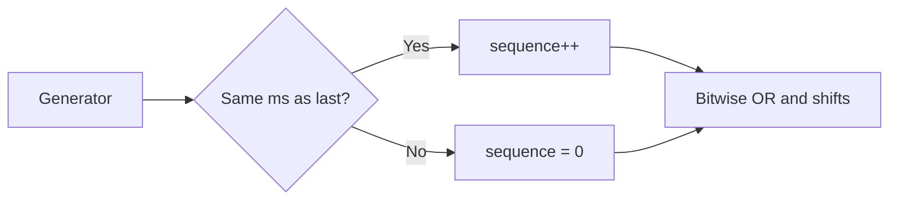

### Bit breakdown

**1. Sign bit (1 bit)** — always 0; keeps ID a positive integer.

**2. Timestamp (41 bits)** — milliseconds since a **custom epoch** (Twitter: 2010-11-04).

```text
timestamp = current_time_ms - custom_epoch
```

Provides ~69 years of range from epoch.

**3. Worker / machine ID (10 bits)** — uniquely identifies the generating node. Must be provisioned at deploy (config service, ZooKeeper, etc.). Two generators with the same worker ID can collide.

**4. Sequence (12 bits)** — increments when multiple IDs are generated in the **same millisecond** on the same node. Max 4,096 IDs/ms per node.

### How the ID is constructed

```text
id = (timestamp << 22) | (datacenter_id << 17) | (worker_id << 12) | sequence
```

Bitwise composition packs all fields into one int64.

**Example:**

```text
timestamp  = 1000000000
worker_id  = 25
sequence   = 12

Packed → single 64-bit integer (e.g. 2199023255552)
```

### Generation flow

1. Get current timestamp (ms)
2. Compare with last timestamp
3. If **same millisecond** → increment sequence; else reset sequence = 0
4. If sequence exceeds 4095 → **wait for next millisecond**, then reset sequence
5. Combine fields with bit shifts
6. Return final ID

**Production pattern (clock backward jump):**

```text
now = currentTimeMs()
if now < lastTimestamp:
    wait until now >= lastTimestamp      # prevent duplicate IDs
if now == lastTimestamp:
    sequence = (sequence + 1) & 4095
    if sequence == 0: wait next ms       # sequence exhausted
else:
    sequence = 0
lastTimestamp = now
```

### Sequence handling

If sequence exceeds 4,095 in the same millisecond:

```text
→ spin-wait until next millisecond
→ reset sequence to 0
```

Ensures uniqueness under burst load (~4,096 IDs/ms/node).

### Uniqueness guarantee

Snowflake IDs are unique because:

- **Timestamp** — separates IDs across time
- **Worker ID** — separates IDs across nodes
- **Sequence** — separates IDs within the same millisecond on one node

### Ordering property

IDs are **roughly time-sorted**:

```text
ID generated earlier < ID generated later
```

Useful for timelines, feeds, log ordering, and time-range queries on primary keys.

### Scalability

Each node generates independently:

```text
Per node:   ~4,096 IDs/ms  ≈  ~4M IDs/sec
Cluster:    scales linearly with number of provisioned workers
```

No central database round-trip per ID.

### Clock dependency

Snowflake requires a **correct, monotonic millisecond clock** per worker.

| Scenario | Risk | Mitigation |
|----------|------|------------|
| Clock runs fast | IDs slightly in future | Usually harmless; monitor skew |
| **NTP step backward** | Duplicate IDs if sequence resets | Block until clock catches up |
| VM pause | Gap in timestamps | Sequence handles short pauses; long pause → wait |

Solutions: reject ID generation on backward clock, wait until caught up, or use logical clock fallback. Run **chrony** with slew (not step); alert on offset > 50 ms.

Compared to UUID, ULID, and KSUID — see **13.8 canonical ID comparison**. Snowflake is the only option here that is a **64-bit integer** with **worker ID coordination** and **~4096 IDs/ms** per node.

### Snowflake vs auto-increment

| | Auto-increment | Snowflake |
|---|----------------|-----------|
| **Coordination** | Single DB bottleneck | Distributed per node |
| **Global uniqueness** | Per database only | Across cluster |
| **Scalability** | Poor across shards | Horizontal |
| **Ordering** | Strict sequential | Roughly time-ordered |

### Variations

| Variant | Notes |
|---------|-------|
| **Twitter Snowflake** | 41 + 5 DC + 5 worker + 12 sequence |
| **Sonyflake** | Go ecosystem; different bit split (39+8+8+16) |
| **Discord** | Similar snowflake-style IDs |
| **Instagram** | Time-based shard IDs (custom layout) |
| **Custom** | Organizations tune bit allocation for their scale |

**ULID** (13.10) is a string alternative — lexicographically sortable, no worker registry.

### Use cases

1. **Social media** — posts, tweets, comments
2. **Distributed databases** — compact sortable primary keys
3. **Event logging** — trace and event IDs
4. **Messaging** — message IDs with time ordering
5. **Microservices** — high-throughput entity IDs

### Real systems

- Twitter/X Snowflake service (original)
- Discord message IDs
- Instagram-style time-based IDs
- Distributed log and feed systems

### Advantages

- Globally unique without central ID database
- High throughput (thousands per ms per node)
- Time-sortable; efficient B-tree indexing
- Compact 64-bit storage

### Disadvantages

- Requires correct clock sync (NTP)
- Sensitive to clock rollback
- Limited lifespan (~69 years from custom epoch)
- Worker/datacenter ID provisioning and ops complexity
- Reveals approximate creation time

### Best practices

- Provision unique (datacenter, worker) pairs; never duplicate worker IDs.
- Block generation on backward clock steps.
- Monitor clock skew on all ID-generating hosts.
- Document custom epoch and bit layout for your implementation.

### Common mistakes

- Duplicate worker IDs across machines → collisions
- Ignoring NTP step-backward → duplicate IDs
- Using Snowflake when opaque string IDs are required in public APIs
- Assuming global strict ordering across workers with clock skew

### Key insight

Snowflake IDs combine **time**, **machine identity**, and **sequence counters** into a single 64-bit integer, enabling high-scale distributed ID generation that is both unique and roughly time-ordered without a central coordinator.

### Summary

```text
Snowflake = 64-bit int: 41-bit ms timestamp + 10-bit worker + 12-bit sequence
~4096 IDs/ms/node; time-ordered; clock sync critical; worker IDs must be unique
Twitter/X origin; vs UUID: smaller, sortable; vs auto-increment: distributed
```

---


## 13.10 ULID

### Definition

A **ULID** (Universally Unique Lexicographically Sortable Identifier) is a 128-bit identifier designed to be:

- **Globally unique** (like UUID)
- **Time-ordered** (like Snowflake)
- **Lexicographically sortable** as a string

It improves on UUID v4 by making IDs naturally sortable in databases and logs.

### Core idea

ULID encodes two components:

```text
1. Timestamp (48 bits)  →  ordering
2. Randomness (80 bits) →  uniqueness
```

This ensures newer IDs are always "greater" in sort order, with no central coordination and high uniqueness guarantees.

ULID is essentially **a UUID redesigned for ordered systems** — timestamp-based sorting plus high-entropy randomness.

### Structure

| Component | Bits | Description |
|-----------|------|-------------|
| **Timestamp** | 48 | Milliseconds since Unix epoch |
| **Randomness** | 80 | Entropy for uniqueness |
| **Total** | 128 | Same size as UUID |

### String representation

ULIDs are encoded in **Crockford Base32**:

```text
01ARZ3NDEKTSV4RRFFQ69G5FAV
|----------||----------------|
 10 chars     16 chars
 timestamp    randomness

Length: 26 characters (vs UUID's 36)
```

**Why Base32?**

- Case-insensitive
- URL-safe
- Avoids confusing characters (`0`/`O`, `I`/`l`)
- Compact representation

### Generation process

1. Get current timestamp (milliseconds)
2. Generate 80 bits of cryptographically secure randomness
3. Combine into 128-bit value
4. Encode using Crockford Base32

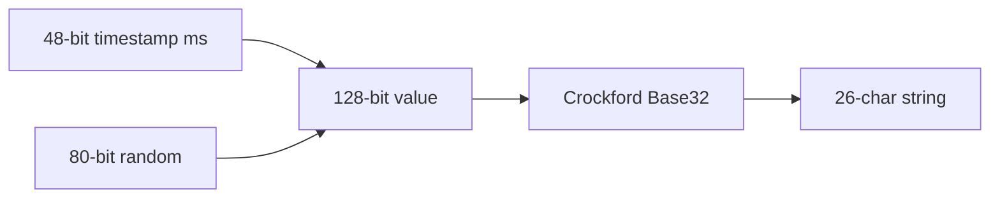

### Timestamp part

First **10 characters** represent time:

- Sortable and monotonic over time (at millisecond granularity)
- Derived from Unix epoch in milliseconds

### Randomness part

Remaining **16 characters** (80 bits):

- Ensures uniqueness within the same millisecond
- Prevents collisions across independently generating machines

```text
2^80 combinations per timestamp window
Collision risk: practically negligible
```

### Ordering property

ULIDs are **lexicographically sortable** — sorting strings equals sorting by creation time:

```text
01ARZ3NDEK...
01ARZ3NDFK...
01ARZ3NDG0...
```

Within the same millisecond, order depends on random bits (unless monotonic mode is used).

### Monotonic ULID

Some implementations support **monotonic ULID** generation. If multiple ULIDs are created in the same millisecond:

```text
→ increment randomness instead of fresh random
→ strict ordering even within one ms (single process)
```

### When to choose ULID over UUID v4

ULID improves on UUID v4 where **sortability** and **compact strings** matter: time-ordered Base32 (26 chars vs 36), better B-tree locality, no worker IDs. For RFC-standard sortable IDs, consider **UUID v7** (13.8). Full scheme comparison — **13.8**.

### Uniqueness guarantee

ULID uniqueness comes from:

- Millisecond timestamp window
- 80 bits of high-entropy randomness
- Per-millisecond differentiation across machines

Multiple machines generating ULIDs simultaneously remain safe without a central allocator.

### Database performance impact

ULIDs improve performance in:

- B-tree indexes (ordered inserts, less fragmentation)
- Append-heavy tables
- Time-series and event data

Reason: inserts are naturally ordered → better cache locality than random UUID v4.

Store as **binary (16 bytes)** in the database; encode to Base32 string at API boundaries.

### Use cases

1. **Distributed databases** — sortable primary keys
2. **Event logging** — ordered event IDs
3. **APIs** — request and resource IDs
4. **Microservices** — correlation IDs
5. **Time-series data** — metrics and telemetry
6. **Message queues** — ordered message identifiers

### Advantages

- Lexicographically sortable; database index friendly
- Globally unique without central coordination
- URL-safe, case-insensitive string format
- Shorter than UUID string; better than UUID v4 for ordered systems

### Disadvantages

- Larger than 64-bit Snowflake integers
- Base32 encode/decode overhead
- Less standardized than UUID in databases and tools
- Timestamp leaks approximate creation time
- Same-ms order not guaranteed without monotonic variant

### Best practices

- Use monotonic ULID for single-process strict ordering.
- Store as `BINARY(16)` internally; expose Base32 at API layer.
- Normalize case on comparison (Crockford is case-insensitive).
- Prefer ULID over UUID v4 when sortability and compact strings both matter.

### Common mistakes

- Assuming total global order across processes at same millisecond
- Case-sensitive string sorting/comparison
- Using ULID where a 64-bit Snowflake integer suffices
- Ignoring UUID v7 when RFC standard compliance is required

### Summary

```text
ULID = 128-bit: 48-bit ms timestamp + 80-bit random; 26-char Crockford Base32
Lexicographically sortable; no worker IDs; better DB locality than UUID v4
Monotonic variant for same-ms ordering; see 13.8 for full ID comparison
```

---


## 13.11 KSUID

### Definition

**KSUID** (K-Sortable Unique ID) is a globally unique identifier designed to be:

- **Time-sortable**
- **Distributed-safe** (no central coordinator)
- **Compact and efficient** as a fixed-length string

Similar in spirit to UUID and ULID, but uses a different encoding optimized for chronological ordering and high entropy. Created by **Segment** for analytics and event pipelines.

### Core idea

A KSUID encodes:

```text
1. Timestamp (32 bits)  →  ordering
2. Random payload (128 bits) →  uniqueness
```

Unlike ULID (128-bit, Base32) or Snowflake (64-bit integer), KSUID is:

- **160 bits** total
- Encoded as a **27-character Base62** string

### Structure

| Component | Bits | Description |
|-----------|------|-------------|
| **Timestamp** | 32 | Seconds since custom epoch (~136 years range) |
| **Payload** | 128 | Cryptographically secure random entropy |
| **Total** | 160 | 20 bytes raw |

```text
Raw payload: [ 4 bytes timestamp | 16 bytes random ] → Base62 → 27-char string
```

### String representation

KSUID uses **Base62** encoding:

```text
Characters: 0-9, A-Z, a-z

Example: 0ujtsYcgvSTl8PAuAdqWYSMnLOv

Length: 27 characters (fixed)
```

**Why Base62?**

- Compact representation (higher density than Base32)
- URL-safe — no special characters
- Case-sensitive — more bits per character than case-insensitive Base32

### Core design choice

KSUID prioritizes:

- Chronological sorting (lexicographic)
- Compact string portability
- High entropy for cross-service uniqueness

### Timestamp component

Uses a **32-bit UNIX timestamp in seconds** (not milliseconds):

- Coarser than ULID (ms) or Snowflake (ms)
- Long lifespan — ~136 years from epoch
- First portion of string drives sort order

### Random component

**128-bit** cryptographically secure random payload:

```text
2^128 possibilities per second
Collision probability: practically impossible
```

Ensures uniqueness within the same second and across independently generating services.

### Ordering property

KSUIDs are **lexicographically sortable**:

```text
0ujtsYcgv...
0ujtsYdAA...
0ujtsYeZZ...
```

Sorting strings ≈ sorting by creation time at **second** granularity. Many IDs in the same second order by random payload, not strict creation order.

### Generation process

1. Get current UNIX timestamp (seconds)
2. Generate 128-bit cryptographically secure random value
3. Combine timestamp + payload (20 bytes)
4. Encode into Base62 string (27 chars)


### Example breakdown

```text
0ujtsYcgvSTl8PAuAdqWYSMnLOv
|---- timestamp ----||--- random payload ---|
```

### Key properties

1. **Time-ordered** — lexicographically sortable by second
2. **Globally unique** — 128-bit randomness per second
3. **Fixed length** — always 27 characters
4. **URL-safe** — Base62, no special characters

### When to choose KSUID over ULID

Both are sortable strings without worker IDs. KSUID trades **millisecond** timestamp precision for **128-bit** randomness (vs ULID's 80-bit) and uses **Base62** (27 chars, case-sensitive). Prefer KSUID when cross-service collision resistance matters more than ms ordering. Full comparison — **13.8**.

### Database behavior

KSUID improves performance in:

- Insert-heavy, append-oriented workloads
- Time-ordered queries and range scans
- B-tree indexes (ordered inserts vs random UUID v4)

Store as **binary (20 bytes)** when possible; expose Base62 string at API boundaries.

### Use cases

1. **Distributed systems** — event IDs, request tracking
2. **Logging** — ordered log entry identifiers
3. **Microservices** — correlation IDs across services
4. **Databases** — append-heavy primary keys
5. **Messaging** — message identifiers with rough time order

Segment analytics pipelines and multi-tenant SaaS event ingestion are the original motivating workloads.

### Advantages

- Globally unique without central coordination
- Lexicographically sortable; URL-safe Base62
- Strong randomness guarantees (128-bit payload)
- Good for distributed systems needing high collision resistance

### Disadvantages

- Larger than ULID (160 vs 128 bits) and Snowflake (64 bits)
- Timestamp precision only **seconds** — not ms-orderable
- Less widely adopted than UUID
- Not optimized for numeric indexing (string/binary, not int64)
- Case-sensitive encoding — normalize comparison carefully

### Best practices

- Use KSUID when cross-service collision resistance matters more than ms ordering.
- Store 20-byte binary internally; encode to string at API layer.
- Prefer ULID or UUID v7 when millisecond ordering is required.
- Pair with per-second partitioning when time bucketing matches second granularity.

### Common mistakes

- Expecting strict millisecond order from second-granularity timestamps
- Case-insensitive comparison (Base62 is case-sensitive)
- Choosing KSUID over ULID without needing the extra 48 bits of randomness
- Using `CHAR(27)` everywhere instead of compact binary storage

### Key insight

KSUID combines **timestamp-based ordering**, **high-entropy randomness**, and **compact Base62 encoding**. It is a larger, more entropy-heavy alternative to ULID — optimized for ordered distributed systems where collision resistance and portability matter more than millisecond precision.

### Summary

```text
KSUID = 160-bit: 32-bit second timestamp + 128-bit random; 27-char Base62
Lexicographically sortable; no worker IDs; Segment heritage; more entropy than ULID
Second precision only; see 13.8 for full UUID/Snowflake/ULID comparison
```

---

[<- Back to master index](../README.md)
