# 13. Advanced Topics

[<- Back to master index](../README.md)

---

## Sub-topics

| # | Sub-topic |
|---|-----------|
| 13.1 | [Bloom Filters](#131-bloom-filters) |
| 13.2 | [HyperLogLog](#132-hyperloglog) |
| 13.3 | [Count Min Sketch](#133-count-min-sketch) |
| 13.4 | [Trie](#134-trie) |
| 13.5 | [Skip Lists](#135-skip-lists) |
| 13.6 | [Merkle Trees](#136-merkle-trees) |
| 13.7 | [Distributed Hash Tables](#137-distributed-hash-tables) |
| 13.8 | [UUID](#138-uuid) |
| 13.9 | [Snowflake IDs](#139-snowflake-ids) |
| 13.10 | [ULID](#1310-ulid) |
| 13.11 | [KSUID](#1311-ksuid) |

---


## 13.1 Bloom Filters

### Overview

Picture a library with a billion books and no card catalogue. Every time someone asks for a title, a librarian walks every aisle. That is what happens when a large system hits a database or disk for every key — costly and mostly wasteful, because most lookups are for things that were **never stored**. A Bloom filter is the **quick first question** before the expensive one: it cannot replace the database, but it can stop you from asking thousands of times per second for keys you already know do not exist.

Technically, a **Bloom filter** is a tiny bit array plus `k` hash functions that answers “might this key exist?” in O(k) time. Invented by Burton Bloom in 1970, it does not store actual keys — only a compact pattern of bits built from them. It **never** wrongly clears a real member (no false negatives on a standard filter), but may occasionally send you to the database for a key that was never there (a **false positive**). Size it with bit array length `m`, expected element count `n`, and hash count `k` for your target error rate; treat “possibly present” as a hint and always confirm with the real store.

---

### What problem it fixes

Large systems repeatedly ask membership questions:

- Does this user ID exist?
- Have we crawled this URL before?
- Is this product ID in our cache?
- Could this key be on disk in this SSTable?

Storing every key in a hash set works but consumes enormous RAM — billions of URLs at ~50 bytes each can mean tens of gigabytes. Querying the database or disk on every miss is even worse when attackers or bugs send millions of requests for keys that **never existed** (cache penetration).

The Bloom filter fixes this trade-off:

```text
Bloom says "definitely NOT here"  →  skip the expensive lookup (safe)
Bloom says "MAYBE here"         →  check the real store to confirm
```

It accepts a small, tunable rate of **false positives** (saying “maybe” when the key was never inserted) in exchange for huge memory savings and speed. It **never** gives a false negative on a standard filter — if something was inserted, it will not say “definitely not here.”

---

### What it does

A Bloom filter supports two operations on a set of keys:

**Insert** — record that a key was seen (set bits in the array).

**Lookup (membership test)** — answer one of two things only:

1. **Definitely not present** — this key was never inserted.
2. **Possibly present** — this key might exist; go verify with the authoritative source (database, disk, cache).

It does **not** tell you how many items are stored, list members, or delete keys in the standard form. It is a **probabilistic set membership sketch**, not a full database.

---

### How it works — the algorithm inside

Internally, a Bloom filter is just two things:

1. A **bit array** of size `m`, all zeros at the start.
2. **`k` independent hash functions**, each mapping a key to an index from `0` to `m − 1`.

Hash functions spread keys pseudo-randomly across the array. Using **multiple** hashes reduces the chance that unrelated keys accidentally line up on the same bits.

#### Insert algorithm

```text
function insert(key):
    for i = 1 to k:
        index = hash_i(key)
        bit_array[index] = 1    // set to 1; already-1 stays 1
```

#### Lookup algorithm

```text
function lookup(key):
    for i = 1 to k:
        index = hash_i(key)
        if bit_array[index] == 0:
            return DEFINITELY_NOT_PRESENT
    return POSSIBLY_PRESENT    // all k bits are 1 — confirm downstream
```

Both operations run in **O(k)** time — constant with respect to how many keys were inserted, because `k` is fixed at design time (often around 7 for a 1% false-positive target).

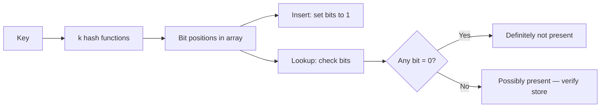

---

### Walkthrough: inserting and looking up fruit names

Use a toy bit array of size 10 and three hash functions.

**Start:** all zeros.

```text
Index:  0  1  2  3  4  5  6  7  8  9
Bits:   0  0  0  0  0  0  0  0  0  0
```

**Insert `"Apple"`** — hashes land at positions 2, 5, 8:

```text
Hash1(Apple) = 2    Hash2(Apple) = 5    Hash3(Apple) = 8

Result:  0  0  1  0  0  1  0  0  1  0
```

**Insert `"Banana"`** — positions 1, 5, 7. Position 5 was already 1 from Apple; that overlap is normal.

```text
Hash1(Banana) = 1    Hash2(Banana) = 5    Hash3(Banana) = 7

Result:  0  1  1  0  0  1  0  1  1  0
```

**Lookup `"Apple"`** — check 2, 5, 8 → all 1 → **possibly present** (and it really is).

**Lookup `"Orange"`** — hashes to 0, 4, 9. Bit 4 is still 0 → **definitely not present**. No need to hit the database.

This is the filter doing its best work: a cheap, certain rejection.

---

### False positives — when the filter is wrong (in one direction only)

A **false positive** means the filter says “possibly present” for a key that was **never** inserted.

Continuing the fruit example — suppose `"Orange"` hashes to positions 2, 5, and 7. All three are already 1 because of Apple and Banana, even though Orange was never added:

```text
Apple  →  bits 2, 5, 8
Banana →  bits 1, 5, 7
Orange →  bits 2, 5, 7   (never inserted, but all bits are 1)
```

The filter cannot tell Orange apart from a real member without checking the real store. That extra DB read is the price of sharing bits.

A **false negative** (saying “not present” when the key **was** inserted) does **not** happen in a standard Bloom filter, as long as bits are never cleared and the key was inserted correctly. Every inserted key leaves all its bits set to 1 permanently.

False positives rise when:

- Too many keys are packed into too small an array.
- Too few or too many hash functions are used.
- Hash functions cluster keys on the same bits.

They fall when you allocate more bits per expected key and choose `k` using the sizing formulas below.

---

### Sizing the filter — choosing `m`, `k`, and acceptable error

Before deployment you decide:

- `n` — how many keys you expect to insert.
- `p` — maximum false-positive rate you can tolerate (e.g. 1%).

**Optimal number of hash functions:**

```text
k = (m / n) × ln(2)     ≈ 0.693 × (m / n)
```

**Approximate false-positive probability:**

```text
p ≈ (1 − e^(−kn/m))^k
```

**Bits needed for target `p` and `n`:**

```text
m ≈ −(n · ln p) / (ln 2)²
```

**Example:** 1 million keys, 1% false-positive target:

```text
m ≈ 9.6 million bits  ≈  1.2 MB
k ≈ 7 hash functions
```

Rule of thumb: about **10 bits per element** gives roughly **1%** false positives. Double the bit array size to quarter the error rate.

Compared to storing 1 billion URLs in a hash set (~50 GB), a Bloom filter for the same membership checks might use **hundreds of megabytes** — orders of magnitude less, with a known false-positive rate you size upfront.

---

### Variants worth knowing

| Variant | What it adds |
|---------|--------------|
| **Counting Bloom filter** | Small counters per slot instead of single bits — supports safe delete (increment on insert, decrement on delete). |
| **Scalable Bloom filter** | Stack a new filter when the current one fills — unbounded growth with controlled error. |
| **Blocked / partitioned** | Cache-friendly layouts for high-QPS systems like RocksDB. |

Standard Bloom filters **cannot delete** by clearing a bit — another key may share that bit:

```text
Apple and Banana both set bit 5.
Clearing bit 5 to "remove Apple" would break Banana.
```

---

### Bloom filter vs hash set

| | Hash set | Bloom filter |
|---|----------|--------------|
| Stores actual keys | Yes | No — bits only |
| Memory | High (O(n)) | Very low (fixed `m`) |
| Lookup | O(1) average | O(k) |
| False positives | Never | Yes — tunable |
| False negatives | Never | Never (standard) |
| Delete / list members | Yes | No (standard) |

Use a hash set when you need exact membership and enumeration. Use a Bloom filter when you need a **cheap pre-filter** in front of something expensive.

---

### Real-world example: stopping cache penetration

An e-commerce API caches product details by `product_id`. Attackers send millions of requests for random IDs that do not exist. Without protection, every miss goes to the database — the cache is useless.

**With a Bloom filter in front of the cache:**

1. On startup (or periodically), load all valid product IDs into a Bloom filter — ~1.2 MB for a million products at 1% FP.
2. On each request, check the filter first.
3. Filter says **not present** → return 404 immediately; database never touched.
4. Filter says **possibly present** → check cache; on miss, query database.

```text
Request for product_id K
  → Bloom.contains(K)?
      NO  → 404 / skip DB
      YES → cache → DB on miss (rare false positive causes one extra DB read)
```

The same pattern appears in **RocksDB** and **LevelDB**: each SSTable file carries a Bloom filter so the engine skips disk reads when a key **definitely** is not in that file. **Cassandra** and **HBase** use similar filters before remote or disk lookups.

---

## 13.2 HyperLogLog

### Overview

Imagine a music festival trying to count **how many different people** attended — not total ticket scans (the same person can enter many times), but **unique visitors**. Writing down every name in a notebook works for hundreds of guests but fails at millions. You need a rough headcount without storing every identity.

Technically, **HyperLogLog (HLL)** estimates **cardinality** — the number of **distinct** elements in a stream — using **fixed memory** (~12 KB for billions of uniques). It never stores the elements themselves. It hashes each item, watches patterns in the hash bits (especially leading zeros), and combines small **registers** into an approximate count with ~1–2% error. Sketches **merge** across nodes by taking the max per register (`PFMERGE` in Redis).

---

### What problem it fixes

Systems constantly need “how many **unique** X”:

- Unique visitors today
- Distinct IP addresses in logs
- Distinct search queries
- Unique devices in an ad campaign

A **hash set** of every value uses O(n) memory — billions of IDs is impractical. `COUNT DISTINCT` in a database over billions of rows is slow and expensive. HLL gives a **streaming, fixed-size** approximate answer you can update per event and merge across data centers.

---

### What it does

**Insert (add)** — process one element; update internal registers. O(1) per element.

**Query (estimate)** — return approximate distinct count from current registers.

It does **not** tell you which items were seen, whether a specific item was seen (that is a Bloom filter), or exact counts. It answers **one question**: “about how many unique values have passed through?”

---

### How it works — the algorithm inside

1. Hash the element to a 64-bit pseudo-random string.
2. Split the hash:
   - First `p` bits → **register index** `i` (bucket), `m = 2^p` registers.
   - Remaining bits → **ρ(x)** = position of first 1-bit (leading zeros + 1).
3. Update: `M[i] = max(M[i], ρ(x))`.
4. Estimate cardinality with harmonic mean over all registers:

```text
E ≈ α_m × m² / Σ(2^−M[i])
```

**Intuition:** more unique elements → more hashes → higher chance of seeing long leading-zero runs → larger ρ values in registers.

#### Insert algorithm

```text
function add(element):
    h = hash(element)
    i = first_p_bits(h)           // register index
    rho = leading_zero_count(h)   // after index bits
    M[i] = max(M[i], rho)
```

#### Estimate algorithm

```text
function estimate():
    return harmonic_mean_formula(M, m, alpha_m)
```

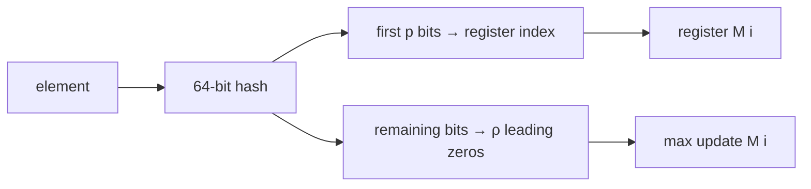

Typical config: `p = 14` → 16,384 registers → **~12 KB**, error ≈ `1.04 / √m` (~0.8% standard error).

---

### Walkthrough: two users, four registers

Registers `M = [0, 0, 0, 0]`:

```text
add("alice"):  index = 2, ρ = 3  →  M[2] = 3
add("bob"):    index = 2, ρ = 5  →  M[2] = max(3, 5) = 5
add("alice"):  duplicate — same hash, no change to max
```

After millions of distinct IDs, register values rise; the estimator infers cardinality from the distribution. **HLL++** adds bias correction for small sets (< ~1000).

---

### Merging sketches across nodes

```text
M_merged[i] = max(M1[i], M2[i])   for all registers i
```

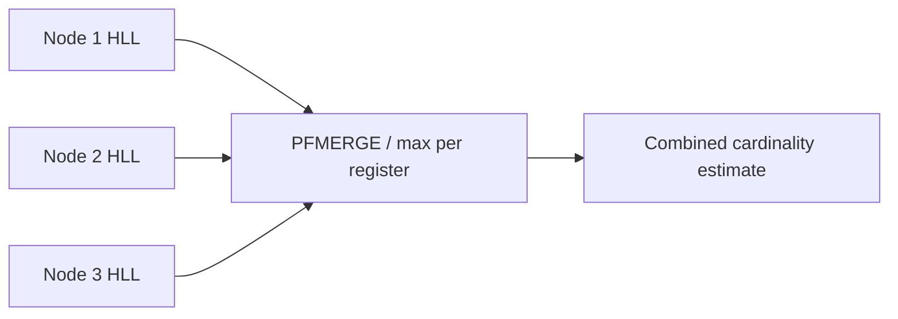

Each edge server counts locally; central job merges without shipping raw IPs.

---

### HyperLogLog vs exact distinct count

| | Hash set / exact | HyperLogLog |
|---|------------------|-------------|
| Memory | O(n) | O(1) fixed ~12 KB |
| Accuracy | Exact | ~1–2% error |
| List members | Yes | No |
| Merge shards | Ship all keys | Max registers |

Do not use HLL for billing or compliance requiring exact counts. Do not confuse with Bloom filter (membership) or Count-Min Sketch (per-key frequency).

---

### Real-world example: unique visitors per CDN edge

A CDN serves billions of requests daily. Each edge node runs HLL per customer for unique client IPs — ~12 KB per sketch. Hourly, aggregators `PFMERGE` sketches into a global “unique visitors” metric without storing every IP.

```text
PFADD visitors:customer42 "203.0.113.10"
PFADD visitors:customer42 "198.51.100.5"
PFCOUNT visitors:customer42  →  approximate distinct count
```

Same idea in **BigQuery** `APPROX_COUNT_DISTINCT`, **Elasticsearch** `cardinality` aggregation, and **Druid** HyperUnique.

---


## 13.3 Count Min Sketch

### Overview

Picture a busy API gateway that must know whether a client is **hammering the same endpoint** thousands of times per minute — but there are millions of possible API keys and you cannot store a counter for every key in RAM. You need “about how many times did key X call us” without a full hash map.

Technically, a **Count-Min Sketch (CMS)** is a `d × w` matrix of counters updated by `d` hash functions. Each event increments `d` cells; querying a key returns the **minimum** across those cells as the frequency estimate. Memory is **fixed** O(d × w). Estimates **never underestimate** (only overestimate) — safe for rate limits where missing abuse is worse than a false alarm.

---

### What problem it fixes

Streaming systems need **per-key frequency**:

- Requests per API key
- Packets per source IP
- Clicks per ad ID
- Search queries per keyword

Exact counting needs a hash map `key → count` that grows with distinct keys — untenable at billions of keys. CMS trades exactness for a bounded matrix that handles unbounded streams.

---

### What it does

**Update (insert)** — increment `d` counters for key `x`.

**Query** — return `min(CMS[i][h_i(x)])` as estimated frequency of `x`.

It does not list keys, delete counts (standard CMS), or give exact billing numbers. It is a **frequency sketch**, not a database.

---

### How it works — the algorithm inside

```text
        w columns
     +-----------------+
d 1  |  counters...    |
d 2  |  counters...    |
d 3  |  counters...    |
     +-----------------+
```

#### Update algorithm

```text
function update(key, count = 1):
    for i = 1 to d:
        j = hash_i(key)
        CMS[i][j] += count
```

#### Query algorithm

```text
function estimate(key):
    return min( CMS[i][hash_i(key)] ) for i in 1..d
```

**Why minimum?** Collisions inflate cells — other keys may have incremented the same bucket. The smallest across rows is the least contaminated estimate.

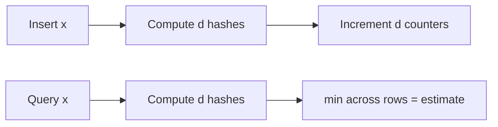

---

### Walkthrough: counting `"apple"`

`d = 3`, `w = 5`. Insert `"apple"` twice:

```text
h1(apple) = 1    h2(apple) = 3    h3(apple) = 0
→ CMS[1][1] += 2, CMS[2][3] += 2, CMS[3][0] += 2

Query "apple": min(2, 2, 2) = 2  ✓
```

If `"banana"` shares column 3 in row 2, row 2's cell inflates; `min` across rows still limits overcount.

---

### Sizing — choosing `w` and `d`

With probability `(1 − δ)`:

```text
error ≤ ε × N     where N = total events in stream
ε ≈ 1/w           δ ≈ e^(−d)

w = ⌈e / ε⌉
d = ⌈ln(1 / δ)⌉
```

**Example:** ε = 0.01, δ = 0.001 → `w ≈ 272`, `d ≈ 7`.

---

### Count-Min Sketch vs hash map

| | Hash map | CMS |
|---|----------|-----|
| Counts | Exact | Approximate (over only) |
| Memory | O(distinct keys) | O(d × w) fixed |
| Undercount | No | Never |

Pair CMS with a heap for **heavy hitters**: promote keys above threshold to exact counters.

---

### Real-world example: API gateway rate limiting

An API gateway maintains a CMS per route for API-key request counts. Fixed ~2 KB sketch per route handles millions of keys. When `estimate(api_key) > 10,000/min`, throttle or promote to an exact counter — catching abuse without a giant hash map.

Sketches **merge** by adding matrices element-wise across edge nodes for global frequency views.

---


## 13.4 Trie

### Overview

When you type in a search box and suggestions appear after each letter — `sys` → `system design`, `systemctl` — something is matching **prefixes** fast. A plain list of millions of strings would require scanning everything on each keystroke.

Technically, a **trie** (prefix tree) stores strings as character paths from a root. Shared prefixes share nodes — `cat`, `car`, and `cart` all traverse `c → a` before branching. Insert, search, and prefix queries run in **O(L)** where L is string length, independent of how many total words are stored.

---

### What problem it fixes

- **Autocomplete** and type-ahead
- **Spell checking** against a dictionary
- **IP routing** — longest prefix match for CIDR blocks
- **Phone/contact search** by prefix

A **hash map** gives O(1) exact lookup but cannot answer “all keys starting with `sys`” without scanning all keys. **Binary search** on a sorted list is O(log n) per prefix query and awkward for incremental typing.

---

### What it does

**Insert** — walk/create character nodes; mark end-of-word.

**Search** — walk characters; check path exists and end-of-word flag if full word needed.

**Prefix search** — walk to prefix node; collect all descendant end-of-word nodes.

Each node holds `children: map<char, Node>` and `isEndOfWord: boolean`.

---

### How it works — the algorithm inside

Words: `cat`, `car`, `cart`, `dog`

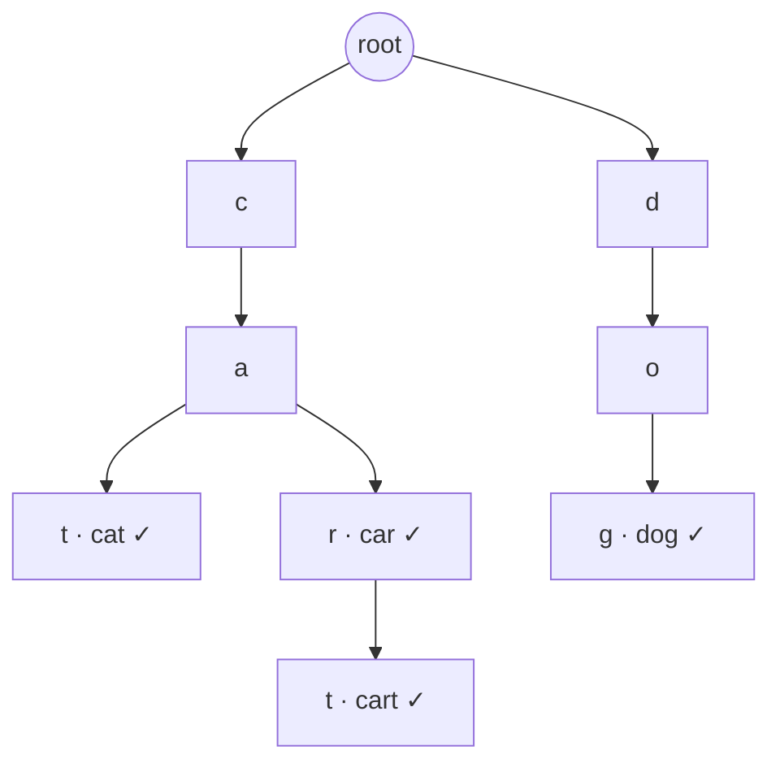

#### Insert algorithm

```text
function insert(word):
    node = root
    for each char c in word:
        if c not in node.children:
            node.children[c] = new Node()
        node = node.children[c]
    node.isEndOfWord = true
```

#### Search algorithm

```text
function search(word):
    node = walk(root, word)
    return node exists and node.isEndOfWord
```

#### Prefix search

```text
function prefix_search(prefix):
    node = walk(root, prefix)
    if node is null: return []
    return DFS collect all isEndOfWord under node
```

| Operation | Time |
|-----------|------|
| Insert / search | O(L) |
| Prefix query | O(L + K), K = results |

---

### Walkthrough: insert and prefix query

Insert `"cat"`, `"car"`, `"cart"`, `"dog"` as in the diagram.

Prefix `"ca"` → traverse `c → a` → descendants yield `cat`, `car`, `cart` without scanning `dog`.

Delete `"car"` → unmark end on `r`; keep nodes because `"cart"` still uses `c → a → r → t`.

---

### Variants and trade-offs

| Variant | Use when |
|---------|----------|
| **Radix tree** | Compress single-child chains into multi-char edges |
| **Patricia trie** | IP addresses — binary trie on bits |
| **DAWG** | Static dictionaries — merge identical suffixes |

| | Hash map | Trie |
|---|----------|------|
| Exact lookup | O(1) avg | O(L) |
| Prefix queries | Poor | Natural |
| Memory | Lower for sparse exact keys | Pointer-heavy |

---

### Real-world example: search autocomplete

A search engine stores millions of past queries in a trie. User types `"sys"` → walk to node `s→y→s` → return ranked terminal descendants (`system design`, `systemctl`, …) in milliseconds. No full-table scan.

Routers use trie-style **longest prefix match** for CIDR routing tables.

---


## 13.5 Skip Lists

### Overview

Finding a name in a phone book sorted A–Z, you do not read every page — you jump to the right section, then narrow down. A plain sorted linked list forces you to check every entry one by one.

Technically, a **skip list** is a probabilistic layered linked list. The bottom level is a full sorted list; higher levels are “express lanes” with fewer nodes. Search starts at the top, moves right while the next value is smaller, then drops down — **average O(log n)** search, insert, and delete. Simpler than balanced trees (no rotations), popular for concurrent structures (**Redis sorted sets**).

---

### What problem it fixes

You need a **sorted** in-memory structure with:

- Fast search, insert, delete
- Range scans and rank queries
- Reasonable concurrency without tree rotation complexity

Sorted arrays are slow to insert. Plain linked lists are O(n) search. AVL/red-black trees work but are harder to implement lock-free.

---

### What it does

Maintains a sorted set with multiple forward-pointer levels per node. Supports search, insert, delete, and ordered traversal in **O(log n)** average time.

---

### How it works — the algorithm inside

```text
Level 2:  Head → 1 --------→ 5 --------→ 9
Level 1:  Head → 1 → 3 → 5 → 7 → 9
```

**Level assignment:** coin flip with `p = 0.5` — promote while heads. `P(level ≥ i) = p^(i−1)`.

#### Search algorithm

```text
function search(target):
    node = head at top level
    while node is not null:
        while node.forward[level] < target:
            node = node.forward[level]
        if node.forward[level] == target: return found
        level--
    return not found
```

Search for `7`: top level jumps `1 → 5`, drops, finds `7` on bottom.


| Operation | Average | Worst |
|-----------|---------|-------|
| Search / insert / delete | O(log n) | O(n) |

---

### Walkthrough: search for 7

```text
Level 2:  1 → 9     (9 > 7, drop)
Level 1:  1 → 5 → 9  (9 > 7, drop from 5)
Level 0:  5 → 7      FOUND
```

Insert: find predecessors at each level, random height, splice pointers.

---

### Skip list vs balanced tree

| | AVL / red-black | Skip list |
|---|-----------------|-----------|
| Balancing | Deterministic rotations | Random coin flips |
| Implementation | Complex | Simpler |
| Concurrency | Harder lock-free | Easier lock-free |
| Worst case | O(log n) guaranteed | O(n) possible |

**Redis `ZSET`:** skip list for rank/range (`ZRANK`, `ZRANGE`) + hash table for O(1) score lookup (`ZSCORE`).

---

### Real-world example: game leaderboard

`ZADD leaderboard 9850 "player42"` stores scores in a skip list. `ZRANGE leaderboard 0 9` returns top 10 in log time. `ZSCORE` hits the hash table directly. Disk-backed indexes prefer B-trees; skip lists shine **in memory**.

---


## 13.6 Merkle Trees

### Overview

When you download a large file, how do you know it was not corrupted in transit? Checking every byte against a copy on the server is slow. Instead, the publisher gives you one **fingerprint** (hash) of the whole file — if your copy's fingerprint matches, the file is intact.

Technically, a **Merkle tree** hashes leaf data blocks, then hashes pairs of child hashes up to a single **Merkle root**. Change any leaf → root changes completely. Prove one element belongs with only **O(log N)** sibling hashes (a **Merkle proof**), not the full dataset.

---

### What problem it fixes

- **Integrity verification** of large datasets (downloads, replicas, blockchains)
- **Efficient sync** — compare roots first; bisect only divergent subtrees
- **Inclusion proofs** — show one transaction belongs in a block without downloading all transactions

`hash(entire_file)` gives one fingerprint but cannot prove a single chunk without rehashing everything.

---

### What it does

**Build** — construct tree from data leaves; publish root hash.

**Verify inclusion** — given element + Merkle proof + known root, confirm element is in the tree.

**Compare replicas** — exchange roots; if different, walk tree to find minimal differing ranges.

Not a search index — proves integrity/membership, not arbitrary key lookup.

---

### How it works — the algorithm inside

Dataset `{A, B, C, D}`:

```text
Leaves:   H(A)  H(B)  H(C)  H(D)
Parents:  H(AB) = hash(H(A)||H(B))    H(CD) = hash(H(C)||H(D))
Root:     hash(H(AB) || H(CD))
```

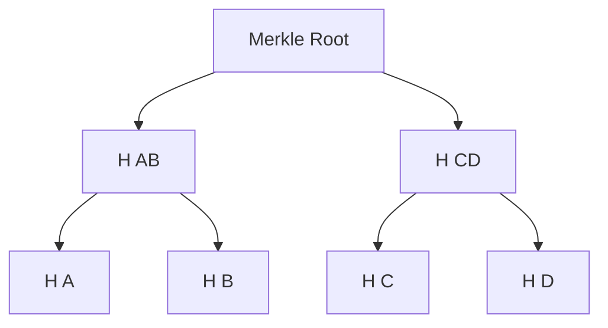

#### Proof verification for element B

Provide siblings `H(A)` and `H(CD)` + known root:

```text
H(AB) = hash(H(A) || H(B))
recomputed_root = hash(H(AB) || H(CD))
match known root → B is authentic
```

Use SHA-256+; document `left || right` concatenation order. Odd leaf count: duplicate last node or promote — both sides must agree.

| | hash(all data) | Merkle tree |
|---|----------------|-------------|
| One fingerprint | Yes | Yes (root) |
| Prove one element | Rehash all | O(log N) proof |
| Localize changes | No | Bisect subtrees |

---

### Walkthrough: tamper detection

Change one byte in block C → `H(C)` changes → `H(CD)` changes → root changes. Comparing roots alone detects tampering without reading every block.

---

### Variants worth knowing

| Variant | Use |
|---------|-----|
| **Merkle Patricia tree** | Ethereum state — trie + hashing |
| **Sparse Merkle tree** | Full key space for ZK proofs |

---

### Real-world example: Cassandra anti-entropy repair

Two replicas exchange Merkle roots per partition. Roots differ → walk divergent branches → stream only mismatched SSTable ranges, not the full table.

**Git** tree objects are Merkle structures — `git diff` localizes changes. **Blockchain SPV** clients verify a transaction with header + Merkle proof.

---


## 13.7 Distributed Hash Tables

### Overview

Imagine a peer-to-peer file-sharing network with no central server listing who has which file. Each computer must know where to route a lookup — “who stores `hash(key)`” — among thousands of peers.

Technically, a **Distributed Hash Table (DHT)** spreads key-value pairs across nodes on a **logical ring** using **consistent hashing**. `put(key)` and `get(key)` hash the key, find the responsible node (clockwise successor), and route there. Structured DHTs (**Chord**, **Kademlia**) maintain routing tables for **O(log N)** hops instead of walking the ring.

---

### What problem it fixes

Centralized key-value stores hit limits:

- Single point of failure
- Bottleneck under load
- Cannot scale storage horizontally

Naive `hash(key) % N` reshuffles almost all keys when N changes — breaking caches and overloading nodes during cluster resize.

---

### What it does

Provides a **decentralized** key-value abstraction:

```text
put(key, value)  →  hash(key)  →  route to owner node  →  store
get(key)         →  hash(key)  →  route to owner node  →  return
```

No central coordinator for lookup routing (though production systems like Cassandra add ops tooling on top of the same ring idea).

---

### How it works — the algorithm inside

**Ring assignment:** nodes at IDs 10, 50, 120, 200. `hash("file-X") = 65` → stored at node **120** (first node ID ≥ 65).

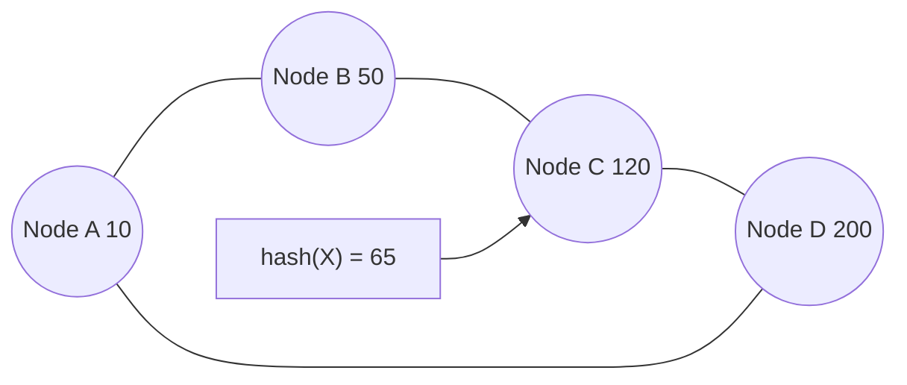

**Chord finger table:** shortcuts `node + 2^0`, `node + 2^1`, … for O(log N) lookup.

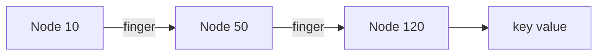

**Replication:** primary at successor + replicas on next k successors.

**Virtual nodes:** one physical machine claims multiple ring positions for even load.

**Kademlia:** XOR distance + k-buckets — BitTorrent DHT, Ethereum peer discovery, IPFS.

| Operation | Structured DHT |
|-----------|----------------|
| Lookup / insert | O(log N) |

Typically **eventual consistency** — AP under partition unless quorum protocols added (Cassandra tunable consistency is separate).

---

### Walkthrough: node join

Add node 80 to ring `{10, 50, 120, 200}`. Only keys hashing to ranges now owned by 80 migrate (~K/N keys). Naive modulo hashing would reshuffle nearly everything.

---

### DHT vs centralized hash table

| | Central KV | DHT |
|---|------------|-----|
| Coordinator | Required | None for routing |
| Scale-out | Limited | Horizontal |
| Key movement on resize | N/A or full reshuffle | ~K/N with consistent hashing |

---

### Real-world example: Cassandra cluster expansion

Adding a fourth node with **vnodes** migrates ~25% of partitions. **BitTorrent** trackerless DHT finds peers for content hashes. **IPFS** routes by content address on Kademlia-style overlays.

---


## 13.8 UUID

### Overview

Every order, user, and message in a distributed app needs an ID. Auto-increment (`1, 2, 3…`) from one database breaks when you have many services or offline clients — and exposes how many records exist. You want IDs any laptop or microservice can mint without calling home.

Technically, a **UUID** is a **128-bit** identifier (RFC 9562), often shown as `550e8400-e29b-41d4-a716-446655440000`. Collisions are negligible (~2^122 random bits in v4). **v4** is random and opaque; **v7** adds a millisecond timestamp prefix for sortable database keys. Store as `BINARY(16)`, not `CHAR(36)`.

---

### What problem it fixes

- Global uniqueness **without** a central ID server
- Safe generation on clients, edge devices, and multiple microservices
- Opaque IDs that do not leak sequence or shard information (v4)

**v4 as primary key** on write-heavy tables causes **B-tree fragmentation** — random insert order. **v7**, ULID, or Snowflake fix sortability.

---

### What it does

Generates a 128-bit unique ID. Versions differ in how bits are filled:

| Version | Method | Best for |
|---------|--------|----------|
| **v4** | 122 random bits | Opaque IDs, low write volume |
| **v7** | 48-bit Unix ms + random | **Default for new DB PKs** |
| **v3/v5** | hash(namespace + name) | Deterministic IDs |
| **v1** | timestamp + MAC | Legacy; privacy risk |

---

### How it works — the algorithm inside

**UUID v4:**

```text
function uuid_v4():
    bits = 122 random bits
    set version nibble = 4
    set variant bits per RFC 9562
    format as 8-4-4-4-12 hex string
```

**UUID v7:**

```text
function uuid_v7():
    timestamp_ms = 48 bits
    random_suffix = remaining bits
    set version = 7
    format as hex string
```

```text
xxxxxxxx-xxxx-Mxxx-Nxxx-xxxxxxxxxxxx
M = version, N = variant
```

---

### Choosing an ID scheme

| | UUID v4 | UUID v7 | Snowflake | ULID | KSUID |
|---|---------|---------|-----------|------|-------|
| Size | 16 bytes | 16 bytes | 8 bytes | 16 bytes | 20 bytes |
| Sortable | No | Yes (ms) | Yes (ms) | Yes (ms) | Yes (sec) |
| Coordination | None | None | Worker IDs | None | None |
| B-tree locality | Poor | Good | Good | Good | Good |

Sections **13.9–13.11** cover Snowflake, ULID, and KSUID in detail.

---

### Real-world example: microservice entity IDs

A user service creates `user_id = uuid_v7()` on registration — no round-trip to an ID service. Orders service does the same for `order_id`. Sharded Postgres stores `BINARY(16)` PKs; APIs expose canonical hex strings. `X-Request-ID: <uuid_v4>` on HTTP calls for distributed tracing.

---


## 13.9 Snowflake IDs

### Overview

Twitter needed tweet IDs that were unique across thousands of machines, sortable by time, and compact — without a central database handing out the next integer on every post. Think of a timestamp stamped on each ID, plus a machine number, plus a per-millisecond counter.

Technically, **Snowflake** packs **41-bit millisecond timestamp + 10-bit worker ID + 12-bit sequence** into one **64-bit integer**. ~4,096 IDs per millisecond per node. Time-ordered and B-tree friendly. Requires **unique worker IDs** and **reliable clocks** (NTP).

---

### What problem it fixes

- High-throughput distributed ID generation
- Sortable numeric PKs smaller than 128-bit UUID
- No central ID database bottleneck

UUID v4 is random (bad index locality). Auto-increment does not scale across shards.

---

### What it does

Generates a unique, roughly time-sorted **int64** per call. IDs increase with creation time (within clock precision). Reveals approximate creation time.

---

### How it works — the algorithm inside

```text
| 0 | timestamp (41) | datacenter (5) | worker (5) | sequence (12) |
```

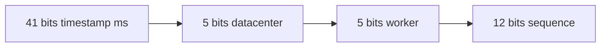

```text
id = (timestamp << 22) | (datacenter_id << 17) | (worker_id << 12) | sequence
```

#### Generation algorithm

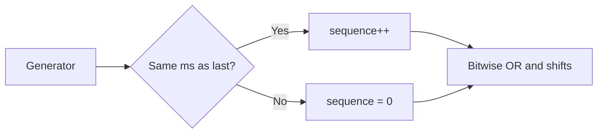

```text
now = currentTimeMs()
if now < lastTimestamp: wait until caught up    // clock went backward
if now == lastTimestamp:
    sequence = (sequence + 1) & 4095
    if sequence == 0: wait next ms
else:
    sequence = 0
lastTimestamp = now
return pack(timestamp, worker_id, sequence)
```

Uniqueness: time + worker + sequence. ~4M IDs/sec per node.

---

### Snowflake vs alternatives

| | Auto-increment | UUID v4 | Snowflake |
|---|----------------|---------|-----------|
| Size | 4–8 bytes | 16 bytes | 8 bytes |
| Coordination | Central DB | None | Worker registry |
| Sortable | Yes | No | Yes (ms) |
| Clock dependency | No | No (v4) | Yes |

**Pitfalls:** duplicate worker IDs; NTP step backward without blocking.

---

### Real-world example: social feed ordering

Tweet/post IDs are Snowflake-style integers — feeds sort by ID ≈ sort by time. Discord message IDs follow a similar pattern. Custom layouts (Sonyflake, Instagram) tune bit widths for their scale.

---


## 13.10 ULID

### Overview

You want IDs that sort like timestamps when written as strings — useful in URLs, logs, and databases — but UUID v4 is random gibberish that scatters index pages. You also do not want to register worker IDs like Snowflake requires.

Technically, **ULID** is **128 bits**: **48-bit millisecond timestamp + 80-bit random**, encoded as **26-character Crockford Base32** (`01ARZ3NDEKTSV4RRFFQ69G5FAV`). Lexicographic string sort ≈ creation-time sort. Same size as UUID, shorter string, case-insensitive, URL-safe.

---

### What problem it fixes

- Sortable string IDs without central coordination
- Better B-tree locality than UUID v4
- Compact, URL-safe representation vs 36-char hex UUID

---

### What it does

Generates a unique, time-ordered string ID. **Monotonic ULID** variants increment randomness within the same millisecond for strict single-process ordering.

---

### How it works — the algorithm inside

```text
function ulid():
    timestamp_ms = 48 bits (Unix epoch)
    random = 80 cryptographically secure bits
    value = combine(timestamp_ms, random)
    return crockford_base32_encode(value)   // 26 chars
```

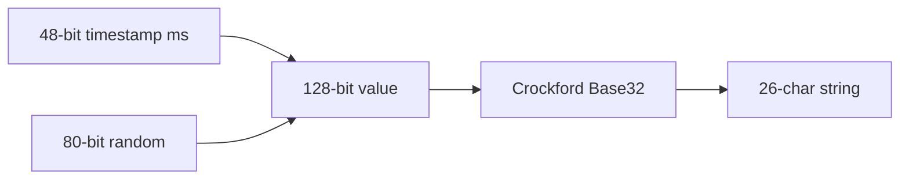

Store `BINARY(16)` internally; expose Base32 at API boundaries.

---

### ULID vs UUID v4 vs Snowflake

| | UUID v4 | ULID | Snowflake |
|---|---------|------|-----------|
| Form | 36-char hex | 26-char Base32 | int64 |
| Sortable | No | Yes (ms) | Yes (ms) |
| Worker IDs | No | No | Yes |

Prefer **UUID v7** when RFC standard compliance matters.

---

### Real-world example: event log IDs

An event pipeline assigns `event_id = ulid()` per message. Log files and Kafka partitions sort lexicographically by creation time. Consumers range-scan by ULID prefix for time windows.

---


## 13.11 KSUID

### Overview

Segment built analytics pipelines that needed sortable, URL-safe IDs with **very high randomness** — more than ULID's 80-bit random suffix — while still grouping roughly by time. Second-level precision was enough; millisecond ordering was not required.

Technically, **KSUID** is **160 bits**: **32-bit second timestamp + 128-bit random**, encoded as **27-character Base62** (`0ujtsYcgvSTl8PAuAdqWYSMnLOv`). Larger than ULID; stronger collision resistance per time window; coarser time ordering.

---

### What problem it fixes

- Cross-service unique event IDs with high entropy
- Lexicographic sort by second for log partitioning
- URL-safe strings without worker ID coordination

---

### What it does

Generates a fixed-length 27-char Base62 ID. Sortable at **second** granularity; order within the same second follows random payload, not strict creation order.

---

### How it works — the algorithm inside

```text
function ksuid():
    timestamp_sec = 32 bits (Unix seconds)
    payload = 128 random bits
    raw = combine(timestamp_sec, payload)   // 20 bytes
    return base62_encode(raw)               // 27 chars
```


Base62 is **case-sensitive** — normalize comparison carefully.

---

### KSUID vs ULID

| | ULID | KSUID |
|---|------|-------|
| Size | 128 bits | 160 bits |
| Time precision | Millisecond | Second |
| Random entropy | 80 bits | 128 bits |
| Encoding | Base32 (case-insensitive) | Base62 |

Choose KSUID when collision resistance beats millisecond ordering. Choose ULID or UUID v7 when ms ordering matters.

---

### Real-world example: multi-tenant event ingestion

A SaaS analytics platform assigns `ksuid()` per ingested event. Storage partitions by KSUID prefix (time bucket in seconds). 128-bit randomness keeps IDs unique across thousands of concurrent writers without a central allocator.

---

[<- Back to master index](../README.md)
