# 13. Advanced Topics

[<- Back to master index](../README.md)

---

## Sub-topics

| # | Sub-topic |
|---|-----------|
| 13.1 | [Bloom Filters](#131-bloom-filters) |
| 13.2 | [HyperLogLog](#132-hyperloglog) |
| 13.3 | [Count Min Sketch](#133-count-min-sketch) |
| 13.4 | [Trie](#134-trie) |
| 13.5 | [Skip Lists](#135-skip-lists) |
| 13.6 | [Merkle Trees](#136-merkle-trees) |
| 13.7 | [Distributed Hash Tables](#137-distributed-hash-tables) |
| 13.8 | [Distributed ID Schemes](#138-distributed-id-schemes) |

---


<a id="131-bloom-filters"></a>

## 13.1 Bloom Filters

### Overview

Your service gets hammered with lookups for keys that were never stored — random product IDs, URLs a crawler never visited, cache keys that do not exist. Each miss triggers a slow database or disk read. Most of the time the answer is simply “not here,” but without a cheap pre-check you pay full price on every request. A Bloom filter is that pre-check: a tiny in-memory structure that can confidently say “definitely not” so you skip the expensive lookup.

Technically, a **Bloom filter** (Burton Bloom, 1970) is a fixed-size bit array of length `m` probed by `k` hash functions. Insert and lookup are **O(k)**; memory is **O(m)** bits — it never stores the keys themselves. The trade-off: **no false negatives** on a standard filter (inserted keys are never cleared), but a tunable rate of **false positives** (says “maybe” for keys never inserted). **Use when** you need a cheap membership guard in front of disk, DB, or cache and can tolerate occasional extra confirmations.

---

### What problem it fixes

Large systems repeatedly ask membership questions:

- Does this user ID exist?
- Have we crawled this URL before?
- Is this product ID in our cache?
- Could this key be on disk in this SSTable?

Storing every key in a hash set works but consumes enormous RAM — billions of URLs at ~50 bytes each can mean tens of gigabytes. Querying the database or disk on every miss is even worse when attackers or bugs send millions of requests for keys that **never existed** (cache penetration).

The Bloom filter fixes this trade-off:

```text
Bloom says "definitely NOT here"  →  skip the expensive lookup (safe)
Bloom says "MAYBE here"         →  check the real store to confirm
```

It accepts a small, tunable rate of **false positives** (saying “maybe” when the key was never inserted) in exchange for huge memory savings and speed. It **never** gives a false negative on a standard filter — if something was inserted, it will not say “definitely not here.”

---

### What it does

A Bloom filter supports two operations on a set of keys:

**Insert** — record that a key was seen (set bits in the array).

**Lookup (membership test)** — answer one of two things only:

1. **Definitely not present** — this key was never inserted.
2. **Possibly present** — this key might exist; go verify with the authoritative source (database, disk, cache).

It does **not** tell you how many items are stored, list members, or delete keys in the standard form. It is a **probabilistic set membership sketch**, not a full database.

---

### Compared to the alternative

**Hash set (exact membership):**

```text
Store every key + metadata        Memory = O(n) per distinct key (~tens of bytes each)
Lookup: exact present / absent    Billions of keys → impractical RAM
```

**Bloom filter (approximate membership):**

```text
Fixed bit array (e.g. ~1 MB)      Memory = O(m) bits — size set at build time
Lookup: definitely NOT or MAYBE   False positives possible; false negatives never (standard filter)
```

Bloom wins as a **cheap guard** in front of disk or DB (“skip read if definitely absent”). Hash sets win when you need **exact membership** or enumeration.

---

### How it works — the algorithm inside

#### Step 1 — Hash the key to spread bits uniformly

Each key passes through hash functions that map to indices `0 … m − 1`. Real implementations often use **double hashing** — one base hash plus offsets — to simulate `k` independent positions cheaply:

```text
h_i(key) = (h1(key) + i × h2(key)) mod m     for i = 0 … k−1
```

Uniform spread matters: clustered hashes inflate false positives because unrelated keys collide on the same bits.

#### Step 2 — Insert: set k bits (never clear)

```text
function insert(key):
    for i = 1 to k:
        bit_array[hash_i(key)] = 1
```

Setting a bit that is already `1` is a no-op. Overlaps between keys are expected — that is how memory stays small, and also how false positives arise.

#### Step 3 — Lookup: one zero means definite absence

```text
function lookup(key):
    for i = 1 to k:
        if bit_array[hash_i(key)] == 0:
            return DEFINITELY_NOT_PRESENT
    return POSSIBLY_PRESENT
```

If **any** probed bit is `0`, the key was **never** inserted (no false negatives on standard filters). All `k` bits `1` → **maybe** — confirm with the authoritative store.

#### Step 4 — False positives and sizing trade-off

Collisions accumulate as `n` grows toward `m`. Size `m` and `k` from target error rate `p` (see calculation block below). More bits → fewer false positives; more hash functions → sharper discrimination up to an optimum, then diminishing returns.

#### Step 5 — Mini state after two inserts (toy m = 10, k = 3)

Use the fruit walkthrough below for a worked bitmap — after `"Apple"` and `"Banana"`, `"Orange"` may still read as **possibly present** when bits 2, 5, 7 were set only by other keys.

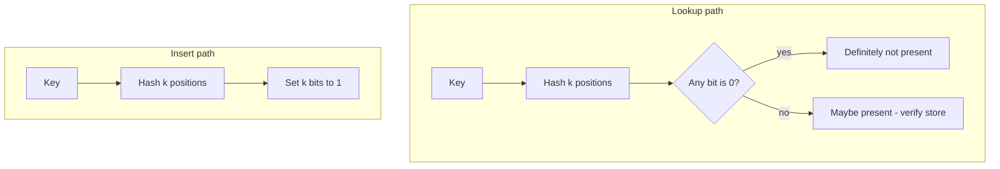

| Operation | Complexity | Notes |
|-----------|------------|-------|
| Insert | O(k) | k fixed at design time (~7 for 1% p) |
| Lookup | O(k) | No dependence on n inserted |
| Memory | O(m) bits | Fixed; does not store keys |

---

### Walkthrough: inserting and looking up fruit names

Use a toy bit array of size 10 and three hash functions.

**Start:** all zeros.

```text
Index:  0  1  2  3  4  5  6  7  8  9
Bits:   0  0  0  0  0  0  0  0  0  0
```

**Insert `"Apple"`** — hashes land at positions 2, 5, 8:

```text
Hash1(Apple) = 2    Hash2(Apple) = 5    Hash3(Apple) = 8

Result:  0  0  1  0  0  1  0  0  1  0
```

**Insert `"Banana"`** — positions 1, 5, 7. Position 5 was already 1 from Apple; that overlap is normal.

```text
Hash1(Banana) = 1    Hash2(Banana) = 5    Hash3(Banana) = 7

Result:  0  1  1  0  0  1  0  1  1  0
```

**Lookup `"Apple"`** — check 2, 5, 8 → all 1 → **possibly present** (and it really is).

**Lookup `"Orange"`** — hashes to 0, 4, 9. Bit 4 is still 0 → **definitely not present**. No need to hit the database.

This is the filter doing its best work: a cheap, certain rejection.

---

### False positives — when the filter is wrong (in one direction only)

A **false positive** means the filter says “possibly present” for a key that was **never** inserted.

Continuing the fruit example — suppose `"Orange"` hashes to positions 2, 5, and 7. All three are already 1 because of Apple and Banana, even though Orange was never added:

```text
Apple  →  bits 2, 5, 8
Banana →  bits 1, 5, 7
Orange →  bits 2, 5, 7   (never inserted, but all bits are 1)
```

The filter cannot tell Orange apart from a real member without checking the real store. That extra DB read is the price of sharing bits.

A **false negative** (saying “not present” when the key **was** inserted) does **not** happen in a standard Bloom filter, as long as bits are never cleared and the key was inserted correctly. Every inserted key leaves all its bits set to 1 permanently.

False positives rise when:

- Too many keys are packed into too small an array.
- Too few or too many hash functions are used.
- Hash functions cluster keys on the same bits.

They fall when you allocate more bits per expected key and choose `k` using the sizing formulas below.

---

### Sizing the filter — choosing `m`, `k`, and acceptable error

Before deployment you decide:

- `n` — how many keys you expect to insert.
- `p` — maximum false-positive rate you can tolerate (e.g. 1%).

**Optimal number of hash functions:**

```text
k = (m / n) × ln(2)     ≈ 0.693 × (m / n)
```

**Approximate false-positive probability:**

```text
p ≈ (1 − e^(−kn/m))^k
```

**Bits needed for target `p` and `n`:**

```text
m ≈ −(n · ln p) / (ln 2)²
```

**Example:** 1 million keys, 1% false-positive target:

**How to calculate:**

```text
Goal:  Size a Bloom filter for n = 1,000,000 keys at p = 0.01 (1% false-positive rate)
       — find bit array length m, hash count k, and verify the error budget.

Given:  n = 1,000,000 keys,  p = 0.01 (1% false-positive rate)

Step 1 — bits needed (m) — more bits = fewer collisions = lower false-positive rate:
  ln(p) = ln(0.01) ≈ −4.605
  (ln 2)² ≈ 0.480
  m = −(n × ln p) / (ln 2)²
    = (1,000,000 × 4.605) / 0.480
    ≈ 9,600,000 bits
    ≈ 1.2 MB  (divide by 8 for bytes, then ÷ 1024² for MB)

Step 2 — hash functions (k) — optimal k balances probe spread vs. filling bits too fast:
  k = (m / n) × ln(2)
    ≈ (9.6 × 0.693)
    ≈ 6.6  →  round to 7 hash functions

Step 3 — sanity check false-positive rate — confirm design meets the 1% target:
  p ≈ (1 − e^(−kn/m))^k
    ≈ (1 − e^(−7×1M/9.6M))^7
    ≈ 1%  ✓

What this means in production: ~1.2 MB RAM guards 1M keys; ~1% of lookups for absent keys
  still reach the DB (false positive). At 10k absent-key QPS that is ~100 extra DB reads/sec —
  usually cheaper than storing all keys in a hash set (~50+ GB) or hitting DB on every miss.
```

Rule of thumb: about **10 bits per element** gives roughly **1%** false positives. Double the bit array size to quarter the error rate.

Compared to storing 1 billion URLs in a hash set (~50 GB), a Bloom filter for the same membership checks might use **hundreds of megabytes** — orders of magnitude less, with a known false-positive rate you size upfront.

---

### Variants worth knowing

| Variant | What it adds |
|---------|--------------|
| **Counting Bloom filter** | Small counters per slot instead of single bits — supports safe delete (increment on insert, decrement on delete). |
| **Scalable Bloom filter** | Stack a new filter when the current one fills — unbounded growth with controlled error. |
| **Blocked / partitioned** | Cache-friendly layouts for high-QPS systems like RocksDB. |

Standard Bloom filters **cannot delete** by clearing a bit — another key may share that bit:

```text
Apple and Banana both set bit 5.
Clearing bit 5 to "remove Apple" would break Banana.
```

---

### Bloom filter vs hash set

| | Hash set | Bloom filter |
|---|----------|--------------|
| Stores actual keys | Yes | No — bits only |
| Memory | High (O(n)) | Very low (fixed `m`) |
| Lookup | O(1) average | O(k) |
| False positives | Never | Yes — tunable |
| False negatives | Never | Never (standard) |
| Delete / list members | Yes | No (standard) |

Use a hash set when you need exact membership and enumeration. Use a Bloom filter when you need a **cheap pre-filter** in front of something expensive.

---

### Pitfalls and design tips

#### When to use (and when not to)

- Use as a **pre-filter** before disk, DB, or cache when absent-key lookups are common and expensive.
- Use when you can tolerate a **tunable false-positive rate** and always confirm “maybe” with the real store.
- Do **not** use for exact membership, enumeration, or “how many unique keys?” (that is HyperLogLog — [13.2](#132-hyperloglog)).
- Do **not** use standard Bloom when keys are **removed** frequently without a rebuild strategy.

#### Common mistakes

- **Clearing bits to delete** — another key may share that bit; use a **counting Bloom filter**, **cuckoo filter**, or periodic full rebuild.
- **Under-sizing for peak `n`** — false-positive rate climbs fast once the filter is overfilled; monitor FP rate or rebuild when key count exceeds design target.
- **Skipping double hashing** — simulate `k` hashes cheaply: `g_i(x) = h1(x) + i × h2(x) mod m` (one pass, fewer hash calls).
- **Treating “maybe” as “yes”** — always verify with the authoritative store; Bloom is a hint, not proof.

#### Production notes

- **RedisBloom:** `BF.ADD` / `BF.EXISTS` in front of cache or DB layers.
- **RocksDB / LevelDB:** per-SSTable Bloom filters skip disk reads when a key is definitely not in that file.
- **Guava:** `BloomFilter` for JVM services; size at startup from expected `n` and target `p`.
- **Shard merge:** union filters with same `m`, `k`, and hash seeds via bitwise OR of bit arrays.

---

### Real-world example: stopping cache penetration

**Problem:** A large e-commerce API (similar to patterns used at **Shopify**-scale product catalogs) caches product details by `product_id` in **Redis**. Attackers scan random IDs (`/products/999999991`, …) or a bug replays invalid IDs — every cache miss fans out to **PostgreSQL** (**cache penetration**), spiking DB connections and p99 latency.

**Why the naive approach failed:** Redis alone cannot distinguish “never issued” from “not cached yet.” Returning 404 still requires a DB lookup on miss. Storing all 1M valid IDs in a Redis `SET` works but costs ~50+ GB of RAM at scale; querying Postgres on every random ID does not.

**How the Bloom filter fixed it:** Size per the calculation above — `n = 1,000,000` valid IDs, `p = 1%` → ~**1.2 MB** in-process Bloom (or **RedisBloom** `BF.ADD` / `BF.EXISTS` on a `valid_products` key). On deploy, load all issued IDs into the filter. Request path:

```text
GET /products/{id}
  → BF.EXISTS valid_products {id}?
      NO  → 404 immediately (safe — ID never issued)
      YES → GET cache:product:{id}
              miss → SELECT from Postgres (rare false positive ≈ 1% of absent keys)
```

**RocksDB** uses the same idea per-SSTable: the engine skips a disk read when the filter says a key is definitely not in that file.

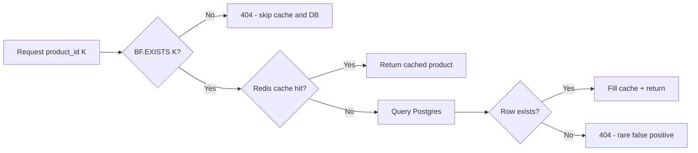

**Outcome:** Invalid-ID traffic drops from **100% DB hits** to **~0%** (definite rejects) plus ~**1%** false-positive DB reads on the remainder. DB connection pool pressure and p99 latency stabilize under scan attacks; memory stays ~1.2 MB vs tens of GB for a full key set.

---


<a id="132-hyperloglog"></a>

## 13.2 HyperLogLog

### Overview

You need to know how many **different** visitors, IPs, or search terms showed up today — not total page views (the same person counts many times), but **unique** count. Storing every distinct value in a hash set works for thousands but breaks at billions. You want a running headcount that fits in a few kilobytes and can be updated on every event.

Technically, **HyperLogLog (HLL)** estimates **cardinality** with **fixed memory** (~12 KB for `p = 14`, regardless of whether you have 1K or 1B uniques). Each element is hashed; leading-zero patterns in hash bits update small **registers**, combined into an approximate count with ~**0.8–2%** relative error. Sketches **merge** across nodes by element-wise max (`PFMERGE` in Redis). **Use when** you need streaming distinct counts at scale and can tolerate small approximation error — not for exact billing or membership tests.

---

### What problem it fixes

Systems constantly need “how many **unique** X”:

- Unique visitors today
- Distinct IP addresses in logs
- Distinct search queries
- Unique devices in an ad campaign

A **hash set** of every value uses O(n) memory — billions of IDs is impractical. `COUNT DISTINCT` in a database over billions of rows is slow and expensive. HLL gives a **streaming, fixed-size** approximate answer you can update per event and merge across data centers.

---

### What it does

**Insert (add)** — process one element; update internal registers. O(1) per element.

**Query (estimate)** — return approximate distinct count from current registers.

It does **not** tell you which items were seen, whether a specific item was seen (that is a Bloom filter), or exact counts. It answers **one question**: “about how many unique values have passed through?”

---

### Compared to the alternative

**Hash set / `COUNT DISTINCT` (exact):**

```text
Each unique value stored once     Memory = O(n) — grows with every new distinct ID
Query: exact cardinality          Billions of uniques → GB of RAM or heavy DB scan
```

**HyperLogLog (approximate):**

```text
Fixed register array (~12 KB)     Memory = O(1) — same size at 1K or 1B uniques
Query: estimated cardinality      ~1–2% error; merge across nodes with PFMERGE
```

HLL wins when you need **streaming distinct counts at scale** and can tolerate small error. Exact sets win for **billing, compliance, or small cardinalities** where wrong counts are unacceptable.

---

### How it works — the algorithm inside

#### Step 1 — Hash every element

Each incoming value is passed through a hash function that produces a long, pseudo-random bit string. The same input always produces the same hash; different inputs spread evenly across all possible bit patterns.

```text
"apple"  → 1011001010010110...
"banana" → 0000100110101101...
"orange" → 1100010101010010...
```

Hashing turns arbitrary strings (user IDs, IPs, URLs) into uniform random-looking bits. Without that, the leading-zero trick in the next steps would not work.

---

#### Step 2 — Pick a register from the first bits

The hash is split in two. The **first `p` bits** choose which register to update. The **remaining bits** are used in Step 3.

```text
Hash:  1010 000101101001...
       │───│
         ↓
Register index = 1010₂ = 10   (register R10)

Remaining bits: 000101101001...
                ↑ used next
```

If precision `p = 14`, there are **m = 2¹⁴ = 16,384 registers**. The first 14 bits of every hash pick one of those buckets. Think of it as dealing each element to one of 16,384 mail slots — many elements land in the same slot, but that is expected.

---

#### Step 3 — Count leading zeros in the remaining bits

After the index bits, scan the rest of the hash from left to right and count how many **0** bits appear before the first **1**.

```text
Remaining bits:  000101101...
                 ^^^
Leading zeros = 3

Stored value ρ = 4   (position of the first 1, counting from 1)
```

**Why leading zeros?** In a fair random bit string, long runs of zeros are rare. The more **distinct** elements you hash, the more chances you get to see unusually long zero runs somewhere in the register array.

| Leading zeros before first 1 | Approximate probability |
|------------------------------|-------------------------|
| 0 | 1/2 |
| 1 | 1/4 |
| 2 | 1/8 |
| 3 | 1/16 |
| k | 1 / 2^(k+1) |

A register that has seen many different hashes is more likely to have recorded a large ρ value — a signal that this bucket has been "busy."

---

#### Step 4 — Update the register (keep the maximum)

Each register stores only **one number**: the largest ρ value ever observed for that bucket. New elements either raise the max or are ignored.

```text
Register M[10] currently = 4
New element hashes to ρ = 6

M[10] = max(4, 6) = 6
```

Registers **never decrease**. Duplicates that hash to the same register with the same or smaller ρ change nothing — which is why re-adding `"apple"` does not inflate the distinct count.

```text
function add(element):
    h   = hash(element)                    // e.g. 64-bit hash
    i   = first_p_bits(h)                  // register index
    rho = position_of_first_one(h, after_p) // leading zeros + 1
    M[i] = max(M[i], rho)
```

---

#### Step 5 — Estimate cardinality from all registers

After processing the stream, every register holds a small integer. HyperLogLog combines them with a **harmonic mean** formula (plus bias correction in **HLL++** for small sets):

```text
E ≈ α_m × m² / Σ(2^−M[i])
```

`α_m` is a constant that depends on `m`. You do not need to implement this by hand — Redis, BigQuery, and other libraries handle it. The intuition: if many registers hold large values, the stream probably contained many unique elements; if most registers are still near zero, the distinct count is probably small. **HLL++** adds bias correction when the true count is small (roughly under ~1,000).

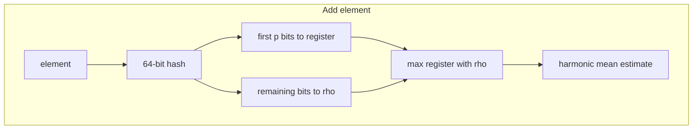

---

#### Worked example — four registers

Start with all registers at zero:

```text
R0 = 0    R1 = 0    R2 = 0    R3 = 0
```

**Process `"apple"`**

```text
Hash:  00 000101...
       ││
       R0

Leading zeros in remainder = 3  →  ρ = 4

R0 = 4    R1 = 0    R2 = 0    R3 = 0
```

**Process `"orange"`**

```text
Hash:  00 0000001...
       ││
       R0   (same bucket as apple — possible when m is small)

Leading zeros in remainder = 6  →  ρ = 7

R0 = max(4, 7) = 7    R1 = 0    R2 = 0    R3 = 0
```

**Process `"apple"` again** — duplicate. Same hash, same register, same ρ. Register stays at 7.

Only the **strongest signal per bucket** is kept. After millions of distinct IDs, the pattern of register values feeds the estimator.

---

#### Merging two sketches

Each server (or shard) can maintain its own HyperLogLog. To combine them, take the **element-wise maximum** — the same rule as a single register update, applied across the whole array:

```text
Server A:  [3, 6, 2, 5]
Server B:  [4, 2, 7, 3]
                    ↓
Merged:    [4, 6, 7, 5]   = max per position
```

```text
M_merged[i] = max(M_A[i], M_B[i])   for every register i
```

No raw events need to be shipped — only a few kilobytes per node. Redis exposes this as `PFMERGE`.

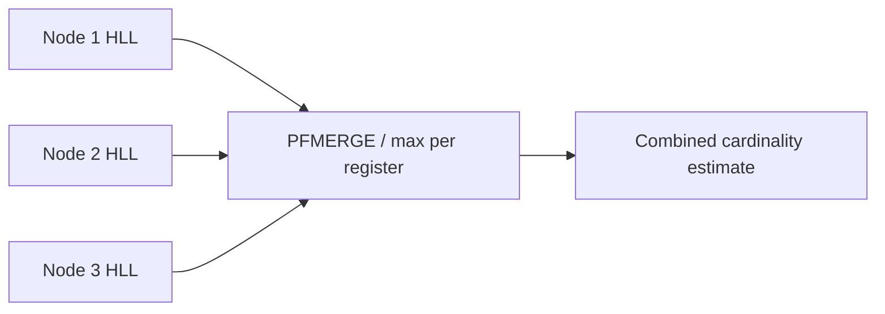

Each edge server counts locally; a central job merges sketches without shipping raw IPs.

---

#### Complexity

| Operation | Complexity | Notes |
|-----------|------------|-------|
| Add one element | O(1) | One hash + one register update |
| Merge two HLLs | O(m) | `m` = number of registers |
| Estimate count | O(m) | Scan all registers once |
| Memory | O(m) | Fixed — typically a few KB |

Typical production config: `p = 14` → **m = 16,384 registers** → **~12 KB** per sketch, standard error ≈ **0.8%**.

**How to calculate memory and error:**

```text
Goal:  Size a HyperLogLog sketch — find register count m, RAM footprint, and expected error.

Given:  precision p = 14

Step 1 — number of registers (m) — more registers = finer sampling = lower error:
  m = 2^p = 2^14 = 16,384 registers

Step 2 — memory (Redis HLL uses 6 bits per register) — fixed size regardless of cardinality:
  16,384 × 6 bits = 98,304 bits ≈ 12 KB

Step 3 — standard error (approximate) — relative error shrinks as √m grows:
  error ≈ 1.04 / √m
        ≈ 1.04 / 128
        ≈ 0.008  →  about 0.8% relative error

Interpretation: One ~12 KB Redis key can track billions of distinct IPs for a day.
  PFCOUNT returns ~48,231 when true count is 47,800 — acceptable for dashboards,
  not for invoicing. PFMERGE combines edge-node sketches without shipping raw events.
```

---

### HyperLogLog vs exact distinct count

| | Hash set / exact | HyperLogLog |
|---|------------------|-------------|
| Memory | O(n) | O(1) fixed ~12 KB |
| Accuracy | Exact | ~1–2% error |
| List members | Yes | No |
| Merge shards | Ship all keys | Max registers |

Do not use HLL for billing or compliance requiring exact counts. Do not confuse with Bloom filter (membership) or Count-Min Sketch (per-key frequency).

---

### Pitfalls and design tips

#### When to use (and when not to)

- Use for **streaming distinct counts** — unique visitors, distinct IPs, unique search queries — at billions of events.
- Use when sketches must **merge across shards** without replaying raw data (`PFMERGE`, BigQuery `APPROX_COUNT_DISTINCT`).
- Do **not** use for **exact billing, compliance, or audit** counts where ~1% error is unacceptable.
- Do **not** use for **membership** (“have we seen this IP before?”) — that is a Bloom filter or hash set.

#### Common mistakes

- **Mixing precisions** — sketches must share the same `p` (register count) to merge; mixing invalidates `PFMERGE`.
- **Expecting duplicates to increase the count** — re-adding the same user ID is a no-op; only distinct values matter.
- **Ignoring small-set bias** — raw HLL overestimates below ~1,000 uniques; use **HLL++** bias correction or exact counting for small sets.
- **Confusing with Bloom or CMS** — HLL answers cardinality, not membership or per-key frequency.

#### Production notes

- **Redis:** `PFADD` / `PFCOUNT` / `PFMERGE` — ~12 KB per key, many writers can increment concurrently.
- **BigQuery / Elasticsearch / Druid:** `APPROX_COUNT_DISTINCT`, `cardinality`, HyperUnique aggregations.
- **Postgres:** `hyperloglog` extension for approximate distinct in SQL.
- **Merge intuition:** each register tracks the longest zero-run seen for its bucket; union of streams takes the max across nodes.

---

### Real-world example: daily unique visitors (Redis HyperLogLog)

**Problem:** A high-traffic web app (patterns common at **Cloudflare**-scale edge logging) needs “how many **distinct** client IPs visited today?” across dozens of app servers — without centralizing every IP in a hash set or running `COUNT DISTINCT` over billions of log rows in **BigQuery**.

**Why the naive approach failed:** A Redis `SET` of every IP for one day can grow to **gigabytes** at tens of millions of uniques. Shipping every IP to a central counter creates a network bottleneck. `COUNT DISTINCT` over raw logs is slow and expensive per dashboard refresh.

**How HyperLogLog fixed it:** Each app server calls `PFADD` on a shared Redis key with the client IP. Redis stores a fixed ~**12 KB** sketch per key regardless of cardinality:

```text
PFADD visitors:2025-06-24 "203.0.113.10"
PFADD visitors:2025-06-24 "198.51.100.5"
PFADD visitors:2025-06-24 "203.0.113.10"   # duplicate — estimate stays ~2, not 3

PFCOUNT visitors:2025-06-24
→ ~48,231 distinct IPs (true count might be 47,800 — within ~0.8% error)
```

Edge nodes can also maintain local HLL sketches and a nightly job runs `PFMERGE visitors:2025-06-24 edge1 edge2 edge3` — only kilobytes shipped per node, not billions of IPs.

**Outcome:** Dashboard distinct-visitor metrics update in **O(1)** per request with **~12 KB** RAM per day-key vs GB-scale hash sets. Query latency for `PFCOUNT` is sub-millisecond; log-pipeline `COUNT DISTINCT` scans are avoided for real-time panels.

---


<a id="133-count-min-sketch"></a>

## 13.3 Count Min Sketch

### Overview

An API gateway sees millions of distinct API keys and must flag clients hammering the same endpoint — but you cannot keep a full `key → count` hash map in RAM for every possible key. You need “about how many times did **this** key call us?” with bounded memory, updated on every request in real time.

Technically, a **Count-Min Sketch (CMS)** is a **`d × w` matrix** of counters: each event hashes the key to one column per row and increments those `d` cells. A query returns the **minimum** across the `d` probed counters. Update and query are **O(d)**; memory is **fixed O(d × w)**. The trade-off: estimates **never underestimate** (safe for rate limits) but may **overestimate** when keys collide in shared buckets. **Use when** key cardinality is huge and you need approximate per-key frequency with a hard memory cap.

---

### What problem it fixes

Streaming systems need **per-key frequency**:

- Requests per API key
- Packets per source IP
- Clicks per ad ID
- Search queries per keyword

Exact counting needs a hash map `key → count` that grows with distinct keys — untenable at billions of keys. CMS trades exactness for a bounded `d × w` matrix (see comparison below).

---

### What it does

**Update (insert)** — increment `d` counters for key `x`.

**Query** — return `min(CMS[i][h_i(x)])` as estimated frequency of `x`.

It does not list keys, delete counts (standard CMS), or give exact billing numbers. It is a **frequency sketch**, not a database.

---

### Compared to the alternative

**HashMap (exact per-key counts):**

```text
Input stream          HashMap                    Memory grows
─────────────         ───────                    with distinct keys
Apple                 Apple  → 3
Banana                Banana → 2
Apple                 Orange → 1
Orange
Apple
Banana

Search / update = O(1) per key    Counts exact
```

**Count-Min Sketch (approximate frequencies):**

```text
Input stream          Small 2D counter table     Fixed memory
─────────────         (d rows × w columns)       (~KB, not GB)
Apple                      ↓
Banana                Estimated counts:
Apple                 Apple  ≈ 3
Orange                Banana ≈ 2
Apple                 Orange ≈ 1
Banana

Update / query = O(d)             May overcount; never undercounts
```

CMS wins for **fixed-memory per-key frequency** on unbounded streams. Hash maps win for **exact counts** and when distinct key count fits in RAM.

---

### How it works — the algorithm inside

#### Step 1 — Create the counter matrix

CMS is a **`d × w` array** — `d` rows (one hash function each), `w` columns (counter buckets).

Example: **3 hash functions**, **5 counters per row**:

```text
           C0  C1  C2  C3  C4
H1  -->    0   0   0   0   0
H2  -->    0   0   0   0   0
H3  -->    0   0   0   0   0
```

Each row uses a **different** hash function so a collision in one row is unlikely to repeat in all rows.

---

#### Step 2 — Hash the element

For every insert or query, map the key to one column index **per row**:

```text
"apple"  →  H1(apple) = 2
            H2(apple) = 4
            H3(apple) = 1
```

Hashing spreads keys across columns uniformly. Without that, a few hot columns would dominate every estimate.

---

#### Step 3 — Increment counters on insert

Each insertion adds `+1` (or `+count`) to **one counter in every row** — the column chosen by that row's hash (Step 2).

```text
function update(key, count = 1):
    for i = 1 to d:
        j = hash_i(key)
        CMS[i][j] += count
```

See the **worked example** below for table state after each insert.

---

#### Step 4 — Query: take the minimum across rows

1. Hash the key with all `d` functions.
2. Read the `d` counter values.
3. Return **`min(...)`** — the smallest value is the estimate.

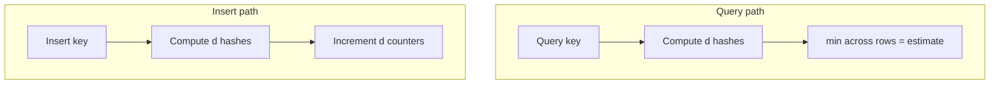

---

#### Why the minimum? (collisions only inflate)

Counters are **shared**. If `"banana"` hashes to the same bucket as `"apple"` in row 2, that cell counts **both** keys:

```text
"apple" inserted 5 times; "banana" collides in row H2

H1 → 5
H2 → 8   ← inflated by banana's hits
H3 → 5

max(5, 8, 5) = 8   ✗ overcounts apple
avg(5, 8, 5) = 6   ✗ still high
min(5, 8, 5) = 5   ✓ closest to true count for apple
```

Collisions **add** to counters — they never subtract. So CMS **never underestimates** a key's frequency; it may **overestimate** when other keys share buckets. The minimum across independent rows is the least contaminated estimate.

---

#### Worked example — `"apple"` twice

Using the empty **3 × 5** matrix from Step 1. Hashes: `H1→C2`, `H2→C4`, `H3→C1`.

**After first `"apple"`:**

```text
           C0  C1  C2  C3  C4
H1  -->    0   0   1   0   0
H2  -->    0   0   0   0   1
H3  -->    0   1   0   0   0
```

**After second `"apple"`** (`+1` on the same three cells):

```text
           C0  C1  C2  C3  C4
H1  -->    0   0   2   0   0
H2  -->    0   0   0   0   2
H3  -->    0   2   0   0   0
```

**Query `"apple"`:** `min(2, 2, 2) = 2` ✓

---

#### Merging sketches

Two CMS instances with the **same `d`, `w`, and hash seeds** merge by **adding** matrices cell-wise — same idea as unioning two streams' event counts:

```text
Sketch A[i][j] + Sketch B[i][j]  →  Merged[i][j]
```

Useful when each edge node counts locally and a central job combines without replaying raw events.

---

#### Complexity

| Operation | Complexity | Notes |
|-----------|------------|-------|
| Add element | O(d) | `d` hash + increment |
| Query count | O(d) | `d` hash + min |
| Merge sketches | O(d × w) | Element-wise add |
| Memory | O(d × w) | Fixed — `w` = width, `d` = depth (hash rows) |

---

### Sizing — choosing `w` and `d`

With probability `(1 − δ)`:

```text
error ≤ ε × N     where N = total events in stream
ε ≈ 1/w           δ ≈ e^(−d)

w = ⌈e / ε⌉
d = ⌈ln(1 / δ)⌉
```

**How to calculate:**

```text
Goal:  Size a Count-Min Sketch for ε = 1% error bound and δ = 0.1% failure probability
       — find matrix dimensions w × d and total RAM.

Given:  ε = 0.01 (1% error bound),  δ = 0.001 (0.1% failure probability)

Step 1 — columns (w) — wider matrix spreads hash collisions, tightening per-key error:
  w = ⌈e / ε⌉ = ⌈2.718 / 0.01⌉ = ⌈271.8⌉ = 272

Step 2 — rows (d) — more independent hash rows reduce chance all rows collide for one key:
  d = ⌈ln(1 / δ)⌉ = ⌈ln(1000)⌉ = ⌈6.91⌉ = 7

Step 3 — memory (32-bit counters) — fixed regardless of how many distinct keys appear:
  w × d × 4 bytes = 272 × 7 × 4 = 7,616 bytes ≈ 7.4 KB per sketch

Step 4 — what the guarantee means — probabilistic bound tied to total stream volume N:
  With probability 99.9%, estimated count for any key is within
  ε × N of the true count, where N = total events in the stream.
  (Heavy keys are estimated more tightly in practice.)

What this means in production: ~7.4 KB tracks per-key frequency for millions of user IDs.
  A key with true count 500 might read 520 (overestimate) but never 480 (underestimate) —
  safe for abuse detection where missing a heavy sender is worse than a false alarm.
```

---

### Pitfalls and design tips

#### When to use (and when not to)

- Use for **approximate per-key frequency** on unbounded streams — API keys, source IPs, ad IDs — with fixed memory.
- Use when **never underestimating** matters — rate limits, abuse detection, “top talkers” promotion.
- Do **not** use for **exact billing** without a promotion path to exact counters for flagged keys.
- Do **not** use to **list all keys** or answer range counts without auxiliary structures.

#### Common mistakes

- **Expecting exact counts** — CMS overestimates on collisions; use hash maps for known-small key sets.
- **No time window by default** — standard CMS is all-time; use sliding windows (array of sketches), exponential decay, or hourly rotation for “last 5 minutes.”
- **Confusing with Count-Median Sketch** — CMS is simpler and one-sided; Count Sketch can underestimate (median) but is tighter on some distributions.
- **Point queries only** — you must already know the key to query; CMS does not enumerate keys.

#### Production notes

- **Apache DataSketches** and stream processors (**Flink** approximate aggregations) ship production CMS implementations.
- **Redis Stack** CMS module where available; pair with a min-heap for **heavy hitters** — promote keys above threshold to exact `INCR` counters.
- **Merge:** cell-wise matrix add when `d`, `w`, and hash seeds match — combine edge-node sketches without replaying events.

#### Probabilistic sketches — how they differ

| Question | Structure | Section |
|----------|-----------|---------|
| “Might this key exist?” | Bloom filter | [13.1](#131-bloom-filters) |
| “How many **unique** values?” | HyperLogLog | [13.2](#132-hyperloglog) |
| “How many times did **this key** appear?” | Count-Min Sketch | [13.3](#133-count-min-sketch) |

---

### Real-world example: per-key request counting at scale

**Problem:** **Cloudflare**-style edge analytics (and similar CDN/WAF pipelines) must detect clients sending abnormal request volumes per `user_id` or `client_ip` across a global stream — billions of events, millions of distinct keys, no room for a `HashMap<user_id, count>` per edge node.

**Why the naive approach failed:** A per-user counter map grows with every new distinct ID — **GB of RAM** per edge POP at scale. Shipping every event to a central **Redis `INCR`** cluster creates hot keys and network cost. Token buckets work for **known** clients but not arbitrary high-cardinality IDs.

**How Count-Min Sketch fixed it:** Each edge node holds one sketch sized from the calculation above — `w = 272`, `d = 7` → ~**7.4 KB** fixed memory:

```text
on event(user_id):
    CMS.update(user_id, +1)

on check(user_id):
    if CMS.estimate(user_id) > THRESHOLD:
        promote to exact per-user counter in Redis   // optional, for enforcement
```

Sketches merge cell-wise at a regional aggregator (`Merged[i][j] = SketchA[i][j] + SketchB[i][j]`) — kilobytes shipped per node per minute, not raw event replay.

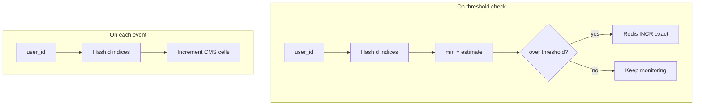

**Outcome:** Per-key abuse detection runs in **O(d)** (~7 hash ops) with **~7.4 KB** RAM per sketch regardless of distinct user count. Heavy senders are never missed (no underestimates); occasional overestimates trigger extra scrutiny, not silent bypass.

---


<a id="134-trie"></a>

## 13.4 Trie

### Overview

You type `sys` in a search box and suggestions appear instantly — `system design`, `systemctl`, … — without scanning millions of stored queries. The system must match **prefixes** efficiently as each character arrives, sharing common beginnings like `sys` across many words.

Technically, a **trie** (prefix tree) stores strings as character paths from a root; shared prefixes share nodes (`cat`, `car`, `cart` all traverse `c → a` before branching). Insert, exact search, and prefix walk are **O(L)** where L is string length — independent of total dictionary size N. Memory is **O(total characters stored)**, often reduced by prefix sharing and radix compression. **Use when** prefix queries, autocomplete, or longest-prefix match dominate over exact-only lookups.

---

### What problem it fixes

- **Autocomplete** and type-ahead
- **Spell checking** against a dictionary
- **IP routing** — longest prefix match for CIDR blocks
- **Phone/contact search** by prefix

A **hash map** gives O(1) exact lookup but cannot answer “all keys starting with `sys`” without scanning all keys. **Binary search** on a sorted list is O(log n) per prefix query and awkward for incremental typing.

---

### What it does

**Insert** — walk/create character nodes; mark end-of-word.

**Search** — walk characters; check path exists and end-of-word flag if full word needed.

**Prefix search** — walk to prefix node; collect all descendant end-of-word nodes.

Each node holds `children: map<char, Node>` and `isEndOfWord: boolean`.

---

### How it works — the algorithm inside

Words: `cat`, `car`, `cart`, `dog`

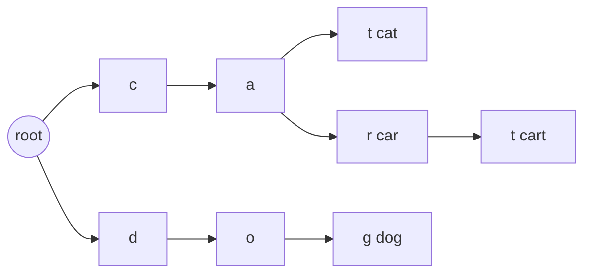

#### Insert algorithm

```text
function insert(word):
    node = root
    for each char c in word:
        if c not in node.children:
            node.children[c] = new Node()
        node = node.children[c]
    node.isEndOfWord = true
```

#### Search algorithm

```text
function search(word):
    node = walk(root, word)
    return node exists and node.isEndOfWord
```

#### Prefix search

```text
function prefix_search(prefix):
    node = walk(root, prefix)
    if node is null: return []
    return DFS collect all isEndOfWord under node
```

| Operation | Time |
|-----------|------|
| Insert / search | O(L) |
| Prefix query | O(L + K), K = results |

**How to calculate — trie memory (approximate):**

```text
Goal:  Estimate RAM for a 500k-word autocomplete dictionary — plan capacity before deploy.

Given:  500,000 unique English words in autocomplete dictionary
        Average word length L = 8 characters
        26 lowercase children per node (array of pointers) — naive implementation
        Pointer size = 8 bytes, plus 1 byte isEndOfWord flag (padded to alignment)

Step 1 — upper bound (no prefix sharing — worst case) — every word gets its own path:
  nodes ≈ 500,000 × 8 chars = 4,000,000 nodes
  per node ≈ 26 × 8 B pointers + overhead ≈ 208 B
  memory ≈ 4M × 208 B ≈ 832 MB  (pessimistic)

Step 2 — realistic with prefix sharing (English corpus) — shared stems collapse paths:
  Shared prefixes ("inter", "pre", "un") collapse paths
  Empirical rule: ~0.3–0.6 × naive node count → ~1.2M–2.4M nodes
  memory ≈ 1.5M × 208 B ≈ 312 MB

Step 3 — compact map-based children (production tries) — store only existing edges:
  Only store existing child edges (map<char, Node*>) → ~50–150 B per node average
  1.5M nodes × 100 B ≈ 150 MB

Step 4 — radix tree compression (single-child chains merged) — best-case for dense prefixes:
  Often 2–5× reduction vs naive trie → ~30–80 MB for this dictionary size

What this means in production: plan ~150–300 MB RAM for 500k-word autocomplete (map children);
  naive 26-array nodes can exceed 800 MB — use radix trees or external stores (Elasticsearch).
  10M URLs with little shared prefix → memory approaches naive bound;
  IP radix trees compress better because addresses share high-order bits.
```

---

### Walkthrough: insert and prefix query

Insert `"cat"`, `"car"`, `"cart"`, `"dog"` as in the diagram.

Prefix `"ca"` → traverse `c → a` → descendants yield `cat`, `car`, `cart` without scanning `dog`.

Delete `"car"` → unmark end on `r`; keep nodes because `"cart"` still uses `c → a → r → t`.

---

### Variants and trade-offs

| Variant | Use when |
|---------|----------|
| **Radix tree** | Compress single-child chains into multi-char edges |
| **Patricia trie** | IP addresses — binary trie on bits |
| **DAWG** | Static dictionaries — merge identical suffixes |

| | Hash map | Trie |
|---|----------|------|
| Exact lookup | O(1) avg | O(L) |
| Prefix queries | Poor | Natural |
| Memory | Lower for sparse exact keys | Pointer-heavy |

---

### Pitfalls and design tips

#### When to use (and when not to)

- Use for **autocomplete**, spell-check dictionaries, and **longest-prefix match** (IP routing, CIDR).
- Use when queries are **prefix-shaped** (“all keys starting with `sys`”) and incremental typing matters.
- Do **not** use when you only need **exact key lookup** — a hash map is simpler and more memory-efficient.
- Do **not** use naive 26-child array nodes for **sparse alphabets or Unicode** without map-based or compressed variants.

#### Common mistakes

- **Underestimating memory** — one node per character per distinct prefix path; long unshared strings bloat the tree.
- **Indexing raw UTF-8 bytes** — one logical character may be multiple bytes; normalize (NFC) and index by code points or graphemes.
- **Returning DFS order as rankings** — production autocomplete attaches **frequency scores** at terminal nodes and returns top-K sorted.
- **Ignoring radix compression** — single-child chains should be merged into multi-char edges in production.

#### Production notes

- **Elasticsearch** completion suggester builds a trie-like FST for prefix search at index time.
- **Linux kernel FIB** (routing table) uses radix trees for longest-prefix IP match — same prefix-tree idea on bits.
- **Redis** has no native trie; often pair an in-memory trie with Redis for session/cache layers.
- **Patricia trie** variant: binary branches per bit — standard for IP address tables.

---

### Real-world example: search query autocomplete

**Problem:** **Elasticsearch**-powered search products (and similar type-ahead UIs at **Google**-scale query volumes) must suggest completions as the user types — e.g. after `sys`, return `system design`, `systemctl`, … from millions of historical queries — with **sub-10 ms** latency per keystroke.

**Why the naive approach failed:** A sorted list or hash map of all queries requires **O(N) scan** to find prefix matches — unusable at millions of queries. Binary search on a sorted array is O(log N) per keystroke and awkward for incremental UI updates. Loading all queries from **Postgres** on each keypress adds network round-trips.

**How the trie fixed it:** Historical queries are inserted into an in-memory trie (or Elasticsearch **completion suggester** FST at index time). On each keystroke:

```text
1. Walk root → s → y → s          (O(3) — length of prefix so far)
2. From that node, DFS/BFS collect all isEndOfWord descendants
3. Rank by historical frequency stored at terminal nodes
4. Return top 5 suggestions
```

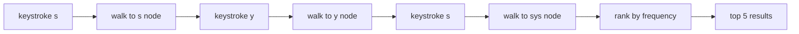

Each keystroke touches only the path for characters typed plus the subtree under the current prefix — not millions of unrelated queries.

**Outcome:** Prefix lookup stays **O(L)** per keystroke (L = chars typed); suggestion latency drops from hundreds of ms (full scan) to single-digit ms for warm in-memory tries. Memory ~**150–300 MB** for 500k queries with map-based children vs scanning GB-scale string lists on every keypress.

---


<a id="135-skip-lists"></a>

## 13.5 Skip Lists

### Overview

Imagine looking up a name in a phone book sorted A–Z. You do not read every page from the start — you jump to the right letter section, then narrow down within that section. A plain sorted linked list has no express lanes: to find "Smith" you walk every entry from the beginning, one pointer at a time.

A **skip list** builds those express lanes with probability. The bottom level (Level 0) is a complete sorted linked list; each higher level is a sparser subsequence of the level below. Search starts at the top level, moves right while the next key is still smaller than the target, then **drops down** one level and repeats — **average O(log n)** for search, insert, and delete. There are no tree rotations; promotion is a coin flip per level. That simplicity makes skip lists popular for concurrent in-memory indexes, especially **Redis sorted sets** (`ZSET`).

---

### What problem it fixes

You need a **sorted** in-memory structure with:

- Fast search, insert, delete
- Range scans and rank queries
- Reasonable concurrency without tree rotation complexity

Sorted arrays are slow to insert. Plain linked lists are O(n) search. AVL/red-black trees work but are harder to implement lock-free.

---

### What it does

Maintains a sorted set with multiple forward-pointer levels per node. Supports search, insert, delete, and ordered traversal in **O(log n)** average time.

---

### Compared to the alternative

**Sorted linked list:**

```text
10 → 20 → 30 → 40 → 50 → 60 → 70

Find 70: visit every node     Search = O(n)
Insert: O(1) if you have the predecessor
```

**Skip list:**

```text
Level 2:  10 -----------------> 50 -----------------> 70

Level 1:  10 --------> 30 --------> 50 --------> 70

Level 0:  10 → 20 → 30 → 40 → 50 → 60 → 70

Find 70: express lanes + drop down     Search ≈ O(log n) average
```

Skip lists win for **in-memory sorted maps** with simple concurrent updates (Redis `ZSET`). Balanced trees win when you need **worst-case O(log n)** guarantees; arrays win for **read-heavy, rarely updated** sorted data.

---

### How it works — the algorithm inside

#### Step 1 — Base level (Level 0)

Every inserted element is linked into **Level 0** — a sorted singly linked list:

```text
Level 0:  10 → 20 → 30 → 40 → 50 → 60 → 70
```

---

#### Step 2 — Randomly promote nodes

After linking at Level 0, flip a coin (typically **p = ½**): on heads, add the node to the next level up and flip again; on tails, stop.

```text
Level 2:  10 -----------------> 50 -----------------> 70

Level 1:  10 --------> 30 --------> 50 --------> 70

Level 0:  10 → 20 → 30 → 40 → 50 → 60 → 70
```

Higher levels contain **fewer** nodes. Each level is a subsequence of the level below — express pointers only forward, never backward.

---

#### Step 3 — Search: start high, go right, then down

To find **60**, begin at the **head of the top level**:

```text
Level 2:  10 -----------------> 50 -----------------> 70
                              ↑ at 50; next is 70, and 70 > 60 → drop down
```

**Level 1:** move right while `next ≤ target`, else drop.

```text
Level 1:  50 --------> 70        (70 > 60 → drop)
```

**Level 0:** same rule — land on **60**.

```text
Level 0:  50 → 60 → 70           FOUND
```

**Rule:** at each level, walk forward while `forward[key] < target`; if `forward[key] == target`, done; if `forward[key] > target` or null, **drop one level**. Never visit every node on Level 0.

```text
function search(target):
    level = max_level
    node = head
    while level >= 0:
        while node.forward[level] != null
              and node.forward[level].key < target:
            node = node.forward[level]
        if node.forward[level] != null
           and node.forward[level].key == target:
            return found
        level--
    return not found
```


---

#### Worked example — search for **40**

Using the structure above:

```text
Level 2:  10 → 50        (50 > 40 → down)
Level 1:  10 → 30 → 50   (50 > 40 → down)
Level 0:  30 → 40        FOUND
```

Three pointer hops instead of scanning from `10` through `20` and `30` on the bottom list alone.

---

#### Insert — example **45**

1. **Search** for the insert position (predecessors at each level).
2. **Splice** `45` into Level 0:

```text
Level 0:  10 → 20 → 30 → 40 → 45 → 50 → 60 → 70
```

3. **Coin flip** — suppose one heads, then tails:

```text
Level 1:  10 --------> 30 --------> 45 --------> 50 --------> 70
Level 0:  10 → 20 → 30 → 40 → 45 → 50 → 60 → 70
```

Each level promotion is an **independent** coin flip. Update forward pointers at every level the node reaches.

---

#### Delete — example **50**

Find `50`, then unlink it from **every level** where it appears:

**Before:**

```text
Level 2:  10 -----------------> 50 -----------------> 70
Level 1:  10 --------> 30 --------> 50 --------> 70
Level 0:  10 → 20 → 30 → 40 → 50 → 60 → 70
```

**After:**

```text
Level 2:  10 ------------------------------------> 70
Level 1:  10 --------> 30 ----------------------> 70
Level 0:  10 → 20 → 30 → 40 → 60 → 70
```

Bridge each predecessor's forward pointer across the removed node at every level.

---

#### Why random promotion? (not rotations)

If every node sat on one level, the structure collapses to a linked list — **O(n)** search. Random promotion spreads express lanes **without AVL/red-black rotations**.

With **p = ½**:

| Level | Share of nodes (expected) |
|-------|---------------------------|
| ≥ 1 | 100% |
| ≥ 2 | 50% |
| ≥ 3 | 25% |
| ≥ 4 | 12.5% |
| ≥ i | (½)^(i−1) |

Expected tower height per node = **1 / (1 − p)** = 2 levels when p = ½.

**How to calculate — expected levels and search cost:**

```text
Goal:  Predict pointer memory and average search hops for a skip list before sizing Redis ZSET or in-memory leaderboards.

Given:  n = 1,000,000 keys in sorted skip list
        Promotion probability p = 0.5 (coin flip per level)

Step 1 — expected level of a new node (WHY: each extra level is an express lane):
  P(level ≥ 1) = 1
  P(level ≥ 2) = p = 0.5
  P(level ≥ 3) = p² = 0.25
  P(level ≥ i) = p^(i−1)
  Expected level count per node = 1 / (1 − p) = 1 / 0.5 = 2 levels (including level 1)

Step 2 — expected nodes at each express level (WHY: higher levels are sparser):
  Level 1: n = 1,000,000
  Level 2: n × p = 500,000
  Level 3: n × p² = 250,000
  Level i: n × p^(i−1)

Step 3 — expected max level in structure (WHY: caps search depth):
  L_max ≈ log_{1/p}(n) = log₂(1,000,000) ≈ 20 levels (typical upper express lane)

Step 4 — search path length (WHY: each level skips half the remaining gap on average):
  O(log_{1/p} n) = O(log₂ n) ≈ 20 pointer hops average for n = 1M

Result: with p = 0.5 and 1M keys, expect ~20-level max tower, ~2 forward pointers per node on average;
        p = 0.25 → fewer pointers per node, taller towers (~log₄ n ≈ 10 hops).

Interpretation: Redis ZSET often uses p ≈ 0.25 — ~25% less pointer memory per node, slightly more hops per search;
                still O(log n) average; plan ~20 hops for million-key leaderboards at p = 0.5.

Sanity check: worst-case O(n) if every coin flip promotes to max level (probability 2^(−n) tiny).
```

---

#### Complexity

| Operation | Average | Worst |
|-----------|---------|-------|
| Search | O(log n) | O(n) |
| Insert | O(log n) | O(n) |
| Delete | O(log n) | O(n) |
| Space | O(n) | O(n) extra forward pointers |

---

### Skip list vs balanced tree

| | AVL / red-black | Skip list |
|---|-----------------|-----------|
| Balancing | Deterministic rotations | Random coin flips |
| Implementation | Complex | Simpler |
| Concurrency | Harder lock-free | Easier lock-free |
| Worst case | O(log n) guaranteed | O(n) possible |

**Redis `ZSET`:** skip list for rank/range (`ZRANK`, `ZRANGE`) + hash table for O(1) score lookup (`ZSCORE`).

---

### Pitfalls and design tips

#### When to use (and when not to)

- **Use** for in-memory sorted maps with frequent insert/delete, range scans, and rank queries — especially when you want simpler concurrent updates than tree rotations (Redis `ZSET`, concurrent ordered maps).
- **Use** when average O(log n) is enough and implementation simplicity matters more than worst-case guarantees.
- **Do not use** for hard real-time systems that require **worst-case** O(log n) — skip lists can degrade to O(n) in pathological random-level cases (probability tiny at scale, but nonzero).
- **Do not use** as a primary on-disk index — B-trees win on page locality and sequential I/O; skip lists target **RAM-resident** structures.

#### Common mistakes

- **Treating skip lists like balanced trees** — assuming worst-case O(log n) in latency SLAs or safety-critical paths; use AVL/red-black instead.
- **Ignoring `p` (promotion probability)** — `p = ½` uses more forward pointers; `p = ¼` saves memory but lengthens average search; pick based on read/write ratio and memory budget.
- **Duplicate keys without tie-breaking** — a sorted multiset needs a secondary key (Redis `ZSET` stores unique member names; same score sorts lexicographically by member).
- **Using skip lists alone for O(1) key lookup** — Redis pairs skip list with a hash table: skip list for order/rank, hash for `ZSCORE` by member name.

#### Production notes

- **Redis `ZSET`:** skip list for `ZRANGE`, `ZRANK`, score-ordered traversal; hash table for O(1) `ZSCORE` — hybrid design, not skip list only.
- **Concurrency:** William Pugh (1989) designed skip lists as a simpler AVL alternative; pointer splicing is easier to make lock-free than red-black rotations.
- **Interview angle:** explain express-lane search (high → right → down) and why random promotion avoids rotation complexity.

---

### Real-world example: Redis sorted-set leaderboard

**Problem:** A mobile game stores a live leaderboard — millions of players, scores updating every few seconds, clients need top-10 lists and per-player rank in real time.

**Naive failure:** A sorted array gives O(1) rank by index but **O(n) insert** when a score changes — unacceptable at 1M players with constant updates. A plain sorted linked list gives O(1) insert if you have the predecessor but **O(n) search** to find that position and to fetch top-N.

**How the algorithm fixed it:** Redis **`ZSET`** stores members in a **skip list** (sorted by score) plus a **hash table** (member → score):

```text
ZADD leaderboard 9850 "player42"    # skip list insert O(log N); hash table update O(1)
ZRANGE leaderboard 0 9              # top 10 — walk skip list in order, O(log N + 10)
ZSCORE leaderboard "player42"       # O(1) via hash table — no skip list walk
ZRANK leaderboard "player42"        # rank by score — skip list traversal O(log N)
```

**Outcome:** Score updates and top-10 fetches stay in the low-millisecond range in memory at ~1M players. The skip list handles ordering and rank; the hash table avoids walking the list for point lookups — a pattern worth citing in interviews.

---


<a id="136-merkle-trees"></a>

## 13.6 Merkle Trees

### Overview

You download a 4 GB game patch. How do you know every byte arrived intact without re-downloading the whole file from the server? A single checksum of the entire file tells you *something* changed, but not *which* chunk failed — and proving one small piece belongs to the official release would require hashing everything again.

A **Merkle tree** hashes fixed-size data blocks into **leaf hashes**, then repeatedly pairs and hashes child nodes until one **Merkle root** summarizes the entire dataset. Change any leaf and the root changes completely (avalanche effect). To prove one block is authentic, a verifier needs only that block plus **O(log N)** sibling hashes on the path to the root — a **Merkle proof** — instead of the full file. Git commit trees, Cassandra anti-entropy repair, and Bitcoin block headers all rely on this pattern.

---

### What problem it fixes

- **Integrity verification** of large datasets (downloads, replicas, blockchains)
- **Efficient sync** — compare roots first; bisect only divergent subtrees
- **Inclusion proofs** — show one transaction belongs in a block without downloading all transactions

`hash(entire_file)` gives one fingerprint but cannot prove a single chunk without rehashing everything.

---

### What it does

**Build** — construct tree from data leaves; publish root hash.

**Verify inclusion** — given element + Merkle proof + known root, confirm element is in the tree.

**Compare replicas** — exchange roots; if different, walk tree to find minimal differing ranges.

Not a search index — proves integrity/membership, not arbitrary key lookup.

---

### Compared to the alternative

**Without a Merkle tree** — two servers must compare every block to prove files match:

```text
Server A          Server B
Block1            Block1
Block2            Block2
Block3            Block3
Block4            Block4

Compare all n blocks     Time = O(n)
```

**With a Merkle tree** — compare one fingerprint:

```text
Server A                    Server B
Merkle Root = ABC123        Merkle Root = ABC123

Roots match  →  entire dataset identical (under same hash rules)
Roots differ →  at least one block changed; bisect subtrees to localize
```

| | `hash(entire file)` | Merkle tree |
|---|---------------------|-------------|
| One fingerprint | Yes | Yes (root) |
| Prove one block | Rehash everything | O(log n) proof hashes |
| Localize which block changed | No | Walk divergent subtrees |

---

### How it works — the algorithm inside

#### Step 1 — Divide data into blocks

Split the dataset into fixed-size chunks (file blocks, DB rows, transactions):

```text
Block A    Block B    Block C    Block D
```

---

#### Step 2 — Hash every block (leaf hashes)

Hash each block independently. These are **leaf nodes**:

```text
A  →  H1 = Hash(A)
B  →  H2 = Hash(B)
C  →  H3 = Hash(C)
D  →  H4 = Hash(D)
```

Use a strong hash (SHA-256 in production). Any byte change in a block changes its leaf hash.

---

#### Step 3 — Pair and hash upward

Concatenate **neighboring** child hashes (fixed left-then-right order) and hash again:

```text
H12 = Hash(H1 || H2)
H34 = Hash(H3 || H4)
```

```text
        H12              H34
       /    \            /    \
     H1     H2         H3     H4
```

**Odd leaf count:** duplicate the last leaf or promote it unpaired — all builders and verifiers must use the **same rule**.

---

#### Step 4 — Compute the Merkle root

Hash the two parent nodes to produce a single **Merkle root** — one hash representing the whole dataset:

```text
Root = Hash(H12 || H34)
```

```text
             Root
            /    \
         H12      H34
        /  \      /  \
      H1   H2   H3   H4
```

Publish `Root`; clients and replicas store or compare it.

---

#### Step 5 — Verify one block (Merkle proof)

To prove **block C** is in the tree, you do **not** need all blocks — only **C** plus **sibling hashes** on the path to the root.

For block C you need:

```text
Block C
Sibling at leaf level     = H4
Sibling at parent level   = H12
```

**Verification path:**

```text
Hash(C)  →  must equal H3
Hash(H3 || H4)  →  H34
Hash(H12 || H34)  →  Root'

Root' == published Root  →  C is authentic
```

```text
function verify(block, proof_siblings[], known_root):
    h = Hash(block)
    for each sibling on path from leaf to root:
        h = Hash(ordered_pair(h, sibling))   // left/right rule fixed
    return h == known_root
```

Proof size = **one sibling per tree level** = O(log n) hashes.

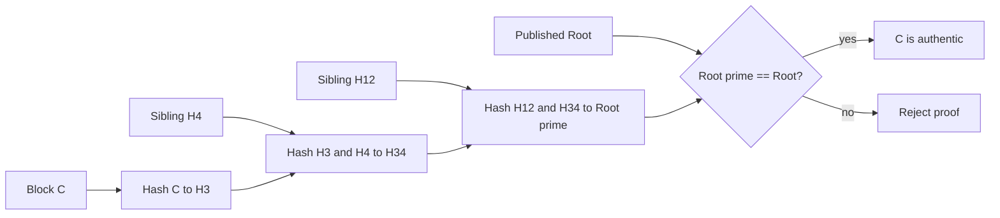

**How to calculate proof size:**

```text
Goal: estimate bandwidth and storage for Merkle proofs in a sync or blockchain protocol
      before choosing block/chunk size.

Given:  N = 1,048,576 leaf blocks (= 2^20)

Step 1 — tree height:
  height = log₂(N) = 20 levels
  WHY: a balanced binary tree halves the leaf count at each level — height is log₂ of leaf count.

Step 2 — hashes in one proof:
  one sibling per level → 20 hashes
  WHY: the verifier already has the leaf block; each ancestor needs exactly one sibling hash to recompute upward.

Step 3 — bytes (SHA-256):
  20 × 32 bytes = 640 bytes per proof
  WHY: SHA-256 outputs 32 bytes; proof size grows logarithmically — 1M leaves still fit in under 1 KB of proof data.

Result: one inclusion proof for any of 1,048,576 blocks ≈ 640 bytes (plus the block itself).

Interpretation / production meaning:
  Light clients (Ethereum, IPFS gateways) verify one transaction or chunk without downloading the full dataset.
  Cassandra repair exchanges roots first (32 bytes); only divergent subtrees trigger streaming — proof-sized slices, not full partitions.
  At N = 1 billion leaves, height ≈ 30 → proof ≈ 960 bytes — still tiny compared to the dataset.

Sanity check: N = 4 leaves → height 2 → proof needs H4 + H12 only (2 hashes), matching Step 5 walkthrough above.
```

---

#### Step 6 — What happens when data changes

Modify one byte in **block C**:

```text
H3  →  H3'   (leaf changes)

H34 →  H34'  (parent changes)

Root → Root' (root changes — entirely different hash)
```

Comparing **roots alone** detects tampering without reading every block. To find **which** block changed, exchange subtrees and bisect (Cassandra repair, sync protocols).

---

#### Complexity

| Operation | Complexity |
|-----------|------------|
| Build tree | O(n) |
| Verify one block (with proof) | O(log n) |
| Update one block | O(log n) hashes recomputed to root |
| Proof size | O(log n) hashes |
| Space | O(n) hashes stored (or O(1) root only if leaves kept elsewhere) |

---

### Variants worth knowing

| Variant | Use |
|---------|-----|
| **Merkle Patricia tree** | Ethereum state — trie + hashing |
| **Sparse Merkle tree** | Full key space for ZK proofs |

---

### Pitfalls and design tips

#### When to use (and when not to)

- **Use** when you need integrity checks, inclusion proofs, or efficient replica sync over large datasets (Git objects, Cassandra repair, Certificate Transparency, blockchains, IPFS MerkleDAG).
- **Use** when comparing two copies should start with one root hash, then bisect only divergent subtrees.
- **Do not use** as a general key-value index — Merkle trees prove membership at a root, not arbitrary key lookup; pair with a separate index if needed.
- **Do not use** when data changes constantly on hot paths without batching — each leaf update recomputes O(log n) ancestors up to the root.

#### Common mistakes

- **Reversing hash concatenation order** — `hash(left || right)` vs `hash(right || left)` must be fixed everywhere; Bitcoin and Git each define a canonical order — mixed implementations produce different roots for identical data.
- **Inconsistent odd-leaf handling** — duplicate the last leaf or promote it unpaired, but all builders and verifiers must use the **same rule** or roots will never match.
- **Confusing Merkle tree with flat `hash(entire_file)`** — a single file hash detects tampering but cannot prove one block or localize which range changed without rehashing everything.
- **Underestimating rebuild cost** — one hot leaf update walks O(log n) parents; batch writes or background rebuilds avoid rewriting the tree on every request.

#### Production notes

- **Git:** commit objects are Merkle trees of blobs and subtrees — `git diff` and shallow clone rely on root/subtree hashes, not full file compares.
- **Cassandra:** anti-entropy repair builds per-partition Merkle trees; root mismatch triggers subtree bisect and targeted SSTable streaming.
- **IPFS / Bitcoin / Ethereum:** content-addressed blocks and block headers carry Merkle roots; light clients verify inclusion with O(log n) proofs.
- **Interview angle:** exchanging replica roots localizes differing subtrees — binary search on the dataset instead of a full table scan.

---

### Real-world example: Cassandra anti-entropy repair

**Problem:** A Cassandra cluster holds terabytes across replicas. Network blips, missed writes, or disk errors can leave two replicas with different row sets for the same partition — silent data drift.

**Naive failure:** Compare every row on Replica A against Replica B — O(n) network and CPU per partition, impractical for large tables and frequent repair jobs.

**How the algorithm fixed it:** **Anti-entropy repair** builds a **Merkle tree** over each partition's rows on both replicas, then:

```text
1. Replica A and Replica B each build a Merkle tree over the same partition's rows
2. Exchange root hashes (32 bytes each)
   → roots match?  partition is in sync — done
   → roots differ? walk tree level by level to find divergent sub-ranges
3. Stream only the differing SSTable ranges from the up-to-date replica
```

**Outcome:** Most partitions resolve in one round-trip (matching roots). Divergent partitions sync only the minimal byte ranges — not full table copies — keeping repair bandwidth proportional to **actual drift**, not table size.

---


<a id="137-distributed-hash-tables"></a>

## 13.7 Distributed Hash Tables

### Overview

Picture a peer-to-peer network with no central phone book listing which machine stores which file. When you ask for a key, every peer must know how to forward the request toward the right owner — among thousands of machines — without querying a single master server.

A **Distributed Hash Table (DHT)** places both nodes and keys on the same **logical hash ring** via **consistent hashing**. `put(key)` and `get(key)` hash the key to a ring position, find the **clockwise successor** node that owns that segment, and route the request there. Structured DHTs such as **Chord** and **Kademlia** maintain **routing tables** (finger tables / k-buckets) so lookup takes **O(log N)** hops instead of walking the ring node by node. Cassandra, Dynamo, BitTorrent DHT, and IPFS all build on this idea.

---

### What problem it fixes

Centralized key-value stores hit limits:

- Single point of failure
- Bottleneck under load
- Cannot scale storage horizontally

Naive `hash(key) % N` reshuffles almost all keys when N changes — breaking caches and overloading nodes during cluster resize.

---

### What it does

Provides a **decentralized** key-value abstraction:

```text
put(key, value)  →  hash(key)  →  route to owner node  →  store
get(key)         →  hash(key)  →  route to owner node  →  return
```

No central coordinator for lookup routing (though production systems like Cassandra add ops tooling on top of the same ring idea).

---

### Compared to the alternative

**Centralized HashMap (single server):**

```text
Server

Apple  → Red
Banana → Yellow
Mango  → Green
Orange → Orange

Problems: limited storage, single point of failure, cannot scale horizontally
```

**Distributed Hash Table:**

```text
        Node A
       /      \
   Node D ---- Node B
       \      /
        Node C

Each node stores only keys that hash to its ring segment
```

| | `hash(key) % N` (naive sharding) | Consistent hashing (DHT ring) |
|---|----------------------------------|-------------------------------|
| Add one node | Almost **every** key remaps | Only **~K/N** keys move |
| Lookup | O(1) to known shard | O(log N) hops (structured DHT) |
| Coordinator | Often needed for shard map | Routing table on each peer |

DHT wins for **horizontal scale-out** and **peer-to-peer** systems. Central KV wins for **simplicity** and **strong consistency** on a small cluster.

---

### How it works — the algorithm inside

#### Step 1 — Hash the key

Map every key into a large integer space (same range as node IDs):

```text
Apple   → 23
Banana  → 67
Orange  → 91
Mango   → 40
```

The hash determines **where** on the ring the key belongs — not which machine by name.

---

#### Step 2 — Place nodes on the hash ring

Each node gets an ID on the same ring (hash of hostname/IP or assigned token):

```text
Node A → 20
Node B → 45
Node C → 70
Node D → 95
```

Arrange clockwise on a **hash ring** (conceptually 0 … 2^160−1 for SHA-1-style rings):

```text
          20 (A)
        /        \
   95 (D)        45 (B)
        \        /
          70 (C)
```

---

#### Step 3 — Assign keys to the successor node

Store each key on the **first node clockwise** whose ID is **≥ key hash** (the **successor**). Wrap around: if the hash is past the last node, the first node owns it.

**Apple** (hash 23): between 20 (A) and 45 (B) → **Node B**

```text
20 (A)  →  23  →  45 (B)     owner = B
```

**Orange** (hash 91): between 70 (C) and 95 (D) → **Node D**

```text
70 (C)  →  91  →  95 (D)     owner = D
```

```text
function owner(key):
    h = hash(key)
    return first node on ring where node.id >= h   // clockwise, wrap at end
```


---

#### Step 4 — Retrieve a key

Same rule as insert — no central directory:

```text
get("Apple"):
  h = 23
  start at any node → route clockwise → land on Node B → return value
```

Structured DHTs (**Chord**, **Kademlia**) use **routing tables** (finger table / k-buckets) so each hop skips many nodes — **O(log N)** hops instead of walking the ring one node at a time.

```text
Chord:  node stores fingers to successors at +1, +2, +4, +8, … on the ring
Kademlia:  XOR distance buckets — used in BitTorrent DHT, IPFS, Ethereum peer discovery
```

---

#### Worked example — four keys on four nodes

```text
Nodes:  20(A)   45(B)   70(C)   95(D)

Keys:   Apple→23   Mango→40   Banana→67   Orange→91

Assignment:
  Apple   → B   (23 ∈ (20, 45])
  Mango   → B   (40 ∈ (20, 45])
  Banana  → C   (67 ∈ (45, 70])
  Orange  → D   (91 ∈ (70, 95])
```

Each physical node holds only its segment's key-value pairs.

---

#### Step 5 — New node joins

Add **Node E** at ID **60**:

```text
Before:  20(A) — 45(B) — 70(C) — 95(D)

After:   20(A) — 45(B) — 60(E) — 70(C) — 95(D)
```

Only keys that hashed into the range now owned by **E** — roughly **(45, 60]** — migrate from B to E. Keys on A, C, D stay put.

```text
Before:  45(B) ----------------> 70(C)
After:   45(B) ----> 60(E) ----> 70(C)
```

**How to calculate keys moved on join:**

```text
Goal: estimate data migration time and network load when scaling a DHT cluster by one node.

Given:  K = total keys on ring,  N = nodes before join = 4

Step 1 — keys migrating to new node:
  migrating ≈ K / N   (one ring segment of width ~1/N)
  WHY: consistent hashing assigns each key to the clockwise successor; a new node splits exactly one segment.

Step 2 — example with storage:
  400 GB total, add 5th node → new node receives ~400/4 = ~100 GB
  WHY: with uniform hash distribution, each of N segments holds ~1/N of keys; the newcomer takes one segment.

Step 3 — existing nodes' give-up share (rough):
  each drops from ~K/N to ~K/(N+1) → per-node migration ≈ K/(N×(N+1))
  WHY: only keys in the new segment move; other segments shrink slightly as the ring divides into more pieces.

Result: add 1 node to a 4-node ring → ~25% of data streams to the newcomer; ~8% leaves each existing node.

Interpretation / production meaning:
  Cassandra streams partitions in the background during scale-out — plan link bandwidth for ~K/N bytes.
  vnodes (256 tokens/host) smooth skew but do not change the ~K/N order of magnitude.
  naive hash(key) % N would remap ~100% of keys — cache invalidation storm and overload.

Sanity check: 4 nodes → 1 new node ≈ 25% migration matches "each owned 33%, now 25%" intuition.
```

---

#### Step 6 — Node failure and replication

If **Node C** (70) fails, its keys are served by the **next clockwise** node (D at 95) until C returns or data is re-replicated.

Production DHTs store **replicas** on the next **k** successors so one failure does not lose data:

```text
Primary: successor node
Replicas: next k nodes clockwise on the ring
```

**Virtual nodes (vnodes):** one physical host claims many ring positions (e.g. 256 tokens in Cassandra) so load stays balanced when key hashes are skewed.

---

#### Complexity

| Operation | Complexity |
|-----------|------------|
| Insert / search / delete (structured DHT) | O(log N) hops |
| Add / remove node | O(log N) routing update + **~K/N** key migration |
| Space per node | O(K/N) keys (+ replicas) |

**How to calculate — lookup hop count (Chord / Kademlia):**

```text
Goal: bound lookup latency and message count for a structured DHT before choosing Chord vs Kademlia.

Given:  N = 1,024 nodes on the ring
        Finger table / k-buckets route at distances 2^i (Chord) or XOR buckets (Kademlia)

Step 1 — worst-case hops:
  hops ≈ log₂(N) = log₂(1024) = 10
  WHY: each finger hop at least halves remaining ring distance — same doubling argument as binary search.

Step 2 — trace (simplified Chord):
  Start node 10, key hashes to ID 900
  Hop 1: finger to ≥ 10 + 2^9 = 522
  Hop 2: finger to ≥ 522 + 2^8 = 778
  … each hop halves remaining distance → ≤ 10 hops
  WHY: finger table stores exponentially spaced successors so you skip large gaps per hop.

Step 3 — at N = 1,000,000:
  hops ≈ log₂(1,000,000) ≈ 20
  WHY: hop count grows slowly with cluster size — million-node DHT still ~20 messages per lookup.

Step 4 — latency (rough):
  10 hops × 2 ms WAN RTT ≈ 20 ms routing overhead per get(key)
  same hops × 0.1 ms LAN ≈ 1 ms
  WHY: each hop is one peer-to-peer round trip; WAN dominates P2P DHT latency.

Result: 1,024-node DHT → ≤10 hops; 1M-node → ~20 hops — sub-linear in N.

Interpretation / production meaning:
  BitTorrent DHT and IPFS use Kademlia for peer/content discovery at internet scale.
  Cassandra client routing is O(1) to known replicas after gossip — the ring is for placement, not every client hop.
  Unstructured flooding is O(N) — unusable beyond small LANs.

Sanity check: log₂(1024)=10 and log₂(1M)≈20 — doubling nodes adds ~1 hop, not 2× hops.
```

Typically **eventual consistency** during join/leave — quorum protocols (Cassandra tunable consistency) sit on top of the ring.

---

### Pitfalls and design tips

#### When to use (and when not to)

- **Use** for horizontally scaled key-value storage, peer-to-peer content routing, and systems where nodes join/leave frequently (Cassandra, Dynamo, BitTorrent DHT, IPFS).
- **Use** when adding/removing nodes must move only **~K/N** keys — not reshuffle the entire keyspace.
- **Do not use** when you need strong consistency on a small fixed cluster — a centralized KV with explicit shard map is simpler.
- **Do not use** without **vnodes** on skewed workloads — a few physical nodes can own disproportionate ring ranges.

#### Common mistakes

- **Using `hash(key) % N` for elastic clusters** — every resize remaps ~100% of keys; breaks caches and overloads nodes during migration.
- **Ignoring hot spots** — one physical node with one ring token can own a huge key range; Cassandra commonly assigns **256 vnodes** per host.
- **Expecting instant consistency during churn** — reads during join/leave may miss or return stale values until routing tables stabilize.
- **Confusing Chord with Kademlia** — Chord uses numeric finger tables; **Kademlia** uses XOR distance + k-buckets, better for high peer churn (BitTorrent, IPFS).

#### Production notes

- **Cassandra / Dynamo / Riak:** token ring + vnodes + replication to next-k successors; tunable quorum on top.
- **BitTorrent DHT / IPFS / Ethereum:** Kademlia for peer and content discovery over the public internet.
- **Interview angle:** explain why only ~K/N keys move on join — ownership is clockwise successor on the ring, not modulo slot index.

---

### Real-world example: adding a node to a Cassandra ring

**Problem:** A 3-node Cassandra cluster runs out of disk; ops must add a 4th node without downtime or rebalancing the entire dataset.

**Naive failure:** `hash(partition_key) % 3` remaps to `% 4` on resize — nearly **every key** changes owner, triggering a full reshuffle, cache invalidation, and days of migration traffic.

**How the algorithm fixed it:** Cassandra places partitions on a **token ring** (consistent hashing with **vnodes**). Adding a 4th node:

```text
Before: 3 nodes → each owns ~33% of partitions
After:  4 nodes → each owns ~25% of partitions

New node takes one ring segment → receives ~25% of total data
Existing nodes each give up ~8% (33% → 25%)

Only ~K/N keys move — not a full reshuffle (unlike hash % N)
```

**Outcome:** Cassandra **streams** only the affected partition ranges to the new node in the background; reads and writes continue with tunable consistency. Scale-out completes in hours proportional to **one node's share** of data, not the full cluster size.

---


<a id="138-distributed-id-schemes"></a>

## 13.8 Distributed ID Schemes

### Overview

Imagine every phone app, API server, and batch job needing a unique label for a new user or order — but none of them can wait in line at one central counter. Auto-increment integers (`1, 2, 3…`) from a single database work until you shard, go offline, or merge two databases that both started counting at 1. You need IDs any machine can mint on its own, without leaking how many records you have.

A **UUID (Universally Unique Identifier)** is a fixed **128-bit** value (RFC 9562), usually shown as `550e8400-e29b-41d4-a716-446655440000`. **v4** fills most bits with cryptographic randomness — opaque and unguessable. **v7** puts a **48-bit millisecond timestamp** in the high bits so new IDs sort roughly by creation time, which keeps database indexes healthy. Store the raw 16 bytes as `BINARY(16)` in Postgres or MySQL; convert to the hyphenated hex string only at API boundaries.

---

### What problem it fixes

- **Central ID authority** — auto-increment requires one database to hand out the next integer
- **Cross-database collisions** — two shards both issuing `1, 2, 3…` cannot merge safely
- **Distributed generation** — microservices, mobile clients, and batch jobs need IDs before talking to a coordinator
- **Opaque identifiers** — random UUIDs do not reveal row count or creation order (v4)

---

### What it does

Mints a **128-bit globally unique identifier** on any machine:

```text
generate_uuid()  →  128 bits  →  optional string formatting (8-4-4-4-12 hex)
```

No registry lookup at generation time. Versions differ in how the 128 bits are filled (timestamp, randomness, MAC, hash).

---

### Compared to the alternative

**Auto-increment ID (single database):**

```text
Database

ID  Name
---------
1   Alice
2   Bob
3   Charlie

Problems: central bottleneck, collisions across shards, hard to merge replicas
```

**UUID (generated anywhere):**

```text
Alice   → 550e8400-e29b-41d4-a716-446655440000
Bob     → 7f4d8c9a-18b7-4e3d-bf66-9c3d4f8e1122
Charlie → a1d93d60-2f51-47e8-bf84-67c9c1ab4567

No coordinator — each machine mints its own ID
```

| | Auto-increment | UUID |
|---|----------------|------|
| Central database | Required | Not required |
| Order | Sequential | Random (v4) or time-ordered (v7) |
| Guessability | Easy (`user/42`) | Hard (opaque) |
| Merge distributed DBs | Painful | Natural |
| Index locality | Excellent | Poor for v4; good for v7 |
| Size | 4–8 bytes | 16 bytes |
| Best fit | Single DB, low volume | Microservices, distributed systems |

UUID wins when **many writers** need IDs **without coordination**. Auto-increment wins for **one database**, **compact numeric keys**, and **perfect B-tree locality**.

For **sortable** distributed IDs without a 128-bit string, see **13.9 Snowflake**, **13.10 ULID**, and **13.11 KSUID**.

---

### How it works — the algorithm inside

#### Step 1 — 128-bit layout and string format

A UUID is **128 bits (16 bytes)**. Canonical display: **32 hex digits** in groups **8-4-4-4-12**:

```text
550e8400-e29b-41d4-a716-446655440000

550e8400 | e29b | 41d4 | a716 | 446655440000
   8        4      4      4         12
```

Bits 48–51 encode the **version**; bits 64–65 encode the **variant** (RFC 9562).

---

#### Step 2 — Pick a version

Different versions fill the 128 bits differently. The ones you will see in production:

| Version | How bits are filled |
|---------|---------------------|
| **v1** | Timestamp + MAC address + clock sequence |
| **v4** | 122 random bits |
| **v7** | 48-bit Unix ms timestamp + random suffix |

---

#### Step 3 — UUID v1 (timestamp + machine)

```text
Current timestamp
+ Machine ID (often MAC)
+ Clock sequence (uniqueness if clock repeats)

↓ pack into 128 bits, set version = 1

UUID v1
```

Mostly time-ordered; very low collision rate when clocks are sane. **Downside:** leaks creation time and can expose hardware identity — avoid for client-visible IDs.

---

#### Step 4 — UUID v4 (random)

Most widely deployed. **122 bits** are cryptographically random; version and variant nibbles are fixed:

```text
function uuid_v4():
    bits = 122 random bits
    set version nibble = 4
    set variant bits per RFC 9562
    return format as 8-4-4-4-12 hex string
```

Simple, no machine metadata, no timestamp leakage. **Downside:** random insert order hurts clustered B-tree indexes on primary keys.

---

#### Step 5 — UUID v7 (time-ordered)

RFC 9562 **v7** puts a **48-bit millisecond timestamp** in the high bits and fills the rest with randomness:

```text
function uuid_v7():
    timestamp_ms = 48 bits (Unix ms)
    random_suffix = remaining bits
    set version = 7
    return format as hex string
```

```text
2026-06-26 10:30:00.123  +  random bits  →  UUID v7 (sortable by creation time)
```

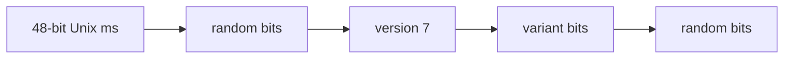

Better index locality than v4; still no central coordinator. **Default for new database primary keys** when you want UUID semantics.

---

#### Worked example — three servers, no coordination

```text
Server A  →  550e8400-e29b-41d4-a716-446655440000
Server B  →  9e6b87d0-7b82-4e8b-b93d-c53d76f0c221
Server C  →  f85d42e9-5f90-4cb4-9b11-78efec2b8815
```

All three mint user IDs at the same instant — no shared counter — and collisions are negligible.

---

#### Why collisions are ignored (v4)

UUID v4 exposes **122 random bits**:

```text
Possible values ≈ 2^122 ≈ 5.3 × 10^36
```

**How to calculate — UUID v4 collision odds (birthday bound):**

```text
Goal:  Decide whether random UUID collisions are a real production risk,
       or a theoretical worry you can ignore when choosing v4.

Given:  UUID v4 has 122 random bits (RFC 9562)
        Generate n IDs, ask P(at least one collision)

Step 1 — approximate collision probability (birthday paradox):
  WHY:  collisions depend on pairs of IDs, not individual draws — n² growth
  P(collision) ≈ 1 − e^(−n² / (2 × 2^122))
  Space size M = 2^122 ≈ 5.3 × 10^36

Step 2 — n = 1 billion IDs (10^9):
  WHY:  10^9 is a large but realistic lifetime row count for a big product
  n² = 10^18
  n² / (2M) ≈ 10^18 / (2 × 5.3 × 10^36) ≈ 9.4 × 10^−19
  P(collision) ≈ negligible (≈ 10^−18)

Step 3 — n = 1 trillion IDs (10^12) — extreme lifetime:
  WHY:  stress-test the math at an absurd scale
  n² = 10^24
  P(collision) ≈ 10^24 / (2 × 5.3 × 10^36) ≈ 9 × 10^−14  →  still negligible

Step 4 — rule of thumb (50% collision chance):
  WHY:  interview shorthand for "how big before collisions matter?"
  Need n ≈ √(2M × ln 2) ≈ 2.71 × 10^18 IDs — billions of billions

Result: for any realistic system (< 10^12 IDs), v4 collision risk is ignored;
        choose v7 for sortable PKs, not collision fear.

Interpretation: ops teams should audit duplicate-generation bugs (retry logic,
                shared seeds), not worry about birthday collisions on v4.

Sanity check: if you generate 1 billion IDs/sec for 100 years you still won't
              approach the birthday threshold.
```

---

#### Complexity

| Operation | Complexity |
|-----------|------------|
| Generate UUID | O(1) |
| Compare UUIDs | O(1) |
| Storage | 16 bytes (`BINARY(16)`) |

---

### Pitfalls and design tips

#### When to use (and when not to)

| Version | Best for |
|---------|----------|
| **v1** | Legacy systems that already depend on timestamp ordering — avoid for new public IDs (MAC leak) |
| **v4** | Opaque tokens — request IDs, session IDs, correlation IDs |
| **v7** | **Modern DB primary keys** — time-sortable without a central allocator |
| **v3/v5** | Deterministic IDs from namespace + name (idempotent imports) |

- **Default for new systems:** **UUID v7** (RFC 9562) unless you need 64-bit numeric IDs (Snowflake, §13.9) or URL-safe strings (ULID, §13.10).
- **Skip UUID as PK** when a single auto-increment database is enough — 16-byte keys and string APIs add cost you do not need.
- **Prefer Snowflake or ULID** when you need compact 64-bit integers or lexicographically sortable URL strings without RFC UUID semantics.

#### Common mistakes

- **Storing `CHAR(36)` instead of `BINARY(16)`** — wastes ~2× storage and slows B-tree comparisons; Postgres `uuid` type or `BINARY(16)` is the norm.
- **Using v4 for primary keys** — random insert order fragments clustered indexes; inserts scatter across index pages and inflate write amplification.
- **Expecting v3/v5 to be random** — same namespace + name always yields the same UUID; fine for idempotent imports, dangerous for security tokens.
- **Using v1 for client-visible IDs** — leaks MAC address and precise creation time; privacy risk in public APIs.
- **Treating Nil UUID as impossible** — `00000000-0000-0000-0000-000000000000` is a valid sentinel; guard against it in validation.

#### Production notes

- **Libraries:** `uuid` (npm), `google/uuid` (Go), Python `uuid` stdlib, Postgres native `uuid` / `gen_random_uuid()` — v7 support landed in RFC 9562 (2024); verify your runtime version.
- **API boundaries:** store binary internally; expose canonical hyphenated hex in JSON; accept both forms on input with explicit parsing.
- **Index design:** v7 PKs pair well with clustered/primary indexes; range scans on `created_at` can often use ID ordering as a proxy when timestamps align.
- **Tracing:** `X-Request-ID: uuid_v4()` remains the default — opaque, no sort requirement, no timestamp leakage across services.

---

### Real-world example: Postgres primary keys at scale

**Problem:** A multi-service e-commerce platform shards users and orders across Postgres replicas. Each service needs to create rows without calling a central ID server.

**Naive failure:** The team used **UUID v4** primary keys stored as `CHAR(36)`. Inserts were random across the B-tree — page splits spiked, autovacuum pressure rose, and `ORDER BY id` did not approximate creation order. A separate `SERIAL` per shard caused duplicate `user_id = 1` when replicas merged.

**How UUID v7 fixed it:** Each service calls `uuid_v7()` locally. High bits carry millisecond timestamp, so new rows land at the "end" of the clustered primary index. Postgres stores `user_id` and `order_id` as native `uuid` type (16 bytes); JSON APIs expose `"018f3e12-..."`. Request tracing still uses **v4** (`X-Request-ID`) where sort order does not matter.

**Outcome:** No central ID bottleneck, safe cross-shard merges, and write-heavy tables regain sequential insert locality. Storage dropped from 36-byte strings to 16-byte binary per key.

---


### Snowflake IDs

#### Overview

Picture a factory line where every machine stamps its own serial number: a timestamp for when the item was made, a plant code, a machine number, and a small counter for items made in the same millisecond. No central clerk hands out the next integer — that is how Twitter scaled tweet IDs across thousands of servers without a single ID database bottleneck.

**Snowflake ID** is a **64-bit** integer scheme (originally from **Twitter**) that packs **41-bit millisecond timestamp + 5-bit datacenter + 5-bit worker + 12-bit sequence** into one `BIGINT`. Each worker can mint up to **4,096 IDs per millisecond** (~4M/sec theoretical max). IDs sort as integers ≈ sort by creation time, which keeps B-tree indexes sequential. Trade-off: every generator needs a **unique worker ID** from a registry, and clocks must stay sane via **NTP**.

---

#### What problem it fixes

- **Central ID bottleneck** — auto-increment needs one database to issue the next integer
- **Independent generation** — each app server must mint IDs without a round-trip
- **Sortable numeric PKs** — smaller than 128-bit UUID, better index locality than random UUID v4
- **Horizontal scale** — thousands of writers across datacenters without ID collisions

---

#### What it does

Generates a unique, roughly time-sorted **int64** on each machine:

```text
snowflake_id()  →  pack(timestamp_ms, datacenter_id, worker_id, sequence)  →  64-bit integer
```

IDs increase with creation time (within millisecond precision). The high bits reveal approximate creation time.

---

#### Compared to the alternative

**Auto-increment ID (single database):**

```text
Database

ID  User
--------
1   Alice
2   Bob
3   Charlie

Problems: central coordinator, cannot scale writers across shards, merge pain
```

**Snowflake ID (each server generates independently):**

```text
Server A  →  195648239482934272
Server B  →  195648239482934273
Server C  →  195648239482934274

Globally unique, time-ordered, no central ID database
```

| | Auto-increment | UUID v4 | Snowflake ID |
|---|----------------|---------|--------------|
| Distributed | No | Yes | Yes |
| Time-ordered | Yes | No | Yes (ms) |
| Central server | Required | Not required | Not required (worker registry only) |
| Storage | 4–8 bytes | 16 bytes | 8 bytes |
| Index locality | Excellent | Poor (random) | Excellent |
| Coordination | DB sequence | None | Unique worker/datacenter IDs |
| Clock dependency | No | No (v4) | Yes (NTP) |

Snowflake wins for **high-throughput**, **sortable 64-bit** primary keys in distributed systems. UUID v7 (§13.8) wins when you need **RFC-standard 128-bit** IDs without worker registration. Auto-increment wins on a **single database** with **no clock coordination**.

---

#### How it works — the algorithm inside

#### Step 1 — 64-bit layout

A Snowflake ID uses **64 bits** (1 sign bit reserved, 63 payload bits):

```text
+----------+-----------+------------+--------------+
| Timestamp| Datacenter| Worker ID  | Sequence No. |
+----------+-----------+------------+--------------+
     41          5            5             12

41 + 5 + 5 + 12 = 63 bits  (+ 1 sign bit = 64 bits total)
```

| Field | Bits | Purpose |
|-------|------|---------|
| Timestamp | 41 | Milliseconds since custom epoch (Twitter: 2010-11-04) |
| Datacenter ID | 5 | Up to 32 datacenters |
| Worker ID | 5 | Up to 32 machines per datacenter |
| Sequence | 12 | Counter within the same millisecond on this worker |

Packed as:

```text
id = (timestamp << 22) | (datacenter_id << 17) | (worker_id << 12) | sequence
```

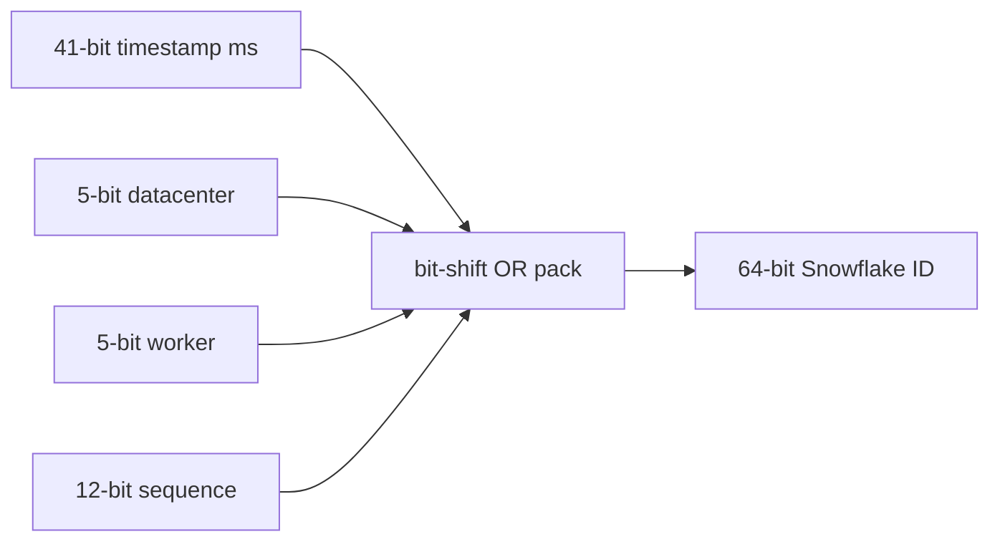

---

#### Step 2 — Current timestamp

Read **current time in milliseconds** (relative to the chosen epoch) and place it in the high 41 bits:

```text
2026-06-26 10:30:15.123  →  timestamp bits (ms since epoch)
```

This makes IDs **sortable by creation time** when compared as integers.

---

#### Step 3 — Datacenter ID

Each datacenter gets a fixed ID assigned at deploy time:

```text
US-East  → 1
Europe   → 2
India    → 3
```

Prevents collisions when two regions generate IDs at the same millisecond with the same worker slot number.

---

#### Step 4 — Worker ID

Each server inside a datacenter gets a **unique worker ID** from a registry (ZooKeeper, etcd, config):

```text
Server 1 → Worker 0
Server 2 → Worker 1
Server 3 → Worker 2
```

Different workers at the same millisecond still produce different IDs.

---

#### Step 5 — Sequence number

If multiple IDs are generated in the **same millisecond** on the same worker, increment a **12-bit sequence**:

```text
1st ID in this ms  →  sequence = 0
2nd ID             →  sequence = 1
3rd ID             →  sequence = 2
```

```text
2^12 = 4,096 IDs per millisecond per worker (theoretical max)
```

When the sequence hits **4095** and another ID is needed in the same ms → **wait for the next millisecond**, then reset sequence to **0**.

---

#### Worked example — pack the fields

```text
Timestamp (ms)     = 100001
Datacenter ID      = 3
Worker ID          = 5
Sequence           = 17

Pack:  timestamp | datacenter | worker | sequence
  →  Snowflake ID  195648239482934272  (illustrative composite)
```

Uniqueness comes from the tuple `(timestamp, datacenter, worker, sequence)` — no two generators with distinct worker IDs can collide if clocks and registry are correct.

---

#### Example timeline — same millisecond burst

Server A generating IDs:

```text
10:00:00.001  sequence = 0  →  ID …001
10:00:00.001  sequence = 1  →  ID …002
10:00:00.001  sequence = 2  →  ID …003

10:00:00.002  sequence resets to 0  →  ID …004
```

IDs stay unique and monotonically increasing within a single worker (until clock skew).

---

#### Step 6 — Generation loop

```text
now = currentTimeMs()
if now < lastTimestamp:
    wait until now >= lastTimestamp     // clock went backward — do not emit
if now == lastTimestamp:
    sequence = (sequence + 1) & 4095
    if sequence == 0:
        wait until next millisecond     // 4096 IDs already used this ms
else:
    sequence = 0
lastTimestamp = now
return pack(timestamp, datacenter_id, worker_id, sequence)
```

Even if two servers share the same millisecond:

- Different **worker** or **datacenter** → different ID
- Same worker, same ms → **sequence** distinguishes them

**How to calculate throughput per worker:**

```text
Goal:  Size worker fleet and detect when sequence rollover will stall a hot generator.

Given:  sequence field = 12 bits

Step 1 — max IDs per millisecond per worker:
  WHY:  sequence is the only differentiator when timestamp + worker are fixed
  2^12 = 4,096

Step 2 — theoretical max per second per worker:
  WHY:  multiply per-ms ceiling by 1,000 ms in a second
  4,096 × 1,000 ms = 4,096,000 IDs/sec

Step 3 — if burst exceeds 4,096/ms:
  WHY:  sequence wraps to 0 only on the next millisecond — generator must block
  generator blocks until the next millisecond (sequence reset)

Result: plan worker count so per-node rate stays under ~4M IDs/sec;
        split hot paths across workers if you approach the ceiling.

Interpretation: Twitter/Discord-scale chat rarely hits 4M IDs/sec per node;
                production incidents come from duplicate worker IDs or clock skew,
                not sequence exhaustion.

Sanity check: 4,096/ms is enormous for most APIs — if you need more,
              add workers with distinct IDs, do not widen sequence without a new scheme.
```

---

#### Complexity

| Operation | Complexity |
|-----------|------------|
| Generate ID | O(1) |
| Compare IDs | O(1) |
| Storage | 8 bytes (`BIGINT`) |

---

#### Pitfalls and design tips

#### When to use (and when not to)

- **Use Snowflake** when you need **compact 64-bit sortable integers** at high throughput and can operate a worker ID registry.
- **Prefer UUID v7** (§13.8) when you want **no worker coordination** and RFC-standard 128-bit IDs.
- **Stick with auto-increment** on a single database when coordination cost outweighs distributed benefits.
- **Open-source variants:** Twitter Snowflake (archived), **Sonyflake**, **Baidu uid-generator**, Instagram’s custom layouts — same bit-packing idea, different field widths.

#### Common mistakes

- **Skipping the worker ID registry** — duplicate `(datacenter_id, worker_id)` at the same millisecond risks real collisions.
- **Emitting IDs when the clock steps backward** — NTP corrections can make `now < lastTimestamp`; must block or spin, never emit regressed timestamps.
- **Ignoring custom epoch and overflow** — 41-bit ms timestamps eventually wrap; know your epoch and overflow year per variant.
- **Treating Snowflake as gapless** — deleted rows leave holes; ID order ≠ contiguous row count.
- **Passing IDs as JSON numbers in JavaScript** — values above 2^53 lose precision; always use strings in browser APIs (Discord does this).

#### Production notes

- **Worker registry:** ZooKeeper, etcd, Kubernetes StatefulSet ordinal, or cloud instance metadata — assign `(datacenter_id, worker_id)` at deploy time.
- **Clock sync:** run NTP/chrony on every generator host; alert on large clock drift between nodes.
- **Sequence rollover:** at 4,096 IDs in one ms, the generator thread blocks until the next ms — monitor p99 ID latency on hot paths.
- **Storage:** `BIGINT` (8 bytes) in MySQL/Postgres; index as integer for best locality.

---

#### Real-world example: Twitter tweets and Discord messages

**Problem:** Twitter needed every tweet to get a unique ID from any app server worldwide, with feeds sortable by post time — without a central database issuing the next integer on every write. Discord faced the same pattern for billions of chat messages.

**Naive failure:** A global `AUTO_INCREMENT` on one MySQL master became a write bottleneck and single point of failure. Sharded auto-increment per region produced overlapping IDs that could not merge. Random UUID v4 fixed uniqueness but broke "sort by ID ≈ sort by time" for timeline queries.

**How Snowflake fixed it:** Twitter's open-sourced layout packs **41-bit ms timestamp + datacenter + worker + 12-bit sequence** into one 64-bit integer. Each machine gets a unique worker ID from a registry; IDs increase with creation time. **Discord** adopted the same pattern — message IDs encode timestamp in the high bits; APIs expose them as **strings** (`"195648239482934272"`) because JavaScript `Number` loses precision above 2^53.

**Outcome:** No per-write round-trip to an ID server, timeline and chat history sort by numeric ID, and `BIGINT` primary keys stay B-tree friendly. Operational cost shifted to **worker ID assignment** and **NTP discipline** — the trade Twitter and Discord accepted for 8-byte sortable keys.

---


### ULID

#### Overview

You want IDs that sort like timestamps when written as strings — useful in URLs, logs, and databases — but UUID v4 is random gibberish that scatters index pages. You also do not want to register worker IDs like Snowflake requires.

Technically, **ULID (Universally Unique Lexicographically Sortable Identifier)** is **128 bits**: **48-bit millisecond timestamp + 80-bit random**, encoded as **26-character Crockford Base32** (`01JZB5ZQXK9T6F1M8Q2YV3A7RW`). Lexicographic string sort ≈ creation-time sort. Same size as UUID, shorter string, case-insensitive, URL-safe.

---

#### What problem it fixes

- **Random UUID v4 order** — opaque hex strings do not sort by creation time; B-tree indexes fragment on insert
- **Snowflake worker registry** — ULID needs no datacenter/worker ID coordination
- **Human-readable IDs** — 26-char Base32 vs 36-char hex UUID with hyphens
- **Distributed generation** — any service can mint IDs offline with only a clock and CSPRNG

---

#### What it does

Mints a **128-bit globally unique identifier** and renders it as a **sortable 26-character string**:

```text
ulid()  →  combine(timestamp_ms_48, random_80)  →  crockford_base32_encode()  →  26 chars
```

Plain ULIDs are ordered by millisecond; **monotonic ULID** factories increment the random tail within the same ms on one process.

---

#### Compared to the alternative

**UUID v4 (random hex):**

```text
550e8400-e29b-41d4-a716-446655440000
7f4d8c9a-18b7-4e3d-bf66-9c3d4f8e1122
1c9d34e0-6f1b-4c9e-91c4-a7d56d9e2134

Problems: random order, poor index locality, cannot sort by creation time as strings
```

**ULID (time-first Base32):**

```text
01JZB5ZQXK9T6F1M8Q2YV3A7RW
01JZB5ZR3N8W2J5B1T4D9M6QPX
01JZB5ZR8P4V7C2Y9K1N6F5WGH

Globally unique, lexicographically sortable, URL-friendly
```

| | UUID v4 | Snowflake ID | ULID |
|---|---------|--------------|------|
| Distributed | Yes | Yes | Yes |
| Time-ordered | No | Yes (ms) | Yes (ms) |
| Size | 16 bytes | 8 bytes | 16 bytes |
| Human-readable | No (hex + hyphens) | No (int64) | Yes (26-char Base32) |
| Worker IDs needed | No | Yes | No |
| Index locality | Poor | Excellent | Good |
| String sortable | No | N/A (integer) | Yes |

ULID wins for **sortable string IDs** without worker coordination. Snowflake wins for **compact 64-bit integers** at extreme throughput. **UUID v7** (§13.8) wins when you need **RFC-standard** binary UUIDs in the same ecosystem as v4.

---

#### How it works — the algorithm inside

#### Step 1 — 128-bit layout

```text
+----------------------+------------------------------+
| Timestamp (48 bits)  | Randomness (80 bits)         |
+----------------------+------------------------------+

48 + 80 = 128 bits
```

| Field | Bits | Purpose |
|-------|------|---------|
| Timestamp | 48 | Milliseconds since Unix epoch |
| Random | 80 | Cryptographic randomness for uniqueness |

Displayed as **26 Crockford Base32 characters** (no `I`, `L`, `O`, `U`):

```text
01JZB5ZQXK9T6F1M8Q2YV3A7RW
```

Store **`BINARY(16)`** internally; render Base32 at API boundaries.

---

#### Step 2 — Current timestamp

Place **current time in milliseconds** in the high 48 bits:

```text
2026-06-26 10:30:15.123  →  48-bit timestamp field
```

Newer ULIDs sort **after** older ones when compared as strings (timestamp dominates the encoding).

---

#### Step 3 — Generate random bits

Fill the remaining **80 bits** from a cryptographically secure random source:

```text
CSPRNG  →  80 random bits  →  ensures uniqueness within the same millisecond
```

---

#### Step 4 — Combine and encode

```text
function ulid():
    timestamp_ms = 48 bits (Unix epoch)
    random = 80 cryptographically secure bits
    value = combine(timestamp_ms, random)    // 128-bit integer
    return crockford_base32_encode(value)    // 26 chars
```

```text
Timestamp + Random Bits  →  128-bit ULID  →  01JZB5ZQXK9T6F1M8Q2YV3A7RW
```

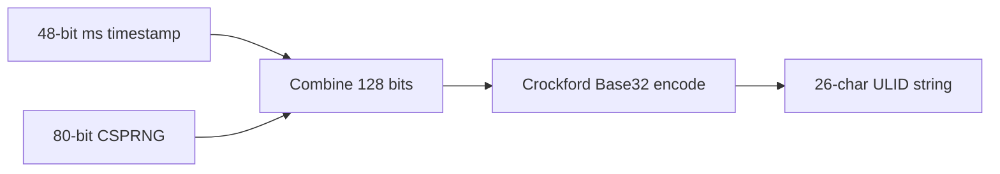

---

#### Worked example

```text
Timestamp:   2026-06-26 10:30:15.123  →  48-bit ms field
Random:      100110101001...         →  80 bits from CSPRNG

Final ULID:  01JZB5ZQXK9T6F1M8Q2YV3A7RW
```

---

#### Sorting example — string order = time order

```text
10:00:00.000  →  01JZB5ZQ...
10:00:01.000  →  01JZB5ZR...
10:00:02.000  →  01JZB5ZS...

Lexicographic sort:
  01JZB5ZQ...
  01JZB5ZR...
  01JZB5ZS...
```

Creation order is preserved without a separate `created_at` column for range scans (approximate time windows via ID prefix).

---

#### Monotonic ULID — same millisecond ordering

Plain ULIDs in the **same millisecond** are **not** strictly ordered (random tail). A **monotonic factory** on one process **increments** the random portion instead of re-rolling:

```text
10:00:00.001  →  01JZB5ZQ...001
10:00:00.001  →  01JZB5ZQ...002
10:00:00.001  →  01JZB5ZQ...003
```

Guarantees strict sort order within the same ms on that single generator.

---

#### Why ULIDs are unique

Uniqueness = **timestamp (48 bits) + random (80 bits)**. Two IDs in the same millisecond differ in the 80-bit tail; collision probability is negligible for practical systems (similar spirit to UUID v4 birthday math on 80 bits).

**How to calculate — ULID collision odds (same millisecond):**

```text
Goal:  Decide if 80-bit random per millisecond is enough at your peak QPS.

Given:  80 random bits per ULID when two generators share the same ms
        n ULIDs generated in the same millisecond (worst case: one ms burst)

Step 1 — collision space per ms bucket:
  WHY:  timestamp is identical within the ms — only 80 bits differ
  M = 2^80 ≈ 1.2 × 10^24

Step 2 — birthday bound for n IDs in one ms:
  WHY:  pairs grow as n² — relevant when many writers share the same ms
  P(collision) ≈ n² / (2 × 2^80)

Step 3 — n = 1 million IDs in one ms (extreme):
  n² = 10^12
  P(collision) ≈ 10^12 / (2 × 1.2 × 10^24) ≈ 4 × 10^−13  →  negligible

Result: even absurd single-ms bursts are safe; real risk is weak PRNG or clock collision,
        not 80-bit entropy exhaustion.

Interpretation: at 100K events/sec spread across processes, most ms buckets see
                dozens of IDs — 80 bits is ample; use monotonic factory for strict
                same-ms order on one process.

Sanity check: 2^80 per ms >> any realistic per-ms count; prefer KSUID (§13.11) only
              when you need 128-bit random per second bucket at extreme volume.
```

---

#### Complexity

| Operation | Complexity |
|-----------|------------|
| Generate ULID | O(1) |
| Compare ULIDs | O(1) |
| Storage | 16 bytes (`BINARY(16)`) |

---

#### Pitfalls and design tips

#### When to use (and when not to)

- **Use ULID** for **sortable string IDs** in URLs, logs, and APIs without worker-ID coordination.
- **Prefer UUID v7** (§13.8) when RFC-standard binary UUIDs must coexist with v4 in the same stack.
- **Prefer Snowflake** (§13.9) when you need **8-byte integers** and can manage a worker registry.
- **Prefer KSUID** (§13.11) when you need **128-bit random per second** at extreme event volume.

#### Common mistakes

- **Expecting strict order within the same millisecond across processes** — plain ULIDs randomize the 80-bit tail; only a **monotonic ULID factory** on one process increments the tail.
- **Mixing ULID and UUID strings in one sorted index** — lexicographic sort only works when encoding and length are consistent.
- **Using non-Crockford characters** — encoding excludes `I`, `L`, `O`, `U` to avoid transcription errors; validate on input.
- **Storing the 26-char string as the PK column** — wastes space; store `BINARY(16)` and render Base32 at API boundaries.

#### Production notes

- **Libraries:** `ulid` (npm), `oklog/ulid` (Go), `python-ulid` — store 16 raw bytes in Postgres `BYTEA` or `BINARY(16)`.
- **Monotonic factory:** increment random tail within same ms on a single generator for strict local ordering (useful for single-writer queues).
- **Range queries:** `WHERE event_id BETWEEN '01JZB5...' AND '01JZB6...'` approximates a time window without a dedicated `created_at` index on every shard.
- **Larger than Snowflake:** 16 bytes vs 8 — acceptable when string sortability matters more than integer compactness.

---

#### Real-world example: sortable event IDs in Postgres

**Problem:** An event-ingestion service writes millions of rows per day to Postgres. Operators want to scan recent events by ID range in logs and SQL without maintaining a separate time index on every partition. Snowflake's worker registry is overhead the team does not want.

**Naive failure:** **UUID v4** primary keys stored as hex strings sorted randomly — `ORDER BY event_id` did not approximate time order, B-tree inserts scattered across pages, and URL paths looked ugly (`550e8400-e29b-...`). A central Redis `INCR` for IDs became a hot spot during traffic spikes.

**How ULID fixed it:** Each publisher calls `ulid()` locally — **48-bit ms timestamp + 80-bit CSPRNG**, encoded as `01JZB5ZQXK9T6F1M8Q2YV3A7RW`. Postgres stores `event_id` as `BINARY(16)`; JSON APIs expose the 26-char Base32 string. Range queries like `WHERE event_id BETWEEN '01JZB5...' AND '01JZB6...'` approximate a time window without a dedicated `created_at` index on every shard.

**Outcome:** No coordinator, URL-safe IDs, and lexicographic sort ≈ creation order at millisecond granularity. Caveat retained: IDs in the **same millisecond** across processes are not strictly ordered unless a **monotonic ULID factory** increments the tail on a single writer.

---


### KSUID

#### Overview

Analytics pipelines can fire **thousands of events per second** into the same one-second time bucket. You want IDs that still sort roughly by time in URLs and log files, with enough randomness that collisions are unthinkable — but you do not need millisecond precision, and you do not want to assign worker IDs to every writer. ULID's 80 random bits per millisecond is usually enough; at extreme volume per second, more entropy per time bucket helps.

**KSUID (K-Sortable Unique Identifier)** — created at **Segment** — is **160 bits (20 bytes)**: **32-bit second timestamp + 128-bit random payload**, Base62-encoded as a **27-character string** (`35oN0vR5fM2Rj6R3K9Y7L2QJg4M`). Lexicographic sort works at **second** granularity; IDs within the same second order by random payload, not strict creation order. No central coordinator; larger than ULID/UUID but with the heaviest random tail of the string-sortable family.

---

#### What problem it fixes

- **Random UUID v4 order** — hex IDs do not sort by creation time; poor B-tree locality
- **ULID random tail size** — 80 bits per millisecond may be tight at extreme QPS in the same ms bucket
- **Snowflake coordination** — KSUID needs no worker/datacenter registry
- **Cross-service event IDs** — high-entropy, URL-safe strings for analytics and audit pipelines

---

#### What it does

Mints a **160-bit globally unique identifier** and renders it as a **sortable 27-character Base62 string**:

```text
ksuid()  →  combine(timestamp_sec_32, random_128)  →  base62_encode()  →  27 chars
```

Sortable at **second** granularity; order within the same second follows the random payload, not strict creation order.

---

#### Compared to the alternative

**UUID v4 (random hex):**

```text
550e8400-e29b-41d4-a716-446655440000
7f4d8c9a-18b7-4e3d-bf66-9c3d4f8e1122
1c9d34e0-6f1b-4c9e-91c4-a7d56d9e2134

Problems: random order, poor index locality, no embedded creation time
```

**KSUID (time-first Base62):**

```text
35oN0vR5fM2Rj6R3K9Y7L2QJg4M
35oN0vW2Bp1mA8N5P6Y4Q9DcJtZ
35oN0vY9Fk8Qx3M1W7R5L2PbGhN

Globally unique, lexicographically sortable, no central server
```

| | UUID v4 | ULID | KSUID | Snowflake |
|---|---------|------|-------|-----------|
| Distributed | Yes | Yes | Yes | Yes |
| Time-ordered | No | Yes (ms) | Yes (sec) | Yes (ms) |
| Size | 16 bytes | 16 bytes | 20 bytes | 8 bytes |
| Human-readable | No | Yes (Base32) | Yes (Base62) | No (int64) |
| Worker IDs needed | No | No | No | Yes |
| Random entropy | 122 bits | 80 bits | 128 bits | sequence field |
| Index locality | Poor | Good | Good | Excellent |

KSUID wins for **high-volume event streams** needing **128-bit randomness per second** without worker IDs. ULID (§13.10) wins for **millisecond** string sort. Snowflake (§13.9) wins for **compact 64-bit integers**. **UUID v7** (§13.8) wins for **RFC-standard** 128-bit binary IDs.

---

#### How it works — the algorithm inside

#### Step 1 — 160-bit layout

```text
+----------------------+--------------------------------+
| Timestamp (32 bits)  | Random Payload (128 bits)      |
+----------------------+--------------------------------+

32 + 128 = 160 bits (20 bytes)
```

| Field | Bits | Purpose |
|-------|------|---------|
| Timestamp | 32 | Seconds since custom epoch (Segment: 2014-05-13) |
| Payload | 128 | Cryptographic randomness for uniqueness |

Displayed as **27 Base62 characters** (`0-9`, `A-Z`, `a-z`):

```text
35oN0vR5fM2Rj6R3K9Y7L2QJg4M
```

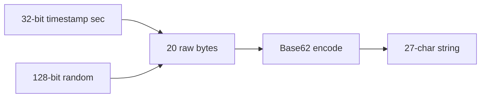

Store **20 raw bytes** internally; render Base62 at API boundaries.

---

#### Step 2 — Current timestamp

Place **current time in seconds** in the high 32 bits:

```text
2026-06-26 10:30:15  →  32-bit timestamp field
```

Newer KSUIDs sort **after** older ones when compared as strings (timestamp dominates the encoding). Precision is **one second** — not milliseconds.

---

#### Step 3 — Generate random payload

Fill **128 bits** from a cryptographically secure random source:

```text
CSPRNG  →  128 random bits  →  uniqueness when many IDs share the same second
```

Larger random space than ULID's 80-bit tail — important when thousands of events land in the same second.

---

#### Step 4 — Combine and encode

```text
function ksuid():
    timestamp_sec = 32 bits (seconds since KSUID epoch)
    payload = 128 cryptographically secure random bits
    raw = combine(timestamp_sec, payload)    // 20 bytes
    return base62_encode(raw)                  // 27 chars
```

```text
Timestamp + 128 Random Bits  →  160-bit KSUID  →  35oN0vR5fM2Rj6R3K9Y7L2QJg4M
```

Base62 is **case-sensitive** — normalize case before compare; some URLs lower-case paths.

---

#### Worked example

```text
Timestamp:   2026-06-26 10:30:15  →  32-bit sec field
Payload:     101010101011...     →  128 bits from CSPRNG

Final KSUID:  35oN0vR5fM2Rj6R3K9Y7L2QJg4M
```

---

#### Sorting example — string order = time order (by second)

```text
10:00:00  →  35oN0vA...
10:00:01  →  35oN0vB...
10:00:02  →  35oN0vC...

Lexicographic sort:
  35oN0vA...
  35oN0vB...
  35oN0vC...
```

Creation order is preserved at **second** granularity. IDs in the **same second** are not ordered by creation time — only by random payload.

---

#### Why KSUIDs are unique

Uniqueness = **timestamp (32 bits) + payload (128 bits)**. Many IDs in the same second still differ in 128 random bits; collision probability is negligible for practical systems (far more headroom than ULID's 80-bit tail per ms).

**How to calculate — KSUID collision odds (same second):**

```text
Goal:  Validate that 128-bit random per second supports Segment-scale analytics volume.

Given:  128 random bits per KSUID when timestamp (seconds) is identical
        n events in the same one-second bucket

Step 1 — collision space per second:
  WHY:  all IDs in the same second share the 32-bit timestamp prefix
  M = 2^128 ≈ 3.4 × 10^38

Step 2 — birthday bound for n events in one second:
  WHY:  Segment-style bursts can land many events in one second globally
  P(collision) ≈ n² / (2 × 2^128)

Step 3 — n = 1 billion events in one second (absurd):
  n² = 10^18
  P(collision) ≈ 10^18 / (2 × 3.4 × 10^38) ≈ 1.5 × 10^−21  →  negligible

Result: KSUID's 128-bit tail per second dwarfs any realistic per-second volume;
        choose ULID instead if you need millisecond string sort, not collision fear.

Interpretation: Segment picked KSUID because second-level sort plus URL-safe Base62
                fit analytics partitioning; ops risk is case-normalization in URLs,
                not random exhaustion.

Sanity check: 2^128 per second is vastly larger than global event rates;
              20-byte storage is the real cost to budget for.
```

---

#### Complexity

| Operation | Complexity |
|-----------|------------|
| Generate KSUID | O(1) |
| Compare KSUIDs | O(1) |
| Storage | 20 bytes |

---

#### Pitfalls and design tips

#### When to use (and when not to)

- **Use KSUID** for high-volume **analytics/event streams** where **128-bit random per second** and URL-safe strings matter more than millisecond sort.
- **Prefer ULID** (§13.10) when you need **millisecond** lexicographic ordering without worker IDs.
- **Prefer Snowflake** (§13.9) for **8-byte integer** keys at chat/tweet-scale throughput with worker registry.
- **Prefer UUID v7** (§13.8) when RFC-standard 128-bit binary IDs must live alongside v4.

#### Common mistakes

- **Expecting creation-order sort within the same second** — only the 32-bit timestamp orders; same-second IDs sort by random payload.
- **Lowercasing Base62 in URLs** — Base62 is **case-sensitive**; normalize case before compare; some clients lowercase paths.
- **Ignoring custom epoch** — KSUID timestamp is seconds since Segment epoch (2014-05-13); decode libraries must use the correct offset.
- **Undersizing columns** — KSUID is **20 bytes** raw, not 16 — plan `BYTEA`/`BINARY(20)` and index width accordingly.

#### Production notes

- **Libraries:** Segment's reference implementations (Go, etc.); treat as case-sensitive strings in APIs.
- **Partitioning:** ID prefix sorts by second — useful for time-bucketed log/object-storage prefixes without a separate timestamp column.
- **Storage vs ULID:** +4 bytes per key vs ULID — acceptable when 128-bit random per second avoids coordination at extreme QPS.
- **When second precision is enough:** clickstream, audit logs, and queue message IDs rarely need ms ordering across distributed writers.

---

#### Real-world example: Segment analytics event IDs

**Problem:** **Segment** ingests analytics events from thousands of customer websites simultaneously. Each event needs a unique, URL-safe ID before it hits the pipeline — with no central ID server and no worker-ID registry per browser SDK.

**Naive failure:** UUID v4 strings did not sort by ingestion time when written to object-storage keys or log prefixes. A central Redis counter became a bottleneck and failure point. ULID's 80-bit random tail per millisecond was acceptable for most cases, but Segment wanted **heavier randomness per time bucket** and **second-level** sort was sufficient for partitioning.

**How KSUID fixed it:** Each SDK mints a KSUID locally — **32-bit second timestamp + 128-bit CSPRNG payload**, Base62-encoded as `35oN0vR5fM2Rj6R3K9Y7L2QJg4M`. Prefix sorts by second for time-bucketed storage paths; 128 random bits per second absorb massive same-second bursts without coordination.

**Outcome:** URL-safe distributed IDs with no worker registry, log/storage prefixes that group by second, and collision headroom far beyond realistic global event rates. Trade-off accepted: **no millisecond ordering** within a second — use ULID or Snowflake when that matters.

---

[<- Back to master index](../README.md)
