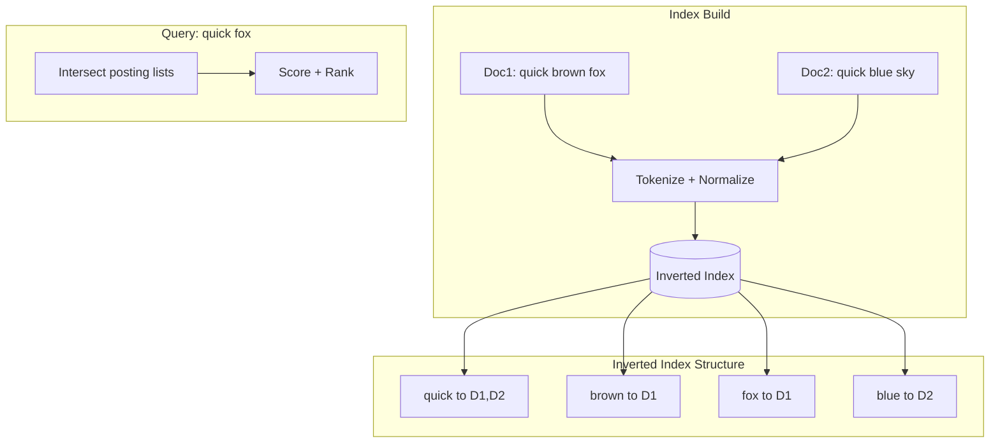
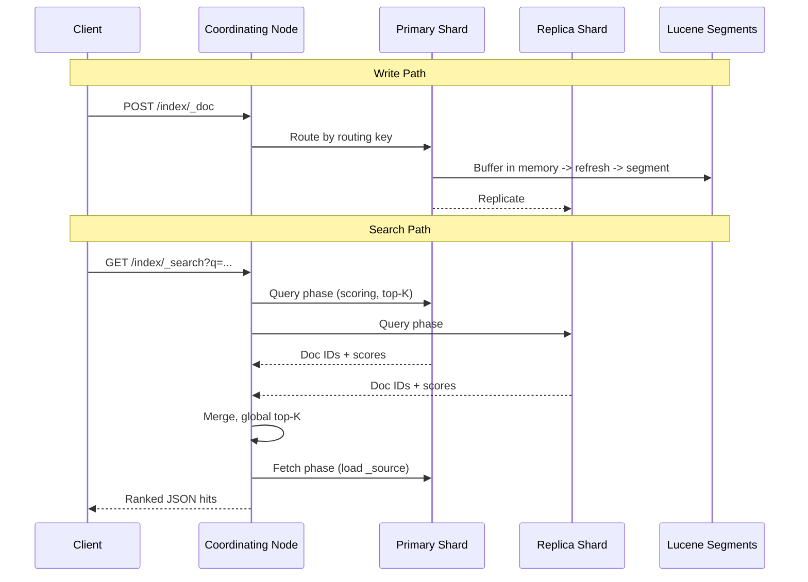

# 14. Search Systems

> Status: **Documented**  -  self-contained master reference for full-text search, indexing, ranking, and production search engines.

[<- Back to master index](../README.md)

---

## Sub-topics

| # | Sub-topic | Status |
|---|-----------|--------|
| 14.1 | [Full Text Search](#141-full-text-search) | Done |
| 14.2 | [Inverted Index](#142-inverted-index) | Done |
| 14.3 | [Lucene](#143-lucene) | Done |
| 14.4 | [Elasticsearch](#144-elasticsearch) | Done |
| 14.5 | [Ranking](#145-ranking) | Done |
| 14.6 | [Relevance Scoring](#146-relevance-scoring) | Done |
| 14.7 | [Faceted Search](#147-faceted-search) | Done |
| 14.8 | [Autocomplete](#148-autocomplete) | Done |
| 14.9 | [Fuzzy Search](#149-fuzzy-search) | Done |


---

## 14.1 Full Text Search


### What is it

**Full-text search** retrieves documents containing natural-language terms from large corpora  -  matching words, phrases, and variants across unstructured text fields, not just exact key lookups.

### Why it matters

Users expect Google-quality search inside products (e-commerce, support portals, logs). SQL `LIKE '%term%'` scans entire tables and cannot rank by relevance  -  dedicated search engines scale to billions of documents with sub-second latency.

### How it works

1. **Ingest:** tokenize text -> normalize (lowercase, stem) -> build inverted index (term -> doc IDs + positions).
2. **Query:** parse user input (boolean, phrase, fuzzy) -> fetch posting lists for terms.
3. **Score:** compute relevance per document (TF-IDF, BM25, boosts).
4. **Return:** top-K hits with highlights, facets, and aggregations.

### Key details

- **Tokenization** language-dependent  -  CJK requires segmentation; European languages use stemming/lemmatization.
- **Analyzed vs not_analyzed fields:** `text` (tokenized) vs `keyword` (exact match) in Elasticsearch.
- **Near real-time (NRT):** index refreshes every 1s by default in ES  -  not instant but fast enough for most apps.
- Contrast **full-text** vs **semantic/vector search**  -  modern systems combine BM25 + embeddings (hybrid search).

### When to use

- Product catalogs, knowledge bases, log exploration, legal/medical document search.
- Any user-facing search box over unstructured or semi-structured text.
- When ranking and phrase matching matter, not just filter predicates.

### Trade-offs

| Pros | Cons |
|------|------|
| Fast relevance-ranked retrieval | Index size 20 - 50% of source text |
| Rich query syntax (phrase, fuzzy, bool) | Eventually consistent indexing |
| Horizontal scale (sharding) | Operational complexity vs SQL |
| Facets and aggregations built-in | Tuning relevance is iterative |

### References

- _Add links from [System Design Fundamentals.xlsx](../System%20Design%20Fundamentals.xlsx) as you collect them._

---


## 14.2 Inverted Index


### What is it

An **inverted index** maps each **term** to a **posting list** of documents (and optionally positions, frequencies) containing that term  -  the core data structure behind every major search engine.

### Why it matters

Scanning every document for every query is O(documents). Inverted indexes make lookup O(posting list size)  -  often milliseconds over billions of docs. Understanding postings is essential for interview search design.

### How it works



1. **Forward index:** doc -> terms (for storage). **Inverted index:** term -> docs (for search).
2. Each posting stores `doc_id`, optionally `term frequency`, `positions` (for phrase queries).
3. **Query execution:** fetch lists for each term -> intersect/union (boolean) -> score survivors.
4. Posting lists are often **sorted by doc ID**  -  efficient merge-intersect.

### Key details

#### Postings lists

A **posting** is one `(doc_id, …metadata)` entry in the list for a term. Metadata enables ranking and phrase queries without re-reading the document.

| Field | Purpose | Example |
|-------|---------|---------|
| `doc_id` | Document identifier | `doc_48291` |
| **Term frequency (tf)** | How often term appears in doc | `fox` appears 3× → tf=3 |
| **Positions** | Token index in document | `[2, 15, 88]` for phrase "quick fox" |
| **Payloads** | Custom per-occurrence data | Boost factor, part-of-speech |
| **Norms** | Field length normalization | Shorter title matches weigh more |

**List structure:** postings sorted by `doc_id` ascending → efficient **merge-intersect** for boolean AND.

```text
Term "quick":  [doc1:tf=1,pos=[0], doc2:tf=1,pos=[0], doc7:tf=2,pos=[0,12]]
Term "fox":    [doc1:tf=1,pos=[2], doc5:tf=1,pos=[4]]

Query "quick AND fox":
  intersect doc_ids → {doc1}
  phrase "quick fox" on doc1: positions 0 and 2 adjacent? No (gap=1) → phrase miss unless slop allowed
```

**Skip lists** on posting lists store skip pointers every N doc_ids — during AND merge, skip ahead when the other list's current doc_id is larger, avoiding full scans.

**Compression:** doc_id deltas + tf/pos encoding (variable-byte, PForDelta, Roaring bitmaps) shrink index 3–10×; hot terms ("the") use aggressive compression because lists are huge.

#### Tokenization

**Tokenization** splits raw text into **terms** (tokens) before indexing. The **analyzer** pipeline in Lucene/ES:

```text
Raw text → CharFilter (strip HTML) → Tokenizer (split) → TokenFilter (lowercase, stem, stop)
```

| Stage | Example input → output |
|-------|------------------------|
| **Tokenizer (standard)** | `"Quick brown foxes"` → `[Quick, brown, foxes]` |
| **Lowercase filter** | `[Quick, brown, foxes]` → `[quick, brown, foxes]` |
| **Stemmer (English)** | `[foxes]` → `[fox]` |
| **Stop filter** | removes `[the, a, is]` |

**Language matters:**

| Language | Challenge | Approach |
|----------|-----------|----------|
| English | Inflection | Porter stemmer, lemma |
| CJK (Chinese/Japanese/Korean) | No spaces | ICU segmenter, dictionary-based |
| German | Compound words | Decompounding or n-grams |
| Code / SKU | Exact match needed | `keyword` field, no stemming |

**Analyzed vs not_analyzed:**

- `text` field — tokenized; full-text search on `running` matches "run", "runs" (if stemmed).
- `keyword` field — whole value is one token; filters, aggregations, exact SKU.

**Index-time vs search-time analyzers:** must align or use **search_as_you_type** / **synonym** filters at query time (e.g., "laptop" → "notebook").

- **Phrase query:** verify term positions within sliding window in merged postings (`slop=0` = adjacent).
- Stored fields vs index-only  -  `_source` in ES stores original JSON for highlighting.

### When to use

- Foundation for any keyword search system  -  build or buy (Lucene).
- Log indexing (Elasticsearch, OpenSearch), e-commerce search, code search.
- Combined with forward index for retrieval of full document body.

### Trade-offs

| Pros | Cons |
|------|------|
| O(1) term lookup | Rebuild/update on every doc change |
| Efficient boolean combinations | Phrase/geo queries add complexity |
| Compressible posting lists | Stemming can reduce precision |

### References

- _Add links from [System Design Fundamentals.xlsx](../System%20Design%20Fundamentals.xlsx) as you collect them._

---


## 14.3 Lucene


### What is it

**Apache Lucene** is the open-source Java library implementing inverted indexes, analyzers, scoring, and segment management  -  the engine inside Elasticsearch, Solr, and many embedded search products.

### Why it matters

Elasticsearch interviews often reduce to Lucene concepts: segments, merges, analyzers, BM25. Understanding Lucene explains *why* ES behaves as it does (refresh, near-real-time, immutability).

### How it works

1. **Documents** added to `IndexWriter` -> analyzed -> in-memory buffer.
2. **Refresh** (or `commit`) flushes buffer to immutable **on-disk segment**.
3. **Segment merge** policy combines small segments into larger ones; purges deleted docs.
4. **IndexSearcher** queries across all segments; results merged by score.

### Key details

- **Analyzer chain:** `CharFilter` -> `Tokenizer` -> `TokenFilter` (lowercase, stop, stem).
- **Similarity:** BM25 default since Lucene 7; TF-IDF legacy.
- **Doc values:** column-stride stored fields for sorting, aggregations, facets  -  separate from inverted index.
- **Near-real-time reader:** reopen `IndexReader` to see new segments without full restart.

### When to use

- Embedded search in Java applications without full ES cluster overhead.
- Custom search appliances; understanding layer under Elasticsearch/Solr.
- Building specialized indexes (code search, scientific literature) with custom analyzers.

### Trade-offs

| Pros | Cons |
|------|------|
| Battle-tested, extensible | Java-centric; embedded ops burden |
| Fine-grained tuning | No built-in distributed layer |
| BM25, payloads, joins (limited) | Segment merge I/O spikes |

### References

- _Add links from [System Design Fundamentals.xlsx](../System%20Design%20Fundamentals.xlsx) as you collect them._

---


## 14.4 Elasticsearch


### What is it

**Elasticsearch** is a distributed, RESTful search and analytics engine built on **Apache Lucene**. It shards indices across nodes, replicates for HA, and exposes rich query DSL, aggregations, and near-real-time indexing.

### Why it matters

De facto standard for operational search, log analytics (ELK/EFK stack), and metrics. Interview designs for "search service" or "log platform" almost always reference ES concepts  -  shards, replicas, segments, refresh.

### How it works



1. **Cluster:** nodes hold shards; one primary + N replicas per shard.
2. **Index -> shards:** hash `_id` or custom routing key to shard.
3. **Write:** primary indexes -> replicate to replicas -> refresh makes visible.
4. **Search:** coordinating node fans out query -> merge scores -> fetch phase for `_source`.

### Key details

#### Shards

An **index** is split into **primary shards** — independent Lucene indexes, each hosting a subset of documents.

| Concept | Detail |
|---------|--------|
| **Shard count** | Fixed at index creation (hard to change); typical 1–50 per index depending on data size |
| **Routing** | `shard = hash(_routing) % num_primary_shards`; default `_routing = _id` |
| **Custom routing** | Same `user_id` routes to same shard — efficient per-user queries |
| **Shard size** | Target 10–50 GB per shard; too many shards → cluster state overhead; too few → no parallelism |

```text
Index "orders" (3 primary shards)
  shard 0: doc_ids hash % 3 == 0
  shard 1: doc_ids hash % 3 == 1
  shard 2: doc_ids hash % 3 == 2
```

**Search:** coordinating node fans out to **all shards** (or routed subset), merges top-K per shard into global top-K.

**Write:** document routed to one primary shard; that shard indexes locally.

#### Replicas

Each primary shard has **N replica shards** (copies) for HA and read scale.

| Setting | Effect |
|---------|--------|
| `number_of_replicas: 1` | 1 primary + 1 replica per shard; survives 1 node loss |
| `number_of_replicas: 2` | 1 primary + 2 replicas; more read throughput, more disk |
| Replica = Lucene copy | Same segments; replicates indexing on primary |

**Write path:** primary indexes → replicates operation to replica shards (async within cluster).

**Read path:** coordinating node may use **replica** for query phase (load spread); **get-by-id** can use `preference=_primary` for freshest doc.

**Never put primary and its only replica on same node** — use zone/awareness attributes (`node.attr.zone`).

#### Near real-time (NRT)

Elasticsearch is **near real-time**, not instant. Writes are visible to search after **refresh**.

| Stage | What happens | Visibility |
|-------|--------------|------------|
| **Indexing** | Doc buffered in memory on primary shard | Not searchable |
| **Refresh** (default every **1s**) | Buffer flushed to new **immutable Lucene segment** | Searchable |
| **Translog** | Write-ahead log for durability before refresh | Recover on crash |
| **Flush / commit** | fsync segments + commit point | Durable on disk |

```text
POST /index/_doc  →  in-memory buffer  →  refresh (1s)  →  searchable segment
                                              ↑
                                    tunable: index.refresh_interval
```

**Tuning:**

- `refresh_interval: 30s` — bulk ingest (logs, reindex); higher throughput, stale search up to 30s.
- `refresh_interval: -1` — disable auto-refresh during bulk load; manual `_refresh` after.
- `refresh=wait_for` on write — block until next refresh (stronger read-your-writes, slower).

**Segment immutability:** updates = delete + re-insert (tombstone); background **merge** compacts segments; heavy merge → I/O spikes.

- **Mapping:** schema defines field types; changing mapping often requires reindex.
- **Aggregations:** bucket (terms, date histogram) + metric (sum, avg)  -  analytics without separate DB.
- Alternatives: **OpenSearch** (AWS fork), **Solr** (similar Lucene core), managed **Elastic Cloud**.

### When to use

- Full-text search, log/metric analytics, security SIEM, APM trace storage.
- Faceted e-commerce browse, autocomplete backends, geo search.
- When team needs managed search without building inverted indexes from scratch.

### Trade-offs

| Pros | Cons |
|------|------|
| Horizontal scale, mature ecosystem | JVM heap tuning; GC pauses at scale |
| Rich DSL + aggregations | Split-brain risk without proper quorum |
| Near real-time | Deep pagination expensive (use search_after) |
| Strong ops tooling (Kibana) | License/cost considerations (Elastic vs OpenSearch) |

### References

- _Add links from [System Design Fundamentals.xlsx](../System%20Design%20Fundamentals.xlsx) as you collect them._

---


## 14.5 Ranking


### What is it

**Ranking** orders search results by estimated relevance to the query  -  turning a set of matching documents into a user-trustworthy ordered list. Combines textual relevance, business rules, and personalization.

### Why it matters

Users rarely look past the first page. Poor ranking destroys product value even with perfect recall. System design interviews ask how you'd improve "quality" beyond boolean match.

### How it works

1. **Retrieval:** cheaply fetch candidate set (inverted index, maybe 1000s of docs).
2. **Scoring:** compute relevance score per candidate (BM25, vector similarity).
3. **Re-ranking:** ML model (LTR  -  Learning to Rank) on richer features  -  click history, freshness, popularity.
4. **Business boosts:** pin sponsored, demote out-of-stock, diversify results.

### Key details

- **Two-stage retrieval:** bi-encoder (fast, broad) -> cross-encoder (slow, precise top-N).
- **Learning to Rank:** features like BM25 score, PageRank, query-document click-through rate.
- **Freshness decay:** Gaussian or exponential boost for recent content (news, social).
- **Diversity:** MMR (Maximal Marginal Relevance) reduces near-duplicate results.

### When to use

- Any user-facing search where order matters  -  e-commerce, media, enterprise search.
- When boolean match returns too many equally-plausible hits.
- After baseline BM25, when product metrics (CTR, conversion) need optimization.

### Trade-offs

| Pros | Cons |
|------|------|
| Dramatically better UX | ML rankers need training data |
| Tunable via boosts and functions | Latency increases with re-rank stage |
| A/B testable | Over-personalization creates filter bubbles |

### References

- _Add links from [System Design Fundamentals.xlsx](../System%20Design%20Fundamentals.xlsx) as you collect them._

---


## 14.6 Relevance Scoring


### What is it

**Relevance scoring** assigns a numeric score measuring how well a document matches a query. Lucene/Elasticsearch default: **BM25** (Best Matching 25)  -  probabilistic improvement over TF-IDF.

### Why it matters

Interviewers ask "how does Elasticsearch score documents?" BM25's saturation and length normalization explain why repeating keywords or stuffing long docs doesn't dominate results.

### How it works

**BM25 formula (conceptual):**

```
score(D,Q) = Σ IDF(qi) · (f(qi,D) · (k1+1)) / (f(qi,D) + k1·(1−b+b·|D|/avgdl))
```

- `f(qi,D)`  -  term frequency in document
- `|D|`  -  document length; `avgdl`  -  average doc length
- `k1`  -  term frequency saturation (default 1.2)
- `b`  -  length normalization (default 0.75)
- `IDF`  -  rare terms weigh more

### Key details

- **Field boosts:** `title^3` multiplies score  -  title matches rank higher.
- **Function score:** combine BM25 with `log(popularity)`, `gauss(date)`, script scores.
- **Explain API:** `/_explain` shows term-by-term score breakdown  -  essential for debugging.
- **Vector search:** `kNN` with HNSW index  -  cosine similarity score merged with BM25 (hybrid).

### When to use

- Default text relevance in Lucene/ES  -  tune `k1`, `b` only with evaluation data.
- Custom scoring when product signals (sales rank, rating) should blend with text match.
- Debugging "why is this doc #1?" in production search quality incidents.

### Trade-offs

| Pros | Cons |
|------|------|
| Strong baseline without ML | Ignores semantics ("laptop" vs "notebook") |
| Interpretable term weights | Field boost tuning is manual |
| Fast at query time | IDF stale until index refresh |

### References

- _Add links from [System Design Fundamentals.xlsx](../System%20Design%20Fundamentals.xlsx) as you collect them._

---


## 14.7 Faceted Search


### What is it

**Faceted search** (guided navigation) returns **aggregated counts** alongside search results  -  e.g., "Brand: Nike (42), Adidas (31)"  -  letting users filter by category, price range, color without leaving the search experience.

### Why it matters

E-commerce and enterprise catalogs with heterogeneous attributes need browse + filter UX. Facets turn search into exploration and dramatically improve conversion vs plain keyword lists.

### How it works

1. Index **facet fields** as `keyword` with **doc values** enabled (column storage).
2. On search request, add **aggregations** (ES `terms`, `range`, `date_histogram`).
3. Query runs once; hits + facet buckets returned in parallel.
4. User selects facet -> query adds `filter` clause (filters don't affect facet counts unless using `post_filter`).

### Key details

- **`post_filter` vs `filter`:** filter in query context affects scoring; post_filter applies after aggregations  -  choose based on whether facet counts should narrow with filters.
- **Cardinality agg:** approximate unique counts (HyperLogLog++) for "distinct brands."
- **Nested/object facets:** require `nested` aggregation for arrays of objects.
- Performance: facet fields should be low-cardinality keywords where possible.

### When to use

- E-commerce (category, brand, price, rating), job boards (location, salary band).
- Any search UI with left-rail or top-chip filters.
- Analytics dashboards sharing same index as search.

### Trade-offs

| Pros | Cons |
|------|------|
| Better discovery UX | High-cardinality facets are expensive |
| Single query for hits + counts | Complex nested docs complicate aggs |
| Real-time filter reflection | post_filter semantics confuse beginners |

### References

- _Add links from [System Design Fundamentals.xlsx](../System%20Design%20Fundamentals.xlsx) as you collect them._

---


## 14.8 Autocomplete


### What is it

**Autocomplete** (type-ahead, search-as-you-type) suggests completions as the user types  -  prefix matching on titles, past queries, or entity names with low latency (< 50 ms).

### Why it matters

Search boxes are the primary navigation for large catalogs. Fast suggestions reduce friction, correct typos early, and surface popular queries  -  measurably increasing search usage and conversion.

### How it works

1. **Completion suggester (ES):** FST-based in-memory structure built from indexed suggestions with weights.
2. **Edge n-grams:** index `"quick"` as `q, qu, qui, quic, quick`  -  prefix queries match instantly.
3. **Phrase suggester:** correct whole query terms based on indexed corpus statistics.
4. **Architecture:** dedicated lightweight index or Redis trie for hot prefixes; debounce client requests.

### Key details

- **Completion field** in ES uses finite state transducer  -  fast but rebuild on update.
- **Edge n-gram analyzer** on `text` field  -  simpler but larger index.
- **Popular queries log:** aggregate search logs -> boost trending suggestions.
- **Highlight matching prefix** in UI; limit to top 5 - 10 suggestions.

### When to use

- Search bars, address forms, tag pickers, command palettes.
- When prefix latency must be < 100 ms under load.
- Combining product titles + query log suggestions.

### Trade-offs

| Pros | Cons |
|------|------|
| Dramatically better search UX | Extra index maintenance |
| Reduces null-result queries | Edge n-grams inflate index size |
| Can personalize per user | Completion index stale until refresh |

### References

- _Add links from [System Design Fundamentals.xlsx](../System%20Design%20Fundamentals.xlsx) as you collect them._

---


## 14.9 Fuzzy Search


### What is it

**Fuzzy search** finds terms similar to the query string within an **edit distance** threshold (Levenshtein)  -  tolerating typos (`"laptop"` matches `"laptpo"`).

### Why it matters

Mobile keyboards and fast typing produce typos; strict term matching returns zero results. Fuzzy matching recovers recall without full semantic search infrastructure.

### How it works

1. **Levenshtein distance:** minimum single-char insert/delete/substitute operations between strings.
2. **ES `fuzziness`:** `AUTO` allows 1 edit for 3 - 5 char terms, 2 for longer; uses Damerau-Levenshtein (includes transpositions).
3. **Implementation:** expand query to all terms within edit distance in index dictionary  -  expensive at high fuzziness.
4. **Phonetic filters:** Metaphone/Soundex for name search ("Smith" ≈ "Smyth").

### Key details

- High `fuzziness` on short terms causes false positives (`"cat"` -> `"car"`).
- **Prefix length** parameter: require first N chars exact before fuzzy  -  reduces noise.
- **N-gram + fuzzy** hybrid common in production.
- Contrast fuzzy (character-level) vs semantic (embedding-level) mismatch handling.

### When to use

- User-facing search with typo tolerance  -  names, product titles, addresses.
- `did_you_mean` suggestions on zero-result pages.
- Not for exact identifiers (order IDs, SKUs)  -  use exact `keyword` match.

### Trade-offs

| Pros | Cons |
|------|------|
| Recovers typo traffic | CPU expensive at scale |
| Simple to enable in ES | False positives on short terms |
| Complements spellcheck | Slower than exact term query |

### References

- _Add links from [System Design Fundamentals.xlsx](../System%20Design%20Fundamentals.xlsx) as you collect them._

---

[<- Back to master index](../README.md)
