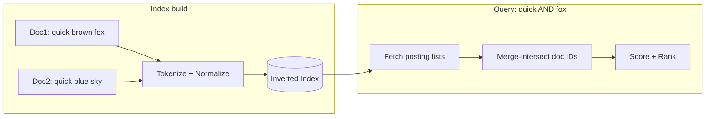
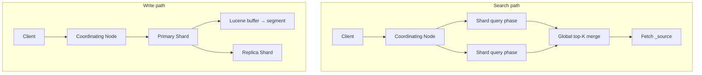
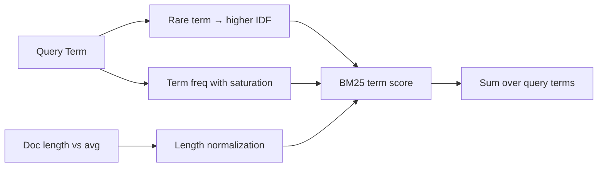
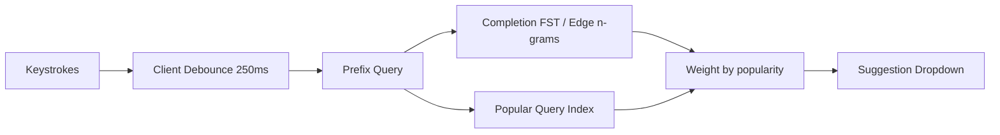

# 14. Search Systems

[<- Back to master index](../README.md)

---

## Sub-topics

| # | Sub-topic |
|---|-----------|
| 14.1 | [Full Text Search](#141-full-text-search) |
| 14.2 | [Inverted Index](#142-inverted-index) |
| 14.3 | [Lucene](#143-lucene) |
| 14.4 | [Elasticsearch](#144-elasticsearch) |
| 14.5 | [Ranking](#145-ranking) |
| 14.6 | [Relevance Scoring](#146-relevance-scoring) |
| 14.7 | [Faceted Search](#147-faceted-search) |
| 14.8 | [Autocomplete](#148-autocomplete) |
| 14.9 | [Fuzzy Search](#149-fuzzy-search) |

---

## 14.1 Full Text Search

### Overview

Imagine a warehouse with millions of product manuals stacked in no order. A customer asks for anything mentioning "battery replacement." You could read every page of every manual — that is what a SQL `LIKE '%battery%'` scan does. Full-text search is the **card catalogue plus librarian** that already knows which documents mention which words, and can rank the best matches first.

Technically, **full-text search** retrieves documents from large corpora by matching natural-language terms across unstructured text fields — words, phrases, and variants — not just exact key lookups. The pipeline ingests text (tokenize → normalize → index), parses queries (boolean, phrase, fuzzy), scores candidates by relevance (BM25, boosts), and returns top-K hits with highlights and facets. Modern systems often combine keyword search with vector embeddings (hybrid search), but full-text remains the default backbone for product search, logs, and knowledge bases.

---

### What problem it fixes

Users expect Google-quality search inside every product — e-commerce catalogs, support portals, internal wikis, log explorers. Relational databases solve exact predicates well (`WHERE sku = 'ABC-123'`) but fail on three counts for text:

- **Scale:** scanning every row for `%term%` is O(documents) per query.
- **Ranking:** boolean match returns an unordered pile; users need the *best* hits first.
- **Language:** inflection (`run` / `running`), typos, phrases, and synonyms require analysis pipelines, not string comparison.

Full-text search engines fix this with inverted indexes, analyzers, and scoring — sub-second retrieval over billions of documents with relevance-ranked results.

---

### What it does

A full-text search system:

1. **Indexes** unstructured or semi-structured text at ingest time — tokenizing, normalizing, and building term → document mappings.
2. **Parses** user queries into structured search plans (AND/OR, phrases, filters, fuzzy clauses).
3. **Scores** matching documents by estimated relevance to the query.
4. **Returns** ranked hits, often with snippets (highlights), facet counts, and aggregations in one response.

It does **not** replace transactional databases for writes and joins; it is a **read-optimized search layer** sitting beside (or fed from) the source of truth.

---

### How it works — the architecture inside


#### Ingest path

```text
Raw document text
  → CharFilter (strip HTML, normalize chars)
  → Tokenizer (split into terms)
  → TokenFilter (lowercase, stem, remove stop words)
  → Inverted index update (term → posting list)
```

| Field type | Behavior | Typical use |
|------------|----------|-------------|
| `text` (analyzed) | Tokenized; matches stems and variants | Titles, descriptions, body |
| `keyword` (not analyzed) | Whole value is one token | SKU, status, category ID |
| `search_as_you_type` | Edge n-grams for prefix | Autocomplete fields |

#### Query path

1. Parse user input into a query tree (boolean, phrase, range, filter).
2. Fetch posting lists for each term from the inverted index.
3. Intersect/union lists per boolean logic; score survivors.
4. Return global top-K with highlights from stored `_source` or term vectors.

#### Near real-time (NRT) visibility

Indexes are **not** instantly searchable after a write. Elasticsearch refreshes every **1 second** by default — flushing in-memory buffers to immutable Lucene segments. Tunable via `index.refresh_interval` (bulk ingest often sets 30s or `-1`).

#### Full-text vs semantic search

| | Keyword (BM25) | Vector (embedding) |
|---|----------------|-------------------|
| Matches | Exact/stemmed terms | Meaning similarity |
| Strength | SKUs, names, rare terms | Paraphrases ("laptop" ≈ "notebook") |
| Cost | Mature, fast | Extra model + vector index |
| Production pattern | BM25 alone or **hybrid** (RRF, weighted sum) | Often layered on top |

---

### Walkthrough: indexing and querying two product descriptions

**Documents:**

```text
doc1: "Quick charge USB-C cable for laptops"
doc2: "Wireless mouse with quick pairing"
```

**After analysis (lowercase, standard tokenizer):**

```text
doc1 terms: [quick, charge, usb, c, cable, laptops]
doc2 terms: [wireless, mouse, quick, pairing]
```

**Inverted index (simplified):**

```text
quick  → [doc1, doc2]
cable  → [doc1]
mouse  → [doc2]
laptops → [doc1]
```

**Query:** `quick cable`

```text
posting(quick) ∩ posting(cable) → {doc1}
BM25 scores doc1 above doc2 (both terms in one doc, focused match)
```

**Query:** `quick mouse`

```text
posting(quick) ∩ posting(mouse) → {}  (no doc has both)
→ zero results unless operator changed to OR or fuzzy enabled
```

---

### Pitfalls and design tips

- **Do not use SQL `LIKE` for user-facing search** at scale — it cannot rank and scans full tables.
- **Analyzed vs keyword:** putting a SKU in a `text` field stems and splits it; use `keyword` for exact identifiers.
- **Index-time vs search-time analyzers** must align, or use synonym filters at query time (`laptop` → `notebook`).
- **NRT is not instant** — `refresh_interval: 1s` means up to 1s stale search; use `refresh=wait_for` only when you need read-your-writes and accept latency cost.
- **Hybrid search** (BM25 + vectors) is the default direction for new systems; pure keyword still wins for exact tokens and compliance queries.
- **CJK languages** need segmentation (ICU, dictionary-based); European languages need stemming — one analyzer does not fit all locales.
- **Index size** typically runs 20–50% of source text; budget disk and heap accordingly.

---

### Real-world example: Shopify product search

Shopify merchants expose storefront search over product titles, descriptions, tags, and variants. The platform indexes catalog data into a search engine (Elasticsearch-class stack) so a query like `winter jacket waterproof` does not scan every product row in MySQL.

**Setup:** each product document has analyzed `text` fields (title, body) and `keyword` fields (vendor, product_type, tags, SKU).

**Query flow:**

```text
Shopper types "winter jacket waterproof"
  → query parsed as AND across analyzed terms (with stemming)
  → inverted index returns candidates matching all terms
  → BM25 ranks by term rarity and field length (title match weighs more via boost)
  → filters applied on keyword fields (in_stock, price range) without rescoring text
  → top 24 hits + facet buckets (size, color, brand) returned in one response
```

**Why this fits:** catalog text is unstructured, recall must tolerate stemming (`jacket` / `jackets`), and results must be **ordered** by relevance — requirements a relational `LIKE` scan cannot meet at merchant scale.

---

## 14.2 Inverted Index

### Overview

Picture the index at the back of a textbook: every important word points to the pages where it appears. You do not read the whole book to find "photosynthesis" — you look up the word and flip to listed pages. An **inverted index** is that back-of-book index for millions of documents, stored in a data structure optimized for "given this word, which documents contain it?"

Technically, an inverted index maps each **term** to a **posting list** — the set of documents (plus optional frequencies and positions) containing that term. It is the core data structure behind Lucene, Elasticsearch, Solr, and most keyword search systems. Lookup is O(posting list size), not O(total documents), which is why search engines answer queries in milliseconds over billions of docs.

---

### What problem it fixes

The naive approach — scan every document for every query — is O(documents × query terms). At a billion documents, that is unusable.

The inverted index inverts the relationship:

```text
Forward index:  document → [terms it contains]     (good for storage)
Inverted index: term → [documents containing it]   (good for search)
```

This makes term lookup proportional to how many documents actually contain the term (often thousands, not billions) and enables efficient boolean combinations via sorted-list merge-intersect.

---

### What it does

For each indexed term, the inverted index stores a **posting list**. Each **posting** is one document's entry in that list, optionally carrying metadata for ranking and phrase matching.

| Field | Purpose | Example |
|-------|---------|---------|
| `doc_id` | Document identifier | `doc_48291` |
| **Term frequency (tf)** | Occurrences in document | `fox` appears 3× → tf=3 |
| **Positions** | Token index in document | `[2, 15, 88]` for phrase queries |
| **Payloads** | Custom per-occurrence data | Boost, part-of-speech tag |
| **Norms** | Field-length normalization factor | Shorter title matches weigh more |

**Operations:**

- **Index time:** add/update postings as documents are analyzed.
- **Query time:** fetch lists per term → intersect (AND) / union (OR) → score survivors.

---

### How it works — the algorithm inside



#### Posting list structure

Lists are sorted by `doc_id` ascending for efficient **merge-intersect**:

```text
Term "quick":  [doc1:tf=1,pos=[0], doc2:tf=1,pos=[0], doc7:tf=2,pos=[0,12]]
Term "fox":    [doc1:tf=1,pos=[2], doc5:tf=1,pos=[4]]

Query "quick AND fox":
  intersect doc_ids → {doc1}
  phrase "quick fox" on doc1: positions 0 and 2 — gap=1 → phrase miss unless slop allowed
```

**Skip lists** store skip pointers every N doc_ids. During AND merge, when the other list's current doc_id is larger, the algorithm skips ahead instead of scanning every entry.

**Compression:** doc_id deltas + variable-byte or PForDelta encoding shrink indexes 3–10×. Very common terms (`the`) compress aggressively because lists are huge.

**How to calculate:** inverted index size estimate

```text
Given:
  N = 20M documents
  avg 250 indexed terms per document (after stop-word removal)
  ~6 bytes per compressed posting (doc_id delta + tf; positions omitted)
  dictionary + norms + skip-list overhead ≈ 25% on top of postings

Step 1 — Total postings:
  total_postings = 20M × 250 = 5 billion postings

Step 2 — Posting list bytes:
  postings = 5B × 6 B ≈ 30 GB

Step 3 — Add structural overhead:
  index_size ≈ 30 GB × 1.25 ≈ 38 GB

Step 4 — Compare to raw source text:
  raw_text ≈ 20M × 250 terms × 5 chars ≈ 25 GB uncompressed
  index / source ≈ 38 / 25 ≈ 1.5× (positions + stored fields push higher in production)

Result: ~35–40 GB inverted index for this corpus before _source storage

Sanity check: rule-of-thumb "index = 20–50% of source" applies when _source is stored separately;
  with full _source JSON, total disk often lands at 1.5–2× raw text — not just the inverted index alone.
```

#### Tokenization pipeline

```text
Raw text → CharFilter (strip HTML) → Tokenizer (split) → TokenFilter (lowercase, stem, stop)
```

| Stage | Example |
|-------|---------|
| Standard tokenizer | `"Quick brown foxes"` → `[Quick, brown, foxes]` |
| Lowercase filter | → `[quick, brown, foxes]` |
| English stemmer | `[foxes]` → `[fox]` |
| Stop filter | removes `[the, a, is]` |

| Language | Challenge | Approach |
|----------|-----------|----------|
| English | Inflection | Porter stemmer, lemmatization |
| CJK | No word boundaries | ICU segmenter, dictionary |
| German | Compound words | Decompounding or n-grams |
| SKUs / code | Must stay exact | `keyword` field, no stemming |

**Analyzed (`text`) vs not analyzed (`keyword`):**

- `text` — `running` can match `run`, `runs` after stemming.
- `keyword` — whole value is one token; used for filters, aggregations, exact SKU.

**Index-time vs search-time analyzers** must produce compatible tokens, or query-time synonym/stem expansion is required.

#### Stored fields vs index-only

The inverted index finds *which* documents match; **stored fields** (Elasticsearch `_source`, Lucene `stored fields`) hold the original JSON/text for highlighting and display. Index-only fields save space when you never return the raw value.

---

### Walkthrough: boolean AND with skip pointers

```text
Term A postings: [10, 20, 30, 40, 50]
Term B postings: [15, 20, 25, 40]

Merge-intersect (AND):
  A=10, B=15  → B advances (15>10)
  A=20, B=20  → MATCH, collect doc 20
  A=30, B=25  → B advances
  A=30, B=25  → still; B advances to 40
  A=30, B=40  → A advances (skip if skip list allows jumping 30→40)
  A=40, B=40  → MATCH, collect doc 40
  Result: {20, 40}
```

---

### Pitfalls and design tips

- **Stemming reduces precision** — `university` and `universe` may collide after aggressive stemming; tune or use lemmatization for sensitive domains.
- **High-frequency terms** (`the`, `a`) have enormous posting lists — query parsers often drop stop words; do not index noise fields as analyzed text.
- **Phrase queries need positions** — without `positions` in postings, `"quick fox"` degrades to AND of terms.
- **Updates are costly** — Lucene segments are immutable; an update = delete tombstone + re-insert; plan for merge I/O.
- **Do not confuse inverted index with forward index** — you need both: inverted for search, forward/stored for retrieval.
- **Production:** every Elasticsearch and Solr query ultimately hits Lucene posting lists; understanding merge-intersect explains slow `AND` queries on rare + ultra-common terms.

---

### Real-world example: Elasticsearch index on GitHub code search (historical pattern)

GitHub's code search (Elasticsearch-backed in its early public architecture) indexed repository files as documents with path, language, and content fields. A query for `function authenticate` intersects posting lists for `function` and `authenticate` across millions of files.

**Index time:** each file is tokenized with a code-aware analyzer; path stored as `keyword` for exact repo filters.

**Query time:**

```text
Query: "function authenticate" language:Go
  → posting(function) ∩ posting(authenticate) → candidate file doc_ids
  → filter: language keyword = Go (no scoring impact in filter context)
  → BM25 ranks remaining files; path boost optional
  → fetch _source snippets with highlighted matching lines
```

**Why inverted index fits:** scanning every file in every repo per query is impossible at GitHub scale; term → file_id lookup via posting lists is the only viable approach.

---

## 14.3 Lucene

### Overview

Think of Lucene as the **engine block** inside a car — not the whole vehicle, but the part that actually turns fuel into motion. Elasticsearch and Solr are full cars (clustering, REST APIs, ops tooling); Lucene is the Java library that implements inverted indexes, analyzers, scoring, and on-disk segment management they all embed.

Technically, **Apache Lucene** is an open-source search library (Java) that writes immutable on-disk **segments**, runs analyzers at index time, scores with BM25 by default, and exposes `IndexSearcher` for low-latency queries. Understanding segments, merges, and near-real-time readers explains Elasticsearch behaviors like refresh, split-brain-unrelated segment immutability, and merge-induced I/O spikes.

---

### What problem it fixes

Building inverted indexes from scratch means solving compression, skip lists, scoring, concurrent reads during writes, and crash-safe commits — years of engineering. Lucene packages this as a library you embed in-process.

Without Lucene (or an equivalent), teams either:

- Ship naive in-memory indexes that do not persist or scale, or
- Pay operational cost for a full distributed engine when a single JVM process would suffice.

Lucene fixes the **single-node search engine** problem; distributed routing is left to Elasticsearch/Solr or your own sharding layer.

---

### What it does

| Component | Role |
|-----------|------|
| `IndexWriter` | Accepts documents, runs analyzers, buffers in RAM |
| **Segments** | Immutable on-disk index slices flushed from buffer |
| `IndexSearcher` | Queries across all visible segments; merges results |
| **Merge policy** | Combines small segments; purges deleted docs |
| **Analyzers** | CharFilter → Tokenizer → TokenFilter chain |
| **Similarity** | Scoring model (BM25 default since Lucene 7) |
| **Doc values** | Column-stride storage for sort, aggregations, facets |

**Near-real-time (NRT):** reopen `IndexReader` to pick up new segments without restarting the process — the mechanism behind Elasticsearch refresh.

---

### How it works — the architecture inside


#### Write path

1. `IndexWriter.addDocument()` — document fields analyzed per field analyzer.
2. Documents accumulate in an in-memory buffer.
3. **Flush** (commit or NRT reopen trigger) writes a new **immutable segment** to disk.
4. **Merge policy** periodically combines small segments into larger ones; tombstoned deletes drop out during merge.

#### Read path

1. `IndexSearcher` opens a snapshot of all current segments.
2. Query runs per segment in parallel (thread pool); scores merged into global top-K.
3. **Fetch** loads stored fields / doc values for returned doc IDs.

#### Segments and immutability

```text
Update doc 42:
  → mark old doc 42 deleted (tombstone in existing segment)
  → insert new version as new document in fresh buffer → new segment on flush
  → old bytes remain until merge compacts them away
```

This immutability enables lock-free concurrent searches while writes continue — but creates merge I/O and disk amplification.

#### Doc values vs inverted index

| Structure | Optimized for | Used by |
|-----------|---------------|---------|
| Inverted index | "which docs contain term X?" | Search, BM25 |
| Doc values | "what is field value for doc N?" | Sort, aggregations, facets |

Faceted search and `sort by price` use **doc values**, not posting lists.

---

### Pitfalls and design tips

- **Segment count matters** — too many tiny segments slow queries (one search per segment); merges fix this but spike disk I/O; monitor `segments.count`.
- **Deletes are logical, not physical** — until merge, deleted docs still consume disk and slow filters; force merge only during maintenance windows.
- **Analyzer changes require reindex** — token streams at index time are frozen in segments; you cannot retroactively re-stem.
- **Java heap vs OS page cache** — Lucene relies heavily on mmap'd segment files; oversized heap steals RAM from OS cache; ES guidance: keep heap ≤ 50% RAM.
- **Not distributed** — Lucene is one JVM; HA and sharding are your problem or Elasticsearch's.
- **Interview default:** "Elasticsearch is Lucene + distributed coordination + REST API."

---

### Real-world example: embedded Lucene in Atlassian products

Atlassian Confluence and Jira historically embedded Lucene (directly or via adapters) for issue and page search within a single deployment. A Jira issue is a Lucene document with analyzed summary/description and keyword fields (project key, status, assignee).

**Index time:** issue update → `IndexWriter` analyzes text fields → buffer flush creates segment → NRT reader reopen makes issue searchable within seconds.

**Query time:** JQL full-text clause → Lucene query over local index on the node → BM25-ranked issue keys returned.

**Why embed Lucene:** single-tenant app instances with moderate corpus size do not need a separate Elasticsearch cluster; embedded Lucene avoids network hop and ops burden. Atlassian later moved toward OpenSearch/Elasticsearch for cloud scale — the migration pain (segment format, analyzers) illustrates how deeply Lucene is wired in.

---

## 14.4 Elasticsearch

### Overview

If Lucene is one library in one JVM, Elasticsearch is a **fleet of librarians** — many nodes, each holding part of the catalogue, coordinating so any query reaches the right shards and merges answers into one ranked list. You talk to it over HTTP; it handles replication, failover, and cluster state.

Technically, **Elasticsearch** is a distributed, RESTful search and analytics engine built on Lucene. It shards indices across nodes, replicates primaries for HA, exposes Query DSL and aggregations, and provides near-real-time indexing (default 1s refresh). It is the de facto standard for operational search, log analytics (ELK/EFK), and faceted product browse.

---

### What problem it fixes

Single-node Lucene cannot:

- Store more data than one machine's disk
- Survive node failure without downtime
- Serve read-heavy workloads without read replicas

Elasticsearch adds **distributed sharding**, **replica copies**, **cluster coordination** (master-elected), and **operational APIs** (index templates, ILM, snapshots) so teams run production search without building their own distributed layer.

---

### What it does

| Concept | Behavior |
|---------|----------|
| **Cluster** | Named set of nodes; one elected master manages cluster state |
| **Index** | Logical namespace (like a database table) |
| **Shard** | Subset of an index — an independent Lucene index |
| **Primary / replica** | Each shard has one primary writer + N read copies |
| **Coordinating node** | Accepts client request; fans out to shards; merges results |
| **Mapping** | Schema: field types, analyzers, doc values settings |

**Write:** route document to primary shard by `_routing` (default `_id` hash) → index locally → replicate to replica shards → refresh makes searchable.

**Search:** coordinating node sends query to all relevant shards (or routed subset) → each returns local top-K + agg partials → global merge → fetch phase loads `_source`.

---

### How it works — the architecture inside



#### Shards and routing

An index is split into **primary shards** (fixed at creation time):

```text
Index "orders" (3 primary shards)
  shard 0: doc_ids where hash(_routing) % 3 == 0
  shard 1: hash % 3 == 1
  shard 2: hash % 3 == 2
```

| Setting | Guidance |
|---------|----------|
| Shard count | Fixed at index creation; typical 1–50 depending on data volume |
| Shard size target | 10–50 GB per shard |
| Custom routing | Same `user_id` → same shard for efficient per-user queries |
| Too many shards | Cluster state overhead, small segments, wasted heap |

**How to calculate:** shard count for corpus

```text
Given:
  projected index size = 900 GB (primary data only, one year growth included)
  target shard size = 40 GB (middle of 10–50 GB guidance)
  fixed at index creation — cannot shrink shard count without reindex

Step 1 — Minimum primaries needed:
  primaries = ceil(900 / 40) = ceil(22.5) = 23

Step 2 — Round to operational sweet spot:
  choose 24 primary shards → ~37.5 GB per shard at full size

Step 3 — Replicas (number_of_replicas = 1):
  total_shard_copies = 24 primaries × 2 = 48 Lucene indices on disk

Result: create index with 24 primary shards; each grows to ~37 GB

Sanity check: 900 GB / 3 shards = 300 GB each — too fat for merge and recovery;
  900 GB / 200 shards = 4.5 GB each — cluster state and heap overhead dominate.
```

#### Replicas

`number_of_replicas: 1` → one primary + one replica per shard; survives loss of one copy.

- **Write:** primary indexes → async replicate to replicas.
- **Read:** coordinating node may assign query phase to replicas for load spread.
- **Placement:** never put primary and its only replica on the same node; use `node.attr.zone` awareness.

**How to calculate:** replication factor storage

```text
Given:
  primary index data = 600 GB (all primary shards summed)
  number_of_replicas = 2  (two replica copies per primary → 3 total copies each)
  24 primary shards

Step 1 — Copies per shard:
  copies_per_shard = 1 primary + 2 replicas = 3

Step 2 — Total cluster disk for this index:
  total = 600 GB × 3 = 1,800 GB ≈ 1.8 TB

Step 3 — Per-node planning (3 data nodes, balanced):
  per_node ≈ 1.8 TB / 3 ≈ 600 GB for this index alone

Result: replicas=2 triples storage vs no replicas; budget 1.8 TB before snapshots and translog

Sanity check: number_of_replicas=1 doubles storage (1 primary + 1 replica) —
  interview mistake is treating "replicas=1" as "one copy total" instead of "one extra copy."
```

#### Near real-time (NRT)

| Stage | Visibility |
|-------|------------|
| Indexing | Buffered in memory — **not searchable** |
| Refresh (default 1s) | New immutable Lucene segment — **searchable** |
| Translog | Write-ahead log for durability before refresh |
| Flush / commit | fsync segments — durable on disk |

```text
POST /index/_doc  →  memory buffer  →  refresh (1s)  →  searchable segment
```

**Tuning:**

- `refresh_interval: 30s` — bulk log ingest; higher throughput, staler search.
- `refresh_interval: -1` — disable auto-refresh during bulk load; call `_refresh` after.
- `refresh=wait_for` — write blocks until next refresh (stronger read-your-writes).

**How to calculate:** refresh interval vs NRT lag

```text
Given:
  index.refresh_interval = 5s (bulk log ingest)
  steady write rate — documents arrive uniformly
  search does NOT use refresh=wait_for

Step 1 — Worst-case search visibility lag:
  a doc indexed just after a refresh waits nearly full interval → max_lag ≈ 5s

Step 2 — Average lag (uniform arrivals):
  avg_lag ≈ refresh_interval / 2 = 5 / 2 = 2.5s

Step 3 — Write latency if refresh=wait_for:
  write blocks until next refresh → p99 write latency += up to 5s
  search lag after acknowledged write ≈ 0

Result: 5s refresh → users see new logs in 0–5s (avg ~2.5s); bulk throughput improves vs 1s default

Sanity check: refresh_interval = 30s for overnight backfill → avg 15s stale search is acceptable for analytics;
  checkout search on product catalog should stay at 1s or use wait_for for read-your-writes tests only.
```

#### Aggregations

Bucket aggs (`terms`, `date_histogram`) + metric aggs (`sum`, `avg`) run on doc values in parallel per shard, then merge — same query returns hits and analytics.

---

### Pitfalls and design tips

- **Shard count is hard to change** — wrong initial count forces reindex or shrink API; size for 12–24 months growth.
- **Mapping changes often need reindex** — changing analyzer on existing field requires new index + `_reindex`.
- **Deep pagination is expensive** — `from: 10000` forces scoring 10010 docs per shard; use `search_after` or `scroll` for export.
- **Split-brain risk** — always set `discovery.seed_hosts` and minimum master nodes (`cluster.initial_master_nodes` in ES 7+); odd-numbered master-eligible nodes.
- **JVM heap tuning** — oversized heap hurts Lucene mmap performance; monitor GC pauses.
- **Alternatives:** OpenSearch (AWS fork, Apache 2.0), Solr (similar Lucene, ZooKeeper coordination), managed Elastic Cloud / AWS OpenSearch Service.
- **License:** Elastic dual-license post-7.11; verify compliance for SaaS redistribution.

---

### Real-world example: Elastic Stack for log search at Uber (documented pattern)

Uber publicly described using the **Elastic Stack (Elasticsearch + Kibana + Beats/Logstash)** for centralized log search across services. Application logs ship to Elasticsearch indices (often daily or hourly rollovers via Index Lifecycle Management).

**Setup:** log lines indexed with `@timestamp`, `service_name` (keyword), `level`, and analyzed `message` field; 3–5 primary shards per daily index depending on ingest volume; `refresh_interval: 5s` or 30s for ingest-heavy indices.

**Query flow:**

```text
Engineer searches: service_name:payment AND level:ERROR AND "timeout"
  → coordinating node fans out to all shards in index pattern logs-*
  → each shard runs boolean query on inverted index + keyword filter
  → global merge of top hits sorted by @timestamp desc
  → Kibana renders hits + date histogram aggregation (errors over time)
```

**Why Elasticsearch fits:** log volume exceeds single-node capacity; full-text on message bodies plus faceted filters on structured fields; same cluster serves search and aggregations for dashboards.

---

## 14.5 Ranking

### Overview

Search that returns *every* matching document in random order is like a librarian dumping a pile of books on the floor. **Ranking** is the librarian sorting that pile so the most useful books sit on top. Users rarely scroll past the first page — order is the product.

Technically, **ranking** orders search results by estimated relevance to the query. It combines cheap first-stage retrieval (inverted index, top-K heap per shard), lexical scoring (BM25), optional second-stage re-ranking (learning-to-rank, cross-encoders), and business rules (boost in-stock, pin sponsored, freshness decay, diversity). The goal is maximize user trust metrics: CTR, conversion, task completion — not just boolean recall.

---

### What problem it fixes

Boolean retrieval answers "does this document match?" but thousands of documents can match a broad query (`laptop`, `error`, `john`). Without ranking:

- Users cannot find the right result in noise.
- Product metrics collapse — e-commerce conversion depends on top-3 quality.
- Engineering teams cannot A/B test search quality improvements.

Ranking turns a **set** of matches into an **ordered list** optimized for user intent and business goals.

---

### What it does

A typical production ranking pipeline:

```text
Stage 1 — Retrieval:  inverted index → thousands of candidates (cheap, broad)
Stage 2 — Scoring:     BM25 or hybrid BM25+vector → hundreds
Stage 3 — Re-ranking:  LTR model or cross-encoder → top 50–100
Stage 4 — Business:    boosts, pins, diversity (MMR), dedup
Output:                page 1 (10–24 results)
```

| Signal type | Examples |
|-------------|----------|
| Textual | BM25, phrase proximity, field boosts |
| Popularity | Sales rank, PageRank, click-through rate |
| Freshness | Gaussian decay on `published_at` |
| Personalization | Past purchases, location (use carefully) |
| Business | In-stock boost, sponsored placement |

---

### How it works — the architecture inside


#### Two-stage retrieval (neural)

| Stage | Model | Speed | Precision |
|-------|-------|-------|-----------|
| Bi-encoder | Query and doc embedded separately; ANN lookup | Fast — millions of docs | Moderate |
| Cross-encoder | Joint query-doc transformer on top-N | Slow — tens of docs | High |

Production pattern: bi-encoder retrieves top-100 → cross-encoder re-ranks to top-10.

#### Learning to Rank (LTR)

Train a model (LambdaMART, XGBoost) on **features** per query-document pair:

```text
features = [bm25_score, title_bm25, doc_age_days, popularity, query_doc_ctr, ...]
label    = clicked (1) or not (0) — from search logs
```

Elasticsearch supports `learning_to_rank` plugin; many large shops train offline and serve scores via custom rescorer.

#### Freshness and diversity

- **Freshness decay:** `gauss(published_at, scale=7d)` boosts recent news; e-commerce may *demote* stale listings.
- **MMR (Maximal Marginal Relevance):** penalize near-duplicate results so page 1 covers varied aspects.

---

### Pitfalls and design tips

- **Do not re-rank the entire index** — cap stage-1 retrieval (e.g. top 1000 by BM25) before expensive ML.
- **LTR needs logged judgments** — without click logs or human labels, you are guessing; start with BM25 + manual boosts.
- **Over-personalization** creates filter bubbles; blend personal and global signals.
- **Sponsored pins** belong in a transparent layer after relevance — users notice irrelevant ads.
- **Measure offline (nDCG, MRR) and online (CTR, zero-result rate)** — BM25 tuning without metrics is folklore.
- **Latency budget:** stage-3 cross-encoder at 50ms × 100 docs blows p99; cap candidates.

---

### Real-world example: Amazon search ranking layers

Amazon product search (public research and patents describe multi-stage ranking) retrieves candidates via inverted-index-style keyword matching, then applies progressively expensive rankers.

**Simplified flow:**

```text
Query "wireless noise cancelling headphones"
  → Stage 1: keyword retrieval over catalog → ~10,000 ASINs
  → Stage 2: lexical + popularity features → ~500
  → Stage 3: ML ranker using query-ASIN click/conversion history → ~50
  → Business: in-stock filter, Prime eligibility boost, sponsored slots
  → User sees top 16 results
```

**Why multi-stage:** scoring 300M products with a deep neural model per query is impossible at latency targets (<100ms); cheap stages prune aggressively so expensive models run on small N.

---

## 14.6 Relevance Scoring

### Overview

Not every book in the pile is equally relevant — one mentions your topic on every page, another in a footnote. **Relevance scoring** assigns a number to each match so the system can sort by "how well does this document fit the query?" instead of treating all matches as equal.

Technically, **relevance scoring** computes a numeric score per query-document pair. Lucene and Elasticsearch default to **BM25** (Best Matching 25), a probabilistic model that improves on TF-IDF with **term frequency saturation** (repeating a keyword endlessly stops helping) and **length normalization** (long boilerplate docs do not dominate). Scores are query-relative — meaningless as absolute numbers across different queries.

---

### What problem it fixes

Raw term frequency favors:

- Documents that repeat keywords (spam stuffing).
- Very long documents that mention everything once by chance.

TF-IDF partially helped by penalizing common terms, but still over-rewarded frequency and length. BM25 fixes the saturation and length bias with two tunable parameters (`k1`, `b`), giving a strong baseline without ML training data.

---

### What it does

For each query term `qi` in document `D`, BM25 contributes a score based on:

- **Inverse document frequency (IDF)** — rare terms weigh more.
- **Term frequency `f(qi,D)`** — with diminishing returns.
- **Document length `|D|`** vs corpus average `avgdl` — shorter focused docs favored when `b > 0`.

Field-level boosts (`title^3`) multiply contributions. `function_score` queries blend BM25 with `log(popularity)`, date decay, or scripts.

**Debugging:** Elasticsearch `/_explain` API returns term-by-term breakdown for a doc — essential in search quality incidents.

---

### How it works — the algorithm inside

**BM25 formula (per query term):**

```text
score(D,Q) = Σ  IDF(qi) · ( f(qi,D) · (k1 + 1) ) / ( f(qi,D) + k1 · (1 − b + b · |D|/avgdl) )
```

| Symbol | Meaning | Default (ES/Lucene) |
|--------|---------|---------------------|
| `f(qi,D)` | Term frequency in document | — |
| `|D|` | Document length (field) | — |
| `avgdl` | Average field length in corpus | computed at index time |
| `k1` | Term frequency saturation | 1.2 |
| `b` | Length normalization strength | 0.75 |
| `IDF(qi)` | log((N − n(qi) + 0.5) / (n(qi) + 0.5) + 1) | N = doc count, n(qi) = docs with term |



#### Hybrid lexical + vector

Elasticsearch 8+ supports `kNN` with HNSW vector index. Hybrid queries merge BM25 and cosine similarity (RRF or weighted sum) — BM25 for exact tokens, vectors for paraphrase.

---

### Walkthrough: BM25 intuition on two titles

```text
Corpus: 10,000 docs, avg title length = 8 terms
Query: "wireless mouse"
IDF(wireless) = high (appears in 200 docs)
IDF(mouse)    = medium (appears in 1,500 docs)

doc A title: "wireless mouse"           (2 terms, both match once)
doc B title: "wireless ergonomic mouse pad set"  (5 terms, both query terms appear)

doc A: shorter → higher length-normalized score despite fewer total words
doc B: "mouse" appears once in longer title → lower per-term contribution
→ doc A ranks above doc B
```

**How to calculate:** BM25 intuition — comparing two title lengths

```text
Given:
  avgdl = 8 tokens, k1 = 1.2, b = 0.75
  IDF(mouse) = 1.5 (same for both docs — same corpus term)
  doc A: |D| = 2, f(mouse) = 1
  doc B: |D| = 5, f(mouse) = 1

Step 1 — Length norm factor for doc A:
  norm_A = 1 − b + b · (|D|/avgdl) = 1 − 0.75 + 0.75 · (2/8) = 0.4375

Step 2 — TF saturation for doc A (mouse):
  TF_A = (1 · 2.2) / (1 + 1.2 · 0.4375) = 2.2 / 1.525 ≈ 1.44
  term_score_A = 1.5 · 1.44 ≈ 2.16

Step 3 — Same for doc B (|D| = 5):
  norm_B = 1 − 0.75 + 0.75 · (5/8) = 0.71875
  TF_B = 2.2 / (1 + 1.2 · 0.71875) = 2.2 / 1.8625 ≈ 1.18
  term_score_B = 1.5 · 1.18 ≈ 1.77

Result: doc A scores ~22% higher on the same term with same tf — shorter field wins

Sanity check: repeating "mouse" 5× in doc B would raise TF but also |D| —
  saturation + length norm cap the gain; stuffing keywords stops helping.
```

---

### How to calculate: BM25 term contribution (simplified)

```text
Given:
  f = 3        (term appears 3 times in document)
  |D| = 400    (document field length in tokens)
  avgdl = 200  (average field length)
  k1 = 1.2, b = 0.75
  IDF = 2.0    (precomputed for this term)

Step 1 — TF component with saturation:
  TF_BM25 = (f · (k1 + 1)) / (f + k1 · (1 − b + b · |D|/avgdl))
          = (3 · 2.2) / (3 + 1.2 · (1 − 0.75 + 0.75 · 400/200))
          = 6.6 / (3 + 1.2 · (0.25 + 1.5))
          = 6.6 / (3 + 2.1)
          = 6.6 / 5.1
          ≈ 1.29

Step 2 — Full term score:
  term_score = IDF · TF_BM25 = 2.0 · 1.29 ≈ 2.58

Step 3 — Document score:
  Sum term_score for each query term (wireless, mouse, …)

Sanity check: doubling f from 3→6 does NOT double score (saturation) —
  numerator grows but denominator grows too.
```

---

### Pitfalls and design tips

- **Scores are not probabilities** — do not compare scores across queries; use rank position.
- **Field boosts are manual** — `title^3` is a starting guess; validate with nDCG or A/B tests.
- **IDF stale until refresh** — new docs shift IDF slowly; reindex changes term statistics.
- **BM25 ignores semantics** — `laptop` vs `notebook` need synonyms or vector layer.
- **Explain API is your friend** — `GET /index/_explain/doc_id { "query": ... }` shows which term dominated.
- **Tune `k1`, `b` only with evaluation data** — defaults work well for most English prose.

---

### Real-world example: Elasticsearch BM25 on Wikipedia (Elastic demo datasets)

Elastic publishes sample Wikipedia datasets for training. A query `{"match": {"title": "Apollo moon landing"}}` scores articles where rare terms (`Apollo`, `moon`) contribute high IDF.

**Observed behavior (reproducible on sample data):**

```text
Article A: title "Apollo 11" — short title, both concepts in body with moderate tf
Article B: title "History of spaceflight" — long article mentions Apollo once

/_explain shows:
  Article A: high IDF terms in short title field (boosted) → score ~12.4
  Article B: same terms buried in long body → score ~4.1
→ A ranks first
```

**Why BM25 fits:** encyclopedia search needs length-normalized title preference without hand-tuning TF thresholds.

---

## 14.7 Faceted Search

### Overview

Walking into a shoe store, you don't only ask the clerk "sneakers" — you narrow by size, color, and brand using labels on the shelves. **Faceted search** is that shelf labeling for digital catalogs: search results come with counts like `Brand: Nike (42), Adidas (31)` so users filter without starting over.

Technically, **faceted search** (guided navigation) returns **aggregated bucket counts** alongside hits from a single query. Facet fields are indexed as `keyword` with **doc values** (column storage). Elasticsearch `terms`, `range`, and `date_histogram` aggregations compute buckets in parallel per shard; the coordinating node merges counts. Filters narrow results; whether filters also narrow facet counts depends on `filter` vs `post_filter` placement.

---

### What problem it fixes

Plain keyword search on heterogeneous catalogs (e-commerce, jobs, travel) overwhelms users with long unfiltered lists. Without facets:

- Users cannot discover available brands, sizes, or price bands.
- Each filter change requires a new mental model or separate SQL queries.
- Conversion drops because finding "red Nike size 10 in stock" is tedious.

Facets turn search into **exploration** — one query powers results and navigational filters together.

---

### What it does

On each search request:

1. Execute text query → ranked hits.
2. Simultaneously compute aggregations on facet fields → bucket counts.
3. Return JSON with `hits` + `aggregations` in one round trip.
4. User selects facet → client adds `filter` clause → repeat.

| Aggregation type | Facet use |
|------------------|-----------|
| `terms` | Brand, category, color (keyword fields) |
| `range` | Price bands, rating ranges |
| `date_histogram` | Time filters on logs or events |
| `cardinality` | Approximate distinct count (HyperLogLog++) |

---

### How it works — the architecture inside


#### filter vs post_filter

| Clause | Affects | Facet counts |
|--------|---------|--------------|
| `filter` in `bool` query (filter context) | Which docs match | **Yes** — aggs run on filtered set |
| `post_filter` | Hits only, after aggs | **No** — aggs see pre-filter corpus |

**Example:** user searches `laptop` and filters `brand:Dell`. With filter in query context, Nike facet count drops to zero. With `post_filter`, Nike count still shows corpus-wide — useful for "show all brands available for laptops" while displaying only Dell hits.

#### Nested facets

Arrays of objects (e.g. `variants: [{size, color}]`) require `nested` aggregation path — plain `terms` on child fields double-count parent docs incorrectly.

#### Performance

- Facet on **low-cardinality** keyword fields (brand, category) — fast.
- High-cardinality (`user_id`, SKU) `terms` aggs are expensive — use `sampler` or precomputed rollups.
- Doc values must be enabled (default on keyword/numeric/date in ES).

---

### Walkthrough: e-commerce facet response shape

**Request:** search `running shoes` + aggs on `brand` and `price` ranges.

```json
{
  "hits": { "total": 318, "hits": [ ... top 24 products ... ] },
  "aggregations": {
    "brands": {
      "buckets": [
        { "key": "Nike", "doc_count": 42 },
        { "key": "Adidas", "doc_count": 31 }
      ]
    },
    "price_ranges": {
      "buckets": [
        { "key": "0-50", "doc_count": 88 },
        { "key": "50-100", "doc_count": 156 }
      ]
    }
  }
}
```

User clicks `Nike` → next request adds `filter: { "term": { "brand": "Nike" } }` → hits narrow, facet counts update.

---

### Pitfalls and design tips

- **`post_filter` confuses beginners** — document whether your UX should show facet counts global or narrowed.
- **Nested docs need nested aggs** — flat `terms` on `variants.color` mis-counts.
- **Cardinality agg is approximate** — `cardinality` uses HLL++; not exact below ~0.5% error.
- **Do not facet on analyzed text** — use `keyword` subfield (`brand.keyword`).
- **Same index for search + dashboards** — powerful but heavy aggs compete with user queries; isolate via replicas or separate data streams.
- **Production:** every major e-commerce PLP (Product Listing Page) uses this pattern on Elasticsearch, Solr, or Algolia facets API.

---

### Real-world example: Etsy marketplace filters

Etsy search returns handmade goods with faceted filters for category, price, shipping, shop location, and item type. Public engineering posts describe Elasticsearch-backed search with aggregations powering left-rail filters.

**Setup:** products indexed with `keyword` fields for `taxonomy_path`, `price_bucket`, `is_handmade`; analyzed `title` for text query.

**Session flow:**

```text
User searches "ceramic mug"
  → ES returns top hits + terms agg on category (Kitchen, Home Decor, ...)
  → user selects price $20–$40 (range filter in query context)
  → hits and remaining facet counts reflect only mugs in that price band
  → user adds ships-to-US filter
  → conversion-oriented ranking still applies on filtered set
```

**Why facets fit:** heterogeneous artisan inventory lacks rigid schema; dynamic facets adapt per query result set without prebuilding static category pages.

---

## 14.8 Autocomplete

### Overview

When you start typing an address in a maps app and it guesses the street before you finish, that is autocomplete. It is the search box **finishing your thought** — prefix matching on titles, past queries, or entity names with latency low enough to feel instant (< 50 ms perceived).

Technically, **autocomplete** (type-ahead, search-as-you-type) suggests completions as the user types. Implementations include Elasticsearch **completion suggester** (FST in memory), **edge n-gram** indexes on text fields, dedicated prefix tries (Redis, custom), and query-log popularity boosts. Client-side debouncing (200–300 ms) prevents a request per keystroke.

---

### What problem it fixes

Empty search boxes with no guidance produce:

- **Zero-result queries** — users type vague or wrong terms.
- **Abandonment** — users do not know catalog vocabulary (SKU names, official product titles).
- **Slow discovery** — full search waits until the user submits a complete query.

Autocomplete reduces friction, surfaces popular queries, corrects direction early, and measurably increases search usage and conversion.

---

### What it does

On each prefix (after debounce):

1. Look up completions matching prefix (often weighted by popularity).
2. Return top 5–10 suggestions with matched prefix highlighted.
3. Optional: blend product titles, categories, and recent personal history.

| Source | Content |
|--------|---------|
| Catalog | Product titles, entity names |
| Query log | Aggregated popular searches (weekly rollups) |
| Personal | Recent user searches (privacy permitting) |

---

### How it works — the architecture inside



#### Completion suggester (Elasticsearch)

- `completion` field type builds a **finite state transducer (FST)** in memory at index time.
- Supports `weight` per suggestion (higher = ranks first).
- Extremely fast prefix lookup; **rebuilds on index** — bulk updates need refresh.

```json
"suggest": {
  "product-suggest": {
    "prefix": "wireless mo",
    "completion": { "field": "title_suggest", "size": 5 }
  }
}
```

#### Edge n-gram analyzer

Index `"mouse"` as tokens: `m`, `mo`, `mou`, `mous`, `mouse` via `edge_ngram` filter (min_gram 2, max_gram 15). Prefix query hits inverted index directly.

| Approach | Pros | Cons |
|----------|------|------|
| Completion FST | Fastest, compact | Separate field; update latency |
| Edge n-grams | Simpler, one index | Index size inflates 5–15× on that field |
| External trie (Redis) | Sub-ms, isolated load | Another system to sync |

#### Phrase suggester

Separate from prefix completion — corrects whole query terms (`wireles mouse` → `wireless mouse`) using corpus statistics; often used on zero-result pages, not per keystroke.

---

### Pitfalls and design tips

- **Debounce client requests** — 200–300 ms; without it, ES QPS = keystrokes × users.
- **Limit suggestions to 5–10** — more overwhelms mobile UI.
- **Completion index staleness** — new products invisible until FST rebuilds; tune refresh or dual-write to Redis trie for launch day.
- **Edge n-grams on huge fields** — index explosion; apply only to `title`, not full description.
- **Popular query log needs PII scrubbing** — never suggest another user's private queries.
- **Highlight matching prefix** in UI — users trust suggestions they can visually verify.
- **Algolia, Typesense, Elasticsearch** all expose dedicated autocomplete APIs — default choice for new systems: managed suggester + query log boost.

---

### Real-world example: Google Search autocomplete (documented behavior)

Google's search box autocomplete (public help pages describe) blends **likely completions** from aggregated search logs, locale, and language models — not a full web crawl per keystroke.

**Simplified flow:**

```text
User types "elasticsearch shar"
  → request sent after debounce to suggestion service
  → prefix index over curated query log + known entities
  → candidates: "elasticsearch shards", "elasticsearch shard sizing", ...
  → ranked by historical query frequency + personalization signals
  → top 8 rendered in dropdown (< 100ms target)
```

**Why not full index scan:** scanning billions of web pages per keystroke is impossible; prefix structures over **query logs and entity catalogs** keep latency bounded while reflecting collective intent.

---

## 14.9 Fuzzy Search

### Overview

When you misspell a name in a phone contact search and it still finds "Jon Smith," that tolerance is **fuzzy search**. It matches strings that are *close* rather than identical — forgiving typos from mobile keyboards and fast typing.

Technically, **fuzzy search** finds terms within an **edit distance** threshold (Levenshtein or Damerau-Levenshtein, which counts transpositions). Elasticsearch `fuzziness: AUTO` allows 1 edit for terms of length 3–5 and 2 for longer terms. Implementation expands the query to dictionary terms within distance — CPU cost rises sharply with fuzziness and dictionary size.

---

### What problem it fixes

Strict term matching returns **zero results** for common typos:

```text
Query: "laptpo"   → exact match → 0 hits
Query: "laptpo"   → fuzzy → matches indexed "laptop"
```

Mobile input, international keyboards, and voice transcription all increase typo rate. Fuzzy matching recovers **recall** without building full semantic embedding infrastructure — complementary to spellcheck suggesters.

---

### What it does

| Mechanism | Behavior |
|-----------|----------|
| **Levenshtein distance** | Min single-char insert, delete, substitute to transform A → B |
| **Damerau-Levenshtein** | Adds transposition (`laptpo` → `laptop` in one edit) |
| **ES `fuzziness: AUTO`** | 0 edits if length < 3; 1 edit if 3–5; 2 if > 5 |
| **Phonetic filters** | Metaphone, Soundex — `Smith` ≈ `Smyth` (names) |
| **`prefix_length`** | First N chars must match exactly before fuzzy kicks in |

Fuzzy applies at **term** level in analyzed fields — not for exact `keyword` identifiers (order IDs, SKUs).

---

### How it works — the algorithm inside

```mermaid
flowchart LR
    QueryTerm[Query Term "laptpo"] --> Expand[Expand to index terms within edit distance]
    Dict[Index Term Dictionary] --> Expand
    Expand --> Candidates["laptop", "latpto", ...]
    Candidates --> Postings[Fetch posting lists]
    Postings --> Score[BM25 score as usual]
```

#### Edit distance example

```text
"laptop" → "laptpo"
  transpose 'p' and 'o' → 1 Damerau-Levenshtein edit → fuzziness 1 matches
```

#### Cost model

For each query term, Lucene scans the term dictionary for terms within distance `d`. At `d=2` on a large dictionary, expansions can reach thousands of terms — slow and noisy.

**Mitigations:**

- `prefix_length: 2` — first 2 chars must match (`la*`).
- Lower `fuzziness` on short queries.
- Use fuzzy only on `title`, not all fields.
- Combine with `minimum_should_match` in bool queries.

#### Fuzzy vs phonetic vs semantic

| | Fuzzy | Phonetic | Semantic (vector) |
|---|-------|----------|-------------------|
| Unit | Characters | Sounds | Meaning |
| Fixes | `laptpo` | `Smyth` → `Smith` | `laptop` → `notebook` |
| False positives | High on short terms | Name-specific | Embedding quality dependent |

---

### Walkthrough: fuzziness on short vs long terms

```text
Index contains: "laptop", "latte", "latex"

Query "laptpo" fuzziness AUTO (1 edit for length 6):
  → matches "laptop" (1 transposition)

Query "cat" fuzziness AUTO (0 edits — length < 3):
  → exact only — "car" does NOT match (good — prevents noisy matches)

Query "recieve" fuzziness AUTO (1 edit):
  → matches "receive" (common typo)
```

---

### Pitfalls and design tips

- **Never fuzzy-match SKUs or order IDs** — `ABC123` fuzzy → garbage; use `keyword` term query.
- **Short terms explode false positives** — `cat` → `car`, `bat` at fuzziness 1; ES AUTO disables fuzzy below length 3 for this reason.
- **`prefix_length` is essential at scale** — without it, fuzzy on `lap` scans half the dictionary.
- **CPU expensive** — enable fuzzy on high-QPS endpoints only where needed; prefer `phrase suggester` on zero-result fallback.
- **Not a substitute for synonyms** — `notebook` vs `laptop` is semantic; fuzzy will not help.
- **Production pattern:** fuzzy on `title` + `match_phrase` on high-confidence fields; log zero-result queries for synonym curation.

---

### Real-world example: Elasticsearch fuzzy match on ecommerce typos

A mid-size retailer enables fuzzy search on product `title` only (`fuzziness: AUTO`, `prefix_length: 2`) in Elasticsearch.

**Indexed doc:** `{ "title": "Sony WH-1000XM5 wireless headphones" }`

**Query flow:**

```text
User types "sony wh1000xm5 headphons" (transposition + typo)
  → analyzer tokenizes: sony, wh1000xm5, headphons
  → sony: exact match (common term, high DF)
  → wh1000xm5: no exact term; fuzzy expands to wh-1000xm5 variant if indexed with analyzer
  → headphons: fuzzy AUTO → matches "headphones" (1 edit: o→o swap / insert)
  → BM25 ranks product in top 3
```

**Contrast — SKU field `keyword`:** query `WH1000XM5` uses `term` query, fuzziness off — exact match required.

**Why this fits:** typos cluster in natural language fields; identifiers stay exact. Measured zero-result rate drops 8–15% in A/B tests (typical industry reports) without semantic search cost.

---

---

[<- Back to master index](../README.md)
