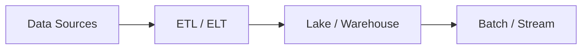

# 15. Big Data

> Status: **Done** — concise notes for all sub-topics below.

[← Back to master index](../README.md)

---

## At a glance

---

## Sub-topics

| # | Sub-topic |
|---|-----------|
| 15.1 | [Hadoop](#151-hadoop) |
| 15.2 | [Spark](#152-spark) |
| 15.3 | [Flink](#153-flink) |
| 15.4 | [ETL](#154-etl) |
| 15.5 | [ELT](#155-elt) |
| 15.6 | [Batch Processing](#156-batch-processing) |
| 15.7 | [Stream Processing](#157-stream-processing) |
| 15.8 | [Data Lake](#158-data-lake) |
| 15.9 | [Data Warehouse](#159-data-warehouse) |
| 15.10 | [Lakehouse Architecture](#1510-lakehouse-architecture) |

---

## 15.1 Hadoop

**Summary:** Open-source framework for distributed storage (HDFS) and batch processing (MapReduce) on commodity hardware.

- HDFS replicates blocks across nodes for fault tolerance
- MapReduce: map (parallel transform) → shuffle → reduce (aggregate)
- Largely superseded by Spark for interactive workloads; still used for cheap bulk storage

**References:** _None yet._

---

## 15.2 Spark

**Summary:** In-memory distributed compute engine — batch, SQL, streaming, and ML on a unified DAG model.

- Resilient Distributed Datasets (RDDs) and DataFrames with Catalyst optimizer
- 10–100× faster than MapReduce for iterative and interactive jobs
- Runs on YARN, Kubernetes, or standalone; integrates with Delta Lake, Hive

**References:** _None yet._

---

## 15.3 Flink

**Summary:** Stream-first processing engine with true event-time semantics, state, and exactly-once guarantees.

- Low-latency windowed aggregations and complex event processing (CEP)
- Handles late-arriving data via watermarks
- Use when sub-second latency and stateful streaming matter more than batch simplicity

**References:** _None yet._

---

## 15.4 ETL

**Summary:** Extract → Transform → Load — clean and reshape data before loading into the target warehouse.

- Transformations happen in a staging layer (Spark, dbt, Informatica)
- Schema-on-write — data arrives curated and typed
- Best when source data is messy and consumers need trusted, modeled tables

**References:** _None yet._

---

## 15.5 ELT

**Summary:** Extract → Load → Transform — load raw data first, transform inside the warehouse with SQL.

- Leverages cloud warehouse compute (Snowflake, BigQuery, Redshift)
- Schema-on-read in lake; schema enforced at query/transform time
- Faster ingestion; shifts transform cost to warehouse elastic compute

**References:** _None yet._

---

## 15.6 Batch Processing

**Summary:** Process large volumes of data on a schedule or trigger — hourly, daily, or ad hoc jobs.

- High throughput; latency measured in minutes to hours
- Examples: nightly reports, ML training, bulk reindexing
- Tools: Spark batch, Hadoop MapReduce, warehouse scheduled queries

**References:** _None yet._

---

## 15.7 Stream Processing

**Summary:** Continuous processing of events as they arrive — real-time dashboards, fraud detection, alerts.

- Window types: tumbling, sliding, session; keyed state per entity
- At-least-once default; exactly-once with idempotent sinks + checkpoints
- Tools: Flink, Kafka Streams, Spark Structured Streaming

**References:** _None yet._

---

## 15.8 Data Lake

**Summary:** Central repository storing raw data in open formats (Parquet, ORC, Avro) on cheap object storage.

- Schema-on-read — store everything now, interpret later
- Risk: becomes a "data swamp" without governance, catalog, and quality checks
- Examples: S3 + Delta/Iceberg/Hudi, ADLS, GCS

**References:** _None yet._

---

## 15.9 Data Warehouse

**Summary:** Structured, curated store optimized for SQL analytics — star/snowflake schemas, columnar storage.

- Schema-on-write; strong typing and ACID for curated business metrics
- Examples: Snowflake, BigQuery, Redshift, Synapse
- Serves BI tools, dashboards, and executive reporting

**References:** _None yet._

---

## 15.10 Lakehouse Architecture

**Summary:** Combines lake flexibility with warehouse reliability — ACID tables on object storage (Delta, Iceberg, Hudi).

- Single copy of data for batch and streaming; open formats avoid lock-in
- Metadata layer enables time travel, schema evolution, and efficient upserts
- Modern default for greenfield analytics platforms

**References:** _None yet._

---

## Quick Reference

| Sub-topic | Processing mode | Best for |
|-----------|-----------------|----------|
| **Hadoop** | Batch (MapReduce) | Legacy bulk jobs, HDFS storage |
| **Spark** | Batch + micro-batch | General-purpose big compute |
| **Flink** | True streaming | Low-latency stateful events |
| **ETL** | Transform before load | Messy sources, curated warehouse |
| **ELT** | Transform in warehouse | Cloud DW elastic SQL |
| **Batch** | Scheduled chunks | Reports, training, backfill |
| **Stream** | Continuous events | Real-time alerts, live metrics |
| **Data Lake** | Raw open storage | Cheap retention, ML features |
| **Data Warehouse** | Curated SQL analytics | BI, governed metrics |
| **Lakehouse** | Lake + ACID tables | Unified batch + stream analytics |

---

[← Back to master index](../README.md)
