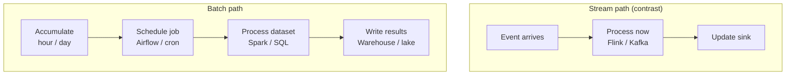
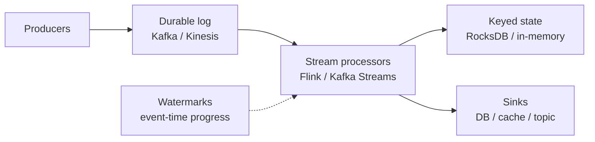
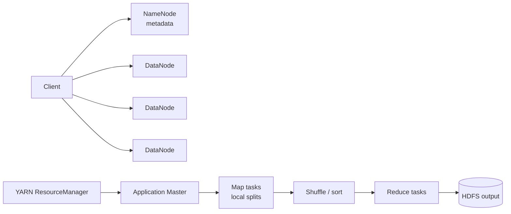
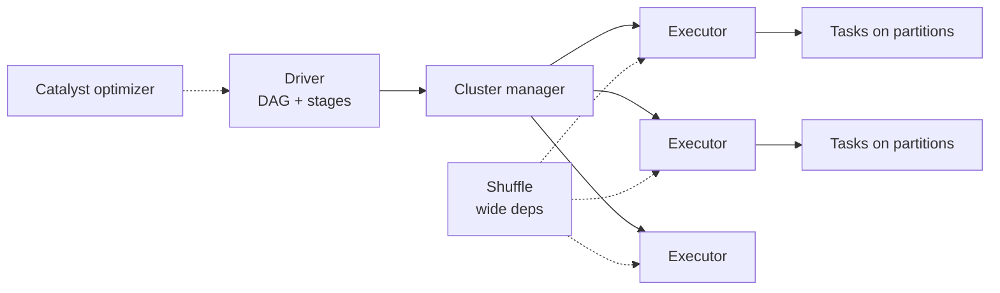
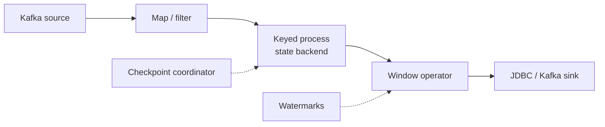
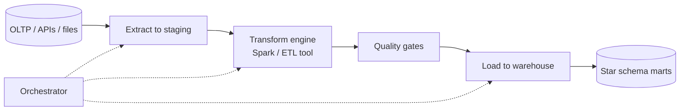
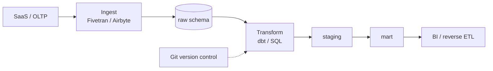
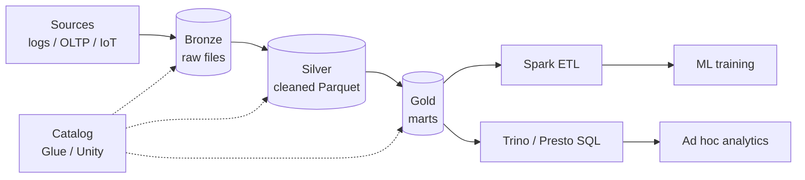
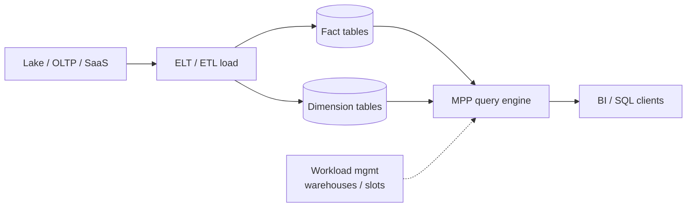
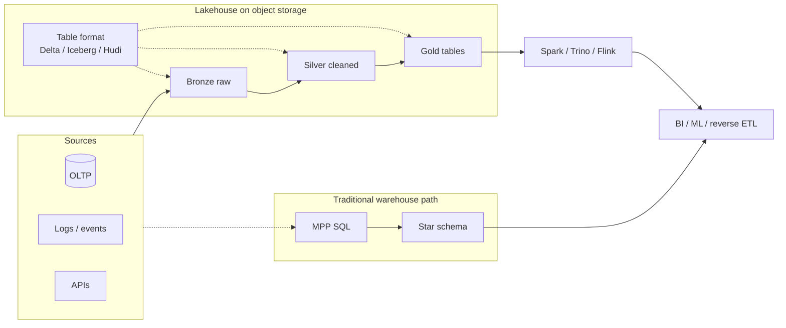

# 15. Big Data

[<- Back to master index](../README.md)

---

## Sub-topics

| # | Sub-topic |
|---|-----------|
| 15.1 | [Batch & Stream Processing](#151-batch-stream-processing) |
| 15.2 | [Processing Engines: Hadoop, Spark & Flink](#152-processing-engines-hadoop-spark-flink) |
| 15.3 | [ETL & ELT](#153-etl-elt) |
| 15.4 | [Data Lake, Warehouse & Lakehouse](#154-data-lake-warehouse-lakehouse) |

---


<a id="151-batch-stream-processing"></a>

## 15.1 Batch & Stream Processing

### Overview

Picture doing laundry once a week instead of washing each sock the moment it gets dirty. You pile everything into one load, run the machine once, and accept that clothes sit in the hamper for a few days. **Batch processing** works the same way for data: collect events or records over a window (an hour, a day), then process the whole pile in one coordinated job.

Technically, batch processing is a **bounded-data** execution model. A scheduler triggers a job when a partition is complete; engines such as Spark or MapReduce read the full input set, apply transformations, and write results in one pass. Throughput is maximized because the cluster amortizes startup, I/O, and shuffle costs across billions of rows. Latency is measured in minutes to hours — acceptable for reports, warehouse loads, and ML training, but not for fraud alerts or live dashboards.

---

### What problem it fixes

Per-event processing sounds ideal until you need to aggregate a day of click logs, rebuild a search index, or retrain a recommendation model on terabytes of history. Processing each row as an isolated micro-job wastes cluster overhead, makes global joins expensive, and complicates correctness when the input is still arriving.

Batch processing fixes the **scale vs simplicity** trade-off for analytics:

- **Snapshot correctness** — the job reads a fixed partition (`dt=2024-01-15`); everyone agrees on what "yesterday" means.
- **Cost efficiency** — spin up a large cluster for two hours nightly instead of paying for always-on stream infrastructure.
- **Idempotent replay** — re-run a failed partition without corrupting downstream tables.

When latency of seconds is unnecessary, batch is usually the default choice.

---

### What it does

A batch pipeline typically performs four stages:

1. **Land** — write raw or staged data to object storage or a warehouse staging area, usually partitioned by date or hour.
2. **Schedule** — Airflow, cron, or a data-volume trigger starts the job when the partition is ready.
3. **Process** — map-reduce, a Spark DAG, or `INSERT … SELECT` transforms the full dataset.
4. **Commit** — write results with idempotent semantics (partition overwrite, merge on primary key) so retries are safe.

The output feeds warehouses, BI tools, search indexes, billing reconciliations, and ML feature stores.

---

### How it works — the architecture inside



**Partitioning** is the central design lever. Paths like `s3://lake/events/dt=2024-01-15/` let jobs read only new days — incremental batch instead of full re-scan.

**Scheduling** ties to business SLAs: a nightly job must finish before the morning executive dashboard. Miss the window and analysts see stale numbers; cluster sizing and dependency ordering exist to hit that deadline.

**Idempotent writes** mean a retry after executor failure does not double-count revenue. Common patterns: overwrite the target partition, or `MERGE` on a natural key.

---

### Walkthrough: nightly sales aggregation

A retail company lands clickstream and order events into a data lake partitioned by `dt`.

```text
Day D closes at 23:59 UTC.
01:00 — Airflow sensor confirms dt=D partition has ≥ expected row count.
01:15 — Spark job reads s3://lake/orders/dt=D and s3://lake/clicks/dt=D.
        Join, dedupe on order_id, aggregate revenue by region.
02:30 — Overwrite warehouse table sales_daily partition dt=D.
03:00 — BI dashboard refreshes; analysts see yesterday's certified numbers.
```

If the Spark job fails at 02:00, Airflow retries. The second run overwrites the same partition — no duplicate rows.

**Backfill** after a bug fix replays historical partitions (`dt=2024-01-01` … `dt=2024-01-14`) with the corrected logic. Idempotent partition writes make this routine.

---

### Batch vs stream — when each fits

| Dimension | Batch | Stream |
|-----------|-------|--------|
| Latency | Minutes to hours | Milliseconds to seconds |
| Throughput model | Maximize per job | Per-event or micro-batch |
| Correctness | Snapshot of bounded input | Event time, watermarks, state |
| Cost at petabyte scale | Usually lower | Higher (always-on consumers) |
| Typical outputs | Reports, ML training, billing | Fraud, live dashboards, alerts |

**Lambda architecture** (legacy) ran a speed layer (stream) plus a batch layer plus a serving merge — powerful but operationally heavy. **Kappa** (stream-only with replay) is preferred when one engine can handle both real-time and historical reprocessing.

---

### Pitfalls and design tips

- **Do not stream by default** — if stakeholders accept T+1 data, batch is simpler, cheaper, and easier to debug.
- **Partition skew** — one hot key (`country=US`) can stall a batch job; salting or pre-aggregation helps.
- **SLA-driven sizing** — size clusters for worst-case partition volume (Black Friday), not average day.
- **Small files problem** — millions of tiny files per partition hurt listing and task scheduling; compact before heavy jobs.
- **Orchestration matters** — Airflow/Dagster dependency graphs prevent downstream marts from reading half-written upstream partitions.
- **Interview angle** — "process 10 TB daily" usually means partitioned lake + Spark + idempotent warehouse load, not a giant single file scan.

---

### Real-world example: Stripe-style billing reconciliation

Payment platforms reconcile captured charges against ledger entries nightly. Events land in object storage throughout the day; the batch window closes at midnight.

```text
Input:  billions of charge events partitioned by dt
Job:    Spark aggregates by merchant_id, flags mismatches vs ledger snapshot
Output: finance mart partition overwrite; anomaly report to ops
SLA:    complete before 06:00 local — drives EMR cluster size
```

Batch fits because finance needs a **complete, auditable snapshot** of the closed day, not a running approximate total. Retries and backfills are regulatory requirements; idempotent partition writes are non-negotiable.

---


### Stream processing

#### Overview

Imagine a security guard watching a live camera feed instead of reviewing yesterday's recording. Each person who walks in is assessed immediately — no waiting until end of day to notice someone suspicious. **Stream processing** treats data as an unending flow: every event is handled as it arrives (or in tiny micro-batches), with answers updated continuously.

Technically, stream processing consumes an **unbounded log** (Kafka, Kinesis, Pulsar). Stateful operators maintain per-key state (counts, windows, joins); results sink to databases, caches, or downstream topics. Latency is milliseconds to seconds. Delivery semantics — at-most-once, at-least-once, exactly-once — and **event time** (timestamps in the data, not on the wall clock) dominate system design.

---

#### What problem it fixes

Batch pipelines cannot answer "is this card fraudulent **right now**?" or "how many users are online **this second**?" Replicating OLTP databases to analytics stores via nightly dumps leaves hours of blind spots.

Stream processing fixes **time-sensitive correctness**:

- **Low-latency aggregations** — rolling counts, session windows, live leaderboards.
- **Change propagation** — CDC from OLTP to search indexes and read models without polling.
- **Decoupled microservices** — producers append events; consumers scale independently on a durable log.

Without a stream backbone, teams bolt on polling, cron hacks, or oversized caches that fail under burst traffic.

---

#### What it does

A typical streaming pipeline has four layers:

1. **Ingest** — append-only, partitioned log with retention and replay.
2. **Process** — consumers read partitions; keyed operations route related events to the same task for consistent state.
3. **Window** — tumbling, sliding, or session windows aggregate by **event time**, not processing time.
4. **Sink** — materialize to OLAP, key-value store, another topic, or push notification service.

The system runs continuously. Failure recovery relies on offset checkpoints and durable state backends.

---

#### How it works — the architecture inside



**Delivery semantics:**

| Semantic | Behavior | Trade-off |
|----------|----------|-----------|
| At-most-once | No retry on failure | Fast; may lose events |
| At-least-once | Retry on failure | Duplicates possible |
| Exactly-once | Idempotent sinks + transactional checkpoints | Hardest end-to-end; gold standard for billing |

**Watermarks** declare "no events older than T are expected." When a watermark passes window end, the window closes and emits a result — even if some late events were held in a buffer.

**Backpressure** — when sinks are slow, credit-based flow control (Flink) or consumer lag (Kafka) throttles upstream instead of OOMing workers.

**How to calculate:** Kafka retention storage

```text
Given:
  aggregate ingest = 40 MB/s across all partitions (compressed on disk ~40 MB/s)
  retention.ms = 7 days
  replication.factor = 3

Step 1 — Bytes per day:
  per_day = 40 MB/s × 86,400 s ≈ 3.45 TB/day

Step 2 — Retention window:
  raw_retention = 3.45 TB × 7 ≈ 24 TB

Step 3 — Replication:
  total_disk ≈ 24 TB × 3 ≈ 72 TB cluster-wide (same bytes on 3 brokers per partition)

Result: budget ~72 TB for this topic family before compaction or tiered storage

Sanity check: doubling retention to 14 days doubles disk linearly — retention is the cheapest "replay insurance"
  until it isn't; 40 MB/s × 30 days × 3 replicas ≈ 310 TB — plan tiered S3 or reduce retention.
```

**How to calculate:** stream processing lag

```text
Given:
  Kafka partition ingest = 6,000 events/s
  Flink operator sustained throughput = 5,000 events/s (same partition)
  current consumer lag = 12M events

Step 1 — Lag growth rate while overloaded:
  growth = 6,000 − 5,000 = 1,000 events/s

Step 2 — Time to add 1 hour of backlog at this rate:
  1,000/s × 3,600 s = 3.6M events per hour of lag growth

Step 3 — Catch-up time after ingest drops to 4,000/s (headroom 1,000/s for replay):
  catch_up = 12M / 1,000 = 12,000 s ≈ 3.3 hours

Result: lag grows 3.6M/hour until capacity ≥ ingest; clearing 12M backlog needs 3.3 h at 1k/s surplus

Sanity check: lag in "messages" ≠ lag in "time" — if burst was 5 minutes at 2× rate,
  backlog ≈ 6,000 × 300 = 1.8M events; at 5k/s steady state you never catch up without scaling out.
```

**CQRS / event sourcing** — the log is the source of truth; projections are derived views that can be rebuilt by replaying the stream.

---

#### Walkthrough: fraud scoring on card authorizations

```text
Event: { card_id, merchant, amount, event_time, geo }
Partition key: card_id → all events for one card hit the same Flink subtask.

Tumbling 5-minute window (event time):
  sum(amount), count(distinct merchant), velocity vs historical baseline
Watermark lag: 30 seconds allowed lateness for out-of-order events

Score > threshold → decline + alert topic → notification service
Score OK → approve (sink to approval topic within ~200 ms p99)
```

Late events after the allowed lateness are dropped or sent to a side output for manual review — a conscious product trade-off.

---

#### Pitfalls and design tips

- **Exactly-once is a pipeline property** — Kafka → Flink → JDBC only works if the sink supports idempotent writes or two-phase commit.
- **Processing time vs event time** — wall-clock windows break when consumers lag; always model event time for analytics.
- **State size** — unbounded keyed state (every user ever) needs TTL, compaction, or incremental rocksdb tuning.
- **Ordering** — guaranteed per partition key only; global order is expensive and usually unnecessary.
- **Kafka Streams vs Flink** — embedded library for simple app-local topologies; Flink for heavy stateful cluster processing and CEP.
- **Do not confuse with batch** — micro-batch (Spark Structured Streaming default) is near-real-time, not sub-second streaming.

---

#### Real-world example: LinkedIn activity feed (Kafka + Samza heritage)

Activity events (posts, likes, comments) append to Kafka. Stream processors maintain per-member fan-out graphs and ranking signals in near real time. Batch jobs still rebuild training data nightly, but the **live feed** is stream-driven: consumers read partitioned topics, update materialized views, and serve read paths within seconds.

The pattern — durable log, keyed state, replay on failure — is the standard template for "real-time analytics" interview answers when latency must stay under a second.

---


<a id="152-processing-engines-hadoop-spark-flink"></a>

## 15.2 Processing Engines: Hadoop, Spark & Flink

### Overview

Think of Hadoop as the first widely adopted way to store and crunch data across a warehouse full of cheap computers instead of one giant mainframe. Files are split into large blocks spread across many disks; computation moves to where the data already lives. It made petabyte-scale batch affordable for companies that could not buy a single machine big enough.

Technically, **Apache Hadoop** is an open-source framework whose core is **HDFS** (distributed file system) and **MapReduce** (batch compute model). **YARN** schedules cluster resources. The ecosystem added Hive (SQL), HBase (wide-column store), and more. MapReduce is largely superseded by Spark, but HDFS layout, data locality, and YARN concepts still appear in enterprise platforms and interviews about historical architecture.

---

### What problem it fixes

Before Hadoop, scaling data storage meant bigger SANs and bigger single boxes — expensive and eventually impossible. Hadoop fixed **horizontal scale on commodity hardware**:

- Store petabytes by replicating blocks across DataNodes.
- Process data in parallel with a simple Map → Shuffle → Reduce programming model.
- Tolerate node failure — replicas and task retries hide disk and machine loss.

It established the mental model that shaped modern cloud data lakes: **scale out, not up**.

---

### What it does

**HDFS** splits files into blocks (typically 128–256 MB), stores each block with replication (often 3×), and tracks metadata in a **NameNode**. Clients read/write blocks in parallel across DataNodes.

**MapReduce** runs Map tasks on local splits (map input to key-value pairs), shuffles and sorts by key across the network, then Reduce tasks aggregate. **YARN** allocates containers (CPU/memory) to MapReduce, Spark, Tez, and other applications on the same cluster.

**Data locality** — the scheduler prefers running a task on a node that already holds the input block, minimizing network shuffle for the map phase.

---

### How it works — the architecture inside



**NameNode** holds the namespace tree and block locations — a critical metadata service. Modern deployments use **HA NameNode** (active + standby) because a single NameNode was a notorious single point of failure.

**Hive** translates SQL to MapReduce, Tez, or Spark — the legacy path for SQL-on-Hadoop analytics.

---

### Walkthrough: word count on a 1 TB log file

```text
File split into ~4,000 blocks (256 MB each) across 200 DataNodes.
Map: each task reads local block, emits (word, 1).
Shuffle: framework sorts and groups by word across network.
Reduce: sum counts per word, write part-r files to HDFS.
```

The job takes minutes to hours — acceptable for offline analytics, unacceptable for interactive queries. That latency gap drove Spark's in-memory DAG model.

**How to calculate:** MapReduce map/reduce task count

```text
Given:
  input file = 2 TB on HDFS
  HDFS block size = 256 MB
  mapreduce.job.reduces = 64 (explicitly set)

Step 1 — Map tasks (one per input split, ≈ one per block):
  map_tasks = 2 TB / 256 MB = (2 × 1024 GB) / 0.256 GB = 8,192 map tasks

Step 2 — Reduce tasks:
  reduce_tasks = 64 (configured — not derived from input size)

Step 3 — Shuffle fan-in per reducer (uniform key distribution):
  avg_map_outputs_per_reducer ≈ 8,192 / 64 = 128 map spills merged per reduce

Result: 8,192 maps + 64 reduces; YARN must schedule thousands of map containers across the cluster

Sanity check: 2 TB with 128 MB blocks → 16,384 maps — block size directly halves map count;
  8,192 maps on a 200-node cluster ≈ 41 maps/node — reasonable; 8 maps on 200 nodes underutilizes the cluster.
```

---

### Hadoop vs modern cloud pattern

| Aspect | On-prem Hadoop | Cloud-native pattern |
|--------|----------------|----------------------|
| Storage | HDFS on local disks | S3, ADLS, GCS object stores |
| Compute | YARN cluster | EMR, Dataproc, Databricks (ephemeral) |
| SQL | Hive on MapReduce/Tez | Spark SQL, Trino, warehouse |
| Ops | Heavy — HA NameNode, rack awareness | Managed services; pay per job |

Many orgs **migrated storage to object stores** while keeping Spark on managed clusters — HDFS concepts (blocks, locality) still explain why co-locating compute with data matters.

---

### Pitfalls and design tips

- **Small files problem** — millions of files overwhelm NameNode metadata; use sequence files, HAR archives, or compaction.
- **MapReduce latency** — iterative ML and interactive SQL need Spark or a warehouse, not classic MR.
- **Not for streaming** — use Kafka + Flink; Hadoop batch is wrong tool for sub-second paths.
- **NameNode capacity** — billions of files is an architectural limit; object stores + table formats scale metadata differently.
- **Interview context** — mature enterprises may still run legacy Hive-on-HDFS; greenfield rarely starts here.

---

### Real-world example: early Facebook data warehouse on HDFS

Facebook's early analytics stack stored multi-petabyte logs on HDFS and ran Hive queries for product metrics. Data locality and rack-aware replication kept scan throughput high across thousands of commodity nodes. The company later moved toward object storage and Spark, but the **scale-out batch** pattern Hadoop pioneered is the direct ancestor of today's lakehouse designs.

---


### Apache Spark

#### Overview

If Hadoop MapReduce is a convoy of trucks making one delivery each trip, Spark is a fleet that loads many stops into memory, plans the whole route once, and only goes back to the warehouse when the truck is full. Repeated passes over the same data — joins, iterations, ML epochs — reuse cached partitions instead of re-reading from disk every time.

Technically, **Apache Spark** is a unified analytics engine: batch, SQL (Spark SQL), structured streaming, MLlib, and GraphX share a **DAG scheduler** and Catalyst optimizer. Transformations are lazy until an action triggers execution. It is the default batch and interactive engine on Databricks, EMR, and Dataproc — the usual answer when an interview asks how to process terabytes daily.

---

#### What problem it fixes

MapReduce materializes intermediate results to disk after every stage — painful for iterative algorithms and multi-stage ETL. Spark fixes **repeated distributed computation**:

- **In-memory lineage** — keep partitions in memory across narrow dependencies; spill to disk only when necessary.
- **Unified APIs** — same DataFrame code for batch and Structured Streaming (micro-batch).
- **Catalyst + Tungsten** — automatic predicate pushdown, column pruning, and codegen for SQL and DataFrame workloads.

Teams get one engine for ETL, ad hoc SQL, and feature engineering instead of maintaining separate MapReduce, Pig, and Hive paths.

---

#### What it does

1. **Driver** — builds a DAG of stages from transformations; negotiates with the cluster manager (YARN, Kubernetes, Mesos, standalone).
2. **Executors** — JVM workers on cluster nodes run **tasks** on **partitions** of the dataset.
3. **Transformations** — `map`, `filter`, `join` are lazy; lineage recorded, not executed.
4. **Actions** — `count`, `collect`, `write` trigger scheduling and execution.
5. **Shuffle** — wide dependencies (groupBy, join) redistribute data across partitions — the dominant cost center.

Spark SQL registers tables against a Hive metastore or Delta/Iceberg; analysts write SQL while engineers use Python (PySpark) or Scala.

---

#### How it works — the architecture inside



**RDD** (Resilient Distributed Dataset) is the legacy low-level API. **DataFrame/Dataset** with Catalyst is preferred — the optimizer pushes filters into Parquet readers and chooses join strategies.

**Partition count** drives parallelism. Rule of thumb: target ~128 MB per partition and roughly 2–3× total CPU cores across executors. Too few partitions → underutilized cluster; too many → task scheduling overhead.

**How to calculate:** partition row sizing

```text
Given:
  input Parquet = 640 GB for one day's partition (dt=2024-06-01)
  target ≈ 128 MB per Spark partition (scan + shuffle friendly)
  cluster = 32 executor cores total

Step 1 — Partition count from data size:
  partitions = 640 GB / 128 MB = 640 GB / 0.128 GB = 5,000 partitions

Step 2 — Parallelism check:
  5,000 tasks / 32 cores ≈ 156 waves — acceptable for overnight batch

Step 3 — Row-based cross-check (avg row 400 bytes):
  rows ≈ 640 GB / 400 B ≈ 1.6B rows → ~320K rows per partition at 5,000 parts

Result: repartition or read with ~5,000 partitions; or coalesce down if files already well-sized

Sanity check: 640 GB in 50 partitions = 12.8 GB each — long GC, stragglers, shuffle spikes;
  640 GB in 500,000 partitions — scheduler overhead dominates.
```

**Caching** (`persist`) keeps hot datasets in memory across iterations (ML training). `MEMORY_AND_DISK` spills gracefully on pressure.

---

#### Walkthrough: daily join of 500 GB clicks × 2 GB users

```text
Read clicks (partitioned by dt) and broadcast users (small dimension).
Catalyst chooses BroadcastHashJoin — users table sent to each executor once.
Filter, aggregate by user_id, write Parquet to gold layer.
Shuffle bytes: low (broadcast) vs SortMergeJoin on two huge tables (expensive).
```

If both sides are large, salting skewed keys or pre-aggregating before join avoids one reducer holding 90% of data.

**How to calculate:** Spark shuffle data volume

```text
Given:
  large table A = 200M rows after filter, ~180 bytes per row on shuffle key + payload
  join key = user_id (high cardinality — no broadcast)
  default spark.sql.shuffle.partitions = 200

Step 1 — Shuffle write (one side):
  shuffle_bytes ≈ 200M × 180 B ≈ 36 GB written to local disk per shuffle stage

Step 2 — Both sides of equi-join shuffle (if B is also large):
  total_shuffle ≈ 36 GB + size(B) — e.g. 36 + 4 GB ≈ 40 GB network + disk I/O

Step 3 — Per-reducer share (uniform hash):
  per_task ≈ 36 GB / 200 ≈ 180 MB — healthy

Result: expect ~40 GB shuffle traffic for this join; plan executor disk ≥ 2–3× shuffle spill headroom

Sanity check: if 90% of rows share one user_id, one reducer gets ~32 GB while others get KB —
  fix with salting or AQE skew join, not more shuffle partitions alone.
```

**Structured Streaming** — same DataFrame API; default micro-batch reads Kafka offsets every trigger interval. Continuous processing mode exists for lower latency but is narrower in scope than Flink.

---

#### Pitfalls and design tips

- **Shuffle is the enemy** — `groupByKey` on high-cardinality keys without aggregation first; prefer `reduceByKey` / pre-combine.
- **OOM on collect** — `collect()` or `toPandas()` on large results kills the driver; write to storage instead.
- **Skew** — salting, adaptive query execution (AQE), or two-phase aggregation for hot keys.
- **Driver failure** — kills the whole job; streaming jobs need checkpoint directories on durable storage.
- **Not true sub-second streaming** — micro-batch floor is typically hundreds of ms to seconds; use Flink for fraud-grade latency.
- **Default for new batch ETL** — Spark on managed cloud clusters unless workload is SQL-only in a warehouse.

---

#### Real-world example: Databricks nightly ETL on Delta Lake

A SaaS company runs PySpark jobs on Databricks: bronze JSON logs → silver deduped Parquet → gold dimensional models on Delta tables. `MERGE` handles CDC from operational replicas; Z-order optimizes file layout for common filters. One Spark codebase serves batch backfills and Structured Streaming ingestion from Kafka into the same Delta paths — the lakehouse pattern Spark popularized.

---


### Apache Flink

#### Overview

Spark Structured Streaming often checks the mailbox every few seconds and processes whatever piled up — fast enough for many dashboards, but not true continuous reaction. **Apache Flink** is the guard who never looks away: each event flows through operators immediately, with internal clocks based on when the event actually happened, not when the server finally read it.

Technically, Flink is a **stream-first** distributed engine. The DataStream API processes unbounded inputs operator-by-operator with chained execution. **Event time**, **watermarks**, **keyed state** (often RocksDB-backed), and **checkpointing** enable correct windowed aggregations and exactly-once recovery. Batch is implemented as bounded streams — streaming is the primary model, not an add-on.

---

#### What problem it fixes

Micro-batch systems approximate streaming but struggle with:

- **Sub-second latency** with predictable tail latencies.
- **Out-of-order events** — mobile clients, multi-region producers, clock skew.
- **Large keyed state** — session windows, stream-stream joins, CEP patterns across sequences.

Flink fixes **continuous correctness** for fraud, CDC pipelines, and real-time personalization where event-time semantics and durable checkpoints matter more than batch ergonomics.

---

#### What it does

1. **Ingest** — parallel sources (Kafka, Kinesis, files) with split assignment and offset tracking.
2. **Process** — operators form a logical graph; keyed streams route by hash(key) for consistent state locality.
3. **Window & CEP** — tumbling, sliding, session windows on event time; pattern matchers for sequences ("A then B within 5 min").
4. **Checkpoint** — periodic barrier-aligned snapshots of operator state and source offsets to durable storage (S3, HDFS).
5. **Sink** — transactional or idempotent writes for exactly-once end-to-end where supported.

Flink SQL provides relational APIs over streams and tables with changelog semantics.

---

#### How it works — the architecture inside



**Event time** — timestamps embedded in records drive window boundaries. **Processing time** is available but wrong for analytics when consumers lag.

**Watermarks** — `W(t)` means "no events with time < t are expected." Windows fire when the watermark passes `window_end + allowed_lateness`.

**Checkpointing** — Chandy-Lamport-style barriers flow through the graph; when all operators snapshot state and sources commit offsets, recovery replays from the last complete checkpoint.

**State backends** — RocksDB for large keyed state on disk; heap for small state (faster, limited by memory).

---

#### Walkthrough: CDC with Debezium → Flink → warehouse

```text
Debezium reads MySQL binlog → Kafka topic orders_changelog.
Flink SQL: CREATE TABLE orders (...) WITH ('connector' = 'kafka', ... changelog);
Keyed by order_id; upsert sink to Iceberg or JDBC with exactly-once sink connector.

Out-of-order updates: event-time watermark 10s; late rows update state if within lateness.
Checkpoint every 60s → on failure, restart from last checkpoint, no duplicate charges.
```

**CEP** example: three failed login events from same IP within 2 minutes → security alert topic.

---

#### Flink vs Spark Structured Streaming

| Dimension | Flink | Spark Structured Streaming |
|-----------|-------|----------------------------|
| Model | Native streaming | Micro-batch (default) |
| Event time | First-class watermarks | Supported; micro-batch boundaries add jitter |
| Latency | Sub-second typical | Often seconds |
| State | RocksDB, large keyed state | State store; improving but Flink leads for heavy state |
| Ecosystem / hiring | Smaller pool | Larger Spark talent pool |

---

#### Pitfalls and design tips

- **State TTL** — unbounded `MapState` for user sessions needs expiration or state grows without limit.
- **RocksDB tuning** — block cache, incremental checkpoints, and local SSD matter at scale.
- **Exactly-once sink support** — verify Kafka, JDBC, and file sinks in your version; end-to-end is never free.
- **Operational complexity** — JVM heap + off-heap + RocksDB; monitor checkpoint duration and backpressure.
- **Kafka Streams** — simpler for embed-in-app topologies without a cluster; Flink when you need CEP, SQL over streams, or massive state.
- **Interview default** — "real-time fraud" → Kafka + Flink + event time + exactly-once sinks.

---

#### Real-world example: Alibaba Double 11 real-time metrics

Alibaba uses Flink at extreme scale for live transaction metrics during shopping festivals — aggregating orders and payments with low latency across regions. Event-time processing and checkpoint recovery keep dashboards accurate despite burst traffic and out-of-order mobile payments. The architecture (Kafka ingest, Flink aggregation, sink to OLAP) is the reference design for high-stakes real-time analytics.

---


<a id="153-etl-elt"></a>

## 15.3 ETL & ELT

### Overview

Think of ETL like a factory quality line: raw materials arrive from suppliers, get inspected and assembled on the factory floor, and only **finished products** enter the retail store. Customers never see rusty parts or mislabeled crates. **Extract, Transform, Load** pulls data from sources, applies business rules in a staging engine, then loads clean modeled tables into the warehouse.

Technically, ETL is an integration **pattern**, not a single product. Extract from OLTP databases (often via CDC), APIs, files, and logs into a staging area. Transform applies deduplication, joins, slowly changing dimensions (SCD), and data quality gates. Load writes star or snowflake schemas ready for BI. Orchestrators (Airflow, Dagster) manage dependencies, retries, and SLAs.

---

### What problem it fixes

Dumping raw operational data straight into analyst-facing tables exposes:

- **PII and schema chaos** — mixed types, orphaned keys, duplicate rows.
- **Source system load** — heavy transforms on production databases starve OLTP.
- **Uncertified metrics** — every analyst reinvents joins differently.

ETL fixes **governed analytics ingress** — transform and validate **before** the warehouse exposes data. Source systems stay protected behind extract windows; analysts see curated marts.

---

### What it does

1. **Extract** — pull incremental or full snapshots to staging (files, landing tables). CDC (Debezium, GoldenGate) captures changes without full-table scans.
2. **Transform** — apply business rules, surrogate keys, SCD Type 2 history (`valid_from` / `valid_to`), conform dimensions across sources.
3. **Load** — insert into fact and dimension tables; reject or quarantine bad rows.
4. **Orchestrate** — DAG of tasks with sensors (partition ready), retries, and alerting on SLA miss.

Legacy tools (Informatica, DataStage) and modern Spark jobs both implement the same pattern; the staging transform step is the distinguishing feature versus ELT.

---

### How it works — the architecture inside



**Staging area** isolates failures — a bad transform does not corrupt production OLTP or published marts.

**SCD Type 2** — when a customer's address changes, close the old dimension row and insert a new one so historical facts still join to the address that was true at transaction time.

**Incremental vs full** — nightly full dimension reloads are simple but slow; CDC incremental loads reduce extract window and RPO for analytics.

---

### Walkthrough: nightly customer dimension with SCD Type 2

```text
Extract: CDC stream of customers → staging.customers_raw (append).
Transform:
  Compare hash of business columns vs current warehouse dim_customer.
  Changed row → close previous (valid_to = yesterday), insert new (valid_from = today).
  Unchanged → skip.
Load: merge into warehouse.dim_customer; facts unchanged, history preserved.
```

Auditors can answer "what address did we ship to on 2023-06-01?" because dimension history is explicit.

---

### ETL vs ELT (preview)

| Aspect | ETL | ELT |
|--------|-----|-----|
| Transform location | Staging / external engine | Inside warehouse/lakehouse |
| Warehouse role | Curated destination | Raw landing + compute |
| Quality gate | Before load | After load (dbt tests) |
| Best when | Legacy DW, strict pre-load governance | Cloud DW with elastic SQL/Spark |

See [15.3 — ELT](#elt) for the modern cloud-native flip.

---

### Pitfalls and design tips

- **Monolithic ETL jobs** — one 10,000-line Informatica mapping becomes undeployable; modularize by domain.
- **Transform bottleneck** — dedicated ETL servers scale poorly vs warehouse compute; evaluate ELT for greenfield.
- **Source extraction windows** — long-running extracts lock tables or inflate redo logs; prefer CDC.
- **Idempotent loads** — reruns after failure must not duplicate facts; use merge keys or partition overwrite.
- **Regulated industries** — auditable transform logic outside production DBs still favors classic ETL for some compliance teams.

---

### Real-world example: enterprise Informatica → Oracle warehouse

Large banks historically ran Informatica PowerCenter on staging servers: extract from core banking OLTP overnight, apply hundreds of validation rules, load Oracle Exadata marts for regulatory reporting. Analysts never queried raw core tables. The pattern is declining for new builds but remains the operational reality in many Fortune 500 data shops — understanding ETL explains why "we can't just query production."

---


<a id="elt"></a>

### ELT

#### Overview

ELT flips the factory metaphor: ship all raw materials straight into the warehouse loading dock, then use the warehouse's own industrial robots to assemble products on site. You do not maintain a separate factory floor — the target platform's compute is the transform engine.

Technically, **Extract, Load, Transform** lands **raw** data first into a warehouse or lakehouse (`raw` / `bronze` schema), then transforms run in-place with SQL, Spark, or **dbt** models. Ingestion tools (Fivetran, Airbyte) handle extract/load; transformation is version-controlled in Git. Cloud warehouses (Snowflake, BigQuery, Redshift) and Databricks scale compute elastically — cheaper than sizing dedicated ETL servers for peak transform load.

---

#### What problem it fixes

Classic ETL sized transform servers for peak load and duplicated data movement (source → ETL → warehouse). Cloud warehouses offer **separable storage and compute** — spin up larger warehouses for heavy transforms, scale to zero when idle.

ELT fixes **time-to-insight and iteration speed**:

- Raw layer preserves source fidelity — replay transforms when business rules change without re-extracting from OLTP.
- Analysts and analytics engineers iterate on SQL/dbt models without waiting on a central ETL team.
- Ingestion SaaS connectors reduce bespoke extract code.

---

#### What it does

1. **Extract & load** — replicate tables or files to `raw` with minimal typing (Fivetran, Airbyte, Stitch).
2. **Transform in warehouse** — layered models: `staging` → `intermediate` → `mart` via dbt, Spark SQL, or native SQL.
3. **Test & document** — dbt tests (unique, not_null, relationships), lineage, and docs generated from the repo.
4. **Orchestrate** — Airflow/Dagster triggers dbt runs after sync completes; incremental models merge only changed rows.

Separation of concerns: ingestion vendor vs transform repo vs orchestration vs warehouse compute billing.

---

#### How it works — the architecture inside



**Incremental models** — `merge` on `updated_at` or dbt `incremental` strategy processes only new/changed rows, keeping nightly runs fast at billion-row scale.

**Compute isolation** — Snowflake virtual warehouses or BigQuery reservations separate ELT transform load from ad hoc analyst queries.

---

#### Walkthrough: Fivetran + dbt on Snowflake

```text
Fivetran syncs Salesforce accounts → raw.salesforce_accounts (every 15 min).
dbt staging: clean column names, cast types, filter deleted rows.
dbt mart: dim_account with SCD logic in SQL; fct_opportunity joined to dim.
dbt test: account_id unique, not null; relationship to opportunities.
Airflow: sensor waits for Fivetran sync → dbt run → notify Looker refresh.
```

Business rule change (new field mapping)? Edit dbt model, rerun from staging — raw history unchanged.

---

#### Pitfalls and design tips

- **Raw data exposure** — ACL on `raw` schemas is critical; PII lands before masking in transform layer.
- **Warehouse cost spikes** — bad SQL (cartesian join) on large tables burns credits; use query monitors and dbt limits.
- **Quality not gated until transform** — dbt tests must run before promoting to `mart`; treat tests as deploy gates.
- **Not for tiny teams on tiny data** — overhead of Fivetran + dbt + Airflow may exceed a single Python script until complexity grows.
- **Modern stack default** — Fivetran/Airbyte + Snowflake/BigQuery + dbt + Airflow is the interview answer for greenfield analytics.
- **Lakehouse ELT** — same pattern on bronze/silver/gold with Spark/dbt-on-Databricks instead of warehouse-only SQL.

---

#### Real-world example: JetBlue analytics on Snowflake + dbt

Airlines and travel companies widely adopted the modern data stack: SaaS and operational sources replicate into Snowflake; analytics engineers maintain dbt projects in Git with CI testing. Marketing, operations, and finance consume shared marts with documented lineage. ELT shortened the cycle from "new Salesforce field" to "field in dashboard" from weeks (ticket to ETL team) to hours (dbt PR merge).

---


<a id="154-data-lake-warehouse-lakehouse"></a>

## 15.4 Data Lake, Warehouse & Lakehouse

### Overview

A data lake is like a vast, cheap archive warehouse where you store **everything** — boxes of raw logs, JSON exports, CSV dumps, images — without deciding upfront how each box will be shelved. Structure is applied when someone actually opens a box to work with it (**schema-on-read**), not when it arrives.

Technically, a **data lake** is centralized storage on **object stores** (S3, ADLS, GCS) holding raw, semi-structured, and structured data at any scale in open formats (Parquet, ORC, Avro, JSON). Compute (Spark, Trino, Presto) spins up on demand — storage and processing are decoupled. **Medallion architecture** (bronze → silver → gold) and table formats (Delta, Iceberg, Hudi) add governance without sacrificing lake economics.

---

### What problem it fixes

Warehouses are expensive for petabyte retention and poor homes for unstructured blobs. OLTP databases cannot hold years of logs and IoT telemetry. Siloed team copies create inconsistent metrics.

A data lake fixes **cheap durable retention + flexible analytics**:

- One organizational copy of data for batch, ML, and exploratory science.
- Pay object-store rates instead of warehouse storage pricing for cold history.
- Attach different engines (Spark for ETL, Trino for SQL) to the same files.

---

### What it does

1. **Ingest** — land raw data in **bronze** (as-is from sources).
2. **Clean & conform** — **silver** layer: deduplicated, typed, joined across sources.
3. **Curate** — **gold** business marts: aggregates, dimensions certified for downstream use.
4. **Catalog** — Hive Metastore, AWS Glue, Unity Catalog, or Polaris register paths, schemas, and ACLs.

Queries apply schema at read time unless enforced by table formats or gold-layer contracts.

---

### How it works — the architecture inside



**Open formats:**

| Format | Strength |
|--------|----------|
| Parquet | Columnar; analytics scans; compression |
| Avro | Row-oriented; schema evolution in streaming |
| JSON | Human-readable; flexible; expensive at scale |

**Partitioning** — `s3://lake/events/dt=2024-01-15/hour=14/` enables partition pruning; queries that filter on `dt` skip most objects.

**Table formats** (Delta, Iceberg, Hudi) add ACID transactions, time travel, and schema evolution on top of Parquet files — bridge toward lakehouse ([15.4 — Lakehouse architecture](#lakehouse-architecture)).

---

### Walkthrough: IoT telemetry landing to gold

```text
Bronze: Kafka Connect writes Avro records to s3://lake/telemetry/bronze/dt=…/hour=…/
Silver: Spark job dedupes by device_id+timestamp, casts types, drops malformed rows.
Gold: hourly rollups per device_id → Parquet for reliability dashboards.
Analyst: Trino query SELECT … FROM gold.device_hourly WHERE dt = current_date - 1
Cost: partition prune reads ~2% of bucket objects vs full bucket scan.
```

Without catalog and ownership, bronze fills with orphan paths — the **data swamp** anti-pattern.

---

### Pitfalls and design tips

- **Data swamp** — no catalog, lineage, or owners → unusable hoard; assign domain owners per gold table.
- **No ACID by default** — concurrent writers corrupt Parquet directories; use Delta/Iceberg/Hudi or single-writer discipline.
- **Small files** — streaming ingest creates millions of files; schedule compaction jobs.
- **Governance** — classify PII at bronze; mask before gold exposure.
- **Query performance varies** — unlike warehouse MPP, lake SQL depends on file layout, stats, and partition design.
- **Pair with warehouse** — lake for raw/history/ML; warehouse ([15.4 — Data warehouse](#data-warehouse)) for certified BI when teams want managed SQL SLAs.

---

### Real-world example: Netflix data platform on S3 + Iceberg

Netflix stores exabytes of operational and viewing data on S3. Apache Iceberg (born at Netflix) provides hidden partitioning, snapshot isolation, and engine-agnostic table metadata so Spark, Flink, and Trino share one logical table without dual pipelines. The pattern — cheap object storage, open formats, catalog, medallion layers — is the enterprise standard for "all data in one place."

---


<a id="data-warehouse"></a>

### Data warehouse

#### Overview

A data warehouse is the curated library reading room: only catalogued, bound books on approved shelves, with a librarian who knows how to find aggregates fast. You do not dump random PDFs here — you store **modeled, structured** data optimized for questions like "revenue by region last quarter."

Technically, a **data warehouse** is an **OLAP** system: columnar storage, compression, star or snowflake schemas, and a **massively parallel processing (MPP)** query engine. Examples include Snowflake, BigQuery, Redshift, ClickHouse, and Synapse. BI tools (Looker, Tableau, Power BI) connect via SQL. Workloads are read-heavy aggregations over billions of rows — the opposite of OLTP row stores tuned for point reads and transactions.

---

#### What problem it fixes

Running analytics on production OLTP databases starves transactional workloads and lacks historical modeling. Spreadsheets and one-off SQL on replicas produce inconsistent KPIs.

A warehouse fixes **certified, fast SQL analytics**:

- Conformed dimensions and fact tables — one definition of "active user" or "net revenue."
- Columnar scans read only needed columns for `SUM`, `GROUP BY`.
- Workload isolation — ELT transforms do not block executive dashboards (separate warehouses/queues).

---

#### What it does

1. **Model** — facts (measurable events) and dimensions (context: time, product, geography) in star schema.
2. **Load** — via ETL or ELT from operational systems and lakes.
3. **Optimize** — sort keys, clustering, materialized views, result caching.
4. **Serve** — SQL to BI, reverse ETL to SaaS tools, and embedded analytics APIs.

**Data marts** — departmental subsets (sales mart, finance mart) simplify access and row-level security.

---

#### How it works — the architecture inside



**OLTP vs OLAP:**

| | OLTP | OLAP (warehouse) |
|---|------|------------------|
| Access pattern | Point reads/writes | Scan + aggregate |
| Storage | Row-oriented | Columnar |
| Schema | Normalized (3NF) | Denormalized star |
| Users | Applications | Analysts, BI |

**Materialized views** precompute expensive joins or rollups — refresh on schedule or incrementally.

**Workload management** — Snowflake virtual warehouses, BigQuery reservations/slots, Redshift WLM queues prevent one heavy job from freezing the cluster.

---

#### Walkthrough: executive revenue dashboard query

```text
fct_orders JOIN dim_date JOIN dim_region
WHERE dim_date.fiscal_quarter = '2024-Q1'
GROUP BY dim_region.name
→ columnar scan reads order_amount + region_key only
→ MPP splits date range across nodes, merges partial sums
→ sub-second response on billions of rows (properly clustered)
```

Certified metric: `net_revenue = gross - refunds` defined once in dbt mart, not re-derived in every Looker tile.

---

#### Warehouse vs data lake

| Dimension | Warehouse | Data lake |
|-----------|-----------|-----------|
| Data types | Structured, modeled | Raw + all types |
| Storage cost at PB | Higher | Lower (object store) |
| Schema | Enforced on write (gold) | Schema-on-read (bronze) |
| Best for | BI, certified metrics | ML features, raw retention |
| Typical pairing | Gold curated layer | Bronze/silver upstream |

Modern platforms blur the line via external tables and lakehouse formats — but the **mental model** remains essential in interviews.

---

#### Pitfalls and design tips

- **Petabyte warehouse bill** — long-term raw history belongs in the lake; warehouse holds hot, curated subsets.
- **Schema rigidity** — quick schema changes need migration discipline; use staging views during transitions.
- **Not for OLTP** — never point your checkout API at the warehouse.
- **ELT cost control** — monitor credit burn from analyst SQL and transform jobs separately.
- **ClickHouse** — warehouse-class column store optimized for real-time analytics; different ops model than Snowflake but same OLAP family.
- **Interview contrast** — "OLTP vs OLAP" and when to route operational vs analytical queries.

---

#### Real-world example: Snowflake multi-tenant analytics at DoorDash

Marketplace companies consolidate orders, dasher activity, and merchant metrics into Snowflake marts. Separate virtual warehouses isolate ELT (large) from BI (interactive). Row access policies enforce market-level security. Reverse ETL syncs aggregated segments back to marketing tools. The warehouse is the **certified metrics layer** — not the system of record for live order state (that stays OLTP).

---


<a id="lakehouse-architecture"></a>

### Lakehouse architecture

#### Overview

For years, organizations ran two parallel systems: a cheap messy lake for everything raw, and an expensive tidy warehouse for BI — plus brittle sync jobs between them. A **lakehouse** is the attempt to have one building serve both purposes: warehouse-grade reliability and SQL performance on lake-priced object storage.

Technically, a lakehouse stores **Parquet** (or similar) on S3/ADLS/GCS with an open **table format** layer — **Delta Lake**, **Apache Iceberg**, or **Apache Hudi** — that adds ACID transactions, schema enforcement, time travel, and concurrent read/write safety. Spark, Flink, Trino, and Presto share the same tables. Batch, streaming, ML, and SQL converge on one copy of data instead of lake→warehouse ETL tax.

---

#### What problem it fixes

Dual-platform architecture caused:

- **Duplicate storage and sync** — same data in lake files and warehouse tables, diverging over time.
- **Stale BI** — warehouse loads lag lake ingestion by hours.
- **ML vs SQL split** — data scientists read raw lake paths; analysts read warehouse; neither trusts the other's numbers.

The lakehouse fixes **single source of truth on open storage** — ACID and catalog semantics without proprietary warehouse-only file layouts.

---

#### What it does

1. **Store** — Parquet files on object storage with table-format metadata (transaction log, manifests).
2. **Transact** — concurrent writers commit atomically; readers see consistent snapshots.
3. **Time travel** — query `VERSION AS OF` timestamp or snapshot ID for audit and rollback.
4. **Unify engines** — Spark/Flink for ETL and streaming; Trino/Presto for interactive SQL; same gold tables.
5. **Govern** — Unity Catalog, Polaris, or Glue register tables, lineage, and fine-grained ACLs.

Medallion bronze → silver → gold layers often live entirely inside the lakehouse.

---

#### How it works — the architecture inside



**Delta Lake** — Databricks-native; deep Spark integration; UniForm interoperability reads Iceberg/Hudi metadata.

**Iceberg** — engine-agnostic hidden partitioning; snapshot branches/tags; widely adopted across AWS, Netflix, Apple stacks.

**Hudi** — upsert/delete-heavy workloads; incremental processing and record-level indexing focus.

---

#### Walkthrough: unified batch + stream on Delta

```text
Bronze: Kafka → Spark Structured Streaming → Delta bronze.events (append).
Silver: batch + stream MERGE on event_id, dedupe, parse JSON fields.
Gold: Delta gold.daily_active_users — BI reads via SQL warehouse endpoint or Trino.
Bug in silver logic: time travel SELECT * FROM silver.events VERSION AS OF 42
                     fix job, replay from bronze checkpoint.
ML: same gold.features table → Spark MLlib without export to separate filesystem.
```

One logical table, multiple engines — no nightly "sync lake to Snowflake" job for core metrics.

---

#### Lakehouse vs warehouse — choosing a lane

| Dimension | Lakehouse | Managed warehouse |
|-----------|-----------|-------------------|
| Storage economics | Object store pricing | Higher managed storage |
| Open formats | Parquet + open metadata | Often proprietary |
| Multi-engine | Spark + Flink + Trino | Primarily SQL MPP |
| Ops burden | Platform engineering | Vendor-managed SLAs |
| BI certification | You build governance | Mature analyst UX |

Many orgs run **both** — lakehouse for data platform and ML; warehouse for departmental BI with strict SLAs — linked via external tables or sharing.

---

#### Pitfalls and design tips

- **Table format choice** — Iceberg for multi-engine neutrality; Delta if all-in on Databricks; Hudi for heavy upsert CDC.
- **Lock-in risk** — proprietary features on one format may complicate migration; prefer open catalog APIs.
- **Performance tuning** — Z-order, compaction, file sizing, and stats collection are your job vs vendor auto-tuning.
- **BI certification** — gold tables still need metric owners, dbt tests, and access policies.
- **Small file compaction** — streaming writes need scheduled `OPTIMIZE` / compaction or queries degrade.
- **Greenfield default** — Databricks/Snowflake external tables/BigQuery BigLake — interview answer for "one platform for batch, stream, ML, SQL."

---

#### Real-world example: Databricks lakehouse on Delta Lake

Databricks coined "lakehouse" and ships Delta Lake as the default table format: ACID on S3/ADLS, Unity Catalog for governance, Photon-accelerated SQL, and shared tables for MLflow feature stores. Customers migrate off dual lake+warehouse pipelines by promoting silver/gold Delta tables to SQL-accessible endpoints while Spark jobs and Flink (via partner integrations) write the same storage layer. Time travel supported regulatory replay when a pipeline bug affected published metrics — recompute from an earlier snapshot without re-ingesting years of raw data.

---


[<- Back to master index](../README.md)
