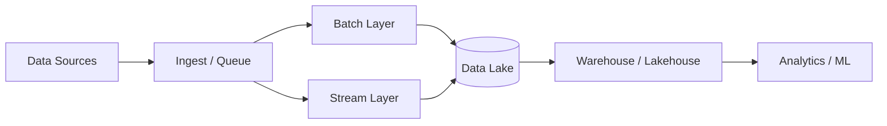
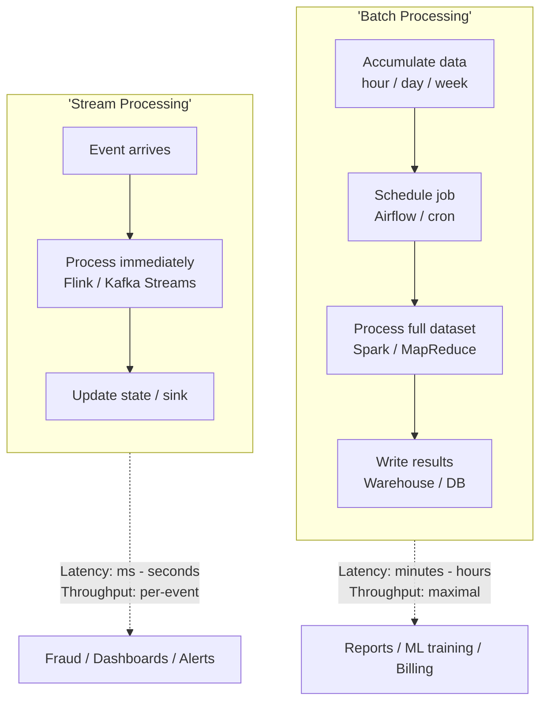
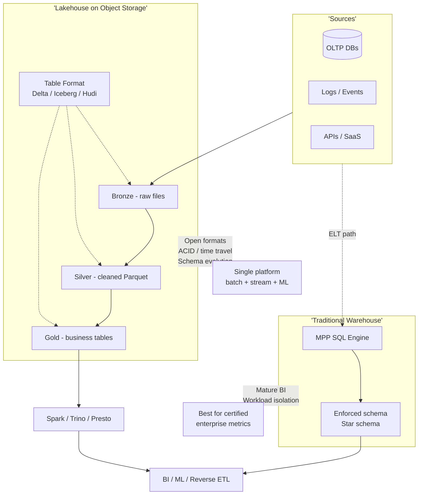

# 15. Big Data

> Status: **Documented**  -  self-contained master reference for distributed processing frameworks, data pipelines, and modern data platform architectures.

[<- Back to master index](../README.md)

---

## Sub-topics

| # | Sub-topic | Status |
|---|-----------|--------|
| 15.1 | [Batch Processing](#151-batch-processing) | Done |
| 15.2 | [Stream Processing](#152-stream-processing) | Done |
| 15.3 | [Hadoop](#153-hadoop) | Done |
| 15.4 | [Spark](#154-spark) | Done |
| 15.5 | [Flink](#155-flink) | Done |
| 15.6 | [ETL](#156-etl) | Done |
| 15.7 | [ELT](#157-elt) | Done |
| 15.8 | [Data Lake](#158-data-lake) | Done |
| 15.9 | [Data Warehouse](#159-data-warehouse) | Done |
| 15.10 | [Lakehouse Architecture](#1510-lakehouse-architecture) | Done |

---

## 15.1 Batch Processing

### What is it

**Batch processing** collects data over a period (hour, day), then processes the entire dataset as one job  -  high throughput, higher latency. Contrast with stream processing which handles events individually as they arrive.

### Why it matters

Most analytics, reporting, ML training, and billing reconciliation are batch. Choosing batch vs stream affects architecture, cost, and correctness guarantees  -  a core system design decision.

### How it works

1. **Land** data in lake/warehouse staging (files, partitions by date).
2. **Schedule** job when batch is complete (wall-clock or data-volume trigger).
3. **Process** full partition  -  map-reduce, Spark DAG, SQL INSERT-SELECT.
4. **Idempotent writes**  -  safe to rerun failed batch (partition overwrite, merge keys).

### Key details

- **Partitioning** by `dt=2024-01-15` enables incremental batch  -  process only new days.
- **Lambda architecture** (legacy): speed layer (stream) + batch layer + serving merge  -  complex; **Kappa** (stream-only) preferred when possible.
- **SLA:** batch jobs must finish before business morning  -  drives cluster sizing.
- **Backfill:** reprocess historical partitions after bug fix  -  design pipelines idempotently.

### When to use

- Daily/hourly reports, warehouse loads, search index rebuilds, ML model retraining.
- When latency of minutes - hours is acceptable.
- Very large datasets where per-event processing cost is prohibitive.

### Trade-offs

| Pros | Cons |
|------|------|
| Maximum throughput | High latency |
| Simpler correctness (snapshot input) | Data stale until job completes |
| Cost-efficient at scale | Failure delays entire batch window |
| Easy idempotent replay | Not suitable for real-time alerts |

### References

- _Add links from [System Design Fundamentals.xlsx](../System%20Design%20Fundamentals.xlsx) as you collect them._

---

## 15.2 Stream Processing

### What is it

**Stream processing** handles unbounded data event-by-event (or micro-batch) as it arrives  -  continuous computation with low latency for stateful aggregations, joins, and pattern detection.

### Why it matters

Real-time fraud, live dashboards, inventory sync, and push notifications require stream processing. Interview designs for "real-time analytics" need Kafka + Flink/Streams architecture with delivery semantics clarity.

### How it works

1. **Ingest:** Kafka, Kinesis, Pulsar  -  durable, partitioned log.
2. **Process:** consumers read partitions; keyed operations maintain per-key state.
3. **Window:** aggregate events in tumbling/sliding/session windows by event time.
4. **Sink:** write to DB, cache, another topic, or OLAP store.

### Key details

- **Delivery semantics:** at-most-once (fast, lossy), at-least-once (retry, duplicates), exactly-once (idempotent sinks + transactional checkpoints).
- **Watermarks:** declare "no events older than T expected"  -  trigger window closes.
- **Backpressure:** slow consumers throttle producers  -  Flink credit-based flow control.
- **CQRS / event sourcing:** stream as source of truth; projections materialize views.

### When to use

- Latency requirements under seconds  -  fraud, monitoring, live leaderboards.
- CDC pipelines replicating OLTP changes to search/analytics stores.
- Event-driven microservices choreography with stream backbone.

### Trade-offs

| Pros | Cons |
|------|------|
| Low latency insights | Complex state management |
| Continuous operation | Exactly-once is hard end-to-end |
| Handles unbounded data | Ordering and late events tricky |
| Decouples producers/consumers | Operational overhead (Kafka + Flink) |

### References

- _Add links from [System Design Fundamentals.xlsx](../System%20Design%20Fundamentals.xlsx) as you collect them._

---

## 15.3 Hadoop

### What is it

**Apache Hadoop** is an open-source framework for distributed storage and batch processing of petabyte-scale data across commodity clusters. Core components: **HDFS** (storage) and **MapReduce** (compute).

### Why it matters

Hadoop pioneered the "scale-out on cheap hardware" paradigm. While MapReduce is largely superseded by Spark, HDFS concepts, YARN resource management, and the Hadoop ecosystem (Hive, HBase) remain foundational in enterprise data platforms.

### How it works

1. **HDFS:** files split into blocks (128 - 256 MB); each block replicated 3× across DataNodes; NameNode tracks metadata.
2. **MapReduce:** Map tasks process local splits -> shuffle/sort -> Reduce tasks aggregate.
3. **YARN:** cluster resource manager allocates containers to applications (MapReduce, Spark, Tez).
4. Data locality: schedule compute on nodes holding the data  -  minimizes network shuffle.

### Key details

- **NameNode** is a single point of failure  -  HA with standby NameNode in modern deployments.
- **Small files problem:** many tiny files overwhelm NameNode metadata  -  use sequence files or HAR.
- **Hive** SQL-on-Hadoop translates to MapReduce/Tez/Spark  -  legacy analytics path.
- Cloud shift: data on **S3/ADLS** with EMR/Dataproc replacing on-prem HDFS for many orgs.

### When to use

- Legacy on-prem batch pipelines already on Hadoop.
- Very large cold storage with infrequent batch scans (declining vs cloud object stores).
- Understanding historical architecture in mature enterprises.

### Trade-offs

| Pros | Cons |
|------|------|
| Proven petabyte scale | MapReduce high latency (minutes to hours) |
| Commodity hardware | NameNode metadata bottleneck |
| Rich ecosystem | Ops-heavy; Java-centric MR |
| Data locality | Not suitable for low-latency or streaming |

### References

- _Add links from [System Design Fundamentals.xlsx](../System%20Design%20Fundamentals.xlsx) as you collect them._

---

## 15.4 Spark

### What is it

**Apache Spark** is a unified analytics engine for large-scale data processing  -  in-memory batch, SQL (Spark SQL), streaming (Structured Streaming), ML (MLlib), and graph (GraphX) with DAG-based execution up to 100× faster than MapReduce for iterative workloads.

### Why it matters

Spark is the default batch/interactive processing engine on cloud data platforms (Databricks, EMR, Dataproc). Interview questions on "process 10 TB daily" usually involve Spark architecture  -  driver, executors, shuffle, partitions.

### How it works

1. **Driver** builds DAG of transformations; **executors** run tasks on partitions.
2. **Transformations** (map, filter, join) are lazy; **actions** (count, collect) trigger execution.
3. **Shuffle:** wide dependencies redistribute data across partitions  -  expensive network/disk I/O.
4. **Spark SQL:** Catalyst optimizer + Tungsten execution engine; tables via Hive metastore or Delta/Iceberg.

### Key details

- **RDD** (legacy) vs **DataFrame/Dataset** (Catalyst-optimized)  -  always prefer DataFrame API.
- **Partition count** drives parallelism  -  rule of thumb: 2 - 3× total CPU cores, ~128 MB per partition.
- **Caching** (`persist`) for iterative ML; spill to disk if memory exhausted.
- **Structured Streaming:** micro-batch (default) or continuous processing  -  unified batch/stream API.

### When to use

- Large-scale ETL, data warehouse loads, ML feature engineering.
- Interactive analytics (with proper cluster sizing).
- Unified batch + near-real-time on same codebase (Structured Streaming).

### Trade-offs

| Pros | Cons |
|------|------|
| In-memory speed | Shuffle-heavy joins expensive |
| Rich APIs (SQL, Python, Scala) | Memory tuning complexity (OOM common) |
| Broad ecosystem | Driver failure kills job (checkpoint for streaming) |
| Lazy optimization via Catalyst | Not true sub-second streaming (micro-batch) |

### References

- _Add links from [System Design Fundamentals.xlsx](../System%20Design%20Fundamentals.xlsx) as you collect them._

---

## 15.5 Flink

### What is it

**Apache Flink** is a stream-first distributed processing engine with true event-time semantics, stateful computations, and exactly-once guarantees  -  designed for low-latency continuous processing, with batch as a special case of streaming.

### Why it matters

When latency matters (fraud detection, real-time dashboards, CDC pipelines), Flink beats Spark Structured Streaming's micro-batch model. Understanding event time, watermarks, and checkpointing is key for modern streaming interviews.

### How it works

1. **DataStream API:** unbounded streams processed operator-by-operator with chained execution.
2. **Event time:** timestamps from data, not wall clock  -  handles out-of-order events via **watermarks**.
3. **State:** keyed state (rocksdb) persists between events  -  enables windows, joins, aggregations.
4. **Checkpointing:** periodic consistent snapshots to durable storage  -  enables exactly-once recovery.

### Key details

- **Window types:** tumbling, sliding, session  -  keyed by event time with allowed lateness.
- **CEP** (Complex Event Processing): pattern detection across event sequences.
- **Flink SQL:** relational API over streams and tables; changelog semantics.
- **vs Kafka Streams:** Flink for heavy stateful cluster processing; Kafka Streams for embedded per-app streaming.

### When to use

- Sub-second latency alerting, fraud scoring, real-time personalization.
- CDC (Change Data Capture) ingestion with Debezium -> Flink -> sink.
- Exactly-once end-to-end pipelines (Kafka -> Flink -> DB) with checkpointing.

### Trade-offs

| Pros | Cons |
|------|------|
| True streaming, low latency | Steeper learning curve |
| Event-time correctness | Stateful ops need capacity planning |
| Exactly-once semantics | Smaller talent pool than Spark |
| Strong windowing / CEP | JVM tuning +rocksdb state backend ops |

### References

- _Add links from [System Design Fundamentals.xlsx](../System%20Design%20Fundamentals.xlsx) as you collect them._

---

## 15.6 ETL

### What is it

**ETL** (Extract, Transform, Load) is a data integration pattern: **extract** from sources, **transform** (clean, join, aggregate) in a staging engine, **load** into a target warehouse or mart ready for analytics.

### Why it matters

Traditional enterprise analytics relied on ETL to enforce schema, quality, and business rules before data touched the warehouse. Understanding ETL vs ELT is a standard system design and data engineering interview topic.

### How it works

1. **Extract:** pull from OLTP DBs (CDC), APIs, files, logs  -  often to staging area.
2. **Transform:** apply business rules, deduplication, SCD (slowly changing dimensions), joins  -  in ETL tool (Informatica, DataStage) or Spark.
3. **Load:** write clean, modeled tables to warehouse (star/snowflake schema).
4. Schedulers (Airflow, Dagster) orchestrate pipeline dependencies and retries.

### Key details

- **Staging area** isolates source systems from transform failures.
- Transform **before** load means warehouse receives clean data  -  simpler for analysts.
- **SCD Type 2:** track historical dimension changes with `valid_from`/`valid_to`.
- Batch ETL windows: nightly full load vs incremental CDC  -  drives RPO for analytics.

### When to use

- Strict data quality gates before warehouse exposure.
- Legacy enterprise warehouses with limited in-warehouse transform capacity.
- Regulated data requiring auditable transform logic outside production DBs.

### Trade-offs

| Pros | Cons |
|------|------|
| Quality enforced pre-load | Transform engine is bottleneck |
| Source systems protected | Slower time-to-insight |
| Clear separation of concerns | ETL code can become monolithic |
| Proven in enterprise | Less flexible than ELT for exploration |

### References

- _Add links from [System Design Fundamentals.xlsx](../System%20Design%20Fundamentals.xlsx) as you collect them._

---

## 15.7 ELT

### What is it

**ELT** (Extract, Load, Transform) **loads raw data first** into the warehouse or lakehouse, then transforms in-place using the target engine's compute (SQL, Spark, dbt).

### Why it matters

Cloud warehouses (Snowflake, BigQuery, Redshift) and lakehouses (Databricks) have massive elastic compute  -  cheaper to load raw and transform there than maintain separate ETL servers. Modern data stack (Fivetran + dbt) is ELT-native.

### How it works

1. **Extract & Load:** replicate raw tables/files to warehouse staging (`raw` schema)  -  minimal transform.
2. **Transform:** dbt models, SQL, or Spark build `staging -> intermediate -> mart` layers in-warehouse.
3. **Version control:** transform logic in Git; tests and documentation in dbt.
4. **Incremental models:** merge only changed rows  -  efficient at scale.

### Key details

- **Separation:** ingestion tools (Fivetran, Airbyte) vs transformation (dbt) vs orchestration (Airflow).
- Raw layer preserves source fidelity  -  replay transforms if business rules change.
- Warehouse compute scales elastically  -  pay per query slot or serverless.
- Data governance: mask PII in transform layer; raw may be restricted access.

### When to use

- Cloud-native analytics stacks with powerful warehouse compute.
- Rapid iteration on transform logic without re-ingesting data.
- Data lake/lakehouse where raw bronze layer is standard pattern.

### Trade-offs

| Pros | Cons |
|------|------|
| Faster initial load | Raw data exposure risk  -  ACL critical |
| Elastic transform compute | Warehouse costs spike with bad SQL |
| Git-versioned transforms (dbt) | Quality not gated until transform runs |
| Reprocess from raw on rule change | Requires warehouse/lakehouse maturity |

### References

- _Add links from [System Design Fundamentals.xlsx](../System%20Design%20Fundamentals.xlsx) as you collect them._

---

## 15.8 Data Lake

### What is it

A **data lake** is centralized storage (typically object store  -  S3, ADLS, GCS) holding **raw, semi-structured, and structured** data at any scale in open file formats (Parquet, ORC, Avro, JSON) without upfront schema enforcement.

### Why it matters

Data lakes decouple storage from compute  -  cheap durable storage for everything, spin up Spark/Presto/Trino clusters on demand. Foundation for modern analytics, ML, and lakehouse architectures.

### How it works

1. **Ingest** raw data into **bronze** layer  -  as-is from sources.
2. **Clean/conform** to **silver**  -  deduplicated, typed, joined.
3. **Curate** business-ready **gold** marts  -  aggregates, dimensions.
4. **Schema-on-read:** apply structure at query time; **medallion architecture** adds governance layers.

### Key details

- **Open formats:** Parquet (columnar, analytics), Avro (row, schema evolution), Delta/Iceberg/Hudi add ACID + time travel.
- **Hive Metastore / Glue / Unity Catalog:** table catalog over files in paths.
- **Risk:** "data swamp" without catalog, lineage, and ownership  -  governance essential.
- **Partitioning:** `s3://lake/events/dt=2024-01-15/`  -  partition pruning critical for query cost.

### When to use

- Central repository for all organizational data  -  logs, IoT, OLTP snapshots, ML features.
- ML training data at scale; exploratory data science on raw history.
- Cost-effective long-term retention vs warehouse storage pricing.

### Trade-offs

| Pros | Cons |
|------|------|
| Cheap scalable storage | Can become ungoverned swamp |
| Schema flexibility | No built-in ACID (without table formats) |
| Decoupled compute | Query performance varies |
| Supports all data types | Analysts need SQL engine on top |

### References

- _Add links from [System Design Fundamentals.xlsx](../System%20Design%20Fundamentals.xlsx) as you collect them._

---

## 15.9 Data Warehouse

### What is it

A **data warehouse** is an OLAP-optimized store for **structured, modeled** analytics data  -  star/snowflake schemas, columnar storage, MPP query engine, and BI tool integration. Examples: Snowflake, BigQuery, Redshift, ClickHouse.

### Why it matters

Business intelligence, executive dashboards, and SQL analytics run on warehouses. Interviews contrast OLTP (row-store, transactions) vs OLAP (column-store, aggregations) and when to route workloads to each.

### How it works

1. **Model** data into facts (metrics) and dimensions (context)  -  star schema.
2. **Load** via ETL/ELT from operational systems and lakes.
3. **Columnar storage** + compression  -  read only needed columns for aggregations.
4. **MPP execution:** query split across nodes; results merged.

### Key details

- **OLTP vs OLAP:** OLTP optimized for point reads/writes; OLAP for scan + aggregate billions of rows.
- **Materialized views** precompute expensive aggregations.
- **Workload management:** queues, warehouses (Snowflake), slots (BigQuery) isolate tenants.
- **Data marts:** departmental subsets of warehouse  -  sales mart, finance mart.

### When to use

- Business reporting, SQL analytics, certified metrics ("single source of truth").
- When schema rigor, access control, and query performance for analysts matter.
- Complement to lake  -  warehouse for curated gold; lake for raw/bronze.

### Trade-offs

| Pros | Cons |
|------|------|
| Fast SQL analytics | Expensive at petabyte scale |
| Governed, modeled data | Schema rigidity |
| BI tool ecosystem | Not for OLTP or ML raw data |
| Strong access controls | ETL/ELT pipeline dependency |

### References

- _Add links from [System Design Fundamentals.xlsx](../System%20Design%20Fundamentals.xlsx) as you collect them._

---

## 15.10 Lakehouse Architecture

### What is it

A **lakehouse** combines data lake economics and flexibility with warehouse ACID transactions, schema enforcement, and BI performance  -  using open table formats (**Delta Lake**, **Apache Iceberg**, **Apache Hudi**) on object storage.

### Why it matters

Lakehouse eliminates the traditional two-system tax (lake + warehouse sync). Databricks popularized the term; Snowflake external tables and BigQuery Omni follow similar convergence. Key modern data platform interview architecture.

### How it works

1. Store data in Parquet on S3/ADLS with **Delta/Iceberg/Hudi** metadata layer.
2. **ACID transactions:** concurrent reads/writes without corruption.
3. **Time travel:** query historical snapshots  -  audit and rollback.
4. **Unified:** Spark/Flink for ETL + streaming; Trino/Presto for interactive SQL; same tables.

### Key details

- **Delta Lake:** Databricks-native; deep Spark integration; UniForm reads Iceberg/Hudi.
- **Iceberg:** Netflix-born; engine-agnostic; hidden partitioning, branch/tag snapshots.
- **Hudi:** upsert/delete-heavy; incremental processing focus.
- **vs Warehouse:** lakehouse for open, multi-engine; warehouse for managed SLAs and simpler analyst UX.

### When to use

- Greenfield data platform wanting one copy of data for batch, stream, ML, and SQL.
- Migrating off dual lake+warehouse pipelines.
- Need ACID on object storage with schema evolution and time travel.

### Trade-offs

| Pros | Cons |
|------|------|
| Single source of truth | Table format choice lock-in risk |
| Open formats, multi-engine | Requires platform engineering skill |
| Lake cost + warehouse features | Performance tuning more hands-on |
| Time travel, ACID, streaming unified | BI certification process still needed |

### References

- _Add links from [System Design Fundamentals.xlsx](../System%20Design%20Fundamentals.xlsx) as you collect them._

---

[<- Back to master index](../README.md)
