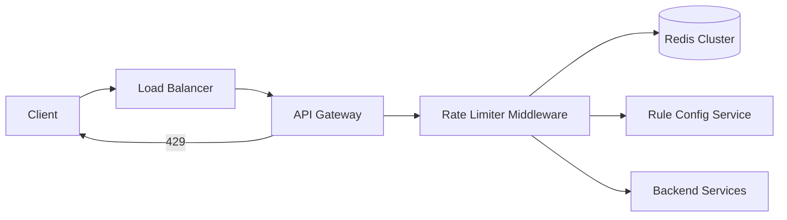
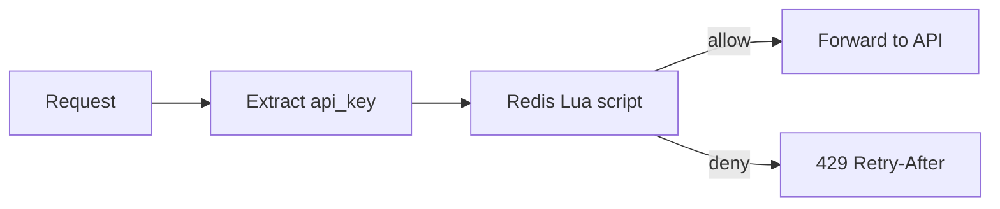

# 16. How to Design

[<- Back to master index](../README.md)

---

## Sub-topics

*Ordered for learning (16.1 → 16.56). **Priority** guides study order — finish **Core** first, then **Strong**, then **Extended**.*

| Priority | # | Sub-topic |
|----------|---|-----------|
| Core | 16.1 | [Design a Rate Limiter](#161-design-a-rate-limiter) |
| Core | 16.2 | [Design a Distributed Cache](#162-design-a-distributed-cache) |
| Core | 16.3 | [Design a Unique ID Generator](#163-design-a-unique-id-generator) |
| Core | 16.4 | [Design a Key-Value Store](#164-design-a-key-value-store) |
| Core | 16.5 | [Design an API Gateway](#165-design-an-api-gateway) |
| Core | 16.6 | [Design a Distributed Message Queue](#166-design-a-distributed-message-queue) |
| Core | 16.7 | [Design a URL Shortener](#167-design-a-url-shortener) |
| Core | 16.8 | [Design Pastebin](#168-design-pastebin) |
| Core | 16.9 | [Design a Notification System](#169-design-a-notification-system) |
| Core | 16.10 | [Design Search Autocomplete](#1610-design-search-autocomplete) |
| Core | 16.11 | [Design Twitter / X (News Feed)](#1611-design-twitter-x-news-feed) |
| Core | 16.12 | [Design WhatsApp / Messenger](#1612-design-whatsapp-messenger) |
| Core | 16.14 | [Design Dropbox / Google Drive](#1614-design-dropbox-google-drive) |
| Core | 16.15 | [Design a Payment System](#1615-design-a-payment-system) |
| Core | 16.16 | [Design a Web Crawler](#1616-design-a-web-crawler) |
| Core | 16.17 | [Design Google Search](#1617-design-google-search) |
| Strong | 16.13 | [Design Facebook News Feed](#1613-design-facebook-news-feed) |
| Strong | 16.18 | [Design YouTube](#1618-design-youtube) |
| Strong | 16.19 | [Design Netflix](#1619-design-netflix) |
| Strong | 16.20 | [Design Instagram](#1620-design-instagram) |
| Strong | 16.21 | [Design Uber / Ride Hailing](#1621-design-uber-ride-hailing) |
| Strong | 16.22 | [Design Amazon / E-commerce Platform](#1622-design-amazon-ecommerce-platform) |
| Strong | 16.23 | [Design Slack / Team Chat](#1623-design-slack-team-chat) |
| Strong | 16.24 | [Design Google Docs (Collaborative Editing)](#1624-design-google-docs-collaborative-editing) |
| Strong | 16.25 | [Design Gmail](#1625-design-gmail) |
| Strong | 16.26 | [Design Reddit](#1626-design-reddit) |
| Strong | 16.27 | [Design LinkedIn](#1627-design-linkedin) |
| Strong | 16.28 | [Design Airbnb](#1628-design-airbnb) |
| Strong | 16.29 | [Design DoorDash / Food Delivery](#1629-design-doordash-food-delivery) |
| Strong | 16.30 | [Design Google Maps](#1630-design-google-maps) |
| Strong | 16.31 | [Design a CDN](#1631-design-a-cdn) |
| Strong | 16.32 | [Design a DNS System](#1632-design-a-dns-system) |
| Strong | 16.33 | [Design a Leaderboard](#1633-design-a-leaderboard) |
| Strong | 16.34 | [Design a Metrics & Monitoring System](#1634-design-a-metrics-monitoring-system) |
| Strong | 16.35 | [Design a Logging / Log Aggregation System](#1635-design-a-logging-log-aggregation-system) |
| Strong | 16.41 | [Design a Webhook Delivery System](#1641-design-a-webhook-delivery-system) |
| Strong | 16.42 | [Design an Ad Click Aggregator](#1642-design-an-ad-click-aggregator) |
| Strong | 16.43 | [Design a Distributed Job Scheduler](#1643-design-a-distributed-job-scheduler) |
| Strong | 16.48 | [Design a Distributed Lock / Coordination Service](#1648-design-a-distributed-lock-coordination-service) |
| Strong | 16.49 | [Design a Configuration & Feature Flag Service](#1649-design-a-configuration-feature-flag-service) |
| Strong | 16.51 | [Design a Service Discovery System](#1651-design-a-service-discovery-system) |
| Strong | 16.52 | [Design an Authentication & Identity Service](#1652-design-an-authentication-identity-service) |
| Strong | 16.53 | [Design Object Storage (S3)](#1653-design-object-storage-s3) |
| Strong | 16.54 | [Design a Recommendation System](#1654-design-a-recommendation-system) |
| Strong | 16.55 | [Design a Load Balancer (L4/L7)](#1655-design-a-load-balancer-l4l7) |
| Extended | 16.36 | [Design Zoom / Video Conferencing](#1636-design-zoom-video-conferencing) |
| Extended | 16.37 | [Design Spotify / Music Streaming](#1637-design-spotify-music-streaming) |
| Extended | 16.38 | [Design Flickr / Image Hosting at Scale](#1638-design-flickr-image-hosting-at-scale) |
| Extended | 16.39 | [Design Wikipedia](#1639-design-wikipedia) |
| Extended | 16.40 | [Design a News Aggregator](#1640-design-a-news-aggregator) |
| Extended | 16.44 | [Design a Stock Exchange](#1644-design-a-stock-exchange) |
| Extended | 16.45 | [Design Ticketmaster](#1645-design-ticketmaster) |
| Extended | 16.46 | [Design Yelp / Nearby Places](#1646-design-yelp-nearby-places) |
| Extended | 16.47 | [Design Tinder / Matching System](#1647-design-tinder-matching-system) |
| Extended | 16.50 | [Design ChatGPT / LLM Inference at Scale](#1650-design-chatgpt-llm-inference-at-scale) |
| Extended | 16.56 | [Design a Fraud Detection / Risk Scoring System](#1656-design-a-fraud-detection-risk-scoring-system) |

---

<a id="161-design-a-rate-limiter"></a>

## 16.1 Design a Rate Limiter

### Overview

Consider a public water fountain with a fixed flow rate: everyone can drink, but nobody can open the tap wide enough to drain the tank and leave the next person dry. A **rate limiter** does that for APIs — it caps how many requests a client may make in a time window and rejects or delays the rest so one tenant cannot starve everyone else.

Technically, a rate limiter tracks **usage per identity** (API key, user ID, IP) against a **policy** (e.g. 100 requests per minute), usually with a **token bucket** or **sliding window** algorithm and **shared state** (Redis) when multiple gateway pods enforce the same limit. It returns **HTTP 429** with `Retry-After` when exceeded. **Use when** protecting login endpoints, public APIs, or cost-sensitive backends — place it at the **API gateway** or edge middleware, not deep inside every microservice.

---

### What problem it fixes

Without rate limiting:

- One misconfigured client or bot sends **10,000 req/s** and exhausts DB connections for everyone.
- **Brute-force** attacks hammer `/login` unchecked.
- **Retry storms** from a single tenant amplify outages (client retries × your replicas).
- **Per-pod counters** in Kubernetes silently grant `N × limit` when you have N gateway pods.

A rate limiter sheds or rejects excess traffic **before** expensive work — authentication, DB queries, payment calls.

---

### How to apply in interviews

**Problem statement (repeat back):** Design a distributed rate limiter that enforces per-user (or per-API-key) request limits across a fleet of stateless API servers. Return standard headers and HTTP 429 when limits are exceeded.

**Time budget:**

| Phase | Minutes | Focus |
|-------|---------|--------|
| Requirements | 5 | Rules, identity key, algorithms, multi-tenant |
| Estimation | 3 | Keys in memory, Redis ops/sec, hot keys |
| High-level design | 10 | Gateway middleware, Redis, rule service |
| Deep dives | 15 | Algorithm, atomicity, burst vs smooth |
| Trade-offs & failures | 5 | Redis down, clock skew, fairness |

---

### Walkthrough: end-to-end sample interview flow

#### Step 1 — Requirements (5 min)

**Functional:**

- Limit requests per **client identity** (API key or user ID; IP only as fallback).
- Support **different rules per tier** (free: 100/min, pro: 10,000/min).
- Return **429** when over limit; include `Retry-After` and rate-limit headers.
- Optional: **whitelist** internal services; **dry-run** mode for shadow testing.

**Non-functional (confirm or assume):**

- **1M** distinct API keys; **50k** peak requests/s through the gateway fleet.
- Limit check adds **< 5 ms** p99 latency.
- **99.99%** availability for the limiter path (fail-open vs fail-closed — ask interviewer).
- **Global** limits across all regions (or per-region — clarify).

**Out of scope:** Billing metering, WAF, user-facing dashboard for quota editing (assume admin API exists).

**Clarifying questions to ask:**

- Hard reject (429) or queue/throttle (delay)?
- Per-endpoint limits or global per client?
- If Redis is down, block all traffic or allow all?

---

#### Step 2 — Estimation (3 min)

```text
Goal: Redis memory and write load for sliding-window counters

Given:
  1M active API keys tracked
  50k req/s peak through gateway
  sliding window = 60 s, store 1 counter key per client per window bucket

Step 1 — memory per key (Redis hash or string):
  key name ~ 40 B + counter value ~ 8 B ≈ 50 B per active client
  1M keys × 50 B ≈ 50 MB (order of magnitude; plus Redis overhead ~2×)

Step 2 — Redis ops per request:
  1 INCR or ZADD + EXPIRE per allowed request → ~50k writes/s peak
  single Redis primary handles ~100k–200k simple ops/s (rough); need cluster or sharding at 2× headroom

Result: one Redis cluster (3 shards) is enough at this scale; shard by hash(api_key)

Sanity check: 50 MB is tiny; bottleneck is ops/sec and hot keys (celebrity API key), not RAM
```

---

#### Step 3 — High-level design (10 min)



**Components:**

| Component | Role |
|-----------|------|
| **API Gateway** | TLS termination, auth, runs rate-limit middleware on every request |
| **Rate limiter middleware** | Resolve identity, load rule, check/increment counter, set headers |
| **Redis** | Shared atomic counters across all gateway pods |
| **Rule config service** | Stores limits per API key / tier; cached in gateway memory |

**Request path:**

```text
1. Authenticate → extract api_key (or user_id)
2. Lookup rule: limit=100, window=60s, algorithm=sliding_window_counter
3. Redis: atomic increment for key rate:{api_key}:{window_id}
4. If count <= limit → forward to backend + X-RateLimit-* headers
5. Else → 429 + Retry-After
```

**Rule example (config store):**

```json
{
  "api_key": "ak_live_abc",
  "tier": "pro",
  "limit": 10000,
  "window_seconds": 60,
  "burst": 500
}
```

---

#### Step 4 — Deep dives (15 min)

**Algorithm choice — say this in the interview:**

| Algorithm | Burst | Accuracy | Memory | Say in interview |
|-----------|-------|----------|--------|------------------|
| Fixed window | Bad at boundary | Low | O(1) | "Simple but 2× spike at minute rollover" |
| Token bucket | Configurable burst | Good | O(1) | "Stripe-style; refill rate + bucket size" |
| Sliding window log | No burst over limit | Exact | O(window) | "Precise but heavy for 1M keys" |
| Sliding window counter | Smooth | Good approx | O(1) | "Production default at scale" |

**Recommend:** **token bucket** if interviewer wants burst tolerance; **sliding window counter** if they want smooth per-minute limits without storing every timestamp.

**Token bucket — how one request is decided:**

```text
state: tokens (float), last_refill_ts

on request:
  now = current_time()
  tokens = min(burst, tokens + (now - last_refill_ts) * refill_rate)
  if tokens >= 1:
    tokens -= 1
    allow
  else:
    reject 429
```

**How to calculate:**

```text
Goal: token bucket parameters for 100 requests/minute with burst 20

Given: sustained limit = 100 req / 60 s; max burst = 20 above steady rate

Step 1 — refill rate:
  r = 100 / 60 ≈ 1.67 tokens per second

Step 2 — bucket capacity:
  b = sustained_per_minute/60 × burst_window + burst_headroom
  common choice: b = 20 (allow 20 instant burst, then throttle to 1.67/s)

Result: refill r ≈ 1.67/s, capacity b = 20

Sanity check: after idle, client can send 20 immediately, then ~100/min steady — matches tier story
```

**Distributed token bucket in Redis (Lua script — atomic):**

```text
KEYS[1] = tokens, KEYS[2] = last_refill
ARGV = refill_rate, capacity, now

refill → min(capacity, tokens + (now - last_refill) * rate)
if tokens >= 1 → decrement, return ALLOW
else → return DENY
```

One Lua `EVAL` per request — no lost updates across gateway pods.

**Sliding window counter (Redis):**

```text
weighted = prev_window_count × (1 - overlap) + curr_window_count
allow if weighted <= limit
```

**Identity key pitfalls:**

- **IP-only** behind corporate NAT → one office shares one bucket (unfair).
- Prefer **API key** or **user_id** after auth.
- **Per-endpoint** limits: key `rate:{api_key}:POST:/v1/orders` — more keys, finer control.

**Response headers (always mention):**

```http
HTTP/1.1 429 Too Many Requests
Retry-After: 12
X-RateLimit-Limit: 100
X-RateLimit-Remaining: 0
X-RateLimit-Reset: 1719234120
```

---

#### Step 5 — Trade-offs and failure modes (5 min)

| Failure | Options | Typical production choice |
|---------|---------|---------------------------|
| **Redis unavailable** | Fail-open (allow) vs fail-closed (503) | Fail-open for availability; alert loudly |
| **Hot key** (one viral API key) | Local token cache, shard key, dedicated limit | Shard + per-key override |
| **Clock skew** across gateways | Use Redis `TIME` or logical windows | Redis server time as source |
| **Race without atomicity** | Over-count or under-count | Lua / `INCR` + TTL only |
| **Global vs regional** | One Redis planet-wide vs per-region | Per-region limits; global only if product requires |

**Monitoring:** `rate_limit_allowed_total`, `rate_limit_denied_total` by tier; p99 Redis latency; 429 rate by endpoint.

---

### Compared to the alternative

| Approach | Pros | Cons |
|----------|------|------|
| **No limiter** | Simplest | Abuse, noisy neighbor, outage risk |
| **Per-service in-app counter** | No Redis hop | Inconsistent across pods; N× limit bug |
| **Throttling (queue/delay)** | No hard reject | Latency piles up; hard to reason about p99 |
| **WAF / CDN rate limit** | Edge protection | Coarse (IP); not per-tenant API quotas |
| **Gateway + Redis (this design)** | Accurate, centralized, standard headers | Redis SPOF unless clustered; +1 RTT |

---

### How it works — the algorithm inside

#### Step 1 — Resolve identity and rule

```text
request → auth middleware → api_key = "ak_live_abc"
config cache → { limit: 100, window: 60s, burst: 20, algo: token_bucket }
```

#### Step 2 — Build Redis key

```text
key = "rl:{api_key}"   or   "rl:{api_key}:{method}:{path}" for per-route limits
```

#### Step 3 — Atomic check-and-increment

Gateway calls Redis Lua script (token bucket or sliding counter). **Single round trip** — do not read-then-write in two commands without a transaction.

#### Step 4 — Act on result

```text
ALLOW  → set X-RateLimit-Remaining, proxy to backend
DENY   → 429, Retry-After = seconds until token or window reset
```



---

### Pitfalls and design tips

#### When to use (and when not to)

- **Use** at API gateway for public and partner APIs, login, search, and any endpoint bots target.
- **Use token bucket** when clients need short bursts (mobile apps, batch uploads).
- **Skip** deep per-service limits if gateway already enforces global identity — avoid double-limiting unless endpoints have very different costs.
- **Do not confuse** with **throttling** (queue) or **circuit breaker** (downstream health) — different problems.

#### Common mistakes

- **In-memory counter per pod** — 10 pods × 100 req/min = 1,000 effective limit.
- **Fixed window only** — demonstrate boundary spike (`:59` + `:00` = 2× traffic).
- **IP as sole key** for B2B APIs — unfair sharing and easy bypass via proxies.
- **No idempotency guidance** on 429 for `POST` — clients must retry with same idempotency key.
- **Forgetting fail-open policy** — interviewer expects you to state what happens when Redis dies.

#### Production notes

- **Stripe, GitHub, Twitter APIs** document `X-RateLimit-*` headers — match that contract.
- **Redis:** cluster mode, hash-tag same `api_key` to one slot; Lua scripts for atomicity.
- **Libraries:** Envoy rate limit service, Kong, Nginx `limit_req`, AWS API Gateway usage plans.
- **Config:** push rule changes via control plane; gateway caches with TTL; avoid per-request DB lookup.

---

### Real-world example: public API on Kubernetes

**Problem:** A B2B SaaS launches a public REST API on **EKS** with 12 gateway pods. Free tier is 100 requests/minute per API key. Launch day: one integration partner misconfigures a poller at **5 req/s** (300/min), exhausting PostgreSQL connections and raising p99 latency for all tenants.

**Naive failure:** Each gateway pod kept a local `HashMap` counter — effective limit was **1,200/min** (12 × 100), and the abusive key still averaged 300/min on one pod while others looked healthy. No 429 headers; partner saw random 503s from DB saturation.

**How the rate limiter fixed it:**

1. Middleware on **Envoy/Kong** with **Redis Cluster** (3 shards, key `rl:{api_key}`).
2. **Token bucket:** `r = 1.67/s`, `burst = 20`, implemented as Redis Lua.
3. Over-limit responses: **429** + `Retry-After: 8` + `X-RateLimit-Remaining: 0`.
4. Dashboards on `rate_limit_denied_total` — support sent partner the exact header values.

**Outcome:** Partner fixed poller to respect `Retry-After`; DB connection pool stable; p99 API latency dropped from 2.1 s to 120 ms without adding database capacity.

---

<a id="162-design-a-distributed-cache"></a>

## 16.2 Design a Distributed Cache

*Details coming soon.*

---

<a id="163-design-a-unique-id-generator"></a>

## 16.3 Design a Unique ID Generator

*Details coming soon.*

---

<a id="164-design-a-key-value-store"></a>

## 16.4 Design a Key-Value Store

*Details coming soon.*

---

<a id="165-design-an-api-gateway"></a>

## 16.5 Design an API Gateway

*Details coming soon.*

---

<a id="166-design-a-distributed-message-queue"></a>

## 16.6 Design a Distributed Message Queue

*Details coming soon.*

---

<a id="167-design-a-url-shortener"></a>

## 16.7 Design a URL Shortener

*Details coming soon.*

---

<a id="168-design-pastebin"></a>

## 16.8 Design Pastebin

*Details coming soon.*

---

<a id="169-design-a-notification-system"></a>

## 16.9 Design a Notification System

*Details coming soon.*

---

<a id="1610-design-search-autocomplete"></a>

## 16.10 Design Search Autocomplete

*Details coming soon.*

---

<a id="1611-design-twitter-x-news-feed"></a>

## 16.11 Design Twitter / X (News Feed)

*Details coming soon.*

---

<a id="1612-design-whatsapp-messenger"></a>

## 16.12 Design WhatsApp / Messenger

*Details coming soon.*

---

<a id="1613-design-facebook-news-feed"></a>

## 16.13 Design Facebook News Feed

*Details coming soon.*

---

<a id="1614-design-dropbox-google-drive"></a>

## 16.14 Design Dropbox / Google Drive

*Details coming soon.*

---

<a id="1615-design-a-payment-system"></a>

## 16.15 Design a Payment System

*Details coming soon.*

---

<a id="1616-design-a-web-crawler"></a>

## 16.16 Design a Web Crawler

*Details coming soon.*

---

<a id="1617-design-google-search"></a>

## 16.17 Design Google Search

*Details coming soon.*

---

<a id="1618-design-youtube"></a>

## 16.18 Design YouTube

*Details coming soon.*

---

<a id="1619-design-netflix"></a>

## 16.19 Design Netflix

*Details coming soon.*

---

<a id="1620-design-instagram"></a>

## 16.20 Design Instagram

*Details coming soon.*

---

<a id="1621-design-uber-ride-hailing"></a>

## 16.21 Design Uber / Ride Hailing

*Details coming soon.*

---

<a id="1622-design-amazon-ecommerce-platform"></a>

## 16.22 Design Amazon / E-commerce Platform

*Details coming soon.*

---

<a id="1623-design-slack-team-chat"></a>

## 16.23 Design Slack / Team Chat

*Details coming soon.*

---

<a id="1624-design-google-docs-collaborative-editing"></a>

## 16.24 Design Google Docs (Collaborative Editing)

*Details coming soon.*

---

<a id="1625-design-gmail"></a>

## 16.25 Design Gmail

*Details coming soon.*

---

<a id="1626-design-reddit"></a>

## 16.26 Design Reddit

*Details coming soon.*

---

<a id="1627-design-linkedin"></a>

## 16.27 Design LinkedIn

*Details coming soon.*

---

<a id="1628-design-airbnb"></a>

## 16.28 Design Airbnb

*Details coming soon.*

---

<a id="1629-design-doordash-food-delivery"></a>

## 16.29 Design DoorDash / Food Delivery

*Details coming soon.*

---

<a id="1630-design-google-maps"></a>

## 16.30 Design Google Maps

*Details coming soon.*

---

<a id="1631-design-a-cdn"></a>

## 16.31 Design a CDN

*Details coming soon.*

---

<a id="1632-design-a-dns-system"></a>

## 16.32 Design a DNS System

*Details coming soon.*

---

<a id="1633-design-a-leaderboard"></a>

## 16.33 Design a Leaderboard

*Details coming soon.*

---

<a id="1634-design-a-metrics-monitoring-system"></a>

## 16.34 Design a Metrics & Monitoring System

*Details coming soon.*

---

<a id="1635-design-a-logging-log-aggregation-system"></a>

## 16.35 Design a Logging / Log Aggregation System

*Details coming soon.*

---

<a id="1636-design-zoom-video-conferencing"></a>

## 16.36 Design Zoom / Video Conferencing

*Details coming soon.*

---

<a id="1637-design-spotify-music-streaming"></a>

## 16.37 Design Spotify / Music Streaming

*Details coming soon.*

---

<a id="1638-design-flickr-image-hosting-at-scale"></a>

## 16.38 Design Flickr / Image Hosting at Scale

*Details coming soon.*

---

<a id="1639-design-wikipedia"></a>

## 16.39 Design Wikipedia

*Details coming soon.*

---

<a id="1640-design-a-news-aggregator"></a>

## 16.40 Design a News Aggregator

*Details coming soon.*

---

<a id="1641-design-a-webhook-delivery-system"></a>

## 16.41 Design a Webhook Delivery System

*Details coming soon.*

---

<a id="1642-design-an-ad-click-aggregator"></a>

## 16.42 Design an Ad Click Aggregator

*Details coming soon.*

---

<a id="1643-design-a-distributed-job-scheduler"></a>

## 16.43 Design a Distributed Job Scheduler

*Details coming soon.*

---

<a id="1644-design-a-stock-exchange"></a>

## 16.44 Design a Stock Exchange

*Details coming soon.*

---

<a id="1645-design-ticketmaster"></a>

## 16.45 Design Ticketmaster

*Details coming soon.*

---

<a id="1646-design-yelp-nearby-places"></a>

## 16.46 Design Yelp / Nearby Places

*Details coming soon.*

---

<a id="1647-design-tinder-matching-system"></a>

## 16.47 Design Tinder / Matching System

*Details coming soon.*

---

<a id="1648-design-a-distributed-lock-coordination-service"></a>

## 16.48 Design a Distributed Lock / Coordination Service

*Details coming soon.*

---

<a id="1649-design-a-configuration-feature-flag-service"></a>

## 16.49 Design a Configuration & Feature Flag Service

*Details coming soon.*

---

<a id="1650-design-chatgpt-llm-inference-at-scale"></a>

## 16.50 Design ChatGPT / LLM Inference at Scale

*Details coming soon.*

---

<a id="1651-design-a-service-discovery-system"></a>

## 16.51 Design a Service Discovery System

*Details coming soon.*

---

<a id="1652-design-an-authentication-identity-service"></a>

## 16.52 Design an Authentication & Identity Service

*Details coming soon.*

---

<a id="1653-design-object-storage-s3"></a>

## 16.53 Design Object Storage (S3)

*Details coming soon.*

---

<a id="1654-design-a-recommendation-system"></a>

## 16.54 Design a Recommendation System

*Details coming soon.*

---

<a id="1655-design-a-load-balancer-l4l7"></a>

## 16.55 Design a Load Balancer (L4/L7)

*Details coming soon.*

---

<a id="1656-design-a-fraud-detection-risk-scoring-system"></a>

## 16.56 Design a Fraud Detection / Risk Scoring System

*Details coming soon.*
