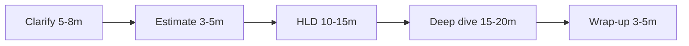
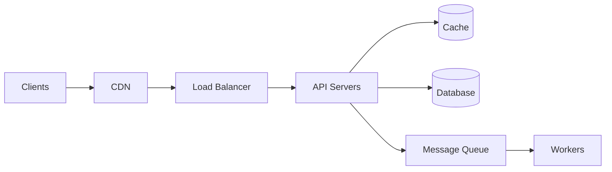
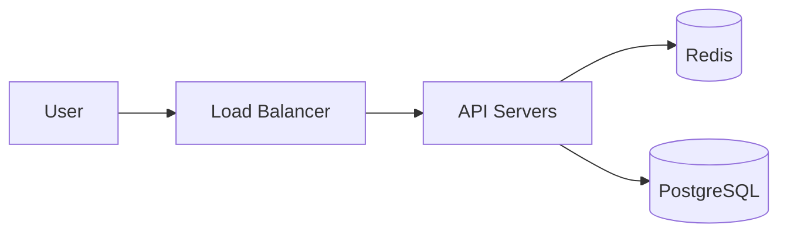

# 16. System Design Interview Guide

[<- Back to master index](../README.md)

---

## Sub-topics

| # | Sub-topic |
|---|-----------|
| 16.1 | [Interview Framework](#161-interview-framework) |
| 16.2 | [Requirements Gathering](#162-requirements-gathering) |
| 16.3 | [Back-of-Envelope Estimation](#163-back-of-envelope-estimation) |
| 16.4 | [High-Level Design](#164-high-level-design) |
| 16.5 | [Deep Dives](#165-deep-dives) |
| 16.6 | [Trade-offs and Failure Modes](#166-trade-offs-and-failure-modes) |
| 16.7 | [Sample Walkthrough: URL Shortener](#167-sample-walkthrough-url-shortener) |

---

## 16.1 Interview Framework

### Overview

Picture a job interview where someone asks you to plan a city from scratch in 45 minutes. If you start drawing skyscrapers before asking whether this is a village or a megacity, you will waste the session. A system design interview works the same way: the prompt is intentionally vague, and the interviewer is watching **how you organize thinking under time pressure**, not whether you memorized Netflix's architecture.

Technically, the **interview framework** is a time-boxed sequence — clarify requirements, estimate scale, sketch high-level architecture, deep-dive where the interviewer steers, then close with trade-offs and failure modes. It maps to the 45–60 minute loop used at most FAANG-style and senior engineering companies. The framework is the spine; the technologies are flesh you add only after scope and scale are clear.

---

### What problem it fixes

Without a structure, candidates commonly:

- Jump to **technology bingo** ("Kafka, Cassandra, Redis") before defining the problem.
- **Skip requirements** and design the wrong system (YouTube-scale when they wanted a photo upload API).
- **Ramble** through details with no narrative the interviewer can follow.
- Run out of time before covering **trade-offs, failures, or monitoring**.
- Ignore interviewer cues — continuing on storage when they asked about the read path.

The framework fixes **communication and pacing**, not knowledge gaps. It gives you checkpoints so every minute advances the design and leaves room for follow-up questions — which is often where senior candidates are scored.

---

### How to apply in interviews

Use this phase table as your default clock. Adjust when the interviewer says "skip estimation" or "go deep on caching."

| Phase | Time | Goal |
|-------|------|------|
| **Clarify** | 5–8 min | Functional + non-functional requirements, constraints, out-of-scope |
| **Estimate** | 3–5 min | QPS, storage, bandwidth — sanity-check feasibility |
| **High-level design** | 10–15 min | Major components, data flow, API sketch |
| **Deep dive** | 15–20 min | 1–2 areas the interviewer cares about (DB, cache, scale) |
| **Wrap-up** | 3–5 min | Bottlenecks, failure modes, monitoring, future work |

**In the room, do these five things every time:**

1. **Repeat the problem** in your own words — confirms alignment before you draw anything.
2. **Ask questions** before designing — scope beats premature optimization.
3. **Draw** (whiteboard or shared doc) — boxes for services, arrows for data flow; label sync vs async paths.
4. **Name trade-offs** whenever you choose — "Redis here for speed; we accept eventual consistency on reads."
5. **Invite feedback** — "Should I go deeper on storage or the read path?"



---

### Walkthrough: 45-minute session on "Design a rate limiter"

| Minute | What you say / draw | Why it matters |
|--------|---------------------|----------------|
| 0–2 | "Users and services send requests; we need to cap requests per client per window. I'll clarify scope first." | Shows you won't design in a vacuum. |
| 2–8 | Ask: per-user or per-IP? Distributed or single node? Hard reject or queue? Target: 100 req/min? | Narrows to a solvable problem. |
| 8–11 | "10K RPS peak, ~1 KB state per client if we track counters — fits in memory on a few nodes." | Proves scale thinking before boxes. |
| 11–22 | Draw client → API → rate-limiter middleware → backend. API: check limit before handler. | Shared vocabulary for deep dives. |
| 22–38 | Deep dive: token bucket vs sliding window; Redis `INCR` + TTL vs local memory; race conditions at scale. | Where senior signal shows up. |
| 38–45 | "Weakest link: Redis partition — degrade to local limits or fail open? Monitor reject rate, p99 latency." | Operational maturity closes strong. |

---

### Pitfalls and design tips

- **Skipping requirements** — always confirm users, core operations, and what's out of scope.
- **Technology bingo** — name a component only with a one-line *why* tied to requirements.
- **No single point of failure** — mention redundancy for critical paths even in HLD.
- **Ignoring the interviewer** — if they say "assume 1B users," rescale estimates immediately.
- **Defending a bad choice** — changing your mind when given new constraints shows maturity, not weakness.
- **Default for new loops** — clarify → estimate → HLD → let them steer the deep dive → failures last.

---

### Real-world example — sample interview flow

**Prompt:** "Design a notification system for a mobile app."

**Clarify (6 min):** Push only or email/SMS too? Real-time or batched? DAU? Read vs write ratio? You settle on: push notifications, 10M DAU, ~5 notifications/user/day, delivery within 30 seconds, at-least-once acceptable.

**Estimate (4 min):** ~50M notifications/day → ~600 writes/sec average, ~3K peak. Metadata ~500 B → modest storage; fan-out to device tokens is the interesting part.

**HLD (12 min):** Event producer → message queue → notification workers → FCM/APNs. Separate service stores device tokens. Idempotent send with dedup key.

**Deep dive (18 min):** Interviewer asks about hot celebrities. You propose per-user queues, rate limits per sender, and async fan-out via the queue instead of synchronous API calls.

**Wrap-up (5 min):** Queue backlog if FCM is slow — DLQ, retry with backoff, alert on age-of-oldest-message. Degrade: batch low-priority notifications.

This is the same skeleton interviewers use internally when calibrating — structured ambiguity, not a memorized diagram.

---

## 16.2 Requirements Gathering

### Overview

Imagine building a house without knowing if it is a studio or a six-bedroom home — you might pour a foundation for the wrong load. **Requirements gathering** is the interview equivalent of asking how many people will live there, whether they need a garage, and what the budget is before you sketch floor plans.

Technically, it splits the problem into **functional requirements** (what the system must do) and **non-functional requirements** (how well it must perform: scale, latency, availability, consistency). Five to eight targeted questions in the first five minutes prevent an hour of designing the wrong product.

---

### What problem it fixes

Vague prompts ("design Twitter") hide enormous scope. Without requirements gathering, you:

- **Over-build** — add ML ranking, analytics, and DMs when the interviewer wanted a read-only timeline.
- **Under-specify scale** — cache for 1K QPS when they assumed 1M QPS.
- **Miss the read/write ratio** — optimize writes when the system is 100:1 read-heavy.
- **Assume consistency** — design strong consistency when stale reads were acceptable.

Requirements turn an open-ended prompt into a **bounded design problem** you can defend with numbers and trade-offs.

---

### How to apply in interviews

**Functional (what)** — ask about core user journeys:

- Who are the users? (consumers, admins, internal services)
- What are the main operations? (create, read, update, delete, search)
- What is in scope vs out of scope for this session?

**Non-functional (how well)** — use this checklist; skip categories that clearly do not apply:

| Category | Questions to ask |
|----------|------------------|
| **Scale** | DAU / MAU? Reads vs writes ratio? |
| **Latency** | p99 target? Real-time vs batch OK? |
| **Availability** | 99.9%? Acceptable downtime window? |
| **Consistency** | Strong or eventual? Stale reads OK? |
| **Durability** | Can we lose data? Retention period? |
| **Geography** | Single region or global? |
| **Security** | Auth? Abuse prevention? PII? |

**Process in the room:**

1. List 3–5 **must-have** functional requirements aloud.
2. Confirm **scale assumptions** (rough orders of magnitude are fine).
3. State **defaults** for anything unanswered: "I'll assume eventual consistency unless we need strong."
4. Write requirements on the board — reference them when justifying every later choice.

---

### Walkthrough: URL shortener requirements in 5 minutes

| Step | You ask / state | Interviewer confirms |
|------|-----------------|----------------------|
| 1 | "Core flow: shorten URL, redirect on click — anything else?" | Custom alias optional; analytics out of scope. |
| 2 | "Who calls the API — humans only or services too?" | Public HTTP API. |
| 3 | "Scale ballpark?" | 100M new URLs/month. |
| 4 | "Read vs write?" | Roughly 10:1 reads to writes. |
| 5 | "Latency for redirect?" | p99 under 100 ms. |
| 6 | "Availability target?" | 99.9%. |
| 7 | "Retention?" | 5 years unless link expires. |

**Written on board:**

```text
Functional: create short URL, redirect, optional expiration
NFR: 100M writes/mo, 10:1 R:W, p99 < 100ms redirect, 99.9%, 5yr retention
Out of scope: accounts, analytics dashboard
```

Every design decision later ties back to this list.

---

### Pitfalls and design tips

- **Twenty questions** — 5–8 sharp questions beat an interrogation; propose defaults and let them correct you.
- **Forgetting read/write ratio** — drives cache vs DB focus in HLD and deep dives.
- **Assuming unmentioned features** — social graph, ML ranking, payments — ask first.
- **Silent assumptions** — say them out loud so the interviewer can redirect early.
- **No out-of-scope line** — explicitly state what you are *not* building to protect time.

---

### Real-world example — sample interview flow

**Prompt:** "Design a file storage service like Dropbox."

**You (first 7 min):** "I'll nail down scope. Upload/download/sync for files — folder sharing in scope? Version history? Max file size? Mobile and desktop clients?"

Interviewer: "Upload, download, list files. Sharing and versioning out of scope. Files up to 10 GB. 50M users, mostly read."

**You:** "So functional: put object, get object, list by path. NFR: large objects, read-heavy, 50M users. I'll assume 99.9% availability and eventual consistency for metadata listing unless you need strong."

You write four bullets on the board. When you later propose S3 + metadata DB, the interviewer nods because you already bounded the problem — you are not designing Dropbox Paper, sync conflict resolution, or block-level dedup unless they ask.

---

## 16.3 Back-of-Envelope Estimation

### Overview

Before you order trucks for a warehouse, you estimate how many pallets arrive per day — not to the exact box, but to know whether you need a garage or a distribution center. **Back-of-envelope estimation** does the same in interviews: turn "100 million users" into QPS, storage, and bandwidth so your architecture is sized for reality, not a toy app.

Technically, it is order-of-magnitude math using rounded constants (≈100K seconds per day, 5× peak multiplier) to derive **writes/sec, reads/sec, storage over retention, and egress bandwidth**. The goal is feasibility and which component breaks first — not spreadsheet precision.

---

### What problem it fixes

Without estimates, you cannot justify:

- Whether **one database** suffices or you need **sharding**.
- How much **cache memory** hot keys require.
- Whether a **CDN** or **async queue** is necessary.
- Answers to "how many servers?" or "do we need Kafka?"

Estimates also signal **production thinking** — interviewers use them to see if you connect user scale to engineering constraints.

---

### How to apply in interviews

Run estimation **after requirements, before HLD** — unless the interviewer explicitly skips it.

**Useful constants (round aggressively):**

| Assumption | Value |
|------------|-------|
| Seconds per day | ~86,400 (~**100K** for quick math) |
| Requests per user per day | Ask or assume 10–50 for active apps |
| Peak / average multiplier | 2–10× (use **5×** if unsure) |
| Text metadata per record | ~500 B – 2 KB |
| Image average | 200 KB – 2 MB |

**Five-step recipe:**

1. Compute **average QPS** from DAU or monthly volume.
2. Apply **peak multiplier**.
3. Estimate **storage** = records × size × retention (× replication factor).
4. Estimate **bandwidth** = QPS × payload size.
5. **Sanity-check** against a single machine or managed service limit.

**Scale-out check:** per-instance RPS ≈ `maxThreads / avg_response_time` (see [4.2 Throughput](../04-distributed-system/README.md#42-throughput)). For extreme scale (10M+ RPS), clarify edge vs origin load — CDN, cache, and async absorption matter more than raw server count.

---

### Walkthrough: URL shortener — 100M new URLs/month, 10:1 read:write

**Given:** 100M writes/month, 10:1 read:write, 500 B metadata/URL, 5-year retention, 5× peak multiplier.

```text
Writes:  100M / (30 × 100K) ≈ 100M / 3M ≈ 33 writes/sec average
         Peak (5×): ~165 writes/sec

Reads:   165 × 10 ≈ 1,650 reads/sec peak (~2K rounded)

Storage: 100M × 12 × 5 = 6B URLs total
         6B × 500 B ≈ 3 TB metadata
         × 3 replicas ≈ 9 TB (replication)

Bandwidth (redirect ~500 B response):
         2,000 × 500 B ≈ 1 MB/sec peak egress
```

**Sanity check:** 3 TB metadata fits a modern PostgreSQL node; ~2K read QPS is cache-friendly — sharding not required at this scale. Say that aloud so the interviewer hears the conclusion, not just the arithmetic.

**How to calculate — replication overhead**

| Input | Calculation | Result |
|-------|-------------|--------|
| Raw data 3 TB | × 3 replicas | ~9 TB disk budget |
| Index overhead ~30% | 9 TB × 1.3 | ~12 TB plan |

---

### Pitfalls and design tips

- **False precision** — "≈2K RPS" beats "1,847.3 RPS"; orders of magnitude are the goal.
- **Forgetting replication** — multiply storage by replica count (often 3×).
- **Ignoring index overhead** — indexes often add 20–50% storage.
- **Monthly vs daily volume** — divide monthly writes by ~2.6M seconds, not 86,400.
- **Edge vs origin** — at very high RPS, state how much CDN/cache absorbs before it hits your API.
- **Say the implication** — "This fits one region" or "We need sharding at 10× this scale" closes the loop.

---

### Real-world example — sample interview flow

**Prompt:** "Design a news feed." Interviewer: "300M DAU, each loads feed 10 times/day, 20 posts per feed read."

**You (4 min):** "Reads dominate. 300M × 10 = 3B feed loads/day → 3B / 100K ≈ 30K average read QPS, ~150K peak. If each feed response is ~50 KB, peak egress is 150K × 50 KB ≈ 7.5 GB/sec — CDN and aggressive caching are mandatory, not optional."

Interviewer: "What about writes — 500M posts/day globally?"

**You:** "500M / 100K ≈ 5K write QPS average, ~25K peak. Fan-out on write for celebrities is the hard problem; the numbers tell me read path and fan-out strategy matter more than write DB choice."

You have not drawn a single box yet, but the interviewer knows you will not propose a single PostgreSQL primary for 150K feed reads/sec without a cache layer.

---

## 16.4 High-Level Design

### Overview

A high-level design is the **map before the street view** — which cities exist and how roads connect, not every traffic light. In an interview, HLD is the first diagram everyone shares: clients, entry points, services, caches, databases, and queues, plus the happy-path data flow.

Technically, **high-level design (HLD)** establishes components and sync/async boundaries without implementation detail. It creates shared vocabulary so deep dives on caching or sharding land on the same boxes the interviewer already saw.

---

### What problem it fixes

Jumping straight to deep dives causes:

- **Talking past each other** — you discuss Redis sharding while they still picture a monolith.
- **Over-engineering** — ten microservices for 100 QPS.
- **Missing the happy path** — components listed with no request walkthrough.
- **Hidden state** — scalable-looking diagram with a stateful bottleneck unnamed.

HLD fixes **alignment and proportionality** — the right complexity for the scale you estimated.

---

### How to apply in interviews

Spend **10–15 minutes** after estimation. Cover these five items:

1. Sketch **client → entry point → services → storage**.
2. Define **API contract** — 2–4 key endpoints with request/response shape.
3. Identify **data model** at entity level (tables/collections, key relationships).
4. Mark **sync vs async** paths on the diagram.
5. State what is **stateless** (horizontally scalable app tier).

**Standard building blocks:**



| Component | Typical use |
|-----------|-------------|
| **Load balancer** | Distribute traffic, health checks, TLS termination |
| **API layer** | Stateless app servers; business logic |
| **Cache** | Hot reads (Redis, Memcached) |
| **Database** | Source of truth (SQL or NoSQL by access pattern) |
| **Message queue** | Async work, decouple producers/consumers |
| **CDN** | Static assets, edge caching |
| **Object storage** | Files, images, videos (S3) |

**API sketch example (URL shortener):**

```text
POST /api/v1/urls     { "long_url": "..." }  → { "short_url": "..." }
GET  /{short_code}                         → 302 redirect
```

---

### Walkthrough: news feed HLD in 12 minutes

| Minute | Action |
|--------|--------|
| 0–2 | Draw mobile/web clients → CDN for static assets → API gateway. |
| 2–5 | API service: `GET /feed`, `POST /post`. Post write sync to DB; fan-out async via queue. |
| 5–8 | PostgreSQL for posts/users; Redis for hot feed slices; S3 for media. |
| 8–10 | Walk happy path: "User opens app → `GET /feed` → cache check → DB on miss → JSON response." |
| 10–12 | Label stateless API tier; note async worker for fan-out to followers. |

Say: "I'll deep-dive fan-out strategy or caching next — your choice." That hands control to the interviewer per the framework.

---

### Pitfalls and design tips

- **Over-engineering HLD** — match service count to QPS; a modular monolith is valid at moderate scale.
- **No happy-path narration** — always trace one read and one write across the diagram.
- **Forgetting idempotency** — mention on write APIs when retries matter (payments, creates).
- **Database before access pattern** — pick SQL vs NoSQL from how you read/write, not familiarity.
- **Unlabeled arrows** — sync HTTP vs async queue should be explicit on the board.

---

### Real-world example — sample interview flow

**Prompt:** "Design a URL shortener." (Requirements and estimates already agreed.)

**You (10 min):** Draw user → load balancer → stateless API servers → Redis cache → PostgreSQL. CDN optional for redirect edge caching at higher scale.

```text
POST /api/v1/urls  → create mapping (write path)
GET  /{code}       → 302 redirect (read path)

urls: short_code (unique), long_url, created_at, expires_at
```

**You:** "Read path is 10× traffic — `GET /{code}` checks Redis, falls back to PostgreSQL, returns redirect. Write path inserts to PostgreSQL first, then optionally warms cache. API tier is stateless; we scale it horizontally behind the LB."

Interviewer: "Good — let's go deep on the read path." You have a clear box to zoom into because HLD already separated read-heavy redirect from write path.

---

## 16.5 Deep Dives

### Overview

High-level design is the table of contents; **deep dives** are the chapters the interviewer chooses to read aloud. This is where they test whether you can reason from first principles about databases, caches, fan-out, and consistency — not recite how Instagram shipped a feature in 2019.

Technically, a deep dive is a focused 15–20 minute exploration of one or two subsystems: schema and sharding, cache invalidation, hot keys, feed fan-out, or real-time delivery. Senior signal comes from **proposing one approach, stating trade-offs, and adapting** when constraints change.

---

### What problem it fixes

Shallow interviews stall at boxes-and-arrows. Deep dives expose:

- Whether you understand **why** a cache exists, not just that Redis is fast.
- How you handle **edge cases** — hot keys, thundering herd, partition behavior.
- If you can **prioritize** — you cannot deep-dive every component in 45 minutes.

Without a deep-dive phase, interviewers cannot distinguish memorization from judgment.

---

### How to apply in interviews

**Listen for cues** — "How would you handle hot keys?" or "What if the cache goes down?" is an invitation to zoom in.

**Common deep-dive areas:**

| Area | What to cover |
|------|----------------|
| **Database** | Schema, indexes, replication, sharding key, SQL vs NoSQL |
| **Caching** | What to cache, TTL, invalidation, stampede protection |
| **Scaling reads** | Replicas, cache, CDN, read-through |
| **Scaling writes** | Sharding, partitioning, async queues |
| **Feed / timeline** | Fan-out on write vs fan-out on read |
| **Search** | Inverted index, Elasticsearch, denormalized index |
| **Real-time** | WebSockets, SSE, pub/sub, long polling |
| **Consistency** | CAP choice, quorum, eventual + conflict resolution |

**Four-step loop:**

1. **Restate** the sub-problem tied to requirements ("redirect p99 < 100 ms").
2. **Propose** one approach with a clear trade-off.
3. **Iterate** when challenged — "We could add a local near-cache in front of Redis for hot keys."
4. **Close** with monitoring — metrics and alerts prove operational thinking.

Pick **1–2 areas thoroughly**; do not spread thin across every row in the table.

---

### Walkthrough: deep dive on URL shortener read path

**Problem:** 10:1 read:write, p99 redirect < 100 ms.

| Step | Design choice | Trade-off |
|------|---------------|-----------|
| 1 | Cache-aside: Redis `code → long_url` | Fast hits; miss adds DB round-trip |
| 2 | TTL 24h with jitter | Stale mapping rare; jitter reduces avalanche |
| 3 | On miss: query PostgreSQL by `short_code` index, populate cache | Index must fit working set over time |
| 4 | Return HTTP 302 | 302 allows URL updates; 301 better for browser cache |
| 5 | Redis down: fall through to DB | Higher latency; still functional degradation |

**Hot link:** single Redis key gets huge QPS — replicate key to local in-process cache (short TTL) or use read replicas on the cache layer.

Mention: cache-aside pattern in [Ch. 3](../03-caching/README.md); connection pooling and read replicas in [Ch. 5](../05-distributed-databases/README.md) if challenged on DB load.

---

### Pitfalls and design tips

- **Defending a bad choice** — update the design when given new facts; that is senior behavior.
- **Deep-diving everything** — ask which area matters most; depth beats breadth.
- **No monitoring** — add metrics (p99, hit ratio, error rate, pool saturation) unprompted.
- **Theory without numbers** — tie choices back to estimates ("2K read QPS → cache holds hot 20%").
- **Ignoring failure in deep dives** — mention what happens when this component fails.

---

### Real-world example — sample interview flow

**Prompt:** Same URL shortener; interviewer says "Go deep on short code generation."

**You:** "Three options. One: base62-encoded auto-increment ID — O(1), no collision check, but predictable unless salted. Two: hash long URL + truncate — dedupes same URL, collision risk needs unique constraint retry. Three: random 7-char base62 — ~3.5 trillion space, birthday paradox low at our 6B URL scale with DB unique index."

Interviewer: "What about custom aliases?"

**You:** "Reserve a separate namespace; check uniqueness synchronously on write against PostgreSQL unique index. Custom aliases are low volume — acceptable to pay one indexed lookup on create."

Interviewer: "Hot celebrity link?"

**You:** "Single key in Redis — add local LRU in each API pod for top codes, or pre-warm multiple Redis replicas. Monitor per-key QPS."

You stayed in one area, named trade-offs each step, and adapted — that is the deep-dive bar.

---

## 16.6 Trade-offs and Failure Modes

### Overview

Every real system is a bundle of compromises — faster reads mean staler data; stronger durability means higher latency. **Trade-offs and failure modes** are how you show you have operated software, not only drawn it. Interviewers often end with "What breaks first?" to see if you think about 3 a.m. pages.

Technically, this phase names explicit contrasts (consistency vs availability, latency vs durability), identifies the **weakest link** in your design, and pairs **detection** (alerts, SLOs) with **mitigation** (redundancy, degradation, backpressure).

---

### What problem it fixes

Happy-path-only designs fail interviews because production is mostly unhappy paths:

- **Cache stampede** when a hot key expires.
- **Regional outage** with no failover story.
- **Queue backlog** when consumers lag.
- **Bad deploy** or **operator error** — not only hardware failure.

Naming trade-offs also prevents you from sounding dogmatic — "I chose X because at this scale Y matters more."

---

### How to apply in interviews

Reserve **3–5 minutes** at the end, or weave trade-offs throughout (better). Use explicit contrasts:

- **Consistency vs availability** (CAP during partition)
- **Latency vs durability** (sync vs async replication)
- **Simplicity vs scalability** (monolith vs microservices)
- **Cost vs performance** (more cache RAM vs more DB replicas)
- **Freshness vs load** (short TTL vs DB pressure)

**Failure-mode framework:**

1. Name the **weakest link** (often DB primary, single queue, or hot key).
2. Propose **detection** — health checks, latency/error SLO alerts.
3. Propose **mitigation** — redundancy, circuit breakers, graceful degradation.
4. Mention **graceful degradation** — "If recommendations fail, show popular items."

| Failure | Mitigation |
|---------|------------|
| **Single DB overload** | Read replicas, cache, connection pooling |
| **Cache stampede** | Single-flight, jittered TTL, stale-while-revalidate |
| **Hot partition / hot key** | Key splitting, local cache, dedicated shard |
| **Cascade failure** | Circuit breaker, timeouts, bulkheads |
| **Queue backlog** | Backpressure, scale consumers, DLQ |
| **Region outage** | Multi-AZ, multi-region DR, DNS failover |

---

### Walkthrough: trade-off table for URL shortener

| Decision | Choice | Trade-off |
|----------|--------|-----------|
| Store | PostgreSQL | Strong uniqueness on `short_code`; harder horizontal scale than DynamoDB at extreme size |
| Redirect | HTTP 302 | Mutable destination; extra round-trip vs 301 browser cache |
| Code gen | Random 7-char + unique index | Non-guessable; insert retry on rare collision |
| Cache | Redis cache-aside | Speed vs stale mapping until TTL/invalidation |
| Consistency | DB authoritative | Cache miss or eviction may serve stale URL briefly if not invalidated on write |

**Failures:**

- **Redis down** → API reads PostgreSQL directly; alert on elevated redirect p99.
- **DB primary down** → failover to replica; brief write unavailability.
- **Traffic spike** → autoscale stateless API; queue creates if you add async analytics later.

**Monitoring:** redirect p99, cache hit ratio, create error rate, DB connection pool saturation.

---

### Pitfalls and design tips

- **"No failures"** — everything fails; plan detection and degradation.
- **Only hardware failures** — include bad deploys, traffic spikes, misconfiguration.
- **No rollback** — mention schema migration strategy and feature flags for risky changes.
- **Trade-offs without requirements tie-in** — "We accept eventual consistency because reads allow 30s staleness per NFR."
- **Missing fail-open vs fail-closed** — rate limiters and auth have different answers; state yours.

---

### Real-world example — sample interview flow

**Prompt:** "What breaks first in your URL shortener?"

**You:** "At 2K read QPS, Redis or the DB connection pool on cache miss — not the stateless API tier. First alert: redirect p99 above 100 ms. Mitigation: raise cache hit ratio, read replica for PostgreSQL, connection pool tuning."

Interviewer: "What if us-east-1 goes away?"

**You:** "Single-region design fails until we add multi-region active-passive: replicate PostgreSQL async, Redis/Global Accelerator or DNS failover, accept RPO of seconds on writes. Trade-off: cost and write complexity vs 99.99% availability."

Interviewer: "Celebrity link melts one Redis key?"

**You:** "Per-process hot-key cache with 5s TTL, or Redis read replicas. Longer term: split counters from redirect path. Degrade: serve redirect from DB for that code only."

You answered operational questions without redrawing the whole system — trade-offs and failures close the loop.

---

## 16.7 Sample Walkthrough: URL Shortener

### Overview

Reading about system design is not the same as **performing** it aloud in 45 minutes. This section is a full dress rehearsal — requirements through failures — for a classic prompt: build a service like `bit.ly` that maps short codes to long URLs.

Technically, it stitches together [16.1](#161-interview-framework) through [16.6](#166-trade-offs-and-failure-modes) into one timed narrative: clarify scope, estimate scale, draw HLD, deep-dive read and write paths, then close with trade-offs and monitoring. Practice it on a whiteboard until phase transitions feel automatic.

---

### What problem it fixes

Candidates often know fragments — caching, sharding, base62 — but cannot **sequence** them under time pressure. A full walkthrough fixes:

- **Pacing** — where to stop clarifying and start drawing.
- **Integration** — how estimates constrain cache and DB choices.
- **Closure** — ending with failures and metrics, not trailing off at "and then we add Redis."

Use this as a script to practice; replace pieces for other prompts while keeping the same skeleton.

---

### How to apply in interviews

**Problem statement (repeat back):** Design a URL shortening service. Users submit long URLs and receive short links. Visiting a short link redirects to the original URL.

**Time budget:**

| Phase | Minutes | Section |
|-------|---------|---------|
| Requirements | 5 | [16.2](#162-requirements-gathering) |
| Estimation | 3 | [16.3](#163-back-of-envelope-estimation) |
| High-level design | 10 | [16.4](#164-high-level-design) |
| Deep dives | 15 | [16.5](#165-deep-dives) |
| Trade-offs & failures | 5 | [16.6](#166-trade-offs-and-failure-modes) |

---

### Walkthrough: end-to-end sample interview flow

#### Step 1 — Requirements (5 min)

**Functional:**

- Create short URL from long URL
- Redirect short code → long URL
- Optional: link expiration

**Non-functional (confirmed or assumed):**

- 100M new URLs/month
- Read:write ≈ 10:1
- Redirect latency < 100 ms p99
- 99.9% availability
- Links persist 5 years unless expired

**Out of scope:** User accounts, detailed analytics dashboard

#### Step 2 — Estimation (3 min)

```text
Write QPS: 100M / 3M sec ≈ 33 avg → ~165 peak (~200 rounded)
Read QPS:  ~2,000 peak
Storage:   6B URLs × 500 B ≈ 3 TB (5 years)
           × 3 replicas ≈ 9 TB with replication
```

**Conclusion:** Single-region deployment is feasible; sharding optional until an order of magnitude larger.

#### Step 3 — High-level design (10 min)



**API:**

```text
POST /api/v1/urls  — create mapping
GET  /{code}       — HTTP 302 redirect
```

**Data model:**

```text
urls (
  id          BIGSERIAL PK,
  short_code  VARCHAR(8) UNIQUE,
  long_url    TEXT,
  created_at  TIMESTAMP,
  expires_at  TIMESTAMP NULL
)
```

**Short code generation (state in HLD, detail in deep dive):** base62(auto-increment ID), hash + truncate with collision retry, or random 7-char + unique constraint.

#### Step 4 — Deep dives (15 min)

**Read path (critical — ~10× traffic):**

1. `GET /{code}` hits API.
2. Check **Redis** `code → long_url`.
3. On miss: query **PostgreSQL** by indexed `short_code`, populate cache (TTL 24h, jittered).
4. Return **302 redirect**.

**Write path:**

1. Validate URL, generate unique `short_code`.
2. Insert into PostgreSQL (source of truth).
3. Optionally warm cache on create; invalidate on update/delete.

**Scaling:**

- API servers: stateless, horizontal scale behind LB.
- DB: read replica if CPU-bound; hash-partition by `short_code` if storage exceeds one node.
- Redis: cluster mode when memory exceeds one node.

#### Step 5 — Trade-offs and failures (5 min)

| Decision | Trade-off |
|----------|-----------|
| PostgreSQL vs NoSQL | SQL: strong uniqueness on `short_code`; NoSQL: easier horizontal scale at huge volume |
| 302 vs 301 redirect | 302 allows changing destination; 301 better for SEO/browser cache |
| Random code vs ID-based | Random: non-guessable; ID-based: predictable unless salted |

**Failures:**

- **Redis down:** fall through to DB — higher latency, still works.
- **DB primary down:** failover to replica; brief write unavailability.
- **Hot link:** single Redis key — local near-cache or read replicas on hot codes.

**Monitoring:** redirect p99, cache hit ratio, create error rate, DB connection pool saturation.

---

### Pitfalls and design tips

- **Skipping read path** — redirects dominate traffic; optimize and deep-dive reads first.
- **302 vs 301 hand-wave** — pick one and justify against "can URLs change?"
- **No expiration story** — if `expires_at` exists, say how redirects fail (410 Gone vs 404).
- **Collision silence** — for random codes, mention unique constraint + retry.
- **Practice aloud** — 35–45 minutes timed; invite a friend to play interviewer and steer mid-stream.

---

### Real-world example — sample interview flow

This walkthrough mirrors how products like **Bitly** and **TinyURL** are explained in public engineering posts: a **stateless redirect tier**, **fast key-value cache** for `short_code → long_url`, and a **durable relational store** for uniqueness and analytics-friendly schema — though analytics is out of scope here.

**Minute 0:** Interviewer: "Design a URL shortener." You repeat the problem and ask about scale, read/write ratio, and expiration.

**Minute 8:** You write 3 TB / 2K read QPS on the board and say sharding is not the first problem — caching is.

**Minute 20:** Diagram is on the board; you trace `GET /abc123` through Redis to PostgreSQL.

**Minute 35:** You explain hot-key mitigation for a viral link and Redis outage fallback.

**Minute 42:** You list four metrics and name DB primary as the weakest link under growth.

That arc — clarify, quantify, diagram, deepen, operationalize — is what interviewers score. Re-run it weekly until you can hit each phase without looking at notes.

---


[<- Back to master index](../README.md)
