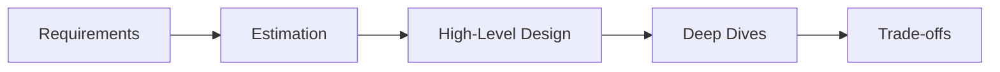
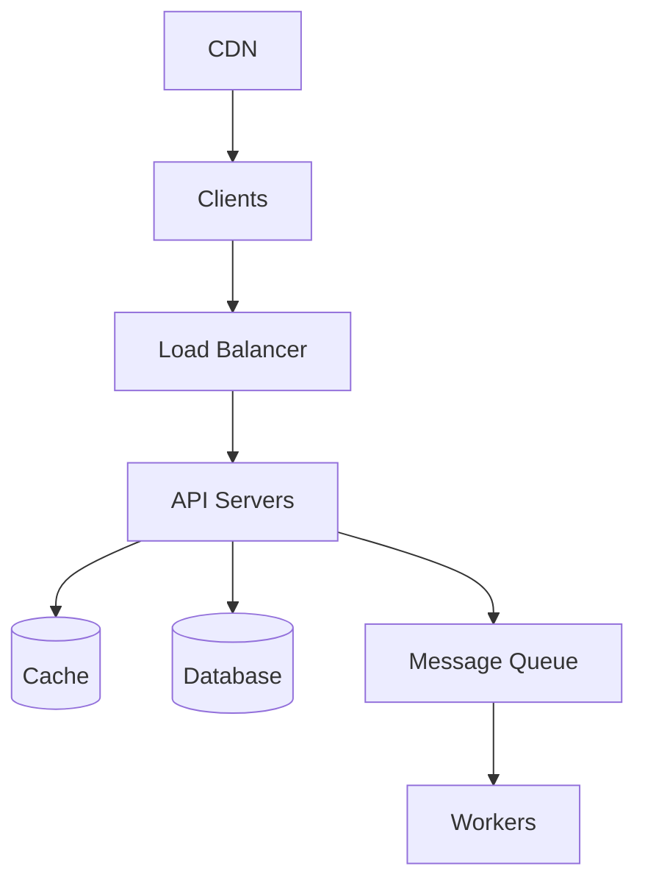
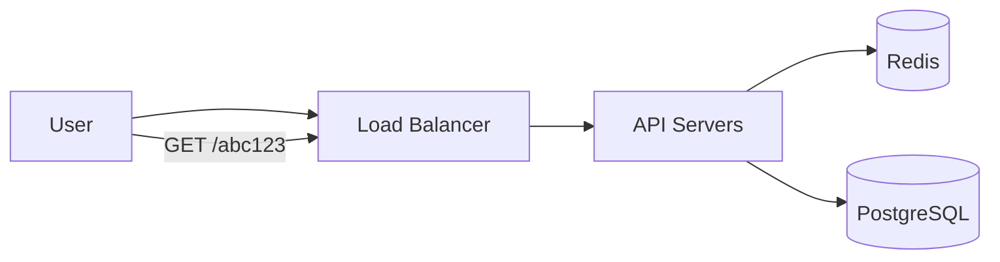

# 16. System Design Interview Guide

> Status: **Documented** — practical framework for structured interview answers.

[<- Back to master index](../README.md)

---

## Sub-topics

| # | Sub-topic | Status |
|---|-----------|--------|
| 16.1 | [Interview Framework](#161-interview-framework) | Done |
| 16.2 | [Requirements Gathering](#162-requirements-gathering) | Done |
| 16.3 | [Back-of-Envelope Estimation](#163-back-of-envelope-estimation) | Done |
| 16.4 | [High-Level Design](#164-high-level-design) | Done |
| 16.5 | [Deep Dives](#165-deep-dives) | Done |
| 16.6 | [Trade-offs and Failure Modes](#166-trade-offs-and-failure-modes) | Done |
| 16.7 | [Sample Walkthrough: URL Shortener](#167-sample-walkthrough-url-shortener) | Done |

---

## Overview

System design interviews test whether you can **structure ambiguity** — turn a vague prompt into a scalable architecture, explain trade-offs, and adapt when the interviewer steers deeper. Strong candidates don't jump to technology names; they **clarify scope**, **estimate scale**, **draw boxes**, then **justify decisions**.

This chapter provides a repeatable framework used across FAANG-style and senior engineering interviews, plus a full walkthrough you can practice aloud in 35–45 minutes.



---

## 16.1 Interview Framework


### What is it?

A **time-boxed structure** for the 45–60 minute system design interview:

| Phase | Time | Goal |
|-------|------|------|
| **Clarify** | 5–8 min | Functional + non-functional requirements, constraints |
| **Estimate** | 3–5 min | QPS, storage, bandwidth — sanity-check feasibility |
| **High-level design** | 10–15 min | Major components, data flow, API sketch |
| **Deep dive** | 15–20 min | 1–2 areas interviewer cares about (DB, cache, scale) |
| **Wrap-up** | 3–5 min | Bottlenecks, failure modes, monitoring, future work |

### Why it matters

Interviewers evaluate **communication** and **judgment**, not memorized diagrams. A clear framework prevents rambling, shows seniority, and leaves room for follow-up questions.

### How it works

1. **Repeat the problem** in your own words — confirms alignment.
2. **Ask questions** before designing — scope beats premature optimization.
3. **Draw** (whiteboard or shared doc) — boxes for services, arrows for data flow.
4. **Name trade-offs** whenever you choose — "Redis here for speed, but we accept eventual consistency."
5. **Invite feedback** — "Should I go deeper on storage or the read path?"

### When to use

- Any open-ended design prompt: Twitter feed, Uber, rate limiter, chat, payment system.
- Senior loops where "why not X?" follow-ups are expected.

### Trade-offs / Pitfalls

- **Skipping requirements** — designing YouTube when they wanted a photo upload API.
- **Technology bingo** — "Kafka, Cassandra, Redis" without explaining why.
- **No single point of failure** — always mention redundancy for critical paths.
- **Ignoring the interviewer** — if they say "assume 1B users," rescale estimates.

---

## 16.2 Requirements Gathering


### What is it?

**Requirements gathering** splits the problem into what the system must **do** (functional) and how well it must **perform** (non-functional).

### Functional requirements (what)

Ask about core user journeys:

- Who are the users? (consumers, admins, internal services)
- What are the main operations? (create, read, update, delete, search)
- What is in scope vs. out of scope for this session?

**Example (URL shortener):**
- Shorten a long URL → receive short link
- Redirect short link → original URL
- Optional: custom alias, expiration, analytics

### Non-functional requirements (how well)

| Category | Questions to ask |
|----------|------------------|
| **Scale** | DAU (daily active users) / MAU (monthly active users)? Reads vs writes ratio? |
| **Latency** | p99 target? Real-time vs batch OK? |
| **Availability** | 99.9%? Acceptable downtime window? |
| **Consistency** | Strong or eventual? Stale reads OK? |
| **Durability** | Can we lose data? Retention period? |
| **Geography** | Single region or global? |
| **Security** | Auth? Abuse prevention? PII? |

### How it works

1. List 3–5 **must-have** functional requirements.
2. Confirm **scale assumptions** (even rough orders of magnitude).
3. State **defaults** for anything unanswered: "I'll assume eventual consistency unless we need strong."
4. Write requirements on the board — reference them when justifying design.

### Trade-offs / Pitfalls

- Asking 20 questions — 5–8 targeted questions is enough.
- Forgetting **read/write ratio** — drives cache vs DB focus.
- Assuming features not mentioned (social graph, ML ranking) without asking.

---

## 16.3 Back-of-Envelope Estimation


### What is it?

**Back-of-envelope estimation** converts user scale into engineering numbers: QPS, storage, bandwidth, and cache size.

### Why it matters

Estimates justify sharding, caching, and async processing. They show you think about production scale, not toy systems.

### Useful constants

| Assumption | Value |
|------------|-------|
| Seconds per day | ~86,400 (~100K for quick math) |
| Requests per user per day | Varies — ask or assume 10–50 for active apps |
| Peak/average multiplier | 2–10× (use 5× if unsure) |
| Text metadata per record | ~500 bytes – 2 KB |
| Image average | 200 KB – 2 MB |
| 1 million | 10⁶ |
| 1 billion | 10⁹ |

### How it works

**Example: URL shortener — 100M new URLs/month, 10:1 read:write**

```text
Writes: 100M / (30 × 86,400) ≈ 40 writes/sec average
        Peak (5×): ~200 writes/sec

Reads:  200 × 10 = 2,000 reads/sec peak

Storage (5 years, 500 bytes/URL):
        100M × 12 × 5 = 6B URLs
        6B × 500 B ≈ 3 TB metadata

Bandwidth (redirect response ~500 B):
        2,000 × 500 B ≈ 1 MB/sec peak egress (modest)
```

1. Compute **average QPS** from DAU or monthly volume.
2. Apply **peak multiplier**.
3. Estimate **storage** = records × size × retention.
4. Estimate **bandwidth** = QPS × payload size.
5. Sanity-check: "3 TB fits on one modern DB node; sharding not needed yet at this scale."

**Scale-out math:** per-instance **requests per second (RPS)** ≈ `maxThreads / avg_response_time` (see [4.2 Throughput](../04-distributed-system/README.md#42-throughput)). For extreme scale (e.g. 10M RPS), clarify edge vs origin load and layer CDN/cache/async — full walkthrough in [4.22](../04-distributed-system/README.md#422-capacity-planning).

**10M RPS interview checklist:** edge vs origin RPS? read/write ratio? payload → bandwidth? CDN/cache absorption? DB replicas/sharding? Kafka partitions? (formula in [6.5](../06-messaging-and-events/README.md#65-kafka)).

### When to use

- After requirements, before drawing architecture.
- When interviewer asks "how many servers?" or "do we need to shard?"

### Trade-offs / Pitfalls

- False precision — round aggressively; order of magnitude is the goal.
- Forgetting **replication factor** — storage × 3 for 3 replicas.
- Ignoring **index overhead** — indexes often add 20–50% storage.

---

## 16.4 High-Level Design


### What is it?

**High-level design (HLD)** is the first architecture diagram: clients, APIs, core services, data stores, caches, queues, and external dependencies — without implementation detail.

### Why it matters

HLD establishes shared vocabulary with the interviewer. Deep dives only make sense once everyone sees the same boxes.

### Standard building blocks



| Component | Typical use |
|-----------|-------------|
| **Load balancer** | Distribute traffic, health checks, TLS termination |
| **API layer** | Stateless app servers; business logic |
| **Cache** | Hot reads (Redis, Memcached) |
| **Database** | Source of truth (SQL or NoSQL by access pattern) |
| **Message queue** | Async work, decouple producers/consumers |
| **CDN** | Static assets, edge caching |
| **Object storage** | Files, images, videos (S3) |

### How it works

1. Sketch **client → entry point → services → storage**.
2. Define **API contract** (2–4 key endpoints).
3. Identify **data model** at a high level (main entities and relationships).
4. Mark **sync vs async** paths.
5. State what is **stateless** (easy to scale horizontally).

### API sketch example

```text
POST /api/v1/urls     { "long_url": "..." }  → { "short_url": "..." }
GET  /{short_code}                         → 302 redirect
```

### Trade-offs / Pitfalls

- Over-engineering HLD (10 microservices for 100 QPS).
- No data flow for the **happy path** — always walk through one request.
- Forgetting **idempotency** on write APIs when retries matter.

---

## 16.5 Deep Dives


### What is it?

**Deep dives** are where the interviewer probes one area: database schema, caching strategy, fan-out, sharding, consistency, or a specific bottleneck.

### Why it matters

Senior candidates distinguish themselves here — not by knowing every product, but by **reasoning from first principles**.

### Common deep-dive topics

| Area | What to cover |
|------|----------------|
| **Database** | Schema, indexes, replication, sharding key, SQL vs NoSQL |
| **Caching** | What to cache, TTL, invalidation, stampede protection |
| **Scaling reads** | Replicas, cache, CDN, read-through |
| **Scaling writes** | Sharding, partitioning, async queues |
| **Feed/timeline** | Fan-out on write vs fan-out on read |
| **Search** | Inverted index, Elasticsearch, denormalized index |
| **Real-time** | WebSockets, SSE, pub/sub, long polling trade-offs |
| **Consistency** | CAP choice, quorum, eventual + conflict resolution |

### How it works

1. **Listen** for interviewer cues: "How would you handle hot keys?"
2. **Propose** one approach with trade-offs.
3. **Iterate** if challenged: "We could add a local near-cache in front of Redis."
4. **Reference** repo chapters: caching patterns (Ch. 3), distributed DB (Ch. 5), messaging (Ch. 6).

### Trade-offs / Pitfalls

- Defending a bad choice — change your mind when given new constraints (shows maturity).
- Deep diving everything — pick 1–2 areas thoroughly.
- No mention of **monitoring** — metrics, alerts, SLOs strengthen answers.

---

## 16.6 Trade-offs and Failure Modes


### What is it?

Every design choice has a **trade-off**. **Failure mode analysis** shows you think about production, not just happy paths.

### Why it matters

Interviewers often end with: "What breaks first?" or "What if the cache goes down?" Strong answers demonstrate operational thinking.

### Framework for trade-offs

Use explicit contrasts:

- **Consistency vs availability** (CAP during partition)
- **Latency vs durability** (sync vs async replication)
- **Simplicity vs scalability** (monolith vs microservices)
- **Cost vs performance** (more cache memory vs more DB replicas)
- **Freshness vs load** (short TTL vs DB pressure)

### Common failure modes

| Failure | Mitigation |
|---------|------------|
| **Single DB overload** | Read replicas, cache, connection pooling |
| **Cache stampede** | Single-flight, jittered TTL, stale-while-revalidate |
| **Hot partition / hot key** | Key splitting, local cache, dedicated shard |
| **Cascade failure** | Circuit breaker, timeouts, bulkheads |
| **Queue backlog** | Backpressure, scale consumers, DLQ |
| **Region outage** | Multi-AZ, multi-region DR, DNS failover |

### How it works

1. Name the **weakest link** in your design (often DB or single service).
2. Propose **detection** (health checks, latency alerts).
3. Propose **mitigation** (redundancy, degradation, queue buffering).
4. Mention **graceful degradation**: "If recommendations fail, show popular items instead."

### Trade-offs / Pitfalls

- Claiming "no failures" — everything fails; plan for it.
- Only technical failures — mention **bad deploys**, **traffic spikes**, **operator error**.
- No **rollback** strategy for schema or API changes.

---

## 16.7 Sample Walkthrough: URL Shortener


### Problem

Design a URL shortening service like `bit.ly`. Users submit long URLs and receive short links. Visiting a short link redirects to the original URL.

### Step 1 — Requirements (5 min)

**Functional:**
- Create short URL from long URL
- Redirect short code → long URL
- Optional: link expiration

**Non-functional (assumed):**
- 100M new URLs/month
- Read:write ≈ 10:1
- Redirect latency < 100 ms p99
- 99.9% availability
- Links persist 5 years unless expired

**Out of scope:** User accounts, detailed analytics dashboard

### Step 2 — Estimation (3 min)

```text
Write QPS: 100M / 2.6M sec ≈ 40 avg → ~200 peak
Read QPS:  ~2,000 peak
Storage:   6B URLs × 500 B ≈ 3 TB (5 years)
```

Single-region deployment is feasible; sharding optional until much larger.

### Step 3 — High-level design (10 min)



**API:**
- `POST /api/v1/urls` — create mapping
- `GET /{code}` — HTTP 302 redirect

**Data model:**

```text
urls (
  id          BIGSERIAL PK,
  short_code  VARCHAR(8) UNIQUE,
  long_url    TEXT,
  created_at  TIMESTAMP,
  expires_at  TIMESTAMP NULL
)
```

**Short code generation:**
- Base62 encode of auto-increment ID, or
- Hash long URL + truncate (check collision), or
- Random 7-char string + unique constraint

### Step 4 — Deep dives (15 min)

**Read path (critical — 10× traffic):**
1. `GET /{code}` hits API.
2. Check **Redis** `code → long_url`.
3. On miss: query **PostgreSQL**, populate cache (TTL 24h).
4. Return **302 redirect** (browser follows).

**Write path:**
1. Validate URL, generate unique `short_code`.
2. Insert into PostgreSQL (source of truth).
3. Optionally warm cache.

**Caching:** Cache-aside pattern (see [Ch. 3](../03-caching/README.md)). Add TTL jitter to avoid avalanche.

**Scaling:**
- API servers: stateless, horizontal scale behind LB.
- DB: read replica if PostgreSQL CPU bound; partition by `short_code` hash if storage > single node.
- Redis: cluster mode for memory > single node.

### Step 5 — Trade-offs and failures (5 min)

| Decision | Trade-off |
|----------|-----------|
| PostgreSQL vs NoSQL | SQL: strong uniqueness on `short_code`; NoSQL: easier horizontal scale at huge volume |
| 302 vs 301 redirect | 302 allows changing destination; 301 better for SEO/cache |
| Random code vs ID-based | Random: non-guessable; ID-based: predictable unless salted |

**Failures:**
- **Redis down:** fall through to DB (higher latency, still works).
- **DB primary down:** failover to replica; brief write unavailability.
- **Hot link:** single key in Redis — use local near-cache or replicate key.

**Monitoring:** redirect p99, cache hit ratio, create error rate, DB connection pool saturation.

---

[<- Back to master index](../README.md)
